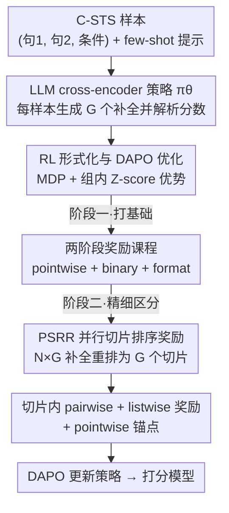

# PoLi-RL: A Point-to-List Reinforcement Learning Framework for Conditional Semantic Textual Similarity

**会议**: ICLR 2026  
**OpenReview**: [https://openreview.net/forum?id=sLcRCH1U68](https://openreview.net/forum?id=sLcRCH1U68)  
**代码**: https://github.com/ZBWpro/PoLi-RL  
**领域**: 强化学习 / LLM 对齐 / 语义相似度  
**关键词**: 条件语义相似度, 强化学习, 排序奖励, 课程学习, cross-encoder

## 一句话总结
本文首次把强化学习引入条件语义文本相似度（C-STS）任务，提出一个"从点到列表"的两阶段课程式 RL 框架 PoLi-RL，并设计并行切片排序奖励（PSRR）把粗粒度的批级排序信号拆成对每条补全都精确的奖励，让一个 8B 模型在官方 C-STS 上做到 Spearman 48.18，超过 GPT-4o 和 DeepSeek-R1，刷新 cross-encoder SOTA。

## 研究背景与动机
**领域现状**：语义文本相似度（STS）是计算语言学的核心任务，但传统 STS 的"相似"定义带有主观性、天然有歧义。条件语义相似度（C-STS）通过给定一句自然语言条件（如"球员与篮筐的距离" vs "球员的动作"）来消除歧义——同一对句子在不同条件下相似度可以从高变低。这要求模型做超越表面语义的细粒度推理。现有 C-STS 方法主要有 Bi-encoder、Tri-encoder、Cross-encoder 三类，但几乎都停留在判别式模型，没能吃到 LLM + RL 的红利。

**现有痛点**：把 LLM 用到 C-STS 上目前只有两种粗糙做法——直接 few-shot 推理（连 SOTA 闭源模型都打不出好分数），或把 LLM 当特征抽取器生成 embedding（本质还是判别式范式）。没有人做过端到端、基于 LLM 的 cross-encoder，更没有人把 RL 引进来。

**核心矛盾**：C-STS 的评测指标是 Spearman 秩相关系数，它是基于排序的、**不可微**的；传统 SFT 只能用 MSE 这类损失间接、近似地优化它，训练目标和评测目标对不齐。RL 天然能直接优化不可微的排序奖励，又能用显式奖励引导推理过程，按理说是最契合的范式。

**切入角度的障碍**：但作者发现，把 listwise 排序奖励（如直接对整个 batch 的补全算 Spearman）朴素地塞进 RL，效果几乎和 few-shot 持平（图 1）。原因有二：① 排序目标对一个还没掌握基本打分规则的模型来说太复杂，容易训练崩溃；② 在整个 batch 上算一个标量奖励太粗，少数差补全会连累好补全，无法做精确的信用分配（credit assignment）。

**核心 idea**：用"先点后列表"的课程把任务难度拆开——先用简单的 pointwise 奖励教会模型基本打分，再过渡到融合 pointwise/pairwise/listwise 的混合奖励做精细区分；同时用并行切片机制把粗粒度的批级排序奖励，拆成对每条补全都精确、有区分度的信号。

## 方法详解

### 整体框架
PoLi-RL 要解决的是：如何用 RL 训练一个端到端、基于 LLM 的 cross-encoder，让它在 C-STS 上的打分排序与人类标注高度一致。整体可以看成"一个策略模型 + 两阶段奖励课程 + 一个并行切片奖励机制"的流水线。

输入是一条 C-STS 样本 $(t_1, t_2, c)$（两段文本 + 条件），拼成统一 prompt $p=[I, E, x]$（指令 + K 个 few-shot 示例 + 查询）。策略模型 $\pi_\theta$（基于 Qwen3）对每条样本生成 $G$ 个补全，从中解析出预测分数 $\tilde y$。整个生成被建模成一个 MDP：每步生成一个 token，终端才给奖励，再用 DAPO（GRPO 的改进版）做策略更新。训练分两阶段：阶段一用 pointwise + binary + format 奖励把"基本打分规则"打牢；阶段二切换到由 PSRR 机制支撑的混合奖励（pointwise 锚点 + pairwise + listwise），把模型对细微语义差异的辨别力磨出来。

### 关键设计

**1. RL 形式化与 DAPO 优化：把不可微的 Spearman 变成可直接优化的奖励**

这一步针对"SFT 只能用 MSE 间接近似 Spearman、训练目标和评测目标对不齐"的痛点。作者把 C-STS 建成 MDP $M=(S,A,T,R,\gamma)$：agent 是 LLM 策略 $\pi_\theta$，状态 $s_t=(p, o_{<t})$ 是已生成的 token 序列，动作 $a_t$ 是选下一个 token，转移确定，采用终端奖励 $R_T=R(x,y,o)$（整条序列生成完才给），并把折扣 $\gamma=1$ 以便终端奖励无衰减地回传到每个贡献 token。优化目标是最大化期望奖励 $\theta^*=\arg\max_\theta \mathbb{E}_{(x,y)\sim D, o\sim\pi_\theta(p)}[R(x,y,o)]$。

具体优化器用 DAPO（GRPO 的扩展）：对每条样本生成 $G$ 个补全，各算标量奖励 $r_i$，优势通过组内 Z-score 归一化得到 $\hat A_i=\frac{r_i-\mathrm{mean}(\{r_i\})}{\mathrm{std}(\{r_i\})+\epsilon}$。这样奖励函数可以任意设计成与 Spearman 强相关的排序奖励，直接朝评测指标优化，而不像 MSE 那样隔靴搔痒。这是后面所有奖励设计能生效的底座。

**2. 两阶段奖励课程：先点后列表，避免直接学排序而崩溃**

这一步针对"朴素 listwise RL 效果≈few-shot、甚至训练崩溃"的痛点。核心观察是：排序目标对还没学会基本打分的模型太难，得先打地基。

阶段一（Foundational Skill Acquisition）用三项加权奖励 $R_{S1}=\lambda_1 R_{pointwise}+\lambda_2 R_{binary}+\lambda_3 R_{format}$ 教模型基本打分规则。其中 pointwise 准确率奖励衡量预测分与真值的归一化距离 $R_{pointwise}=1-\frac{|\tilde y_j-y_j|}{\max(Y)-\min(Y)}$（标签 1–5，分母为 4）。为防止模型偷懒收敛到中间安全分，加了二值判断奖励：按 C-STS 准则"分数≥3 算相似、≤2 算不相似"，预测与真值同侧得 1、否则 0，逼模型先掌握"相似/不相似"这个最基本的二分类。format 奖励保证输出格式（"yes/no" + 括号里的分数）。

阶段二（Fine-Grained Semantic Distinction）在打好的基础上换成混合奖励 $R_{S2}=\mu_1 R_{pointwise}+\mu_2 R_{pairwise}+\mu_3 R_{listwise}$：保留 pointwise 作为稳健锚点，再叠加 pairwise/listwise 排序奖励磨细粒度辨别力。消融显示这个课程是必需的——阶段一就已经比 few-shot 高 6.87 分，full 模型再涨 3.41 分；而朴素 listwise RL 只涨 0.29 分。

**3. PSRR 并行切片排序奖励：把批级粗奖励拆成对每条补全都精确的信号**

这一步针对"在整个 batch 上算一个标量排序奖励太粗、无法精确分配信用"的痛点，是全文最核心的创新。PSRR 用两级分解重组奖励计算。

第一级是"并行切片"：对一个含 $N$ 条样本的 batch，每条样本生成 $G$ 个补全，解析出 $N\times G$ 个预测分。不再把它们当成一个扁平列表，而是组织成 $G$ 个"并行切片"，第 $j$ 个切片 $Y^j_{pred}=\{\tilde y_{1,j},\tilde y_{2,j},\dots,\tilde y_{N,j}\}$ 取自所有样本的第 $j$ 个补全。优势计算沿"切片"方向（同一样本的 $G$ 个补全之间），排序奖励则在每个切片内部（不同样本的同序补全之间）算——两条正交的轴让每条补全都拿到针对自身相对表现的专属信号。

第二级是切片内对每条补全单独算秩差，而非给整个切片一个标量。其中 **listwise 奖励**用预测秩与真值秩的归一化差：$R^{listwise}_{i,j}=1-\frac{|\mathrm{Rank}(\tilde y_{i,j}, Y^j_{pred})-\mathrm{Rank}(y_i, Y_{true})|}{N-1}$，提供切片内的全局排序视角。**pairwise 奖励**则利用 C-STS 数据集的成对结构（相邻样本共享同一对句子、只换条件、且标签满足 $y_{high}\ge y_{low}$）：定义预测差 $\Delta_{pred}=\tilde y_{i,j}-\tilde y_{i+1,j}$、真值差 $\Delta_{true}=y_i-y_{i+1}$，对严格有序对（$\Delta_{true}\ne0$）若方向一致给基础奖励 $R_{base}$ 再按预测误差幅度扣分、方向错给 0，对平局对（$\Delta_{true}=0$）则直接最小化 $|\Delta_{pred}|$。由于切片需要足够大的 $N$ 才有稳定的排序信号，作者用梯度累积：先生成全部 $N\times G$ 补全、组成切片全局算奖励和优势，再分小批次顺序前向、累积多次反传后做一次优化器更新，从而在有限显存下吃到丰富的排序信号。

### 损失函数 / 训练策略
策略更新用 DAPO 目标：
$$J_{DAPO}(\theta)=\mathbb{E}_{(x,y)\sim D,\{o_i\}\sim\pi_\theta(\cdot|p)}\left[\frac{1}{\sum_{i=1}^G|o_i|}\sum_{i=1}^G\sum_{t=1}^{|o_i|}\frac{\pi_\theta(o_{i,t}|p,o_{i,<t})}{[\pi_\theta(o_{i,t}|p,o_{i,<t})]_{nograd}}\hat A_i\right]$$
其中 $[\cdot]_{nograd}$ 截断分母梯度、只更新分子。采用 on-policy 采样。骨干为 Qwen3（0.6B / 4B / 8B），用 ms-swift 框架训练。阶段二默认切片大小 $N=24$，奖励权重 $(\mu_1,\mu_2,\mu_3)=(1.0,1.5,1.0)$ 时最优。

## 实验关键数据

### 主实验
官方 C-STS 基准（Spearman/Pearson ×100）：

| 方法 | 范式 | 参数量 | Spearman ↑ | Pearson ↑ |
|------|------|--------|------------|-----------|
| SimCSE-Large | SFT | 355M | 43.2 | 43.2 |
| SEAVER（前 cross-encoder SOTA） | SFT | 355M | 43.83 | 43.81 |
| DeepSeek-R1 | Few-shot | - | 42.85 | 42.36 |
| GPT-4 | Few-shot | - | 43.6 | - |
| GPT-4o | Few-shot | - | 44.23 | 44.07 |
| Qwen3-0.6B | Few-shot | 0.6B | 25.25 | 25.19 |
| **PoLi-RL (Qwen3-0.6B)** | RL | 0.6B | **44.34** | 44.36 |
| **PoLi-RL (Qwen3-4B)** | RL | 4B | **46.23** | 46.19 |
| **PoLi-RL (Qwen3-8B)** | RL | 8B | **48.18** | 48.27 |

8B 模型刷新 cross-encoder SOTA，比 SEAVER 高 4.35 分，比 GPT-4o 高 3.95 分、比 DeepSeek-R1 高 5.33 分。尤其惊人的是 0.6B 小模型（44.34）就已超过 GPT-4（43.6）和前 SOTA SEAVER（43.83），说明增益来自"把推理过程对齐到排序目标"，而非单纯堆参数。

### 消融实验
两阶段课程与奖励组件（官方 C-STS）：

| 配置 | 奖励组件 | Spearman ↑ | Δ |
|------|---------|------------|---|
| (1) Few-shot | - | 37.9 | - |
| (2) Naive RL | Listwise | 38.19 | +0.29 vs (1) |
| (3) PoLi-RL Stage I | Pointwise + Binary | 44.77 | +6.87 vs (1) |
| (4) — w/o Binary | Pointwise | 44.19 | −0.58 vs (3) |
| (5) PoLi-RL Full | Pointwise + Pairwise + Listwise | 48.18 | +3.41 vs (3) |
| (6) — w/o Listwise | Pointwise + Pairwise | 46.71 | −1.47 vs (5) |
| (7) — w/o Pairwise | Pointwise + Listwise | 47.6 | −0.58 vs (5) |

切片大小 $N$ 的敏感性：$N=24$ 最优（48.18），16→47.16、32→47.44、40→47.18、48→46.78，呈倒 U 形——太小排序信号不稳，太大排序任务对模型太难。

### 关键发现
- **朴素 listwise RL 几乎无效（+0.29）**，证明问题不在 RL 本身而在"信号太复杂太粗"，两阶段课程 + PSRR 才是关键。
- **listwise 信号是最终精修阶段最重要的组件**：去掉它掉 1.47 分（最多），去掉 pairwise 掉 0.58 分；二值奖励在阶段一也有可见贡献（去掉掉 0.58）。
- **奖励权重鲁棒**：阶段二在 1:1:1 默认权重下就很强，pairwise 权重减半到 0.5 也只掉到 47.77，所有配置都稳定收敛、无训练崩溃。
- **跨域可迁移**：在 WMT-QE 2020（en-zh，连续 0–100 分、无成对结构）上只用 pointwise + PSRR-listwise 这个精简版，Spearman 从 SFT 的 50.90 涨到 54.33（+3.43），证明 PSRR 不是 C-STS 专用 trick，而是对一类 listwise 排序任务通用的对齐方案。
- **误差分布更健康**：PoLi-RL 在完美预测（误差=0）密度最高，同时显著压低大误差（≥2）的概率，减少了严重误判。

## 亮点与洞察
- **把"信用分配粒度"作为 RL 排序任务的核心瓶颈来攻**：很多工作直接上 listwise 奖励却效果平平，本文点破"批级标量奖励太粗"这一症结，并用并行切片这种结构化重组把奖励细化到每条补全——这个诊断本身就很有价值。
- **两条正交的轴设计很巧**：优势沿"同样本 G 补全"算、排序奖励沿"切片内不同样本"算，让同一批补全在两个维度上各司其职，避免好补全被差补全连累。
- **课程式 RL 的具体落地**：从 pointwise（学会打分）→ binary（学会相似/不相似）→ pairwise/listwise（学会细粒度排序）的难度阶梯，给"RL 训练崩溃"提供了一个可复用的稳定化思路。
- **PSRR 可迁移到其他多候选生成的排序任务**（如 QE、检索重排、RLHF 偏好排序），只要任务目标是全局排序一致性、且一次生成多个候选，就能套这个并行切片框架。

## 局限与展望
- **依赖成对数据结构**：pairwise 奖励吃的是 C-STS"相邻样本共享句对、标签有序"的特殊结构；在没有这种结构的任务上（如 WMT-QE）只能退化到 pointwise + listwise，pairwise 的红利拿不到。
- **切片大小敏感且需调**：$N$ 呈倒 U 形、最优值（24）需要搜索，换数据集/标签尺度可能要重调；且大 $N$ 依赖梯度累积，训练吞吐和显存有额外开销。
- **仍是终端奖励 + 解析分数**：依赖从生成文本里 Parse 出数值分，格式奖励能缓解但解析鲁棒性（如模型输出越界或格式漂移）未充分讨论。
- **任务范围**：目前验证集中在 C-STS 与一个 QE 子集，是否在更大规模、更多语言/领域的排序任务上同样稳定，还需更多证据。

## 相关工作与启发
- **vs 判别式 cross-encoder（SimCSE / SEAVER）**：它们用判别式 + SFT 做 C-STS、只能用 MSE 间接逼近 Spearman；本文用端到端 LLM cross-encoder + RL 直接优化排序奖励，0.6B 就反超 SEAVER，说明对齐训练目标比堆判别式表征更管用。
- **vs few-shot 闭源大模型（GPT-4o / DeepSeek-R1）**：闭源模型通用推理强，但在 few-shot 下难以严格对齐 C-STS 的细粒度量化标准；本文用 RL 显式优化这种对齐，让 8B 专用模型反超通用巨头，印证"专用对齐 > 规模"在这类条件排序任务上的成立。
- **vs 朴素 listwise RL / GRPO-DAPO 直接用**：直接把 Spearman 当 batch 级奖励几乎无效；本文的贡献正是在 DAPO 之上加了 PSRR 的奖励重组与两阶段课程，把"能不能用 RL 优化排序"变成"怎么把排序信号做得既精细又可学"。

## 评分
- 新颖性: ⭐⭐⭐⭐⭐ 首次将 RL 引入 C-STS，PSRR 并行切片奖励是对 listwise RL 信用分配问题的原创解法
- 实验充分度: ⭐⭐⭐⭐ 三种规模 + 消融 + 切片/权重敏感性 + 跨域 QE 验证较完整，但任务覆盖仍偏窄
- 写作质量: ⭐⭐⭐⭐⭐ 动机推导清晰，图 1/图 2 把"为什么朴素 RL 失败、PSRR 怎么修"讲得很直观
- 价值: ⭐⭐⭐⭐ PSRR 对多候选生成的排序对齐任务有通用迁移价值，方法可复用性强

<!-- RELATED:START -->

## 相关论文

- [\[ICLR 2026\] GRACE: A Language Model Framework for Explainable Inverse Reinforcement Learning](grace_a_language_model_framework_for_explainable_inverse_reinforcement_learning.md)
- [\[ICLR 2026\] Revolutionizing Reinforcement Learning Framework for Diffusion Large Language Models](revolutionizing_reinforcement_learning_framework_for_diffusion_large_language_mo.md)
- [\[CVPR 2026\] JoPPO: Hierarchical Photography Assessment via Contrastive Joint Conditional Probabilistic Reinforcement Learning](../../CVPR2026/reinforcement_learning/joppo_hierarchical_photography_assessment_via_contrastive_joint_conditional_prob.md)
- [\[ICLR 2026\] RL for Reasoning by Adaptively Revealing Rationales](rl_for_reasoning_by_adaptively_revealing_rationales.md)
- [\[NeurIPS 2025\] Enhancing Interpretability in Deep Reinforcement Learning through Semantic Clustering](../../NeurIPS2025/reinforcement_learning/enhancing_interpretability_in_deep_reinforcement_learning_through_semantic_clust.md)

<!-- RELATED:END -->
