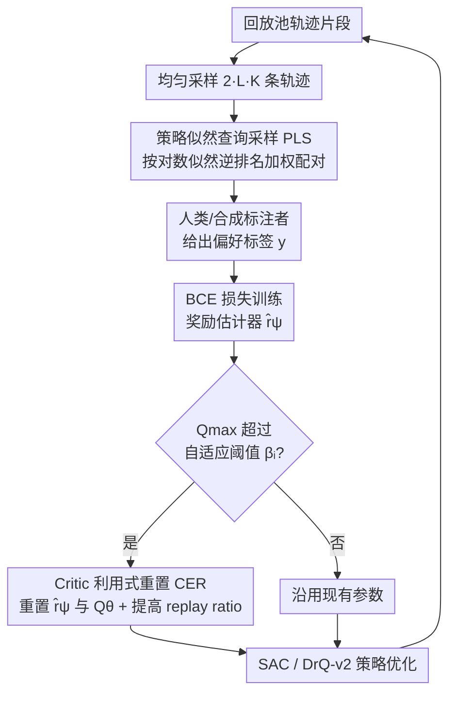

# Policy Likelihood-based Query Sampling and Critic-Exploited Reset for Efficient Preference-based Reinforcement Learning

**会议**: ICLR 2026  
**OpenReview**: [https://openreview.net/forum?id=ITeuGb2bYg](https://openreview.net/forum?id=ITeuGb2bYg)  
**代码**: https://github.com/JongKook-Heo/PoLiCER  
**领域**: 强化学习 / 偏好强化学习 (PbRL)  
**关键词**: 偏好强化学习, 查询采样, 策略似然, 原始偏差, 动态重置

## 一句话总结
PoLiCER 针对偏好强化学习的两大顽疾——查询与当前策略脱节、奖励估计器过拟合早期反馈——提出"按策略似然排名采样查询 + 用 critic 输出触发奖励/Q 网络重置"的组合拳，在 DMControl 与 Meta-World 的运动控制和机械臂任务上稳定超越 PEBBLE、QPA 等现有方法。

## 研究背景与动机
**领域现状**：偏好强化学习（PbRL）让人类不必手工设计奖励函数，而是通过比较两段轨迹"哪段更好"的二元反馈来训练智能体。标准做法是用 Bradley-Terry 模型把人类偏好拟合成一个奖励估计器 $\hat r_\psi$，再用这个学到的奖励驱动标准 RL（如 SAC）优化策略。由于人类标注成本高，如何在有限反馈下"问得更有价值"（query sampling）就成了核心议题。

**现有痛点**：PbRL 有两个由"反馈是顺序采集"引出的结构性问题。第一是**查询-策略错配**：很多采样策略从陈旧的经验回放池里挑轨迹，而这些轨迹在当前策略下出现概率极低，已经不能代表智能体现在的行为，问出来的偏好对当下的策略更新没有指导意义。第二是**原始偏差（primacy bias）**：神经网络在不断增长的数据集上训练时会过拟合最早见到的数据，奖励估计器因此被早期那些往往琐碎、模糊的反馈主导，整个训练过程都被带偏。

**核心矛盾**：针对第一个问题，前人 QPA（Hu et al., 2024）提出"近 on-policy 采样"（NOS），假设"时间上越近 = 越能代表当前策略"。但作者通过 Meta-World Sweep Into 的实验（图 1）发现：在目标位置会变的 goal-conditioned 任务里，**时间新近度是策略相关性的糟糕代理**——随着训练推进，"最近 30 个 episode"和"当前策略似然最高的 30 个 episode"之间的差距越拉越大。也就是说，新近 ≠ 策略相关。

**本文目标**：（1）找到一种真正衡量"轨迹有多代表当前策略"的采样信号；（2）抑制奖励估计器的原始偏差，且不能像"每轮全量重置"那样代价高昂、又留下 Q 网络残余偏差。

**核心 idea**：用轨迹在当前策略下的**对数似然排名**直接量化策略相关性来采样查询（PLS）；同时把 critic 输出当作奖励高估的探针，**只在必要时**动态重置奖励估计器和 Q 网络（CER）。两个组件各打一个痛点，组成 PoLiCER。

## 方法详解

### 整体框架
PoLiCER 在 PEBBLE 这类标准 PbRL 循环之上插入两个模块。每个反馈会话（feedback session）做两件事：先用 **PLS** 从回放池里挑出"最像当前策略"的轨迹配成偏好查询交给人类标注，再用 **CER** 监控 critic 输出、一旦发现奖励被高估就把奖励估计器和 Q 网络一起重置。奖励估计器更新后驱动底层 RL（SAC / DrQ-v2）继续优化策略，如此循环。两个模块分别拦截"问错问题"和"学偏奖励"两条出错路径。

### 关键设计

**1. 策略似然查询采样（PLS）：用对数似然逆排名替代时间新近度来挑查询**

这一设计直击"查询-策略错配"以及前人 NOS"以新近度为代理"的失效。PLS 不再问"这条轨迹是不是最近收集的"，而是直接计算它在当前策略 $\pi_\phi$ 下的平均对数似然来量化"它有多代表当前行为"：

$$l_i = \frac{1}{H}\sum_{(s_t,a_t)\sim\sigma_i}\log\pi_\phi(a_t\mid s_t).$$

似然越高，轨迹越贴合智能体当下的行为模式。但在连续控制里概率密度无界，原始似然对离群值极其敏感，直接拿 $l_i$ 当权重会被极端值带偏。作者借鉴优先经验回放的思路，**不用似然原值、而用似然的逆排名（inverse rank）$w_i$ 作为采样权重**，再用一个温度参数 $\alpha$ 控制分布锐度：

$$p(i) = w_i^{\alpha}\Big/\sum_j w_j^{\alpha}.$$

$\alpha$ 越大越偏向高似然轨迹，越小越接近均匀采样。具体流程是先均匀采 $2\times L\times K$ 条轨迹（$K$ 是要抽的查询数、$L$ 是放大系数），算似然、排名、按 $p(i)$ 加权采出 $2K$ 条，随机两两配对成偏好查询。相比需要训练奖励估计器集成、代价是 $N$ 倍前向的 disagreement sampling，PLS 只需 $2\times L\times K$ 次前向，几乎不增加训练时间，却能选出比 NOS 更贴合当前策略的查询。

**2. Critic 利用式重置（CER）：把 critic 输出当作高估探针，自适应触发重置**

光靠 PLS 会带来新麻烦：策略对齐采样把学习高度"局部化"，让策略分布收窄，反而加剧原始偏差导致的**奖励高估**。作者先用一个观察性实验佐证问题严重——"PEBBLE + 每轮重置奖励估计器"相比原始 PEBBLE 大幅降低高估并提升性能（图 2），高估率用 $\big(\hat R - R\big)/R\times 100\%$ 度量，不重置时高估稳定在约 150%。但"每轮全量重置"有两个毛病：频繁重置计算昂贵；且只重置奖励估计器，Q 网络里通过 TD 学习累积的残余偏差还在。

CER 的做法是把 critic 输出当作高估的间接指标——因为 critic 近似的是期望累计回报，被高估的奖励会顺着 TD 传到 Q 值上。CER 持续跟踪自上次重置以来所有梯度步里观测到的最大 critic 输出 $Q_{\max}$，在每个反馈会话检查：若 $Q_{\max}$ 超过当前阈值 $\beta_i$，就**同时重置奖励估计器 $r_\psi$ 和 Q 网络 $Q_\theta$**，否则照常训练。由于 PbRL 里奖励经 tanh 约束在 $[-1,1]$，critic 输出被界定在 $|\tfrac{r}{1-\gamma}|=100$（$\gamma=0.99$），这个有界性让阈值可以跨任务用统一尺度监控。

阈值设计成**单调递增并指数饱和**：

$$\beta_{i+1} = \beta_i + \delta\times\rho^{i},$$

其中 $\delta>0$ 是初始步长（按任务复杂度/动作维度调），$\rho\in(0,1)$ 控制衰减，$i$ 是已执行的重置次数，阈值最终饱和到 $\beta_0+\tfrac{\delta}{1-\rho}$。单调递增有两个用意：早期低阈值严抓高估，后期允许更高 Q 值以容纳真实的策略提升、同时减少不必要的重置以免过度打断训练。三条理论/经验依据支撑这个 schedule：重置能消除累积的原始偏差、critic 输出是高估的间接指标、合法的策略提升会让 Q 值单调上升——结合有界奖励，就能用单调阈值把"真提升"和"偏差导致的异常高估"区分开。

**3. 重置后的自适应 replay ratio + 时间数据增强（TA）：让重置后快速恢复、并提效反馈**

每次重置后，作者提高 replay ratio 以加速对更新后奖励估计的适应：早期保持低 replay ratio 以保护可塑性，后期逐步调高以提升样本效率；当反馈采集结束、奖励学习完成后，重置停止、replay ratio 回到 1。在此基础上再叠加时间数据增强（TA，比率 $\tau=20$），对反馈数据做扩增以进一步提升反馈效率。这两项是把前两个核心模块落到实处的训练侧配套，而非独立创新点，因此放在一起交代。

### 损失函数 / 训练策略
奖励估计器用 Bradley-Terry 模型把偏好概率建为
$$P_\psi(\sigma_1\succ\sigma_0)=\frac{\exp\big(\sum_{(s_t,a_t)\in\sigma_1}\hat r_\psi\big)}{\exp\big(\sum_{\sigma_1}\hat r_\psi\big)+\exp\big(\sum_{\sigma_0}\hat r_\psi\big)},$$
再用二元交叉熵拟合真实偏好标签 $y$：
$$L_\psi=-\mathbb{E}_{(\sigma_0,\sigma_1,y)\sim D}\big[y^{(0)}\log P_\psi(\sigma_0\succ\sigma_1)+y^{(1)}\log P_\psi(\sigma_1\succ\sigma_0)\big].$$
底层 RL 用 SAC（向量输入）或 DrQ-v2（像素输入），PoLiCER 作为通用模块挂在 PEBBLE 框架上。

## 实验关键数据

### 主实验
评测覆盖 DMControl 的 3 个运动任务与 Meta-World 的 4 个机械臂任务，对比 SAC（真实奖励上界）、PEBBLE、SURF、RUNE、MRN、QPA，每任务 10 次运行取均值。任务括号内为反馈预算（如 100/10 表示总反馈量/每会话反馈量）。

| 场景 | 任务 | PoLiCER | 关键对比 |
|------|------|---------|----------|
| DMControl 向量 | Walker / Cheetah / Humanoid | 与 QPA 均值相当但方差更低、鲁棒性更强 | 两者都显著超 PEBBLE |
| Meta-World 向量 | Door/Drawer/Hammer/Sweep | 成功率 >80%、方差低 | QPA 在 goal-conditioned 任务提升有限；Drawer Open 其他方法成功率 <60%、近半数 run 为 0% |
| 像素输入 | Window Open (800/20) | 约 80% 成功率，约为 PEBBLE 两倍 | QPA 在 Cheetah Run、Window Open 未能超 PEBBLE |
| 人类标注 | Walker Walk / Window Open | 反馈效率显著优于 PEBBLE，学到协调双足行走 | PEBBLE 智能体只会屈膝爬行 |

### 消融实验
按 PLS → CER → TA 逐步叠加，在 Walker Walk、Door Open、Drawer Open 上分析（图 6）。

| 配置 | 现象 | 说明 |
|------|------|------|
| PLS only | 性能大涨但 critic 高估 | 局部化策略引导窄化策略分布，加剧高估 |
| CER only | Drawer Open 成功率约 100% | 在任务成功与奖励错配的任务上单独 CER 最强 |
| PLS + CER | 多数环境有效互补 | Drawer Open 上互补性不总成立 |
| + TA | 小幅提升、降方差 | Door Open 略升均值、Drawer Open 降方差 |

### 关键发现
- **PLS 与 CER 各自独立都能带来大幅增益**，但组合不总是互补——在 Drawer Open 上，CER 单独反而最好，原因是该任务早中期"成功轨迹"与"失败轨迹"的真实奖励分布大幅重叠（图 7），早期偏好本身有噪声，PLS 会把噪声放大、CER 则能压制这些错配的早期偏好。
- **新近度的失效随任务复杂度加剧**：在像素任务里视觉复杂度进一步削弱了"新近 = 相关"的联系，QPA 因此在 Cheetah Run、Window Open 上失灵，而 PoLiCER 优势更明显，印证"策略相关性优先于新近度"在复杂视觉域更关键。
- **CER 比"每轮全量重置"更优**：既拿到更高回报、更低高估，又因为只在必要时触发而省下计算（附录 D.2、D.5）。

## 亮点与洞察
- **把"策略相关性"从代理量改成可直接计算的量**：前人用时间新近度近似，PoLiCER 用对数似然直接量化，并用逆排名规避连续控制里似然无界的数值陷阱——这是一个干净、便宜（只多 $2LK$ 次前向）又直击要害的替换。
- **用 critic 当"高估探针"触发重置**很巧妙：奖励高估难以直接观测，但它会顺着 TD 漏到 Q 值；CER 把 Q 值越界当信号，再加上奖励有界 + 策略提升使 Q 单调上升这两个先验，设计出单调饱和阈值，自然地把"真提升"和"偏差异常"分开。
- **诚实地暴露了组件冲突**：作者明确指出 PLS 会加剧高估、PLS+CER 不总互补，并用图 7 的奖励分布重叠给出机制解释，而非一味宣称"全都更好"，这种自洽分析对复现很有价值。
- 可迁移点：似然逆排名采样可用于任何"需要从回放池挑代表当前策略样本"的场景；critic-触发的动态重置思路也可推广到标准 RL 的可塑性维护。

## 局限与展望
- 作者承认 CER 因重置后提高 replay ratio，训练时间比基线略长，尤其叠加像素渲染开销；不过相对收益作者认为可接受。
- 实验主要用 B-Pref 的**合成标注者**，而合成偏好与人类偏好趋势可能不一致（作者自己也指出 Drawer Open 里合成奖励与任务成功错配）；虽补了 10 人的 human-in-the-loop，但规模和任务数有限。
- 阈值 schedule 引入 $\delta、\rho、\beta_0$ 等超参，$\delta$ 还需按任务复杂度调，跨任务自动化设定仍是开放问题（论文用附录 D.7 的敏感性分析佐证鲁棒性）。
- PLS 的 $\alpha$ 与 $L$、TA 的 $\tau$ 等也需调；组件间在某些任务（Drawer Open）的非互补性提示，何时该用哪个组件还缺乏先验判据。

## 相关工作与启发
- **vs QPA / NOS (Hu et al., 2024)**：QPA 用时间新近度近似策略相关性，本文证明在 goal-conditioned 与像素任务里新近度是糟糕代理，改用策略似然逆排名直接挑查询，鲁棒性（低方差）更好。
- **vs DUO (Feng et al., 2025)**：DUO 也利用策略似然，但用的是经回放池归一化的 rectified Z-score；本文用的是似然排名、不做缓冲区归一化，更简单且对离群值更稳。
- **vs PPE (Zhu et al., 2024)**：PPE 通过调整行为策略做探索来扩大策略相关区域覆盖；本文不改探索策略、不引入额外行为策略，直接从回放池按似然挑策略相关查询。
- **vs 周期性重置 (Nikishin et al., 2022; D'Oro et al., 2022)**：标准做法按固定间隔重置以缓解原始偏差，本文改为 critic 触发的自适应重置，且同时重置 Q 网络以消除 TD 累积的残余偏差，兼顾效果与计算效率。

## 评分
- 新颖性: ⭐⭐⭐⭐ 两个组件都是对已有问题的"换信号"式改进，思路清晰但非颠覆式
- 实验充分度: ⭐⭐⭐⭐ 覆盖向量/像素/人类标注三类场景，消融到位且诚实暴露冲突
- 写作质量: ⭐⭐⭐⭐ 动机层层递进，用图 1/2/7 把问题讲透
- 价值: ⭐⭐⭐⭐ 即插即用挂在 PEBBLE 上，对 PbRL 反馈效率有实用价值

<!-- RELATED:START -->

## 相关论文

- [\[ICML 2026\] Video-Based Optimal Transport for Feedback-Efficient Offline Preference-Based Reinforcement Learning](../../ICML2026/reinforcement_learning/video-based_optimal_transport_for_feedback-efficient_offline_preference-based_re.md)
- [\[ICLR 2026\] Preference-based Policy Optimization from Sparse-reward Offline Dataset](preference-based_policy_optimization_from_sparse-reward_offline_dataset.md)
- [\[ICLR 2026\] Q-learning with Posterior Sampling](q-learning_with_posterior_sampling.md)
- [\[ICLR 2026\] Flow Actor-Critic for Offline Reinforcement Learning (FAC)](flow_actor-critic_for_offline_reinforcement_learning.md)
- [\[ICLR 2026\] Chunking the Critic: A Transformer-based Soft Actor-Critic with N-Step Returns](chunking_the_critic_a_transformer-based_soft_actor-critic_with_n-step_returns.md)

<!-- RELATED:END -->
