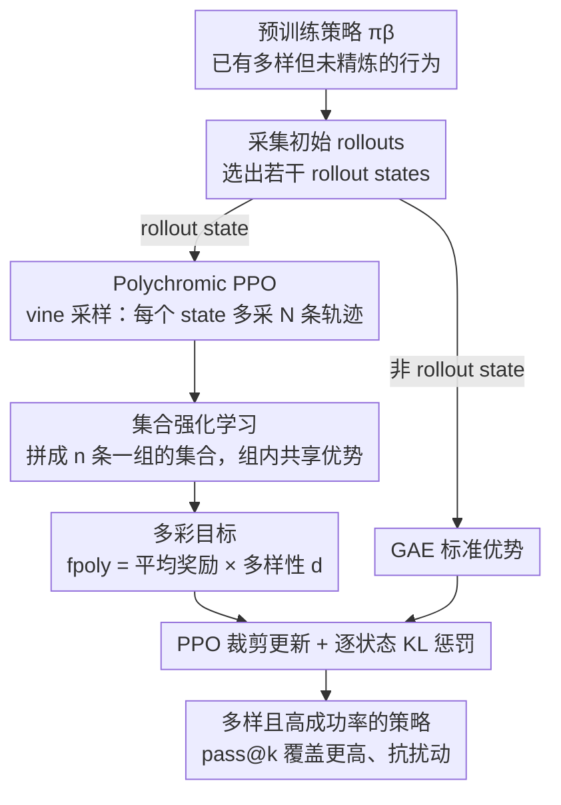

# Polychromic Objectives for Reinforcement Learning

**会议**: ICLR 2026  
**OpenReview**: [https://openreview.net/forum?id=zzTQISAGUp](https://openreview.net/forum?id=zzTQISAGUp)  
**代码**: 待确认  
**领域**: 强化学习 / RLFT / 探索  
**关键词**: 强化学习微调, 熵坍缩, 多样性探索, 集合强化学习, vine 采样, PPO

## 一句话总结
针对 RL 微调（RLFT）容易把策略坍缩到少数高奖励行为、丢掉预训练模型多样性的问题，本文提出"多彩目标（polychromic objective）"——把奖励和多样性绑在一起、只给"既成功又多样"的一整组轨迹打高分，并用 vine 采样 + 集合共享优势把它改造进 PPO（即 Polychromic PPO），在 BabyAI / Minigrid / Algorithmic Creativity 上同时拿到更高成功率、更高 pass@k 覆盖率和更强的扰动鲁棒性。

## 研究背景与动机
**领域现状**：强化学习微调（RLFT）已经是把预训练大模型对齐到下游任务的主流手段——LLM 的指令跟随、复杂推理基本都靠它。预训练分布本身在海量数据上训练，已经携带了一大批"有潜力但还没打磨好"的多样策略，RLFT 的作用本应是把这些策略里更可靠、更高回报的那些强化出来。

**现有痛点**：实践中 RLFT 经常出现**熵坍缩（entropy collapse）**——微调后的策略不是去扩展自己的能力库，而是把概率质量集中到预训练分布里已有的、容易被利用的少数高奖励行为上，牺牲掉了熵和多样性。最直观的体现是 pass@n 指标：当 n 较大时，RL 微调后的模型反而打不过原始预训练模型，因为后者保留了更高的多样性。而多样性恰恰对泛化到新任务、放大 test-time compute（多次采样取最优）至关重要。

**核心矛盾**：多样性和准确率之间存在内在 trade-off。标准 RL 的目标是"最大化单条最优轨迹的似然"，这天然会把概率质量挤向一两条赢家轨迹。而像熵 bonus 这类常规正则只能制造 token 级 / 局部的随机抖动，做不到语义级、轨迹级的探索，而且很容易被主 RL 目标盖过去。

**本文目标**：设计一个目标函数，让策略在 RLFT 过程中**主动探索并打磨预训练分布里那批多样轨迹**，而不是坍缩到几条上。

**切入角度**：作者的关键观察是——问题出在"优化对象的粒度"。只要优化目标定义在**单条**轨迹上，就一定偏好赢家通吃；要鼓励多样性，就得把目标定义在**一组**轨迹上，用集合级（multi-sample）的标准来评判好坏。

**核心 idea**：把 RL 的优化对象从"单条轨迹"升级为"一组独立采样的轨迹集合"（set RL），并在这个框架里设计一个只奖励"既包含成功又包含多样轨迹"的集合目标（polychromic objective），再把它落地成可优化的 Polychromic PPO。

## 方法详解

### 整体框架
方法围绕一句话展开：**不要单独评判一条轨迹的好坏，而是采一组轨迹、整组打分，让"成功 + 多样"的集合被整体强化**。

具体三层：(1) 提出 **set RL** 框架，把目标函数从 $R(\tau)$ 定义在单条轨迹上，改成 $f(s_0,\tau_{1:n})$ 定义在 $n$ 条独立采样的轨迹集合上，并证明集合内所有轨迹共享同一个优势项；(2) 在这个框架里实例化 **多彩目标** $f_{\text{poly}}$，把平均奖励和多样性相乘，只有同时成功又多样的集合才得高分；(3) 用 **vine 采样**避免"每个状态都展开 $n$ 个分支"的指数级开销，再把集合优势嵌进 PPO 的裁剪更新，得到 **Polychromic PPO**。

下面这张图给出从预训练策略到最终策略的一次迭代流程（rollout 状态走多彩目标这条主路，其余状态退回标准 PPO）：

### 关键设计

**1. 集合强化学习（set RL）：把优化对象从单条轨迹换成一整组轨迹**

标准 RL 解 $\max_\theta \mathbb{E}_{\tau\sim\pi_\theta}[R(\tau)]$，目标定义在单条轨迹上，因此天然只想抬高"那一条最优轨迹"的似然，这正是坍缩的根源。set RL 把问题改成 $\max_\theta \mathbb{E}_{\tau_{1:n}\sim\pi_\theta(\cdot|s_0)}[f(s_0,\tau_1,\dots,\tau_n)]$，目标定义在 $n$ 条**独立采样**的轨迹集合上。它仍可用策略梯度优化，梯度为 $\nabla_\theta\mathbb{E}[f] = \mathbb{E}\big[(f(s_0,\tau_{1:n})-\hat f(s_0))\sum_{i=1}^{n}\sum_{t}\nabla_\theta\log\pi_\theta(a_t^{(i)}|s_t^{(i)})\big]$，其中基线取 $\hat f(s_0)=\mathbb{E}_{\tau_{1:n}}[f(s_0,\tau_{1:n})]$。

关键特征是**集合内共享优势**：优势项 $f(s_0,\tau_{1:n})-\hat f(s_0)$ 对集合里的**每一条**轨迹都乘同一个因子。这和 Tang et al.(2025) 的 leave-one-out 式 trajectory-specific 基线（每条轨迹用其余轨迹算基线、做个体化信用分配）正好相反——set RL 故意**不区分集合内部的轨迹**，而是把不同集合作为整体相互比较。这一点至关重要：正因为共享，一条"还没拿到高奖励、但贡献了多样性"的探索轨迹也能被同一个正向信号抬起来，而不是被单独判负。作者还把性能差异引理（performance difference lemma）推广到 set RL，定义了集合价值函数 $V^\sharp_\pi$ 与集合 Q 函数 $Q^\sharp_\pi$（要求 $\gamma\in(0,\tfrac1n)$ 以保证有界），从而论证"在所有访问状态上让集合优势 $A^\sharp$ 为正即可单调改进"，这就为把 PPO 搬进 set RL 提供了理论依据。

**2. 多彩目标：奖励 × 多样性，只给"既成功又多样"的集合打高分**

有了 set RL 框架，还需要一个真正鼓励探索的集合目标。本文实例化的多彩目标为

$$f_{\text{poly}}(s,\tau_{1:n}) := \Big(\frac{1}{n}\sum_{i=1}^{n}R(\tau_i)\Big)\, d(s,\tau_{1:n}),$$

其中 $R(\tau_i)$ 是单条轨迹的折扣回报，$d(s,\tau_{1:n})$ 衡量这组轨迹的多样性，二者都归一化到 $[0,1]$。用**乘法**而不是加法是点睛之笔：只有当集合**既含成功轨迹（奖励项不为 0）又含多样轨迹（多样性项不为 0）**时才得高分，缺一项整组就被压低。配合 set RL 的共享优势，这个目标会同时抬高"成功行为"和"探索性轨迹"的似然——和以往把多样性当独立 bonus 加进奖励的做法不同，共享优势让那些**暂时还没拿到高奖励的探索轨迹**也被放大，推动策略去发现多样策略。目标对多样性度量本身是**无关的（agnostic）**：可以插 Vendi Score、分类器引导的多样性等；实验里 $d$ 取"集合中互异轨迹的比例"（Minigrid/BabyAI 中两条轨迹若访问的房间集合不同即算互异，Algorithmic Creativity 中以访问的节点集合区分，全相同则 $d=0$）。

**3. Polychromic PPO：vine 采样 + 集合优势，把目标改造得可实际优化**

直接按集合优势的定义实现，需要在**每个访问状态**都采 $n$ 个动作并各自向下展开，数据需求随时间步指数爆炸。为此本文改用 **vine 采样**：先在行为策略 $\pi_\beta$ 下采一批初始 rollouts，从访问过的状态里挑出一个子集 $\{s_1,\dots,s_p\}$ 作为 **rollout states**，在每个 rollout state $s_i$ 处重置环境、额外生成 $N$ 条轨迹（即"藤蔓 vines"）。这样只在选中的状态上获得"多条独立轨迹的集合"，避免了全树展开（代价是**要求环境可重置**，这也是方法的适用前提）。

在 rollout state 上，从 $N>n$ 条轨迹里组集合并估计多彩优势 $A^\sharp(s_t,a_t;f_{\text{poly}})=\frac1n\sum_i R(\tau_i)\,d(s_t,\tau_{1:n})-\hat V^\sharp(s_t;f_{\text{poly}})$；由于 PPO 需要的是**单动作**优势，就把"包含某动作的那个集合"的优势赋给该动作——于是同一集合里从 $s_t$ 出发的所有动作拿到相同的更新信号，正是 set RL 想要的。价值基线用蒙特卡洛估计 $\hat V^\sharp(s_t)=\frac1M\sum_{i}f_{\text{poly}}(s_t,\tau^{(i)}_{1:n})$。对于**非 rollout 状态**，更新退回标准 PPO，用 GAE 算优势。此外在每个访问状态都加一项逐状态 KL 惩罚 $D_{\text{KL}}(\pi_\beta(\cdot|s)\,\|\,\pi_\theta(\cdot|s))$ 以稳住训练。整套流程封进 PPO 的裁剪目标里迭代更新（见原文 Algorithm 1），并指出这些改动同样可移植到 REINFORCE 等其他策略梯度算法上。

### 损失函数 / 训练策略
- 沿用 PPO 的裁剪目标 $\mathbb{E}[\min(r_t\hat A,\ \mathrm{clip}(r_t,1-\epsilon,1+\epsilon)\hat A)]$，仅把 rollout state 上的 $\hat A$ 换成多彩集合优势，非 rollout state 仍用 GAE。
- rollout state 优势在组内共享（同号），探索性轨迹随之被抬高。
- 每个状态额外加逐状态 KL 惩罚，作者发现对稳定性有帮助。
- 训练前用专家示范预训练策略，再做 RLFT。

## 实验关键数据

在 BabyAI、Minigrid、Algorithmic Creativity 上评测，均为**长程、稀疏奖励**任务；对比 REINFORCE（带基线）、标准 PPO，以及给每个优势加 UCB 探索 bonus $\lambda_{\text{UCB}}\cdot\min\{1,N(s,a)^{-1/2}\}$ 的变体。

### 主实验
BabyAI / Minigrid 上的（平均回报, 成功率%），100 rollouts × 50 配置 × 3 seed：

| 环境 | 预训练 | REINFORCE | PPO | Poly-PPO（本文） | Poly-PPO w/ UCB |
|------|--------|-----------|-----|------------------|-----------------|
| Goto | (0.246, 34.2) | (0.533, 73.0) | (0.406, 46.2) | **(0.575, 80.2)** | (0.561, 76.2) |
| Pickup | (0.141, 21.4) | (0.259, 39.8) | (0.283, 33.4) | (0.452, 63.2) | **(0.486, 65.6)** |
| Bosslevel | (0.212, 20.6) | (0.266, 33.4) | (0.336, 38.8) | (0.378, 45.2) | **(0.379, 46.8)** |
| Four Rooms | (0.469, 70.4) | (0.639, 89.6) | (0.618, 89.2) | (0.666, 92.4) | **(0.667, 93.2)** |

Poly-PPO 在回报和成功率上持续匹配或超过最佳基线；UCB 与 Poly-PPO 互补，在 Pickup / Bosslevel 上叠加后还能再涨。

### 多样性 / 覆盖率与鲁棒性
- **pass@k**：Poly-PPO 的 pass rate 在几乎所有 k 上都 ≥ 预训练策略，并显著高于所有基线；其曲线一直涨到 $k\approx80$ 才饱和，而基线在 $k\approx20$ 就停了；Bosslevel 上随 k 增到 160，Poly-PPO 比基线高约 15% 覆盖。
- **Algorithmic Creativity（三角形发现）**：Poly-PPO 在多样性（unique 有效三角形数）和创造性（不在预训练数据中的 unique 有效三角形比例）上超过包括预训练在内的所有方法；validity 略低于 PPO 但远高于 REINFORCE（REINFORCE 虽多样但 validity@1 甚至低于预训练）。
- **状态扰动泛化（pass@1，初始状态被换到不同房间）**：

| 环境 | 预训练 | REINFORCE | PPO | Poly-PPO |
|------|--------|-----------|-----|----------|
| Goto | 30.2 | 41.3 | 21.1 | **60.6** |
| Pickup | 15.2 | 22.0 | 12.5 | **33.4** |
| Four Rooms | 65.0 | 82.7 | 15.3 | **88.7** |

PPO 在扰动下大幅崩坏（Four Rooms 仅 15.3），Poly-PPO 因保留了多样策略库而显著更稳。

### 关键发现
- **乘法式"奖励×多样性" + 共享优势**是核心：它让探索轨迹即便暂未成功也被抬高，从而扩大覆盖；纯加 UCB bonus 给基线只能在小 k 有限改善、大 k 即饱和。
- 成功率会掩盖覆盖差异——一个过拟合到部分配置的策略也能有高均值成功率，pass@k 才暴露真实差距。
- 论文还给出熵分析（bandit 设定下的一阶熵变化 + "scaffold value" 概念），刻画了在多彩目标下策略最容易在**哪些动作集合**上坍缩，为方法提供理论侧解释。

## 亮点与洞察
- **把"优化粒度"当成坍缩的根因**：很巧妙地指出只要目标定义在单条轨迹上就会赢家通吃，转而把目标搬到"轨迹集合"上，这个视角比"再加个多样性正则"更本质。
- **共享优势 vs 个体化信用分配**：故意不做 leave-one-out，让整组共用同号优势，是探索轨迹能被"扶上来"的关键机制，和直觉相反却恰好服务于多样性目标。
- **乘法目标**：奖励与多样性相乘而非相加，强制"两者都要有"，避免了加法下"高奖励低多样"或"高多样低奖励"骗分，这个 trick 可迁移到任何想要"双指标都不能塌"的目标设计。
- **对多样性度量解耦**：$d$ 可换成任意度量（Vendi、分类器引导等），方法是个通用模板而非单点 trick。

## 局限与展望
- **依赖环境可重置**：vine 采样要在 rollout state 上重置环境再采样，只适用于可重置的环境；对不可重置 / 真实世界在线场景不直接适用。
- **价值基线用无偏 MC 估计**，方差较大；作者承认可用有偏估计进一步降方差，留给未来工作。
- **validity 与多样性仍有 trade-off**：三角形发现里 Poly-PPO 的 validity 略低于纯 PPO，说明强调探索仍会让"单次正确率"付出一点代价。
- 实验集中在 grid-world / 算法创造性这类结构化任务，**尚未在大规模 LLM RLFT 上验证**，而那正是熵坍缩问题最受关注的场景；扩展到 LLM 推理是自然的下一步。

## 相关工作与启发
- **vs 熵 bonus 等正则**：熵 bonus 只产生 token 级 / 局部随机性，且易被主 RL 目标淹没；本文目标定义在轨迹集合上，鼓励的是语义 / 轨迹级的多样性。
- **vs 多目标 RL**：多目标 RL 仍把目标定义在单条轨迹上（只是奖励变成向量），本文则把目标定义在一组轨迹上，是不同的扩展方向。
- **vs Tang et al.(2025) 的 multi-sample 目标**：两者都用 n-sample 目标，但 Tang 用 trajectory-specific（leave-one-out）基线做个体化信用分配，本文用统一基线做集合级共享优势，目的正是不区分组内轨迹、整组提升多样性。
- **vs UCB 式探索 bonus**：UCB 给单动作加计数型 bonus，能小幅帮基线但大 k 即饱和；多彩目标从集合层面鼓励多样，覆盖率提升更持久，且二者可叠加。

## 评分
- 新颖性: ⭐⭐⭐⭐⭐ 「把 RL 目标从单轨迹搬到轨迹集合 + 乘法式多彩目标 + 共享优势」是干净且有理论支撑的新框架。
- 实验充分度: ⭐⭐⭐⭐ 三个环境、多基线、pass@k / 扰动 / 创造性多角度，但缺大规模 LLM 验证。
- 写作质量: ⭐⭐⭐⭐ 动机—框架—算法层层递进，理论（性能差异引理、熵分析）与算法衔接清晰。
- 价值: ⭐⭐⭐⭐ 直击 RLFT 熵坍缩这一痛点，思路对 LLM RLFT 有明显迁移潜力。

<!-- RELATED:START -->

## 相关论文

- [\[ICML 2025\] Optimizing Language Models for Inference Time Objectives using Reinforcement Learning](../../ICML2025/reinforcement_learning/optimizing_language_models_for_inference_time_objectives_using_reinforcement_lea.md)
- [\[AAAI 2026\] Revealing POMDPs: Qualitative and Quantitative Analysis for Parity Objectives](../../AAAI2026/reinforcement_learning/revealing_pomdps_qualitative_and_quantitative_analysis_for_parity_objectives.md)
- [\[ICLR 2026\] Understanding and Improving Hyperbolic Deep Reinforcement Learning](understanding_and_improving_hyperbolic_deep_reinforcement_learning.md)
- [\[ICLR 2026\] Parameter-Efficient Reinforcement Learning using Prefix Optimization](parameter-efficient_reinforcement_learning_using_prefix_optimization.md)
- [\[ICLR 2026\] ReTool: Reinforcement Learning for Strategic Tool Use in LLMs](retool_reinforcement_learning_for_strategic_tool_use_in_llms.md)

<!-- RELATED:END -->
