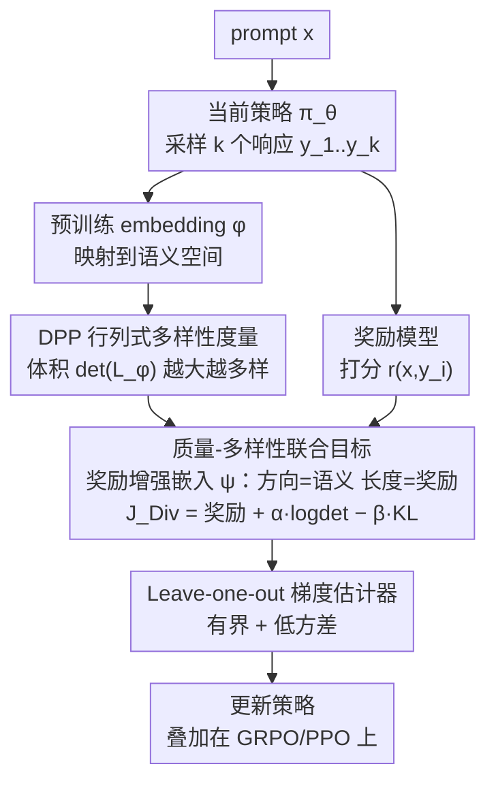

# Post-training Large Language Models for Diverse High-Quality Responses

**会议**: ICLR 2026  
**arXiv**: [2509.04784](https://arxiv.org/abs/2509.04784)  
**代码**: [https://github.com/fairytale9/diversity-quality-optimization](https://github.com/fairytale9/diversity-quality-optimization)  
**领域**: 强化学习  
**关键词**: 多样性, 行列式点过程, GRPO, 后训练, 质量-多样性权衡  

## 一句话总结
提出 DQO（Diversity Quality Optimization），基于行列式点过程（DPP）在语义嵌入空间中定义多样性度量，将其与奖励信号联合优化，使 LLM 后训练同时提升语义多样性和响应质量，可叠加在 GRPO/PPO 之上。

## 研究背景与动机

**领域现状**：LLM 后训练（RLHF/GRPO 等）能显著提升下游任务性能，但副作用是严重降低输出多样性——模型趋向于生成狭窄的"标准答案"，丧失探索多种解题路径和个性化风格的能力。

**现有痛点**：现有促进多样性的方法集中在推理端（温度缩放、top-k 采样），或仅关注词汇级别差异（token 熵正则化），无法恢复基础模型分布中缺失的模态，也不能捕捉语义层面的多样性。

**核心矛盾**：如何在训练阶段定义一个既计算高效又理论严谨的语义多样性度量，并与质量目标平衡？简单的成对距离度量容易导致退化——模型可能只学到两个广泛分离的聚类。

**本文目标**：(a) 定义语义级别的多样性度量；(b) 避免成对距离的聚类退化；(c) 在训练中联合优化质量和多样性。

**切入角度**：利用 DPP 的行列式定义多样性——嵌入向量张成的平行体体积越大，多样性越高。行列式天然惩罚线性相关（聚类），克服成对距离的退化问题。

**核心 idea**：用 DPP 行列式作为语义多样性度量，奖励作为嵌入向量的缩放因子，通过 leave-one-out 梯度估计稳定训练。

## 方法详解

### 整体框架
DQO 想解决的是"后训练让模型质量上去了、多样性却塌掉"这个矛盾，做法是在标准 RL 后训练目标里挂一项语义多样性奖励，整个流程仍套在 GRPO/PPO 框架里。对每个 prompt $x$，先用当前策略采样 $k$ 个响应 $y_{1:k}$，用预训练 embedding 模型 $\phi$ 把它们映射到语义空间。第一步用 **DPP 行列式多样性度量** 把这组语义向量张成的体积 $\det(L_\phi)$ 当作多样性得分；第二步在 **质量-多样性联合目标** 里把奖励经指数缩放折进嵌入向量长度（奖励增强嵌入 $\psi$），让"体积大"同时意味着"质量高 + 语义不同"；第三步用 **leave-one-out 梯度估计器** 把不稳的 $\log\det$ 目标换成有界、低方差的替代量，再回传更新策略。

### 关键设计

**1. DPP 行列式多样性度量：用"体积"而非"两两距离"刻画语义多样性**

直接的想法是拿响应之间的成对距离当多样性，但这容易被"伪多样性"骗过——模型只要学到两个互相远离的聚类，平均距离就很大，可实际答案只在两种模态里打转。本文改用 DPP 的行列式：把 $k$ 个响应嵌入张成的平行体的（平方）体积 $\det(L_\phi(y_{1:k}))$ 当作多样性得分。几何上，向量越线性无关、方向越铺得开，行列式越大；一旦它们落进同一个低维子空间（聚类），向量线性相关，行列式就趋近于零。正因为行列式对线性依赖敏感，它能识破"看似两两距离很大、实则挤在一个子空间里"的退化情况，这是成对距离度量做不到的。

**2. 质量-多样性联合目标：把奖励变成嵌入向量的长度，质量与多样性合到一个体积里**

有了多样性度量，下一步是让它和质量目标共存而不打架。本文在标准 RL 目标上加一项 DPP 多样性，得到

$$J_{Div}(\pi_\theta) = \mathbb{E}\Big[\textstyle\sum_i r(x,y_i) + \alpha \log\det(L_\phi(y_{1:k})) - \beta\, \text{KL}(\pi_\theta \| \pi_{ref})\Big]$$

其中 $\alpha$ 调质量-多样性的权衡，$\beta$ 是 KL 约束。这个目标的最优策略可写成 $\pi_{div}(y_{1:k}|x) \propto \det(L_\psi(x,y_{1:k}))$，关键在于这里的 Gram 矩阵用的是**奖励增强嵌入** $\psi(x,y) = \sqrt{\exp(r/\alpha)\,\pi_{ref}(y|x)} \cdot \phi(y)$：语义 $\phi(y)$ 决定向量的**方向**，奖励 $r$ 经指数缩放后决定向量的**长度**。于是"最大化体积"自然把两件事拧到一起——体积要大，向量既得长（奖励高、质量好）又得彼此正交（语义不同、多样性高）。这给了质量-多样性一个干净的几何解释，也和 D-最优实验设计（最大化信息矩阵行列式）理论上对齐。

**3. Leave-one-out 梯度估计器：给 $\log\det$ 加正则与基线，治住训练不稳定**

直接对 $\log\det(L)$ 求梯度有个硬伤：当响应趋于聚类、行列式接近零时，$\log\det$ 会冲向负无穷，梯度爆掉、训练崩溃。本文用一个有界且低方差的替代量

$$\log\frac{\det(L(y_{1:k})+I_k)}{\det(L(y_{-i})+I_{k-1})}$$

来替换原始 $\log\det$。加单位阵 $I_k$ 做正则，把数值钳在有界区间 $[0, \log(1+k)]$，根除负无穷问题（Lemma 1 给出有界性保证）；分母用去掉第 $i$ 个响应后的行列式 $\det(L(y_{-i})+I_{k-1})$ 当 leave-one-out 基线，扣掉与第 $i$ 个样本无关的部分，从而压低梯度方差。两者合起来同时解决了稳定性和方差，也让方法对采样数 $k$ 更鲁棒。

### 损失函数 / 训练策略
- 可叠加在 GRPO（推理任务）或 PPO（非推理任务）之上
- 超参数 $\alpha$ 控制质量-多样性权衡，$k$ 控制每个 prompt 的采样数
- 使用奖励模型（而非 outcome reward）评分，避免 reward hacking（模型先给正确答案再生成随机内容骗多样性分）

## 实验关键数据

### 主实验

| 方法 | Dolly distinct-4↑ | Dolly self-rouge↑ | Dolly pass@1↑ | Dolly pass@10↑ |
|------|------------------|-------------------|---------------|----------------|
| PPO | 0.64 | 0.49 | 5.65 | 8.39 |
| GRPO-likelihood | 0.70 | 0.54 | 5.86 | 8.50 |
| GRPO-entropy | 0.75 | 0.57 | 4.71 | 7.70 |
| **DQO** | **0.69** | **0.54** | **5.92** | **8.74** |

| 方法 | GSM8K distinct-4↑ | GSM8K self-rouge↑ | GSM8K pass@1↑ | GSM8K pass@10↑ |
|------|------------------|-------------------|---------------|----------------|
| GRPO | 0.32 | 0.21 | 76.8 | 87.9 |
| GRPO-likelihood | 0.86 | 0.59 | 50.9 | 80.4 |
| GRPO-entropy | 0.38 | 0.25 | 77.0 | 92.6 |
| **DQO** | **0.42** | **0.31** | **76.3** | **91.2** |

### 消融实验

| $\alpha$ | $k$ | distinct-4↑ | pass@1↑ | pass@10↑ |
|----------|-----|------------|---------|----------|
| 0 (PPO) | - | 0.64 | 5.65 | 8.39 |
| 0.5 | 4 | 0.69 | 5.84 | 8.79 |
| 1.0 | 4 | 0.69 | 5.92 | 8.74 |
| 2.0 | 4 | 0.75 | 5.27 | 7.86 |

### 关键发现
- DQO 是唯一在所有任务上同时保持高质量和高多样性的方法。GRPO-entropy 在 GSM8K 上多样性好但在 Dolly 上质量差
- DPP-determinant vs pairwise distance：城市推荐实验中，pairwise distance 导致两个聚类，determinant 产生真正广泛的多样性
- pass@n 随 n 增大时 DQO 优势更明显——多样性越高，大 n 下找到好答案的概率越高
- $\alpha$ 过大（如 2.0）会牺牲 pass@1 质量

## 亮点与洞察
- **DPP 行列式作为多样性度量**解决了成对距离的退化问题，理论上与 D-最优实验设计相连。这个度量可迁移到任何需要集合多样性的场景（推荐系统、主动学习等）。
- **leave-one-out 梯度估计器**的有界性保证（Lemma 1）使训练稳定且对 $k$ 鲁棒，是关键的工程贡献。
- 发现 outcome reward 容易被 reward hack（先答对再乱写），必须用奖励模型。

## 局限与展望
- 多样性依赖预训练 embedding 模型的质量，不同 embedding 可能导致不同结果
- $k$ 个响应需要同时采样和计算行列式，增加训练 GPU 开销
- 在推理任务（GSM8K）上多样性提升有限，可能因为正确答案本身多样性空间有限

## 相关工作与启发
- **vs GRPO-entropy (Yao et al.)**: token 级熵正则化无法捕捉语义多样性，且在非推理任务上质量下降严重
- **vs GRPO-likelihood (He et al.)**: 基于生成概率的多样性在推理任务上效果差
- **vs Chung et al.**: 基于 DPO 的成对嵌入距离加权，易退化为聚类

## 评分
- 新颖性: ⭐⭐⭐⭐ DPP 与 LLM 后训练结合，理论联系实验设计
- 实验充分度: ⭐⭐⭐⭐ 4 类任务，多个多样性指标，消融完整
- 写作质量: ⭐⭐⭐⭐ 几何解释清晰，与 D-最优设计的联系有启发性
- 价值: ⭐⭐⭐⭐ 对 LLM 后训练多样性问题有实用贡献

<!-- RELATED:START -->

## 相关论文

- [\[ICLR 2026\] Representation-Based Exploration for Language Models: From Test-Time to Post-Training](representation-based_exploration_for_language_models_from_test-time_to_post-trai.md)
- [\[ICLR 2026\] Using Reinforcement Learning to Train Large Language Models to Explain Human Decisions](using_reinforcement_learning_to_train_large_language_models_to_explain_human_dec.md)
- [\[ICLR 2026\] AutoQD: Automatic Discovery of Diverse Behaviors with Quality-Diversity Optimization](autoqd_automatic_discovery_of_diverse_behaviors_with_quality-diversity_optimizat.md)
- [\[ACL 2025\] MAPoRL: Multi-Agent Post-Co-Training for Collaborative Large Language Models with Reinforcement Learning](../../ACL2025/reinforcement_learning/maporl_multi-agent_post-co-training_for_collaborative_large_language_models_with.md)
- [\[ICLR 2026\] On Predictability of Reinforcement Learning Dynamics for Large Language Models](on_predictability_of_reinforcement_learning_dynamics_for_large_language_models.md)

<!-- RELATED:END -->
