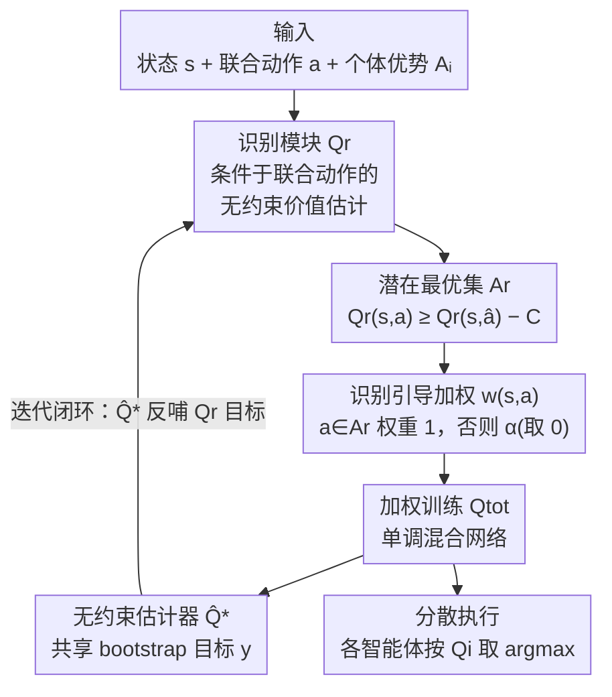

# Potentially Optimal Joint Actions Recognition for Cooperative Multi-Agent Reinforcement Learning

**会议**: ICLR 2026  
**OpenReview**: [https://openreview.net/forum?id=YQ1muQBDV4](https://openreview.net/forum?id=YQ1muQBDV4)  
**代码**: 待确认  
**领域**: 强化学习 / 多智能体  
**关键词**: 合作式 MARL、价值分解、加权训练、最优联合动作、QMIX

## 一句话总结
本文提出 POW（Potentially Optimal Joint Actions Weighting），用一个显式条件于联合动作的识别模块 $Q_r$ 迭代地"认出"一组潜在最优联合动作并给它们更高训练权重，从理论上保证恢复真实最优策略，弥合了 WQMIX 系列"理论承诺"与"启发式近似"之间的鸿沟，在矩阵博弈、捕食者-猎物、SMAC/SMACv2、highway-env 等任务上稳定超越基于价值的 SOTA。

## 研究背景与动机
**领域现状**：在合作式多智能体强化学习（MARL）里，CTDE（集中式训练、分散式执行）是主流范式。价值分解方法把联合动作价值 $Q_{tot}(\tau, a)$ 拆成每个智能体的个体效用 $Q_i(\tau_i, a_i)$，再用一个混合网络组合起来。QMIX 通过强制单调混合（$\partial Q_{tot}/\partial Q_i \geq 0$）来满足 IGM 性质（individual-global-max，即对 $Q_{tot}$ 取 argmax 等价于每个智能体各自取 argmax），从而支持分散执行，并在 SMAC 上取得了强结果。

**现有痛点**：单调性约束虽然保证了 IGM，却严重限制了价值函数的表达能力——它无法表示许多"非单调"的联合动作价值，于是在奖励结构非单调的任务里常常收敛到次优策略。一个智能体即便选了对的动作，只要队友选错，它也会受到错误的惩罚信号，导致信用分配（credit assignment）失败。

**核心矛盾**：WQMIX 早就指出"给最优联合动作更高的训练权重"能缓解这个问题，但识别真正的最优联合动作需要遍历整个指数级的联合动作空间，现实中不可行。于是实用变体 CW-QMIX 把权重锚定在 $\arg\max Q_{tot}$（而非 $\arg\max Q^*$），OW-QMIX 则乐观地直接用 $Q_{tot}$ 的数值判断——两者都是**启发式近似**：次优动作可能拿到大权重，真正最优的反而被压低。理论保证和实际实现之间始终隔着一道缝。

**本文目标**：在不遍历联合动作空间、也不依赖启发式近似的前提下，找到一种**可证明收敛到真实最优集合**的加权机制。

**核心 idea**：引入一个显式条件于联合动作 $a$ 的识别模块 $Q_r$，它逼近无约束的最优价值 $\hat Q^*$，用它认出一组"潜在最优联合动作" $A_r$，再只给 $A_r$ 里的动作高权重去训练 $Q_{tot}$。作者证明随着迭代，$A_r$ 会收缩到包含真实最优动作，从而把"加权价值分解"的理论保证和实践第一次真正对齐。

## 方法详解

### 整体框架
POW 由三个相互强化的网络组成，共享同一个 Q-learning 的 bootstrap 目标 $y$：

- **$\hat Q^*$（无约束最优价值估计器）**：不做任何分解、也不受单调性约束，直接逼近真实最优联合动作价值 $Q^*$，为所有网络提供共享的 bootstrap 目标。
- **$Q_{tot}$（单调混合网络）**：可以是任何满足 IGM 的价值分解网络（QMIX / VDN / QPLEX），负责支撑分散执行；它能否学到最优策略，取决于训练时对"最优 vs 次优联合动作"的加权是否正确。
- **$Q_r$（潜在最优联合动作识别模块）**：显式以全局状态 $s$、联合动作 $a$、以及固定的个体优势 $A_i$ 为输入，逼近 $\hat Q^*$（理论分析中是 $Q^*$），它的输出决定每个联合动作的自适应训练权重。

三者构成一个闭环：$Q_r$ 提议潜在最优动作集 $A_r$ → 由 $A_r$ 导出的权重 $w(s,a)$ 塑造 $Q_{tot}$ 的更新 → $\hat Q^*$ 用更新后的 $Q_{tot}$ 做一致的 bootstrap → 反过来又作为 $Q_r$ 的逼近目标。整个识别-加权循环贯穿训练始终。

### 关键设计

**1. 条件于联合动作的识别模块 $Q_r$：在不破坏 IGM 的前提下表达非单调价值**

痛点在于：单调混合压不出非单调的联合动作价值，而 QPLEX 之类引入联合动作输入只是为了"提升 $Q_{tot}$ 的表达力"，并没把它绑到加权机制上。POW 把联合动作输入直接用于"识别"。$Q_r$ 的形式为

$$Q_r(\tau, a) = \sum_{i=1}^{n} \lambda_i(s, a)\left(Q_i(\tau_i, a_i) - \max_{a_i \in A_i} Q_i(\tau_i, a_i)\right) + V(s),$$

其中 $\lambda_i(s,a) \geq 0$ 是由一个超网络（以 $s$ 和 $a$ 为输入、对权重取绝对值保证非负）产生的缩放因子。括号里的"中心化"项把每个智能体的动作价值减去它自己的最优个体选择，从而刻画"这个联合动作是否牺牲了某个智能体的个体最优"；$V(s)$ 捕捉状态相关的共享价值。这个构造的妙处在于：当且仅当每个 $a_i$ 都是个体最优时，中心化项为零、其余皆为负，于是对 $Q_r$ 取 argmax 等价于各自对 $Q_i$ 取 argmax——**天然满足 IGM，却完全不需要在底层 $Q_i$ 上加单调性约束**，从而保留了表达非单调价值的能力。

**2. 潜在最优联合动作集 $A_r$：用容差带圈出"可能最优"的候选，而非死锁单个贪心动作**

有了能可靠区分联合动作的 $Q_r$，就可以定义候选集。先记 $A_{igm}$ 为由各智能体贪心选择得到的联合动作集合，取 $\hat a \in A_{igm}$，则

$$A_r := \{a \in A \mid Q_r(s, a) \geq Q_r(s, \hat a) - C\},$$

其中 $C \geq 0$ 是一个保证稳定的小容差常数。这个定义确保 $A_r$ 至少包含联合贪心动作，同时也纳入其它"接近最优"的有希望动作。关键的理论支撑是 **Theorem 1（最优动作的包含性）**：若 $Q_r$ 收敛到 $Q^*$，则真实最优联合动作集 $A_{tgm} \subseteq A_r$——也就是说 $A_r$ 保证**不会漏掉**最优动作。这正是和 CW/OW-QMIX 的本质区别：后者用 $Q_{tot}$ 的启发式 argmax 当锚点，可能把次优当最优；POW 用一个可证明收敛的识别器框定候选，宁可多收几个候选也不漏掉真最优。

**3. 识别引导的加权函数 $w(s,a)$：只让候选集内动作贡献梯度，把理论对齐到实践**

候选集圈定后，权重函数极简：

$$w(s, a) = \begin{cases} 1, & a \in A_r \\ \alpha, & a \notin A_r,\ \alpha \in [0,1) \end{cases}$$

所有实验中取 $\alpha = 0$，即**只有 $A_r$ 内的联合动作参与 $Q_{tot}$ 的更新**，彻底排除次优动作的干扰。$Q_{tot}$ 的训练目标是 $\mathcal{L}_{Q_{tot}} = \mathbb{E}[w(s,a)(Q_{tot}(s,a) - y)^2]$，bootstrap 目标 $y = r + \gamma \hat Q^*(s', \arg\max_a Q_{tot}(s', a))$。**Theorem 2（加权训练的收敛性）** 证明：若 $A_r$ 收敛到只含最优联合动作，则 $Q_{tot}$ 能恢复最优策略——当 $\arg\max_a Q_{tot} = \arg\max_a \hat Q^*$ 时，按 Bellman 方程 $\hat Q^*$ 就成为真实最优价值函数 $Q^*$。这把 WQMIX 的"理想加权"第一次落成了可证明正确的实现。

**4. 迭代加权训练循环：让候选集随训练逐步收缩到真最优集**

POW 按三步迭代：(1) 用监督目标更新 $Q_r$ 逼近 $\hat Q^*$；(2) 用当前 $A_r$ 导出的权重 $w(s,a)$ 更新 $Q_{tot}$；(3) 基于更新后的 $Q_{tot}$ 更新 $\hat Q^*$。三者循环往复。和 CW/OW-QMIX 的一次性启发式近似不同，这个迭代格式让 $A_r$ **逐步收缩**逼近真实最优集——早期 $Q_r$ 不准时 $A_r$ 较大（容错），随着 $Q_r$ 收敛 $A_r$ 越收越紧，最终闭合理论与实践的缝。注意更新 $Q_r$ 时只改混合函数的参数，底层个体价值函数参数保持不动。

### 损失函数 / 训练策略
三个网络共享同一 TD 目标 $y = r + \hat Q^*(\tau', \arg\max_a Q_{tot}(\tau', a))$，分别优化：

$$\mathcal{L}_{\hat Q^*} = \mathbb{E}[(\hat Q^*(\tau,a) - y)^2],\quad \mathcal{L}_{Q_{tot}} = \mathbb{E}[w(s,a)(Q_{tot}(\tau,a) - y)^2],\quad \mathcal{L}_{Q_r} = \mathbb{E}[(Q_r(\tau,a) - y)^2].$$

实现基于 PyMARL2，所有结果在 5 个随机种子上平均并报告 95% 置信区间。$Q_r$ 带来约 15–20% 的训练时间开销，作者将其定位为"计算成本与策略质量之间的有效折中"。

## 实验关键数据

### 主实验
POW 实例化在 QMIX 上得到 POW-QMIX，覆盖矩阵博弈、捕食者-猎物、SMAC、SMACv2、highway-env 五大类基准。

| 任务 | 现象 | POW-QMIX | 对比 |
|------|------|----------|------|
| 矩阵博弈（强非单调） | $Q_r$ 精确估出所有联合动作价值，准确识别最优集 | 恢复最优策略 | QMIX/OW-QMIX 收敛到次优；CW-QMIX、ResQ 成功 |
| 捕食者-猎物（$p=-3/-4/-5$） | 误捕惩罚越大非单调性越强 | 三种惩罚下**唯一**稳定学到最优合作策略 | 基线普遍失败 |
| SMAC（6 张图，1 易 1 难 4 超难） | SMAC 大体单调 | 匹配或超越基线，稳定 | CW-QMIX 难以扩展、QPLEX 不稳定 |
| highway-env 路口 | 安全-效率权衡 | 最佳整体表现，兼顾安全与效率 | CW-QMIX 过于保守、QPLEX 不稳、QMIX 学得慢 |
| SMACv2（用平均回报衡量） | 多数任务胜率饱和难区分 | 多数任务稳定领先 | QPLEX 在 protoss 强但 zerg 崩溃 |

矩阵博弈的可视化（Fig. 2）很说明问题：POW-QMIX 的 $Q_r$ 能把全部 9 个联合动作价值都还原得很准（真最优 7.9 那格被精确认出），而 QMIX 因单调性把最优格压成负值、OW-QMIX 整体高估失真。

### 消融实验

**(a) 把 POW 接到 VDN / QPLEX 上**（Tab. 1，捕食者-猎物/SMACv2 为回报，Crossroads/SMAC 为胜率，↑表示优于对应 baseline）：

| 算法 | P-P $p{=}{-}4$ | P-P $p{=}{-}5$ | 3s_vs_5z | corridor | MMM2 | protoss | terran | zerg |
|------|------|------|------|------|------|------|------|------|
| QMIX | 0 | 0 | 0.28 | 1.00 | 0.69 | 18.3 | 17.1 | 17.6 |
| QPLEX | 0 | 0 | 0.26 | 0.96 | 0.30 | 19.2 | 17.3 | 0 |
| OW-QMIX | 8 | 0 | 0.88 | 1.00 | 0.70 | 18.4 | 16.3 | 16.9 |
| **POW-QMIX** | **40↑** | **40↑** | **0.92↑** | 1.00 | **0.95↑** | 18.8↑ | **19.0↑** | 18.4↑ |
| POW-VDN | 40↑ | 40↑ | 0.81↑ | 0.96 | 0.87 | 17.9↑ | 17.0 | 16.8↑ |
| POW-QPLEX | 40↑ | 40↑ | 0.93↑ | 1.00↑ | 0.94↑ | 19.9↑ | 19.4↑ | 18.1↑ |

VDN/QPLEX 原本在捕食者-猎物完全学不动（回报 0），套上 POW 后迅速收敛到最优（40）；POW-QPLEX 还把 QPLEX 在 zerg 上的崩溃（0）救回到 18.1，证明 POW 的收益不局限于 QMIX。

**(b) 放大网络容量**（Fig. 7）：把基线网络扩到和 POW 同等参数量后，CW/OW-QMIX 在捕食者-猎物有所改善但在 SMAC 反而变差，扩容 QMIX 仍无法应对非单调性，QPLEX 无论大小都差。说明 POW 的增益**来自识别-加权设计本身，而非参数量**。

### 关键发现
- 贡献最大的是"识别模块 $Q_r$ + 只对 $A_r$ 加权（$\alpha=0$）"这一组合：去掉它退化成普通 QMIX，在所有非单调任务上失败。
- 非单调性越强（$|p|$ 越大）差距越明显——捕食者-猎物 $p=-5$ 时只有 POW 系三个变体拿到满回报 40。
- POW 是架构无关的即插即用模块：VDN/QPLEX 套上后普遍提升且更稳定，尤其能稳住 QPLEX 的 dueling 架构不稳定问题。
- 代价是约 15–20% 的训练时间开销，作者认为相对策略质量提升是值得的折中。

## 亮点与洞察
- **把"加权"从启发式升级成可证明收敛的识别问题**：WQMIX 的痛点是不知道真最优集只能近似，POW 用一个显式条件于联合动作、且天然满足 IGM 的 $Q_r$ 来"认出"候选集，并证明 $A_r$ 不漏最优、收缩到最优——这是从工程 trick 到理论保证的质变。
- **$Q_r$ 的中心化构造很巧**：$Q_i - \max Q_i$ 这一项让"是否牺牲个体最优"显式化，同时自动保证 IGM 而不需单调约束，等于在"表达力"和"可分散执行"之间找到了不靠单调性的第三条路。
- **容差带 $A_r$ 是对早期不确定性的优雅处理**：训练早期 $Q_r$ 不准时多框几个候选，随收敛自动收紧，避免了"过早锁死单个贪心动作"的脆弱性——这种"先宽后紧的候选集"思路可迁移到其它需要在不确定下做选择的加权/筛选任务。

## 局限与展望
- **训练开销**：$Q_r$ 带来 15–20% 额外训练时间，并多维护一个无约束估计器 $\hat Q^*$，在大规模智能体或长 horizon 任务上成本会进一步放大。
- **理论前提的现实差距**：Theorem 1/2 都建立在"$Q_r$ 收敛到 $Q^*$"之上，但 $Q_r$ 本身是神经网络逼近 $\hat Q^*$，实际能逼近多准、$A_r$ 真能收缩多紧，论文主要靠经验观察支撑，未给出有限样本下的收敛速率。
- **容差常数 $C$ 与 $\alpha$ 的选择**：$\alpha=0$ 在这些任务上有效，但完全排除非候选动作可能在探索不足或奖励噪声大的环境里偏激；$C$ 的设定也缺乏自适应方案。
- **改进思路**：让 $C$/$\alpha$ 随训练自适应收缩；把 $Q_r$ 的识别与更强的时序/表示学习（如 CIA、VDT）正交结合；在 off-policy 数据分布偏移下分析 $A_r$ 收敛性。

## 相关工作与启发
- **vs WQMIX（CW/OW-QMIX）**：最接近的工作。它们都想给最优联合动作高权重，但靠 $Q_{tot}$ 的启发式 argmax 近似最优集，可能给次优动作大权重；POW 用可证明收敛的识别模块 $Q_r$ 替代启发式，且 $Q_r$ 显式条件于联合动作以可靠区分动作，第一次闭合了理论保证与实践实现的缝。
- **vs QPLEX**：QPLEX 同样把联合动作喂进网络，但目的是提升 $Q_{tot}$ 表达力；POW 把联合动作输入绑到识别-加权机制和其收敛性质上，用途完全不同，且 POW 能反过来稳住 QPLEX 的不稳定。
- **vs ResQ / REMIX / concaveQ / CIA / VDT**：ResQ、REMIX、concaveQ 走"换结构假设"（残差、凹性、正则）的路；CIA、VDT 走"增强表示/时序建模"的路。它们与 POW 正交——POW 不改结构假设，而是重新思考"如何在训练中识别并上调潜在最优联合动作"。

## 评分
- 新颖性: ⭐⭐⭐⭐⭐ 把 WQMIX 的启发式加权升级成带收敛证明的识别-加权框架，并给出天然满足 IGM 的 $Q_r$ 构造，角度新颖
- 实验充分度: ⭐⭐⭐⭐⭐ 覆盖矩阵博弈到 SMACv2/highway-env 五大类、含可视化与跨架构（VDN/QPLEX）即插即用消融、5 种子带置信区间
- 写作质量: ⭐⭐⭐⭐ 动机-方法-理论链条清晰，定理与算法伪代码齐全；个别符号（$\hat Q^*$ 与 $Q^*$ 的切换）需对照附录才完全清楚
- 价值: ⭐⭐⭐⭐⭐ 架构无关、即插即用，且首次把加权价值分解的理论与实践对齐，对非单调合作任务有实际意义

<!-- RELATED:START -->

## 相关论文

- [\[ICLR 2026\] When Is Diversity Rewarded in Cooperative Multi-Agent Learning?](when_is_diversity_rewarded_in_cooperative_multi-agent_learning.md)
- [\[ICLR 2026\] Retaining Suboptimal Actions to Follow Shifting Optima in Multi-Agent RL](retaining_suboptimal_actions_to_follow_shifting_optima_in_multi-agent_reinforcem.md)
- [\[ICML 2026\] LLM-Guided Communication for Cooperative Multi-Agent Reinforcement Learning](../../ICML2026/reinforcement_learning/llm-guided_communication_for_cooperative_multi-agent_reinforcement_learning.md)
- [\[CVPR 2026\] TaskForce: Cooperative Multi-agent Reinforcement Learning for Multi-task Optimization](../../CVPR2026/reinforcement_learning/taskforce_cooperative_multi-agent_reinforcement_learning_for_multi-task_optimiza.md)
- [\[ICLR 2026\] Optimal Robust Subsidy Policies for Irrational Agent in Principal-Agent MDPs](optimal_robust_subsidy_policies_for_irrational_agent_in_principal-agent_mdps.md)

<!-- RELATED:END -->
