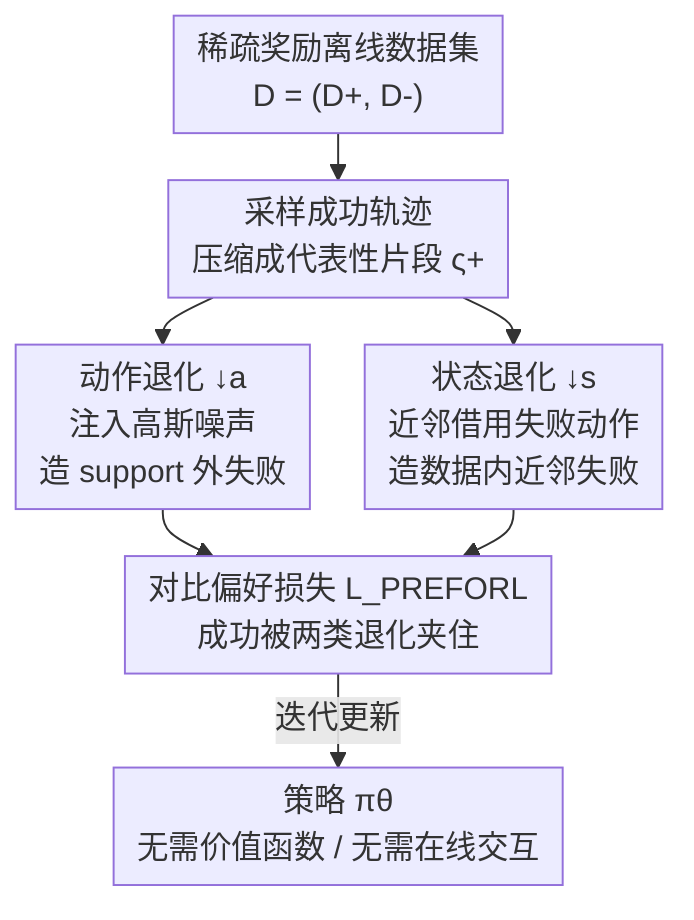

# Preference-based Policy Optimization from Sparse-reward Offline Dataset

**会议**: ICLR 2026  
**OpenReview**: [https://openreview.net/forum?id=zyLI9LEmry](https://openreview.net/forum?id=zyLI9LEmry)  
**代码**: 待确认  
**领域**: 强化学习 / 离线RL / 偏好学习  
**关键词**: 离线强化学习, 稀疏奖励, 对比偏好学习, 价值高估, 数据退化

## 一句话总结
PREFORL 把稀疏奖励离线 RL 改写成对比偏好学习问题——绕开价值函数估计，用成功轨迹去对比「数据集内的失败行为」和「合成出的、落在数据分布之外的失败行为」，从而抑制价值高估、提升鲁棒性，在 Adroit / Sparse-MuJoCo / Maze2D / MetaWorld 等稀疏奖励基准上稳定超过 CQL、IQL、CPL、ReBRAC 等 SOTA。

## 研究背景与动机
**领域现状**：离线强化学习希望只用一份静态数据集就训出好策略，避免昂贵或危险的在线交互，主流路线是从数据里学一个价值函数再据此优化策略。

**现有痛点**：当数据有限、奖励稀疏时，价值函数被查询到「数据覆盖很差」的 state-action 上就会变得过度乐观（extrapolation error / 价值高估），导致策略不稳定甚至崩。已有三类补救都有软肋：① 悲观类（如 CQL）对不确定区域强行压低价值，但要小心标定悲观程度，高维稀疏下越来越难调；② 正则类把策略约束在行为策略附近，覆盖好时有效，但正则强度脆弱、容易困在次优行为里；③ 重要性采样 / DICE 类按状态-动作密度重加权奖励，理论漂亮但对 support mismatch 敏感、方差大。

**核心矛盾**：根子在「要不要、以及如何估计价值函数」。只要还在估价值，稀疏奖励 + 覆盖不足就必然带来高估；而单纯用偏好学习对比「成功 vs 数据里的失败」也救不了——数据里根本没有覆盖差区域的强反例，策略在那些区域照样乐观。

**本文目标**：彻底绕开价值函数估计，同时直接对抗高估，并且要能给覆盖很差的区域提供「反例」。

**切入角度**：把离线策略优化重写成对比偏好学习（沿用 CPL 用最优策略表示最优 advantage 的思路，省掉显式 advantage/价值函数）；关键观察是——既然数据里缺覆盖差区域的失败样本，那就**人工合成**落在数据分布之外的失败行为当作反例。

**核心 idea**：用「成功演示」去对比两种失败——数据里已有的近邻失败行为 + 合成在数据 support 之外的退化行为，把成功行为「夹」在两侧失败之间，既学会模仿成功，又主动远离会失败/越界的行为。

## 方法详解

### 整体框架
PREFORL（PREFerence-based Optimization for Offline RL）输入是一份稀疏奖励离线数据集 $D=(D^+, D^-)$，其中 $D^+=\{\tau \mid R(\tau)>\eta\}$ 是累计回报超过阈值 $\eta$ 的成功轨迹、$D^-$ 是失败轨迹（很多稀疏环境取 $\eta=0$）；输出是一个策略 $\pi_\theta$，全程**不与环境交互、不估计价值函数**。

整条管线是一个迭代循环：每轮从 $D^+$ 采样若干成功轨迹，压缩成保序的「代表性片段」$\varsigma=\Sigma(\tau,k)$（按原始时间序从轨迹里抽 $k$ 个 state-action）；再对每条成功轨迹用「退化算子」造一条对应的失败轨迹，得到合成失败数据集 $D^{\downarrow a}\cup D^{\downarrow s}$；然后把成功片段当 preferred、退化片段当 non-preferred，喂进对比偏好损失 $L_{\text{PREFORL}}$ 更新 $\pi_\theta$。和 CPL 唯一但关键的区别：CPL 拿 $D^+$ 对比数据里原生的 $D^-$，PREFORL 拿 $D^+$ 对比**退化合成**出来的 $D^{\downarrow s}\cup D^{\downarrow a}$。

### 关键设计

**1. 对比偏好替代价值估计：用最优策略直接表示偏好**

针对「估价值就会高估」这个根痛点，PREFORL 沿用 CPL 在最大熵 RL 下的关键恒等式：最优 advantage 与最优策略满足 $A^*(s,a)=\alpha\log\pi^*(a\mid s)$（在归一化假设 $\int e^{A^*(s,a)/\alpha}\,da=1$ 下成立）。这意味着不必去学一个隐式的最优 advantage 函数，可以直接把 advantage-based 的 Bradley-Terry 偏好模型里的 $A^*$ 换成 $\alpha\log\pi_\theta$，让偏好信号直接塑造策略本身。于是片段级偏好概率写成

$$P_{A^*}[\varsigma^+>\varsigma^-]=\frac{\exp\sum_{\varsigma^+}\gamma^t A^*(\hat s_t^+,\hat a_t^+)}{\exp\sum_{\varsigma^+}\gamma^t A^*(\hat s_t^+,\hat a_t^+)+\exp\sum_{\varsigma^-}\gamma^t A^*(\hat s_t^-,\hat a_t^-)}.$$

相比 Knox 等用「部分折扣回报」直接比片段优劣，advantage-based 偏好在奖励稀疏/高度不均衡时更可靠，因为它比的是相对质量而不是几乎处处为零的回报。这一步让 PREFORL 整套流程里没有任何价值函数，自然躲开了高估。

**2. 双路退化算子：给覆盖差的区域人工造反例**

单纯对比「成功 vs 数据内失败」救不了高估——因为覆盖很差的区域根本没有失败样本去压制乐观。PREFORL 的核心创新是用两种退化算子，从成功轨迹 $\tau^+$ 主动构造失败反例。**动作退化 $\downarrow a$**：对成功轨迹每个动作加高斯噪声 $a_t^{(i)-}=a_t^{(i)}+\epsilon_t^{(i)},\ \epsilon_t^{(i)}\sim\mathcal N(0,\sigma^2 I)$，得到的 $D^{\downarrow a}$ 是落在数据 **support 之外**的合成失败行为；$\sigma$ 控制噪声幅度（实验显示需保持「局部性」即小噪声即可，无需精细调）。**状态退化 $\downarrow s$**：不扰动动作，而是对成功轨迹的每个状态 $s_t^{(i)}$ 在失败数据集 $D^-$ 里做近邻检索，把近邻状态记录的动作 $a_{t'}^{(j)}$ 借过来替换，得到的 $D^{\downarrow s}$ 是**数据内近邻**的失败行为（向量空间用欧氏距离、图像等高维空间用特征距离检索）。两者按构造都满足 $D^+>D^{\downarrow a}$、$D^+>D^{\downarrow s}$。作者把它比喻成「squeezing 挤压」策略：成功行为被两侧合成退化夹住，既界定了什么是可取的，又同时覆盖了「数据内的近邻失败」和「越出 support 的失败」两个方向。

**3. PREFORL 对比损失：把成功夹在退化之间优化策略**

把退化结果拼成对比偏好数据集 $D_{\text{pref}}=(D^+,\ D^{\downarrow s}\cup D^{\downarrow a})$，损失为

$$L_{\text{PREFORL}}(\pi_\theta,D_{\text{pref}})=\mathbb E_{(\varsigma^+,\varsigma^-)\sim D_{\text{pref}}}\Big[-\log\frac{\exp\sum_{\varsigma^+}\gamma^t\alpha\log\pi_\theta(\hat s_t^+,\hat a_t^+)}{\exp\sum_{\varsigma^+}\gamma^t\alpha\log\pi_\theta(\hat s_t^+,\hat a_t^+)+\exp\lambda\sum_{\varsigma^-}\gamma^t\alpha\log\pi_\theta(\hat s_t^-,\hat a_t^-)}\Big].$$

其中 $\alpha$ 是温度，$\lambda\in(0,1]$ 是非对称「bias」正则，用来下调负片段的权重（沿用 DPPO 的做法）。它和行为克隆（BC）、传统离线 RL 的区别正在于此：BC 只会模仿演示、一遇分布漂移就崩；离线 RL 在稀疏覆盖下价值高估；PREFORL 让策略不只从「成功」学，还从「会失败或越界」的合成反例学，因此更鲁棒。理论上作者证明（Lemma 3.1）：当退化片段能覆盖每个 $s\sim d^*$ 的动作空间时，$L_{\text{PREFORL}}\to 0$ 蕴含 $\mathbb E_{s\sim d^*}[D_{\text{TV}}(\pi^*\|\pi)]\to 0$，即最小化该损失等价于把学到的策略推向成功轨迹分布 $d^*$，并配合 Cen et al. 的性能差界把策略次优性界住。

### 损失函数 / 训练策略
训练就是 Algorithm 1 的外层迭代：每轮先从 $D^+$ 采 $M$ 条成功轨迹、各压成 $k$ 长代表性片段构成 $D^+_j$；再经式 (4)(5) 造出 $D^{\downarrow a}_j\cup D^{\downarrow s}_j$ 作为 $D^-_j$；最后以折扣对比对数似然（令 $L^\pm=\log\pi_\theta(\hat s_t^\pm,\hat a_t^\pm)$）对 $\theta$ 做一步最小化。关键超参为温度 $\alpha$、对比偏好 bias $\lambda$、片段长度 $k$、退化噪声 $\sigma$、退化/成功数据比例；论文报告对 $\lambda$、$k$、比例、$\sigma$ 都不敏感，在较宽范围内稳定，无需逐环境精细调。

## 实验关键数据

### 主实验
在 D4RL Adroit（24-DoF Shadow Hand 操作，pen/door/hammer/relocate × human/cloned/expert）上对比 BC、CQL、IQL、TD3+BC、CDE、ReBRAC、CPL，PREFORL 在多数环境拿到最优归一化分数：

| 任务 | CPL | ReBRAC | CDE | PREFORL |
|------|------|--------|-----|---------|
| pen-human | 100.1±2.2 | 103.5±14.1 | 72.1 | **119.1±3.1** |
| door-cloned | 3.6±3.5 | 1.1±2.6 | 0.1 | **16.3±0.7** |
| hammer-cloned | 13.2±8.1 | 6.7±3.7 | 7.3 | **28.4±3.2** |
| relocate-expert | 110.2±0.4 | 106.6±3.2 | 102.6 | **111.2±0.7** |

在 Sparse-MuJoCo（按 75 分位把 dense 回报二值化成稀疏成功/失败）上以成功率衡量，PREFORL 在 medium 与 medium-expert 两档全面领先，尤其 halfcheetah-medium-expert 直接拿到 100.0，而 ReBRAC 为 0、CPL 仅 47.3：

| 任务 | CPL | CDE | ReBRAC | PREFORL |
|------|------|-----|--------|---------|
| walker2d-medium | 85.3±6.1 | 53.0±11.7 | 42.0 | **98.0±3.5** |
| hopper-medium-expert | 0.0±0.0 | 97.0±1.4 | 21.0 | **98.4±3.6** |
| halfcheetah-medium-expert | 47.3±4.6 | 95.2±2.9 | 0.0 | **100.0±0.0** |

Maze2D 导航（umaze/medium/large，训练分布与评测分布不同、轨迹长度变化）上平均成功数：PREFORL 在 umaze（2.22 vs ReBRAC 2.07）和 large（0.63 vs CDE 0.55）领先，说明它在窄分布（Adroit）和多样分布（Maze2D）都站得住。

### 消融实验

| 配置 / 分析 | 结论 | 说明 |
|------|------|------|
| 退化噪声 $\sigma$（Appx C） | 小噪声区间内稳定 | $\sigma$ 只需保持「局部性」，无需逐环境精调 |
| 退化/成功数据规模比（Appx D） | 对比例高度不敏感 | 比例变化下性能可靠 |
| bias $\lambda$、片段长 $k$（Appx E） | 宽范围内稳定 | 两个关键超参都不需精细调 |
| MetaWorld 图像输入（Table 4） | 16 任务几乎全面超 BC | ResNet-50 编码 84×84 RGB，仅有专家演示无奖励 |

### 关键发现
- 「合成失败反例」是性能来源：相比只对比数据内失败的 CPL，PREFORL 在 door-cloned、hammer-cloned 等覆盖差的 cloned 数据上提升最大（door-cloned 16.3 vs 3.6），印证了 support 外退化对抑制高估的价值。
- 鲁棒性强：$\sigma$、$\lambda$、$k$、退化比例四个超参都被报告为不敏感，对落地很友好。
- 高维可用：在纯演示、无奖励的 MetaWorld 图像任务上用人工偏好信号即可大幅超 BC（如 Soccer 67.7 vs 25.0、Peg Insert 73.3 vs 49.0）。

## 亮点与洞察
- **把「缺反例」变成「造反例」**：离线稀疏奖励最大的困境是覆盖差区域没有失败样本，PREFORL 直接用退化算子合成 support 外的失败行为，把「数据缺口」转成「可控的对比信号」，这是最巧妙的一步。
- **双路退化互补**：状态退化覆盖「数据内近邻失败」、动作退化覆盖「越界失败」，一内一外把成功夹住，比单一加噪更全面。
- **无价值函数 = 无高估**：从根上绕开价值估计，而不是事后用悲观/正则去补救，思路上更干净，也省掉了悲观程度的标定难题。
- 可迁移：「用退化/扰动合成 negative，再做对比偏好优化」的范式可迁到模仿学习、机器人 learning-from-demonstration，甚至 RLHF 里缺负样本的场景。

## 局限与展望
- 退化算子隐含「在成功轨迹邻域内的扰动确实更差」的假设——若环境里小扰动反而更优（多模态最优、对称解），合成反例可能给错偏好信号。
- 状态退化依赖近邻检索质量，高维/图像空间靠特征距离，特征不好时近邻借来的动作未必构成有意义的失败。
- 评测集中在仿真操作/导航基准，缺真实机器人或离线推荐/医疗等高风险域的验证；理论保证依赖「退化片段覆盖动作空间」的假设，实际是否满足未充分量化。
- 仍需事先把数据切成 $D^+/D^-$（阈值 $\eta$），在没有清晰成功信号的任务上如何划分成功/失败是开放问题。

## 相关工作与启发
- **vs CPL（Hejna et al. 2024）**：两者都用 advantage-based 对比偏好且用 $A^*=\alpha\log\pi^*$ 消去价值函数；区别是 CPL 拿 $D^+$ 对比数据里原生的 $D^-$，覆盖差区域无强反例仍会高估，PREFORL 改为对比退化合成的 $D^{\downarrow s}\cup D^{\downarrow a}$，直接补上 support 外反例，故在 cloned/稀疏数据上大幅领先。
- **vs 悲观/正则类（CQL、TD3+BC、ReBRAC）**：它们仍估价值并靠悲观或行为约束压高估，需要标定强度且高维稀疏下脆弱；PREFORL 不估价值，用对比信号天然避高估。
- **vs DICE / 重要性采样（CDE）**：CDE 等按密度重加权奖励，对 support mismatch 敏感、方差大；PREFORL 不做密度校正，靠合成反例处理 mismatch，稳定性更好。
- **vs BC**：BC 只模仿、遇分布漂移即崩；PREFORL 额外从合成失败学「该避开什么」，在 MetaWorld 等仅有演示的任务上明显更鲁棒。

## 评分
- 新颖性: ⭐⭐⭐⭐⭐ 「合成 support 外失败反例 + 对比偏好绕开价值估计」组合在稀疏离线 RL 里是清晰且有理论支撑的新视角。
- 实验充分度: ⭐⭐⭐⭐ 覆盖 Adroit/Sparse-MuJoCo/Maze2D/MetaWorld 四类基准 + 多组超参敏感性分析，但多在仿真、缺真实场景。
- 写作质量: ⭐⭐⭐⭐ 动机—方法—理论链条清楚；个别记号（$\downarrow a$/$\downarrow s$ 图注混用）略有瑕疵。
- 价值: ⭐⭐⭐⭐ 稀疏奖励离线 RL 是高价值难题，方法鲁棒少调参，落地友好。

<!-- RELATED:START -->

## 相关论文

- [\[ICLR 2026\] Offline Preference-based Value Optimization](offline_preference-based_value_optimization.md)
- [\[ICLR 2026\] Enhancing Generative Auto-bidding with Offline Reward Evaluation and Policy Search](enhancing_generative_auto-bidding_with_offline_reward_evaluation_and_policy_sear.md)
- [\[ICLR 2026\] Causally Robust Reward Learning from Reason-Augmented Preference Feedback](causally_robust_reward_learning_from_reason-augmented_preference_feedback.md)
- [\[ICLR 2026\] RD-HRL: Generating Reliable Sub-Goals for Long-Horizon Sparse-Reward Tasks](rd-hrl_generating_reliable_sub-goals_for_long-horizon_sparse-reward_tasks.md)
- [\[ICLR 2026\] DuPO: Enabling Reliable Self-Verification via Dual Preference Optimization](dupo_enabling_reliable_self-verification_via_dual_preference_optimization.md)

<!-- RELATED:END -->
