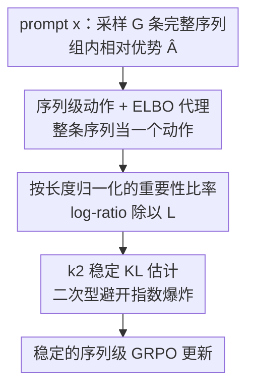

# Principled RL for Diffusion LLMs Emerges from a Sequence-Level Perspective

**会议**: ICLR 2026  
**OpenReview**: [https://openreview.net/forum?id=S5YeC9llIL](https://openreview.net/forum?id=S5YeC9llIL)  
**代码**: https://github.com/ML-GSAI/ESPO  
**领域**: 强化学习 / 扩散语言模型  
**关键词**: 扩散LLM、序列级RL、ELBO、GRPO、KL估计

## 一句话总结
针对扩散大语言模型（dLLM）非自回归生成、缺乏 token 级条件概率因而无法直接套用 GRPO 的根本矛盾，本文提出 ESPO——把"生成整条序列"当成一个原子动作、用 ELBO 当序列对数似然的可计算代理，再配上按长度归一化的重要性比率和 k2 KL 估计器稳定训练，在数学、代码、规划任务上大幅超越 token 级 RL 基线（Countdown/Sudoku 上提升 20–40 甚至 60+ 分）。

## 研究背景与动机
**领域现状**：强化学习（尤其是免价值网络的 GRPO）已成为自回归 LLM 后训练、做可验证奖励 reasoning 的主力武器。与此同时，扩散语言模型（dLLM，本质是掩码扩散模型 MDM）作为自回归之外的一条生成范式逐渐成熟，靠迭代去噪生成、天然支持长上下文、多模态与并行快速推理。自然的下一步就是：怎么把 RL 搬到 dLLM 上？

**现有痛点**：GRPO 这类算法骨子里假设序列似然能按 $\pi_\theta(y|x)=\prod_{k=1}^L \pi_\theta(y_k|x,y_{<k})$ 做左到右因式分解，从而定义出逐 token 的动作和重要性比率 $\rho_k=\frac{\pi_\theta(y_k|x,y_{<k})}{\pi_{\theta_{old}}(y_k|x,y_{<k})}$。但 dLLM 是非自回归的——它一次性对整条序列反复去噪，根本没有 $\pi_\theta(y_k|x,y_{<k})$ 这种条件概率，要么定义不清，要么算起来极贵。

**核心矛盾**：已有工作都在"找一个 token 级替身"上打转：d1 用 mean-field 近似 $\log p_\theta(y_k|x)$（忽略了序列里其他 token 的上下文，不准）；UniGRPO、Coupled-GRPO 进一步用"token 对 ELBO 的贡献项" $\mathcal{L}^k_\theta(y|x)$。但关键问题是：ELBO 只在**整条序列层面**才是 $\log\pi_\theta(y|x)$ 的合法下界，把它拆到单个 token 上的分量 $\mathcal{L}^k_\theta$ **没有任何条件似然的概率含义**，硬塞进 GRPO 目标会引入说不清的不一致性。

**本文目标 / 切入角度**：作者的核心判断是——问题不是"还没找到更好的 token 级代理"，而是"token 级分解本身就不适合 dLLM"。强行把 dLLM 套进自回归 token 级框架是错误前提。

**核心 idea**：不要改模型去迁就算法，而是改算法去尊重 dLLM"整体生成"的本性——把整条序列当成单一动作，在**序列级**做 RL，用 ELBO 当序列似然的可计算代理。

## 方法详解

### 整体框架
ESPO（ELBO-based Sequence-level Policy Optimization）把 GRPO 从 token 级搬到序列级：对一个 prompt $x$，用旧策略采样一组 $G$ 条完整完成 $\{y^{(i)}\}$，按组内相对优势 $\hat A^{(i)}=R(x,y^{(i)})-\frac{1}{G}\sum_j R(x,y^{(j)})$ 算 advantage——这一套和 GRPO 一样。真正的改动在两处：（1）把逐 token 求和去掉，整条序列只有一个**序列级重要性比率**，而这个比率里的对数似然用 ELBO 代替；（2）由于原始 ELBO 差值随序列长度线性增长、指数化后会爆炸或归零，必须做**按长度归一化**让它回到"每 token 尺度"；同时 KL 正则项不能用含指数项的 k3 估计器（会重新引入同样的爆炸），改用二次型的 **k2 估计器**。三件事缺一不可：序列级动作空间定方向，ELBO 当代理保证可算，归一化 + k2 保证大规模训练能稳住。

### 关键设计

**1. 序列级动作 + ELBO 代理：从根上绕开 token 分解的不合法性**

这一条直接对应"token 级分解不适合 dLLM"这个核心痛点。作者不再把每个 token 当独立动作，而是把整条序列 $y$ 的生成当成一个原子动作，于是 GRPO 目标里那个逐 token 的内层求和被整体抹掉，只剩一个序列级重要性比率 $\frac{\pi_\theta(y^{(i)}|x)}{\pi_{\theta_{old}}(y^{(i)}|x)}$。由于 dLLM 的 $\log\pi_\theta(y|x)$ 本身不可解，作者用它的 ELBO $\mathcal{L}_\theta(y|x)$（掩码扩散的标准下界，已被证明是紧且实用的代理）来替换，得到

$$\rho^{(i)}_{seq}=\frac{\exp \mathcal{L}_\theta(y^{(i)}|x)}{\exp \mathcal{L}_{\theta_{old}}(y^{(i)}|x)}=\exp\!\big(\mathcal{L}_\theta(y^{(i)}|x)-\mathcal{L}_{\theta_{old}}(y^{(i)}|x)\big).$$

关键在于：ELBO 只在序列整体上才是合法下界，所以**只能在序列层面用**——这恰好和"序列即一个动作"天然契合，彻底回避了 UniGRPO/Coupled-GRPO 把 ELBO 拆到 token 上、单个分量没有概率含义的不一致性。Sudoku 消融里"序列级 + ELBO"是唯一又快又稳又收敛到最高奖励的组合，而 token 级 + ELBO 一开始有效但很快崩溃，正印证了"破坏 ELBO 整体性"的代价。

**2. 重要性比率按序列长度归一化：把会爆炸的 raw ELBO 差值压回每 token 尺度**

直接用设计 1 的 $\rho_{seq}$ 训练实际上不可用：raw ELBO 差值 $\mathcal{L}_\theta-\mathcal{L}_{\theta_{old}}$ 的量级随序列长度 $L$ 线性增长，一指数化就变成天文数字或无穷小，优化彻底失稳。作者借鉴 GSPO 的思路，把 log-ratio 除以长度 $L$，得到最终稳定版比率

$$\rho^{(i)}_{seq}=\exp\!\Big(\tfrac{1}{L}\big(\mathcal{L}_\theta(y^{(i)}|x)-\mathcal{L}_{\theta_{old}}(y^{(i)}|x)\big)\Big)=\exp\!\Big(\tfrac{1}{L}\sum_{k=1}^L\big(\mathcal{L}^k_\theta(y^{(i)}|x)-\mathcal{L}^k_{\theta_{old}}(y^{(i)}|x)\big)\Big).$$

这一步把"随长度发散的原始对数似然差"转成"每 token 平均尺度"的稳定量，使得不同长度的序列重要性比率落在同一可控量级，序列级目标 $J_{seq}$ 才真正能跑起来。注意这里求和只是把 ELBO 写成 token 贡献之和做计算，**不**意味着回到 token 级动作——动作仍是整条序列。

**3. k2 KL 估计器：避开 k3 里那个会把不稳定性重新带回来的指数项**

完整 GRPO 目标还有个 KL 项约束策略别偏离参考策略太远。自回归常用的 k3 估计器在用 ELBO 近似似然时形如 $\widehat{\mathrm{KL}}_{k3}=\exp(\mathcal{L}_{ref}-\mathcal{L}_\theta)-1-(\mathcal{L}_{ref}-\mathcal{L}_\theta)$，里头那个指数项会在序列级把设计 2 好不容易压下去的爆炸问题原样请回来。作者改用更稳健、且被证明能给出正确 KL 梯度的 k2 估计器：

$$\widehat{\mathrm{KL}}_{k2}=\tfrac{1}{2}\big(\mathcal{L}_\theta(y^{(i)}|x)-\mathcal{L}_{ref}(y^{(i)}|x)\big)^2.$$

它是 ELBO 差的纯二次函数，完全没有指数项，即便序列很长梯度信号也稳定。Sudoku 上的 KL 估计器消融很有说服力：k3（停滞不学）、k1（剧烈震荡后中途崩到 0）都失败，唯有 k2 稳定高效、收敛到最高奖励。

### 损失函数 / 训练策略
最终目标是把设计 2 的稳定比率代入序列级裁剪目标 $J_{seq}(\pi_\theta)=\mathbb{E}\big[\frac{1}{G}\sum_i \min(\rho^{(i)}_{seq}\hat A^{(i)},\,\mathrm{clip}(\rho^{(i)}_{seq},1-\epsilon,1+\epsilon)\hat A^{(i)})\big]$，再减去 $\beta\,\widehat{\mathrm{KL}}_{k2}$。训练直接作用于预训练 dLLM，无需任务特定 SFT。为降方差，采用两个标准技巧：antithetic sampling（估计 ELBO 差时共享同一噪声水平与掩码位置）和 coupled-sampling 方案；所有实验用 2 个 Monte Carlo 样本、策略更新值 $\mu=8$。注意 ELBO 用的是离散掩码数 $l$ 的低方差变体 $\mathcal{L}'_\theta$（按掩码 token 数均匀采样而非连续比率 $t$）。

## 实验关键数据

### 主实验
基座为 LLaDA-8B-Instruct 与 Dream-7B-Instruct，覆盖数学（GSM8K、MATH）、代码（HumanEval、MBPP 及其 Plus）、规划（Countdown、Sudoku），评测长度 128/256/512（仅在 256 上训练）。下表为 LLaDA 上的平均结果（Avg. 跨三种长度）：

| 任务 | LLaDA | +d1(diffu-GRPO) | +wd1 | +ESPO | ESPO 提升Δ |
|------|-------|-----------------|------|-------|-----------|
| GSM8K | 75.9 | 78.0 | 80.1 | **82.0** | +6.1 |
| MATH | 37.0 | 37.7 | 36.9 | **39.5** | +2.5 |
| Countdown | 18.7 | 33.9 | 48.3 | **81.0** | +62.3 |
| Sudoku | 15.7 | 22.2 | 23.1 | **86.0** | +70.3 |

Dream 基座上同样全面领先：Countdown 11.2→66.8（+55.6）、Sudoku 8.5→71.8（+63.3）、GSM8K 79.3→81.3、MATH 44.0→46.0。代码任务上 ESPO 也稳定提升，甚至能逼平用更大规模私有数据训练的 LLaDA-1.5。

### 消融实验
两组消融都在 Sudoku 上做，直接验证三大设计：

| 配置 | 结果 | 说明 |
|------|------|------|
| Token 级 + Mean-field | 学不动 | mean-field 与去噪条件过程根本错配 |
| Token 级 + ELBO | 初期好转后崩溃 | 破坏 ELBO 整体性带来不一致 |
| 序列级 + Mean-field | 学不动 | 同样受 mean-field 拖累 |
| **序列级 + ELBO（ESPO）** | 又快又稳、收敛最高 | 动作空间与 ELBO 代理正确配对 |
| KL 用 k3 | 停滞 | 指数项导致不稳定 |
| KL 用 k1 | 震荡后崩到 0 | 高度不稳定 |
| **KL 用 k2** | 稳定收敛最高 | 二次型避开指数爆炸 |

### 关键发现
- 动作空间（序列 vs token）和似然近似（ELBO vs mean-field）必须**正确配对**：只有"序列级 + ELBO"既稳又强，任一维度选错都失败，说明 ELBO 的整体性不可破坏。
- 规划类任务（Countdown/Sudoku）增益最猛（60–74 分），正因为这类任务要求全局一致性，而序列级视角天然契合 dLLM 的整体生成。
- 长度泛化好：只在长度 256 训练，128/512 上同样普遍提升。
- KL 估计器是稳定性的隐形命门：含指数项的 k3、方差大的 k1 都崩，二次型 k2 才稳。

## 亮点与洞察
- **"改算法迁就模型"而非反过来**：最核心的洞见不是某个 trick，而是认清 token 级分解对 dLLM 是错误前提，从而把动作空间抬到序列级——一个观念转变带出整条干净的推导。
- **ELBO 的合法性边界被严肃对待**：明确指出 ELBO 只在序列层面是合法下界，单 token 分量无概率含义，这个看似哲学的区分直接解释了为何 token 级 + ELBO 会崩。
- **稳定性是系统工程**：序列级带来天文量级的比率，长度归一化 + k2 KL 两个"工程化"决定其实是让原理性框架真正可训的关键，可迁移到其他长序列、似然不可解的 RL 场景。

## 局限与展望
- 实验集中在数学/代码/规划这类**有可验证奖励**的 reasoning 任务，对开放式生成、对话对齐等无明确 reward 的场景是否同样有效未验证。
- ELBO 仍只是似然的下界、且要靠 Monte Carlo + antithetic/coupled 采样估计，估计方差与采样成本对最终性能的影响边界没有充分刻画。
- 仅在 LLaDA-8B、Dream-7B 两个开源 dLLM 上验证，更大规模或不同 dLLM 架构上的可扩展性留待考察。
- 长度归一化用 $\frac{1}{L}$ 是借鉴 GSPO 的直接选择，是否存在更优的尺度化方式（如按有效掩码数归一）值得探索。

## 相关工作与启发
- **vs d1 (diffu-GRPO)**：d1 用 mean-field $\log p_\theta(y_k|x)$ 当 token 级条件概率代理，忽略序列上下文且本质仍是 token 级动作；ESPO 抬到序列级 + ELBO，规划任务上把 Countdown 从 33.9 拉到 81.0。
- **vs UniGRPO / Coupled-GRPO**：它们用"token 对 ELBO 的贡献项" $\mathcal{L}^k_\theta$ 当代理，但单分量无概率含义、破坏 ELBO 整体性导致训练崩溃；ESPO 坚持只在序列层面用 ELBO，从原理上消除不一致。
- **vs GSPO（自回归序列级 RL）**：ESPO 借用了其按长度归一化 log-ratio 的稳定思想，但把它适配到 dLLM 的 ELBO 代理与 k2 KL 设定下，解决的是非自回归似然不可解这一独有难题。
- **vs 轨迹级方法（如 Huang et al. 2025）**：那类做法计算极重；ESPO 用单一序列级 ELBO 代理在计算效率与稳定性间取得更实用的折中。

## 评分
- 新颖性: ⭐⭐⭐⭐⭐ 把"token 级分解不适合 dLLM"上升为原理判断，给出干净自洽的序列级 RL 框架
- 实验充分度: ⭐⭐⭐⭐ 两基座、三类任务、三长度 + 两组关键消融，但偏 verifiable-reward 任务
- 写作质量: ⭐⭐⭐⭐⭐ 从矛盾分析到方法推导逻辑链条清晰、消融对照有说服力
- 价值: ⭐⭐⭐⭐⭐ 为 dLLM 的 RL 后训练确立了原理性且实证有效的序列级范式

<!-- RELATED:START -->

## 相关论文

- [\[ICLR 2026\] TIPS: Turn-Level Information-Potential Reward Shaping for Search-Augmented LLMs](tips_turn-level_information-potential_reward_shaping_for_search-augmented_llms.md)
- [\[ICLR 2026\] From f(x) and g(x) to f(g(x)): LLMs Learn New Skills in RL by Composing Old Ones](from_fx_and_gx_to_fgx_llms_learn_new_skills_in_rl_by_composing_old_ones.md)
- [\[ICLR 2026\] DEAS: DEtached value learning with Action Sequence for Scalable Offline RL](deas_detached_value_learning_with_action_sequence_for_scalable_offline_rl.md)
- [\[ICLR 2026\] Sparse but Critical: A Token-Level Analysis of Distributional Shifts in RLVR Fine-Tuning of LLMs](sparse_but_critical_a_token-level_analysis_of_distributional_shifts_in_rlvr_fine.md)
- [\[ICLR 2026\] Principled Fast and Meta Knowledge Learners for Continual Reinforcement Learning](principled_fast_and_meta_knowledge_learners_for_continual_reinforcement_learning.md)

<!-- RELATED:END -->
