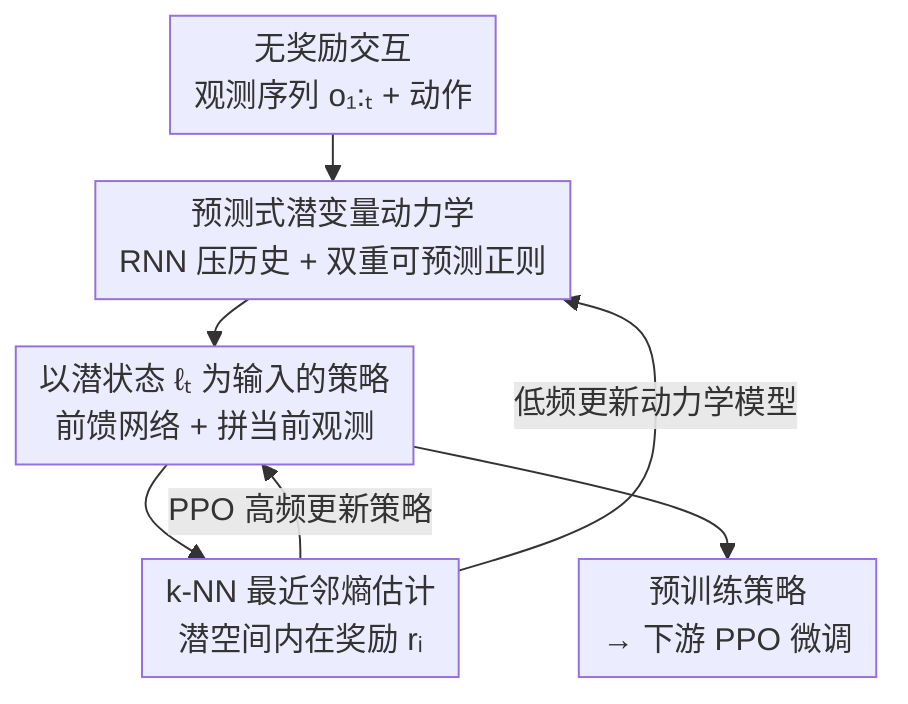

# Probing in the Dark: State Entropy Maximization for POMDPs

**会议**: ICLR 2026  
**OpenReview**: [https://openreview.net/forum?id=kxzYGDL4fY](https://openreview.net/forum?id=kxzYGDL4fY)  
**代码**: [https://github.com/JonathanAshlag/LatEnt](https://github.com/JonathanAshlag/LatEnt)  
**领域**: 强化学习 / 无监督预训练 / POMDP  
**关键词**: 最大状态熵, 部分可观测, 信息状态, 预测式潜变量, 无奖励预训练

## 一句话总结
针对"看不到真实状态就无法最大化状态熵"的 POMDP 难题，本文提出最大化一个**可预测潜变量（predictive latent）的熵**作为代理目标，并给出可同时学习潜变量动力学模型与策略的 LatEnt 算法，在自建的 PROBE 基准上诱导出接近"上帝视角"的真实状态熵，使下游 PPO 微调能解决从零训练根本学不会的稀疏奖励任务。

## 研究背景与动机
**领域现状**：在强化学习里，"先无奖励预训练、再针对下游任务微调"是缓解样本效率瓶颈的一条主线。其中最经典的预训练目标是 Hazan et al. (2019) 提出的**最大状态熵（maximum state entropy）**：让策略最大化它在状态空间上诱导的访问分布 $d^\pi(s)$ 的熵 $H(d^\pi(s))$。理想情况下，均匀覆盖所有状态的策略能为任意未知下游任务提供最坏情况最优的初始化，因为奖励通常是状态的函数，均匀采状态就等于均匀采奖励。

**现有痛点**：上述结论建立在"能观测到真实状态"的全可观测假设上。但真实世界普遍是**部分可观测（POMDP）**的——智能体只能拿到观测 $o$，看不到状态 $s$，更别说去估计 $H(d^\pi(s))$。此前 POMDP 上的做法（Seo et al. 2021；Yarats et al. 2021；Zamboni et al. 2024）几乎都是把全可观测方法**朴素照搬**：直接最大化观测熵 $H(d^\pi(o))$。这在"轻度部分可观测"（比如堆几帧观测就能还原状态）的场景里勉强能用。

**核心矛盾**：Zamboni et al. (2024b) 的 Theorem 4.1 形式化指出，只有当发射矩阵 $O$ 的最大奇异值 $\sigma_{\max}(O)$ 和其 Hadamard 逆 $O^{\circ-1}$（$O^{\circ-1}_{ij}=1/O_{ij}$）的最大奇异值 $\sigma_{\max}(O^{\circ-1})$ **都很小**时，最大化观测熵才等价于最大化状态熵。一旦 $\sigma_{\max}(O)$ 大（一个状态能发出多种观测）或 $\sigma_{\max}(O^{\circ-1})$ 大（一个观测能由多个状态发出），观测熵就会和状态熵**严重错位**，朴素方法必然失败。极端例子：观测里被注入噪声时，最大化观测熵的策略会"故意去采噪声"而不是真正探索状态。

**本文目标**：在不知道转移 $P$、发射 $O$、且最多只能 $O(1)$ 次访问真实状态（Assumption 1）的一般 POMDP 下，找到一个**完全可由观测估计**的代理目标，让它最大化时能逼近真实状态熵的预训练效果。

**切入角度**：作者借用控制理论里的**信息状态（Information State, IS）**——历史的充分统计量。已有 IS 理论只针对奖励最大化（Subramanian et al. 2022），而状态熵属于"$d^\pi(s)$ 的凸函数"这一更广的问题类，IS 性质能否迁移并不显然。本文先把 IS 理论扩展到凸目标，再据此设计一个紧凑、可学的统计量替代真实状态。

**核心 idea**：用"足以预测未来观测的紧凑潜变量"的熵 $H(d^\pi_L(\ell))$ 替代不可观测的状态熵 $H(d^\pi(s))$，作为 POMDP 无监督预训练的代理目标。

## 方法详解

### 整体框架
本文要解决的是：在看不到真实状态的 POMDP 里，造一个"能当状态用"的统计量，然后最大化它的熵来预训练策略。整条思路分两层——**理论层**先论证什么样的统计量是合法替身（信息状态 → 预测式潜变量），**算法层**再给出 LatEnt 把这个替身和策略一起在线学出来。

理论层的链条是：① Theorem 1 证明满足 Definition 1 的信息状态（对任意奖励都充分），同样是凸目标 POMDP（含状态熵）的信息状态；② 由此定义**预测式潜变量**（Definition 2）——只要满足"递归演化 IS2a + 足以预测观测 IS2b"即可，因为无奖励设定下拿不到 IS1 的反馈，只能靠预测观测来约束；③ 把目标从"状态熵"换成"潜变量熵"（目标式 3），并由 Theorem 2 证明：预测式潜变量比观测能支撑更广一类下游奖励，所以它的预训练比观测熵更"通用"。

算法层 LatEnt 把上述潜变量具体实例化为一个**潜变量动力学模型**，并和策略**交替优化**：动力学模型把观测历史压成潜状态 $\ell_t$，策略以 $\ell_t$ 为输入用 PPO 最大化潜变量熵（用 k-NN 非参数估计当内在奖励）。三个部件——潜变量表示学习、策略结构、熵估计——协同工作，关键难点在于潜变量空间在变、策略又依赖它，所以用"先 warmup 模型、再低频更新模型/高频更新策略"的两阶段方案稳住训练。

### 关键设计

**1. 把状态熵换成"信息状态熵"：用充分统计量替代看不见的状态**

最根本的痛点是 $H(d^\pi(s))$ 里的 $s$ 看不见、估不出。作者的破局点是把目标搬到一个能从观测构造的统计量上。第一步是理论保证：信息状态原本只为奖励最大化定义（Definition 1，含"足以预测奖励 IS1 + 足以预测自身 IS2，IS2 可由递归 IS2a + 足以预测观测 IS2b 蕴含"），而状态熵是 $d^\pi(s)$ 的凸函数。Theorem 1 证明，只要 IS1 对**任意**奖励 $R:S\times A\to\mathbb{R}$ 同时成立，该信息状态就也是凸目标 POMDP 的信息状态。证明思路借用 Hazan et al. (2019)：凸目标可拆成一串奖励最大化子问题的解再混合，只要这些子问题共享同一个 IS，混合就成立。这样就把"最大化状态熵"合法地转化成"最大化某个信息状态的熵"——理想情况下，对信息状态均匀采样等价于对下游奖励均匀采样，仍保有最坏情况最优初始化的承诺。

**2. 预测式潜变量：只保留"够预测未来观测"的紧凑表示**

光有合法性还不够——历史本身就是一个平凡的信息状态，但 $|H|=|O|^T|A|^{T-1}$ 随horizon指数膨胀，在这么大的空间上估熵的样本复杂度爆炸。痛点是"既要充分、又要紧凑"。作者据此定义**预测式潜变量**（Definition 2）：一个映射 $L:H\to\mathcal{L}\subseteq\mathbb{R}^d$，只需对所有历史满足 IS2a（递归 $\ell_{t+1}=\phi(o_{t+1},\ell_t,a_t)$）与 IS2b（足以预测下一观测）。因为无奖励，IS1 的监督拿不到，于是统计量的学习信号**完全来自预测未来观测**。对应的代理目标是

$$\text{最大潜变量熵：}\quad \max_{\pi\in\Pi}\; H(d^\pi_L(\ell)),\qquad d^\pi_L(\ell):=\sum_{t\in[T]}P(\ell_t=\ell\mid\pi,L)/T.$$

为什么这比最大化观测熵 $H(d^\pi(o))$ 强？Theorem 2 证明：预测式潜变量对**更大一类奖励**满足 IS1，所以用它预训练的策略能适配更广的下游任务集合——而观测只够支撑观测熵那一类。直觉上，潜变量从时序模式里**推断出了观测里看不到的隐藏维度**，而观测熵策略只能困在可观测维度里打转。

**3. 紧凑性靠"双重可预测正则"显式逼出来**

预测式潜变量要"紧凑"，否则塌回历史那种大空间。作者用一个潜变量动力学模型（受 Dreamer 启发但**刻意做成确定性**，避免模型随机性人为膨胀潜变量熵）实现：观测 $o_t$ 与上一动作 $a_{t-1}$ 各过 MLP 编码，RNN 顺序处理输出 $\ell_t=f_\theta(o_t,a_{t-1},\ell_{t-1})$。训练损失把"预测下一观测"和"潜空间正则"合在一起：

$$\min_\theta\; \mathcal{L}(\theta)=\sum_{i=1}^{T}\big(p_\theta(\ell_t,a_t)-o_{t+1}\big)^2+\alpha\big(g_\theta(\ell_t,a_t)-\mathrm{sg}(\ell_{t+1})\big)^2+\beta\big(\ell_{t+1}-\mathrm{sg}(g_\theta(\ell_t,a_t))\big)^2,$$

其中 $p_\theta$ 是观测解码器，$g_\theta$ 是预测下一潜状态的辅助解码器，$\mathrm{sg}(\cdot)$ 是停梯度。第二、三项是受 KL balancing 启发的**双向可预测正则**：让真实的 $\ell_{t+1}$ 和"从 $(\ell_t,a_t)$ 预测出的 $\hat\ell_{t+1}$"互相靠拢。其妙处在于——凡是无法从 $(\ell_t,a_t)$ 预测出的潜变量分量都会被惩罚，模型被迫**丢弃冗余信息**，自然偏向紧凑表示。用 MSE 隐含假设观测在潜变量条件下服从高斯，正好契合连续控制；需要更复杂分布时换成 VAE 即可。

**4. 潜变量上的最近邻熵估计 + 两阶段稳定训练**

最后要把"最大化潜变量熵"落成可优化的 RL 信号，并解决"模型和策略互相拖累"的不稳定。熵估计沿用 RL 社区常用的非参数估计（Singh et al. 2003）：给一批样本 $\{z_i\}$，$\hat H^k_N(Z)\propto\sum_i\log\lVert z_i-z_i^{k\text{-NN}}\rVert_2$，进而把它当内在奖励

$$r_i(z_i):=\log\big(\lVert z-z_i^{k\text{-NN}}\rVert_2+c\big),$$

$c$ 是数值稳定常数。策略用 PPO **全 on-policy** 更新，因为熵比普通 RL 目标更难估，作者用了比常规大得多的 batch。策略设计上，Hazan et al. (2019) 证明马尔可夫随机策略足以最大化状态熵，所以策略直接吃 $\ell_t$ 进前馈网络、**不再加循环结构**；实验发现额外拼上当前观测 $o_t$ 能在训练早期（潜变量模型剧烈变化时）提升表现。稳定性靠两阶段：先用近似均匀动作的策略采数据 warmup 动力学模型，在线阶段再**低频更新模型、高频更新策略**（Algorithm 1 里由 encoder update ratio 控制），避免潜空间抖动把策略带崩。

### 损失函数 / 训练策略
核心训练目标即上面式（5）的动力学损失（观测预测 MSE + 双向可预测正则），策略侧用 PPO 以式（6）的 k-NN 潜熵为内在奖励。整体流程见 Algorithm 1：初始化模型 $L_\theta$ 与策略 $\pi_\psi$ → warmup 采样预训练模型 → 每轮用 $\pi_\psi,L_\theta$ 采 N 条轨迹、算潜熵奖励、PPO 更新策略，并每隔 encoder update ratio 轮才训练一次动力学模型。

## 实验关键数据

实验围绕三个问题：(Q1) LatEnt 能否诱导出比观测熵更高的真实状态熵？(Q2) 预训练能否让下游任务快速适配？(Q3) 哪些组件最关键？所有结果在自建的 **PROBE** 基准（三个连续控制环境）上、10 个随机种子、95% 置信区间下报告。

### PROBE 基准与主实验

PROBE 专门构造了观测熵会失效的"高 $\sigma_{\max}(O)$ 或高 $\sigma_{\max}(O^{\circ-1})$"场景：

| 环境 | 部分可观测设计 | 难点性质 | 规模 |
|------|----------------|----------|------|
| Masked Pendulum | 遮住上半圆 + 隐藏速度 | $\sigma_{\max}(O)$ 高（多状态同观测） | 3D 状态 / 2D 观测 / 1D 动作 |
| Vertically Blind Ant | z 超阈值时遮高度信息 + 外力不可观 | $\sigma_{\max}(O)$ 高，规模更大 | 105D / 27D / 8D |
| Delusional Pusher | 给冰球位置加 3D 高斯噪声（越远越noisy） | $\sigma_{\max}(O^{\circ-1})$ 高（最难） | 20D / 20D / 7D |

**Q1（状态熵对比）**：以 k-NN 在真实（不可观测）状态上估熵，LatEnt 在**所有**环境上诱导的真实状态熵都高于最大观测熵，且逼近"上帝视角"的最大状态熵上界。最戏剧性的是 Delusional Pusher：观测熵策略为了采噪声把机械臂**移离冰球**，真实状态熵几乎为 0；LatEnt 则真正去操纵冰球。

| 预训练目标 | 是否需真实状态 | 诱导真实状态熵 |
|------------|----------------|----------------|
| 最大状态熵（oracle） | 需要（理想上界） | 最高（天花板） |
| **LatEnt（本文）** | 不需要 | 接近上界，全面超观测熵 |
| 最大观测熵 | 不需要 | 明显偏低，Pusher 上≈0 |

### Q2 下游微调

下游任务全部是稀疏奖励、需要复杂机动（导航/跳跃/平衡）的"技能"。微调方案极简：拿 LatEnt 预训练策略 + 随机初始化 critic，标准 PPO 端到端微调。

| 下游初始化 / 方法 | 解决的任务数 | 说明 |
|-------------------|--------------|------|
| **LatEnt 预训练 → PPO** | 全部（接近 oracle 上界） | 起步即非零回报，能在稀疏奖励下捡到奖励 |
| 最大状态熵 oracle → PPO | 接近全部 | 依赖真实状态，理想参照 |
| 最大观测熵 → PPO | 仅 1/6 | Pusher 上完全发现不了奖励 |
| PPO from scratch | 大多失败 | 体现任务本身之难 |
| DreamerV3 | 大多失败 | SOTA 模型基方法也搞不定 |

### 消融实验（Q3）

| 配置 | 关键指标（真实状态熵） | 说明 |
|------|------------------------|------|
| LatEnt（完整） | 最高 | 预测式紧凑潜变量 + 双向正则 |
| + history encoding | 偏低 | 额外重建历史 → 潜空间随horizon指数变大、不紧凑 |
| w/o 可预测正则 | Pusher 上显著下降 | 遮挡环境影响小，但噪声环境（冗余多）关键 |

### 关键发现
- **紧凑性是命门**：让潜变量去重建整段历史（+history encoding）会让潜空间随 horizon 指数膨胀，状态熵相关性反而变差；horizon 越长（Ant 1000 步 vs Pusher 100 步），各方法差距越大，印证"紧凑表示"对长程探索更重要。
- **可预测正则的收益高度依赖环境**：在 Masked 类环境里冗余信息少、收益有限；但在 Delusional Pusher 这种观测含大量噪声/冗余的环境里，去掉它状态熵会显著掉下来——正则的作用本质就是"把不可预测的冗余分量惩罚掉"。
- **观测熵的失败是结构性的**：不是调参问题，而是当 $\sigma_{\max}(O)$ 或 $\sigma_{\max}(O^{\circ-1})$ 大时，观测熵和状态熵从根上错位，策略会被噪声/冗余"骗"去采假熵。

## 亮点与洞察
- **把"看不见的目标"换成"看得见的代理"并给出理论合法性**：先扩展信息状态理论到凸目标（Theorem 1），再用预测式潜变量（Theorem 2 证其支撑更广奖励类）替代状态——这条"理论保证 → 可学统计量 → 实用算法"的链条很完整，不是纯工程 trick。
- **双向可预测正则是个可迁移的紧凑表示技巧**：用"停梯度 + 双向靠拢"逼模型丢弃不可预测分量，思想上和 KL balancing、自蒸馏相通，可以迁移到任何"想要紧凑且可预测的表示学习"场景。
- **故意用确定性动力学模型**：和 Dreamer 的随机模型反着来，理由很犀利——随机性会人为抬高潜变量熵，而本文的目标恰恰是熵，必须避免这种"虚假的熵"。这是把目标和模型设计耦合考虑的典范。
- **PROBE 基准点中了痛处**：明确按发射矩阵奇异值大小来构造"观测熵必败"的环境，填补了现有 POMDP 基准（要么探索简单、要么探索与部分可观测正交）的空白。

## 局限与展望
- **真实状态熵仍需 oracle 评估**：方法本身无奖励、无需真实状态，但论文里"诱导了多高的真实状态熵"这个核心评判仍靠 oracle 状态来 k-NN 估计；现实里没有 oracle 时如何判断预训练好坏仍是开放问题。
- **连续控制 + 高斯假设**：MSE 损失隐含观测在潜变量下服从高斯，契合连续控制但对离散/多峰观测需换 VAE；论文未在离散或图像 POMDP 上验证。
- **on-policy + 大 batch 的成本**：为了把难估的熵估准，PPO 用了远大于常规的 batch，全 on-policy 也牺牲样本复用，计算开销不小（实验用两张 RTX 4090）。
- **超参 $\alpha,\beta$、encoder update ratio 的敏感性**：两阶段训练和双向正则引入若干需调的旋钮，论文给了消融但跨环境的稳健调参指南有限。

## 相关工作与启发
- **vs 最大观测熵（Seo et al. 2021；Yarats et al. 2021）**：他们直接在观测上估熵，本文在预测式潜变量上估熵。区别在于观测熵只在 $\sigma_{\max}(O)$、$\sigma_{\max}(O^{\circ-1})$ 都小时才等价于状态熵，否则会被噪声/冗余误导；本文从时序中推断隐藏维度，覆盖更广的部分可观测场景。
- **vs Zamboni et al. (2024a) 信念熵**：他们最大化从信念序列采样的"合成状态"的熵，思想上也是"对 IS-like 统计量求熵"，但依赖已知 $P,O$、在连续域不可解；本文不假设 $P,O$、也不假设奇异值小，可扩展到连续状态/动作。
- **vs Dreamer / DreamerV3（Hafner et al.）**：训练损失相近，但 Dreamer 用随机循环状态空间模型，本文刻意用确定性模型避免随机性抬高潜熵；下游对比中 DreamerV3 在 PROBE 稀疏任务上大多失败，凸显有效预训练的价值。
- **vs LatEnt + history encoding（Zintgraf et al. 2019 思路）**：重建整段历史会让潜空间过大、熵相关性变差，印证"对熵最大化而言，紧凑且可预测才是对的归纳偏置，而非全历史重建"。

## 评分
- 新颖性: ⭐⭐⭐⭐⭐ 首次为一般 POMDP 给出可完全由观测估计的状态熵代理目标，并配套理论与基准。
- 实验充分度: ⭐⭐⭐⭐ 三环境 10 种子、Q1/Q2/Q3 完整，但限于连续控制本体感知，缺图像/离散域验证。
- 写作质量: ⭐⭐⭐⭐⭐ 理论→方法→实验链条清晰，痛点（观测熵失效）刻画到位。
- 价值: ⭐⭐⭐⭐⭐ 直击 POMDP 无监督预训练的开放难题，并开源 LatEnt 与 PROBE 推动后续研究。

<!-- RELATED:START -->

## 相关论文

- [\[ICLR 2026\] The State of Reinforcement Finetuning for Transformer-based Agents](the_state_of_reinforcement_finetuning_for_transformer-based_agents.md)
- [\[ICLR 2026\] Relative Entropy Pathwise Policy Optimization](relative_entropy_pathwise_policy_optimization.md)
- [\[ICLR 2026\] Entropy Regularizing Activation: Boosting Continuous Control, Large Language Models, and Image Classification with Activation as Entropy Constraints](entropy_regularizing_activation_boosting_continuous_control_large_language_model.md)
- [\[ICLR 2026\] Entropy-Preserving Reinforcement Learning (REPO / ADAPO)](entropy-preserving_reinforcement_learning.md)
- [\[ICLR 2026\] SUSD: Structured Unsupervised Skill Discovery through State Factorization](susd_structured_unsupervised_skill_discovery_through_state_factorization.md)

<!-- RELATED:END -->
