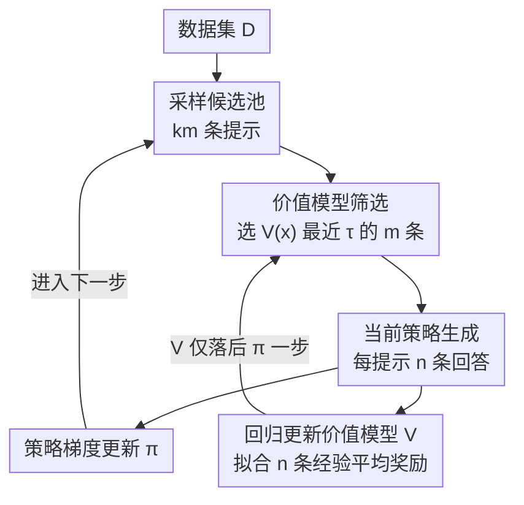

# Prompt Curriculum Learning for Efficient LLM Post-Training

**会议**: ICLR 2026  
**OpenReview**: [https://openreview.net/forum?id=zqOCacBD3P](https://openreview.net/forum?id=zqOCacBD3P)  
**代码**: 待确认  
**领域**: 强化学习 / LLM 后训练  
**关键词**: RLVR, 课程学习, 价值模型, 提示难度, 批大小

## 一句话总结
本文系统研究了 RL 后训练 LLM 时「批大小」与「提示难度」如何共同影响收敛，发现存在最优批大小、且成功率约 50% 的中等难度提示最高效，据此提出用一个在线学习的价值模型单次前向预测提示难度来筛选中等难度提示的轻量算法 PCL，在数学推理基准上要么取得最高性能、要么大幅缩短训练时间，且筛选提示比基于 rollout 的方法快 12.1×～16.9×。

## 研究背景与动机
**领域现状**：用带规则奖励的强化学习（PPO、GRPO 这类 RLVR）后训练 LLM，让模型在数学、代码这类可验证任务上自我探索、迭代提升，已经成为造就 o1、DeepSeek-R1 等强推理模型的关键手段。近期一批工作（DAPO、SPEED、GRESO 等）反复发现一个规律：在「中等难度」提示（对当前策略既不太易也不太难）上训练，数据效率明显更高。

**现有痛点**：识别中等难度提示的现有做法都有硬伤。一类靠当前模型实际 rollout 来估每条提示的成功率，但在线生成极贵，被筛掉的那些提示的生成全部白费；另一类靠一个字典记录历史 epoch 的平均奖励，当数据集很大、一个 epoch 都跑不完时，历史估计严重 off-policy，反映不了当前模型的真实水平。此外，已有工作几乎只盯着提示难度，对批大小这类同样深刻影响收敛的超参却基本没系统研究过。

**核心矛盾**：RL 后训练的收敛同时被两组互相拉扯的因素左右——生成时间越短、更新越频繁，但批越大、提示越多样、有效梯度比例越高则梯度噪声越小；二者通过「批大小」「提示数 m」「每提示生成数 n」耦合在一起，存在天然 trade-off，过去没人把它们放在一起量化。

**本文目标**：（1）厘清批配置与提示选择如何**联合**影响收敛，找出最优批大小及其分解方式；（2）据此设计一个**计算高效**的课程算法，既能持续聚焦中等难度提示，又不付出 rollout 筛选的高昂代价。

**切入角度**：作者花了约 10 万 A100 GPU 小时做大规模消融，把「收敛」明确定义为固定算力与时间预算下达到的最终奖励，然后逐一拆解生成时间、提示多样性、有效梯度比例这三条通路。这个角度的价值在于：一旦定位到「中等难度提示能用更小的 n 就拿到高有效比例」，就能腾出预算去加大 m 提升多样性，实现两全。

**核心 idea**：用一个在线训练的价值模型 $V(x)$ 单次前向预测提示难度，贪心挑出预测难度最接近 0.5 的中等难度提示来训练，从而**用一次前向替代一整轮 rollout** 来做课程筛选。

## 方法详解

### 整体框架
PCL（Prompt Curriculum Learning）要解决的是「如何在不浪费生成算力的前提下，每一步都把训练集中在对当前策略最有信息量的中等难度提示上」。整体是一个与策略训练同步进行的在线循环：每一步先从数据集采一个**更大的候选池**（$km$ 条提示），用价值模型对每条提示做一次前向预测其期望奖励 $V(x)\approx p_\pi(x)$，贪心选出预测值最接近阈值 $\tau$（默认 0.5）的 $m$ 条；对这 $m$ 条用当前策略各生成 $n$ 条回答，做标准策略梯度更新；最后用这一步真实生成的回答（而非额外 rollout）回归更新价值模型。整套流程的额外开销几乎只有「价值模型的一次前向 + 一次小回归」，因为提示通常不到 1K token。

### 关键设计

**1. 最优批大小：在生成时间与梯度噪声之间找拐点**

这针对的是「批越大梯度越稳、但生成越慢」的矛盾。作者把批大小 $b$ 拆成提示数 $m$ 与每提示生成数 $n$（$b=m\times n$），并观察到一个关键现象：随批大小增大，每步生成时间**先亚线性、后线性**增长——小批时生成时间被批内最长那条回答主导，批大时则被算力利用率主导。最优批大小恰好落在亚线性转线性的拐点：比它小，可以用亚线性的时间换来线性更多的生成；比它大，则同样时间内更新次数变少。实验里这个最优点在约 8K，且无论分解成 $(m,n)=(512,16)$、$(256,32)$ 还是 $(128,64)$ 都成立——也就是**最优批大小固定、与如何分解无关**。作者在不同模型架构、规模、数据集、上下文长度、硬件、rollout 引擎（vLLM vs SGLang）上都验证了该规律的稳健性。

**2. 中等难度提示最高效：$p(x)\approx0.5$ 是有效比例与多样性的甜点**

这一条解释了「为什么要做课程」。定义有效比例（effective ratio）为一个 batch 中**优势非零**的样本占比，即真正贡献梯度信号的比例——在纯 on-policy GRPO 目标下，若一条提示的 $n$ 个回答全对或全错，则优势 $A(x,y)=r(x,y)-p_\pi(x)$ 为零、梯度消失。作者通过对提示做难度可控的下采样实验发现：增大 $n$ 总能提升有效比例，但 $p(x)=0.5$ 的提示即使在很小的 $n$ 下就有最高有效比例（$n=16$、$p=0.5$ 已超过其他难度在 $n=128$ 时的有效比例），同时 $p(x)=0.5$ 还带来最高的梯度范数与测试精度。更妙的是：既然存在最优批大小，那么聚焦 $p(x)=0.5$ 就能用更小的 $n$ 换更大的 $m$，在保持高有效比例的同时提升提示多样性——鱼与熊掌兼得。值得注意的是对 $p=0.5$ 的提示，$n$ 超过 32 后精度反而下降，作者归因于 $m$ 变小导致多样性不足、梯度噪声回升。

**3. 价值模型在线筛选：用一次前向替代一整轮 rollout**

这是 PCL 的算法核心，直接解决「rollout 筛选太贵、字典筛选太 off-policy」的痛点。在第 $t$ 步，从数据集采 $km$ 条候选提示，用价值模型对每条预测期望奖励，再贪心求解
$$\mathcal{D}_m=\underset{S\subseteq\mathcal{D}_{km},\,|S|=m}{\arg\min}\sum_{x\in S}\big|V^{\pi_{t-1}}(x)-\tau\big|$$
即选出预测难度最接近目标阈值 $\tau$ 的 $m$ 条。对选中的提示各生成 $n$ 个回答做策略更新，再用这 $n$ 个回答的经验平均奖励作为标签、最小化
$$\sum_{i=1}^{m}\Big(V(x_i)-\frac{1}{n}\sum_{j=1}^{n}r(x_i,y_{i,j})\Big)^2$$
在线更新价值模型——**不需要任何额外 rollout**。由于价值模型只吃提示（数学题通常不到 1K token），训练与推理开销可忽略。算法里价值模型 $V$ 落后策略 $\pi$ 一步（$V^{\pi_{t-1}}$），但因每步更新很小、$\pi_{t+1}\approx\pi_t$，这种一步滞后可以接受。相比 rollout 筛选，价值模型筛选在 MATH/DeepScaleR 上分别快 12.1× 与 16.9×；相比字典法，它始终用当前策略训练出的价值模型，远比基于上一 epoch 历史奖励的字典更 on-policy。

### 损失函数 / 训练策略
策略侧采用纯 on-policy 的 GRPO 变体，去掉对参考策略的 KL 正则与基于标准差的优势正则，最大化
$$\mathbb{E}_{x\sim D,\,y\sim\pi_t(\cdot|x)}\Big[\frac{1}{|y|}\sum_{l=1}^{|y|}\frac{\pi(y_l|x,y_{<l})}{\pi_t(y_l|x,y_{<l})}A(x,y)\Big]$$
这与策略梯度同梯度，可直接由最大化期望奖励推得，刻意做干净以便分析。价值模型侧用式 (2) 的回归损失在线更新。主实验固定 $m=512$、$n=16$、$\tau=0.5$、$k=4$，多数运行限 2 天预算（Qwen3-8B 在 DeepScaleR 上 3 天）。

## 实验关键数据

### 主实验
模型覆盖 Qwen3-Base（1.7B/4B/8B）与 Llama3.2-3B-it，数据集为 MATH 与 DeepScaleR，评测含 MATH500、Olympiad-Bench、Minerva、AMC23、AIME24/25。Time 为达到最佳平均性能那个 checkpoint 的训练+生成总时长（小时）。

| 数据集/模型 | 指标 | PCL | 次优基线 | 说明 |
|--------|------|------|----------|------|
| MATH / Qwen3-8B-Base | MATH500 | **88.2** | DS 87.8 | 最高精度 |
| MATH / Qwen3-4B-Base | MATH500 / Time | 83.4 / **14.0h** | GRPO 83.0 / 29.2h | 同精度约半时间 |
| MATH / Llama3.2-3B-it | MATH500 | **57.8** | SPEED-class 56.8 | 最高精度 |
| DeepScaleR / Qwen3-8B-Base | 平均 / Time | **52.0** / 41.8h | DS 51.5 / 69.5h | 比 DS 快约 39.8% |

PCL 在 MATH 上四个模型均取得最高 MATH500 精度；在 DeepScaleR 上以相近或更优精度大幅缩短收敛时间。DS 因每步对全部 $km$ 提示做 $n$ 次生成而极慢；SPEED 用旧策略预生成 rollout 当成当前策略用，引入严重 off-policy，多数运行几小时内崩溃；GRESO 的字典基于上一 epoch 过时策略，数据集大时同样 off-policy。

### 消融实验

| 配置 | 关键发现 | 说明 |
|------|---------|------|
| 价值模型精度 | 解释方差 ≈ 用 3 次 rollout 估计 | $km=2048$ 时 3 次 rollout 需 288s(MATH)/396s(DSR)，价值模型仅 23.9s/23.5s |
| 阈值 $\tau$ | $\tau=0.5$ 预测精度最高 | 偏离 0.5 越远越差；$\tau=0.5$ 与「不筛选」基线相当 |
| 难度漂移 | PCL 训练中逐渐聚焦更难提示 | 固定 $\tau=0.5$，但随策略变强，原本难的提示落入中等区间 |

### 关键发现
- **价值模型够准且够省**：仅训练一个随机初始化的预测头，在线训练后其难度预测的解释方差就追平「用约 3 次真实 rollout 估计」的水平，却把筛选时间压到十几秒，带来 12.1×～16.9× 加速。
- **$\tau=0.5$ 不仅最高效还最利于价值模型学习**：在 0.5 处筛选恰好覆盖二元奖励的中点、捕获多样的奖励结果，若策略平均奖励偏离 0.5 还能隐式再平衡数据；用 0.1 或 0.9 这类极端阈值则导致严重标签不平衡、价值模型精度骤降。
- **PCL 自适应跟踪难度**：用 $\pi_{ref}$ 生成 16 条回答作难度代理，发现做筛选的方法（DS/SPEED/PCL）选中提示的 $\pi_{ref}$-奖励持续下降，即随训练聚焦越来越难的题；而 GRPO、Pre-filter 几乎不变——Pre-filter 因只按 $\pi_{ref}$ 排除难题、之后再不回访，会一直在「当前看来已变简单」的题上空转。
- **有效比例 vs 生成时间**：PCL 始终保持比 GRPO/Pre-filter 更高的有效比例；DS/SPEED 靠重采样把有效比例堆到 1，却分别多花 105%、81.8% 生成时间。

## 亮点与洞察
- **把「难度筛选」从生成问题变成预测问题**：核心洞察是中等难度提示的价值是可被一个轻量价值模型在线学到的，于是用「一次前向」替代「一整轮 rollout」，这是把课程学习落地到 RLVR 大规模训练的关键工程跃迁。
- **最优批大小与分解解耦**：发现 8K 这一最优批大小与 $(m,n)$ 分解无关，是个很可复用的实践结论——可以放心地用「中等难度 → 小 $n$ 大 $m$」来同时拿到有效比例与多样性。
- **$\tau=0.5$ 的双重作用**：既是样本效率甜点，又恰好是价值模型学得最好的点（隐式数据再平衡），这个巧合让 PCL 不必在「筛得准」和「学得好」之间取舍。
- **可迁移思路**：用一个只吃输入、不吃输出的轻量价值/难度模型来做在线课程筛选，可迁移到代码、Agent 等任何 rollout 昂贵、又关心样本难度分布的 RL 后训练场景。

## 局限与展望
- 实验聚焦数学推理（二元可验证奖励），价值模型直接回归 0/1 平均奖励，对非二元、稠密或主观奖励任务是否同样有效未验证。
- 价值模型落后策略一步的近似依赖「每步更新很小」，在更激进的学习率或更大步长下这一假设可能失效。
- 为何 $\tau=0.5$ 能让价值模型训练如此有效，作者只给了直觉（数据再平衡），缺乏理论刻画，是明确的未来方向。
- 横向时间比较需谨慎：不同方法在不同数据集/模型规模/崩溃行为（如 SPEED 早崩导致「收敛时间」偏低）下不可直接比大小。

## 相关工作与启发
- **vs Dynamic-Sampling (DS)**：DS 用 $n$ 次 rollout 估每条提示难度并过滤全对/全错的提示，能把有效比例做到 1，但每步对全部候选生成、生成时间翻倍以上；PCL 用价值模型预测替代 rollout，精度相近而速度快一个量级。
- **vs SPEED**：SPEED 用旧策略预生成的 rollout 当作当前策略来估难度以省生成，但引入严重 off-policy，实测多数运行短时间内崩溃；PCL 的价值模型始终用当前策略生成的回答在线更新，更 on-policy。
- **vs GRESO（字典法）**：GRESO 维护历史奖励字典跳过无信息提示，数据集大、一个 epoch 都跑不完时历史估计严重过时；PCL 不依赖跨 epoch 历史，适配大数据集。
- **vs Pre-filter**：Pre-filter 用固定 $\pi_{ref}$ 一次性排除难题、之后不回访，随策略变强会一直在已变简单的题上训练；PCL 的动态阈值能随策略改进自动跟踪难度漂移。

## 评分
- 新颖性: ⭐⭐⭐⭐ 把在线价值模型用于提示难度课程筛选，思路简洁但切中 RLVR 训练效率痛点
- 实验充分度: ⭐⭐⭐⭐⭐ 约 10 万 GPU 小时，跨模型/规模/数据集/硬件/引擎系统验证，基线齐全
- 写作质量: ⭐⭐⭐⭐ 从现象到机制再到算法的逻辑链清晰，图表支撑充分
- 价值: ⭐⭐⭐⭐⭐ 最优批大小与中等难度结论极具实践指导性，PCL 即插即用且开销可忽略

<!-- RELATED:START -->

## 相关论文

- [\[ICML 2026\] Provable Benefit of Curriculum in Transformer Tree-Reasoning Post-Training](../../ICML2026/reinforcement_learning/provable_benefit_of_curriculum_in_transformer_tree-reasoning_post-training.md)
- [\[ICLR 2026\] Scheduling Your LLM Reinforcement Learning with Reasoning Trees](scheduling_your_llm_reinforcement_learning_with_reasoning_trees.md)
- [\[ICLR 2026\] Representation-Based Exploration for Language Models: From Test-Time to Post-Training](representation-based_exploration_for_language_models_from_test-time_to_post-trai.md)
- [\[ACL 2026\] Scaling Behaviors of LLM Reinforcement Learning Post-Training: An Empirical Study](../../ACL2026/reinforcement_learning/scaling_behaviors_of_llm_reinforcement_learning_post-training_an_empirical_study.md)
- [\[ICLR 2026\] Post-training Large Language Models for Diverse High-Quality Responses](post-training_large_language_models_for_diverse_high-quality_responses.md)

<!-- RELATED:END -->
