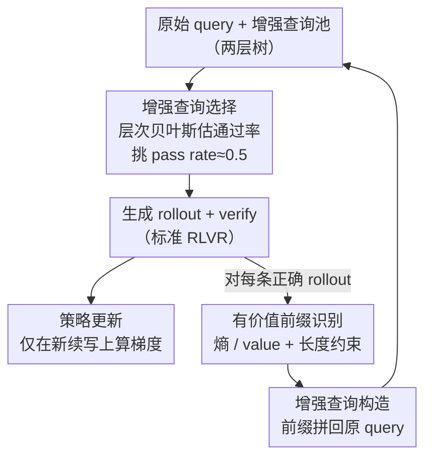

# PROS: Towards Compute-Efficient RLVR via Rollout Prefix Reuse

**会议**: ICLR 2026  
**OpenReview**: [https://openreview.net/forum?id=lz1SRTcnUb](https://openreview.net/forum?id=lz1SRTcnUb)  
**代码**: 待确认  
**领域**: LLM推理 / 强化学习 / RLVR 效率  
**关键词**: RLVR, 前缀复用, 增强查询, 层次贝叶斯, 训练效率

## 一句话总结
PROS 发现同一道题的多次 rollout 在早期推理步骤高度重复，于是把历史 rollout 中"有价值的前缀"拼回原始 query 构造成"增强查询（Augmented Query）"供后续迭代复用，既省掉重复生成的算力，又用一个层次贝叶斯模型估计每条增强查询的通过率、优先训练通过率接近 0.5 的样本，在 AIME24 / AMC23 上以更少 wall-clock 时间取得比 PPO/GRPO 更高的准确率。

## 研究背景与动机

**领域现状**：用可验证奖励的强化学习（RLVR）训练大型推理模型（LRM）已成为提升复杂推理能力的主流路径——模型作为策略生成思维链（CoT），确定性 verifier 对最终答案给二元奖励，再用 PPO/GRPO 等策略梯度方法更新参数。每个训练迭代包含「选 query → 生成 rollout → verify → 更新」四步。

**现有痛点**：RLVR 严重依赖 on-policy 的 rollout 生成，而这一步的开销随 CoT 长度和模型规模迅速膨胀。作者实测（Figure 2a）：固定 batch 和硬件下，随着最大 rollout 长度增大，生成时间占整体训练时间的比例急剧上升，当模型规模达到上千亿、上下文上十万 token 时，rollout 生成已成为训练的主要瓶颈。

**核心矛盾**：作者把同一 query 在不同迭代下独立采样的轨迹组织成一棵树（Figure 1），观察到两类冗余。其一是**早期步骤的近重复**：不同 rollout 的开头往往共享相似的 setup（如同样去分析 base case），只是后期才发散；他们在 DAPO-Train 上对每条 query 采 64 条 rollout，用归一化编辑距离和 Rouge-L 度量前缀相似度，发现前缀越短相似度越高，证实早期步骤被反复重新生成是浪费。其二是**早期死胡同的浪费**：正确轨迹在推理空间中稀疏，朴素多采样可能一开始就走进死分支（如 Figure 1 中第 10–30 迭代第一步就错），却仍要把长长的 suffix 生成完，贡献很低的训练价值。

**本文目标**：在不改动主算法逻辑的前提下，既减少早期近重复生成的算力，又把算力重新分配到后期更有意义的探索上。

**核心 idea**：用模型自己历史 rollout 的高价值前缀，拼成"增强查询"喂回后续训练——既避免重复生成早期步骤（省算力），又让策略从优质起点出发、绕开早期死胡同（跨迭代的搜索剪枝）。

## 方法详解

### 整体框架
PROS（Prefix Reuse for On-policy Sampling）作为插件挂在标准 RLVR 流水线旁边：右半部分仍是标准的「选 query → 生成 → verify → 更新」四步，PROS 只在其上加两个开销可忽略的模块——**增强查询构造**（Section 3）和**增强查询选择**（Section 4）。

具体地，每个迭代里：对每条**正确**的 rollout，PROS 用 token 级熵（和 critic 的 value，若是 actor-critic）找出其中最有价值的前缀 $y[:t^*]$，把它拼回原始 query 得到一条增强查询 $q' = \text{concat}(q, y[:t^*])$，作为新 query 加入训练集。随着训练推进，数据集长成一棵**两层树**：每条原始 query 是父节点，由它派生的增强查询是子节点。增强查询在训练时和普通 query 一视同仁——策略在「历史前缀 + 原 query」的条件下继续生成后续推理，RL 更新**只在新生成的续写上**做信用分配与梯度，复用的历史前缀不参与梯度（防止过拟合到旧步骤）。由于增强查询数量随迭代爆炸增长，PROS 再用一个层次贝叶斯模型估计每条增强查询的通过率，优先挑通过率接近 0.5 的来组训练 batch。

值得强调的是，增强查询只提供策略自己产生的、未经验证的**部分**推理步骤，不泄露最终答案，因此保持了算法的 on-policy 性质，区别于离线经验回放。

### 关键设计

**1. 增强查询构造：把历史好前缀拼回 query，跨迭代复用**

针对"早期步骤被反复重新生成"的冗余，PROS 不去缓存整条轨迹做离线回放，而是只取**前缀**拼回原 query 形成增强查询 $q' = \text{concat}(q, y[:t^*])$，再当成普通 query 喂回后续迭代。这样做有两层收益：一是策略从一段已经走对的中间状态继续，省掉了把早期步骤再生成一遍的算力；二是它天然实现了跨迭代的搜索剪枝——让策略复用优质开头、避开早期死胡同，把算力重新分配到后期更有意义的探索上，从而学到更丰富的推理模式。关键在于 RL 更新**只对新续写部分**做信用分配和梯度，复用的前缀不参与梯度，避免策略过拟合到自己过去生成的那几步；同时增强查询不含最终答案，保持 on-policy 性质，与会破坏分布的经验回放有本质区别。

**2. 有价值前缀识别：用熵和 value 信号定位"值得复用"的截断点**

核心问题是从一条 rollout 里挑哪段前缀来复用。PROS 用两个几乎零开销的信号：**不确定性信号**用 token 级熵——RLVR 本来就要前向算每步 log-prob，熵顺手就有；熵高说明策略对下一步不确定，前缀正处在未充分探索、信息量大的区域，复用它能鼓励探索、缓解过自信。**价值信号**则借用 actor-critic（如 PPO）已学好的 critic value——value 高的前缀更可能通向正确答案，复用它把算力聚焦到有希望的方向。实现上，从每条正确 rollout 中取熵最高的截断点 $t^* = \arg\max_{t\in[0,T)} \text{Entropy}(\pi(\cdot|y_{<t}, q))$；若底层是 actor-critic，额外用 value 作过滤，把 $t^*$ 限制在预测 value 最高的前 10% 时间步。此外加一个粗但有效的**长度约束** $t^* \in [\tfrac{1}{4}T, \tfrac{3}{4}T)$，保证复用前缀既能带来非平凡的生成时间节省，又不会把解答泄露太多、给探索留足空间。

**3. 层次贝叶斯通过率估计与选择：从历史奖励推断、优先训练 0.5 附近的样本**

针对"增强查询爆炸增长、该训哪条不好选"的问题，作者依据"通过率接近 0.5 的 query 可学习性最强"这一原则来挑 batch。但已有的 Dynamic Sampling 等在线过滤需要对每条 query 都先生成 rollout 才能知道通过率，开销大。PROS 改为**从历史奖励统计里用贝叶斯推断估计通过率**，无需额外生成。它利用增强查询数据集的树结构建一个**两层 logit-normal 模型**：设通过率 $\theta = \text{sigmoid}(\psi)$，父节点 log-odds $\psi_{par} \sim \mathcal{N}(\mu, \tau^2)$，子节点条件高斯 $\psi_i | \psi_{par} \sim \mathcal{N}(\psi_{par}, \sigma^2)$，每次用该 query 采样观测到一个二元奖励 $r \sim \text{Bern}(\theta)$。这个先验编码了"增强查询和它的父 query 解同一道题、只是从中间状态起步，所以子的通过率应与父相关"的归纳偏置，让相关 query 间共享信息、提高统计效率。由于 Bernoulli 似然与 Gaussian 先验非共轭，作者引入 **Pólya-Gamma 辅助变量**把条件后验变成高斯，从而能用 Gibbs 采样（Proposition 4.1/4.2 给出父子节点的全条件分布），采出后验 $\tilde\psi$ 估出 $\tilde\theta = \sigma(\tilde\psi)$，最后挑通过率最接近 0.5 的增强查询组 batch。

**4. 指数遗忘：应对策略漂移的非平稳通过率**

随着训练推进策略不断进化，query 的真实通过率会缓慢漂移，旧的奖励统计会过时。PROS 在每次迭代前用遗忘因子 $\lambda \in (0,1)$ 缩小每条增强查询的历史统计 $s_i$ 和 $n_i$ 再并入新观测，使更近期的奖励对后验更新影响更大，让采样器能跟上策略的改进。这是个简单但必要的补丁——没有它，非平稳环境下的通过率估计会偏向陈旧信息。

### 一个完整示例
以 Figure 3 的流程走一遍：训练 batch 里有 $q_2, q_4, q_5$（它们的估计通过率 $\tilde\theta$ 都接近 0.5，被选中）→ 生成 rollout $y_i$ → verify 得奖励 $r_i$ → 更新策略。随后对其中正确的 rollout（如 $q_3$ 对应的 $y_3$），从中找出熵最高、落在 $[\tfrac14 T, \tfrac34 T)$ 的截断点 $t^*$，构造增强查询 $q' = \text{concat}(q_3, y_3[:t^*])$ 加入数据集，成为 $q_3$ 的子节点。下一轮选择时，层次贝叶斯模型会基于 $q'$ 父节点 $q_3$ 的历史与 $q'$ 自身的少量观测，估出 $q'$ 的通过率，若接近 0.5 则进入训练 batch。如此循环，数据集逐渐长成两层树，算力被持续导向"对策略最有学习价值"的中间起点。

### 损失函数 / 训练策略
PROS 不改 PPO/GRPO 的目标 $\max_\theta \mathbb{E}_{q;y\sim\pi_\theta(\cdot|q)}[R(q,y)]$，只是把"在哪些（增强）query 上、从哪个起点开始续写"换掉，且梯度只作用于新续写。主实验在 Qwen3-8B 上跑 PPO 和 GRPO，DAPO-Train 训 400 迭代、AIME-Old 训 300 迭代，每 query 采 8 条 rollout，batch 512 / mini-batch 64，最大回复长度 6144 token。

## 实验关键数据

### 主实验
在 Qwen3-8B 上，PROS 作为插件分别接 PPO/GRPO，在两个训练集、两个 benchmark 上全面优于强基线（Pass@1）：

| 训练集 / 算法 | AIME24 | AMC23 | #Time(min/迭代) | 说明 |
|------|------|------|------|------|
| PPO (DAPO-Train) | 28.23 | 73.63 | 9.17 | vanilla |
| PPO + Dynamic Sampling | 28.85 | 66.69 | 17.62 | 强但 2–4× 耗时 |
| PPO + PROS | **33.23** | **78.20** | 9.77 | 准确率最高、时间接近 vanilla |
| GRPO (DAPO-Train) | 29.58 | 73.40 | 6.58 | vanilla |
| GRPO + PROS | **34.17** | **78.28** | 7.57 | 同样领先 |

作者报告插件化后 PPO/GRPO 在 AIME24 / AMC23 上平均分别提升 +3.96 和 +6.21 点。Qwen3-4B（AIME-Old）上趋势一致：PROS 27.40 / 62.12，优于 vanilla 21.25 / 52.59 且时间仅 6.21min（vs Dynamic 的 10.83min）。

### 消融实验

| 配置 | AIME24 | AMC23 | 结论 |
|------|------|------|------|
| PROS-ablation（前缀复用 + 随机选） | 31.35 | 73.93 | 仅前缀复用就已提效提点 |
| PROS（前缀复用 + 贝叶斯选择） | 33.23 | 78.20 | 加上选择机制进一步涨点 |

超参数 ablation（GRPO / AIME-Old，σ 与 λ）显示 PROS 在所有设置下都稳定优于 vanilla（AMC23 59.98 / AIME24 31.04）：σ=0.3、λ=0.99 为默认最佳（67.53 / 34.38），且通过率估计误差随训练推进越来越小。

### 关键发现
- **前缀复用本身就是主要增益来源**：PROS-ablation 已显著提效提点，说明"复用优质前缀 + 只在续写上算梯度"这一机制是核心；贝叶斯选择是锦上添花。
- **效率优势体现在 wall-clock**：Dynamic Sampling 靠反复拒绝采样能拿到高分但慢 2–4×，PROS 用接近 vanilla 的时间拿到更高分（Figure 5 的性能-时间曲线 PROS 全程占优）。
- **长度缩放不崩**：vanilla PPO/GRPO 及其 replay/priority 变体在 AIME-Old 上出现 length collapse，PROS 的 rollout 长度持续增长，保住了 test-time scaling 的潜力（Figure 6）。

## 亮点与洞察
- **把"算力浪费"问题转成"数据增强"问题**：别人想着压缩生成 / 蒸馏，PROS 直接把历史 rollout 的好前缀变成新训练样本，既省生成又做了跨迭代剪枝——一个动作解决两类冗余，思路很巧。
- **梯度只作用于续写**这一细节是关键：它让"复用前缀"不退化成"对自己旧输出做模仿学习"，从而保住 on-policy 性质，区别于会引入分布偏移的经验回放。
- **用 Pólya-Gamma 让 Bernoulli-Gaussian 层次模型可 Gibbs 采样**：这是把贝叶斯实验设计（挑 0.5 附近样本）落到 RLVR 在线选择里的工程关键，且估计开销可忽略，是可迁移到其它"在线数据选择"场景的 trick。
- 用 token 级熵当前缀价值信号"几乎免费"——因为 log-prob 本来就要算——这种"复用既有计算量"的设计值得借鉴。

## 局限与展望
- 作者承认增强查询的构造目前仍偏简单，仅依赖熵和 value 信号，可能引入偏差；更有原则性的前缀识别准则、与其它不确定性估计的自适应结合是未来方向。
- 实验集中在数学推理（AIME/AMC）与 Qwen3-4B/8B，是否能推广到代码生成、更长 CoT、更大模型尚待验证。
- PROS 的额外开销主要来自其"长度缩放"行为带来的更长 CoT——也就是说省下的早期生成时间，部分被后期更长的探索吃掉，效率优势更多体现在"同等时间内更高分"而非绝对生成量大降。
- 通过率估计依赖层次先验（子与父相关）这一归纳偏置，当增强查询与父 query 难度差异较大时，先验是否仍成立值得审视。

## 相关工作与启发
- **vs 经验回放（Experience Replay / PPO 多 epoch 复用）**: 回放复用整条历史轨迹，易过拟合、熵崩、破坏 on-policy 分布；PROS 只复用**前缀**且不在前缀上算梯度，保持 on-policy，实验里 Replay 只提效不提点，PROS 两者兼得。
- **vs 提供参考解 / hint 的方法**: 后者用人工标注的部分参考解降低难度，成本高；PROS 的"部分解"直接来自模型自己的历史 rollout，无需外部标注，更适合复杂推理。
- **vs Dynamic Sampling / 在线过滤（DAPO 等）**: 它们靠对每条 query 在线生成 rollout 再按通过率过滤，开销大；PROS 改为从历史奖励**贝叶斯估计**通过率，无需额外生成即可挑 0.5 附近样本，同时针对其特有的层次增强数据集设计。

## 评分
- 新颖性: ⭐⭐⭐⭐⭐ "前缀复用构造增强查询 + 层次贝叶斯在线选择"组合，把算力冗余转成数据增强，角度新颖
- 实验充分度: ⭐⭐⭐⭐ 覆盖 PPO/GRPO×两数据集×两 benchmark + 4B/8B + 超参 ablation，但局限于数学推理域
- 写作质量: ⭐⭐⭐⭐⭐ 动机分析（树结构冗余）有数据支撑，方法与贝叶斯推导清晰
- 价值: ⭐⭐⭐⭐⭐ 即插即用、开销可忽略，直击 RLVR scaling 的生成瓶颈，实用性强

<!-- RELATED:START -->

## 相关论文

- [\[ICLR 2026\] Parameter-Efficient Reinforcement Learning using Prefix Optimization](parameter-efficient_reinforcement_learning_using_prefix_optimization.md)
- [\[ICML 2026\] Single-Rollout Hidden-State Dynamics for Training-Free RLVR Data Selection](../../ICML2026/reinforcement_learning/single-rollout_hidden-state_dynamics_for_training-free_rlvr_data_selection.md)
- [\[ICLR 2026\] The Art of Scaling Reinforcement Learning Compute for LLMs](the_art_of_scaling_reinforcement_learning_compute_for_llms.md)
- [\[ICLR 2026\] Generalization of RLVR Using Causal Reasoning as a Testbed](generalization_of_rlvr_using_causal_reasoning_as_a_testbed.md)
- [\[ICLR 2026\] Controllable Exploration in Hybrid-Policy RLVR for Multi-Modal Reasoning](controllable_exploration_in_hybrid-policy_rlvr_for_multi-modal_reasoning.md)

<!-- RELATED:END -->
