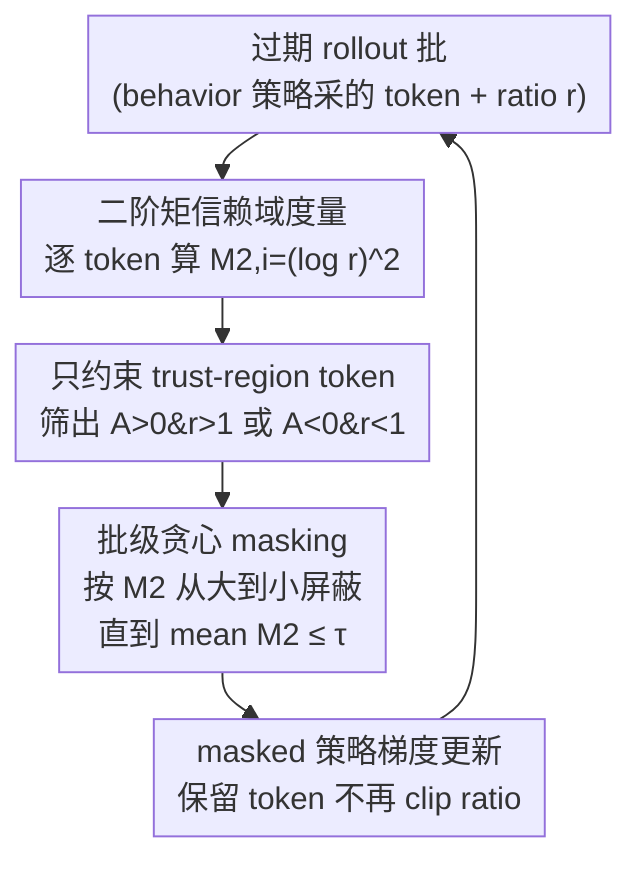

# Prosperity before Collapse: How Far Can Off-Policy RL Reach with Stale Data on LLMs?

**会议**: ICLR 2026  
**OpenReview**: [https://openreview.net/forum?id=IIgl5MWelz](https://openreview.net/forum?id=IIgl5MWelz)  
**代码**: https://github.com/Infini-AI-Lab/M2PO/  
**领域**: LLM 推理 / 强化学习 / 异步 off-policy RL  
**关键词**: RLVR, 过期数据, 信赖域, 二阶矩, importance sampling

## 一句话总结
针对异步 RL 训练 LLM 时 rollout 数据严重过期（stale）会导致性能退化或训练崩溃的问题，本文先揭示「先繁荣后崩溃」现象——过期数据其实和 on-policy 数据一样信息丰富，关键在于怎么用——再提出 M2PO，用 importance weight 的二阶矩 $M_2$ 替代 $\epsilon$-clipping 来约束信赖域，只屏蔽极端离群 token、保留绝大多数有用更新，在 1.7B~32B 六种模型上即便数据过期 256 次更新仍能稳定训练并追平 on-policy 性能。

## 研究背景与动机

**领域现状**：用可验证奖励的强化学习（RLVR）训练 LLM 推理能力是当下主流（o1、DeepSeek-R1 都靠它），PPO / GRPO 这类算法绝大多数是 on-policy 设计——每次参数更新都要用当前策略现采的新鲜 rollout，训练稳、性能可靠。

**现有痛点**：on-policy 的「每步都要新鲜 rollout」在复杂推理 / agentic 任务上代价极高。比如 SWE-bench 配 OpenHands，单条 rollout 要做多步工具调用和代码执行，端到端延迟可达上百分钟、几十轮交互。为了提效，异步 RL 系统把 rollout 生成和训练解耦，但这要求算法能容忍 rollout 数据「过期」（behavior 策略和当前策略之间隔了很多次更新）。而现有算法在大 staleness 下要么稳但掉点（PPO、GRPO、GSPO），要么追性能但容易训练崩溃（AREAL、CISPO、GPPO 等）。

**核心矛盾**：作者通过移除信赖域（令 $\epsilon=\infty$）做对照实验，发现一个反直觉的「先繁荣后崩溃」（prosperity before collapse）现象：在 $s=256$ 的过期数据上，不加 clipping 的训练前期反而比 GRPO 的 $\epsilon$-clipping 更强、有时甚至追平 on-policy，只是最终因方差失控而崩溃。这说明**过期数据本身信息量并不差，问题出在算法怎么利用它**。进一步分析 9000 万训练 token 发现：$\epsilon$-clipping 在过期数据下裁剪率急剧上升，而被裁掉的恰恰是 $|r-1|$ 大、熵高的 token——这些高熵 token 既是最有信息量的学习信号，又是 off-policy 不稳定的最大来源，形成两难。

**本文目标**：设计一个信赖域策略，既保留高熵 token 的学习信号、又不让它们把训练带崩，从而在大 staleness 下做到「繁荣而不崩溃」。

**核心 idea**：放弃逐 token 的 $\epsilon$-clipping，改用整批 importance weight 的**二阶矩** $M_2 = \frac{1}{N}\sum_i(\log r_i)^2$ 作为分布差异度量，只对让 $M_2$ 超阈值的极端离群 token 做屏蔽，其余更新全部保留。

## 方法详解

### 整体框架

M2PO（Second-Moment Trust Policy Optimization）建立在 GRPO 之上，只替换了「信赖域怎么约束」这一环。GRPO 的目标是用组内归一化优势 $A_{i,t}=\frac{r_i-\text{mean}(\{R\})}{\text{std}(\{R\})}$ 配合 importance ratio $r_i=\frac{\pi_\theta(o_i|q)}{\pi_{\text{behav}}(o_i|q)}$ 做策略梯度，原本靠 $\epsilon$-clipping 把 $r$ 夹在 $[1-\epsilon,1+\epsilon]$ 内防止大更新。M2PO 的做法是：拿到一批过期 rollout 后，先算每个 token 的二阶矩贡献 $\hat M_{2,i}=(\log r_i)^2$，再只在「会被 PPO clip 影响的 trust-region token」上做约束，按 $\hat M_{2,i}$ 从大到小贪心屏蔽 token，直到剩余 token 的批级均值 $\bar M_2$ 降到阈值 $\tau_{M_2}$ 以下，最后用这个 mask 过滤后的 token 做一次普通的策略梯度更新（不再 clip ratio）。整体是「度量 → 筛选作用域 → 贪心屏蔽 → 更新」的单向流水线。

### 关键设计

**1. 二阶矩信赖域度量：用 $(\log r)^2$ 取代逐 token 的 $\epsilon$-clip 和批级 KL**

off-policy 不稳定的根源是 behavior 策略和当前策略的分布错位，错位越大、importance sampling 修正的方差越大、梯度越噪。一个自然的度量是批级 KL $\hat{\text{KL}}=-\frac{1}{N}\sum_i\log r_i$，但它有两个硬伤：第一，单样本估计下 $\hat{\text{KL}}_i$ 可正可负，大正大负互相抵消会得到「假性很小」的 KL；第二，$r_i>1$ 的 token 其 $\hat{\text{KL}}_i$ 为负反而把估计值拉小，等于完全不约束这些可能引发不稳定的 token。作者改用对数比的二阶矩 $\hat M_2=\frac{1}{N}\sum_i(\log r_i)^2$：每个 token 贡献恒非负，$r>1$ 时也能可靠约束；而且 KL 只反映均值漂移，$M_2$ 还反映 importance weight 的方差，对极端比值的离群 token 更敏感。理论上（Theorem 1）在 $1/R\le r\le R$ 假设下 $M_2$ 给出了 Pearson 卡方散度 $\chi^2(\pi_{\text{new}}\|\pi_{\text{behav}})=\mathbb{E}[(r-1)^2]$ 的上界 $\chi^2\le R^2 M_2$，所以约束 $M_2$ 间接约束了真正关心的分布差异。

**2. 批级贪心 masking：只切极端离群，保留绝大多数高熵更新**

有了 $M_2$ 度量，问题变成「怎么用它做屏蔽」。M2PO 不像 clipping 那样对每个超界 token 一刀切，而是把约束放到**批级**：先把所有 token 按 $\hat M_{2,i}$ 排序（$O(N\log N)$），然后从 $M_2$ 最大的 token 开始逐个屏蔽（mask 置 0），每屏蔽一个就重算剩余 token 的均值 $\bar M_2$，直到 $\bar M_2\le\tau_{M_2}$ 为止（Algorithm 1）。这样只有少数把整批方差顶上去的极端 token 被剔除，绝大多数高熵但不极端的有信息 token 都保留下来参与更新。效果上，$\epsilon$-clipping 在 $s=256$、Qwen-2.5-32B 上平均裁掉 1.22% 的 token，而 M2PO 只屏蔽 0.06%——降了一个数量级，却精确锁定了高方差 token，从而既稳又不丢学习信号。阈值 $\tau_{M_2}$ 全程固定 $0.04$，对取值不敏感（见消融）。

**3. 只约束 trust-region token：对齐 PPO 的实际裁剪语义**

PPO/GRPO 虽然在 ratio 上下界都设了 clip，但因为外层是 $\min$ 算子，实际只有「$A>0$ 且 $r>1$」或「$A<0$ 且 $r<1$」这两类 token 才真正被裁。M2PO 沿用同样语义，只把 $M_2$ 约束施加在这些 trust-region token 上，其余 token 不参与屏蔽判定。这避免了对那些本就不会引发越界更新的 token 误加约束，保证 M2PO 的行为和 PPO-style clipping 在「该管的地方管」上对齐。最终目标函数为

$$J_{\text{M2PO}}(\theta)=\frac{1}{\sum_{i}|o_i|}\sum_{i=1}^{G}\sum_{t=1}^{|o_i|} M_{i,t}\,\frac{\pi_\theta(o_i|q)}{\pi_{\theta_{\text{behav}}}(o_i|q)}A_{i,t},\quad M_{i,t}\in\{0,1\}$$

其中 $M_{i,t}$ 即贪心屏蔽得到的 mask。注意 loss 是对全部 token 取平均（而非只对未屏蔽 token），以更贴近 PPO clipping 的行为；由于屏蔽比例极小，两种平均方式差别可忽略。

### 损失函数 / 训练策略
优势 $A_{i,t}$ 用 GRPO 的组内归一化方式计算。训练基于 verl + vLLM 实现，math 数据用 DeepScaleR。staleness 通过「stale-k」机制实现：第 $t-k$ 步用当前策略生成 rollout 存入 buffer，再过 $k$ 次更新后在第 $t$ 步消费一次（每条轨迹只用一次、不跨更新复用）；每个训练 step 含 4 次模型更新，故 $s=0$ 实际 staleness 在 0~3、$s=256$ 在 256~259。GRPO baseline 用 $\epsilon=0.2$，M2PO 全程 $\tau_{M_2}=0.04$。

## 实验关键数据

### 主实验
六种模型（1.7B~32B）× 八个数学推理 benchmark（Math500、AIME24/25、AMC23/24、Minerva、Gaokao、Olympiad），在大 staleness $s=256$ 下对比 GRPO / GSPO / M2PO，并以 on-policy（$s=0$）GRPO 为参照。下表为各模型八 benchmark 平均准确率（%）：

| 模型 | GRPO (s=0) | GRPO (s=256) | GSPO (s=256) | M2PO (s=256) |
|------|-----------|--------------|--------------|--------------|
| Llama-3.2-3B-Instruct | 25.2 | 22.5 | 22.6 | **25.3** |
| Qwen2.5-Math-7B | 49.3 | 45.7 | 44.7 | **48.8** |
| Qwen3-Base-1.7B | 33.0 | 30.4 | 30.1 | **36.6** |
| Qwen3-Base-4B | 50.7 | 40.1 | 43.2 | **51.3** |
| Qwen3-Base-8B | 53.6 | 46.7 | — | **55.1** |
| Qwen2.5-32B | 51.6 | 47.0 | — | **52.6** |

M2PO 在 $s=256$ 下全面追平甚至超过 on-policy GRPO（$s=0$），相对同 staleness 的 GRPO 最高提升约 11.2%（Qwen3-Base-4B：40.1→51.3）。更有趣的是在 Qwen3-Base-1.7B 上，M2PO（$s=256$，36.6%）反而超过 GRPO（$s=0$，33.0%）——作者解释 $s=0$ 实际仍有 0~3 的小 staleness 会轻微伤害稳定性，而 M2PO 的裁剪率甚至比 $s=0$ 的 GRPO 还低。M2PO 在编码任务（DeepSeek-R1-Distill-Qwen-1.5B / code contests / LiveCodeBench）上同样优于同 staleness 的 GRPO、追平 $s=0$，证明方法不限于数学域。

### 消融与分析

| 对比项 (Qwen-2.5-32B, 全程平均裁剪率) | 裁剪率 | 说明 |
|------|--------|------|
| GRPO (s=256) | 1.22% | 过期数据下频繁裁剪、伤高熵 token |
| GRPO (s=0) | 0.05% | on-policy 几乎不裁剪 |
| M2PO (s=256) | 0.06% | 追平 on-policy 水平、降一个数量级 |

在 Qwen3-Base-1.7B 上同样如此：GRPO(s=256) 0.66% vs GRPO(s=0) 0.07% vs M2PO(s=256) 0.02%。$\tau_{M_2}$ 阈值消融（图 7）显示准确率在很宽范围内稳定，只有取值极小（约束过强）或极大（训练崩溃）才掉点，故单一值 $0.04$ 全实验通用。

### 关键发现
- **裁剪率是性能的代理指标**：M2PO 把裁剪率压到和 on-policy 同量级，直接对应了它能追平 on-policy 性能；M2PO(s=256) 裁剪率低于 GRPO(s=0)，正好解释了它能反超后者。
- **去掉信赖域会「先繁荣后崩溃」**：$\epsilon=\infty$ 前期最强、终会崩；说明问题不在数据过期本身，而在 clipping 误伤高熵 token。
- **其它信赖域 baseline 多在大 staleness 下早早崩溃**：AREAL / CISPO / TOPR / GPPO 在 $s=256$ 下普遍训练失稳，只有 GSPO 能稳但仍明显掉点——它们多为中等 staleness（8/16）设计。

## 亮点与洞察
- **「先繁荣后崩溃」这个观察本身就很值钱**：它把「过期数据没用」证伪，重新定义了问题——不是数据脏，而是算法的信赖域机制误杀了最有信息量的高熵 token，研究方向因此从「怎么过滤数据」转向「怎么设计更聪明的信赖域」。
- **二阶矩 $M_2$ 是个巧妙的度量替换**：恒非负解决了 KL 的正负抵消、对 $r>1$ 也约束、对方差敏感、还能上界 $\chi^2$ 散度，几乎把 KL 的所有毛病一次补齐，且只需一个全局阈值。
- **批级贪心屏蔽 vs 逐 token 硬裁**：把约束从「每个超界 token 一刀切」改成「整批方差达标即停」，是「保信号、只切极端」的可复用思路，可迁移到任何 importance sampling 噪声大的 off-policy 场景。
- **$\tau_{M_2}=0.04$ 全场通用**：超参不敏感对工程落地非常友好，省去逐模型调参。

## 局限与展望
- 实验集中在数学推理 + 一个编码任务，agentic / 长程工具调用这类真正催生大 staleness 的场景并未端到端验证（虽然 motivation 来自 SWE-bench，但没在其上跑 M2PO）。
- Theorem 1 的 $\chi^2$ 上界依赖 $1/R\le r\le R$ 的有界假设，极端长序列下 $r$ 是否始终有界、上界 $R^2 M_2$ 是否过松，文中未深究。
- 方法只改信赖域、仍基于 GRPO 的组内归一化优势，对优势估计本身的 off-policy 偏差未做处理；过期更极端（如 $s\gg256$）时是否仍稳定缺乏边界测试。
- loss 对全部 token（含被屏蔽的）取平均，作者承认这是为贴近 PPO 行为的近似，屏蔽比例大时两种平均方式可能不再可忽略。

## 相关工作与启发
- **vs GRPO（$\epsilon$-clipping）**：两者都做组内归一化优势，但 GRPO 用逐 token ratio clip，过期数据下裁剪率飙升、误杀高熵 token；M2PO 改用批级 $M_2$ 屏蔽，只切极端离群，裁剪率降一个数量级。
- **vs GSPO**：GSPO 把 clipping 从 token 级提到序列级（用序列似然定义 ratio），是少数在大 staleness 下仍稳的方法，但仍明显掉点；M2PO 在保持稳定的同时追平 on-policy。
- **vs AREAL / CISPO / GPPO / TOPR**：这些梯度保留 / 近似信赖域 / 非对称信赖域方法多为中等 staleness（8/16）设计，扩展到 $s=256$ 时普遍早崩；M2PO 专门面向极端过期场景。
- **vs 批级 KL 约束**：KL 有正负抵消、对 $r>1$ 不约束的问题，M2PO 用二阶矩规避，并给出 $\chi^2$ 上界保证。

## 评分
- 新颖性: ⭐⭐⭐⭐⭐ 「先繁荣后崩溃」观察 + 二阶矩信赖域是干净且有理论支撑的新视角
- 实验充分度: ⭐⭐⭐⭐⭐ 六模型×八 benchmark + 编码任务 + 多 baseline + 裁剪率/阈值消融，覆盖到 32B
- 写作质量: ⭐⭐⭐⭐⭐ 现象→分析→方法→验证逻辑闭环，图表支撑充分
- 价值: ⭐⭐⭐⭐⭐ 让异步 off-policy RL 在极端 staleness 下可用，对大规模 / agentic RL 训练提效意义直接

<!-- RELATED:START -->

## 相关论文

- [\[ICLR 2026\] How Far Can Unsupervised RLVR Scale LLM Training?](how_far_can_unsupervised_rlvr_scale_llm_training.md)
- [\[ICLR 2026\] RL Grokking Recipe: How Does RL Unlock and Transfer New Algorithms in LLMs?](rl_grokking_recipe_how_does_rl_unlock_and_transfer_new_algorithms_in_llms.md)
- [\[ACL 2026\] RL-PLUS: Countering Capability Boundary Collapse of LLMs in Reinforcement Learning with Hybrid-policy Optimization](../../ACL2026/reinforcement_learning/rl-plus_countering_capability_boundary_collapse_of_llms_in_reinforcement_learnin.md)
- [\[ICLR 2026\] Mirage or Method? How Model–Task Alignment Induces Divergent RL Conclusions](mirage_or_method_how_modeltask_alignment_induces_divergent_rl_conclusions.md)
- [\[ICLR 2026\] BAPO: Stabilizing Off-Policy Reinforcement Learning for LLMs via Balanced Policy Optimization with Adaptive Clipping](bapo_stabilizing_off-policy_reinforcement_learning_for_llms_via_balanced_policy_.md)

<!-- RELATED:END -->
