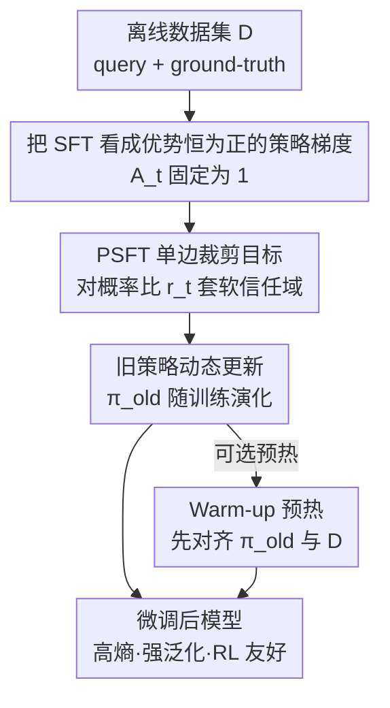

# Proximal Supervised Fine-Tuning

**会议**: ICLR 2026  
**OpenReview**: [https://openreview.net/forum?id=hQtwQqYikp](https://openreview.net/forum?id=hQtwQqYikp)  
**代码**: 基于开源 verl 框架实现（随补充材料提供）  
**领域**: 对齐RLHF / LLM后训练 / 监督微调  
**关键词**: 监督微调, 信任域, PPO裁剪, 熵坍缩, 泛化能力

## 一句话总结
PSFT 把标准 SFT 重新理解为"优势恒为正的策略梯度"，再借用 PPO 的裁剪式信任域机制给 SFT 的更新套上一个软约束，从而在保住目标任务性能的同时大幅缓解熵坍缩、保留模型的通用能力，并为后续 RL / DPO 阶段留出更大的优化空间。

## 研究背景与动机

**领域现状**：在大模型后训练流程里，SFT 通常是第一步——用专家轨迹（如长 CoT 蒸馏数据）做监督微调，因为它高效、简单，比直接上 RL 省事得多。很多社区工作都靠 SFT 把强模型的推理能力"蒸馏"进目标模型。

**现有痛点**：SFT 本质上是行为克隆（behavior cloning），当微调数据是次优的、或与预训练分布错配时，会带来两个老毛病。一是**泛化差**：模型在目标域学得不错，但域外能力（科学推理、指令遵循）明显退化，甚至出现"对齐税"。二是**熵坍缩**：输出分布过度集中、多样性消失，于是把它当 RL 冷启动模型时，探索能力被锁死，后续 RL 涨不动。

**核心矛盾**：交叉熵损失会无差别地把每个 ground-truth token 的概率往上顶，没有任何"更新幅度"的约束。从策略优化的视角看，这等价于一次次不受控的大步策略更新（large policy update），既容易过拟合训练数据、又会把分布推得离参考策略太远，泛化与探索同时受损。

**本文目标**：在不牺牲目标任务性能的前提下，让 SFT 同时具备更好的泛化能力和探索能力（高熵），并能作为后续 RL 的优质起点。

**切入角度**：作者注意到 RL 里 TRPO / PPO 早就解决过"如何限制单次策略更新幅度"——用信任域约束。既然 SFT 可以被写成策略梯度的一个特例，那 PPO 的裁剪机制能不能直接搬到监督设定里来？

**核心 idea**：把 SFT 看成"优势恒为 1 的策略梯度"，然后用 PPO 的裁剪代理目标（clipped surrogate objective）替换交叉熵，给监督更新加一个软信任域，约束新旧策略概率比，防止过大的策略漂移。

## 方法详解

### 整体框架

PSFT 要解决的是"SFT 的更新没有任何幅度约束"这件事。它的整体思路是先在理论上把 SFT 和策略梯度对齐，再把 PPO 的信任域裁剪机制平移过来，得到一个可以直接替换交叉熵的监督微调损失。

具体来说：输入是一个离线数据集 $\mathcal{D}$（query + ground-truth response）。第一步，作者证明 SFT 其实是策略梯度的特例——采样固定在离线数据上、且所有 ground-truth token 的优势固定为 $\hat{A}_t=1$。第二步，既然形式上等价于优势恒正的策略梯度，就可以套用 PPO：引入新旧策略的概率比 $r_t(\theta)=\pi_\theta(a_t\mid s_t)/\pi_{\theta_{\text{old}}}(a_t\mid s_t)$，并对它做裁剪，得到 PSFT 损失。第三步，让旧策略 $\pi_{\theta_{\text{old}}}$ 在训练中动态演化（而不是固定成初始模型），并可选地先做一段 warm-up 把旧策略对齐到数据分布。输出是一个微调好的模型：目标域性能与 SFT 相当、熵曲线平滑不坍缩、域外泛化更强，且作为 RL/DPO 冷启动能解锁更高上限。

### 关键设计

**1. 把 SFT 看成"优势恒为正"的策略梯度**

这是整套方法的理论支点，目的是把"监督学习"和"策略优化"接到同一根管子上，后面才能名正言顺地借用 PPO。标准 SFT 最小化交叉熵 $\mathcal{L}_{\text{SFT}}(\theta)=-\hat{\mathbb{E}}_{(s_t,a_t^*)\sim\mathcal{D}}[\log\pi_\theta(a_t^*\mid s_t)]$；而策略梯度最大化 $\mathcal{L}_{\text{PG}}(\theta)=\hat{\mathbb{E}}_{(s_t,a_t)\sim\pi_\theta}[\log\pi_\theta(a_t\mid s_t)\,\hat{A}_t]$，其中 $\hat{A}_t$ 是优势函数。作者指出：只要把采样从"当前策略在线交互"换成"固定离线数据集 $\mathcal{D}$"，并把优势固定为 $\hat{A}_t=1$（数据集里的动作都假设是"对的"），策略梯度就退化成最大化 ground-truth token 似然，也就是 SFT。这个等价关系的价值在于：它暴露出 SFT 的问题正是策略梯度的老问题——没有对更新幅度的约束，因此 RL 里治这个病的工具（信任域）可以直接拿来用。

**2. PSFT 的单边裁剪目标：给监督更新套软信任域**

针对"SFT 无约束、容易大步漂移"的痛点，PSFT 把 PPO 的裁剪代理目标搬进监督设定。由于优势恒为正（$\hat{A}_t=1$），目标可简化为对概率比裁剪：

$$\mathcal{L}_{\text{PSFT}}(\theta)=\mathbb{E}_{(s_t,a_t)\sim\mathcal{D}}\left[\min\!\left(r_t(\theta),\ \text{clip}(r_t(\theta),1-\epsilon,1+\epsilon)\right)\right],\quad r_t(\theta)=\frac{\pi_\theta(a_t\mid s_t)}{\pi_{\theta_{\text{old}}}(a_t\mid s_t)}.$$

它和 PPO 形似但**本质不同**：PPO 是用在线轨迹和优势估计优化期望回报的 RL 方法，而 PSFT 是纯监督的离线目标，裁剪比在这里只充当一个正则项，限制 token 概率的过大变化、并对梯度做重加权。更关键的是它的梯度形态——因为优势恒正，只有上界裁剪会触发：

$$\nabla_\theta\mathcal{L}_{\text{PSFT}}(\theta)=\mathbb{E}_{(s_t,a_t)\sim\mathcal{D}}\left[r_t(\theta)\cdot \mathbb{I}_{\text{trust}}(r_t(\theta))\cdot\nabla_\theta\log\pi_\theta(a_t\mid s_t)\right],\quad \mathbb{I}_{\text{trust}}(r_t)=\begin{cases}0 & r_t>1+\epsilon\\ 1 & \text{otherwise}\end{cases}.$$

直观含义是：如果某个 token 的离线分布与模型当前分布偏差太大（$r_t$ 已经超过 $1+\epsilon$，往往正是那些容易扰乱通用能力的 token），它的梯度就被直接置零、不再被继续往上顶。这个机制简单却有效——它阻止大幅策略更新、抑制熵坍缩、保住泛化，从而给后续 RL 留下可持续进步的空间。论文里 $\epsilon$ 取 0.2 或 0.28 较优（太大则梯度过大失稳）。

**3. 旧策略动态更新：让信任域中心跟着数据走**

如果把旧策略 $\pi_{\theta_{\text{old}}}$ 固定成初始参考模型 $\pi_{\theta_{\text{ref}}}$，优化就被困在以参考模型为中心的信任域里，很多本可以从离线数据里学到的知识被白白挡在域外。PSFT 的做法是让 $\pi_{\theta_{\text{old}}}$ 在训练中**动态演化**——每隔若干步同步一次——使信任域的中心跟着模型逐步前移，实现"渐进而稳定"地从数据集学习。消融显示更新频率很关键：固定不更新（no upd）只能略好于 base、整体很差；每 4 步更新一次在域内任务上收益最大（AIME-24 从 13.0 拉到 22.5），但频繁更新配小批量+较高学习率会牺牲一些泛化（波动变大）。这说明动态旧策略不是可有可无的实现细节，而是 PSFT 能真正学进东西的前提。

**4. Warm-up 预热：先把旧策略对齐到数据分布**

PSFT 的 $(s_t,a_t)$ 采自离线数据 $\mathcal{D}$，但训练最初几步里 $\pi_{\theta_{\text{old}}}$ 可能还没对齐 $\mathcal{D}$ 的分布，导致概率比 $r_t(\theta)$ 的期望出现偏差。让旧策略在训练中逐步演化本身已能缓解这个偏差；在此之上，可选地先跑一小段标准 SFT 作为 warm-up，把初始旧策略对齐到数据集，能进一步提升目标域性能。实验表明 warm-up 版 PSFT 在域内任务上稳定优于原始 PSFT 和标准 SFT，且 warm-up 越长域内收益越大——代价是泛化略有下降，因此它更像一个"在域内/域外之间可调"的旋钮。

### 损失函数 / 训练策略
核心损失即上面的 $\mathcal{L}_{\text{PSFT}}$，裁剪阈值 $\epsilon$ 默认 0.28（数学推理）；旧策略每 4–16 步同步一次（论文主设置用 mini-batch 触发更新）。对比基线包含标准 SFT 以及在损失里加 KL 约束的 SFT-KL（KL 系数 0.5）。实现上几乎零成本——在主流 RL 框架里把 rollout 换成 SFT 示范、把所有 token 的优势设为常数即可。

## 实验关键数据

实验覆盖三大场景：数学推理（Qwen2.5-7B-Instruct / Llama3.1-8B-Instruct，OpenR1-Math 长 CoT 数据）、人类价值对齐（Qwen3-4B-Base + UltraFeedback + DPO）、多模态（Qwen2.5-VL）。

### 主实验（SFT 阶段，Qwen2.5-7B-Instruct）

| 维度 | 指标 | Base | SFT | SFT-KL | PSFT |
|------|------|------|-----|--------|------|
| 域内均值 | 6 个数学 benchmark | 37.98 | 47.99 | 47.08 | 46.98 |
| 域外均值 | 7 个通用 benchmark | 59.85 | 57.90 | 57.38 | **61.26** |
| 指令遵循 | IFEval (loose) | 73.94 | 54.42 | 55.44 | **73.03** |

关键对比：SFT 在域内涨点（37.98→47.99），但域外**反而掉**到 57.90、IFEval 从 73.94 暴跌到 54.42（学数学把指令遵循学坏了）；PSFT 域内基本持平 SFT，域外却升到 61.26、IFEval 几乎不掉。Llama3.1-8B 上差距更明显（域外 PSFT 59.25 vs SFT 50.49）。

### RL 阶段（PSFT 作冷启动，Qwen2.5-7B-Instruct）

| 流程 | 域内均值 | 域外均值 |
|------|---------|---------|
| SFT → GRPO | 52.40 | 59.90 |
| PSFT → GRPO | **53.31** | **64.06** |

PSFT 在 SFT 阶段域内略低，但经 GRPO 后**反超** SFT（域内 53.31>52.40，域外 64.06>59.90），印证"PSFT 保留了更高的熵和探索空间，给 RL 留了余地"。

### 消融实验

| 配置 | AIME-24 | TruthfulQA | IFEval | 说明 |
|------|---------|------------|--------|------|
| PSFT (旧策略不更新) | 13.02 | 66.61 | 76.46 | 仅略好于 base，域内很差 |
| PSFT (每 8 步更新) | 19.38 | 67.16 | 73.03 | 主设置 |
| PSFT (每 4 步更新) | 22.50 | 66.72 | 72.08 | 域内最佳、泛化略降 |
| PSFT (无裁剪) | — | — | — | 熵高但梯度范数大、结果剧烈波动 |

### 关键发现
- **熵不坍缩是核心卖点**：SFT / SFT-KL 的熵曲线每个 epoch 后陡降（锯齿形，过拟合信号），PSFT 的熵曲线平滑，能长时间细粒度训练而不坍缩。
- **旧策略动态更新贡献最大**：不更新时域内性能几乎崩（AIME-24 仅 13.0），每 4 步更新拉到 22.5；这是 PSFT 能学进东西的前提。
- **裁剪是稳定性的来源**：去掉裁剪虽保住高熵，但梯度范数大且不稳、下游结果剧烈波动；$\epsilon\approx0.28$ 在稳定与性能间取得最佳折中。
- **被裁剪的 token 很有意思**：裁剪权重集中在 "wait""alternatively" 这类"长思考模式"词，说明 PSFT 是在平滑地把思考模式注入模型、同时最小化对通用能力的扰动。
- **对齐场景同样成立**：在 DPO 上，PSFT 冷启动后 AlpacaEval2 LC 达 23.29（SFT→DPO 仅 16.96），因为 SFT 过度偏向人选数据、几乎不产负样本，限制了从奖励信号学习。

## 亮点与洞察
- **"SFT 是优势恒为 1 的策略梯度"这个视角本身就很啊哈**：一旦接上策略梯度，RL 二十年攒下的信任域/裁剪工具箱就全部可用，且改动极小。
- **单边裁剪的物理意义清晰**：因为优势恒正，只有"概率往上顶得太狠"的 token 才被砍梯度，恰好是那些最可能破坏通用能力的离群 token——相当于自动给"危险更新"刹车。
- **把 SFT 重新定位成"为 RL 服务的冷启动"而非"终点"**：评价 SFT 不该只看域内分数，而要看它给后续 RL/DPO 留了多少熵和探索空间，这个评测视角可迁移到任何后训练流程。
- **几乎零实现成本**：现有 RL 框架里换 rollout 来源 + 设常数优势即可，落地门槛极低。

## 局限与展望
- **作者承认**的未来方向：还需在更多样、工业级的数据集和模型上验证通用性。
- 引入了新的超参 $\epsilon$ 和旧策略更新频率，二者都对"域内性能 vs 泛化"有 trade-off，需要按场景调；warm-up 长度也是一个需要权衡的旋钮。
- 域内分数有时略低于标准 SFT（"慢启动"），只有在接上 RL 后才反超——在不做后续 RL 的纯 SFT 部署里，PSFT 的收益主要体现在泛化和稳定性，而非域内峰值。
- 优势恒为 1 的简化假设依赖"离线数据全部正确"；当数据含噪声/次优样本时，这一假设是否仍成立、需要更细的分析。

## 相关工作与启发
- **vs iw-SFT**：iw-SFT 把 SFT 视为 RL 目标的松下界，用重要性重加权收紧这个界、提升目标性能；PSFT 不追求收紧下界，而是借信任域裁剪防熵坍缩、保泛化、留 RL 余地，关注点不同。
- **vs DFT**：DFT 把 SFT 看成有缺陷的策略梯度，用基于概率的重加权提升目标性能；PSFT 同样从策略梯度视角出发，但落点在"约束更新幅度"而非单纯提目标分。
- **vs SFT-KL**：直接在损失里加 KL 约束（硬性靠近参考模型）效果不如 PSFT——KL 是全局软约束，PSFT 的逐 token 单边裁剪更精准地只砍危险更新。
- **vs LUFFY / HPT 等 SFT+RL 混合法**：这些方法在一个 batch 里混合离线 SFT loss 和在线 RL loss；PSFT 是纯离线监督目标，与它们正交，可作为更好的冷启动基座。

## 评分
- 新颖性: ⭐⭐⭐⭐ 把 PPO 信任域优雅平移到监督设定，视角清晰、机制简洁
- 实验充分度: ⭐⭐⭐⭐⭐ 覆盖数学/对齐/多模态三大域，含 SFT→RL、SFT→DPO 全链路与多项消融
- 写作质量: ⭐⭐⭐⭐ 理论推导和 finding 组织清楚，部分分析依赖图较多
- 价值: ⭐⭐⭐⭐⭐ 几乎零成本的 SFT 替代方案，直击熵坍缩与对齐税，落地性强

<!-- RELATED:START -->

## 相关论文

- [\[ICLR 2026\] SRFT: A Single-Stage Method with Supervised and Reinforcement Fine-Tuning for Reasoning](srft_a_single-stage_method_with_supervised_and_reinforcement_fine-tuning_for_rea.md)
- [\[ICLR 2026\] On-Policy RL Meets Off-Policy Experts: Harmonizing Supervised Fine-Tuning and Reinforcement Learning via Dynamic Weighting](on-policy_rl_meets_off-policy_experts_harmonizing_supervised_fine-tuning_and_rei.md)
- [\[ICLR 2026\] Sparse but Critical: A Token-Level Analysis of Distributional Shifts in RLVR Fine-Tuning of LLMs](sparse_but_critical_a_token-level_analysis_of_distributional_shifts_in_rlvr_fine.md)
- [\[ICLR 2026\] Efficient Morphology-Control Co-Design via Stackelberg Proximal Policy Optimization](efficient_morphology-control_co-design_via_stackelberg_proximal_policy_optimizat.md)
- [\[ICLR 2026\] Don't Just Fine-tune the Agent, Tune the Environment](dont_just_fine-tune_the_agent_tune_the_environment.md)

<!-- RELATED:END -->
