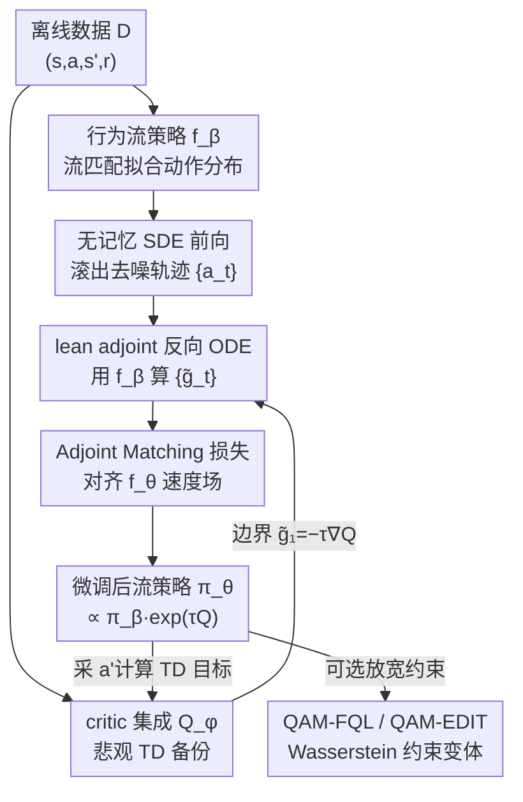

# Q-Learning with Adjoint Matching

**会议**: ICLR 2026  
**OpenReview**: [https://openreview.net/forum?id=vd4eNAdtO6](https://openreview.net/forum?id=vd4eNAdtO6)  
**代码**: https://github.com/ColinQiyangLi/qam  
**领域**: 强化学习 / 扩散与流策略 / 离线RL  
**关键词**: 离线强化学习, 流策略, Adjoint Matching, 策略抽取, TD学习

## 一句话总结
QAM 把生成建模里的 adjoint matching 技术搬进 Q-learning，用 critic 在「干净动作」上的梯度直接构造逐步监督目标来微调多步流策略，既保住流策略的表达力又避开了反传去噪链的数值不稳定，在 OGBench 50 个稀疏奖励任务上取得 44/46 的聚合分，超过所有现有基线。

## 研究背景与动机

**领域现状**：连续动作 RL（尤其是离线、离线转在线场景）一直在「策略表达力」与「相对 critic 的可优化性」之间纠结。单步高斯策略好优化——可以借助重参数化技巧直接用 critic 的动作梯度 $\nabla_a Q(s,a)$ 做策略改进；但表达力差，无法刻画多峰、复杂的动作分布。扩散/流策略通过多步去噪过程生成动作，表达力强，却很难直接吃到 critic 的一阶信息。

**现有痛点**：想用 critic 的动作梯度优化流策略，最直接的做法是「反传穿过整条去噪链」，但这条链很长、容易数值不稳定（ill-conditioned 的中间梯度会逐步累积放大）。现有方法绕路的两种姿势都有代价：(1) **彻底丢掉动作梯度**只用 critic 的标量值（如优势加权、拒绝采样），学习效率低、常常打不过用梯度的方法；(2) **把多步流策略蒸馏成单步噪声条件近似**，牺牲了表达力。还有一类是把 critic 当 classifier guidance 直接作用在「带噪中间动作」上，但这依赖一个脆弱假设——critic 在噪声动作上的梯度能代理它在去噪后动作上的梯度。离线数据动作覆盖窄时，critic 只在干净动作的窄分布上训得好，对 OOD 的中间噪声动作梯度并不可靠。

**核心矛盾**：表达力（多步流策略）与优化稳定性（用 critic 一阶信息）之间存在结构性 trade-off——要前者就得反传长链、不稳定；要稳定就得砍表达力或砍梯度。

**本文目标**：能不能既保住流策略的完整表达力，又把 critic 的动作梯度直接注入去噪过程，而不引入反传不稳定？

**切入角度**：作者注意到生成建模领域刚提出的 **adjoint matching**（Domingo-Enrich et al., 2025）——它能把一个基础流模型 $f_\beta$ 微调成生成「倾斜分布」$p_\theta(X_1)\propto p_\beta(X_1)e^{Q(X_1)}$ 的流模型 $f_\theta$，而且其目标函数在最优解不变的前提下，避开了反传穿过去噪链。RL 里的「行为约束最优策略」$\pi^\star(a\mid s)\propto\pi_\beta(a\mid s)e^{\tau(s)Q(s,a)}$ 恰好就是这样一个倾斜分布。

**核心 idea**：把策略抽取（policy extraction）重述成一个 SOC（随机最优控制）问题，再用 adjoint matching 的「lean adjoint」目标去解它——用 critic 在干净动作上的梯度，经由「与被优化模型无关的」行为流模型变换成逐步速度场监督，从而无偏、表达力满血地恢复出最优行为约束策略，再配标准 TD 备份学 critic。

## 方法详解

### 整体框架

QAM 是一个 TD-based 的 actor-critic 算法，核心是把「如何用 critic 微调流策略」这一步换成 adjoint matching。整体在离线/离线转在线两套设定下循环三件事：(1) 用流匹配损失学一个行为流策略 $f_\beta$（近似数据里的动作分布）；(2) 用 adjoint matching 目标把另一个流策略 $f_\theta$ 微调成行为约束最优策略 $\pi_\theta\propto\pi_\beta e^{\tau Q}$；(3) 用标准 TD 备份学 critic 集成 $Q_\phi$，其中下一步动作由当前 $f_\theta$ 采样。三者交替进行（$f_\beta,f_\theta,Q_\phi$ 同时训练，不分独立阶段）。

QAM 微调流策略时不直接解 SOC 目标（那等价于反传穿 SDE，会不稳定），而是：先按一条「无记忆」SDE 前向滚出去噪轨迹 $\{a_t\}_t$，再用**行为流模型 $f_\beta$**（不是被优化的 $f_\theta$）反向 ODE 算出 lean adjoint 状态 $\{\tilde g_t\}_t$（边界条件 $\tilde g_1=-\tau\nabla_{a_1}Q_\phi$），最后把 $f_\theta$ 与 $f_\beta$ 的速度场之差对齐到这些 adjoint 状态上，构成一个无需反传的平方损失。

### 关键设计

**1. Adjoint Matching 策略抽取：用 critic 干净动作梯度构造无反传的逐步监督**

这是 QAM 的命脉，直接针对「反传去噪链不稳定 / 砍梯度砍表达力」的核心痛点。把行为约束最优策略写成 KL 约束下的最优解 $\pi^\star(a\mid s)\propto\pi_\beta(a\mid s)e^{\tau(s)Q_\phi(s,a)}$，作者把它转写成一个 SOC 目标

$$\mathcal{L}(\theta)=\mathbb{E}_{s\sim D,\,a_t}\left[\int_0^1 \frac{2}{\sigma_t^2}\lVert f_\theta(s,a_t,t)-f_\beta(s,a_t,t)\rVert_2^2 - \tau(s)Q_\phi(s,a_1)\,dt\right],$$

其中 $a_t$ 由「无记忆」SDE $da_t=(2f_\theta-a_t/t)dt+\sqrt{2(1-t)/t}\,dB_t$ 定义（无记忆指 $a_0$ 与 $a_1$ 独立）。直接解这个 SOC 等价于反传穿 SDE，仍不稳定。QAM 改用 adjoint matching 目标

$$\mathcal{L}_{\mathrm{AM}}(\theta)=\mathbb{E}_{s,\{a_t\}}\left[\int_0^1\big\lVert 2(f_\theta-f_\beta)/\sigma_t+\sigma_t\tilde g_t\big\rVert_2^2\,dt\right],$$

把「critic 在干净动作上的梯度」（藏在 $\tilde g_t$ 的边界条件里）当成对中间速度场的目标信号。关键在于：lean adjoint 状态 $\tilde g_t$ 由反向 ODE $d\tilde g_t=-\nabla_{a_t}[2f_\beta(s,a_t,t)-a_t/t]\tilde g_t\,dt$ 算出，**只用到行为流模型 $f_\beta$，完全不碰被优化的 $f_\theta$**。这一点很要命——朴素反传里，$f_\theta$ 本身病态的动作梯度 $\nabla_a f_\theta$ 会沿整条链复合放大，污染对参数 $\theta$ 的梯度并搞崩优化；而在 adjoint matching 里 $f_\theta$ 的动作梯度对总梯度毫无贡献，优化因此稳得多。理论上只要 $\mathcal{L}_{\mathrm{AM}}$ 优化到收敛，学到的策略就恰好是最优行为约束策略——这是「丢梯度」方法给不了的收敛保证。

**2. Lean adjoint：把最优处为零的项剔除，得到只依赖 $f_\beta$ 的稳定 adjoint**

标准连续 adjoint 法（basic adjoint matching, BAM）的 adjoint 状态满足一条含 $f_\theta$ 的 ODE，其梯度等价于反传穿去噪链，仍会不稳定。作者沿用 Domingo-Enrich et al. (2025) 的「lean」技巧——把 adjoint 状态里所有「在最优解处恒为零」的项删掉。删掉后 adjoint 不再改变 $f_\theta$ 的最优解（因为那些项本就贡献为零），却换来一条更干净的 ODE（式 13/22），计算时只需 $f_\beta$ 和一系列向量-雅可比积（VJP）。论文里专门设了一个对照基线 BAM：除了把式(14) 的 lean 目标换成式(12) 的 basic 目标，其余实现完全一致——结果 BAM 聚合分只有 35，QAM 是 44，直接量化了「lean adjoint」相对「带 $f_\theta$ 反传」的稳定性收益。实现上前向 SDE 与反向 adjoint 都用固定步长 $h=1/T$ 离散，并对参数梯度逐元素裁剪到 1 以保数值稳定。

**3. 悲观 critic 集成 + TD 备份：稳住离线下的值估计**

策略抽取再好也要有靠谱的 critic。QAM 用 $K=10$ 个 critic 函数组成集成，采用悲观目标备份（pessimistic backup）：每个 $\phi_j$ 的回归目标是 $r+\gamma(\bar Q_{\mathrm{mean}}(s',a')-\rho\,\bar Q_{\mathrm{std}}(s',a'))$，即用集成均值减去 $\rho$ 倍集成标准差，惩罚高方差（往往是 OOD）动作的值估计，缓解离线 RL 的高估问题（默认 $\rho=0.5$，humanoidmaze-large 上用 $\rho=0$ 更好）。下一步动作 $a'$ 由当前微调流策略 $f_\theta$ 经 ODE 采样得到，把 actor 与 critic 串成闭环。$\bar\phi$ 是 $\phi$ 的指数滑动平均（$\lambda=0.005$）。

**4. 放宽行为约束的两个变体：QAM-FQL 与 QAM-EDIT**

QAM 严格收敛到 $\propto\pi_\beta e^{\tau Q}$，但当最优动作在行为分布下概率极低（support mismatch）时会力不从心。作者把约束从纯 KL 放宽成「KL + Wasserstein」组合——允许策略取「在动作空间里靠近行为动作」的动作，并用 QAM 解出的 $\pi_\theta$ 当基策略，把问题转写成对 $\pi_\theta$ 的行为约束优化。两个落地变体：**QAM-FQL**（$q{=}2$、欧氏度量）复用 FQL，学一个单步噪声条件策略 $\mu_\omega$，损失 $-Q_\phi(s,\mu_\omega(s,z))+\alpha\lVert\mu_\omega(s,z)-\mathrm{ODE}(f_\theta(s,\cdot,\cdot),z)\rVert_2^2$，第二项是 $W_2^2(\pi_\omega,\pi_\theta)$ 的上界；**QAM-EDIT**（$q{=}1$、$L_\infty$ 度量）学一个 edit 策略 $\pi_\omega(\Delta a\mid s,a)$，对 $\pi_\theta$ 输出的动作做幅度被 $\sigma_a$ 限制的编辑（tanh 压到 $[-\sigma_a,\sigma_a]$，由构造保证 $W_1\le\sigma_a$），并加自动调温熵项（目标熵 $-A/2$）防止编辑总是顶到边界、顺带鼓励在线探索的动作多样性。两个变体都用 $\pi_\omega$ 同时与环境交互、算值目标。

### 损失函数 / 训练策略
- 行为策略：标准流匹配损失 $\mathcal{L}_{\mathrm{FM}}(\beta)=\mathbb{E}\lVert f_\beta(s,(1{-}t)z{+}ta,t)-a+z\rVert_2^2$。
- 策略抽取：adjoint matching 损失 $\mathcal{L}_{\mathrm{AM}}(\theta)$（式 21），lean adjoint 由式(22) 反向 ODE 算出，边界 $\tilde g_1=-\tau\nabla_{a_1}Q_\phi$。
- critic：悲观集成 TD 损失（式 26），$K=10$，$\rho=0.5$，目标网络 EMA $\lambda=0.005$。
- $f_\beta,f_\theta,Q_\phi$ 同时训练（不分独立阶段）；离线阶段 $D$ 为离线数据，在线阶段 $D$ 为离线+在线 replay buffer 混合且不做重加权。

## 实验关键数据

### 主实验（离线 RL，OGBench 50 任务聚合分）

| 方法 | 类别 | 聚合分（满分 ~50） |
|------|------|------|
| **QAM-E** | 本文 | **46** |
| **QAM-F** | 本文 | **45** |
| **QAM** | 本文 | **44** |
| ReBRAC | Gaussian | 40 |
| QSM | guidance | 39 |
| DSRL | post-proc | 38 |
| CGQL-L | guidance | 37 |
| FQL / DAC | backprop / guidance | 36 |
| BAM | backprop（消融） | 35 |
| CGQL-M | guidance | 35 |
| IFQL | post-proc | 34 |
| FEdit | post-proc | 33 |
| CGQL | guidance | 30 |
| FBRAC | backprop | 11 |
| FAWAC | adv-weighted | 8 |

QAM 以 44 超过所有 13 个基线；放宽约束的 QAM-F / QAM-E 进一步到 45 / 46。

### 消融 / 关键对照

| 配置 | 聚合分 | 说明 |
|------|--------|------|
| QAM（lean adjoint） | 44 | 完整方法 |
| BAM（basic adjoint） | 35 | 仅把 lean 换成 basic，等价反传穿 SDE，掉 9 分 |
| FAWAC | 8 | 同样收敛到最优行为约束分布，但**丢掉动作梯度**只用值 |
| FBRAC | 11 | 直接反传穿流策略去噪链（BPTT），最不稳定 |

### 关键发现
- **用不用 critic 的动作梯度是分水岭**：FAWAC 与 QAM 都收敛到同一个最优行为约束分布，但 FAWAC 丢掉一阶梯度只用值，聚合分 8 vs 44，差距巨大——说明一阶信息对策略抽取效率至关重要。
- **lean vs basic 直接量化稳定性收益**：BAM 与 QAM 唯一差别是 basic/lean adjoint，35 vs 44；而同样用 BPTT 的 FBRAC 只有 11，远低于 BAM——说明 SOC 公式化本身（BAM）已比朴素反传（FBRAC）好很多，lean adjoint 在此之上再补上稳定性。
- **放宽约束在 support mismatch 任务上有用**：QAM-FQL / QAM-EDIT 通过 Wasserstein 约束允许「靠近但不在」行为分布的动作，把 44 提到 45/46，且 QAM-EDIT 的熵项让它在线微调也表现好。

## 亮点与洞察
- **把生成建模的 adjoint matching 跨界搬到 RL 策略抽取**：核心洞察是「行为约束最优策略」与「倾斜分布」是同一数学对象，于是 SOC + lean adjoint 的整套机制可以无缝迁移，且自带收敛保证。这种「换个领域借工具」的思路很可复用。
- **lean adjoint 用 $f_\beta$ 而非 $f_\theta$ 算梯度**是全篇最巧的一刀：它从根上切断了被优化模型病态梯度的复合放大路径，把「为什么 QAM 比反传稳」讲得很干净，而不是靠工程 trick 硬压。
- **BAM 这个对照设计得好**：通过只替换 lean/basic 一项、其余完全相同，把方法的稳定性收益从一堆混杂因素里单独剥离出来，是很扎实的消融。

## 局限与展望
- **support mismatch 是硬伤**：QAM 严格收敛到 $\propto\pi_\beta e^{\tau Q}$，当最优动作在行为分布下概率极低时表达不出来——这正是要引入 QAM-FQL/EDIT 放宽约束的原因，但放宽本身又引入额外近似与超参（$\sigma_a,\alpha,q$ 的选择）。
- **计算开销**：每步策略更新都要前向 SDE + 反向 adjoint ODE（一串 VJP），加上 $K=10$ 的 critic 集成，单步成本高于单步高斯策略。
- **评测范围**：实验集中在 OGBench 的长时程稀疏奖励操作/导航任务，且主打离线与离线转在线；纯在线 RL、真实机器人、高维像素输入等设定未充分验证。
- **理论依赖收敛假设**：最优性保证建立在 $\mathcal{L}_{\mathrm{AM}}$ 优化到 $\partial\mathcal{L}/\partial f_\theta=0$ 的前提上，实际有限步优化下的偏差未量化。

## 相关工作与启发
- **vs Backprop 类（FBRAC / FQL）**：它们要么直接反传穿去噪链（FBRAC，最不稳，11 分），要么蒸馏成单步策略损表达力（FQL，36 分）；QAM 用 adjoint matching 既不反传也不蒸馏，保表达力且稳定（44 分）。
- **vs 优势加权（FAWAC）**：FAWAC 同样收敛到最优行为约束分布但丢掉动作梯度只用值，效率低（8 分）；QAM 直接用 critic 一阶梯度构造逐步目标。
- **vs Classifier Guidance（CGQL/QSM/DAC）**：这些把 critic 当 classifier 作用在带噪中间动作上，依赖「噪声动作梯度≈干净动作梯度」的脆弱假设，离线覆盖窄时失效；QAM 只用干净动作 $a_1$ 处的梯度（经 $f_\beta$ 变换到中间步），无此假设，且有收敛保证。
- **vs BAM（自身消融）**：BAM 用 basic adjoint（等价反传穿无记忆 SDE），QAM 用 lean adjoint，二者最优解相同但 lean 删去最优处为零的项后稳定性大增（35→44）。

## 评分
- 新颖性: ⭐⭐⭐⭐⭐ 把 adjoint matching 跨界引入 RL 策略抽取，思路清晰且自带收敛保证
- 实验充分度: ⭐⭐⭐⭐⭐ 50 任务、13 个强基线、含 BAM 这种精准消融，对照扎实
- 写作质量: ⭐⭐⭐⭐ 推导严谨但 adjoint/SOC 部分门槛较高，需要背景才好读
- 价值: ⭐⭐⭐⭐⭐ 给「流策略 + critic 一阶信息」这一长期难题提供了有保证的稳定解法

<!-- RELATED:START -->

## 相关论文

- [\[ICLR 2026\] floq: Training Critics via Flow-Matching for Scaling Compute in Value-Based RL](floq_training_critics_via_flow-matching_for_scaling_compute_in_value-based_rl.md)
- [\[ICLR 2026\] Bridging Successor Measure and Online Policy Learning with Flow Matching-Based Representations](bridging_successor_measure_and_online_policy_learning_with_flow_matching-based_r.md)
- [\[ICML 2026\] Adaptive Bandit Algorithms for Contextual Matching Markets](../../ICML2026/reinforcement_learning/adaptive_bandit_algorithms_for_contextual_matching_markets.md)
- [\[ICML 2026\] Reverse Flow Matching: A Unified Framework for Online Reinforcement Learning with Diffusion and Flow Policies](../../ICML2026/reinforcement_learning/reverse_flow_matching_a_unified_framework_for_online_reinforcement_learning_with.md)
- [\[ICLR 2026\] In-Context Compositional Q-Learning for Offline Reinforcement Learning](in-context_compositional_q-learning_for_offline_reinforcement_learning.md)

<!-- RELATED:END -->
