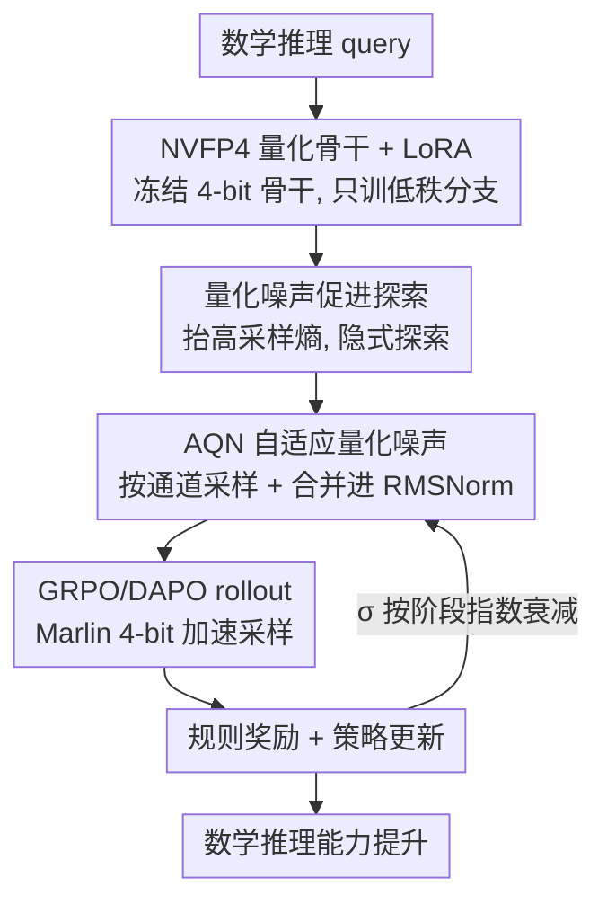

# QeRL: Quantization-enhanced Low-rank Reinforcement Learning for LLMs

**会议**: ICLR 2026  
**OpenReview**: [https://openreview.net/forum?id=zw8zxMJJlm](https://openreview.net/forum?id=zw8zxMJJlm)  
**代码**: https://github.com/NVlabs/QeRL  
**领域**: 强化学习 / LLM 推理 / 模型压缩  
**关键词**: 量化, RL, LoRA, NVFP4, 探索

## 一句话总结
QeRL 把 NVFP4 量化和 LoRA 结合起来训练 LLM 的推理能力，意外发现量化噪声能抬高策略熵、增强 RL 探索，再配上一个可调度的自适应量化噪声（AQN）机制，让 4-bit 模型在数学推理上既比 16-bit LoRA 快（rollout 提速 1.5×、端到端 1.8×）又更准，还首次在单张 H100 80GB 上跑通 32B 模型的 RL。

## 研究背景与动机
**领域现状**：RL（GRPO/DAPO 这类基于可验证奖励的策略优化）已成为提升 LLM 多步推理能力的关键手段，但它极其吃资源——策略模型和参考模型要同时驻留显存，长序列的反复采样（rollout）又特别慢。为了省成本，一条路是用 LoRA 这类参数高效微调减少可训练参数（如 Tina），另一条路是用量化模型做 rollout（如 FlashRL、QuaRL）。

**现有痛点**：LoRA 只减少了可训练参数，对 rollout 速度这个真正的瓶颈毫无帮助；而"量化 rollout + 全精度策略"的做法要同时维持低精度和高精度两份模型，显存反而压不下去，还引入 train–inference 精度不一致、必须用重要性采样去纠偏。更尴尬的是，把 QLoRA 直接搬进 RL 会让 rollout 慢 1.5–2×，因为它的 NF4 格式做矩阵乘前要先解包、查表映射回浮点。

**核心矛盾**：想要"更省显存 + 更快 rollout"，自然要上更激进的低比特量化；但 SFT 时代的共识是量化引入的噪声会损害训练，所以大家默认量化只能换效率、要牺牲效果。效率和效果在量化这条路上看似是对立的。

**本文目标**：找到一种量化方案，同时做到不复制模型、低显存、快 rollout，而且训练效果不掉甚至更好。

**切入角度**：作者反过来分析量化噪声对采样行为的影响，发现它并不像 SFT 里那样有害——量化误差会让输出概率分布"变平"、抬高采样熵，这在 RL 里恰恰等价于一种隐式的探索激励，类似 RL 经典工作里往参数空间注入噪声来鼓励探索。

**核心 idea**：用高性能的 NVFP4 量化替换 NF4 来加速 rollout，并把量化噪声从"静态副产物"改造成"可动态调度的探索机制"（AQN），让 4-bit RL 在效率和性能上同时超过 16-bit LoRA。

## 方法详解

### 整体框架
QeRL 的目标是在主流 LLM 策略优化算法（GRPO / DAPO）之上，用量化把 RL 训练做得又快又好。整体流程是：把骨干 LLM 权重量化成 NVFP4 并冻结，只让 LoRA 低秩分支可训练；rollout 和 prefill 阶段用 Marlin kernel 在 4-bit 上跑，拿到加速，梯度仍通过 LoRA 层回传；训练中靠 AQN 往权重注入按通道采样、随阶段指数衰减的高斯噪声，把量化噪声升级成动态探索信号，而这个噪声被巧妙地合并进每个 block 的 RMSNorm 里，做到零额外参数。最终用规则奖励算优势、更新策略，σ 随训练阶段递减实现"先探索后利用"。

### 关键设计

**1. NVFP4 量化 + LoRA：把 rollout 瓶颈和显存一起压下去**

针对 LoRA 救不了 rollout、QLoRA 又因 NF4 查表反而更慢的痛点，QeRL 选用 Blackwell 架构原生支持的 NVFP4 格式。NVFP4 用双层缩放：一个 FP32 的全局粗粒度缩放因子 $S_{FP32}$，加上一组按 16 元素小块划分的 FP8（E4M3）细粒度缩放因子 $S_{E4M3}$，反量化为 $\hat{W} = S_{FP32}\cdot(S_{E4M3}\odot\tilde{W})$，比 MXFP4 的 32 元素块缩放更细。骨干权重量化后冻结，只优化 LoRA 的低秩矩阵 $W+\Delta W = W + BA$（$r\ll\min(d,k)$）。关键在于 NVFP4 能直接走 Marlin kernel 做 NVFP4×BF16 的矩阵乘，rollout 和 prefill 都加速，而不必像 NF4 那样解包查表，也不必像"量化 rollout + 全精度策略"那样维持两份模型。结果是 7B 模型只训约 1% 参数、占 vanilla LoRA 40%–50% 的显存，rollout 比 QLoRA 快 1.5×、比 BF16 LoRA 快 1.3×。

**2. 量化噪声促进探索：把"有害噪声"重新理解为隐式探索**

这是全文最反直觉的发现。量化在前向传播中引入小而系统的误差，可建模为静态网络噪声，逐层传播后扰动 softmax 前的 logits，使词表上的输出分布 $\pi_\theta(\cdot|q)$ 变得更"平"、峰值不那么尖锐，从而抬高采样熵 $H(\pi(\cdot|q))=-\sum_{o_t\in V}\pi(o_t|q)\log\pi(o_t|q)$。在 RL 里这正是好事：它缓解了模型对单个"最优" token 的过度自信，把概率更合理地分给更多候选动作，等价于经典 RL 中往参数空间注入噪声的探索机制，可写成 $Q(\theta)-\theta=\Delta\epsilon$（$\Delta\epsilon$ 即量化噪声）。这和 SFT 截然相反——SFT 要忠实模仿真实分布，噪声有害；而 RL 要发现高奖励的新输出，噪声"免费"地帮了忙。实验证实 NVFP4/MXFP4-LoRA 的初始熵和奖励增长都明显高于 16-bit LoRA。

**3. AQN 自适应量化噪声：把静态噪声改造成可调度的探索信号**

量化噪声虽好，但它是确定性、全程不变的，无法匹配 RL 所需的"探索-利用"动态权衡。AQN 给每个量化线性层采样一个噪声向量 $Z_{noisy}\in\mathbb{R}^{1\times d}$，每次前向都重采样：$Z_{noisy}=\epsilon,\ \epsilon\sim\mathcal{N}(0,\sigma^2 I)$，叠加到量化噪声上得到动态噪声 $\Delta\epsilon' = Z_{noisy}+(\hat W - W)$。噪声尺度 $\sigma$ 按阶段指数衰减 $\sigma(k)=\sigma_{start}\cdot(\sigma_{end}/\sigma_{start})^{(k-1)/(K-1)}$（$k$ 为当前阶段，$K$ 为总区间，训练步均匀分成若干段），实现前期多探索、后期多利用。

难点在于：给每层单独加高精度噪声向量既费参数，又会破坏 NVFP4×BF16 推理 kernel 的兼容性。作者用一个等式巧妙绕开——$X(Z_{noisy}+\hat W)=X\cdot Z_{noisy}+X\cdot\hat W$，于是把噪声并进紧跟其后的 RMSNorm 缩放参数里：$\text{RMSNorm}_{noise}(x)=w_{noise}\odot x/\sqrt{\frac1N\sum x_i^2+\delta}$，其中 $w_{noise}=Z_{noise}+w$。如此一来，通道方向的加性噪声转成了权重上的行方向乘性噪声 $Z_{noise}/w + I$，做到零参数开销；由于 RL 对乘性噪声更敏感，初始化用 $\sigma_{start}=10^{-2}$ 保证稳定。该机制作用在与归一化激活直接交互的 $W_q,W_k,W_v,W_{gate},W_{up}$ 上（$W_q,W_k,W_v$ 共享一个 RMSNorm，$W_{gate},W_{up}$ 共享另一个）。

### 损失函数 / 训练策略
QeRL 不改 RL 目标本身，直接套用 GRPO / DAPO。GRPO 对每个 query 采样一组输出 $\{o_1,...,o_G\}$，用规则奖励算组内归一化优势 $A_i=(r_i-\text{mean}(\{r\}))/\text{std}(\{r\})$，目标里带裁剪项 $(1-\alpha,1+\alpha)$ 和 KL 惩罚 $\beta D_{KL}(\pi_\theta\|\pi_{ref})$；DAPO 则去掉 KL 惩罚、抬高裁剪上界、用 token 级策略梯度，进一步鼓励探索。AQN 的噪声调度叠加在这套训练上：GSM8K 约 600 步、分 10 段注入，从量化噪声起步再从 $\sigma_{start}$ 衰减到 $\sigma_{end}$（动态噪声范围设为 5e-2 到 5e-4）。

## 实验关键数据

### 主实验
GRPO 训 Qwen2.5 在 GSM8K（3B/7B），数据来自 Table 1：

| 模型 | 配置 | GSM8K | 相对 BF16 |
|------|------|-------|-----------|
| Qwen2.5-3B | BF16 Full | 84.4 | +23.2 |
| Qwen2.5-3B | BF16 LoRA | 76.1 | +14.9 |
| Qwen2.5-3B | NF4 LoRA (QLoRA) | 76.1 | +14.9 |
| Qwen2.5-3B | NVFP4 LoRA + AQN | **83.7** | +22.6 |
| Qwen2.5-7B | BF16 Full | 91.2 | +14.9 |
| Qwen2.5-7B | BF16 LoRA | 88.1 | +11.8 |
| Qwen2.5-7B | NF4 LoRA (QLoRA) | 85.0 | +8.7 |
| Qwen2.5-7B | NVFP4 LoRA + AQN | **90.8** | +13.5 |

DAPO 训 BigMath（7/14/32B）四个数学基准平均分（Table 2）：7B 从量化基线 25.7 提到 36.4（vanilla LoRA 35.7）；14B 在 AMC 23 上 QeRL 拿 57.5，反超全参训练的 55.0；32B 平均 45.6，接近全参的 46.2 且远高于 NVFP4 LoRA 的 41.4。

### 效率与消融

| 模型 | 方法 | W# | 显存 | 端到端提速(bs=8) |
|------|------|-----|------|------------------|
| 7B | LoRA | BF16 | 15.2 GB | — |
| 7B | QLoRA | NF4 | 5.7 GB | ×0.7 ↓ |
| 7B | QeRL | NVFP4 | 5.9 GB | ×1.2 ↑ |
| 14B | QLoRA | NF4 | 10.2 GB | ×0.7 ↓ |
| 14B | QeRL | NVFP4 | 10.6 GB | ×1.2 ↑ |

逐阶段计时（Table 4，7B，单步秒数）：QeRL rollout 仅 4.00s，对比 QLoRA 9.48s、BF16 LoRA 6.28s；总耗时 4.75s vs QLoRA 10.43s，约 1.8× 端到端加速。

| 配置 | 关键现象 | 说明 |
|------|---------|------|
| w/o AQN | 奖励增长慢 | 仅靠静态量化噪声 |
| w AQN | 奖励更快更高 | 动态调度探索 |
| 噪声调度器 | 指数衰减最优 | 对比线性/余弦/对数 |
| LoRA rank | 32 即够 | 16/32/64/128 差异有限 |

### 关键发现
- 量化格式上 NVFP4、MXFP4 的奖励增长都优于 NF4；MXFP4 早期分高，但 NVFP4 最终收敛更好，是综合最佳格式。
- AQN 是效果提升的关键模块：去掉后奖励曲线明显变慢变低，说明把噪声做成动态调度比静态量化噪声更有用。
- QeRL 的奖励曲线在 200 步内就快速上升，而 vanilla LoRA 要 500+ 步才追上，验证"量化增强探索"加速了收敛。
- 噪声调度器中指数衰减优于线性/余弦/对数，印证"前期重探索、后期重利用"的设计直觉。

## 亮点与洞察
- 最"啊哈"的一点是把 SFT 里公认有害的量化噪声，在 RL 语境下重新诠释为免费的探索激励——同一个现象换个任务目标，结论彻底反转，这种 reframe 很有启发性。
- Noise Merging 用一个简单恒等式把通道加性噪声转成 RMSNorm 上的乘性噪声，做到零参数开销又不破坏 4-bit 推理 kernel，工程上非常干净，是可复用的 trick。
- "效率与效果不必二选一"被实证打破：低比特不再只是省钱的妥协，反而能借噪声涨点，这个观念可迁移到其他需要探索的 RL 微调场景。

## 局限与展望
- 实验集中在 Qwen2.5 系列和数学推理（GSM8K/BigMath/AIME/AMC），是否在代码、通用 reasoning、其他骨干上同样成立未充分验证。
- 量化噪声促进探索的解释偏经验/直觉（熵抬高 → 探索），缺乏更严格的理论刻画；噪声尺度 $\sigma$、衰减区间数 $K$ 等超参对结果较敏感，需要按数据规模调。
- AQN 依赖 NVFP4 的硬件/kernel 支持（Hopper/Blackwell + Marlin），在不支持 FP4 的硬件上收益会大打折扣。
- 跨规模/任务的横向比较需谨慎：不同模型、不同数据难度下提升幅度差异较大，AIME 25 等小样本基准方差也大，不宜直接比绝对数。

## 相关工作与启发
- **vs QLoRA / NF4**: 同样是 4-bit + LoRA，但 NF4 做矩阵乘要解包查表导致 rollout 更慢、且其噪声被视为有害；QeRL 用 NVFP4 + Marlin 加速，并主动利用噪声做探索，效率和效果双赢。
- **vs FlashRL / QuaRL**: 它们用量化模型做 rollout 但仍需全精度权重做策略优化，存在 train–inference 精度不一致、显存压不下来；QeRL 不复制模型，骨干始终是同一份量化权重。
- **vs Tina（LoRA RL）**: 都靠参数高效微调省可训练参数，但 LoRA 解决不了 rollout 瓶颈；QeRL 直接在 rollout/prefill 层面加速。
- **vs 参数空间噪声探索（Plappert 等）**: 思路一脉相承，但 QeRL 的探索噪声来自量化这个"免费副产物"，再用 AQN 做成可调度版本，而非额外显式注入。

## 评分
- 新颖性: ⭐⭐⭐⭐⭐ 把量化噪声从有害重新诠释为 RL 探索激励，视角新颖且有实证支撑
- 实验充分度: ⭐⭐⭐⭐ 覆盖 3B–32B、GRPO/DAPO、多基准与效率拆解，但局限在 Qwen + 数学
- 写作质量: ⭐⭐⭐⭐⭐ 动机推导清晰，方法与发现衔接自然
- 价值: ⭐⭐⭐⭐⭐ 首次单卡 H100 跑通 32B RL，效率与效果兼得，实用价值高

<!-- RELATED:START -->

## 相关论文

- [\[ICLR 2026\] Online Minimization of Polarization and Disagreement via Low-Rank Matrix Bandits](online_minimization_of_polarization_and_disagreement_via_low-rank_matrix_bandits.md)
- [\[ACL 2026\] GeoRA: Geometry-Aware Low-Rank Adaptation for RLVR](../../ACL2026/reinforcement_learning/geora_geometry-aware_low-rank_adaptation_for_rlvr.md)
- [\[ICLR 2026\] QuRL: Low-Precision Reinforcement Learning for Efficient Reasoning](qurl_low-precision_reinforcement_learning_for_efficient_reasoning.md)
- [\[NeurIPS 2025\] Shift Before You Learn: Enabling Low-Rank Representations in Reinforcement Learning](../../NeurIPS2025/reinforcement_learning/shift_before_you_learn_enabling_low-rank_representations_in_reinforcement_learni.md)
- [\[ICLR 2026\] Lookahead Tree-Based Rollouts for Enhanced Trajectory-Level Exploration in Reinforcement Learning with Verifiable Rewards](lookahead_tree-based_rollouts_for_enhanced_trajectory-level_exploration_in_reinf.md)

<!-- RELATED:END -->
