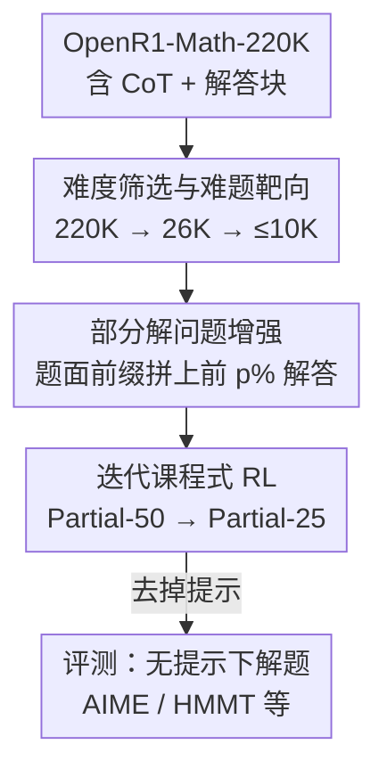

# QuestA: Expanding Reasoning Capacity in LLMs via Question Augmentation

**会议**: ICLR 2026  
**OpenReview**: [https://openreview.net/forum?id=3MifB0f7qR](https://openreview.net/forum?id=3MifB0f7qR)  
**代码**: https://github.com/foreverlasting1202/QuestA  
**领域**: LLM推理 / 强化学习  
**关键词**: RLVR, 问题增强, 部分解提示, 课程学习, 数学推理

## 一句话总结
针对 RLVR 在难题上奖励稀疏、学不动的问题，QuestA 在训练时给难题前面拼上「部分解」作为提示来降低难度、稠密化奖励信号，再配合提示比例从 50% 降到 25% 的课程，让 1.5B 小模型在 AIME24/25、HMMT25 等数学竞赛基准上刷出新 SOTA（AIME24 72.5%、AIME25 62.3%）。

## 研究背景与动机

**领域现状**：RLVR（带可验证奖励的强化学习，如 GRPO、DAPO）已成为训练 LLM 推理能力的主流范式——用「答案对不对」这种可自动验证的二值信号去强化高奖励轨迹，绕开了传统 RL 需要奖励模型的难题，在数学、代码、逻辑等任务上效果显著。

**现有痛点**：社区争论 RLVR 到底是「扩展」了模型的推理能力，还是只是「压榨」基座模型已有的知识。多项近期工作（Yue et al. 2025；Liu et al. 2025）发现，RLVR 能提升 pass@1，但在 base 模型本来就几乎做不出的高难度题上几乎无能为力，甚至在大 k 处 pass@k 会下降——也就是输出多样性被牺牲了。

**核心矛盾**：作者用受控实验把 OpenR1 题目按 base 模型成功率切成「简单」「困难」两组分别做 RL，得到一对矛盾的现象：用**简单题**训练会让模型过拟合到熟悉的解法模式、熵塌缩、pass@k 随 k 增大而下降，反而损害推理能力；用**困难题**训练确实能扩展能力，但奖励极度稀疏、样本效率低，训练慢得离谱（Figure 3 里 hard-only 曲线长期爬不动）。简单题稀释能力、困难题拖死训练，这就是核心张力。

**本文目标**：保住「在难题上训练」带来的能力扩展收益，同时消除稀疏奖励导致的低效——即如何在不改奖励函数、不改优化算法的前提下，让难题变得「可学」。

**切入角度**：作者从「RL 进展的真正瓶颈是在有限采样预算内难以采到一条成功轨迹」这个观察出发。如果能人为提高采到正确轨迹的概率，难题就会变得可发现。

**核心 idea**：在输入层做文章——把题目原解的前 p% 当作「部分解提示」拼在题面前面，相当于把一道大题拆成「提示已给的部分 + 剩下要补的部分」，让奖励信号变稠密；训练时逐步减少提示比例，最终在评测时完全不给提示。

## 方法详解

### 整体框架
QuestA 是一个**输入层**的数据增强框架：它不碰奖励函数、不改 GRPO/DAPO 的更新规则，只把原始 rollout 数据集替换成「增强后的数据集」，因此能即插即用地挂到任何 RLVR 流水线上。整条管线从 OpenR1-Math-220K 这个含完整解题轨迹的 SFT 语料出发，先把题目筛到最难的一小批，再给每道难题前缀上部分解、做二次难度筛选，然后用提示比例递减的两阶段课程跑 RL，最后在**不给任何提示**的条件下评测，验证模型是否真的把难题学会了。

### 关键设计

**1. 部分解问题增强：把难题改写成奖励更稠密的变体**

这是方法的核心。对一道有 $n$ 步解题轨迹 $y=(y_1,\dots,y_n)$ 的题目 $x$，QuestA 构造增强提示 $\tilde{x}^{(p)}$：取原解的前 $p$ 步（按 token 占比算，如 $p=50\%$ 或 $25\%$）作为前缀拼在原题前面，再让模型从这里接着推。关键细节是：拼的是 OpenR1 里 DeepSeek-R1 生成的**最终解答块（solution block）**的前 p%，而不是冗长的思维链 CoT——CoT 里有大量试错和推测，作为提示噪声太大；解答块则是干净的推导骨架。比如一道函数方程题，提示直接给出「$f$ 必是对合、固定所有奇数、偶数要么固定要么两两交换」，模型只需补完剩下的 case 分析。

为什么有效要从理论看：RL 的瓶颈是在采样预算内采不到正确轨迹。作者形式化了「模型容量集」$C(q,\delta_p)$（概率质量达 $1-\delta_p$ 的最可能轨迹集）和「解集」$S(q)$，并指出若对所有题都有 $C(q,\delta_p)\cap S(q)=\varnothing$，则在 $TB=\Theta(1/\delta_p)$ 的预算下 RL 有常数概率根本不更新（Theorem 4.4，因为 Assumption 4.3：全 0 奖励时梯度为零）。而给定提示 $h_q$ 后，若解可拆成两步、每步以 $\delta_p' = \delta_p^{1/2-\epsilon}$ 的概率被生成，则采到完整正确解的预算从 $\Theta(1/\delta_p)$ 降到约 $O(1/\delta_p')\approx O(1/\sqrt{\delta_p})$（Theorem 4.6）——提示把「同时碰对两步」的联合小概率事件拆成了两个独立可达的子事件，这是平方根级的效率提升。

**2. 难题靶向与两阶段难度筛选：把增强资源集中在最该补刀的题上**

QuestA 只对「base 模型成功率接近 0」的题做增强——对已经会做的题加提示纯属浪费。筛选分两阶段：先用轻量启发式过滤器把 220K 题压到 26K 最难候选（实践中用 DeepSeek-R1-Distill-1.5B 当弱选择模型粗筛）；再对增强后的提示做第二轮难度甄别——用即将参与 RL 的初始模型（Nemotron-1.5B 或 DeepScaleR-1.5B）对每个增强提示采 8 次，只保留通过数在 0–4 之间（高方差、信号强）的样本，最终池子不超过 10K。这种「先粗筛难题、再按增强后难度精筛」的设计，保证了被增强的恰好是「base 模型最需要脚手架、且加了提示后仍有挑战」的题，避免把算力花在加了提示就秒会、或加了提示还是不会的两个极端上。

**3. 迭代课程式 RL：提示比例从 50% 递减到 25%，对齐评测分布**

单一提示比例不是最优的。模型最终评测时是**无提示**分布，所以训练应逐步减少对提示的依赖，把策略从「有脚手架的推理」平滑迁移到「自主推理」。QuestA 设计两阶段课程：先用 Partial-50（给 50% 解）做 RL 直到性能饱和，再降到 Partial-25（只给 25% 解）继续训到收敛，每阶段都重做难度筛选。实践中第一阶段只跑 100 步就切换——因为 Partial-50 单独训超过 100 步后熵开始下降（Figure 11），及时切到 Partial-25 能防止过度自信、维持训练稳定。继续往 Partial-0 延伸则没有额外收益、响应长度也不再增长，故止于 Partial-25。整个 RL 用 AReaL 框架跑 GRPO（去掉 KL 损失），并仿照 DAPO 动态过滤掉 rollout 里全对或全错的提示。

### 一个完整示例
以一道 OpenR1 难题（函数方程，求 $f(1000)$ 的所有可能值）走一遍：① 难度筛选阶段，base 模型采 8 次全错（0/8），被判为「困难」保留进 26K；② 增强阶段，取其官方解答块前 50%，拼成提示「分析表明 $f$ 必是对合，$f(f(n))=n$，固定所有奇数即 $f(n)=n$（n 为奇）；偶数要么固定要么与另一偶数构成 2-循环」，附在原题后；③ 二次筛选，用 Nemotron-1.5B 对这个增强提示采 8 次，得 2/8（落在 0–4 区间）保留；④ Partial-50 阶段 RL，模型在提示脚手架下学会补完偶数 case；⑤ 切到 Partial-25，提示只剩 25%，模型被迫补更多推导；⑥ 评测时**完全不给提示**，模型已能独立解出此前 0/8 的题——对应 Figure 6 里训练集 pass rate 从 0/8–1/8 桶整体右移、AIME24 未解题从 5 道降到 2 道。

### 损失函数 / 训练策略
RL 用 GRPO（无 KL 损失），每提示采 $n=16$ 条响应，提示最大长度 8192、生成最大长度 24000，采样温度 1.0，裁剪 $\varepsilon_{low}=\varepsilon_{high}=0.2$；batch size 128、mini-batch 1（即每步 rollout 对应 128 次梯度更新），AdamW 常数学习率 $2\times10^{-5}$，8 台 H800（80GB）节点。评测每题采 32 个样本报 pass@1，温度 0.7、top-p 0.95，且评测时不给任何部分解。

## 实验关键数据

### 主实验
1.5B 模型在数学竞赛基准上的 Pass@1（Avg@32）：

| 模型 | AIME24 | AIME25 | HMMT FEB25 | Olympiad | BRUMO25 | Avg |
|------|--------|--------|------------|----------|---------|-----|
| Nemotron-1.5B（baseline） | 61.77 | 49.50 | 31.56 | 64.62 | 58.23 | 53.14 |
| DeepSeek-R1-Distill-1.5B | 28.7 | 22.3 | 12.0 | 52.4 | 31.8 | 29.44 |
| Qwen3-1.7B | 48.3 | 36.8 | 22.19 | 56.13 | 44.06 | 41.50 |
| **QuestA-Nemotron-1.5B** | **72.50** | **62.29** | **41.67** | **70.36** | **69.48** | **63.26** |
| DeepSeek-R1-Distill-32B（参考） | 72.6 | 51.8 | 33 | 65.0 | 68 | 58.08 |

QuestA 让 Nemotron-1.5B 平均提升约 10 个点（AIME25 高达 +12.8），并在多个基准上**追平甚至超过 20 倍大的 DeepSeek-R1-Distill-32B**（AIME25 上超出约 11 个点）。

### 消融实验
课程设计消融（同 2000 步预算）：

| 配置 | AIME24 | AIME25 | HMMT25 | Olympiad | BRUMO25 | Avg |
|------|--------|--------|--------|----------|---------|-----|
| Nemotron-1.5B（baseline） | 61.77 | 49.50 | 31.56 | 64.62 | 58.23 | 53.14 |
| QuestA-50（只用 Partial-50） | 67.18 | 59.38 | 39.17 | 69.41 | 66.15 | 60.26 |
| QuestA（Partial-50→25 课程） | 72.50 | 62.29 | 41.67 | 70.36 | 69.48 | 63.26 |

| 数据源对比 | AIME24 | AIME25 | Avg |
|------------|--------|--------|-----|
| QuestA-50 (OpenMathReasoning) | 66.46 | 58.54 | 58.11 |
| QuestA-50 (OpenR1) | 67.18 | 59.38 | 60.26 |

### 关键发现
- **课程比单一比例强**：同样 2000 步，Partial-50→25 课程比纯 Partial-50 平均高约 3 个点；Partial-50 阶段超过 100 步后熵开始塌，及时切换是稳定训练的关键。
- **不给提示也能学会**：训练集 pass rate 分布从 0/8–1/8 桶明显右移（均值 0.572→0.757），AIME24 Pass@32 未解题 5→2、AIME25 6→3——证明提升不是「评测时偷看提示」，而是真正扩展了无提示下的解题能力。
- **不损害 pass@k 与多样性**：与「RL 在大 k 处掉点」的近期发现相反，QuestA 在各 k 上保持甚至略升 pass@k，熵随训练不塌反升，说明它提升了解的质量与多样性而非过拟合单条最优轨迹。
- **简单题有害、难题低效**：受控实验证实简单题 RL 使 pass@k 随 k 下降，纯难题 RL 学得极慢，二者共同动机了部分解脚手架。

## 亮点与洞察
- **在输入层而非奖励/算法层做难度控制**：QuestA 与底层 RL 算法正交，集成只需把 rollout 数据集换成增强版，奖励函数和更新规则原封不动——这种「即插即用」属性让它能直接叠加到任何现有 RLVR 流水线。
- **平方根级的采样效率理论**：把「同时采对整条难解」的联合小概率，通过提示拆成两个可达子事件，预算从 $\Theta(1/\delta_p)$ 降到约 $O(1/\sqrt{\delta_p})$，给「为什么部分解能加速」提供了干净的理论解释，而非纯经验调参。
- **拼解答块而非 CoT**：一个容易忽略但关键的工程选择——提示用干净的解答骨架而非充满试错的思维链，避免噪声误导，值得迁移到其他「给提示」类训练方法。
- **课程对齐评测分布**：提示比例递减把训练分布逐步推向无提示的评测分布，这个「脚手架渐撤」思路可迁移到任何「训练时有辅助、推理时无辅助」的场景。

## 局限与展望
- **依赖高质量解答语料**：方法需要 OpenR1 这种带完整解题轨迹的 SFT 数据来切出部分解，对没有现成解答的任务（如开放式推理、无标准解的领域）难以直接套用。
- **集中在数学推理 + 小模型**：实验只在 1.5B 模型和数学竞赛基准上验证，是否能放大到更大模型、迁移到代码/逻辑/科学推理等其他可验证任务尚未充分检验。
- **提示比例与切换点靠经验**：p=50%→25% 的选择、第一阶段 100 步切换点都依赖熵曲线的经验观察（Appendix B.6），缺少自动化决定最优提示课程的机制；Partial-0 延伸无效也提示课程下限需要人工把握。
- **二次筛选成本**：每个增强提示要采 8 次做难度甄别，这部分采样开销在数据规模放大时会累积。

## 相关工作与启发
- **vs 标准 RLVR（GRPO/DAPO）**: 它们在难题上因奖励稀疏而停滞、在简单题上熵塌缩损害 pass@k；QuestA 不改它们的奖励与更新，只在输入层注入部分解脚手架，既保住难题的能力扩展又消除稀疏奖励的低效。
- **vs SFT 难度多样化**: SFT 中混入不同难度题有益，但 RLVR 中混简单题反而有害；QuestA 用部分解把难题「就地降难」而非引入简单题，规避了这一矛盾。
- **vs 修改奖励/优化的难题方法**: 多数加速难题 RL 的工作改奖励整形或采样策略；QuestA 选择最简路径——只换数据，因而与任意 RL 算法正交、零侵入。

## 评分
- 新颖性: ⭐⭐⭐⭐ 「输入层注入部分解 + 提示递减课程」简单却切中 RLVR 难题痛点，并配平方根级理论解释。
- 实验充分度: ⭐⭐⭐⭐ 多基准 SOTA + 课程/数据源消融 + 无提示泛化与 pass@k 分析较完整，但限于 1.5B 与数学域。
- 写作质量: ⭐⭐⭐⭐ 动机—理论—方法—实验逻辑清晰，受控实验铺垫到位。
- 价值: ⭐⭐⭐⭐⭐ 即插即用、开源全流程，让 1.5B 小模型追平 32B，实用价值高。

<!-- RELATED:START -->

## 相关论文

- [\[ICLR 2026\] QuRL: Rubrics As Judge For Open-Ended Question Answering](qurl_rubrics_as_judge_for_open-ended_question_answering.md)
- [\[ICLR 2026\] RL Squeezes, SFT Expands: A Comparative Study of Reasoning LLMs](rl_squeezes_sft_expands_a_comparative_study_of_reasoning_llms.md)
- [\[ICLR 2026\] Reasoning Boosts Opinion Alignment in LLMs](reasoning_boosts_opinion_alignment_in_llms.md)
- [\[ICLR 2026\] Reinforcement Learning with Verifiable Rewards Implicitly Incentivizes Correct Reasoning in Base LLMs](reinforcement_learning_with_verifiable_rewards_implicitly_incentivizes_correct_r.md)
- [\[ICLR 2026\] AbstRaL: Augmenting LLMs' Reasoning by Reinforcing Abstract Thinking](abstral_augmenting_llms_reasoning_by_reinforcing_abstract_thinking.md)

<!-- RELATED:END -->
