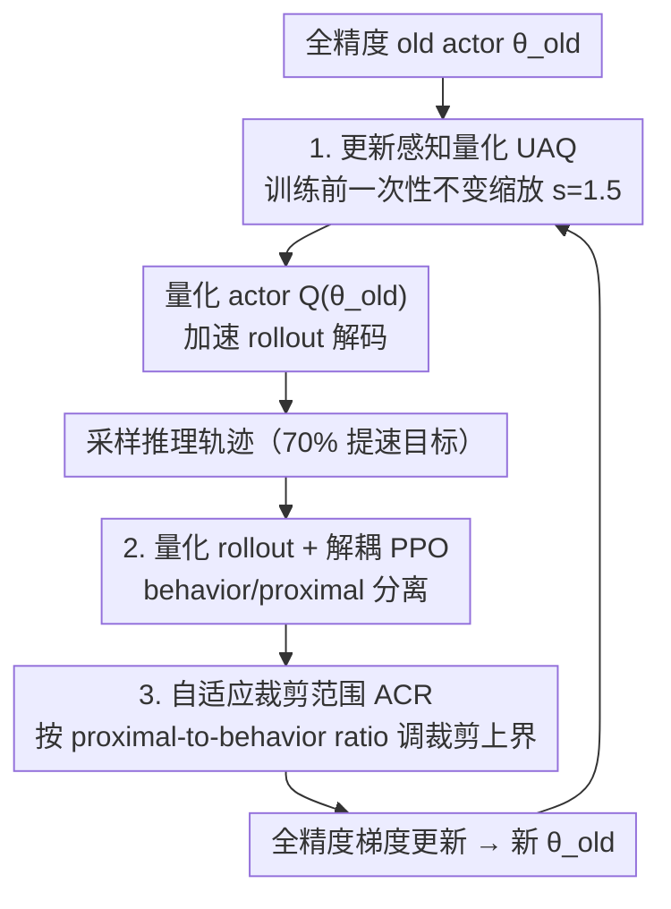

# QuRL: Low-Precision Reinforcement Learning for Efficient Reasoning

**会议**: ICLR 2026  
**OpenReview**: [https://openreview.net/forum?id=eG0bpCwdKn](https://openreview.net/forum?id=eG0bpCwdKn)  
**代码**: 待确认  
**领域**: LLM推理 / 强化学习 / 模型压缩  
**关键词**: RLVR, 量化 rollout, 解耦 PPO, 自适应裁剪, 推理大模型

## 一句话总结
QuRL 在 RLVR 训练中用一个**量化后的 actor 做 rollout 解码**来打掉 70% 训练时间的瓶颈，并通过自适应裁剪范围（ACR）和更新感知量化（UAQ）两个改动稳住量化引入的 off-policy 偏差，在 INT8/FP8 下把 rollout 提速 20%–80%，同时几乎不掉点。

## 研究背景与动机

**领域现状**：用可验证奖励做强化学习（RLVR）已经成为训练推理大模型（OpenAI-o1、DeepSeek-R1 这类）的主流范式。一个标准 RL step 分三段：actor rollout 生成回答、forward 算输出概率、backward 做策略梯度更新。

**现有痛点**：因为 LLM 是自回归解码，rollout 阶段每个 token 必须串行生成，受限于权重和 KV cache 的访存带宽，几乎无法并行。结果就是 rollout 独占了约 **70% 的训练总时长**，而推理任务又偏偏需要很长的 CoT 轨迹，这个瓶颈被进一步放大。

**核心矛盾**：rollout 慢的根源是「全精度自回归解码访存重」。一个直觉的提速办法是把 actor 量化（INT8/FP8）后再做 rollout——量化能直接加速矩阵乘和访存。但这样一来，采样是量化 actor 做的，梯度更新是全精度参数做的，**on-policy 就变成了 off-policy**，必须靠重要性采样 + trust region 来纠偏；而朴素地把量化塞进 PPO/GRPO 会引发训练崩溃。

**本文目标**：让「量化 actor 做 rollout + 全精度参数做更新」这套设置既快又稳，分解为两个子问题——(1) 如何让裁剪/重要性采样在长训练步下不崩；(2) 如何让极小的 RL 权重更新不被量化误差吃掉。

**切入角度**：作者把 QuRL 定位在 PTQ 和 QAT 之间——actor 在 rollout 前做一次性量化（像 PTQ），但参数又会被量化模型输出算出的梯度隐式影响（像 QAT）。这个双重身份要求量化既要简单到不需要复杂校准，又要表达力足够保住学习动态。

**核心 idea**：用量化 actor 加速 rollout，再用解耦 PPO + 自适应裁剪（ACR）压住长程发散，用不变缩放（UAQ）放大权重更新使其超过量化粒度，从而「提速但不掉点」。

## 方法详解

### 整体框架
QuRL 的训练循环是：每一步先把全精度 old actor $\theta_{old}$ 量化成 $\hat{\theta}_{old}=Q(\theta_{old},b)$（权重 channel-wise、激活 token-wise 缩放），用它做加速 rollout 采样推理轨迹；然后用**解耦 PPO** 目标做策略更新——把「采样用的 behavior policy」和「裁剪用的 proximal policy」分开，behavior 设为量化 old actor、proximal 设为全精度 old actor；更新仍在全精度参数空间进行，得到新的 $\theta$ 作为下一步的 old actor。这套设置有两个会崩的点被两个设计补上：长程训练时 behavior 与 proximal 的 KL 持续增大导致梯度估计有偏，由 **ACR**（自适应裁剪范围）解决；RL 的权重更新量级远小于量化误差、被量化「冻结」，由 **UAQ**（更新感知量化，训练前一次性不变缩放）解决。

### 关键设计

**1. 量化 rollout + 解耦 PPO：把量化带来的 off-policy 偏差从崩溃拉回稳定**

最朴素的做法是直接把 GRPO 目标里的重要性采样分母换成量化 old actor，即 $\hat{R}_{i,t}=\frac{\pi_\theta(o_{i,t}|q_i)}{\pi_{\hat\theta_{old}}(o_{i,t}|q_i)}$（式 3）。作者实测这会在几个 RL step 后奖励崩塌：token 裁剪比例迅速冲到 1.5% 又骤降到 0，说明 $\hat{R}_{i,t}$ 上叠加裁剪极不稳定。换成式 1（分母仍用全精度 old actor）虽然能稳，但训练 800 步后和 BF16 拉开明显差距。

QuRL 采用**解耦 PPO**（式 4）：把行为策略 $\pi_{\theta_{behav}}$（负责 token 采样）和近端策略 $\pi_{\theta_{prox}}$（负责裁剪）分开，重要性比 $R_{i,t}=\frac{\pi_\theta(o_{i,t})}{\pi_{\theta_{prox}}(o_{i,t})}$。在 QuRL 里 $\pi_{\theta_{behav}}=\pi_{\hat\theta_{old}}$（量化 old actor）、$\pi_{\theta_{prox}}=\pi_{\theta_{old}}$（全精度 old actor）。相比用量化 actor 直接决定裁剪的 $\hat{R}_{i,t}$，这样让更多 token 能通过正确的重要性采样被训练，显著提升稳定性。此外借鉴 FlashRL 的截断重要性采样（TIS，式 5），用上界 $C$ 限制 proximal-to-behavior 比，缓解训练引擎（HuggingFace/Megatron）和推理引擎（vLLM/SGLang）之间的实现差异。

**2. 自适应裁剪范围 ACR：解决长程训练下截断 behavior policy 引入的梯度偏差**

仅有解耦 PPO + TIS 在 500 步内表现不错，但超过 1000 步后，behavior 与 proximal 的 KL 散度 $D_{KL}(\pi_{\theta_{behav}}\|\pi_{\theta_{prox}})$ 从 0.002 一路涨到 0.025（12 倍），同时 proximal-to-behavior 比的最大值能飙到 $10^5$，导致截断后的梯度估计有偏、最终崩溃。作者把 TIS 改写成解耦 PPO 形式（式 7），发现其梯度被一个因子 $r_{i,t}=\pi_{\theta_{behav}}/\pi_{\theta_{behav}}^{trunc}$ 缩放，而这个因子会**隐式收缩裁剪范围**：$r_{i,t}\,\text{clip}(R_{i,t},1-\epsilon,1+\epsilon)=\text{clip}(r_{i,t}R_{i,t},r_{i,t}(1-\epsilon),r_{i,t}(1+\epsilon))$（式 8），对正优势 token 把上界压小，意外地把更多本该更新的 token 给裁掉了。

ACR 的做法是把裁剪上界改成**固定的 $(1+\epsilon)/r_{i,t}$**（式 9）：对于 $\frac{\pi_{\theta_{prox}}}{\pi_{\theta_{behav}}}>C$ 的 token，$r_{i,t}<1$ 会**放大上界**，让更多正优势 token 得到更新；其余情况退化为普通 TIS。这样就动态地按比例调整裁剪范围，避免长程下被过度裁剪导致的崩溃。

**3. 更新感知量化 UAQ：让极小的 RL 权重更新不被量化误差吃掉**

QuRL 的另一个隐患是「权重更新量级」和「量化误差量级」严重不匹配。量化误差约 $\frac{|\theta_{old}|}{2^b}$，而一步 RL 的权重更新约 $\alpha G$（式 10）——典型设置下 $G\in[0.1,1.0]$、$\alpha=10^{-6}$，更新量级只有 $10^{-7}\sim10^{-6}$，远小于量化误差。结果就是量化把几乎所有权重更新都抹掉了，量化模型实质上被「冻结」，完全脱离训练动态（Fig.4 实证了 $\pi_{\hat\theta_{old}}$ 与 $\pi_{\theta_{old}}$ 几乎不变）。

UAQ 是训练开始前做一次的权重调整，借助 transformer 线性层的**不变缩放**：对权重 $W$ 和输入激活 $X$，$WX=(W/s)\cdot(sX)$（式 11），激活的缩放可吸收进前一层（如 LayerNorm）。和普通 PTQ 选 $s$ 去最小化量化误差不同，UAQ 故意选 $s>1$，使得量化误差变成 $\frac{|\theta_{old}|}{s\cdot 2^b}$、权重更新变成 $s\cdot\alpha G$（式 12）——量化误差缩小 $s$ 倍、权重更新放大 $s$ 倍（因为梯度 $\nabla_W L=(\nabla_Y L)X^\top$ 里的 $X$ 被乘了 $s$），二者之比净改善 $s^2$。作者实测 $s=1.5$ 在 INT8/FP8 上都最稳：更大的 $s$ 或直接调高学习率都会让更多 token 被裁、RL 变不稳。

### 损失函数 / 训练策略
最终目标即式 9 的 ACR 解耦 PPO；GRPO 设置下额外保留对参考模型的 KL 正则（k3 估计器，系数 $10^{-3}$）。量化用 INT8/FP8、权重 channel-wise、激活 token-wise，借 vLLM 的 INT8/FP8 矩阵乘 kernel 加速；FP8 KV cache 因 vLLM 实现不成熟未启用。UAQ 在训练前一次性完成，$s=1.5$。

## 实验关键数据

框架基于 VeRL，跨三套 RL 配置验证：PPO@GSM8K、DAPO@AIME 2024、GRPO@DeepScaleR，量化用 INT8 与 FP8。

### 主实验

| 数据集 | 配置 | 指标 | RL(BF16) | FlashRL | QuRL |
|--------|------|------|----------|---------|------|
| GSM8K | INT8 | Accuracy | 55.35 | 51.40 | **53.55** |
| GSM8K | FP8 | Accuracy | 55.35 | 53.60 | **54.28** |
| AIME24 | INT8 | Avg@32 | 31.67 | 30.29 | **31.25** |
| AIME24 | FP8 | Avg@32 | 31.67 | 32.60 | **33.27** |
| DeepScaleR | INT8 | Avg(5任务) | 56.40 | 53.80 | **55.48** |

朴素 INT8/FP8 RL 在 AIME 2024 上接近 0 分（重要性采样偏差直接崩），FP8 朴素 RL 在 GSM8K 上也是 0.0；QuRL 把 GSM8K 的 INT8 差距从 FlashRL 的 4% 缩到约 2%、FP8 缩到约 1%。DeepScaleR 上 INT8 RL 比 BF16 落后 4.1%，QuRL w/ UAQ 把 INT8 平均准确率相对裸 INT8 RL 提升约 3%、逼近 BF16。

### 消融实验

| 配置 | Avg@32 | 说明 |
|------|--------|------|
| $s=1.5,\ \alpha=10^{-6}$ | **31.25** | UAQ 最佳设置 |
| $s=1,\ \alpha=10^{-6}$ | 30.63 | 不用 UAQ 缩放 |
| $s=2,\ \alpha=10^{-6}$ | 29.15 | 缩放过大，裁剪过多 |
| $s=1,\ \alpha=1.5\times10^{-6}$ | 29.06 | 直接调大 lr 反而更差 |
| $s=1,\ \alpha=2\times10^{-6}$ | 26.66 | lr 再大更不稳 |

吞吐：INT8 在 7B 上提速 20%–30%，14B 约 30%–56%，32B 在 A100 上 +70%、H100 上 +90%（约 1.83×）——模型越大收益越高，因为大模型受限于矩阵乘、小模型受限于 I/O。

### 关键发现
- ACR 是「长程不崩」的关键：1000 步后是否用 ACR 决定 KL 是否失控（0.025 vs 稳定），Fig.3 显示去掉 ACR 训练直接崩溃。
- UAQ 在低学习率（$10^{-6}$）下才有意义：GSM8K 用 $10^{-5}$ 学习率本身更新就够大，文中直接关掉了 UAQ。
- 直接调大学习率不能替代 UAQ：放大 $s$ 同时缩小量化误差，调 lr 只放大更新却不降噪，因此 $s=1.5$ 优于等效调高 lr。

## 亮点与洞察
- **把「量化 rollout」框成 off-policy RL 问题**，再用解耦 PPO 的 behavior/proximal 分离来纠偏——这个映射很巧，量化误差被当成行为策略偏移来处理，复用了成熟的 trust region 工具。
- **ACR 的洞察**：截断 behavior policy 会隐式收缩裁剪范围（式 8 的恒等变形），所以把裁剪上界改成 $(1+\epsilon)/r_{i,t}$ 把这个隐式收缩抵消掉——这是从公式结构里抠出来的修法，不是拍脑袋加超参。
- **UAQ 的 $s^2$ 杠杆**：一个不变缩放同时降量化噪声、放大更新，比值净改善 $s^2$，几乎零成本（训练前一次性、可吸收进 LayerNorm）。这个 trick 可迁移到任何「权重更新被量化粒度淹没」的低精度训练场景。

## 局限与展望
- 只验证到 8-bit（INT8/FP8），更激进的 4-bit（NVFP4）下 ACR/UAQ 是否还稳未知。
- FP8 KV cache 因 vLLM 实现不成熟被排除，rollout 提速还没吃满量化红利。
- $s=1.5$ 是实测经验值，缺乏对最优 $s$ 的理论刻画；不同模型/任务是否都适用同一个 $s$ 存疑。
- 改进方向：把 UAQ 的缩放做成可学习/逐层自适应，或与权重稀疏（剪枝）等其他压缩叠加进一步提速。

## 相关工作与启发
- **vs FlashRL（TIS）**: FlashRL 用截断重要性采样缓解训练/推理引擎差异，但只在 ~500 步内稳；QuRL 指出 TIS 在长程下因 behavior 截断引入梯度偏差而崩，用 ACR 修复，并补上 UAQ 解决权重更新被量化吞掉的正交问题。
- **vs PTQ/QAT**: PTQ（如 GPTQ）若每步重校准开销过大；QAT 会加剧训练/推理引擎差异、放大重要性采样偏差。QuRL 走中间路线——一次性量化 + 隐式被梯度影响。
- **vs 朴素「RL + 量化 rollout」**: 直接套 GRPO 会崩（AIME 近 0 分），QuRL 用解耦目标 + ACR + UAQ 三件套把性能拉回 BF16 附近。

## 评分
- 新颖性: ⭐⭐⭐⭐ 把量化 rollout 系统化成 off-policy RL，ACR 从公式结构推出修法，UAQ 的 $s^2$ 杠杆有巧思
- 实验充分度: ⭐⭐⭐⭐ 三套 RL 算法 × INT8/FP8 × 多模型多 GPU，主实验+消融+吞吐齐全；但 bit 宽仅到 8-bit
- 写作质量: ⭐⭐⭐⭐ 问题—失败现象—修法的推导链清晰，公式与图配合到位
- 价值: ⭐⭐⭐⭐ 直击 RLVR 训练 70% 的 rollout 瓶颈，20%–80% 提速且几乎不掉点，工程价值高

<!-- RELATED:START -->

## 相关论文

- [\[ICLR 2026\] QuRL: Rubrics As Judge For Open-Ended Question Answering](qurl_rubrics_as_judge_for_open-ended_question_answering.md)
- [\[ICLR 2026\] QeRL: Quantization-enhanced Low-rank Reinforcement Learning for LLMs](qerl_beyond_efficiency_-_quantization-enhanced_reinforcement_learning_for_llms.md)
- [\[ICLR 2026\] REA-RL: Reflection-Aware Online Reinforcement Learning for Efficient Reasoning](rea-rl_reflection-aware_online_reinforcement_learning_for_efficient_reasoning.md)
- [\[ICLR 2026\] Parameter-Efficient Reinforcement Learning using Prefix Optimization](parameter-efficient_reinforcement_learning_using_prefix_optimization.md)
- [\[ICLR 2026\] Stop Unnecessary Reflection: Training LRMs for Efficient Reasoning with Adaptive Reflection and Length Coordinated Penalty](stop_unnecessary_reflection_training_lrms_for_efficient_reasoning_with_adaptive_.md)

<!-- RELATED:END -->
