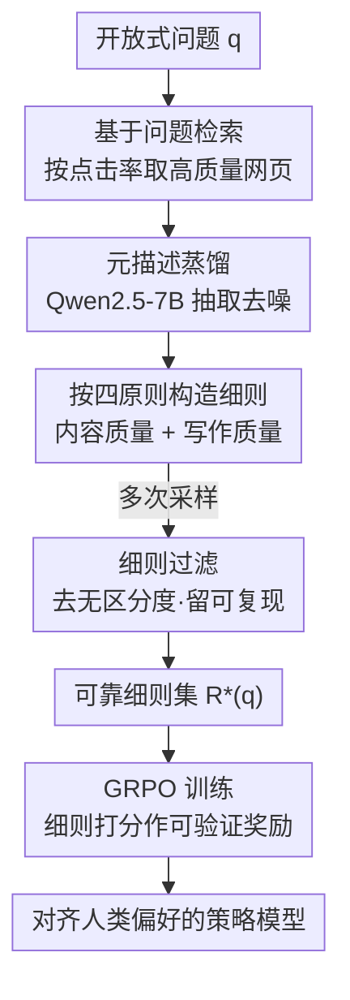

# QuRL: Rubrics As Judge For Open-Ended Question Answering

**会议**: ICLR 2026  
**OpenReview**: [https://openreview.net/forum?id=DrhWTuhtYq](https://openreview.net/forum?id=DrhWTuhtYq)  
**代码**: 待确认  
**领域**: 强化学习 / LLM 对齐  
**关键词**: RLVR, 开放式问答, 评分细则, GRPO, 奖励建模

## 一句话总结
QuRL 把开放式问答里"没有标准答案"的难题，转化成"从网络文章里自动挖出逐题评分细则（case-wise rubrics）当作可验证奖励"，再用 GRPO 训练策略模型，让 Qwen2.5-7B 相比 SFT 基线平均提升 +17.0 分。

## 研究背景与动机
**领域现状**：以 DeepSeek-R1、OpenAI o 系列为代表的 RLVR（Reinforcement Learning from Verifiable Rewards）在代码、数学这类有"金标准答案"的任务上效果惊人——因为奖励来自确定性、可规则验证的信号。但现实中大多数任务没有唯一正确答案，开放式问答（Open-Ended QA）就是典型：答案既要事实正确，又要写得流畅、有吸引力，人类偏好才是事实上的金标准。

**现有痛点**：开放式 QA 目前主流靠 RLHF——标注员给出成对/标量偏好，蒸馏成一个标量奖励模型来监督 RL。但这种"把评分规则参数化进奖励模型"的做法有两个硬伤：跨域泛化差、容易被 reward hacking 攻破，因为真正的评分规则被隐式地纠缠在模型参数里，既不可解释也不稳定。另一条路是让 LLM-as-Judge 用固定 checklist（如 HelloBench），但作者实验发现固定 checklist 区分度不够，分不出答案好坏。

**核心矛盾**：作者的洞察是——标注员评分时其实是在脑子里套一套隐式的评分规则（rubrics），RLHF 的奖励模型不过是这套规则的统计近似。那为什么不把隐式规则变成显式？如果能为每道题设计具体、可解释的评分细则当评价参考，就既保留了 RLHF 对齐人类偏好的好处，又把 RLVR"可验证奖励"的范式延伸到了开放域。

**切入角度**：手写细则太贵不可行；但互联网上本就堆满了与开放式问题相关的人类文章、论坛讨论，天然可以当作"粗粒度细则"或细则构造的灵感来源。作者用 50 道题做了预实验：给评委 LLM 喂相关网页文章后，与人类打分的相关性明显提升（Spearman's ρ 从 0.139 升到 0.209），且优于训练好的标量奖励模型 internlm2-7b-reward（0.210）。但直接塞原始网页又有问题：动辄超过 10 万 token，计算成本爆炸。

**核心 idea**：把嘈杂的网页文章蒸馏成信息密集、像评分表一样的逐题细则，再把细则当作 GRPO 的结构化奖励——用细则替代标量奖励模型，既可解释又能扩展，从而把 RLVR 推进到开放式 QA。

## 方法详解

### 整体框架
QuRL 整体分两大块：**离线的细则构造**（从网络数据为每道题挖出 case-wise rubrics）和**在线的 RL 训练**（拿这些细则当奖励跑 GRPO）。输入是一道开放式问题，先经过检索→蒸馏→构造→过滤四步生成可靠的细则集 $R^*(q)$；训练时策略模型对同一道题采样多个答案，由一个 judge LLM 依据细则逐条打分得到标量奖励，再用 GRPO 组内归一化算优势、更新策略。作者借此构造了 QuRL-Train（800 条 Question–Rubric 对）和经人工双检的 QuRL-Test（400 条）两个数据集。

### 关键设计

**1. 基于点击率的问题检索：用"被广泛认可"当质量先验**

开放式问题没有金标准答案，但网上有大量人类写的相关材料。QuRL 先用问题关键词构造检索 query，让搜索引擎返回网页集 $W=\{w_i\}$，并**按点击率（click-through rate）排序**取前若干篇。这一步看似平常，关键在于排序依据：高点击率往往意味着内容被广泛认可、质量相对较高，因此用它当作"哪些材料值得参考"的廉价先验，比随机抓取或纯相关度排序更可能拿到优质论据。

**2. 元描述蒸馏：把 10 万 token 的噪声网页压成信息密集的参考**

直接把原始网页喂给评委会撑爆上下文（常超 10 万 token）。QuRL 用一个轻量快速的模型（Qwen2.5-7B）对每篇网页生成简洁的**元描述（meta-description）**，定义为抽取函数 $f_D: W \to D$，只保留与回答该问题直接相关的内容——核心论点、提供背景的段落、连接思路的过渡推理、精彩的示例，丢掉广告和无关细节。这样得到的 $d_i$ 是压缩后的高密度表示，既保住了语义上有价值的内容，又去掉了噪声，让后续构造和评分都可负担。

**3. 双维度细则构造 + 方差过滤：让奖励既准又有区分度**

这是 QuRL 的核心。作者观察到元描述能从两个互补视角指导评价：一是它常包含对某观点的展开，正像人类写答案时先在脑中形成几个核心立场，因此可当**论据参考**，告诉细则该强调哪些要点（内容质量）；二是元描述源自人类文本，天然保留了流畅、连贯、有表现力的**写作风格**，可当文风范例（写作质量）——这正好对症 LLM 常见的"罗列但浅、缺过渡、语言乏味"。据此作者提炼四条细则设计原则（内容聚焦、写作质量、逐题特异性、引用元描述），定义构造函数 $f_R:(q,D)\to R$，每条细则给出分档与示例（如"清晰度与逻辑流（2分）"配优/劣两档示例）。由于细则生成本身是随机的，作者再做**细则过滤**：多次采样得到候选集 $R^{(1)},\dots,R^{(K)}$，过滤机制（i）剔除在不同答案上区分度不足的细则集，（ii）合并跨样本被稳定复现的细则，得到可靠集 $R^*(q)$。消融显示去掉过滤会让平均分从 59.3 掉到 52.2，说明区分度过滤对奖励可靠性至关重要。

**4. 基于细则的 GRPO 训练：把细则打分变成可验证奖励**

有了 $R^*(q)$，训练阶段对每个训练元组 $(q_i, R^*(q_i))$、每个策略采样的答案 $o$，先让 judge 模型产生逐细则的评价文本 $y=\text{LLM}_{reward}(q_i,o,R^*(q_i))$，再用一个确定性解析器 $f$ 从中抽取各细则的数值分、求和并归一化到 $[0,1]$ 得到奖励 $R(o\mid q_i,R^*(q_i))=f(y)$。RL 算法用 GRPO：每题采样 $N$ 个答案，组内归一化算相对优势 $A_j=\frac{R_j-\text{mean}\{R\}}{\text{std}\{R\}}$，再按带 clip 与 KL 惩罚的 GRPO 目标更新策略。相比 RLHF 的标量奖励模型，这里奖励直接由显式、逐题的细则驱动，可解释且不易被 reward hacking，本质上就是把 RLVR 的"可验证奖励"移植到了开放域。

### 损失函数 / 训练策略
训练目标是标准 GRPO：

$$J_{GRPO}(\theta)=\mathbb{E}\Big[\frac{1}{N}\sum_{j=1}^{N}\min\big(\frac{\pi_\theta(o_j|q)}{\pi_{\theta_{old}}(o_j|q)}A_j,\ \text{clip}(\frac{\pi_\theta(o_j|q)}{\pi_{\theta_{old}}(o_j|q)},1-\varepsilon,1+\varepsilon)A_j\big)-\beta D_{KL}(\pi_\theta\Vert\pi_{ref})\Big]$$

流程上先做冷启动 SFT：从 DeepSeek-R1 蒸馏 64 条指令-回复对，让模型学会 `<think></think>`/`<answer></answer>` 格式（lr=1e-6、batch=16、2 epoch）。随后 GRPO 训练 2 epoch，lr=1e-6，每题采样 8 个答案，全局 batch=32，在 8 张 A100 上完成，报告两个 epoch 中的最佳表现。

## 实验关键数据

### 主实验
在 HelloBench、LongBench-Write、QuRL-Test 三个基准上评测，分数按 HelloBench 方式归一化。Qwen2.5-7B-QuRL 用仅 800 条细则训练就达到平均 59.3，与近 700B 的 DeepSeek-V3（59.1）相当。

| 模型 | 平均 | HelloBench | QuRL-Test | LB-Write |
|------|------|-----------|-----------|----------|
| GPT-4o | 64.7 | 46.0 | 80.8 | 67.2 |
| Gemini-2.5-Pro | 70.4 | 69.2 | 65.9 | 76.1 |
| DeepSeek-R1 | 62.4 | 32.8 | 80.4 | 74.0 |
| DeepSeek-V3 | 59.1 | 28.1 | 70.8 | 78.4 |
| Qwen2.5-7B-Instruct | 28.3 | 20.8 | 26.2 | 37.8 |
| Qwen2.5-7B-SFT | 42.3 | 38.0 | 41.6 | 47.2 |
| **Qwen2.5-7B-QuRL** | **59.3** | **56.4** | **62.4** | **59.2** |

QuRL 相比 SFT 基线 +17.0，相比 RLHF 奖励模型变体 +11.6，且输出长度（916 词）居中，说明涨分不是靠刷长度 game 评测指标。

### 消融实验
所有消融均为单项移除，基于 Qwen2.5-7B-QuRL（平均 59.3）。

| 配置 | 平均分 | 说明 |
|------|--------|------|
| Full (QuRL) | 59.3 | 完整框架 |
| w/ rlhf reward model | 47.7 | 用 internlm2-7b-reward 标量奖励替代细则，掉 11.6 |
| w/o rubrics filter | 52.2 | 去掉区分度过滤，掉 7.1 |
| w/o web information | 48.9 | 不参考网络材料、凭空生成细则，掉 10.4 |
| w/o rubrics | 44.0 | 退回五维 checklist 打分，掉 15.3 |

### 关键发现
- **细则是涨分主引擎**：去掉 rubrics（退回固定 checklist）掉得最狠（59.3→44.0），印证固定 checklist 区分度不足、逐题细则才能拉开答案差距。
- **网络材料与过滤都不可少**：去掉网络信息掉到 48.9（细则失去人类论据与文风范例），去掉过滤掉到 52.2（噪声细则降低奖励可靠性）。
- **人类一致性**：以 GPT-4o 为评委，在 200 条 HelloBench 回答上，QuRL 细则评测与人类的 Spearman's ρ=0.31（p=8.29e-6），显著高于 HelloBench checklist（0.20）、LongWriter（0.11）、InternLM2 奖励模型（0.22）和普通 LLM-as-Judge（0.08）。

## 亮点与洞察
- **把"评价"重新解释成 RLVR 的可验证信号**：作者点破 RLHF 奖励模型只是隐式细则的统计近似，于是反过来把细则显式化、外置化，让开放域也能享受 RLVR 的稳定与可解释——这个视角转换很漂亮。
- **用点击率当质量先验**：不靠人工标注、不训奖励模型，而是借互联网"被广泛认可"的信号筛材料，廉价又可扩展，是把弱监督做成强信号的巧思。
- **方差过滤保证奖励区分度**：细则生成随机，多采样后专门剔除"对所有答案打分都差不多"的无区分度细则，这一步直接对应 RL 里"奖励要能分出好坏"的本质需求，可迁移到任何 LLM-as-Judge 的奖励设计。

## 局限与展望
- **依赖检索质量与可得性**：方法成败系于能否检索到相关、高质量的人类文章；对小众、时效性强或网络材料稀缺的问题，细则质量会打折。
- **judge 模型仍是 LLM**：奖励最终由 judge LLM 按细则打分，细则虽显式化了评价标准，但解析与打分环节仍可能引入 judge 自身偏差，是否彻底免疫 reward hacking 有待更大规模验证。
- **规模与基准有限**：主要在 Qwen2.5-7B 上验证，训练集仅 800 条，三个基准也偏写作/问答；更大模型、更多任务类型上的泛化性还需进一步检验。

## 相关工作与启发
- **vs RLHF（标量奖励模型）**: RLHF 把评分规则隐式纠缠进参数，跨域差、易被 hack；QuRL 把规则显式成逐题细则当奖励，主实验里同框架下细则比 RLHF 奖励模型高 11.6 分，且可解释。
- **vs HelloBench（固定 checklist）**: HelloBench 对所有题用同一套五维 checklist，区分度不足；QuRL 为每题定制 case-wise 细则，消融显示这是最大涨分来源（+15.3）。
- **vs Huang et al. (2025) 的生成式奖励模型**: 二者都构造细则，但 Huang 用复杂 LLM-agent 流水线且未开源、不利用互联网；QuRL 直接从网络挖细则，轻量、可复现、对齐人类。

## 评分
- 新颖性: ⭐⭐⭐⭐⭐ 首次用网络蒸馏的逐题细则把 RLVR 扩展到开放式 QA，视角与落地都新。
- 实验充分度: ⭐⭐⭐⭐ 三基准 + 完整消融 + 人类一致性，但模型与规模偏单一。
- 写作质量: ⭐⭐⭐⭐ 动机推导清晰，从预实验一路引到方法，逻辑顺。
- 价值: ⭐⭐⭐⭐⭐ 给"无金标准任务也能上 RLVR"提供了一条廉价可复现的路径。

<!-- RELATED:START -->

## 相关论文

- [\[ICLR 2026\] A$^2$Search: Ambiguity-Aware Question Answering with Reinforcement Learning](a2search_ambiguity-aware_question_answering_with_reinforcement_learning.md)
- [\[ICLR 2026\] From Verifiable Dot to Reward Chain: Harnessing Verifiable Reference-based Rewards for RL of Open-ended Generation](from_verifiable_dot_to_reward_chain_harnessing_verifiable_reference-based_reward.md)
- [\[ICLR 2026\] Helix: Evolutionary Reinforcement Learning for Open-Ended Scientific Problem Solving](helix_evolutionary_reinforcement_learning_for_open-ended_scientific_problem_solv.md)
- [\[ICLR 2026\] Rubrics as Rewards: Reinforcement Learning Beyond Verifiable Domains](rubrics_as_rewards_reinforcement_learning_beyond_verifiable_domains.md)
- [\[ICLR 2026\] J1: Incentivizing Thinking in LLM-as-a-Judge via Reinforcement Learning](j1_incentivizing_thinking_in_llm-as-a-judge_via_reinforcement_learning.md)

<!-- RELATED:END -->
