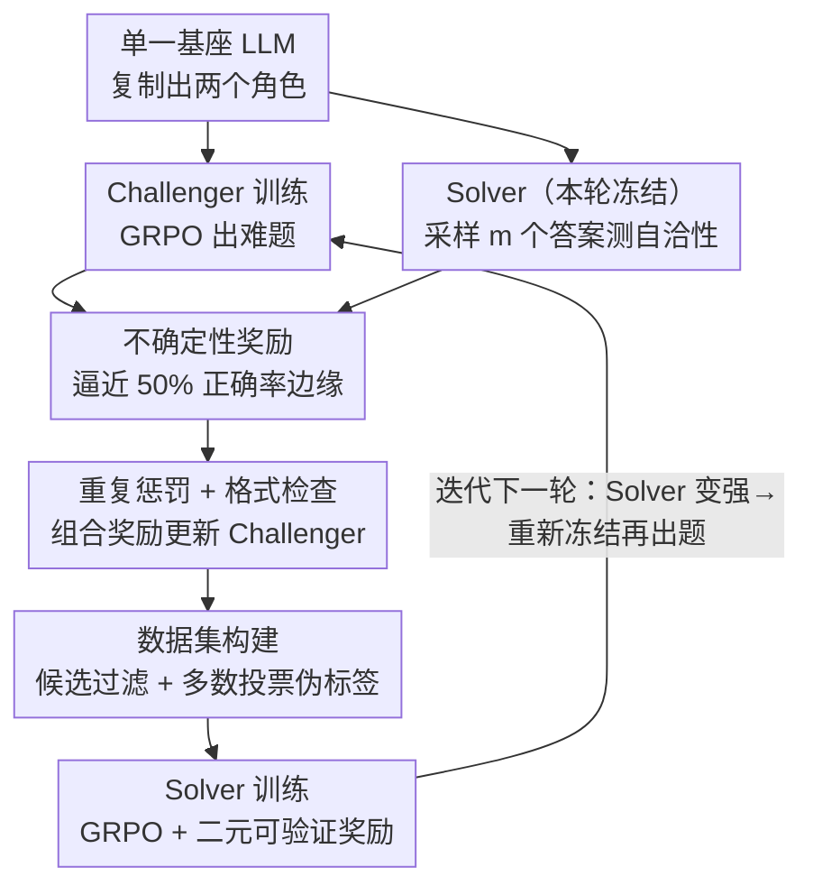

# R-Zero: Self-Evolving Reasoning LLM from Zero Data

**会议**: ICLR 2026  
**OpenReview**: [https://openreview.net/forum?id=96apU6YzSO](https://openreview.net/forum?id=96apU6YzSO)  
**代码**: https://github.com/Chengsong-Huang/R-Zero  
**领域**: LLM推理 / 强化学习  
**关键词**: 自进化、无数据、Challenger-Solver、协同进化、GRPO、伪标签

## 一句话总结
R-Zero 从一个基座模型同时初始化「出题者 Challenger」和「解题者 Solver」两个角色，让前者被奖励去生成卡在 Solver 能力边缘（正确率约 50%）的难题、后者被奖励去攻克这些题，二者用 GRPO 交替训练、协同进化，全程不需要任何人工题目和标签，就把 Qwen3-4B-Base 的数学推理平均分提升 +6.49、通用推理 +7.54。

## 研究背景与动机

**领域现状**：让 LLM "自进化"——自己产生经验、自己提炼、自己学习——被视为通往超级智能的可扩展路径。但当前主流做法（SFT 或带可验证奖励的强化学习 RLVR）都重度依赖大量人工精心标注的任务与答案作为监督信号。

**现有痛点**：靠人来造题、标答案既贵又难规模化，更要命的是它构成了一个**根本性天花板**——如果 AI 的能力上限被人类标注者的水平钉死，就永远无法超越人类智能。为了摆脱这个依赖，已有两条路线但都不彻底：一是**无标签 RL**，从模型自身输出（如序列置信度、输出熵）里抽奖励信号，但它仍然需要一个**预先存在的题库**；二是**自挑战（self-challenging）**，让模型自己出题自己学，但多数方法依赖外部代码执行器来保证题目可行且可验证，一旦进入开放式推理这种**没有验证 oracle** 的领域，自造数据的质量和正确性就难以保证。

**核心矛盾**：真正的"从零自进化"要求既不依赖种子题库、又能在没有外部验证器的领域（如一般数学推理）里自我校验数据质量——这两点现有方法都做不到同时满足。

**本文目标**：构造一个从**零外部数据**出发、不需要人工题目/标签、也不需要代码执行器的自进化推理训练框架。

**切入角度**：作者借鉴自博弈（self-play）思想，把"出题"和"解题"拆成两个**独立优化但相互耦合**的角色。关键洞察是：最有价值的训练信号来自 Solver 当前**正好不太会做**的题——太简单学不到东西，太难则伪标签不可靠；而"会不会"这件事，可以用 Solver 自己多次回答的**自洽性（self-consistency）**来无标签地度量。

**核心 idea**：用一个 RL 训练的 Challenger 持续生成卡在 Solver 能力边缘的题，再用 Solver 多数投票产生的伪标签去训练 Solver，二者交替冻结、协同进化，形成一条无需人工干预的自适应课程（curriculum）。

## 方法详解

### 整体框架

R-Zero 的输入只有一个基座 LLM，输出是一个推理能力被持续增强的 Solver。整个框架是一个**迭代循环**：每一轮里，先冻结 Solver、用 GRPO 训练 Challenger 去出难题；再用训练好的 Challenger 批量生成候选题，经过滤 + 多数投票构造出一份带伪标签的数据集；最后冻结 Challenger、用 GRPO 在这份数据上训练 Solver。一轮结束后 Solver 变强，下一轮 Challenger 又要去找它新的能力边缘，如此螺旋上升。两个角色都从**同一个基座**复制初始化，全程自监督、零人工介入。

### 关键设计

**1. Challenger–Solver 协同进化循环：把"造数据"变成两个角色的博弈**

R-Zero 不再去找一个预先存在的题库，而是让出题和解题分裂成两个**独立优化但交替冻结**的策略 $Q_\theta$（Challenger）和 $S_\phi$（Solver），它们从同一基座初始化后在 RL 过程中协同进化。一轮的节奏是：冻结 $S_\phi$ → 用它的反馈训练 $Q_\theta$ 出题 → 冻结 $Q_\theta$ → 用它出的题训练 $S_\phi$。这样做的根本好处是把数据生成从"一次性人工标注"变成一个**自适应、持续追着 Solver 弱点跑的课程生成器**：Solver 每变强一点，Challenger 就被迫去探索它新的能力边缘，训练信号永远停留在最有学习价值的难度带上，而不会像固定题库那样很快被学穿或者一开始就太难。

**2. 不确定性奖励：把"题目好不好"量化成 Solver 的自洽性**

这是整个框架能无标签运转的核心。Challenger 要的不是最难的题（那样 Solver 全错、伪标签全是噪声），也不是最简单的题（学不到东西），而是 Solver **正好半懂不懂**的题。作者把"半懂"形式化为自洽性：对生成的题 $x$，向冻结的 Solver 采样 $m$ 个答案，取最高频答案作为伪标签 $\tilde{y}(x)$，并计算经验正确率 $\hat{p}(x;S_\phi)=\frac{1}{m}\sum_{j=1}^{m}\mathbb{1}\{y_j=\tilde{y}(x)\}$。不确定性奖励定义为：

$$r_{\text{uncertainty}}(x;\phi)=1-2\left|\hat{p}(x;S_\phi)-\tfrac{1}{2}\right|$$

当 $\hat{p}\to 0.5$ 时奖励最大、$\hat{p}\to 0$ 或 $1$ 时奖励趋零，于是 Challenger 被精确地推向"让 Solver 最大不确定"的题。这个度量完全来自 Solver 自身的多次采样，不需要任何外部 oracle 或代码执行器，因此能用在没有验证环境的开放式推理上——作者选数学正是因为答案客观、便于用多数投票造伪标签。

**3. 重复惩罚 + 格式检查 + 组合奖励：保证出题既多样又规整**

只靠不确定性奖励，Challenger 容易塌缩到反复出同一类题。为此作者加了一个 batch 内的**重复惩罚**：用 BLEU 度量两两相似度 $d_{ij}=1-\text{BLEU}(x_i,x_j)$（选 BLEU 是因为 rollout 中要算无数次、需要快），把 $d_{ij}<\tau_{\text{BLEU}}$ 的题聚成簇 $C=\{C_1,\dots,C_K\}$，簇 $C_k$ 里每道题 $x_i$ 的惩罚正比于簇相对大小 $r_{\text{rep}}(x_i)=\lambda\frac{|C_k|}{B}$（$B$ 为 batch size，实验取 $\lambda=1$，$\tau_{\text{BLEU}}=0.5$）。同时一个**格式检查**会先判断题目是否被 `<question>...</question>` 正确包裹，不合规直接给奖励 0、其余信号都不再计算。最终对通过格式检查的题取组合奖励 $r_i=\max\!\left(0,\ r_{\text{uncertainty}}(x_i;\phi)-r_{\text{rep}}(x_i)\right)$，据此算优势 $\hat{A}_i$ 并最小化 GRPO 损失更新 Challenger。消融显示去掉重复惩罚数学分掉 3.3 点，说明题目多样性对 Solver 训练确实关键。

**4. 数据集构建：难度过滤 + 多数投票兼做隐式质量控制**

Challenger 训好后充当课程生成器，先采样一个大候选池（$N=8000$）。对每道题让当前 Solver 采 $m=10$ 个答案、多数投票定伪标签 $\tilde{y}_i$ 并算经验正确率 $\hat{p}_i$，**只有落在信息量最大的难度带** $|\hat{p}_i-\tfrac{1}{2}|\le\delta$（$\delta=0.25$，即 10 个答案里 3~7 个对上多数答案）的题才进训练集 $S$。这一步表面是按难度筛选——丢掉太简单和太难的题，但作者强调它还隐式做了**质量控制**：经验正确率极低往往意味着题目本身有歧义、病态或伪标签不可靠，过滤掉这些低自洽样本能同时提升数据质量和难度校准。消融里去掉过滤后通用推理掉了 6 点以上，是掉点最狠的一项。

### 损失函数 / 训练策略

两个阶段都用 **GRPO（Group Relative Policy Optimization）**。Challenger 阶段以上述组合奖励 $r_i$ 计算组内相对优势 $\hat{A}_i$，最小化 $\mathcal{L}_{\text{GRPO}}(\theta)$。Solver 阶段奖励更简单也更可验证：对题 $x_i\in S$ 及其伪标签 $\tilde{y}_i$，Solver 生成一批答案，匹配伪标签得奖励 $r_j=1$、否则 $0$，据此算优势 $\hat{A}_j$ 并最小化 $\mathcal{L}_{\text{GRPO}}(\phi)$。框架基于 EasyR1 实现；每轮表格结果取 45 个训练步后的结果，图中每 15 步评一次 checkpoint。

## 实验关键数据

骨干涵盖 Qwen3-4B/8B-Base（同架构看规模）与 OctoThinker-3B/8B（从 Llama-3.1 续训，验证跨架构）。基线包括 Base 模型、Absolute Zero，以及一个 R-Zero(challenger) 对照——即 Solver 训练在一个**未经训练**的 Challenger 出的题上，用来隔离 RL 训练 Challenger 的作用。

### 主实验（数学推理，平均分）

| 模型 | Base | R-Zero(challenger) | R-Zero | 相对 Base 提升 |
|------|------|--------------------|--------|----------------|
| Qwen3-4B-Base | 42.57 | 45.01 | **49.93** | +6.49（论文称 49.07/+6.49） |
| Qwen3-8B-Base | 48.64 | 52.10 | **53.72** | +5.51（49.18→54.69） |
| OctoThinker-3B | 26.64 | 27.51 | **29.32** | +2.68 |
| OctoThinker-8B | 36.41 | 36.98 | **38.52** | +2.11 |

通用推理（SuperGPQA / MMLU-Pro / BBEH）上同样全面提升，如 Qwen3-4B 平均 26.34→31.15（+4.81，摘要口径 +7.54 为更高骨干配置），证明数学训练学到的推理能力能**跨域泛化**而非死记领域知识。从 R-Zero(challenger) 到第一轮 R-Zero 的明显跳升（Qwen3-4B 上 +3.7），说明 RL 训练出来的 Challenger 给出的课程确实远胜未训练的出题器。

### 消融实验（Qwen3-4B-Base）

| 配置 | 数学 AVG | 通用 AVG | 说明 |
|------|---------|---------|------|
| R-Zero（完整） | 49.07 | 31.15 | 完整框架 |
| w/o 重复惩罚 | 45.76 | 28.73 | 题目多样性受损，数学掉 3.31 |
| w/o 难度过滤 | 47.35 | 26.69 | 通用掉 6 点以上，掉点最狠 |

### 关键发现
- **难度过滤贡献最大**：去掉它通用推理掉 6+ 点，因为 Solver 被迫在含歧义/病态题的噪声数据上训练，鲁棒性受损——印证了过滤兼做质量控制的论断。
- **会收敛甚至塌缩，且与模型规模相关**：0.6B 模型第 1 轮（Step 15）就见顶随后下滑，1.7B 稍晚，4B 能稳升三轮到 Step 45 才在 Step 60 骤降。大模型只能**推迟**而非避免塌缩。
- **伪标签会系统性退化**：随着题越出越难，Solver 多数投票（对照 GPT-4o oracle）的真实正确率从首轮 79.0% 一路掉到第三轮 63.0%，这是制约框架上限的核心 trade-off。
- **可当 mid-training 用**：先跑 R-Zero 再在人工标注数据上 SFT，比只用人工数据多 +2.35（4B）/+3.69（8B）；且"先 R-Zero 后 SFT"的顺序策略优于把人工数据混进 R-Zero 一起训。

## 亮点与洞察
- **用自洽性把"难度"变成可优化的连续奖励**：$1-2|\hat{p}-1/2|$ 这一项让"卡在能力边缘"从一个模糊直觉变成可微的训练目标，且完全无标签——这是把自博弈搬到无验证器领域的关键一步，可迁移到任何能用多数投票造伪标签的客观答案任务。
- **过滤步一举两得**：同一个 $|\hat{p}-1/2|\le\delta$ 既校准课程难度、又顺手剔除低自洽的病态题做质量控制，省掉了单独的数据清洗模块。
- **诚实地揭示自进化的边界**：论文没有只报喜，而是系统刻画了"伪标签随难度上升而退化→性能终将塌缩"的内在矛盾，给后续"如何打破自标注质量天花板"指明了靶子。

## 局限与展望
- **存在性能塌缩**：自进化不能无限持续，伪标签质量下滑（79%→63%）最终拖垮 Solver，大模型也只是延后塌缩。如何引入外部锚点或更可靠的自校验是关键。
- **领域受限于"答案客观"**：方法依赖多数投票造伪标签，目前聚焦数学；迁移到答案开放、难以投票判定的领域（如自由形式写作、证明）还需新机制。
- **缺少对塌缩的根因级解法**：论文诊断了塌缩现象与规模相关性，但未给出阻止塌缩的训练改造，作者也将其列为未来工作。
- **伪标签噪声会自我强化**：Solver 既是伪标签来源又是被训练对象，错误可能被循环放大，缺乏跳出局部错误的机制。

## 相关工作与启发
- **vs 无标签 RL（如基于置信度/熵的方法）**: 它们从模型输出抽奖励、去掉了显式标签，但仍需一个**预先存在的题库**；R-Zero 连种子题库都不要，从零生成全部训练题。
- **vs 自挑战 / 代码自博弈（Coder–Tester、Absolute Zero 等）**: 那类方法多依赖代码执行器/单元测试做验证，局限在可验证域；R-Zero 用 Solver 自洽性替代外部验证器，把自博弈推广到没有验证 oracle 的一般推理域。在主表上 R-Zero 也普遍优于 Absolute Zero。
- **vs RLVR**: 传统 RLVR 仍需可验证的人工任务/规则验证器；R-Zero 把"任务 + 验证信号"都内生化，是 RLVR 在零数据设定下的延伸。

## 评分
- 新颖性: ⭐⭐⭐⭐⭐ 真正从零数据、无外部验证器的 Challenger-Solver 协同进化，把自博弈推广到无 oracle 的一般推理域。
- 实验充分度: ⭐⭐⭐⭐ 跨两种架构四个规模 + 消融 + 迭代塌缩/伪标签退化/SFT 协同等深入分析，但塌缩缺解法。
- 写作质量: ⭐⭐⭐⭐⭐ 动机链条清晰，奖励设计与分析诚实，正负面都讲透。
- 价值: ⭐⭐⭐⭐⭐ 给"超越人类标注上限的自进化"提供了可落地范式，并明确指出其当前天花板。

<!-- RELATED:START -->

## 相关论文

- [\[ICLR 2026\] SPIRAL: Self-Play on Zero-Sum Games Incentivizes Reasoning via Multi-Agent Multi-Turn Reinforcement Learning](spiral_self-play_on_zero-sum_games_incentivizes_reasoning_via_multi-agent_multi-.md)
- [\[ICML 2026\] MindZero: Learning Online Mental Reasoning with Zero Annotations](../../ICML2026/reinforcement_learning/mindzero_learning_online_mental_reasoning_with_zero_annotations.md)
- [\[ICLR 2026\] LongWriter-Zero: Mastering Ultra-Long Text Generation via Reinforcement Learning](longwriter-zero_mastering_ultra-long_text_generation_via_reinforcement_learning.md)
- [\[ICML 2026\] Unlocking Zero-Shot Geospatial Reasoning via Indirect Rewards](../../ICML2026/reinforcement_learning/unlocking_zero-shot_geospatial_reasoning_via_indirect_rewards.md)
- [\[ACL 2026\] Easy Samples Are All You Need: Self-Evolving LLMs via Data-Efficient Reinforcement Learning](../../ACL2026/reinforcement_learning/easy_samples_are_all_you_need_self-evolving_llms_via_data-efficient_reinforcemen.md)

<!-- RELATED:END -->
