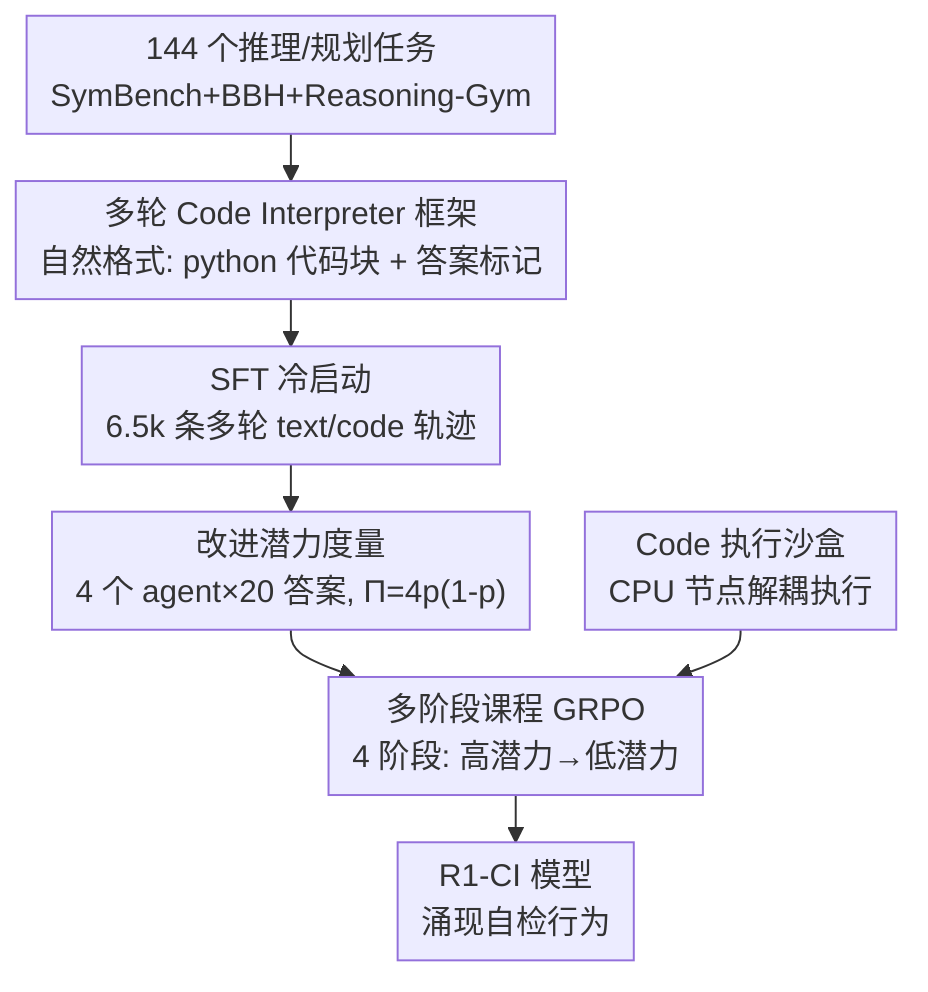

# R1-Code-Interpreter: LLMs Reason with Code via Supervised and Multi-stage Reinforcement Learning

**会议**: ICLR 2026  
**OpenReview**: [https://openreview.net/forum?id=FNlNH0iFOx](https://openreview.net/forum?id=FNlNH0iFOx)  
**代码**: https://github.com/yongchao98/R1-Code-Interpreter  
**领域**: LLM推理 / 强化学习 / 工具使用  
**关键词**: Code Interpreter, 多阶段强化学习, 课程学习, GRPO, 改进潜力

## 一句话总结
本文用 SFT 冷启动 + 多阶段课程式 GRPO，把开源 LLM 训练成能在推理过程中自主决定何时写代码、何时纯文本推理的通用 Code Interpreter；其关键创新是用「改进潜力」而非难度来排序样本做课程学习，把横跨 144 个异构任务的 RL 平均增益从 +3.4% 拉到 +9.3%，最终 R1-CI-14B 在 37 个测试任务上把准确率从 44.1% 提到 72.4%，反超体量大得多的 GPT-4o（含官方 Code Interpreter）。

## 研究背景与动机
**领域现状**：文本链式推理（CoT）擅长语义和常识，但在精确计算、符号操作、组合优化、算法搜索这类任务上常常失手。让 LLM 生成并执行代码（Code Interpreter）能把这些硬骨头交给外部工具（求解器、搜索算法）来啃，往往比纯文本推理强。OpenAI 的 GPT 系列已经内置了 Code Interpreter，能迭代地写代码、读执行结果、再继续推理。

**现有痛点**：关键难题是「该用文本还是该用代码」——大多数输入问题并没有显式提示哪种方式更好，而文本/代码的解空间又极大。已有研究发现现有 Code Interpreter 实现并不擅长在文本与代码之间切换，符号能力被严重浪费；LLM 写出来的代码还经常退化成「硬编码的伪脚本」，失去符号计算的意义。更要命的是，已有用 RL 训练 Code Interpreter 的工作（ToRL、ReTool）几乎都只在数学这类窄领域上做，ToolRL 虽然教模型选工具但 Code Interpreter 只用来生成很简单的代码——没人系统研究过怎么把 Code Interpreter 训练成跨上百个任务都稳健可泛化的通用能力。

**核心矛盾**：作者直接把 DeepSeek 风格的标准 GRPO 搬到 144 个异构任务上，结果增益微乎其微（单任务能涨 27.4%，107 个任务一起训只涨 3.3%）。根因有两个：任务异构性稀释了奖励信号；有效样本稀缺——大量任务对当前模型而言要么太难（几乎全错、奖励稀疏到 0）、要么训不动。作者还从理论上证明了：GRPO 的策略梯度幅度正比于 $p(1-p)$（$p$ 为该样本在一组采样里答对的比例），在「几乎全对」或「几乎全错」的样本上梯度趋于 0，更新被 KL 项主导、把策略往参考模型收缩，于是优化停滞。

**本文目标**：① 真正训练一个跨多任务、多领域的通用 Code Interpreter；② 找到一种 RL 配方，能在异构、有效样本稀缺的设置下持续优化。

**切入角度**：既然可用梯度正比于 $p(1-p)$、在 $p=0.5$ 时最大，那就别按传统课程学习的「由易到难」来排样本，而是按「改进潜力」排——优先喂那些模型半对半错、最有训练信号的样本。

**核心 idea**：先用 SFT 冷启动给模型装上多轮 text/code 交错推理的能力，再用「按改进潜力分组的多阶段课程式 GRPO」从高潜力样本逐步推进到低潜力样本，把异构大规模 RL 的瓶颈打开。

## 方法详解

### 整体框架
R1-Code-Interpreter（R1-CI）是在纯文本 LLM（Qwen2.5-3B/7B/14B）基础上，通过「多轮 SFT + 多阶段 GRPO」训练得到的 Code Interpreter 增强推理模型。推理时模型自回归地生成思考、在需要时插入一段 Python 代码、系统执行后把结果回填进上下文，模型据此继续推理，直到给出最终答案——整个循环上限是 8 次代码调用。训练上则是一条流水线：把 144 个推理/规划任务标准化 → 用 GPT-4o 合成 6.5k 条多轮轨迹做 SFT 冷启动 → 用 4 个不同 agent 框架反复采样来度量每个样本的「改进潜力」 → 按潜力把样本分成 4 组，做从高潜力到低潜力的多阶段课程式 GRPO；其间用一个部署在 CPU 节点上的代码执行沙盒把「代码执行」与「GPU 梯度计算」解耦，省下 39% 训练时间。



### 关键设计

**1. 多轮 Code Interpreter 框架与「自然格式」标记**

针对「该用文本还是代码难以预判」这个核心痛点，作者不强行规定模式，而是让模型在 step-by-step 推理中自主决定要不要写代码。系统用一段简单的 head prompt 把输出组织成三段迭代结构：推理 → 可选地调用 Code Interpreter → 最终答案。关键的工程取舍是**不用人造标签**：不像很多 RL 工作那样强制 `<think>`/`<answer>`/`<search>` 标签，本文只用最终答案标记 `<<<答案内容>>>` 来抽取答案；代码则直接复用 LLM 预训练时就有的「用 ` ```python ` 起一个代码块」的习惯作为隐式标记。系统一旦检测到代码块就抽出来执行，把结果以 `Code Execution Results:` 前缀回填，循环直到达到 8 次代码上限或模型输出 `<<<...>>>`。作者实测这种贴近模型原始分布的自然格式比强制打标签效果更好——因为它不破坏 RL 阶段模型的自然学习动态。

**2. SFT 冷启动：合成 6.5k 条多样化多轮轨迹**

针对「直接 RL 因有效样本稀缺而训不动」，作者先用 SFT 给模型一个热启动。用 GPT-4o 对每个任务生成多条推理/执行轨迹、只保留答对的；为提升多样性和适应性，刻意混用多种 prompt 形式（有的允许自由推理，有的强制 text/code 之间切换），并**提高多轮轨迹的占比**，尤其是那些会自适应调整策略（在代码与文本间切换、迭代修正代码）的轨迹。每个任务最多保留 70 条有效轨迹做平衡，最终得到 6.5k 高质量样本，训 3 个 epoch 防过拟合。消融显示 SFT 是不可或缺的：与「直接冷启动 GRPO」相比，没有 SFP 暖启的多阶段 GRPO 几乎不涨——因为模型缺乏足够能力时，GRPO 能用的有效样本太少。这与一些 RL 工作「SFT 可有可无」的结论相反，原因正是 Code Interpreter 这种工具增强推理对基础能力的要求更高。

**3. 用「改进潜力」度量样本价值**

这是全文最核心的设计，直接回应「为什么 vanilla GRPO 在混合数据上失效」。作者从理论分析出发：单个样本的策略梯度幅度上界正比于 $p(1-p)$，在 $p\to 0$ 或 $p\to 1$ 时趋于 0。所以应该优先训练那些「半对半错」的样本。具体度量方式是：从 SFT 后的模型出发，用 4 个预设 agent（All Text 纯文本 CoT、All Code 先 CoT 再出代码、Code Agent 自主决定用不用 Code Interpreter、CodeSteer 再加一个引导 agent）各采样 5 个答案、不同温度，对每个问题共得到 $N=20$ 个答案。设第 $j$ 个答案的对错标签为 $y_{i,j}\in\{0,1\}$，则经验正确率与改进潜力分数定义为：

$$p_i=\frac{1}{N}\sum_{j=1}^{N} y_{i,j},\qquad \Pi_i = 4\,p_i(1-p_i).$$

$\Pi_i\in[0,1]$，在 $p_i=0.5$（半对半错）时取最大、在 $p_i\in\{0,1\}$（全对或全错）时为 0。用多种 agent 框架而非单一策略来采样，正是因为 Code Interpreter 增强模型对同一题可以走纯文本、纯代码、多轮混合等多条路径，正确率差异很大，这样估计出来的潜力才能反映「换个策略能不能救回来」的真实空间。

**4. 多阶段课程式 GRPO**

有了潜力分数，就按 $\Pi_i$ 把所有训练样本**按样本（而非按任务）**排序，等分成 4 组（潜力区间约为 [0.64,1.00]、[0.48,0.64]、[0.32,0.48]、[0.0,0.32]，从高到低）。注意是 sample-wise 分组，因为同一任务里不同难度的样本潜力差异很大。GRPO 从最高潜力组开始训，每阶段 150 步，之后逐步把更低潜力的组并进训练分布，到第 4 阶段覆盖全量数据。GRPO 目标在标准式子上做了一处工具相关的改动：策略 $\pi_\theta(\cdot|x;C)$ 把外部代码执行 $C$ 纳入采样，实现混合推理；同时**对代码执行返回的 token 做 mask**，只在 LLM 自己生成的 token 上算策略梯度。奖励是规则化的加权组合：最终答对 +1.0，所有中间响应满足格式 +0.1（否则 −0.1），生成轮数超过 6 则 −0.1。实验上训练奖励和测试分在前两阶段明显上升，每并入新一组样本时奖励会先掉一下再回升，到第 4 阶段（低潜力样本）几乎不再涨——与理论预期一致：低潜力样本本来就没什么可用梯度。

**5. Code 执行沙盒：把执行与梯度计算解耦**

这是一个让大规模 RL 跑得起的系统设计。Code Interpreter 训练中代码执行非常耗时，且在 GPU 上跑代码会拉低 GPU 利用率、增加显存溢出风险，从而被迫用更小 batch、损失并行效率。作者把梯度计算与代码执行解耦：在 5 个 64 核 CPU 节点上部署专用沙盒，batch 推理时生成的代码直接在沙盒里并行执行（每段代码 60 秒超时、每条轨迹最多 8 次调用）。这把整体 RL 训练时间砍掉约 39%，从约 4500 GPU 小时降到 1845 GPU 小时。

### 一个完整示例
以论文中的 Blocksworld（积木世界规划）为例走一遍：模型先用文本说「我来一步步解这个问题，先写个 Python 脚本模拟堆栈、校验移动合法性、搜索从初态到目标态的路径」，于是生成第一段 DFS 搜索代码并执行；执行返回了一串移动序列，但其中一次因效率低触发 `TimeoutExpired`（60 秒超时）。模型读到结果后没有直接交卷，而是说「我看代码已经找到了一个有效解，让我再写一段检查代码来验证」，于是**自主生成第二段验证代码**逐步重放移动、检查是否到达目标态；执行返回 `Correct` 后，模型才用 `<<< Move H from 3 to 1 ... >>>` 给出最终答案。这个「执行—探索—自检」的多轮交互，正是训练后涌现出的自我验证行为的缩影。

### 损失函数 / 训练策略
- **SFT**：3 epoch，batch size 32，防过拟合。
- **GRPO**：学习率 1e-6，每个 prompt 采 5 个响应，KL 惩罚 0.001，batch size 128；训练/推理温度 1.0/0.6；两阶段都是全参数微调，跑在 16 张 H100 上。为防训练崩溃，GRPO 用的样本与 SFT 不重叠。
- 奖励：correctness（事实任务用 exact match、规划任务检查约束与目标是否满足）+ format + efficiency 的加权和（见上）。

## 实验关键数据

### 主实验
144 个任务来自三个 benchmark：SymBench(33)、Big-Bench-Hard(27)、Reasoning-Gym(84)，去重后每任务保留 200+ 样本；随机选 107 个训练、37 个测试。

| 模型 / 设置 | 测试任务平均准确率 | 说明 |
|--------|------|------|
| 基线（未训练，CI wo Fine-tune） | 44.1% | 14B 起点 |
| GPT-4o（纯文本） | 58.6% | 体量大得多 |
| GPT-4o + 官方 Code Interpreter | 70.9% | 体量大得多 |
| **R1-CI-14B（本文）** | **72.4%** | 反超 GPT-4o |

跨 3B/7B/14B 三个尺寸，R1-CI 在训练任务上平均提升 36.4%、测试任务上 31.5%，一致提升体现方法的通用性；R1-CI-14B 甚至反超了用来合成其 SFT 数据的 GPT-4o。

### 消融实验

| 配置 | 效果 | 说明 |
|------|---------|------|
| R1-CI（完整） | 最佳 | SFT + 多阶段课程 GRPO + 改进潜力 |
| w/o CL（无课程学习） | 明显下降 | 直接 GRPO，异构任务下增益从 +9.3% 退回 ~+3.4% |
| w/o IP（按难度而非潜力分组） | 下降 | 三个尺寸一致变差 |
| w/o GRPO（仅 SFT） | 下降 | 缺少 RL 进一步优化 |
| All Text / All Code（同量 6.5k 数据） | 测试任务上更弱 | 多轮 CI 框架更可泛化 |
| w/ Wrong Data（SFT 加入错误轨迹） | 退化且方差增大 | 不稳定 |
| w/o Varied Prompts | 下降 | prompt 多样性关键 |
| w/o Multi-Turn Emphasis | 明显下降 | 多轮高质量数据关键 |

任务数实验进一步佐证瓶颈：固定每任务 50 样本，最大平均提升随任务数增加而下降——单任务 +27.4%，到 107 任务只剩 +3.3%。

### 关键发现
- **课程学习 + 改进潜力是涨点主力**：把 RL 平均增益从 +3.4% 拉到 +9.3%，且「按潜力分组」一致优于「按难度分组」，印证了梯度 $\propto p(1-p)$ 的理论。
- **低潜力样本基本没用**：第 4 阶段并入最低潜力组后训练奖励和测试分几乎不再涨，说明全对/全错样本提供不了训练信号。
- **涌现自检行为**：GRPO 后模型答案轨迹中「用代码自我验证」的比例大幅上升（GPT-4o 判定），这是训练前罕见的行为。
- **响应长度没变长**：与多数 RL 工作「训练后回答变长」相反，本文响应长度无明显增长——可能因为 SFT 已注入长链推理、多轮把推理摊到各轮、代码推理减少了对长 CoT 的依赖。
- **OOD 泛化**：在 GPQA、AIME 24&25 等未见任务上 R1-CI-7B/14B 都显著超过未训练版本；用 SymBench+Reasoning-Gym 训、在 BBH 上测同样可比，说明框架可泛化。
- **算法与训练设置稳健**：GRPO/PPO/Reinforce++ 表现可比；离线分组与在线重分组性能相当（在线收敛快但推理开销大）；单轮 RL 已足够，继续训会因 stage 1 小数据过拟合反而掉点。

## 亮点与洞察
- **把「该不该训这个样本」量化成一个有理论依据的标量**：$\Pi=4p(1-p)$ 直接对应 GRPO 可用梯度的大小，比拍脑袋的「难度」更贴近优化本质——这个思路可迁移到任何 group-based RL（如各类 RLHF/RLVR）做数据筛选与课程编排。
- **用多 agent 框架而非单策略来估潜力**：因为工具增强模型同一题有多条解法路径，单一策略的正确率会低估「换条路能不能救」的潜力，多框架采样才捕捉到真实方差。
- **「自然格式」胜过人造标签**：复用预训练里 ` ```python ` 的习惯做隐式标记、只留一个答案标记，贴近原分布、对 RL 更友好——提醒大家别为了好抽取而强加破坏分布的格式。
- **系统层的解耦同样关键**：把代码执行甩到 CPU 沙盒、对执行 token 做 mask，是让上百任务规模 RL 真正跑得动的工程前提，省 39% 算力。

## 局限与展望
- **受限于基座能力**：分数分布显示仍有一批任务得分极低甚至为 0，训练无法突破基座 LLM 本身的推理/知识上限。
- **潜力度量有成本**：要用 4 个 agent×20 次采样来估每个样本的 $\Pi$，前置开销不小；虽然离线一次估好，但样本规模大时仍是负担。
- **奖励仍是规则化的**：correctness 靠 exact match / 约束检查，对答案形式多样、难以规则判定的开放任务可能不适用；格式与效率项的权重也需调。
- **改进思路**：可探索在线轻量化地估潜力（论文已试 Online-Merge 但开销更高）、把潜力度量与奖励塑形结合、或把课程粒度做得更细（如按 token 级信号）。

## 相关工作与启发
- **vs ToRL / ReTool**：同样训练推理模型用 Code Interpreter，但它们只在数学等窄域上做、与真实多领域应用差距大；本文跨 144 个异构任务，并揭示「任务一多 vanilla GRPO 就失效」这一被前者掩盖的问题。
- **vs ToolRL**：ToolRL 教模型在多工具间选择，Code Interpreter 只用来生成简单代码；本文聚焦把 Code Interpreter 本身训成强符号推理能力。
- **vs DeepSeek 风格 RL（如 R1）**：那类工作在单任务/简单任务上直接 RL 即见效、且常认为 SFT 可有可无；本文证明在通用 Code Interpreter 场景下 SFT 冷启动不可或缺，且需要课程学习才能突破异构瓶颈。
- **vs 传统课程学习**：传统课程「由易到难」；本文按「改进潜力」（最有训练信号）排序，理论上对应最大可用梯度，是对课程学习目标函数的重新定义。

## 评分
- 新颖性: ⭐⭐⭐⭐⭐ 「按改进潜力做课程」有清晰理论支撑，且首次系统训练通用多任务 Code Interpreter。
- 实验充分度: ⭐⭐⭐⭐⭐ 三尺寸、144 任务、OOD、消融、RL 算法对比、在线/离线对比都覆盖。
- 写作质量: ⭐⭐⭐⭐ 动机—理论—方法—实验链条清晰，部分关键图表在附录略影响自包含性。
- 价值: ⭐⭐⭐⭐⭐ 给「工具增强推理 + 大规模异构 RL」提供了可复用的数据筛选与课程配方，并开源数据/代码/模型。

<!-- RELATED:START -->

<div class="related-papers" markdown="1">

## 相关论文

- [\[ICLR 2026\] SRFT: A Single-Stage Method with Supervised and Reinforcement Fine-Tuning for Reasoning](srft_a_single-stage_method_with_supervised_and_reinforcement_fine-tuning_for_rea.md)
- [\[CVPR 2026\] CME-CAD: Heterogeneous Collaborative Multi-Expert Reinforcement Learning for CAD Code Generation](../../CVPR2026/reinforcement_learning/cme-cad_heterogeneous_collaborative_multi-expert_reinforcement_learning_for_cad_code_gen.md)
- [\[ICLR 2026\] Learning to Reason Efficiently with Discounted Reinforcement Learning](learning_to_reason_efficiently_with_discounted_reinforcement_learning.md)
- [\[ICLR 2026\] ExGRPO: Learning to Reason from Experience](exgrpo_learning_to_reason_from_experience.md)
- [\[ICLR 2026\] RewardMap: Tackling Sparse Rewards in Fine-grained Visual Reasoning via Multi-Stage Reinforcement Learning](rewardmap_tackling_sparse_rewards_in_fine-grained_visual_reasoning_via_multi-sta.md)

</div>

<!-- RELATED:END -->
