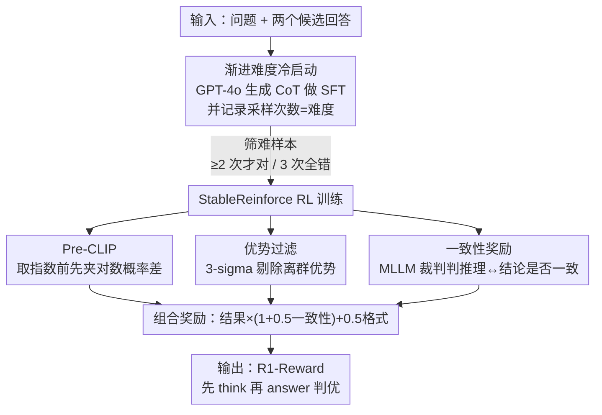

# R1-Reward: Training Multimodal Reward Model Through Stable Reinforcement Learning

**会议**: ICLR 2026  
**OpenReview**: [https://openreview.net/forum?id=4Ewgw9M2xE](https://openreview.net/forum?id=4Ewgw9M2xE)  
**代码**: 待确认  
**领域**: 对齐RLHF / 多模态VLM / 强化学习  
**关键词**: 多模态奖励模型, 强化学习, 训练稳定性, 长思维链, 测试时扩展

## 一句话总结
本文把"判断两个多模态回答谁更好"重新表述成一个规则化 RL 任务，并针对直接套用 Reinforce++ 会训练崩溃的问题提出 StableReinforce 算法（Pre-CLIP + 优势过滤 + 一致性奖励 + 渐进难度冷启动），训练出 7B 的奖励模型 R1-Reward，在三个多模态奖励基准上分别比此前 SOTA 提升约 3.5%/13.5%/14.6%，且能随采样次数增加进一步涨点。

## 研究背景与动机
**领域现状**：多模态奖励模型（MRM）是多模态大模型（MLLM）训练、数据清洗、推理时 best-of-N 选择和自动评测的关键部件。近期 MRM 的进步主要集中在两条线：改模型结构（如先生成 critic 再出标量分）和扩训练数据，做法上仍以判别式/打分头为主。

**现有痛点**：很少有人探讨"长思维链推理能力对奖励建模有没有用、怎么在 MRM 里激活它"。传统奖励头只输出一个标量，缺乏可解释的推理过程；而 RL 已经在视觉任务、多模态推理、视频理解等领域证明能诱导出长程推理并带来更好的泛化，奖励建模却几乎没被这样训练过。

**核心矛盾**：把奖励建模直接改造成规则化 RL（输入问题+两个回答，策略判断哪个更好，判断对了给奖励）听起来很自然，但作者实测发现**直接用 Reinforce++/PPO 这类算法训练奖励模型极易崩溃**，根因有三：(1) PPO 靠对 ratio 做 clip 维稳，但当优势为负且当前策略与参考策略偏离很大时，clip 拦不住，`exp(log_probs - old_log_probs)` 会数值溢出、loss 爆炸；(2) 奖励标签只有 1/2 两类、极易学会，训练后期一个 batch 里奖励几乎全是 1（如 256 个里 255 个为 1），此时按均值方差做优势归一化（z-normalization）会把那个唯一的 0 奖励样本的优势放大到 -15.96 这种极端值，造成剧烈震荡；(3) 只对结果打分、不监督推理过程，模型会学到"推理里说 response 2 更好、最终却输出 1"的推理-结论不一致，甚至把推理退化成无关噪声。

**本文目标**：让 MRM 既能做长程推理、又能稳定地用 RL 训练，把上述三个崩溃来源逐一堵住。

**核心 idea**：在 Reinforce++ 基础上动三处刀——**在取指数前先 clip 对数概率差（Pre-CLIP）**消除溢出、**用 3-sigma 规则过滤离群优势**消除归一化爆值、**引入一个 MLLM 裁判给出一致性奖励**逼推理与结论对齐；再配合"GPT-4o 冷启动 + 按难度筛样本"的渐进式训练策略。

## 方法详解

### 整体框架
R1-Reward 的目标是训练一个会"先分析、再判定"的奖励模型：输入是一个问题和两个候选回答，模型按 `<think>...</think><answer>1/2</answer>` 的格式先输出逐项对比分析，再给出谁更好的结论。整条流水线分两大阶段：先用 GPT-4o 在 20 万条偏好数据上生成思维链作为冷启动 SFT，让基座模型（QwenVL-2.5-7B-Instruct）学会奖励建模的格式与基本能力，同时记录每条样本 GPT-4o 答对所需的采样次数作为"难度"；再挑出难样本（GPT-4o 至少要 2 次才答对、或 3 次都答错）用 StableReinforce 做 RL 强化。StableReinforce 本身相对 Reinforce++ 的三处改造（Pre-CLIP、优势过滤、一致性奖励）就是稳定训练的核心。最终奖励信号由格式奖励、结果奖励、一致性奖励按特定公式组合而成。

### 关键设计

**1. Pre-CLIP：在取指数之前就夹住对数概率差，从源头掐掉数值溢出**

针对 PPO/Reinforce++ "ratio 偏离大时 `exp(log_probs - old_log_probs)` 溢出、且优势为负时 `-min(surr1, surr2)` 产生超大 loss" 的崩溃来源。标准实现是先算 `ratio = (log_probs - old_log_probs).exp()` 再 clip ratio，但溢出发生在 `exp` 这一步、clip 已经来不及。作者的做法是把 clip 提前到指数之前，对对数概率差本身做夹取：

$$\frac{\pi_\theta(a_t|s_t)}{\pi_{\theta_{old}}(a_t|s_t)} \leftarrow \exp\!\left(\mathrm{clip}\!\left(\log\frac{\pi_\theta}{\pi_{\theta_{old}}},\ \log\delta_{min},\ \log\delta_{max}\right)\right)$$

其中 $\delta_{min}=10^{-3}$、$\delta_{max}=10^{3}$ 限定允许的概率比范围。这样无论两次策略差异多大，进入 `exp` 的指数都被钳在 $[\log 10^{-3}, \log 10^{3}]$ 内，不会溢出；尤其在优势为负、当前策略远离参考策略时，能避免 loss 被放大成上万量级。作者强调 $10^3$ 这个阈值对超参不敏感，主要作用是削弱噪声数据对整体训练的冲击。

**2. 优势过滤：用 3-sigma 规则剔除归一化后的离群优势**

针对奖励高度不均衡时 z-normalization 把个别样本优势炸成 ±16 这种极端值的问题。作者对标准化后的优势 $A_{standardized}=\frac{A-\mu_A}{\sigma_A+\epsilon}$ 只保留落在 $[-3, 3]$ 区间（即原分布 3 个标准差以内）的值，区间外的直接置零、不回传梯度：

$$\hat{A} = \begin{cases} A_{standardized} & |A_{standardized}| \le 3 \\ 0 & \text{otherwise} \end{cases}$$

由于 z-normalization 后分布近似标准正态（均值 0、标准差 1），3-sigma 阈值天然对应"3 个标准差以外的极端样本"。在"255 个奖励为 1、1 个为 0"的极端 batch 里，这一步能保证所有奖励为 1 的样本全部保留参与更新，而那个被归一化到 -15.96 的极端负优势样本被滤掉，避免它单独把训练带崩。最终目标函数仍是带 clip 的 surrogate，只是把 $\hat{A}$ 代入：$L_{StableReinforce}(\theta)=\frac{1}{|t|}\sum_t \min\!\big(\frac{\pi_\theta}{\pi_{\theta_{old}}}\hat{A}_t,\ \mathrm{clip}(\frac{\pi_\theta}{\pi_{\theta_{old}}}, 1-\epsilon, 1+\epsilon)\hat{A}_t\big)$。

**3. 一致性奖励：请一个 MLLM 当裁判，逼推理过程和最终结论对齐**

针对"只对结果打分导致推理和答案脱节"的问题。只给格式奖励（必须按 `<think></think><answer></answer>` 输出）和结果奖励（最终选择要和人类标注一致）时，模型会钻空子——推理里得出 response 2 更好却输出 1，因为没人监督推理。作者额外引入 Qwen2.5-VL-7B-Instruct 作为监督裁判，专门判定"模型的推理过程"与"最终答案"是否一致，由此得到一致性奖励。但若把它当独立加项直接相加，会出现"选错答案但因一致性高仍拿到高总奖励"的反向激励。为此最终奖励设计成**乘性门控**：

$$\text{Final Reward} = \text{Result Reward}\times(1+0.5\times\text{Consistency Reward}) + 0.5\times\text{Formatting Reward}$$

一致性奖励以 $(1+0.5\times\cdot)$ 的形式乘在结果奖励上，意味着**只有当结果正确（Result Reward 非零）时一致性才生效**，结果错的样本拿不到一致性红利，从而避免模型为了"自洽"而牺牲正确性。

**4. 渐进难度训练：GPT-4o 冷启动 + 按答对次数筛难样本喂 RL**

针对"MLLM 本身没被训过奖励建模、直接上 RL 又差又不稳"的问题。作者先用 GPT-4o（温度 0、最多 3 次尝试）对 20 万条偏好数据按统一 prompt 生成思维链，构成 R1-Reward-200K 冷启动 SFT 数据，让模型先学会任务格式和基本判别；同时**记录 GPT-4o 在每条样本上答对所需的尝试次数，作为该样本的难度标签**。进入 RL 阶段时，只选"GPT-4o 至少要 2 次才答对、或 3 次都答错"的样本——这些样本两个回答差距小、更难区分，更值得用 RL 去抠。数据上从 MM-RLHF（全量人工标注）、RLAIF-V、VL-Feedback、POVID、WildVision-Battle 等多源采样，打乱使答案 1/2 比例为 1:1，防止模型偏向某个选项。

### 损失函数 / 训练策略
SFT 与 RL 均在 4×H800(80G) 上进行：SFT 训 1 epoch（约 8 小时，学习率 1e-5、batch 256）；RL 用 OpenRLHF 框架训 5 epoch（约 12 小时，训练 batch 128、rollout batch 256、学习率 1e-6、初始 KL 系数 0）。基座为 QwenVL-2.5-7B-Instruct。三类奖励：格式奖励（强制 think/answer 结构）、结果奖励（与人类偏好一致）、一致性奖励（MLLM 裁判判推理↔结论），按上文乘性公式组合。

## 实验关键数据

### 主实验
R1-Reward（7B）在三个多模态奖励基准上全面超越闭源与开源对手，且数据效率显著（200K 训练样本 vs IXC-2.5-Reward 的 100 万+）。

| 基准 | 指标 | R1-Reward | 之前最佳 | 说明 |
|------|------|-----------|----------|------|
| VL Reward-Bench | Overall Acc | 71.92 | 67.20 (Gemini-1.5-Pro) / 65.80 (IXC-2.5-Reward 开源) | 较最佳开源 IXC 约 +9.3% |
| VL Reward-Bench | Macro Acc | 71.44 | 70.00 (IXC-2.5-Reward) | — |
| Multimodal Reward Bench | Overall | 82.2 | 70.8 (GPT-4o) / 67.1 (MM-RLHF-Reward) | 较此前 SOTA +14.3% |

在 VL Reward-Bench 的幻觉维度，R1-Reward 达 85.71（Voting@15 进一步到 89.06），远高于 IXC-2.5-Reward 的 62.50；Multimodal Reward Bench 的 Math 维度高达 99.6。

### 测试时扩展 / 训练稳定性

| 配置 | VL Reward-Bench Overall | Multimodal Reward Bench Overall |
|------|------|------|
| R1-Reward（单次） | 71.92 | 82.2 |
| Voting@15（多次采样多数投票） | 76.46 | 83.3 |

训练稳定性方面（Figure 2）：Reinforce++ 在约第 150 步崩溃（policy loss 飙升），StableReinforce 全程平稳收敛，且持续做长度压缩——RL 后平均回复长度比基座缩短约 15%，说明推理 token 效率提升。

### 关键发现
- **RL 范式本身是涨点主力**：在同样 200K 数据下，传统标量奖励头表现很差，MM-RLHF（先 critic 再打分）次之，而 RL 方法显著领先；作者把"允许直接对比两个回答"而非各自独立打分视为优势来源。
- **三个组件缺一不可**：附录消融显示去掉优势过滤、Pre-CLIP 或一致性奖励任一个都会掉点甚至训练崩溃。
- **推理质量获人类认可**：人工评测中 72.5% 的情况下标注者更偏好 R1-Reward 的推理过程。
- **对标注质量鲁棒**：即便用较弱的 Qwen2.5-VL-7B 代替 GPT-4o 构造数据，性能仍然强劲。
- **下游可迁移**：用 R1-Reward 训练更小的 MLLM，在多个基准上一致提升。
- **短板**：在 MM-RLHF Reward Bench 上相对此前 SOTA 仅有小幅提升。

## 亮点与洞察
- **把"clip 提前到取指数之前"是个极简却关键的工程洞察**：溢出本质发生在 `exp` 那一步，传统先 exp 再 clip 的顺序天然失效，调换顺序就根治了 loss 爆炸——可直接迁移到任何用 ratio 的 policy gradient 方法。
- **乘性门控的奖励组合很巧**：用 $(1+0.5\times\text{一致性})$ 乘在结果奖励上，自动实现"结果对才奖励一致性"，避免独立加项带来的反向激励，比单纯加权更符合"先对、再自洽"的优先级。
- **用采样次数当难度标签**是几乎零成本的课程学习信号：冷启动时顺手记录 GPT-4o 答对所需次数，就得到了天然的样本难度排序，用来给 RL 挑硬骨头。
- **奖励建模 = 规则化 RL 推理任务**这一重述，把奖励模型从"打分头"升级成"会推理的判官"，并打通了测试时扩展（多数投票）这条免训练涨点路径。

## 局限与展望
- 作者承认在 MM-RLHF Reward Bench 上提升有限，奖励模型的基础能力仍有待加强。
- 测试时扩展只试了最朴素的多数投票，更高级的搜索/聚合策略可能还有空间。
- 一致性奖励依赖额外的 MLLM 裁判（Qwen2.5-VL-7B）在线评判，带来推理开销；裁判本身的判断误差会注入训练信号，论文未深入分析其上限。
- 仅在 7B 基座、200K 数据规模上验证，更大模型/更大数据下 StableReinforce 各项改造的边际收益尚不清楚。

## 相关工作与启发
- **vs Reinforce++ / GRPO**：它们靠 ratio clip + z-normalization 维稳，本文指出这两点在奖励建模（标签简单、batch 极不均衡）场景下双双失效，于是用 Pre-CLIP 替换 clip 时机、用 3-sigma 优势过滤替换裸归一化，专门补稳定性短板。
- **vs DeepSeek-R1 风格规则化 RL**：同样"只对结果打分诱导长推理"，但本文发现该范式会导致推理-结论脱节，补了一个 MLLM 裁判的一致性奖励来约束推理过程。
- **vs MM-RLHF-Reward / IXC-2.5-Reward**：前者先生成 critic 再出标量分、后者用百万级数据，本文用生成式"先 think 再 answer"的 RL 范式，在 200K 数据下反超，凸显数据效率。
- **vs 传统判别式奖励头**：把 sigmoid 偏好损失训练的标量头换成会逐项对比、可解释的生成式判官，并天然支持多数投票做测试时扩展。

## 评分
- 新颖性: ⭐⭐⭐⭐ 把奖励建模重述为规则化 RL 并系统性诊断+修复三处崩溃来源，组合扎实但单点改造（提前 clip、3-sigma）较直接。
- 实验充分度: ⭐⭐⭐⭐ 三基准全面对比 + 消融 + 人评 + 下游迁移 + 标注鲁棒性，覆盖到位（部分细节在附录）。
- 写作质量: ⭐⭐⭐⭐ 问题诊断（含数值例子和伪代码）清晰，动机到方法的推导链条完整。
- 价值: ⭐⭐⭐⭐ 给"用 RL 训多模态奖励模型"提供了可复现的稳定配方与开源数据，工程价值高。

<!-- RELATED:START -->

## 相关论文

- [\[ICLR 2026\] RM-R1: Reward Modeling as Reasoning](rm-r1_reward_modeling_as_reasoning.md)
- [\[CVPR 2026\] MSRL: Scaling Generative Multimodal Reward Modeling via Multi-Stage Reinforcement Learning](../../CVPR2026/reinforcement_learning/msrl_scaling_generative_multimodal_reward_modeling.md)
- [\[ICLR 2026\] Exploration vs Exploitation: Rethinking RLVR through Clipping, Entropy, and Spurious Reward](exploration_vs_exploitation_rethinking_rlvr_through_clipping_entropy_and_spuriou.md)
- [\[ICLR 2026\] UME-R1: Exploring Reasoning-Driven Generative Multimodal Embeddings](ume-r1_exploring_reasoning-driven_generative_multimodal_embeddings.md)
- [\[ICLR 2026\] A Reward-Free Viewpoint on Multi-Objective Reinforcement Learning](a_reward-free_viewpoint_on_multi-objective_reinforcement_learning.md)

<!-- RELATED:END -->
