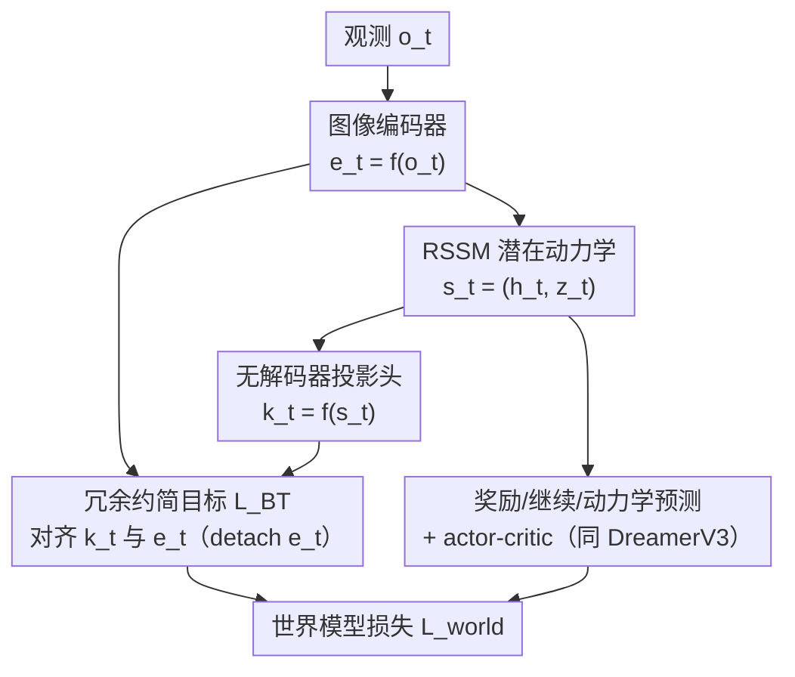

# R2-Dreamer: Redundancy-Reduced World Models without Decoders or Augmentation

**会议**: ICLR 2026  
**OpenReview**: [https://openreview.net/forum?id=Je2QqXrcQq](https://openreview.net/forum?id=Je2QqXrcQq)  
**代码**: https://github.com/NM512/r2dreamer  
**领域**: 强化学习 / 世界模型 / 自监督表示学习  
**关键词**: 基于模型的强化学习, 世界模型, 无解码器, 冗余约简, Barlow Twins

## 一句话总结
R2-Dreamer 在 DreamerV3 框架上把"重建解码器"换成一个受 Barlow Twins 启发的冗余约简自监督目标，既不用解码器也不用数据增强就能防止表示坍缩，在 DMC、Meta-World 上与 DreamerV3/TD-MPC2 持平、训练快 1.59×，并在小目标的 DMC-Subtle 上大幅领先。

## 研究背景与动机

**领域现状**：基于图像的基于模型强化学习（MBRL）核心是学一个能从高维像素中提炼"任务必需信息"的潜在表示。以 Dreamer 系列为代表的主流做法用 RSSM（循环状态空间模型）建模动力学，并通过**像素级重建**潜在状态来学表示——即从潜在状态 $s_t$ 解码出图像 $\hat o_t$，用重建损失 $L_{recon}$ 驱动编码器。

**现有痛点**：重建目标有个致命问题——学习信号被画面里**空间上很大但与任务无关**的区域（如背景）主导。模型被迫去精雕细琢这些背景细节，把表示容量和算力浪费在它们身上，反而忽略了小而关键的物体（比如一个很小的目标点）。另一条路是"无解码器"方法，它们用对比/预测等自监督损失替代重建，但为了防止表示坍缩到平凡解，**严重依赖数据增强（DA）作为外部正则**。

**核心矛盾**：DA 这个外部正则本身是把双刃剑，而且是任务相关的——随机平移可能直接把小物体裁掉，色彩抖动在颜色本身是关键特征时反而有害。也就是说，无解码器方法用 DA 换来了稳定，却牺牲了通用性，换了个任务就得重调增强策略。

**本文目标**：在不引入解码器、也不引入 DA 的前提下，给 RSSM 找一个能稳定防坍缩的表示学习目标，同时保持与强基线相当的性能。

**切入角度**：作者从信息论的"冗余约简"原则出发——既然不能靠 DA 造正样本对，那就用模型**内部自然存在的两路信号**（图像编码 $e_t$ 与潜在状态的投影 $k_t$）构成一对视图，让它们的互相关矩阵对角线对齐、非对角线去冗余。这是一个**内部正则**，不依赖任何外部增强。

**核心 idea**：把 DreamerV3 里的重建损失 $L_{recon}$ 直接替换成一个 Barlow-Twins 式的冗余约简损失 $L_{BT}$，其余组件（RSSM、actor-critic、KL 平衡）原封不动，从而干净地隔离出"表示学习目标"这一单一变量的贡献。

## 方法详解

### 整体框架
R2-Dreamer 要解决的是"如何在不重建像素、不做数据增强的情况下学到聚焦任务的潜在表示"。它的做法是把 DreamerV3 的世界模型几乎照搬，只动一处：**砍掉图像解码器，换上一个轻量线性投影头**，并把重建损失替换为冗余约简损失 $L_{BT}$。

具体流程：观测 $o_t$ 经图像编码器得到嵌入 $e_t$；RSSM 用序列模型 $h_t = f_\phi(s_{t-1}, a_{t-1})$ 维护确定性状态，再由表示模型 $z_t \sim q_\phi(z_t|h_t, e_t)$ 得到随机状态，二者合成潜在状态 $s_t = (h_t, z_t)$，作为智能体的"记忆"。DreamerV3 原本要从 $s_t$ 解码回 $\hat o_t$ 算重建损失，而 R2-Dreamer 改成用投影头 $k_t = f_\phi(s_t)$ 把潜在状态映到图像嵌入的特征空间，然后在 $k_t$ 与 $e_t$ 之间施加 $L_{BT}$。奖励/继续预测、动力学/表示的 KL 项与 actor-critic 全部和 DreamerV3 一致——潜在状态照常用来预测奖励 $\hat r_t$、继续标志 $\hat c_t$，并在想象 rollout 中训练 actor 和 critic。

### 关键设计

**1. 冗余约简目标替代重建：用 Barlow Twins 当内部正则**

这一设计直击重建目标"容量被背景吃掉"的痛点。作者借用 Barlow Twins 的损失形式作为表示学习信号：

$$L_{BT} = \sum_i (1 - C_{ii})^2 + \alpha \sum_{i \neq j} C_{ij}^2$$

其中 $C$ 是在一个 mini-batch（共 $B \times T$ 个样本）上、对投影输出 $k_t$ 与图像嵌入 $e_t$ 沿 batch 维标准化后计算出来的互相关矩阵；$i, j$ 是特征维度索引。第一项（不变性项）逼对角线 $C_{ii}$ 趋近 1，让两路视图在每个特征维上相关；第二项（冗余项）压非对角线 $C_{ij}$ 趋近 0，去掉特征间冗余。整个损失只由一个超参 $\alpha$ 控制冗余项权重。

它之所以有效，在于**不再靠"还原像素"来学表示，而是靠"两路内部信号的统计对齐"**——背景这种大面积无关区域不会因为"占像素多"就主导信号，模型反而被引导去学紧凑、去冗余、对任务相关信息敏感的表示。相比对比学习（如 InfoNCE）或 VICReg，Barlow Twins 实现最简、超参最少，调参成本低，因此被选中。

**2. 内部信号成对替代数据增强：编码嵌入 vs 投影潜状态**

无解码器方法防坍缩通常要靠 DA 造正样本对，而这正是通用性瓶颈。R2-Dreamer 的关键观察是：**模型内部本就有两路天然的"视图"可以配对**——图像编码器的输出 $e_t$ 和把潜在状态投影回嵌入空间的 $k_t$。它们描述的是同一时刻的同一观测，但来自不同的计算路径，因此构成一对无需人工增强的正样本对。

把冗余约简施加在这对内部信号上，就得到一个**完全替代 DA 的内部正则**。这样既绕开了"随机平移裁掉小目标""色彩抖动破坏关键颜色"这类增强副作用，又保住了防坍缩的能力。实现上还有一个稳定性细节：对目标 $e_t$ 做 detach（停止梯度，类似 TD-MPC2 的做法），但编码器仍能通过投影头和 RSSM 反传得到丰富梯度，再加上奖励、继续、动力学、价值这些任务相关监督，整体训练稳定。

**3. 最小侵入式改造：只换损失、其余冻结，隔离变量**

为了让"性能变化只归因于表示目标"，作者刻意把改动压到最小。世界模型损失从 DreamerV3 的

$$L_{DreamerV3} = \mathbb{E}_{q_\phi}\Big[\sum_t L_{recon}(t) + L_{pred}(t) + \beta_{dyn} L_{dyn}(t) + \beta_{rep} L_{rep}(t)\Big]$$

改为

$$L_{world} = \mathbb{E}_{q_\phi}\Big[\beta_{BT} L_{BT} + \sum_t L_{pred}(t) + \beta_{dyn} L_{dyn}(t) + \beta_{rep} L_{rep}(t)\Big]$$

只把 $L_{recon}$ 这一项换成 $\beta_{BT} L_{BT}$，KL 平衡方案、自由比特（free bits）、系数 $\beta_{dyn}=1, \beta_{rep}=0.1$ 等全部沿用 DreamerV3，actor-critic（critic 学 $\lambda$-return 分布、actor 用 REINFORCE + 熵正则 + 鲁棒回报归一化）也原样保留。这种"单点替换"的设计让消融结论非常干净：任何提升都能直接归因到新表示目标，而非框架其他部分的改动。作者还在附录中给出理论动机——该目标是一个扩展的"序列信息瓶颈"目标的可处理替代。

### 损失函数 / 训练策略
世界模型用 $L_{world}$（含 $\beta_{BT} L_{BT}$ + 预测损失 + 两个 KL 项）训练；critic 在想象 rollout 和回放轨迹上最大化 $\lambda$-return 的对数似然，actor 仅在想象轨迹上用 REINFORCE 估计、配合熵正则（固定尺度 $\eta$）和基于 5–95 分位区间 EMA 的鲁棒回报归一化 $S$。所有实验用统一超参、5 个随机种子、每种子 10 个评估 episode。

## 实验关键数据

### 主实验
在 DMC（20 个任务）、Meta-World MT1（50 个机械臂操作任务）等标准基准上，R2-Dreamer 与解码器型（DreamerV3）、无解码器型（DreamerPro、TD-MPC2）、无模型型（DrQ-v2）基线**平均持平**；而在新提出的 DMC-Subtle 上**大幅领先**。

| 基准 | 对比对象 | R2-Dreamer 表现 |
|------|---------|----------------|
| DMC（20 任务） | DreamerV3 / TD-MPC2 / DrQ-v2 / DreamerPro | 平均 mean/median 持平，无需解码器和 DA |
| Meta-World（50 任务） | 同上 | 平均成功率持平，含小物体接触式操作 |
| DMC-Subtle（5 任务，小目标） | 同上 | 显著超出所有基线 |

| 方法 | DMC Walker Walk 训练时间（小时，1M 步） | 相对加速 |
|------|------|------|
| **R2-Dreamer** | 4.4 | — |
| Dreamer（本文 PyTorch 复现） | 7.0 | 1.59× |
| DreamerPro | 10.4 | 2.36× |
| DreamerV3（官方 JAX，高度优化） | 6.6 | — |

### 消融实验
在 20 个 DMC 任务上对比 6 个变体，核心是"冗余约简 vs 数据增强"之争：

| 配置 | 关键现象 | 说明 |
|------|---------|------|
| R2-Dreamer（完整） | 基准性能 | 内部冗余约简正则 |
| R2-Dreamer + DA | 仅边际提升 | 加 DA 几乎没好处，说明内部正则已足够 |
| R2-Dreamer（半 batch，B=8） | 无显著下降 | 与 Barlow Twins 的 batch 鲁棒性一致 |
| DreamerPro | 正常 | 依赖 DA 的基线 |
| DreamerPro（去 DA） | 性能坍缩 | 退化到接近"无解码器无监督" |
| Dreamer（去重建损失） | 最差 | 无任何视觉表示目标 |

在精度要求高的 DMC-Subtle 上，给 R2-Dreamer **加 DA 反而显著掉点**，印证 DA 会破坏小而关键的视觉信息。

### 关键发现
- **DA 不是必需品，内部正则就够**：给 R2-Dreamer 额外加 DA 只有边际收益，而 DreamerPro 去掉 DA 直接坍缩——证明冗余约简能独立承担防坍缩职责。
- **DA 在精细任务上有害**：DMC-Subtle 上加 DA 反而降低性能，说明外部增强可能扭曲任务关键信息，无 DA 的内部机制更鲁棒。
- **表示更聚焦**：基于遮挡的显著性图显示，R2-Dreamer 的注意力锐利地集中在目标上，而基线显著性更弥散，定性印证它学到了紧凑且相关的表示。
- **batch 鲁棒**：半 batch（B=8 vs 16）不显著掉点，缓解了 SSL 目标对相关性估计的 batch 敏感担忧。

## 亮点与洞察
- **"内部信号成对"这一招很巧**：不造人工视图，而是直接拿编码嵌入 $e_t$ 和投影潜状态 $k_t$ 当一对正样本，等于把"防坍缩"从外部增强搬进了模型内部，天然规避增强副作用。
- **单点替换的实验干净度**：只换一项损失、冻结其余，让"性能归因"无可争议——这是评估表示目标贡献的范本做法。
- **DMC-Subtle 这个 benchmark 本身有价值**：把任务关键物体缩小，专门暴露"重建被背景主导"和"DA 裁掉小目标"两类弊病，是个有针对性的压力测试，可复用于其他表示学习研究。
- **可迁移性**：冗余约简作为内部正则可以"轻松接入现有框架"，这套"用信息论原则替代 DA"的思路，对其他依赖增强的自监督 RL 方法都有借鉴意义。

## 局限与展望
- 作者承认尚未在**动态无关背景**（如 Distracting Control Suite）下验证，仅假设内部冗余约简也能抗动态干扰，但未实证。
- 未扩展到 **Humanoid 等高维任务**，可扩展性是明确的未来方向。
- 自己观察：方法本质是"换损失"，对 RSSM 架构本身的依赖较强；冗余约简超参 $\alpha$、$\beta_{BT}$ 的跨任务通用性虽用统一超参验证，但极端视觉分布下是否仍稳定未充分探究。
- detach 目标 $e_t$ 是经验性稳定 trick，其与"完整双向梯度"相比的理论代价没有深入分析。

## 相关工作与启发
- **vs DreamerV3（解码器型）**：DreamerV3 靠重建潜在状态学表示，容量被背景吃掉且要付像素生成的算力；R2-Dreamer 砍掉解码器、换冗余约简，训练快 1.59×，小目标任务更强，但在常规任务上是"持平"而非全面超越。
- **vs DreamerPro（无解码器但依赖 DA）**：DreamerPro 用 SwAV 空间损失 + EMA 时间损失，需要对增强视图做一致性约束；R2-Dreamer 用模型内部成对信号替代增强，去掉 DA 后仍稳定，而 DreamerPro 去 DA 即坍缩。
- **vs TD-MPC2**：同为无解码器、用 DA 当外部正则的基线，R2-Dreamer 借鉴了它 detach 目标的稳定策略，但用冗余约简彻底摆脱 DA。
- **vs Dreamer-InfoNCE**：对比学习在无 DA 时性能受限；R2-Dreamer 用 Barlow Twins 式非对比目标，实现更简、超参更少、对 batch 更鲁棒。

## 评分
- 新颖性: ⭐⭐⭐⭐ 把冗余约简从 CV 迁到 RSSM 表示学习、用内部信号替代 DA，角度清晰且有理论支撑。
- 实验充分度: ⭐⭐⭐⭐ 三大基准 + 6 变体消融 + 显著性可视化 + 效率对比，并自建 DMC-Subtle 压力测试。
- 写作质量: ⭐⭐⭐⭐ 动机—矛盾—方法链条干净，单点替换的实验设计表述清楚。
- 价值: ⭐⭐⭐⭐ "去 DA 的内部正则"为无解码器 MBRL 提供了通用、高效的新基线，工程意义明确。

<!-- RELATED:START -->

## 相关论文

- [\[ICLR 2026\] From Observations to Events: Event-Aware World Models for Reinforcement Learning](from_observations_to_events_event-aware_world_models_for_reinforcement_learning.md)
- [\[ICLR 2026\] Learning Massively Multitask World Models for Continuous Control](learning_massively_multitask_world_models_for_continuous_control.md)
- [\[ICLR 2026\] Learning to Be Uncertain: Pre-training World Models with Horizon-Calibrated Uncertainty](learning_to_be_uncertain_pre-training_world_models_with_horizon-calibrated_uncer.md)
- [\[ICLR 2026\] Context and Diversity Matter: The Emergence of In-Context Learning in World Models](context_and_diversity_matter_the_emergence_of_in-context_learning_in_world_model.md)
- [\[ICLR 2026\] Mixture-of-World Models: Scaling Multi-Task Reinforcement Learning with Modular Latent Dynamics](mixture-of-world_models_scaling_multi-task_reinforcement_learning_with_modular_l.md)

<!-- RELATED:END -->
