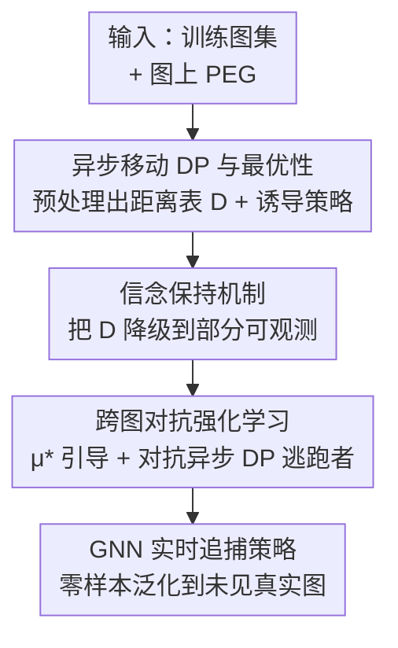

# R2PS: Worst-Case Robust Real-Time Pursuit Strategies under Partial Observability

**会议**: ICLR 2026  
**OpenReview**: [https://openreview.net/forum?id=zqA7Q9Q21L](https://openreview.net/forum?id=zqA7Q9Q21L)  
**代码**: https://github.com/Cahemgco/EPG_code  
**领域**: 强化学习 / 博弈论 / 追逃博弈  
**关键词**: 追逃博弈, 部分可观测, 信念保持, 跨图泛化, 最坏情况鲁棒

## 一句话总结
本文针对图上的追逃博弈（PEG），把一套动态规划求出的最优追捕策略扩展到「逃跑者会预判追捕者动作（异步移动）+ 追捕者只能局部观测」这一最难场景，再用信念保持机制 + 跨图对抗强化学习训出一个 GNN 追捕策略，做到对未见过的真实城市地图实时（亚秒级）零样本泛化，且最坏情况下成功率显著超过直接在测试图上训练的 PSRO 基线。

## 研究背景与动机
**领域现状**：追逃博弈（pursuit-evasion game, PEG）是机器人和安防领域的经典问题——一队警察抓小偷、一队守卫拦截入侵者，都可以抽象成图上的追逃：把城市街道建成图 $G=\langle V,E\rangle$，每个智能体每个离散时刻沿一条边移动到相邻顶点或原地不动。求解这类博弈的最坏情况鲁棒策略是核心目标。

**现有痛点**：精确求解图上 PEG 在计算上极其昂贵，而且图结构稍有变化（比如城市某条路因堵车被临时删掉/恢复），最坏情况策略就得整个重算，耗时巨大，根本没法实时部署。基于数学规划的传统方法（线性/混合整数规划）就卡在这里。强化学习虽然能训出泛化策略，但现有的 MT-PSRO、Grasper 只能对未见对手策略和初始条件做少样本泛化，难以适应图结构的快速变化；最新的 EPG（Equilibrium Policy Generalization）首次在「图」这一层面做零样本泛化，但只验证了**完全信息**场景。

**核心矛盾**：现实安防场景有两个被忽略的硬约束。其一，追捕者往往**只有局部观测**——入侵者一旦离开传感器范围就「失联」，加上部分可观测会让问题升到 PSPACE-hard；其二，最坏情况下的逃跑者可能**比追捕者观测能力更强**，甚至能预判追捕者的动作再决定自己怎么走（异步移动）。现有工作要么假设双方完全信息、要么假设同步移动，导致学到的策略在真实安防里「强得不可信」。

**本文目标**：在「逃跑者可预判 + 追捕者部分可观测」的最坏设定下，找到既最坏情况鲁棒、又能实时运行的追捕策略（R2PS）。

**切入角度**：作者发现，一套用于 Markov PEG 的动态规划（DP）算法算出的「距离表」$D$ 蕴含了最坏情况追捕步数的最优结构。如果能证明这个 $D$ 在异步移动下仍然最优，再设法把它「投影」到部分可观测设定，就能复用这份最优信息，而不必从零求解 POSG（其决策点数量随时域指数爆炸）。

**核心 idea**：用「DP 距离表 + 信念保持」把完全信息下的最优追捕策略迁移到部分可观测，再把它作为引导信号嵌进跨图强化学习，训出一个实时、可零样本泛化的 GNN 追捕策略。

## 方法详解

### 整体框架
方法分四步串起来：先在每张训练图上跑 DP 算法预处理出距离表 $D$ 与诱导的最优追/逃策略；然后从理论上把 $D$ 扩展到逃跑者异步移动的设定，证明它仍严格最优；接着用信念保持机制把这套完全信息策略「降级」成只依赖局部观测历史的追捕策略；最后把降级后的策略当作引导信号，嵌进 EPG 的跨图对抗强化学习框架，用一个 GNN 表示的策略对抗「最强的异步移动 DP 逃跑者」训练，得到能实时推理、对未见真实图零样本泛化的追捕策略。

### 关键设计

**1. 异步移动下的 DP 最优性：让距离表 $D$ 在最强逃跑者前依然成立**

追逃博弈最棘手的「最坏逃跑者」会预判追捕者这一步往哪走，再决定自己怎么躲——这就是异步移动。本文先复用一个为 Markov PEG 设计的 DP 算法（Algorithm 1）：它从所有「已抓住」的终止状态出发（$f(s_p,s_e)=1$ 时 $D=0$），用一个队列反向广度优先地填距离表 $D$，$D(s)$ 表示从全局状态 $s=(s_p,s_e)$ 出发、追捕方在最坏情况下抓到逃跑者所需的时间步。同步移动下，追/逃双方分别取
$$\mu^*(s_p,s_e)=\arg\min_{n_p}\Big(\max_{n_e} D(n_p,n_e)\Big),\quad \nu^*(s_p,s_e)=\arg\max_{n_e}\Big(\min_{n_p} D(n_p,n_e)\Big)$$
构成 Nash 均衡。本文的关键贡献是把它推广到异步：当逃跑者已知追捕者选择移动到 $n_p$ 时，其策略简化为 $\nu^*(s_p,s_e,n_p)=\arg\max_{n_e} D(n_p,n_e)$，少了一层内层枚举。借助 Lemma 1 揭示的 $D$ 的 minimax 本质（$D(n_p,n_e)=\min_{s_p}\max_{s_e}D(s_p,s_e)+1$），作者证明（Theorem 2/3）：从任意 $D(s)=d<\infty$ 的状态出发，$\mu^*$ 保证 $d$ 步内必抓住，$\nu^*$ 保证 $d$ 步内不被抓；若 $D(s)=\infty$，逃跑者永远抓不住。这说明同一份 $D$ 在更强的异步逃跑者面前依然给出严格最优策略，为后续复用打下地基。

**2. 信念保持机制：用一个会衰减的概率分布替代庞大的观测历史**

部分可观测的难点在于：逃跑者离开追捕者传感器范围（观测范围设为 2，即距离小于 3 才能看到）后就「失联」，若严格记录所有观测历史，决策点数量随时域指数爆炸。本文用两层抽象绕开这一点。第一层是「可能位置集合」$Pos$：初始化为逃跑者初始位置 $\{s_e\}$，之后每步按观测更新——若被某追捕者看到则塌缩回 $\{s_e\}$，否则取上一时刻可能位置的所有一步邻居再剔除当前被观测到却没人的位置：$Pos_{new}=\text{Remove}(\text{Neighbor}(Pos_{old}))$。基于 $Pos$ 可构造一个保守 minimax 策略 $\mu(s_p,Pos)=\arg\min_{n_p}\max_{n_e\in\text{Neighbor}(Pos)}D(n_p,n_e)$，但它把 $Pos$ 里所有位置一视同仁，当 $Pos$ 很大时内层 max 会被极端值拉爆，导致追捕者「悲观」地停在某些「休息点」不动。

为此作者加了第二层——「信念」$belief$：一个对 $Pos$ 内各位置赋权的概率分布，用加权平均代替最坏 max，
$$\mu(s_p,belief)=\arg\min_{n_p}\frac{\sum_{s_e} belief(s_e)\max_{n_e} D(n_p,n_e)}{\sum_{s_e} belief(s_e)}$$
信念按 $belief_{new}(s_e)=\sum_{n_e}\nu(n_e,s_e)\,belief_{old}(n_e)$（$s_e\in Pos$，否则为 0）传播，因无法获知真实逃跑策略，$\nu$ 默认取邻居上的均匀分布。Proposition 1 保证：当 $Pos$ 始终是单点（观测无限）时，两个降级策略都退化回完全信息下的 $\mu^*$，即「不丢最优性」。维护 $Pos$ 与 $belief$ 每步只需 $\tilde{O}(|V|)$，因真实图平均度数小而实际很快。

**3. 跨图对抗强化学习：以最优策略为引导、以最强逃跑者为对手训出泛化 GNN**

DP 策略虽最优，但其时间复杂度随智能体数指数增长（重算一次 $\tilde{O}(n^{m+1})$，$n=1000,m=2$ 时每步要跑 2 分多钟），图一变就得重算，没法实时。本文借 EPG 思路：把各训练图预处理出的 $D$ 表和诱导策略 $(\mu_i^*,\nu_i^*)$ 组成训练集，每轮采样一张图 $G_i$，用 $\mu_i^*$ 当**参考策略**引导训练、用异步 DP 逃跑者 $\nu_i^*$ 当**对手**，训一个跨图共享的 GNN 追捕策略 $\pi_\theta$。策略损失在骨干 RL 损失上加一项对参考动作 $a^*=\mu^*(s)$ 的 KL 引导：
$$L(\theta\mid s)=J_\pi(\theta\mid s)+\beta D_{KL}(\mu^*(s),\pi(s))=J_\pi(\theta\mid s)-\beta\log\pi_\theta(s,a^*)$$
部分可观测训练时，把输入换成 $(s_p,Pos,belief)$、把 $\mu^*$ 换成降级策略 $\mu(s_p,Pos)$ 或 $\mu(s_p,belief)$。这里的逻辑是：在单图上对抗最优逃跑者的强化学习会排除「传递性更弱」的策略，而 $\mu^*$ 引导避免收敛到对均衡无效的平凡解；跨图训练相当于在不同图结构下求「剩余策略的公共部分」并抽象成高层策略，从而逼近一个对未见图也最坏情况鲁棒的通才追捕者。

### 损失函数 / 训练策略
骨干 RL 用 SAC（自适应熵正则 + double Q-learning 防高估），多智能体采用参数共享的去中心化架构。GNN 用多头自注意力配邻接矩阵掩码编码图状态，解码器接指针网络（pointer network）输出图上动作。引导权重 $\beta=0.1$（$\beta=0$ 为纯 RL 对照）。整体推理时间复杂度 $O(n^2m)$（GNN 查询 $O(n^2m)$ + 状态特征 $O(n^2m)$ + 信念维护 $\tilde{O}(n)$），相比 DP 重算的 $\tilde{O}(n^{m+1})$ 大幅降低：$n=1000,m=2$ 时 RL 推理 <1 秒、GPU 下 <0.01 秒。

## 实验关键数据

设定：2 个追捕者（$m=2$）对 1 个逃跑者（planar 图上 3 个完全信息追捕者必能抓住，故 2 个是有挑战的设定），观测范围 2，逃跑者用可证明最优的全局观测异步 DP 逃跑者。测试图含 Grid Map、Scotland-Yard Map、Downtown Map 及 7 个真实地标（时代广场、埃菲尔铁塔、外滩等）。

### 主实验

扩展 DP 追捕者成功率（500 次平均，对最优异步 DP 逃跑者）：

| 图 | 最短路径 | DP$_{Pos}$ | DP$_{belief}$ |
|------|------|------|------|
| Grid Map | 0.00 | 0.59 | **0.78** |
| Downtown Map | 0.02 | 0.73 | **0.90** |
| Eiffel Tower | 0.29 | 0.69 | **0.94** |
| Sydney Opera House | 0.05 | 0.47 | **0.87** |
| Hollywood Walk of Fame | 0.01 | 0.25 | **0.48** |

最短路径策略几乎抓不住最优逃跑者；即便观测范围仅为 2，扩展 DP 追捕者成功率显著更高，且信念加权 DP$_{belief}$ 一致优于直接 minimax 的 DP$_{Pos}$。

跨图 RL 追捕者 vs PSRO 零样本对比（部分，对不同逃跑者）：

| 图 | DP$_{async}$·Ours | DP$_{async}$·PSRO | BR$_{async}$·Ours |
|------|------|------|------|
| Scotland-Yard Map | **0.76** | 0.00 | 0.73 |
| Times Square | **0.95** | 0.04 | 0.27 |
| Eiffel Tower | **1.00** | 0.52 | 0.55 |
| Sydney Opera House | **0.95** | 0.11 | 0.31 |

PSRO 直接在 10 张测试图上训练，本文 RL 策略全程没见过测试图、纯零样本。面对最强的异步 DP 逃跑者，PSRO 在多数图上崩溃（Scotland-Yard 仅 0.00、Times Square 仅 0.04），本文策略仍稳健；即便面对专门针对本文策略训练的最优响应逃跑者 BR$_{async}$，半数图上成功率仍 >50%。

### 消融实验

| 配置 | 关键现象 | 说明 |
|------|---------|------|
| $\beta=0.1$ vs $\beta=0$ | 引导提升训练效率 | DP 策略引导优于纯 RL |
| DP$_{belief}$ vs DP$_{Pos}$ | belief 一致更高 | 加权平均胜过保守 minimax |
| 信念用真实 $\nu$ vs 均匀 | 成功率提升 | 已知对手信息可即时增强 |
| 信念更新频率 1→2→3 步 | 成功率立即下降 | 每步更新最优 |
| 观测范围 2→5+ | 单调升至 100% | 范围超 5 时 DP$_{belief}$ 全抓住 |

### 关键发现
- **信念加权是性能主力**：把 $Pos$ 内位置的最坏 max 改成 belief 加权平均，避免了 $Pos$ 大时被极端值拉爆、追捕者悲观「停摆」的问题，各图普遍提升 0.1~0.4 成功率。
- **异步逃跑者远强于同步**：因为能预判追捕者决策，PSRO 对 DP$_{async}$ 几乎全军覆没，凸显本文「对最强逃跑者训练」的必要性。
- **实时性优势巨大**：大图（最高 2065 节点）上 RL 推理仅约 0.008~0.01 秒，而 DP 重算需 6~139 秒，差 4 个数量级，且大图成功率仍维持 0.33~0.76。
- **观测能力可迁移**：以最低观测范围 2 训练的 RL 策略，在推理时给更大观测范围会单调变强，说明可直接用于传感更好的场景。

## 亮点与洞察
- **「先证最优、再降级、最后蒸馏进 RL」的三段式很优雅**：先用理论保证 DP 距离表在异步移动下严格最优，再用信念保持把它无损投影到部分可观测（singleton 时退化回最优），最后把它当引导信号喂给跨图 RL——每一步都有「不丢最优性」的保证托底。
- **信念加权替代最坏 max 的小改动**：直觉上 minimax 才「最坏情况鲁棒」，但作者发现纯 minimax 在不确定性大时反而导致悲观停摆，用概率加权软化反而更强，这个反直觉观察可迁移到其他部分可观测博弈/规划任务。
- **把昂贵最优解当 RL 老师**：DP 最优但指数级慢、GNN 快但不一定最优，用前者引导后者训练，等于把「最优但不可实时」的知识蒸馏进「实时」网络，是处理「最优解可离线算但需在线部署」一类问题的通用范式。

## 局限与展望
- 实验固定 $m=2$ 个追捕者对 1 个逃跑者，更多追捕者/多逃跑者的协同场景未验证；DP 预处理复杂度随智能体数指数增长，训练集构建本身会受限。
- 信念更新默认假设逃跑者均匀随机移动（无先验时），与真实逃跑者策略偏差越大、信念越不准；论文也确认已知真实 $\nu$ 能即时提升，但现实中往往拿不到。
- $D(\cdot)$ 在部分可观测下从「精确估计」变成「乐观估计」，乐观性带来的误差边界未给出定量刻画，极端图结构下可能失准。
- 仅在图（街道网）抽象上验证，连续空间、动态障碍、传感噪声等更贴近真实机器人的因素未纳入。

## 相关工作与启发
- **vs EPG (Lu et al., 2025a)**：EPG 首次在图层面做零样本泛化，但只覆盖完全信息同步移动；本文把它扩展到「异步移动 + 部分可观测」最坏设定，并补上信念保持这一关键缺口，是 EPG 的现实化升级。
- **vs Grasper / MT-PSRO**：它们只能对未见对手策略/初始条件做少样本泛化，难适应图结构快速变化；本文做的是图结构层面的零样本泛化。
- **vs PSRO (Lanctot et al., 2017)**：PSRO 是博弈论 double oracle 的 RL 扩展，直接在目标图上训练；本文零样本策略在最坏逃跑者前反超「直接在测试图上训练的 PSRO」，说明跨图抽象出的通才比单图专才更鲁棒。
- **vs POSG 通用建模**：直接按 POSG 记录全部观测历史会导致决策点随时域指数爆炸；本文用 $Pos$+$belief$ 两层抽象把每步维护压到 $\tilde{O}(|V|)$，是「用结构化信念替代历史枚举」的实用范例。

## 评分
- 新颖性: ⭐⭐⭐⭐⭐ 首个在异步移动+部分可观测最坏设定下做实时鲁棒追捕的方法，理论与系统都有原创贡献
- 实验充分度: ⭐⭐⭐⭐ 覆盖多张真实地图、对多种逃跑者、含消融与可扩展性，但固定 2v1、缺连续空间验证
- 写作质量: ⭐⭐⭐⭐ 理论铺陈清晰、定理与机制衔接顺，但符号偏密，对非博弈背景读者门槛较高
- 价值: ⭐⭐⭐⭐⭐ 安防/机器人巡逻有直接落地价值，且「最优解蒸馏进实时 RL」的范式可迁移

<!-- RELATED:START -->

## 相关论文

- [\[ICLR 2026\] Guided Policy Optimization under Partial Observability](guided_policy_optimization_under_partial_observability.md)
- [\[ICLR 2026\] Information-based Value Iteration Networks for Decision Making Under Uncertainty](information-based_value_iteration_networks_for_decision_making_under_uncertainty.md)
- [\[ICLR 2026\] DR-SAC: Distributionally Robust Soft Actor-Critic for Reinforcement Learning under Uncertainty](dr-sac_distributionally_robust_soft_actor-critic_for_reinforcement_learning_unde.md)
- [\[ICLR 2026\] Representation-Based Exploration for Language Models: From Test-Time to Post-Training](representation-based_exploration_for_language_models_from_test-time_to_post-trai.md)
- [\[ICLR 2026\] Safe Continuous-time Multi-Agent Reinforcement Learning via Epigraph Form](safe_continuous-time_multi-agent_reinforcement_learning_via_epigraph_form.md)

<!-- RELATED:END -->
