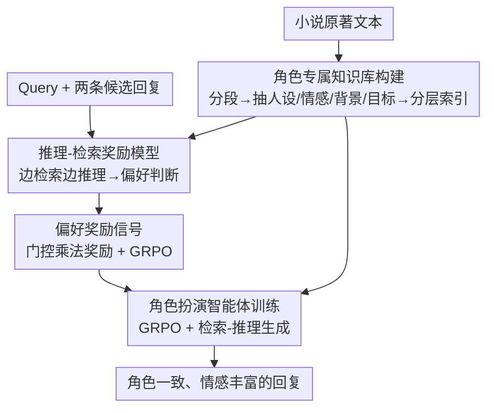

# R4: Nested Reasoning-Retrieval for Reward Modeling in Role-Playing Agents

**会议**: ICLR 2026  
**OpenReview**: [https://openreview.net/forum?id=sWQSbVsPEz](https://openreview.net/forum?id=sWQSbVsPEz)  
**代码**: 待确认  
**领域**: 对齐RLHF / 角色扮演对话 / 强化学习  
**关键词**: 奖励建模, 角色扮演, 推理-检索, GRPO, 偏好优化

## 一句话总结
R4 让"奖励模型"和"角色扮演智能体"同时具备**推理 + 检索**能力——奖励模型把"判好坏"重写成一条带检索的结构化推理链，再用它的偏好信号通过 GRPO 训练对话智能体，使 32B 模型在 CharacterEval 上角色一致性从 55.28 提到 64.64，人类盲评 68.2% 排第一。

## 研究背景与动机
**领域现状**：角色扮演对话要求 LLM 在保持人设、整合背景知识、传达情感三件事上同时做好。主流做法要么靠 RAG 注入角色知识，要么用带标量奖励的 RL（如 Search-R1、ReSearch）去对齐。

**现有痛点**：推理型大模型（DeepSeek-R1、o1）虽然推理强，但生成的对话往往**过于直白、风格寡淡、脱离人设**——它们优化"正确性"，而角色扮演要的是表现力。标准一次性 RAG 又因为查询是静态的，无法随对话上下文动态调整。

**核心矛盾**：真正卡脖子的是**奖励信号本身不可靠**。作者系统分析发现现有奖励模型有两个结构性偏差：（1）**角色偏差（role bias）**——评测一致性强烈依赖角色知名度，主角的人类一致性 0.87、方差 2.1，配角只有 0.61、方差却高达 14.0，因为冷门角色缺乏预训练先验；（2）**参考偏差（reference bias）**——给不给角色背景资料，评分质量差很多（带参考 0.79 vs 不带 0.70，方差 4.1 vs 16.9）。根因是现有奖励模型**孤立地**给单条回复打分，既不做上下文推理也不接角色知识。

**本文目标**：要让奖励模型像人类标注员那样，结合角色背景"想一想再判"，从而给 RL 提供可靠监督；并让对话智能体继承同样的推理-检索能力。

**核心 idea**：奖励模型和智能体**对称地都装上推理 + 检索**——把奖励建模重写成"带检索的结构化推理任务"，再用这套奖励通过 RL 训练出同样会推理会检索的角色扮演智能体。

## 方法详解

### 整体框架
R4（Reward + Role-playing + Reason + Retrieve）是一条三段式管线：先从小说原著**构建角色专属知识库**作为外部记忆；再训练一个**推理-检索奖励模型**，它面对"一个 prompt + 两条候选回复"时不直接打分，而是边检索角色知识边写多步推理，最后给出偏好判断；最后用这个奖励模型的偏好信号，通过 GRPO **训练角色扮演智能体**，让它在生成回复时也走检索-推理流程。奖励模型和智能体共享同一个知识库与检索后端，形成"奖励质量↑→监督↑→智能体推理↑→检索更有效"的互相强化闭环。

### 关键设计

**1. 角色专属知识库构建：给推理一个可检索的外部记忆**

要让奖励模型摆脱"角色偏差"和"参考偏差"，前提是有一份稳定、可检索的角色知识，否则模型只能靠预训练先验对冷门角色瞎猜。R4 用 GPT-4o 把小说原著按情节切成语义连贯的片段，对每段抽取四个维度的角色画像：**人设特质**（性格、行为模式、口头禅）、**情感状态**（显性情绪 + 潜在心理）、**背景知识**（身世、人物关系、领域专长）、**叙事目标**（短期意图 + 长期人物弧光）。这些条目用多重索引键（角色 ID、情感语境、关系动态、叙事情境）组织成分层结构，并做语义聚类以支持多跳检索。此外有**动态扩展机制**：训练过程中收集模型实际发出的检索 query，定位知识盲点，再用 GPT-4o 合成 + 人工标注补全，配合一致性检查与专家抽检保证质量。这份知识库被奖励模型和智能体**共享**，保证全系统的角色 grounding 一致。

**2. 推理-检索奖励模型：把"打分"重写成带检索的结构化推理**

针对孤立打分导致的两个偏差，R4 不再让奖励模型输出一个标量，而是要求它产出一条结构化推理链：用 `<think>` 思考、`<search>...</search>` 发检索 query、`<result>...</result>` 注入检索结果、最后 `<answer>` 里用 `\boxed{}` 给出"哪条更好"。推理时显式覆盖三类维度——对话能力（流畅、连贯、一致）、角色对齐（知识暴露/准确/幻觉、人设忠实度）、表现力（情感真实、吸引力、风格多样）。训练用 GRPO，无需监督推理轨迹，靠**规则化奖励函数**引导，且采用**门控乘法**形式防止"答案错但内部自洽"骗到高分：

$$r_{rm} = r_{ans} + \lambda_{fmt1}\,r_{fmt} + \lambda_{cons}\,(r_{ans}\cdot r_{cons}) - \mu(1-r_{ans})$$

其中 $r_{ans}\in\{0,1\}$ 是偏好预测是否正确，$r_{fmt}\in\{0,1\}$ 是格式合规，$r_{cons}\in[0,1]$ 由一个辅助 verifier 给出的"推理-结论一致性"分数，$\lambda_{fmt1}=\lambda_{cons}=0.1$、答案错时罚 $\mu=0.05$。关键在于一致性项被乘上 $r_{ans}$——**只有答案正确时一致性才加分**，避免奖励黑客。检索结果由外部插入，梯度计算时被 mask 掉，保证 credit assignment 无偏。该奖励模型基于 Qwen2.5-32B-Instruct，在 15K 偏好数据上训 2 epoch，留出集与人类偏好达 87% 一致。

**3. 角色扮演智能体：用奖励模型的偏好信号做 GRPO 共训**

有了可靠奖励，智能体训练就能绕开"人工标注对话对"这种昂贵且难规模化的监督。R4 只需角色档案 + 用户 query，让智能体自由探索回复策略，由奖励模型给偏好反馈。具体把成对奖励转成相对偏好分：对每个 prompt 采 $G$ 条候选 $y_1,\dots,y_G$，第 $i$ 条得分

$$r_{prefer_i} = \frac{1}{G-1}\sum_{j\neq i}\mathbb{I}\big[RM(x,y_i,y_j)=y_i\big]$$

即它在与其他候选两两对比中"胜出"的比例，归一化后作为 GRPO 优势，最终奖励再加格式项 $r_{agent}=r_{prefer}+\lambda_{fmt2}\,r_{fmt}$（$\lambda_{fmt2}=0.1$）。智能体（Qwen2.5-7B/32B-Instruct）访问与奖励模型**同一个知识库**，被显式引导在生成时检索-推理，逐渐学会构造上下文 query、多跳串联人物特质/情感/叙事并做自反思。论文强调奖励与智能体是**刻意协同设计**的：消融显示把现成 CharacterRM 直接换进来只得 46.87，反而比 R4 的消融变体还差——效果来自二者推理-检索流程的互补，而非单个组件更强。

### 损失函数 / 训练策略
两阶段都用 GRPO（公式 2，含 clip 与 KL 约束 $D_{KL}(\pi_\theta\Vert\pi_{\theta_{ref}})$）。奖励模型与智能体共用 multilingual-e5-large 检索器、FlashRAG 建索引，训练/推理每步取 top-3 文档；从 instruction 版而非 base 版初始化以稳定 RL；实现基于 Verl + ReSearch，在 64 张 H100 上训练。

## 实验关键数据

### 主实验
CharacterEval 上 12 项指标（分三类，缩放到 100 分制），R4-32B-Instruct 在角色一致性与吸引力上全面领先：

| 指标类别 | 指标 | R4-32B | 最佳基线 | 提升 |
|--------|------|------|----------|------|
| 角色一致性 | Avg. | 64.64 | 55.28 (BC-NPC-Turbo) | +9.36 |
| 角色一致性 | Persona Behavior | 68.00 | 58.20 | +9.8 |
| 角色一致性 | Knowledge Accuracy | 68.80 | 59.28 | +9.52 |
| 吸引力 | Avg. | 64.93 | 58.93 | +6.00 |
| 吸引力 | Empathy | 69.60 | ~64.20 | +5.40 |
| 对话能力 | Avg. | 78.90 | 75.95 | +2.95 |

即便 7B 版（R4-7B）的吸引力 60.95 也超过所有基线。人类盲评（500 实例、3 标注员）中 R4-32B 有 **68.2% 排第一**（GPT-4o 21.6%、CharacterGLM-6B 10.2%，$p<0.01$），且优势主要来自人设忠实度与叙事连贯——正是方法设计的靶点。

### 消融实验

| 配置 | 角色一致性 | RM 准确率 | 说明 |
|------|---------|---------|------|
| R4 (Full) | 64.64 | 87.0 | 完整模型 |
| w/o Reasoning（全局） | 48.23 | 74.2 | 去掉推理几乎崩溃 |
| RM w/o Reasoning | 49.87 | 76.3 | 奖励模型去推理→塌方 |
| Agent w/o Reasoning | 56.94 | 87.0 | 仅智能体去推理仍较高 |
| RM w/o Retrieval | 58.31 | 82.4 | 去检索掉一截 |
| RM w/o Consistency | 59.83 | 81.3 | 去一致性奖励 RM 准确率下滑 |
| CharacterRM+Agent | 46.87 | 72.9 | 换现成奖励模型反而更差 |

### 关键发现
- **奖励质量是地基，智能体能力是上限**：去掉奖励模型的推理直接塌方（49.87，接近全局去推理 48.23），而只去智能体推理仍保 56.94——说明监督质量从根本上约束了智能体能达到的天花板，二者是**乘法而非加法**关系。
- **组件不能孤立替换**：CharacterRM 直接换进来只得 46.87，比 R4 任何消融变体都差，证明奖励-智能体必须协同设计。
- **规模放大架构优势**：基线从 7B→32B 角色一致性仅 48.80→53.40，R4 却 55.74→64.64，说明推理-检索框架越大越吃香。
- **训练动态**：奖励稳步上升、回复变长但质量不降（是真表现力而非啰嗦）、检索次数先增后稳（学会问更准的 query 而非检索更多）。

## 亮点与洞察
- **门控乘法奖励防黑客**：把一致性项乘上 $r_{ans}$，让"答案错但自洽"拿不到一致性加分——这个小设计直接堵住了"推理花哨但结论错"的奖励黑客通道，可迁移到任何带辅助奖励的 RL。
- **奖励建模 = 结构化推理任务**：把不可微、主观的"角色对话好坏"转成可检索、可验证的推理链，让 87% 人类一致性成为可训练目标，是本文最"啊哈"的视角转换。
- **对称武装**：奖励模型和智能体装同样的推理-检索能力，形成互相强化闭环，这个"评判者与被评判者同构"的思路可迁移到代码、数学等需要可靠 RM 的领域。

## 局限与展望
- 强依赖**高质量角色知识库**，而知识库由 GPT-4o 抽取 + 人工补全，跨域到知识稀缺的原创角色时构建成本与质量都存疑。
- 训练代价高（64×H100、奖励模型 + 智能体两阶段 GRPO），门槛较大。
- 评测集中在 CharacterEval/ChatHaruhi 的中文文学角色，对其他语种、非文学场景（如游戏 NPC 实时交互）的泛化未充分验证。
- 一致性奖励依赖一个辅助 verifier，其本身的可靠性与偏差未深入分析；横向比较中不同基线难度/检索预算不完全可比，单看绝对分数需谨慎。

## 相关工作与启发
- **vs 标量/生成式奖励模型（ScalarRM / GenRM）**：它们孤立打分、无可解释推理也不接外部知识，在主观角色域一致性差；R4 把打分变成带检索的结构化推理，消融里 ScalarRM+Agent 仅 43.89、GenRM+Agent 45.34，远低于 R4 的 64.64。
- **vs 检索式 RL（Search-R1 / ReSearch）**：它们把检索融进 RL 但只为事实 grounding，缺人设对齐与情感真实；R4 在奖励侧也注入检索-推理，专门覆盖角色扮演的多维标准。
- **vs 专用角色模型（CharacterGLM / BC-NPC-Turbo）**：靠监督对话数据训练，吸引力尚可但角色一致性弱（55.28）；R4 用 RL + 推理奖励绕开人工对话标注，一致性更高。

## 评分
- 新颖性: ⭐⭐⭐⭐⭐ 把奖励建模重写为带检索的结构化推理，并对称武装奖励模型与智能体，视角清新
- 实验充分度: ⭐⭐⭐⭐⭐ 12 指标主表 + 细粒度消融 + 人类盲评 + 训练动态，结论扎实
- 写作质量: ⭐⭐⭐⭐ 偏差分析与消融讲得清楚，部分公式细节需对照附录
- 价值: ⭐⭐⭐⭐ 为主观对话域提供可靠 RM 的范式，可迁移性强，但工程代价高

<!-- RELATED:START -->

## 相关论文

- [\[ICLR 2026\] RM-R1: Reward Modeling as Reasoning](rm-r1_reward_modeling_as_reasoning.md)
- [\[ACL 2026\] Understanding Generalization in Role-Playing Models via Information Theory](../../ACL2026/reinforcement_learning/understanding_generalization_in_role-playing_models_via_information_theory.md)
- [\[ICLR 2026\] RLVMR: Reinforcement Learning with Verifiable Meta-Reasoning Rewards for Robust Long-Horizon Agents](rlvmr_reinforcement_learning_with_verifiable_meta-reasoning_rewards_for_robust_l.md)
- [\[ICLR 2026\] VeriRole: Verifiable Role-Awareness through Hint-Guided Reinforcement Learning](verirole_verifiable_role-awareness_through_hint-guided_reinforcement_learning.md)
- [\[ICML 2026\] CAMEL: Confidence-Gated Reflection for Reward Modeling](../../ICML2026/reinforcement_learning/camel_confidence-gated_reflection_for_reward_modeling.md)

<!-- RELATED:END -->
