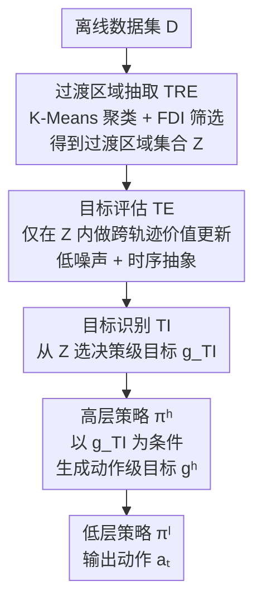

# RD-HRL: Generating Reliable Sub-Goals for Long-Horizon Sparse-Reward Tasks

**会议**: ICLR 2026  
**OpenReview**: [https://openreview.net/forum?id=5E5sd3TWGD](https://openreview.net/forum?id=5E5sd3TWGD)  
**代码**: https://github.com/Looomo/RD-HRL-public  
**领域**: 强化学习 / 分层强化学习 / 离线RL  
**关键词**: 分层强化学习, 子目标规划, 离线目标条件RL, 价值泛化误差, 长程稀疏奖励

## 一句话总结
针对离线分层强化学习里"高层策略靠带泛化噪声的价值函数挑子目标、结果选错"的痛点，本文提出 RD-HRL，先从离线数据里抽出连接多条轨迹的"过渡区域"作为可靠决策空间，再让一个 TI 模块在这些区域里选出**决策级目标**交给高层策略，从而把子目标选择和跨轨迹价值估计解耦，在 antmaze、Kitchen、CALVIN 等 9 个长程稀疏奖励基准上 8 个达到 top-3%。

## 研究背景与动机
**领域现状**：长程稀疏奖励任务（如目标条件导航、机器人操作）在离线 RL 里一直很难，因为奖励只在到达远处目标时才出现，信用分配（credit assignment）极其困难。主流解法是分层强化学习（HRL）：高层策略借助价值函数提出中间子目标，低层策略学习如何到达这些子目标，从而把有效规划视野缩短，缓解长程信用分配。

**现有痛点**：高层策略用来提出子目标的价值函数在实践中往往带有**泛化误差**。作者用一个直观例子说明：智能体从 $s_t$ 出发去目标 $g$，最优路径本应经过某个子目标 $s^1_{t+H}$，但 $s^1_{t+H}$ 的价值估计依赖**跨轨迹的 Bellman backup**（即泛化的 Bellman 回传），这个泛化信号常常被衰减、不可靠，导致最优子目标的价值被低估，高层策略转而选了次优子目标 $s^2_{t+H}$，最终走出一条次优轨迹。

**核心矛盾**：子目标的可靠性，本质上取决于价值函数在哪些状态上估值。一旦让高层策略去比较那些"价值信号本身就靠泛化撑起来"的候选子目标，泛化噪声就会直接污染决策。问题的根源不在策略本身，而在它被迫在一个**需要泛化才能比较价值**的空间里做决策。

**本文目标**：把不可靠的子目标规划拆成两个都"可靠"的子问题——(1) 提供合适的**决策级目标**（decision-level target），(2) 在决策级目标的条件下产出可靠的**动作级目标**（action-level target，即原来意义上的子目标）。

**切入角度**：作者观察到，如果能阻止高层策略去比较那些价值信号不可靠的候选，把它的决策空间**限制在不需要泛化的局部区域**内，泛化误差的影响就能大幅减小。数据里恰好存在这样的区域——多条轨迹彼此靠近、可以互相连接的地方，作者称之为"过渡区域"（transition region）。

**核心 idea**：引入一个**可靠性驱动的决策机制**（reliability-driven decision mechanism），从过渡区域里为高层策略挑选决策级目标，把高层决策限制在无需泛化的区域，从而把子目标选择与跨轨迹价值估计解耦。

## 方法详解

### 整体框架
RD-HRL 建立在标准 HRL（高层策略 $\pi^h$ + 低层策略 $\pi^l$）之上，额外插入一个由三个模块组成的可靠性驱动决策机制。整条流程是：从离线数据集出发，**TRE 模块**先把状态聚类成块、再筛出"过渡区域"集合 $Z$ 作为可靠的候选决策空间；**TE 模块**只在这些过渡区域内做价值评估，给出低噪声的价值；**TI 模块**借助 TE 的评估，从 $Z$ 中为当前状态选出一个过渡区域作为决策级目标 $g_{TI}$；然后高层策略以 $g_{TI}$ 为条件生成动作级目标 $g^h$，低层策略再据此输出实际动作 $a_t$。

整条决策链可写成：
$$g_{TI} \sim TI_{\theta_{TI}}(\cdot|s_t, g), \quad g^h \sim \pi^h_{\theta^h}(\cdot|s_t, g_{TI}), \quad a_t \sim \pi^l_{\theta^l}(\cdot|s_t, g^h)$$

关键在于：高层策略不再直接面对整个状态空间去比较子目标价值，而是被 $g_{TI}$ 约束在一个不需要泛化的区域里，泛化噪声因此被挡在决策之外。

### 关键设计

**1. 过渡区域抽取 TRE：把"可靠的决策空间"从数据里筛出来**

这是整个方法的地基，针对的痛点是"价值信号在哪里可靠"。作者定义过渡区域为多条轨迹彼此靠得很近、能互相连接的状态块——直觉上，在这些区域做决策天然能跨轨迹连接而不必依赖泛化。TRE 用两步实现：先对数据集里的状态做 K-Means 聚类 $C = \text{K-Means}(\{s|s\sim D\}, N)$ 得到 $N$ 个块；再用一个**未来多样性指数**（Future Diversity Index, FDI）来量化每个块能通向多少种未来，以此识别过渡区域。对簇 $c$，FDI 定义为
$$FDI(c) = \frac{|\{c_{s_{t+1}} | s_t \in c, s_t \in \tau\}| - 2}{N}, \quad \tau \sim D$$
即"从该簇出发，下一步能落到多少个不同簇"再减 2 归一化（减 2 是因为任何簇至少有"转出"和"留在原地"两种平凡未来）。能连接更多轨迹的过渡区域，自然拥有更多样的未来方向，因此 FDI 越大越像过渡区域。作者把所有 $FDI(c) > 0$ 的簇取为过渡区域集合 $Z = \{c | FDI(c) > 0\}$，簇数 $N$ 用类内平方和（WCSS）来定。

**2. 目标识别 TI：把高层决策空间限制到无需泛化的区域**

TI 模块 $TI_{\theta_{TI}}(g_{TI}|s_t, g)$ 负责在 $Z$ 里选一个过渡区域 $z$ 当作决策级目标 $g_{TI}$，交给高层策略。它针对的痛点正是"高层策略在需要泛化的空间里挑子目标会被噪声误导"——一旦决策级目标只能从过渡区域里选，高层策略的决策空间就被自然地收窄到不需要泛化的局部，子目标选择与跨轨迹价值估计就此解耦。TI 用 AWR 风格目标优化：
$$L_{\theta_{TI}} = \mathbb{E}_{z\in Z, s_z\in z}\big[\exp(\beta^{d(s_t,s_z)} \cdot A_{TI}(s_z, s_t, g)) \cdot \log TI_{\theta_{TI}}(s_z|s_t, g)\big]$$
其中优势 $A_{TI}(s_z, s_t, g) = TE_{\theta_{TE}}(s_z, g) - TE_{\theta_{TE}}(s_t, g)$ 完全由 TE 模块给出，$d(s_t, s_z)$ 是时序距离。值得注意的是，学 TI 时作者特意从**与 $s_t$ 同一条轨迹**的 $z$ 内采 $s_z$，以避免决策级的不确定性；而由于 $s_z$ 与 $s_t$ 的时序距离不一定是 1，权重要取到 $d(s_t, s_z)$ 次幂。消融实验（RD-HRL-HP）显示，决策级目标 $g_{TI}$ 对低层策略可能"够不着"，仍需要高层策略去分解它，所以 TI 绝不只是"更高一层的 $\pi^h$ 替身"。

**3. 目标评估 TE：靠跨轨迹直更 + 时序抽象给出低噪声价值**

TI 要选得准，前提是有人给过渡区域打出可靠的分。TE 模块 $TE_{\theta_{TE}}(s, g)$ 就专门干这个，且**只对** $s \in z, z\in Z$ 的状态估值，而不是对全部 $s\in D$。它的更新目标是
$$L_{\theta_{TE}} = \mathbb{E}_{\tau\sim D}\big[\|TE_{\theta_{TE}}(s_{t_1}, g) - (r_{t_1,t_2} + \gamma^{d(s_{t_1},s_{t_2})}TE_{\bar\theta_{TE}}(s_{t_2}, g))\|^2\big]$$
其中 $z_1, z_2$ 是轨迹骨架 $\hat\tau = \{\ldots, z_i, z_{i+1}, \ldots\}$ 上相邻的两个过渡区域，$s_{t_1}\in z_1$、$s_{t_2}\in z_2$。它的可靠性来自两点：其一，$s_{t_1}$ 和 $s_{t_2}$ 可能来自**不同轨迹**，于是价值信号是被**直接跨轨迹回传**而非靠泛化外推，从根上避开了泛化误差；其二，TE 只在过渡区域上更新，把中间细粒度的 RL 步骤**抽象成一个宏步**（temporal abstraction），价值更新次数大幅减少，从而抑制了每步更新累积的误差。作者还在附录给出理论证明，TE 能有效降低长程稀疏奖励场景下的价值噪声。

**4. 与 HRL 耦合：决策级目标→动作级目标的两段式可靠规划**

最后把可靠性驱动决策机制接回 HRL，构成 RD-HRL。训练顺序是：先用 $Z$ 学 TE，再用 TE 提供的优势学 TI；常规价值函数 $V_{\theta_V}(s,g)$ 按标准 TD 目标学；高层策略 $\pi^h_{\theta^h}(s_{t+H}|s_t, s_z)$ 和低层策略 $\pi^l_{\theta^l}(a_t|s_t, s_{t+H})$ 仍按 AWR 目标（式 3、式 4）学，但高层策略此时把条件 $g$ 替换为过渡区域里的 $s_z$。这样一来，原本"一步到位却不可靠"的子目标规划被拆成两段都可靠的子问题：TI 在无需泛化的过渡区域给出决策级目标，高层策略再在其条件下产出对低层免疫于泛化噪声的动作级目标。

### 损失函数 / 训练策略
训练分四块、按依赖顺序进行：(1) 用过渡区域 $Z$ 学 TE 模块（式 8，跨轨迹直更）；(2) 用 TE 的优势按 AWR 学 TI 模块（式 10）；(3) 学常规价值函数 $V$（式 11，标准 TD）；(4) 按 AWR 学高层、低层策略（式 3、式 4），高层条件由任务目标 $g$ 换成过渡区域状态 $s_z$。$\beta$ 为 AWR 温度，$H$ 为 waysteps 超参，$N$（簇数）由 WCSS 选定。

## 实验关键数据

### 主实验
在 9 个长程稀疏奖励基准上对比 9 个 HRL/规划基线（HIQL、PlanDQ、MSCP、V-ADT、DTAMP、HD-DA、HILP、HILP-Plan、DiffuserLite），50 个随机种子取均值。RD-HRL 在 9 个任务里 8 个进入 top-3%（≥0.97×MAX）。

| 数据集 | HIQL（骨干） | PlanDQ | DiffuserLite | RD-HRL |
|--------|------|--------|--------------|--------|
| antmaze-medium-diverse | 86.8 | 93.0 | 87.6 | **94.6** |
| antmaze-large-play | 86.1 | 85.3 | 69.4 | **95.3** |
| antmaze-ultra-diverse | 52.9 | 70.0 | 69.3 | **81.1** |
| antmaze-ultra-play | 39.2 | 71.5 | 63.7 | **72.9** |
| kitchen-mixed | 67.7 | 71.7 | 64.8 | **72.9** |
| CALVIN | 43.8 | 45.0 | 52.1 | **68.8** |

在最复杂的 antmaze-ultra-{play, diverse} 上，RD-HRL 相对骨干 HIQL 分别提升 85.9% 和 53.3%；在高维操作任务 CALVIN 上相对 HIQL 提升 57%，验证了在高维空间同样有效。唯一未进 top-3% 的是 kitchen-partial，作者归因于该数据集缺少跨子任务的完整轨迹，导致 TRE 无法识别出过渡区域。

### 消融实验

| 配置 | ultra-diverse | ultra-play | 说明 |
|------|------|------|------|
| RD-HRL（完整） | 81.1 | 72.9 | 完整模型 |
| RD-HRL-TRE | 59.8 | 52.9 | TI 改用 $s_{t+2H}$ 而非 $z\sim Z$ |
| RD-HRL-HP | 27.8 | 32.6 | 去掉高层策略，$g_{TI}$ 直接给低层 |
| RD-HRL-TE | 35.3 | 57.8 | 用 $V$ 替换 TE 模块 |
| RD-HRL-CU | 68.1 | 66.0 | 去掉 TE 的跨轨迹直更（保留时序抽象） |
| HIQL（骨干对照） | 52.9 | 39.2 | — |

### 关键发现
- **过渡区域的价值不止是"能用更大的 H"**：RD-HRL-TRE 把 $Z$ 换成 $\{s_{t+2H}\}$ 后在所有 antmaze 任务上都低于完整模型，说明过渡区域本身带来的可靠性才是关键；但 RD-HRL-TRE 在多数任务上仍优于 HIQL，说明单纯增大 $H$ 也有一定增益。
- **TI 不是"高一层的 $\pi^h$"**：去掉高层策略、把 $g_{TI}$ 直接喂低层（RD-HRL-HP）在 ultra-diverse/play 上分别暴跌 65.2% 和 55.3%——决策级目标常常对低层"够不着"，必须由高层策略再分解。
- **TE 的优势来自两半**：替换成普通 $V$（RD-HRL-TE）在复杂环境掉点明显；只去掉跨轨迹直更、保留时序抽象（RD-HRL-CU）在 ultra-diverse 上掉 16.1% 但仍稳定优于 RD-HRL-TE，说明跨轨迹直更和时序抽象各自都有实打实的贡献。

## 亮点与洞察
- **把"价值可不可靠"变成"在哪些状态上估值"的空间选择问题**：与其去修价值函数的泛化误差，不如直接把决策限制在不需要泛化的过渡区域，这个换框思路很干净。
- **FDI 这个指标朴素但好用**：用"下一步能落到多少个不同簇"来度量一个区域连接了多少条轨迹，把"过渡区域"这种抽象概念落成了一个可计算、可阈值化的量。
- **TE 的跨轨迹直更避开 Bellman 泛化**：让相邻过渡区域的价值在不同轨迹间直接回传，而不是靠函数逼近外推，这是降噪的根本，外加时序抽象减少更新次数压低累积误差，两个机制叠加。
- **"决策级目标 / 动作级目标"的两段式分解**可迁移到其他需要长程规划的离线任务——先在可靠区域里定锚点，再让策略逐级细化。

## 局限与展望
- **依赖数据里存在过渡区域**：kitchen-partial 上失效正是因为数据集缺少跨子任务的完整轨迹，TRE 抽不出过渡区域；对覆盖稀疏、轨迹彼此不交叠的数据集，方法可能退化。
- **多处依赖聚类与超参**：簇数 $N$ 靠 WCSS 选、FDI 阈值取 0、waysteps $H$ 等都需要设定，聚类质量直接影响过渡区域的好坏，论文未充分讨论这些选择的敏感性（消融集中在模块层面）。
- **流程偏复杂**：在标准 HRL 之上又叠了 TRE/TI/TE 三个模块和多阶段训练，工程与调参成本不低；能否简化（如端到端学过渡区域）值得探索。
- **主要在状态空间=目标空间的设定下验证**，对图像等高维观测、目标空间与状态空间不一致的场景还需进一步检验。

## 相关工作与启发
- **vs HIQL（骨干）**：HIQL 用单一价值函数直接选 H 步外的状态作动作级目标，受泛化噪声影响；RD-HRL 在其上插入过渡区域 + TI/TE，把子目标选择与跨轨迹价值估计解耦，在 ultra 级任务上相对 HIQL 大幅提升。
- **vs HILP / HILP-Plan**：它们用基于中位数的动作级目标选择；RD-HRL 改为从过渡区域学决策级目标，避开了对全空间价值比较的依赖。
- **vs DiffuserLite**：DiffuserLite 用三层分层设计做规划；RD-HRL 用两段式（决策级→动作级）+ 过渡区域，强调"在哪里做决策"而非加深层数，在多数 antmaze 与 CALVIN 上更优。

## 评分
- 新颖性: ⭐⭐⭐⭐⭐ 用"过渡区域 + 决策级目标"把子目标可靠性问题重述为决策空间选择，角度新颖且有理论支撑
- 实验充分度: ⭐⭐⭐⭐ 9 基准 50 种子 + 四组对照消融，但超参/聚类敏感性分析偏少
- 写作质量: ⭐⭐⭐⭐ 动机用 Figure 1 讲得很清楚，但 TRE/TI/TE 三模块命名密集、初读需对照
- 价值: ⭐⭐⭐⭐ 为离线 HRL 的泛化噪声问题给出可落地方案，在最难的 ultra/CALVIN 上增益显著

<!-- RELATED:START -->

## 相关论文

- [\[ICLR 2026\] Strict Subgoal Execution: Reliable Long-Horizon Planning in Hierarchical Reinforcement Learning](strict_subgoal_execution_reliable_long-horizon_planning_in_hierarchical_reinforc.md)
- [\[ICLR 2026\] Preference-based Policy Optimization from Sparse-reward Offline Dataset](preference-based_policy_optimization_from_sparse-reward_offline_dataset.md)
- [\[ICLR 2026\] RLVMR: Reinforcement Learning with Verifiable Meta-Reasoning Rewards for Robust Long-Horizon Agents](rlvmr_reinforcement_learning_with_verifiable_meta-reasoning_rewards_for_robust_l.md)
- [\[ICLR 2026\] Kevin: Multi-Turn RL for Generating CUDA Kernels](kevin_multi-turn_rl_for_generating_cuda_kernels.md)
- [\[ACL 2026\] A Goal Without a Plan Is Just a Wish: Efficient and Effective Global Planner Training for Long-Horizon Agent Tasks (EAGLET)](../../ACL2026/reinforcement_learning/a_goal_without_a_plan_is_just_a_wish_efficient_and_effective_global_planner_trai.md)

<!-- RELATED:END -->
