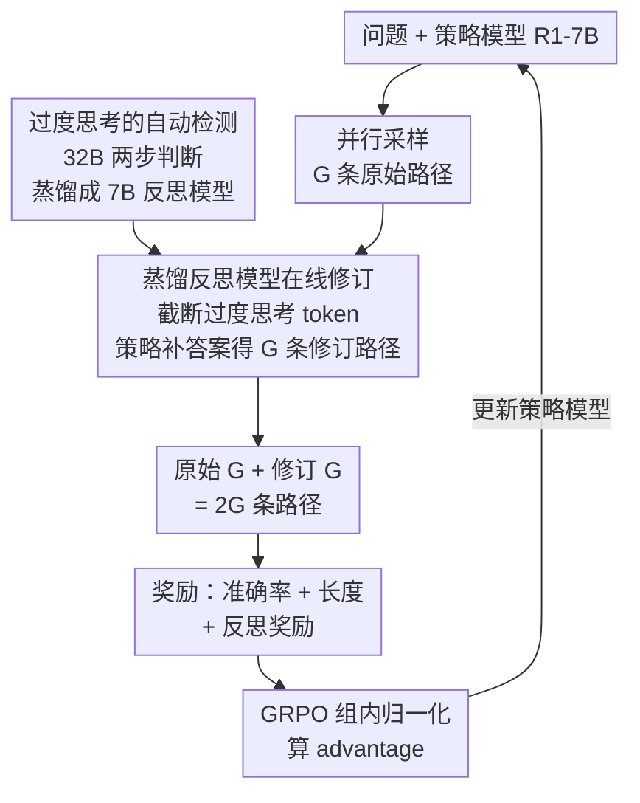

# REA-RL: Reflection-Aware Online Reinforcement Learning for Efficient Reasoning

**会议**: ICLR 2026  
**arXiv**: [2505.19862](https://arxiv.org/abs/2505.19862)  
**代码**: [GitHub](https://github.com/hexuandeng/REA-RL)  
**领域**: 强化学习  
**关键词**: 推理过度思考, 反思感知, 在线RL, GRPO, 推理效率

## 一句话总结

提出REA-RL框架，通过蒸馏训练的小型反思模型在线识别并截断过度思考token生成修订路径，配合反思奖励防止RL训练中模型退化为无反思的朴素CoT，在DeepSeek-R1-Distill-Qwen-7B上实现推理token开销降低36%且准确率零损失。

## 研究背景与动机

**领域现状**：大型推理模型（LRM）如DeepSeek-R1、QwQ通过"深度思考+自我反思"的范式在数学推理等复杂任务上取得了显著进展。这类模型会在生成答案后多次检查验证、反思修正，类似人类解题时的反复演算。但这种能力带来了严重的推理效率问题——模型在简单的小学数学题上也会反思8次以上，消耗数千token。

**现有痛点**：现有解决过度思考的方案分为两大路线，各有致命缺陷。**离线数据方法**（如用SFT训练模型生成短响应、用Best-of-N采样或强模型生成精简推理路径）的核心问题是数据分布偏移：静态数据集与训练中不断变化的模型策略之间差距越来越大，而且数据生成和过滤过程本身的计算开销就超过普通采样的两倍，完全不适合在线场景。**在线RL+长度奖励方法**（如Kimi K1.5的长度归一化奖励）虽然解决了分布偏移问题，但带来了更危险的后果——模型在追求短输出的过程中会完全丧失反思能力，退化为朴素的链式思维（CoT），在简单题上看似高效实则在复杂题上错误率飙升。

**核心矛盾**：长度奖励与反思质量之间存在根本性冲突。反思本身就需要额外token（"wait""but""let me check"等），而长度奖励无差别地惩罚所有长输出，无法区分"有价值的反思"和"无意义的重复"。仅靠并行采样缺少短且正确的响应作为正样本引导优化方向，模型只能学到"越短越好"的粗暴策略。

**切入角度**：作者观察到两个关键事实：（1）过度思考的检测任务本身并不复杂——只需判断推理过程中哪一段包含了正确答案，弱模型经过微调也能完成；（2）Snell et al.已经证明并行采样+顺序修订是计算最优的test-time scaling策略。这意味着可以用低成本的小模型在训练中在线提供截断修订路径，同时设计专门的奖励信号保护反思行为。

**核心 idea**：用蒸馏的7B反思模型在线截断过度思考token生成修订路径（解决数据问题），配合反思关键词密度奖励防止RL训练中反思能力退化（解决奖励问题），两条路线互补实现效率与性能的平衡。

## 方法详解

### 整体框架

REA-RL要解决的是这样一件事：让大型推理模型在简单题上别没完没了地反思，又不会在难题上因为追求短输出而把该有的反思也丢掉。它的做法是在标准GRPO上同时拧两个旋钮。一是**数据**这一侧——对每个问题并行采样$G$条推理路径之后，一个小型反思模型在线扫一遍每条路径，找到首次得出正确答案的位置，把后面那段过度思考的token截掉，再让策略模型补一个干净的最终答案，于是每条原始路径都配上一条更短的修订路径，原始加修订共$2G$条一起进入优化。二是**奖励**这一侧——在准确率奖励和长度奖励之外加一项反思奖励，专门盯住那些反思密度过低的响应并施加惩罚，挡住模型为了缩短输出而彻底放弃反思的退路。两侧互补：修订路径负责把"短而正确"的正样本喂进来，反思奖励负责守住反思能力的底线。

### 关键设计

**1. 过度思考的自动检测：把"首次答对之后的部分"定义为冗余**

要截断过度思考，先得说清楚哪一段算过度思考。这篇把模型的 think 部分按段落切成若干 chunk，再用 Qwen2.5-32B-Instruct 逐个 chunk 判断是否已经包含正确答案，第一次确认包含答案的那个 chunk 之后的所有内容就被判定为过度思考。为了压住误判，检测走两步——第一轮先粗筛出可能含答案的 chunk，第二轮再逐个 re-check 确认；之所以不用正则直接匹配答案，是因为推理过程里格式不统一、而且模型常常中途就顺嘴提一下答案，正则会引出大量误检。截断之后强制终止 think，让模型以"**Final Answer:**"前缀直接给出最终答案，预算限制在 16K token。这套检测既产出了高质量的过度思考标注（用来训练后面的反思模型），又顺便定义了"修订"到底修的是哪一段。实测它在不给 gold answer 时能自动砍掉 24% 的 token 而准确率不降，给了 gold answer 时能砍 34%。

**2. 蒸馏反思模型：把 32B 的两步判断压成 7B 的一步在线修订**

上面那套 32B 两步检测精度够，但放进在线 RL 的每一步采样里跑太贵。于是先用 R1-7B 在训练集上每题生成 4 条推理路径，用 32B 的两步方法标注每个 chunk 是否含答案，构成 SFT 数据，再把这份"判断能力"蒸馏进 Qwen2.5-7B-Instruct——训练后的 7B 只需**一步**就能预测每个 chunk 的类别，足够轻量到嵌进训练循环。在线训练时，反思模型对$G$条并行采样路径各自定位过度思考位置并截断（丢掉红色 overthinking token），保留有效推理（黄色 token），再由策略模型补完最终答案（蓝色 token），得到$G$条修订路径$S^r$与原始路径一同进 GRPO。文章进一步指出，这种修订并不是普通的数据增强，而**等价于对过度思考 token 施加部分 penalty**：修订成功时长度奖励保证$a_i^r > a_i$，过度思考 token 因此吃到负 advantage；而一旦修订把对的改错、或者原始和修订都错，就直接丢弃这条修订路径，避免 advantage 方向反转反过来鼓励过度思考。这一步同时治了两个老问题——离线数据的分布偏移（修订是在线生成的，分布天然一致），以及纯并行采样缺少"短且正确"正样本（修订路径正好补上）。对照直接把并行采样从 4 扩到 8（Gen8），同等数据量下修订路径带来的收益明显更大，印证了 Snell et al. 所说的"并行+顺序"才是计算最优的 scaling。

**3. 反思奖励：用底线保护挡住长度奖励对反思的误杀**

长度奖励的副作用是无差别地惩罚长输出，连有价值的反思一起压掉，模型很容易退化成不反思的朴素 CoT。反思奖励的思路不是鼓励多反思，而是设一条不许跌破的底线。具体先统计响应里反思关键词（"wait""alternatively""check""but"）的密度

$$D_i = N_{\text{Reflect}} / N_{\text{Token}}$$

其中紧密聚集的关键词只算一次以防重复计数。以训练数据中 0.2 分位数$D_{0.2}$作阈值，奖励定义为

$$R_{\text{Reflect}}(s_i) = \min(0,\ D_i / D_{0.2} - 1)$$

只有密度低于最低 20% 的响应才挨罚，密度正常或偏高的一律奖励为 0，这样反思奖励就只会把垫底的拉回来、绝不会反向鼓励过度思考。配套地，它还把 Kimi K1.5 的长度奖励改了一处关键缺陷：错误回答的长度奖励直接设为 0（原版即便答错也给部分长度奖励，会误导模型在难题上也一味求短）。这条底线很必要——直接上长度奖励时，简单题的反思密度会暴跌到原来的 1/8（GSM8K 上反思间隔从 105 token 拉大到 814 token），性能随之下滑；加上反思奖励后效率与质量才重新平衡。

### 训练策略

总奖励为三部分之和：$R = R_{\text{Acc}} + R_{\text{RLen}} + R_{\text{Reflect}}$。$R_{\text{Acc}}$为规则验证的准确率奖励（正确1/错误0）；$R_{\text{RLen}}$为改进后的长度奖励（正确时$\lambda = 1 - (len - min\_len)/(max\_len - min\_len)$，错误时0）；$R_{\text{Reflect}}$为反思密度奖励。在GRPO框架下对$2G$条路径的奖励进行组内归一化计算advantage，优化策略模型。训练在3张NVIDIA A800 80G GPU上进行约120小时，相比标准GRPO仅增加约50%的时间（主要来自反思模型推理和修订生成的串行开销），但通过延迟更新vllm推理模型实现训练与数据生成并行化，减少了实际等待时间。

## 实验关键数据

### 主实验（16K budget，与baseline对比）

| 方法 | GSM8K↑ | Math500↑ | Gaokao23↑ | Amc23↑ | AIME24↑ | 平均Acc | 平均TR↓ |
|------|--------|----------|-----------|--------|---------|---------|---------|
| R1-7B原始 | 91.66 | 92.00 | 81.82 | 88.12 | 48.33 | 80.39 | 100% |
| GRPO（仅准确率奖励） | 92.87 | 93.40 | 82.34 | 87.19 | 50.42 | 81.24 | 102% |
| GRPO + Kimi长度奖励 | 85.97 | 88.40 | 72.21 | 87.81 | 50.00 | 76.88 | 57% |
| NoThink | 85.06 | 84.20 | 66.23 | 66.25 | 23.33 | 65.01 | 27% |
| ShorterBetter | 85.37 | 83.40 | 66.75 | 76.88 | 50.00 | 72.48 | 31% |
| DAST | 87.79 | 91.40 | 83.12 | 88.44 | 51.67 | 80.48 | 76% |
| Arora & Zanette | 90.45 | 93.20 | 77.14 | 86.88 | 48.33 | 79.20 | 71% |
| **REA-RL反思奖励** | **92.72** | **92.80** | **81.82** | **88.75** | **54.58** | **82.13** | **72%** |
| **REA-RL反思模型** | 89.23 | 92.40 | 79.74 | 88.12 | 47.92 | 79.48 | 52% |
| **REA-RL组合** | 89.99 | 91.00 | 82.08 | 89.38 | 51.25 | **80.74** | **64%** |

### 消融实验（反思模型修订策略对比，16K budget）

| 修订策略 | 平均Acc↑ | 平均TR↓ | 说明 |
|----------|----------|---------|------|
| 原始R1-7B | 80.39 | 100% | 无修订基线 |
| 7B Revise（未训练） | 75.77 | 69.65% | Qwen-7B直接做两步检测，17%输出格式错误 |
| 32B Revise（无gold） | 80.61 | 75.65% | Qwen-32B两步检测，效果好但推理成本高 |
| 反思模型-Weak | 80.95 | 88.03% | 在第二个正确答案位置截断，保守策略 |
| 反思模型-Normal | 80.62 | 83.50% | 在首次正确答案截断，训练时使用 |
| 反思模型-Strong | 80.14 | 78.52% | 截断概率>0.25前截断，激进策略 |
| Fixed Trunc（同比例） | 76.86 | 79.68% | 按相同比例固定截断，性能显著下降 |
| GRPO Gen8（纯并行扩展） | 81.35 | 97.55% | 增加到8路并行采样，效率无改善 |

### 关键发现

- **长度奖励是把双刃剑**：单独使用Kimi K1.5长度奖励在16K budget下平均准确率从80.39降至76.88，AIME24上甚至略有提升（50.00 vs 48.33）说明难题确实受益于压缩，但简单题性能暴跌（GSM8K -5.69）说明模型丢失了必要的推理步骤
- **反思密度是退化的直接指标**：长度奖励训练后GSM8K上反思间隔从105.48 token飙升至813.96 token——说明模型每写800多个token才反思一次，几乎等于完全不反思。而REA-RL组合方法控制在150.87 token，仅比原始模型稍低
- **反思模型vs反思奖励互补但非协同**：反思模型擅长压缩（TR 52%），反思奖励擅长保性能（Acc 82.13最高）。两者组合取中间值（TR 64%,Acc 80.74）而非超过任一方向的最优——因为反思模型的目标（惩罚过度思考）与反思奖励（保护反思）存在固有张力
- **难度自适应性**：REA-RL在简单题（GSM8K/Math500/Gaokao23）上平均减少反思频率22%、效率提升45%，但在困难题（Amc23/AIME24）上仅减少4%、效率提升27%。模型学会了"简单题少想，难题该想还是想"的策略
- **在线训练显著优于离线**：RPO使用32B生成的修订数据做离线训练，在16K budget下Amc23降至82.19、AIME24降至42.92，而在线的REA-RL组合分别为89.38和51.25，证实了分布偏移确实是离线方法的瓶颈

## 亮点与洞察

- **蒸馏式过度思考检测**：将32B模型的两步复杂检测能力蒸馏为7B模型的一步轻量检测，使得在线实时修订成为可能。这种"大模型标注-小模型执行"的范式比直接提示小模型效果好得多（7B未训练时17%格式错误，训练后效果接近32B），且可推广到其他需要大模型判断的在线场景
- **反思奖励的"底线保护"设计**：用0.2分位数作为阈值而非鼓励更多反思，精准地解决了"长度奖励杀死反思"的问题而不引入过度反思的副作用。实验验证任何≤0.2的分位数效果相当，小分位更效率导向、大分位更准确率导向，这给了实践者灵活的调参空间
- **修订等价于部分advantage的理论分析**：文章证明了在线修订并非简单的数据增强，而是等价于对过度思考token施加负partial advantage、对修订token施加正partial advantage——这提供了比"切掉冗余"更深刻的优化视角，也解释了为什么修订失败时需要丢弃（否则advantage方向反转会鼓励过度思考）
- **训练动态揭示的时序规律**：Figure 3显示反思模型在前1000步会导致严重的性能下降（因为截断太激进），但随后由于只针对过度思考token施加penalty而非有效反思token，模型逐步恢复并最终在性能和效率上都超越baseline。这说明该方法需要足够长的训练才能收敛，短期评估可能低估其效果

## 局限与展望

- **仅在蒸馏7B模型上验证**：未在从头预训练的LRM（如完整版DeepSeek-R1）上测试，无法确认该方法对大规模原生推理模型同样有效。作者也承认这是由于大模型训练时间过长的限制
- **过度思考检测依赖LLM判断**：检测方法基于LLM判断chunk是否包含正确答案，无法保证完全消除所有过度思考。对于答案无法规则验证的开放式任务（如代码生成、文本摘要），该方法需要重新设计检测标准
- **反思关键词列表的语言局限性**：反思奖励依赖英文关键词（"wait""but""alternatively""check"），对多语言推理模型或不使用这些关键词的推理风格可能失效。更鲁棒的方案可能需要用语义分类器替代关键词匹配
- **组合方法未实现协同增益**：反思模型（切过度思考）和反思奖励（保反思能力）的目标存在内在矛盾，组合后取折中而非协同放大。未来可探索动态调节两者权重——训练初期侧重反思保护，后期逐步加强效率压缩

## 相关工作与启发

- **vs NoThink**：NoThink直接通过prompt跳过所有推理，虽然极度高效（TR 27%）但准确率暴跌至65.01，说明完全移除推理不可行。REA-RL的价值在于"选择性保留有效推理"
- **vs DAST**：DAST根据问题难度预估长度预算，思路与REA-RL的难度自适应相似，但DAST需要额外的难度估计器。REA-RL通过训练自然涌现难度感知能力——这是RL优化的隐式好处
- **vs ShorterBetter**：ShorterBetter用最短正确响应作为长度基准，TR虽低至31%但准确率降至72.48。其问题在于用最极端的短样本作为锚点会过度压缩。REA-RL的修订策略更温和——只截断"已经得出正确答案之后的部分"，保留了到达答案的完整推理链
- **vs Kimi K1.5长度奖励**：REA-RL对K1.5的长度奖励做了关键改进：错误回答长度奖励设0（原版min(0.5,λ)仍给部分奖励），避免在困难题上错误鼓励短输出

## 评分

- 新颖性: ⭐⭐⭐⭐ 反思模型+反思奖励双维度解法有系统性，但单个组件（蒸馏检测、关键词奖励）并非全新
- 实验充分度: ⭐⭐⭐⭐⭐ 5个不同难度数据集+完整消融+反思密度分析+训练动态+多baseline对比+修订策略对比
- 写作质量: ⭐⭐⭐⭐⭐ 从Figure 1的直观案例引入问题→系统分析两条路线的失败原因→逐步构建解法，逻辑链完整
- 价值: ⭐⭐⭐⭐⭐ 36%效率提升零性能损失的实用价值高，反思奖励和partial advantage分析提供了可迁移的理论insight

<!-- RELATED:START -->

## 相关论文

- [\[ICLR 2026\] Stop Unnecessary Reflection: Training LRMs for Efficient Reasoning with Adaptive Reflection and Length Coordinated Penalty](stop_unnecessary_reflection_training_lrms_for_efficient_reasoning_with_adaptive_.md)
- [\[ICLR 2026\] FAPO: Flawed-Aware Policy Optimization for Efficient and Reliable Reasoning](fapo_flawed-aware_policy_optimization_for_efficient_and_reliable_reasoning.md)
- [\[ICLR 2026\] RL for Reasoning by Adaptively Revealing Rationales](rl_for_reasoning_by_adaptively_revealing_rationales.md)
- [\[ICLR 2026\] QuRL: Low-Precision Reinforcement Learning for Efficient Reasoning](qurl_low-precision_reinforcement_learning_for_efficient_reasoning.md)
- [\[ICLR 2026\] A$^2$Search: Ambiguity-Aware Question Answering with Reinforcement Learning](a2search_ambiguity-aware_question_answering_with_reinforcement_learning.md)

<!-- RELATED:END -->
