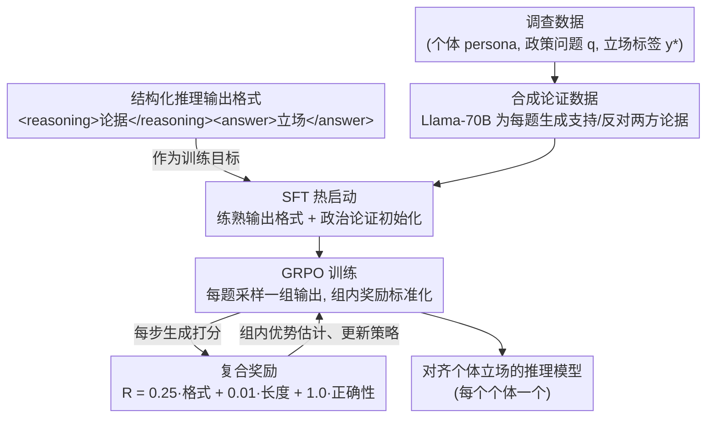

# Reasoning Boosts Opinion Alignment in LLMs

**会议**: ICLR 2026  
**arXiv**: [2603.01214](https://arxiv.org/abs/2603.01214)  
**代码**: [GitHub](https://github.com/ETH-DISCO/reasoning-boosts-llm-alignment)  
**领域**: 强化学习  
**关键词**: opinion alignment, GRPO, political reasoning, survey data, digital democracy

## 一句话总结
用 GRPO 强化学习训练 LLM 通过结构化推理对齐个体政治观点，SFT+GRPO 在美国/德国/瑞士三国数据集上一致优于 ICL 和 ORPO 基线，但系统性揭示了左右翼偏差和 Neutral 立场预测的根本困难。

## 研究背景与动机

**领域现状**：政治观点建模对数字民主具有重要价值。LLM 已被广泛用于模拟群体政治倾向，但主要依赖人口统计 prompt（"你是一个民主党人"），存在代表性、可控性和一致性三大缺陷。

**现有痛点**：1）人口统计提示无法模拟个体级偏好——同一群体内部方差巨大；2）面试 transcript 方法（Park et al. 2024）准确但数据收集成本过高；3）政治调查数据丰富（ANES/VAA），仅有立场标签无推理链——模型需自行学习推理过程。

**核心矛盾**：LLM 的统计本性和有限因果理解 vs 忠实反映多元政治观点的需求。

**本文目标** 能否通过 RL 训练让 LLM 学会"先推理再回答"从而提升个体级政治观点对齐？

**切入角度**：将观点形成视为推理问题——借鉴 GRPO 在数学推理中的成功，迁移到政治推理场景。

**核心 idea**：政治调查数据 + GRPO 奖励正确立场 + SFT 热启动推理格式 = 推理式个体观点对齐。

## 方法详解

### 整体框架
论文要解决的问题是：能不能让 LLM 不靠"你是个民主党人"这类人口统计 prompt，而是通过显式推理去对齐**某一个具体个体**（某选民、某政党、某候选人）的政治立场。它把"形成观点"重新理解成一个推理问题——模型先写一段论据、再给出立场，立场答对了就奖励。整条 pipeline 分两段：先用 SFT 让模型学会"先推理、再给立场"的输出格式并打好政治论证的底子，再用 GRPO 以"立场答对没有"为奖励信号去打磨推理质量。每个个体单独训一个模型，系统 prompt 里只给国家标签、不放任何显式 persona 描述——个体偏好完全靠在调查问题上答对来隐式编码。

### 关键设计

**1. 结构化推理输出格式：把立场判断变成可优化的推理过程**

调查数据的麻烦在于它只有立场标签、没有推理链，模型无从模仿"该怎么想"。论文的做法是强制模型按 `<reasoning>[推理文本]</reasoning><answer>[立场]</answer>` 的格式输出，把推理过程显式拆出来。由于没有推理的监督标签，推理质量只能被间接优化——模型在奖励信号下自己摸索什么样的论据能让最终 `<answer>` 答对。这一步的意义在于让模型把论据摆到台面上组织，而不是凭直觉做 pattern matching 直接吐立场，后者正是意识形态偏差的来源。这个格式也是后面两段训练共同的优化目标：SFT 先教模型把它写规整，GRPO 再在这个壳子里打磨内容。

**2. SFT 热启动 + 合成论证数据：先把格式和政治论证的底子打好再上 RL**

如果直接从零跑 GRPO，模型既要学会格式、又要学会推理，奖励信号太稀疏、收敛很慢（实验里 GRPO only 显著低于 SFT+GRPO）。论文先用 Llama-70B 为每个政策问题生成支持/反对两方的论证，拼成 SFT 数据热启动。SFT 阶段一举两得：一是让模型把上面那套输出格式练熟，等于提前把格式这部分的优化负担从 GRPO 里卸掉；二是给模型一个合理的政治推理初始化，使后续 GRPO 能集中火力打磨立场正确性，训练动态明显更稳。

**3. 复合奖励函数：用三个维度同时约束格式、长度和正确性**

热启动之后，GRPO 用一个加权的复合奖励来逼模型把立场答对：

$$R = \alpha_1 R_{\text{format}} + \alpha_2 R_{\text{length}} + \alpha_3 R_{\text{correct}}$$

其中 $R_{\text{format}}$ 检查四个 XML 标签是否齐全（最高 4 分），$R_{\text{length}} = -|L - L^*|$ 惩罚生成长度偏离目标值 $L^*$，$R_{\text{correct}} = \mathbb{1}[y_i = y_i^*]$ 表示立场与调查答案一致就得 1 分。权重设为 $\alpha_1=0.25,\ \alpha_2=0.01,\ \alpha_3=1.0$——正确性是主目标、占绝对大头，格式是次要的硬约束，长度只做轻微调节，避免模型为凑长度而牺牲立场判断。

### 损失函数 / 训练策略

GRPO（Group Relative Policy Optimization）对每个 prompt 采样一组输出，用组内奖励标准化（减均值除标准差）估计优势，替代传统 PPO 的 value function。微调采用 LoRA（$r=32,\ \alpha=32$）配 4-bit 量化；流程为 SFT 800 步 + GRPO 800 步，group size 8，$\beta=0$，温度 $T=1.0$。

## 实验关键数据

### 主实验（Macro-F1 %, 8 runs, T=1.0）

| 方法 | smartvote(瑞士) | WoM(德国) | ANES(美国) |
|------|:---:|:---:|:---:|
| SFT+GRPO (Magistral 24B) | **70.73** | **53.21** | **45.43** |
| SFT (Magistral 24B) | 67.63 | 51.86 | 39.15 |
| GRPO only (Magistral 24B) | 60.56 | 51.00 | 43.79 |
| SFT+GRPO (Llama 3.1 8B) | 66.88 | 52.53 | 40.66 |
| ICL (Magistral 24B) | 66.16 | 26.19 | 19.23 |
| ORPO | 23.31 | 24.73 | 24.25 |
| Random | 50.0 | 33.33 | 33.33 |

### 消融实验 — 意识形态偏差分析

| 政治群体 | smartvote F1 | WoM F1 | ANES F1 | 说明 |
|----------|:---:|:---:|:---:|------|
| Left | 高 | 高 | 较高 | 模型最容易对齐 |
| Center | 中 | 高 | 中 | 居中水平 |
| Right | 低 | 中 | 低 | 系统性最差 |

### 关键发现
- **SFT+GRPO 一致最优**：在 9/9 模型×数据集组合中超越或匹配 SFT，统计显著（Welch t-test + Bonferroni 校正）
- **Neutral 是硬骨头**：ANES 上 Neutral 召回率最低，Neutral base rate 与 F1 呈 $r=-0.59$ 的显著负相关；Right 群体 Neutral 回答最多→性能受损最大
- **推理翻转现象**：训练后模型用类似论据（如"equal opportunity"）支持相反立场——推理内容语义一致但框架不同（Table 1 示例）
- **答案翻转实验**：反转所有 smartvote 答案后训练→Right 候选人 F1 提升但仍不及原 Left 水平→Left 偏好可能内在更易建模
- **PCA 空间位移**：训练后的 agents 在 smartvote PCA 空间中偏向中右和保守方向（与文献报告的左自由偏见相反）→这是 GRPO 对齐的结果而非基座模型偏见
- **SFT 数据偏见影响**：progressive bias SFT 数据严重损害 Right 候选人但不一定利于 Left→偏见主要伤害弱势方

## 亮点与洞察
- **将政治观点对齐重新框定为推理问题**：不依赖人口统计proxy，而是让模型通过推理过程"理解"每个个体的立场——概念上的范式转换
- **跨三国三政治体系验证**：smartvote（二分类 Yes/No）、WoM（三分类+多选举聚合）、ANES（异质问题格式需 recoding）——方法泛化性强
- **意识形态不对称的深刻洞察**：Right 偏好系统性更难学习→可能是 LLM 预训练语料比例偏差，也可能是 Right 立场的内在统计结构更复杂
- **SFT 数据偏见的不对称效应**：偏见伤害弱势方 > 利好优势方——对可信 AI 系统设计有警示意义

## 局限与展望
- 每个个体需单独训练一个模型→计算成本 $O(N)$ 不可扩展；未来应探索 persona-conditioned 单模型架构
- 测试集极小（12-30 题），统计置信度有限
- 三分类 {Yes, Neutral, No} 简化丢失原始 Likert scale 细粒度信息
- ANES recoding 方案选择（conservative vs aggressive）影响结果→方法对数据预处理敏感
- 最好 F1 仅 ~70% → 距"忠实数字双胞胎"仍有显著差距
- 未探索从少量调查数据泛化到全新政策议题的零样本能力

## 相关工作与启发
- **vs Santurkar et al. (2023) 人口统计提示**：他们揭示 LLM 默认意见分布不代表真实人群，本文直接绕过人口统计→用调查数据对齐个体
- **vs Park et al. (2024) 面试transcript建模**：他们用富文本构建个体persona准确率高，但数据获取成本过高；本文用结构化调查数据作为轻量替代
- **vs DeepSeek-R1 (2025) GRPO 数学推理**：GRPO 在数学推理中成功→本文验证其在政治推理中也有效，但效果不如数学推理那么显著

## 评分
- 新颖性: ⭐⭐⭐⭐ GRPO 用于政治推理是新颖的应用，意识形态偏差分析有深度
- 实验充分度: ⭐⭐⭐⭐ 3模型×3数据集、意识形态分析、答案翻转实验、SFT偏见实验充实
- 写作质量: ⭐⭐⭐⭐ 结构清晰，PCA可视化和推理示例有说服力
- 价值: ⭐⭐⭐ 方向有趣但可扩展性存疑，Right偏好难学的发现有社会意义

<!-- RELATED:START -->

## 相关论文

- [\[ICLR 2026\] Reinforcement Learning with Verifiable Rewards Implicitly Incentivizes Correct Reasoning in Base LLMs](reinforcement_learning_with_verifiable_rewards_implicitly_incentivizes_correct_r.md)
- [\[ICLR 2026\] AbstRaL: Augmenting LLMs' Reasoning by Reinforcing Abstract Thinking](abstral_augmenting_llms_reasoning_by_reinforcing_abstract_thinking.md)
- [\[ICLR 2026\] QuestA: Expanding Reasoning Capacity in LLMs via Question Augmentation](questa_expanding_reasoning_capacity_in_llms_via_question_augmentation.md)
- [\[ICLR 2026\] RL Squeezes, SFT Expands: A Comparative Study of Reasoning LLMs](rl_squeezes_sft_expands_a_comparative_study_of_reasoning_llms.md)
- [\[ICLR 2026\] Boosting Multi-Domain Reasoning of LLMs via Curvature-Guided Policy Optimization](boosting_multi-domain_reasoning_of_llms_via_curvature-guided_policy_optimization.md)

<!-- RELATED:END -->
