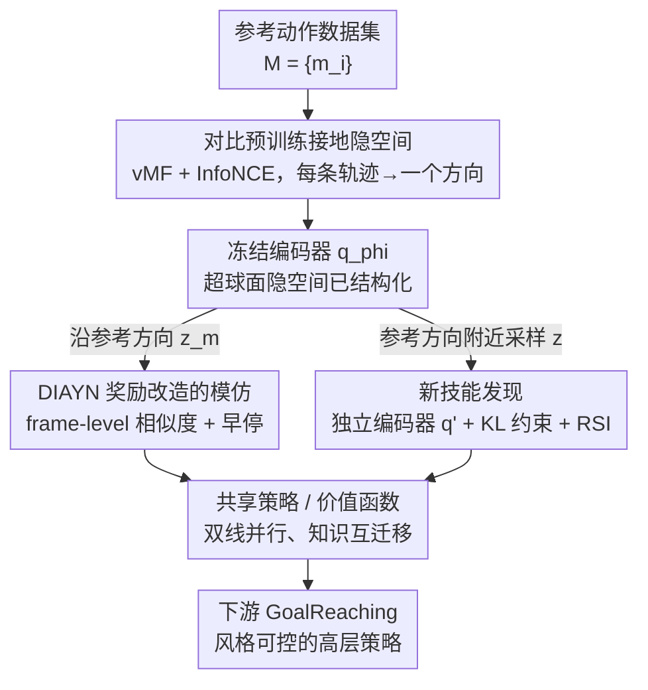

# Reference Grounded Skill Discovery

**会议**: ICLR 2026  
**OpenReview**: [https://openreview.net/forum?id=IaGf8Eh5Uo](https://openreview.net/forum?id=IaGf8Eh5Uo)  
**代码**: 待确认（项目页 seungeunrho.github.io/projects/RGSD）  
**领域**: 强化学习 / 无监督技能发现  
**关键词**: 技能发现, 高自由度控制, 对比学习, 模仿学习, 类人机器人

## 一句话总结
RGSD 用参考动作数据先把技能隐空间「接地」到一个语义有意义的单位超球面上（对比预训练），再在这个已结构化的空间里同时做模仿和探索，从而把无监督技能发现成功扩展到 69 自由度的 SMPL 类人机器人，既能高保真复现走/跑/侧移/出拳，又能发现风格一致的新变体。

## 研究背景与动机

**领域现状**：无监督技能发现（unsupervised skill discovery, USD）的目标是在不给奖励的环境里自动学到一组可复用技能 $z$，使不同的隐变量 $z$ 诱导出不同行为。主流做法是最大化隐变量与访问状态之间的互信息 $I(S;Z)$，代表方法有 DIAYN、以及基于 Wasserstein 依赖度量（WDM）显式拉大技能差异的 METRA。这些方法在低自由度环境（HalfCheetah、四足、简单机械臂）上效果不错。

**现有痛点**：一旦把 USD 搬到高自由度智能体（如 69-DoF 的人形），就崩了。随着自由度上升，探索空间指数级膨胀，而「语义有意义」的技能流形占比却很小。论文展示 SOTA 方法 METRA 在 SMPL 上学出来的「技能」是手臂、腿、躯干、头各自随机乱抖的无结构运动——虽然「多样」，但没有任何现实任务用得上。

**核心矛盾**：好技能要同时满足两个相互拉扯的诉求——**多样性**（覆盖广泛下游任务）和**语义有意义**（下游任务都是用语义描述的，如「左转」「后退」）。纯靠在线探索去碰运气，在高维空间里几乎不可能同时满足这两点；现有给 USD 注入语义的方法（LGSD 用 LLM、DoDont 用视频）只能提供高层弱引导，仍扩展不到高自由度。

**本文目标 / 切入角度**：作者的关键洞察是——要驯服高维诅咒，必须**先验地**构造一个语义有意义的技能隐空间，再把探索约束在这个空间内。常规 USD 的顺序是「先探索、后归纳隐空间」，RGSD 反其道而行：先用参考动作数据把隐空间嵌好，再在里面探索。

**核心 idea**：用对比学习把每条参考轨迹塞到超球面上的一个独立方向，让「沿参考方向采样 $z$ → 触发模仿」「在参考方向之间采样 $z$ → 发现新技能」，从而把隐空间探索直接转化为状态空间里结构化技能的发现。这个两阶段范式（自监督预训练 → RL 微调）作者类比为大模型的训练流程。

## 方法详解

### 整体框架

RGSD 把技能发现拆成两个阶段。**第一阶段（预训练）**：拿一批参考动作轨迹 $M=\{m_i\}$，用对比学习训练一个编码器 $q_\phi(z\mid s)$，把每条轨迹的所有状态都映射到超球面上同一个方向，不同轨迹分到不同方向——这一步完全离线、不和环境交互，得到一个「已接地」的隐空间。**第二阶段（并行训练）**：冻结 $q_\phi$，同时跑模仿和发现两条线。模仿线把策略 conditioned 在某条参考动作的平均嵌入 $z_m$ 上，用一个从 DIAYN 奖励改造来的奖励逼策略复现该动作；发现线则在参考方向附近采样 $z$，去探索语义相关的新行为。两条线共享同一个策略、价值函数和奖励形式，因此能稳定地互相迁移知识。

### 关键设计

**1. 对比预训练把隐空间接地到超球面：每条参考动作占一个方向**

这一步直接针对「高维空间里探索找不到语义流形」的痛点：与其让策略瞎探索再归纳隐空间，不如先用数据把隐空间结构化好。编码器 $q_\phi(z\mid s)$ 把状态映射到单位超球面 $\mathcal{Z}=\{v\in\mathbb{R}^k:\|v\|_2=1\}$ 上，建模为 von Mises–Fisher（vMF）分布 $q_\phi(z\mid s)\propto\exp(\kappa\,\mu_\phi(s)^\top z)$，其中 $\mu_\phi(s)$ 是神经网络给出的均值方向，$\kappa$ 是固定的集中度参数。训练用 InfoNCE：正样本对取自同一条轨迹，负样本取自不同轨迹，

$$\mathcal{L}_{\text{InfoNCE}} = -\log\frac{\exp(\mathrm{sim}(z_a,z_+)/T)}{\exp(\mathrm{sim}(z_a,z_+)/T)+\sum_j\exp(\mathrm{sim}(z_a,z_j^-)/T)}$$

其中 $\mathrm{sim}(z_i,z_j)=z_i^\top z_j$ 是余弦相似度，温度 $T=1/\kappa$。这样同一条动作里的状态被拉到同一方向、不同动作互相推开。一个关键性质是**动作内对齐**（within-motion alignment）：预训练收敛后，一条动作 $m$ 里每个状态 $s$ 的嵌入都指向完全相同的方向（附录 C 给了证明），这是后面把奖励当成模仿信号的前提。

**2. 把 DIAYN 奖励改造成模仿奖励：在学到的隐空间里按帧对齐**

冻结 $q_\phi$ 后，模仿阶段巧妙地复用了 DIAYN 的奖励 $r_z=-\log p(z)+\log q_\phi(z\mid s)$，而不另设模仿 loss。先把一条动作 $m$ 的嵌入定义为其各状态嵌入的平均 $z_m=\frac{1}{l}\sum_{s\in m}\mu_\phi(s)$；由于动作内对齐，理论最优下 $z_m$ 应与该动作里任意单帧状态的嵌入对齐。把策略 conditioned 在 $z_m$ 上、代入 vMF 形式，奖励化简为

$$r(s,z_m) = -\log p(z) + \log q_\phi(z_m\mid s) = C + \kappa\,\mu_\phi(s)^\top z_m$$

其中 $C$、$\kappa$、$\phi$ 都固定。直观上奖励就取决于当前状态嵌入 $\mu_\phi(s)$ 与目标动作嵌入 $z_m$ 的夹角——智能体越贴近参考动作的状态，余弦对齐越高、奖励越大。这是一种**在学到的隐空间里做特征级模仿**，区别于 DeepMimic/MaskedMimic 在关节层面算相似度。作者证明（附录 D.1）在动作内对齐假设下该奖励满足两个条件：在精确复现参考状态时取最优、且最优邻域内局部拟凹（偏离参考奖励单调下降）；实践中再配合**早停**——一旦智能体的笛卡尔误差超过阈值就终止 episode，从而把奖励真正约束成合法的模仿目标。

**3. 在参考方向之间探索发现新技能：保护隐空间 + 与模仿并行**

发现阶段沿用 DIAYN，但做了三处关键改动来保证它既能探出新行为、又不破坏已接地的隐空间，也不和模仿脱节。其一，为保护学到的隐空间，从冻结的 $q_\phi$ 复制出一个**独立编码器** $q'_\phi$ 继续训练，并通过最小化 $q'_\phi$ 与 $q_\phi$ 之间的 KL 散度持续约束它别跑偏。其二，**模仿与发现并行训练**，共享策略和价值函数，从而把模仿学到的高保真行为知识迁移进发现过程，又因为两条线共享同一奖励形式和隐空间，优化得以稳定。其三，采用**参考状态初始化**（RSI），初始状态直接从参考动作里采样，防止模仿与发现长成两套互不相交的技能集——让它们在重叠的状态分布上工作。具体采样按比例参数 $p$：以概率 $p$ 取某条 RSI 采到的动作嵌入 $\mu_\phi^-(m)$（做模仿），以概率 $1-p$ 取归一化的高斯噪声 $k/\|k\|,\ k\sim\mathcal{N}(0,I)$（做发现）。测试时还能通过调 vMF 的集中度 $\kappa$ 控制多样性：$\kappa$ 大则贴近参考、变体少，$\kappa$ 小则行为更发散但仍保留核心风格。

## 实验关键数据

实验在 GPU 仿真器 Isaac Gym 里用 PPO 训练，智能体是 359 维观测、69 维动作的 SMPL 类人；从 ACCAD 数据集选了 20 条参考动作，归为 walk/run/sidestep/backward/punch 五类。

### 主实验

模仿保真度用两个指标：笛卡尔误差 ERR（各身体部位逐帧 $\ell_2$ 距离，越低越好）和 Motion FID（生成与参考动作的 Fréchet 距离，越低越自然）。

| 方法 | Walk ERR | Run ERR | Sidestep ERR | Backward ERR | Punch ERR |
|------|----------|---------|--------------|--------------|-----------|
| DIAYN | 46.7 | 52.8 | 27.4 | 36.7 | 50.7 |
| METRA | 42.0 | 51.8 | 44.7 | 47.4 | 51.5 |
| ASE | 8.2 | 16.4 | 10.3 | 11.6 | 9.0 |
| CALM | 7.2 | 15.0 | 11.8 | 10.1 | 9.2 |
| Meta-Motivo | 10.9 | 15.4 | 11.8 | 8.6 | 8.1 |
| **RGSD（本文）** | **7.4** | **7.7** | **6.7** | **6.7** | **7.7** |

RGSD 在 5 个任务里有 4 个拿到最低笛卡尔误差，尤其 Run/Sidestep/Backward 大幅领先（ERR 几乎砍半）；纯 USD 基线（DIAYN/METRA）在 69-DoF 上彻底失败，误差高一个量级。与 Meta-Motivo 相比呈现「保真度 vs 自然度」的权衡：Meta-Motivo 在 5 个里有 4 个 FID 更低（动作更顺滑自然），但 RGSD 帧级相似度奖励带来更高的轨迹保真度。

### 新技能发现与下游任务

发现实验（图 4 顶视轨迹 + FID）：在 4 个动作里 RGSD 有 3 个拿到最低 FID，且轨迹紧贴参考；基线常出现退化/漂移。CALM 在「多样性」要求下退化明显（walk 的 FID 从 1.4 涨到 15.5、run 从 13.9 涨到 26.7），而 RGSD 的 FID 保持稳定。作者归因于训练设置：CALM/Meta-Motivo 训练时策略只见过动作嵌入本身、从没见过邻域隐向量，而 RGSD 显式分开模仿（见动作嵌入）和发现（见邻域采样），策略因此学会处理嵌入及其局部变体。

下游 GoalReaching（freestyle/sidestepping/backward 三种风格，20×20m 场地，需边到达目标边保持风格）：只有 RGSD 既到达目标又稳定遵守风格命令。freestyle 下所有方法最终都接近满成功率，但 RGSD 收敛明显更快；CALM 虽然早期成功率高但最终无视风格直接前冲，Meta-Motivo 只在特定条件下守风格（目标在身后才后退、在身前就转成前进），而 RGSD 即使目标在身前也会绕大弯坚持后退风格。这些任务本身很难，因为参考动作里 sidestep/backward 都不含转向，智能体必须发现「不同角度的后退转身」这类语义一致的新技能才能完成——这正是 RGSD 相对模仿类基线的优势。

### 关键发现
- 参考接地是高自由度成败的关键：去掉接地的 DIAYN（即 RGSD 的退化版）在 SMPL 上完全学不出有意义行为，误差比 RGSD 高一个量级。
- 模仿与发现并行、共享策略是稳定性的来源：模仿线把高保真行为知识喂给发现线，加上 RSI 保证状态分布重叠，避免技能集分裂。
- 测试时 $\kappa$ 可调多样性（实验用 $\kappa\in\{20,100,1000\}$）：大 $\kappa$ 贴参考、小 $\kappa$ 更发散但仍保风格。

## 亮点与洞察
- **「反向」做技能发现**：常规 USD 先探索后归纳隐空间，RGSD 先用数据把隐空间接地再探索——一句话点破了高维 USD 的症结在「探索空间」而非「算法」，思路干净。
- **一个奖励同时干两件事**：模仿和发现共用从 DIAYN 推导出的同一奖励 $C+\kappa\mu_\phi(s)^\top z_m$，省掉了 GAIL 那套对抗训练，还附带理论保证（最优性 + 局部拟凹），是很优雅的复用。
- **超球面几何被吃干榨净**：沿参考方向=模仿、方向之间=发现、集中度 $\kappa$=多样性旋钮，把「模仿 vs 探索 vs 可控性」统一到同一个隐空间的几何里。
- 「为什么 MI 能接、WDM 不能接」的分析很有价值：可迁移到任何想给 METRA 类方法加先验结构的工作。

## 局限与展望
- 作者承认目前只能做单个技能的变体，还做不到真正的**组合行为**（如「边走边出拳」）和原语之间的有原则插值。
- 跨形态、跨数据集的扩展尚未实现，离「控制领域的技能基础模型」愿景还远。
- 自己发现的局限：方法依赖一批高质量参考动作（这里是 ACCAD 的 20 条），对没有参考数据的全新任务不适用；backbone 必须用 MI 类（DIAYN），WDM 类（METRA）因为局部坐标系下重复动作（如走路首尾状态相同导致 $(\phi(s_T)-\phi(s_0))^\top z$ 退化为 0）无法套用，限制了方法的通用性；早停阈值、采样比例 $p$、$\kappa$ 等超参对结果应有影响但正文未充分给出敏感性分析。

## 相关工作与启发
- **vs DIAYN**：RGSD 的 backbone 就是 DIAYN，区别在于先用对比预训练把隐空间接地。DIAYN 在 3–6 DoF 环境能学基础运动，但 69-DoF 上彻底失败；RGSD 证明「接地」是把 MI 类方法扩到高维的关键补丁。
- **vs METRA（WDM 类）**：METRA 显式拉大技能差异，在高自由度上学出无结构乱抖。论文第 6 节分析了为何 RGSD 思路难以嫁接到 METRA：局部坐标系下重复动作会让 WDM 奖励退化为 0，加时间/全局坐标变量又会让隐空间被这些维度主导。
- **vs ASE / CALM / Meta-Motivo（模仿类）**：这些用 GAIL 式对抗奖励匹配专家状态分布。RGSD 的根本区别是它是**发现**算法，显式鼓励访问数据集之外的状态，因此能探出更广的技能；实验上它在保真度（ERR）和风格遵守上都更稳，而模仿基线常忽略风格命令或在多样性要求下退化。

## 评分
- 新颖性: ⭐⭐⭐⭐⭐ 「先接地隐空间再探索」的反向范式 + 单一奖励统一模仿与发现，思路新且自洽
- 实验充分度: ⭐⭐⭐⭐ 模仿/发现/可控性/下游四问题覆盖完整，但仅单一 SMPL 形态、单一数据集，跨形态未验证
- 写作质量: ⭐⭐⭐⭐⭐ 动机清晰、理论与直觉并重，连「为什么 WDM 接不上」都给了分析
- 价值: ⭐⭐⭐⭐ 给高自由度 USD 提供了一条实用配方，对类人/机器人控制有直接借鉴意义

<!-- RELATED:START -->

## 相关论文

- [\[ICLR 2026\] SUSD: Structured Unsupervised Skill Discovery through State Factorization](susd_structured_unsupervised_skill_discovery_through_state_factorization.md)
- [\[ICLR 2026\] Master Skill Learning with Policy-Grounded Synergy of LLM-based Reward Shaping and Exploring](master_skill_learning_with_policy-grounded_synergy_of_llm-based_reward_shaping_a.md)
- [\[ICML 2026\] COLLIE: Guiding Skill Discovery in Semantically Coherent Latent Space](../../ICML2026/reinforcement_learning/collie_guiding_skill_discovery_in_semantically_coherent_latent_space.md)
- [\[ICLR 2026\] Self-Improving Skill Learning for Robust Skill-based Meta-Reinforcement Learning](self-improving_skill_learning_for_robust_skill-based_meta-reinforcement_learning.md)
- [\[ICLR 2026\] VerifyBench: Benchmarking Reference-based Reward Systems for Large Language Models](verifybench_benchmarking_reference-based_reward_systems_for_large_language_model.md)

<!-- RELATED:END -->
