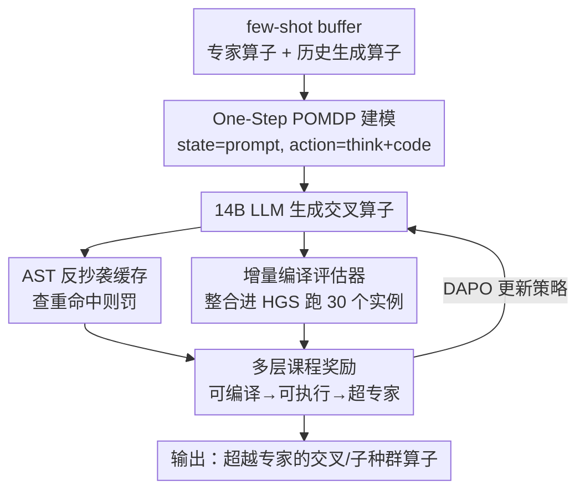

# Refining Hybrid Genetic Search for CVRP via Reinforcement Learning-Finetuned LLM

**会议**: ICLR 2026  
**OpenReview**: [https://openreview.net/forum?id=aITKXFeivk](https://openreview.net/forum?id=aITKXFeivk)  
**代码**: 无  
**领域**: 强化学习 / 组合优化 / LLM 微调  
**关键词**: CVRP, 混合遗传搜索, 算子生成, 强化微调, 课程奖励

## 一句话总结
本文提出 RFTHGS，用强化学习微调一个 14B 小模型，让它为混合遗传搜索（HGS）求解器自动生成交叉（crossover）算子，在 CVRP 上生成的算子超过人类专家手工设计的算子，并在最大 1000 节点的实例上稳定泛化，性能压过 GPT-4o / o3 / o4-mini 等万亿级商用大模型。

## 研究背景与动机
**领域现状**：用 LLM 求解车辆路径问题（VRP）是当前组合优化的前沿。主流做法是把 GPT-4 这类通用大模型当"启发式设计师"，要么直接端到端生成解，要么用 in-context prompting 在进化框架里充当交叉/变异算子（如 EoH、ReEvo、Hercules），通过进化迭代不断精炼 LLM 生成的启发式。

**现有痛点**：端到端让 LLM 直接出解，常常给出不可行解或远逊于传统/深度求解器的解，根源是 LLM 爱"幻觉"。而 prompting 路线虽然把 LLM 嵌进进化循环，但严重依赖闭源大模型的 API，成本高、不可控，并且与传统/深度求解器之间仍有显著性能差距，难以直接搬到大规模真实实例上。

**核心矛盾**：现实大规模实例靠的是 HGS 这类成熟的先进求解器，而它内部的关键算子是人类专家手工打磨出来的。一个尖锐的问题是：能不能微调一个**小** LLM，去优化先进求解器内部的关键组件，从而**超过专家水平**——而不是另起炉灶让 LLM 当独立求解器？

**本文目标**：(1) 让小模型生成的算子能编译、能执行；(2) 让这些算子真正超过 HGS 里专家设计的交叉算子；(3) 在远超训练规模的实例上泛化。

**切入角度**：不把 LLM 当求解器，而把它当 HGS 框架内一个可被持续精炼的"算子生成器"，用 HGS 实际跑出来的解质量作为强化学习的奖励信号反向打磨 LLM。

**核心 idea**：用 RL 微调一个 14B 推理模型生成 HGS 的交叉算子，配一个"可编译→可执行→超越专家"的多层课程奖励，并用 AST 反抄袭缓存防止奖励作弊。

## 方法详解

### 整体框架
RFTHGS 是一个**闭环迭代**框架：每一步先给 LLM 喂一个 few-shot CoT prompt（含算子优化指令 + 若干已有算子示例），让它生成新的交叉算子代码；把生成的算子整合进 HGS 库、用增量编译重新编译，在固定的 30 个 CVRP 实例上跑出目标值；据此算出一个多层奖励，再用 DAPO 更新 LLM 策略。注意 LLM **只能看到算子示例**，看不到具体 CVRP 实例、也看不到整个求解器代码库——这正是把任务建模成"部分可观测"的原因。整个过程被形式化为一个 **one-step POMDP**：状态是 prompt，动作是 LLM 一次生成的算子，生成完即终止，没有状态转移。

### 关键设计

**1. One-Step POMDP 建模与 few-shot 经验缓冲：把"写算子"变成可学的单步决策**

直接让 LLM 反复改一个算子会带来上下文爆炸和不稳定的多步信用分配。本文把它收成最干净的形式：状态 $X$ 是 tokenize 后的 prompt，只放**目标算子本身**（如 HGS 的交叉算子）而非整个求解器库，这使环境天然"部分可观测"——模型只看到完整状态空间（整个求解器仓库）的一个子集。动作 $Y\sim p(\cdot|X)$ 是一段 token 序列，先在 `<think>...</think>` 里写推理，再输出优化后的算子代码；生成结束状态即终止，因此只有一步、无状态转移。为增强多样性，作者维护一个 few-shot **buffer**，里面既有训练中 LLM 自己生成的算子、也有专家算子，每步随机采样去拼 prompt，让模型同时去"改进自己的历史产物"和"改进专家算子"，丰富初始状态分布、抑制过拟合。

**2. 多层课程奖励：用连续奖励把"会编译→能跑→超专家"拆成可攀爬的台阶**

指令微调模型常连合法代码都写不出，若只在"是否超过专家"上给稀疏奖励，训练几乎无信号。作者按课程学习把奖励分三阶段递进。给定生成算子 $o$，以及可编译集 $C$、可执行集 $E$、抄袭集 $P$：

$$r(o)=\begin{cases}-1 & o\notin C\\ -0.8 & o\in C,\ o\notin E\\ -0.9 & o\in C,\ o\in E,\ o\in P\\ \max\!\big(-0.7,\ [\phi^J_{HGS}(o_{expert})-\phi^J_{HGS}(o)]/\phi^J_{HGS}(o_{expert})\big) & o\in C,\ o\in E,\ o\notin P\end{cases}$$

其中 $\phi^J_{HGS}(\cdot)$ 是算子在 $J$ 个随机 CVRP 实例上的平均目标值。可编译给 $-0.8$（鼓励尽快脱离非法代码），可执行给 $-0.7$ 起底，最终阶段把"相对专家算子的解质量提升"线性映射成奖励——超过专家为正、不如为负。关键是这是**连续**奖励而非"超过就 $+1$"的离散版（消融中的 FRTHGS$_d$）：连续奖励给出与性能增益成正比的反馈，能支撑持续精炼，这也是它优于离散版的原因。

**3. AST 反抄袭缓存：防止模型把 prompt 里的示例原样抄回来骗奖励**

因为 prompt 里塞了高分算子示例，模型很容易直接复制示例去拿高奖励（reward hacking），既无探索也无进步。作者把所有 few-shot 示例算子的**抽象语法树（AST）**缓存起来——AST 抽掉标点、格式等表层细节，只保留逻辑结构。对每个新生成算子求 AST 并与缓存比对，一旦"实质性匹配"判定为抄袭，奖励里直接给 $-0.9$ 的惩罚（见上式 $o\in P$ 分支）。这样就把"照抄"的收益压到比"原创但平庸"还低，逼模型去探索结构上新颖的算子。

**4. 增量编译评估器 + DAPO 训练：把评估瓶颈和长链优化同时解决**

每评估一个算子都要把它塞回 HGS 库重编译，整库编译在大 batch 下开销惊人。作者用**增量编译**只重编译被改动的代码片段及其依赖，把重编译时间降到整库编译的约 25%，大幅加速训练。强化算法上采用 **DAPO**（GRPO 的改进版），其 Clip-Higher 解耦上下裁剪边界、鼓励对低概率但有潜力 token 的探索以防熵坍缩；Token 级策略梯度损失对长推理链每个 token 等权，更精细；Overlong Reward Shaping 对超长但有效的推理做软惩罚。值得注意的是 DAPO 的 Dynamic Sampling（过滤掉全对/全错的 prompt 组）在本文被**弃用**——因为这里奖励是连续的，从"不可编译"到"显著超专家"的各种情形都携带有用学习信号，不存在零优势的组。

### 损失函数 / 训练策略
策略初始化为 Qwen-14B 推理模型。DAPO 采用原文最优设置 $\varepsilon_{high}=0.28$、$\varepsilon_{low}=0.2$；batch size 16、rollout group size 16，故每步生成 $16\times16=256$ 个交叉算子。训练奖励在从 CVRPLIB X 实例采样的固定 30 个实例上计算（限定不超过 400 节点）。测试时采样 16 个算子取最优。底层目标沿用 GRPO 的组归一化优势：$A_{\pi_k}(x,y_i)\simeq [r(x,y_i)-\mu(\{r_\ell\})]/\sqrt{\sigma^2(\{r_\ell\})+\varepsilon}$。

## 实验关键数据

### 主实验
在 CVRPLIB X 实例上按规模分桶评测，指标为相对最优解的 Gap%（越低越好）。RFTHGS 仅在 $n<400$ 上训练，却能泛化到 1000 节点。

| 规模区间 | HGS-PyVRP800 | OR-Tools | LKH | POMO | GPT-4o800 | RFTHGS800 |
|---------|-------------|----------|-----|------|-----------|-----------|
| $n\in[100,200)$ | 0.62 | 4.26 | 1.42 | 13.30 | 0.62 | **0.70** |
| $n\in[400,600)$ | 1.95 | 4.98 | 2.85 | 22.07 | 1.95 | **1.83** |
| $n\in[800,1000]$ | 2.32 | 4.65 | 3.31 | 41.23 | 2.32 | **2.24** |

在更高编译/迭代预算下（RFTHGS1200），$n\in[100,200)$ 的 Gap 进一步降到 0.46，全面优于专家 HGS 与各 GPT 变体。一个关键观察：GPT-4o/o3/o4-mini 改出的交叉算子，性能与"原始未改算子"几乎**完全一致**——说明它们做的修改根本没起作用。

### 消融实验

| 配置 | $n\in[100,200)$ Gap% | $n\in[800,1000]$ Gap% | 说明 |
|------|------|------|------|
| HGS（专家算子） | 0.62 | 2.32 | 基线 |
| FRTHGS$_d$（离散奖励） | 0.83 | 2.30 | 小规模反而劣于专家 |
| FRTHGS$_c$（连续奖励，完整） | **0.70 / 0.46\*** | **2.24** | 连续奖励持续精炼 |

| 模型 | 成功编译率 |
|------|-----------|
| GPT-4o | 3/16 |
| GPT-o3 | 9/16 |
| GPT-o4-mini | 3/16 |
| RFTHGS-14B | **16/16** |

### 关键发现
- **连续 vs 离散奖励**：离散奖励（FRTHGS$_d$）在小规模上甚至差于专家（0.83 vs 0.62），连续奖励才能提供与增益成比例的反馈、支撑持续超越——这是奖励设计里贡献最大的一点。
- **编译率碾压**：14B 微调模型达到 16/16 完美编译率，而万亿级 GPT 只有 3~9/16，且即便编译成功，其修改也"无功能性帮助"。
- **学习曲线相变**：训练约第 200 步出现拐点，生成算子开始超过专家基线；奖励分布热图呈现清晰的三阶段课程迁移（先聚在低奖励学语法，再到中段学可执行，最后密度迁向最高奖励区）。
- **双重泛化**：以 800 迭代预算训练的模型在 1000/1200 预算下仍稳超专家；只在 $n<400$ 训练却能泛化到 $n=1000$。

## 亮点与洞察
- **小模型 + 专精微调 > 通用大模型**：14B 模型经任务特定 RL 微调，在生成求解器组件这件事上压过万亿参数 GPT，挑战了"VRP 的 LLM 启发式必须靠 GPT-4"的范式——这是本文最"啊哈"的结论。
- **AST 反抄袭是治 reward hacking 的巧招**：当 prompt 里含高分示例时，复制是最省力的高奖励路径；用 AST 结构比对把"照抄"的奖励压到比平庸原创还低，直接堵死作弊捷径，思路可迁移到任何"示例驱动的代码生成 RL"。
- **课程奖励 + 增量编译的工程闭环**：把"会编译/能跑/超专家"做成阶梯，再用增量编译把评估成本砍到 25%，让"在真实求解器里跑解质量当奖励"这件昂贵的事变得可行。
- **算子级而非解级介入**：优化求解器内部的一个可替换组件（交叉算子、子种群算子），既保留 HGS 全部成熟机制，又只在最该创新的地方注入 LLM——这种"在专家框架里精修关键件"的范式可推广到其他元启发式。

## 局限与展望
- **任务范围窄**：只验证了 CVRP 和 HGS 的交叉（及附录的子种群）算子，是否能推广到 TWVRP、PDP 等更复杂变体或其他求解器（LKH、OR-Tools）尚未充分检验。
- **奖励评估开销**：即便有增量编译，每步仍要在 30 个实例上跑 HGS 评估 256 个算子，训练算力门槛仍高；30 个固定实例的选择也可能影响泛化方向。
- **依赖现成强求解器**：方法的上限被 HGS 框架本身锁住——它在"精修专家组件"，无法发现需要重构整体算法的全新解法。
- **可解释性有限**：论文指出 LLM 改出的算子相对专家算子的关键改动放在补充材料，但对"为什么这些改动有效"缺乏机制性解释。

## 相关工作与启发
- **vs EoH / ReEvo（prompting + 进化）**：它们用闭源大模型 + 进化选择迭代精炼启发式，依赖 API、与传统求解器仍有差距；本文用 RL **微调小模型**直接超过专家算子，且 ReEvo 在大规模上 Gap 高达 100%+，本文稳定在个位数。
- **vs CALM（把 RL 微调嵌进进化循环）**：CALM 让模型与启发式协同进化，本文聚焦"在成熟求解器 HGS 内部精修关键算子"，并用 one-step POMDP + 多层课程奖励 + AST 反抄袭把训练做稳。
- **vs 商用 GPT 系列（GPT-4o/o3/o4-mini）**：万亿参数模型编译率低、修改无效；本文证明任务特定微调的 14B 小模型在生成有效求解器组件上更可靠。

## 评分
- 新颖性: ⭐⭐⭐⭐⭐ 首次证明小模型 RL 微调能生成超越专家的先进求解器组件，AST 反抄袭 + 连续课程奖励都很有想法。
- 实验充分度: ⭐⭐⭐⭐ 覆盖多规模、多基线、双重泛化与奖励/编译消融，但仅限 CVRP + HGS，求解器/问题广度待扩。
- 写作质量: ⭐⭐⭐⭐ POMDP 建模与奖励公式清晰，Figure 流程与课程学习叙述到位。
- 价值: ⭐⭐⭐⭐⭐ "在专家框架里精修关键件"的范式对组合优化与 LLM-for-OR 社区都有很强的实用启发。

<!-- RELATED:START -->

## 相关论文

- [\[ICLR 2026\] Multimodal LLM-assisted Evolutionary Search for Programmatic Control Policies](multimodal_llm-assisted_evolutionary_search_for_programmatic_control_policies.md)
- [\[ICLR 2026\] A$^2$Search: Ambiguity-Aware Question Answering with Reinforcement Learning](a2search_ambiguity-aware_question_answering_with_reinforcement_learning.md)
- [\[ICLR 2026\] Erase to Improve: Erasable Reinforcement Learning for Search-Augmented LLMs](erase_to_improve_erasable_reinforcement_learning_for_search-augmented_llms.md)
- [\[ACL 2025\] TreeRL: LLM Reinforcement Learning with On-Policy Tree Search](../../ACL2025/reinforcement_learning/treerl_tree_search_rl.md)
- [\[ICLR 2026\] J1: Incentivizing Thinking in LLM-as-a-Judge via Reinforcement Learning](j1_incentivizing_thinking_in_llm-as-a-judge_via_reinforcement_learning.md)

<!-- RELATED:END -->
