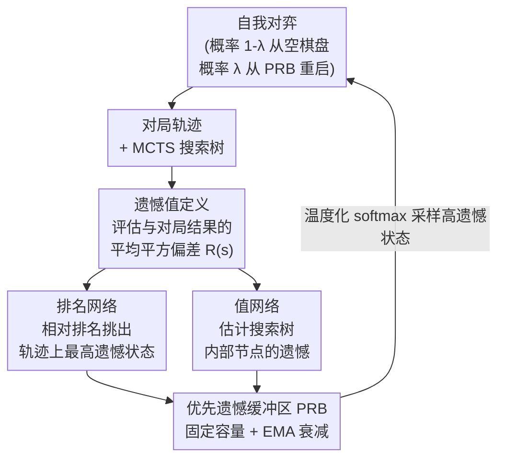

# Regret-Guided Search Control for Efficient Learning in AlphaZero

**会议**: ICLR 2026  
**arXiv**: [2602.20809](https://arxiv.org/abs/2602.20809)  
**代码**: [Project Page](https://rlg.iis.sinica.edu.tw/papers/rgsc)  
**领域**: 强化学习  
**关键词**: AlphaZero, search control, regret network, MCTS, board games

## 一句话总结

提出 RGSC（Regret-Guided Search Control）框架，通过训练一个 regret 网络识别高遗憾值状态并优先从这些状态重新开始自我对弈，模拟人类"反复复盘错误"的学习方式，在 9×9 围棋、10×10 黑白棋和 11×11 Hex 上平均超越 AlphaZero 77 Elo。

## 研究背景与动机

**学习效率差距**：AlphaZero 需要数百万局自我对弈才能达到超人水平，而人类棋手通过远少的对局就能获得可比的棋力，关键区别在于学习方式不同。

**人类学习模式**：人类棋手不会每次都从头开始下完整棋局，而是反复复盘关键位置（犯错的地方），直到弱点被纠正。AlphaZero 则总是从空棋盘开始，对所有位置均匀更新。

**Search Control 的概念**：Sutton & Barto 在 Dyna 框架中提出的 search control 思想——选择有价值的状态作为模拟经验的起点，而非总是从初始状态开始。

**Go-Exploit 的局限**：先前工作 Go-Exploit 实现了从历史状态重启自我对弈，但采用均匀采样，无法区分状态的学习价值。随着训练推进，大多数状态已被掌握，均匀采样效率急剧下降。

**非平稳性挑战**：高遗憾状态在被反复访问后其遗憾值会下降，直接预测遗憾值面临分布严重不平衡和目标非平稳的双重困难。

## 方法详解

### 整体框架

RGSC 把"反复复盘自己下错的地方"这一人类学习习惯搬进 AlphaZero 的自我对弈循环。它先给每个棋局状态定义一个遗憾值来度量"智能体在这里错得有多离谱"，再训练一个 regret 网络（含排名头与值头）把高遗憾状态挑出来，存入一个优先遗憾缓冲区（PRB），之后的自我对弈不再总从空棋盘开始，而是有一定概率从这些高遗憾状态重启，把训练算力集中在尚未掌握的薄弱位置上。整个流程是一个闭环：对弈产出轨迹与搜索树 → 算遗憾 → 排名头与值头分别从轨迹和树内部挑高遗憾状态 → 进 PRB → 下一轮对弈从 PRB 重启。

### 关键设计

**1. 遗憾值定义：用"评估与结果的偏差"标记尚未掌握的状态**

要让智能体知道该回头复盘哪里，先得有一个量化"哪里学得差"的信号。RGSC 把状态 $s_t$ 的遗憾值定义为从该状态走到终局 $s_T$ 这段轨迹上，所选动作的 MCTS 评估值与最终对局结果之间的平均平方偏差：$R(s_t) = \frac{1}{T-t} \sum_{i=t}^{T-1} (V_{\text{selected}}(s_i) - z)^2$，其中 $z$ 是这局棋的真实胜负结果。当智能体在某个状态附近的评估一直与真实结果对不上时，遗憾值就高，这恰好对应它评估偏差最大、最没学透的关键位置——这些位置的学习潜力最高，正是应该优先复盘的地方。

**2. 排名网络：把"预测遗憾值"换成"找出相对最高遗憾"，绕开非平稳目标**

直接回归遗憾值很难学：绝大多数状态遗憾接近零导致分布严重不平衡，而高遗憾状态一旦被纠正遗憾又会下降，目标本身是非平稳的。RGSC 转而只学一个相对排名——网络输出未归一化的排名分数 $\gamma_s$，经 softmax 转成重启分布 $\rho(s\mid S)$，优化目标是让高遗憾状态拿到高采样概率，即最大化 $J_{\text{rank}} = \sum_s \rho(s\mid S)\,R(s)$。实际训练用代理损失 $L_{\text{rank}} = -\log \sum_s \exp\big(\log\text{softmax}(\gamma_s) + R(s)\big)$，通过指数变换在保持遗憾排序的同时把高概率压向高遗憾状态。因为只需判断"谁的遗憾相对更高"而非给出精确数值，排名目标对分布不平衡和非平稳都不敏感，学习难度大幅下降。

**3. 值网络：补上搜索树内部节点的遗憾估计，扩大重启状态的多样性**

自我对弈轨迹上的状态有完整的后续走子，能直接按上面的公式算出遗憾；但 MCTS 搜索树里那些探索过却没真正走到的内部节点缺少完整轨迹，算不出遗憾值。RGSC 为此加了一个值网络专门估计这些内部节点的遗憾。这样可重启的高遗憾状态就不再局限于实际走过的那条路径，而是把搜索树中被探索却未落子的潜在薄弱位置也纳入进来，让复盘的覆盖面更广、更多样。

**4. 优先遗憾缓冲区（PRB）：用 EMA 衰减模拟"复盘到真正理解"的过程**

PRB 维护一个固定容量 $K$ 的高遗憾状态集合作为重启点。每局自我对弈结束后，排名网络选出最高排名的状态，只有当它的遗憾值高于 PRB 中当前最低遗憾状态时才替换进来。重启采样时用温度化的 softmax 分布 $P(s_i) \propto R(s_i)^{1/\tau}$ 偏向高遗憾状态。关键在于状态被重新对弈后并不直接把遗憾归零，而是用指数滑动平均更新 $R_{\text{new}} \leftarrow (1-\alpha)R_{\text{old}} + \alpha R$，让遗憾只在智能体反复练习并真正掌握后才逐渐衰减——这正对应人类"反复复盘同一处错误直到彻底想通"的过程，避免一次纠正就草率丢弃尚未稳固的状态。

### 损失函数 / 训练策略

排名头与值头都作为 AlphaZero 主干网络的额外输出头联合训练，因此额外计算开销极小，且随网络 block 数增大愈发可忽略。排名头用代理损失 $L_{\text{rank}}$ 维持遗憾排序，值头用标准 MSE 回归拟合状态遗憾值。自我对弈时以概率 $1-\lambda$ 从空棋盘开始保证棋局完整性，以概率 $\lambda$ 从 PRB 采样状态重启把算力投向薄弱位置。

## 实验关键数据

### 主实验

**三种棋类游戏的 Elo 提升（300 iterations，每种 ~150 A6000 GPU hours）**：

| 游戏 | AlphaZero | Go-Exploit | RGSC | RGSC vs AZ | RGSC vs GE |
|------|-----------|-----------|------|-----------|-----------|
| 9×9 Go | 1000 (ref) | +低 | +76 Elo | +76 | +96 |
| 10×10 Othello | 1000 (ref) | +20 | +70 Elo | +70 | +50 |
| 11×11 Hex | 1000 (ref) | -38 | +84 Elo | +84 | +122 |

**对战外部强程序的胜率**：

| 游戏 | 对手 | AlphaZero | Go-Exploit | RGSC |
|------|------|-----------|-----------|------|
| 9×9 Go | KataGo | 45.5% | 49.5% | **53.6%** |
| 10×10 Othello | Ludii α-β | 51.7% | 52.9% | **57.8%** |
| 11×11 Hex | MoHex | 83.6% | 89.2% | **91.1%** |

### 消融实验

**排名网络 vs 值网络的状态选择质量**：

| 方法 | 9×9 Go avg regret | 10×10 Othello avg regret | 效果 |
|------|-------------------|-------------------------|------|
| Go-Exploit (均匀) | 最低 | 最低 | 基线 |
| Regret Value Net | 中等 | 中等 | 次优 |
| **Regret Ranking Net** | **最高** | **最高** | **最优** |

**在已训练好的模型上继续训练（15-block，9×9 Go，40 iterations）**：

| 方法 | 对 KataGo 胜率 |
|------|---------------|
| 基线（训练前） | 69.3% ± 2.6% |
| AlphaZero 继续训练 | 70.2% ± 2.7%（几乎无提升） |
| Go-Exploit | 69.2% ± 2.7%（无提升） |
| **RGSC** | **78.2% ± 2.5%**（+8.9%） |

### 关键发现

1. **Go-Exploit 后期失效**：Go-Exploit 在训练前期有效（大量状态未被掌握），但后期随着掌握状态增加，均匀采样的效率急剧下降，甚至不如 AlphaZero。
2. **排名优于回归**：排名网络始终选出遗憾值更高的状态，验证了在非平稳、不平衡分布下排名目标优于直接值回归。
3. **PRB 中的遗憾值确实下降**：所有游戏中，状态入 PRB 时的平均遗憾显著高于被移除时（Go: 0.655→0.296），证明 RGSC 确实纠正了错误。
4. **强模型仍可提升**：RGSC 在已经训练良好的模型上继续提升了 8.9% 的胜率，而 AlphaZero 和 Go-Exploit 均停滞。

## 亮点与洞察

1. **模拟人类学习的优雅实现**：人类反复复盘错误的学习方式被自然地转化为 regret-guided search control，动机清晰、实现简洁。
2. **排名目标的巧妙设计**：绕过了直接预测非平稳目标的困难，只需区分相对大小即可，大幅降低了学习难度。
3. **搜索树内部节点的利用**：不仅利用轨迹上的状态，还利用 MCTS 探索但未实际走到的状态，扩大了可重启状态的多样性。
4. **极小的额外开销**：regret network 只是 AlphaZero 网络的两个额外输出头，随着 block 数增加，开销可忽略。
5. **通用性潜力**：初步实验表明 RGSC 可应用于 MuZero（Pac-Man），暗示其适用于更广泛的 RL 场景。

## 局限与展望

1. **仅验证于棋类游戏**：棋类是确定性、完全信息游戏，RGSC 在随机环境或不完全信息场景下的效果需进一步验证。
2. **遗憾定义的局限**：当前遗憾定义基于 MCTS 评估与结果的偏差，在连续控制任务中如何定义遗憾需要新的设计。
3. **PRB 容量固定**：固定大小的缓冲区在复杂游戏中可能不足以覆盖所有关键状态。
4. **未探索 19×19 围棋**：文章在 9×9 围棋上验证，但更大棋盘上的扩展性仍待验证。

## 相关工作与启发

- **Go-Exploit**：首次在 AlphaZero 中系统性地研究 search control，但均匀采样的局限性被 RGSC 的优先采样所克服。
- **KataGo** 的随机开局策略启发了从非初始状态开始训练的思路。
- **Prioritized Experience Replay**：RGSC 的 PRB 某种程度上是经验回放优先采样在搜索控制层面的推广。
- **启发**：regret-guided 的思想可推广到其他需要集中学习困难样本的场景，如课程学习、主动学习等。

## 评分

- **新颖性**: ⭐⭐⭐⭐ regret ranking network 的设计新颖，解决非平稳目标预测的方式巧妙；但整体思路是 PER 思想在 search control 的自然延伸
- **实验充分度**: ⭐⭐⭐⭐⭐ 三种棋类游戏全面验证，包含对强开源程序的胜率评估、排名vs值网络消融、已训练模型继续提升实验
- **写作质量**: ⭐⭐⭐⭐ 动机讲述清晰（人类vs机器学习对比图直观），方法推导完整，实验展示清楚
- **价值**: ⭐⭐⭐⭐ 为 AlphaZero 训练效率提升提供了简洁有效的方案，有推广到更广泛 RL 场景的潜力

<!-- RELATED:START -->

## 相关论文

- [\[ICLR 2026\] Multimodal LLM-assisted Evolutionary Search for Programmatic Control Policies](multimodal_llm-assisted_evolutionary_search_for_programmatic_control_policies.md)
- [\[ICLR 2026\] GoldenStart: Q-Guided Priors and Entropy Control for Distilling Flow Policies](goldenstart_q-guided_priors_and_entropy_control_for_distilling_flow_policies.md)
- [\[ICLR 2026\] Efficient Morphology-Control Co-Design via Stackelberg Proximal Policy Optimization](efficient_morphology-control_co-design_via_stackelberg_proximal_policy_optimizat.md)
- [\[ICLR 2026\] WIMLE: Uncertainty-Aware World Models with IMLE for Sample-Efficient Continuous Control](wimle_uncertainty-aware_world_models_with_imle_for_sample-efficient_continuous_c.md)
- [\[ICLR 2026\] Q-Learning with Fine-Grained Gap-Dependent Regret](q-learning_with_fine-grained_gap-dependent_regret.md)

<!-- RELATED:END -->
