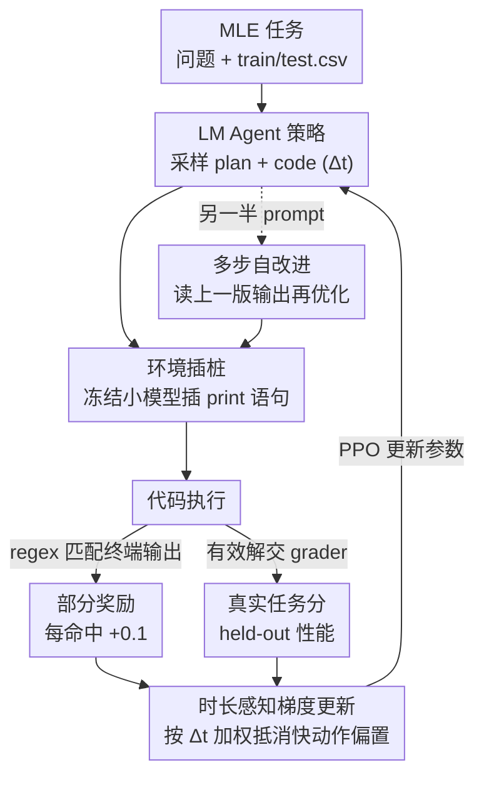

# Reinforcement Learning for Machine Learning Engineering Agents

**会议**: ICLR 2026  
**OpenReview**: [https://openreview.net/forum?id=mfIbSouoaZ](https://openreview.net/forum?id=mfIbSouoaZ)  
**代码**: https://github.com/sherryy/rl4mle  
**领域**: 强化学习 / Agent  
**关键词**: ML工程Agent, 异步RL, 时长感知梯度, 环境插桩, 部分奖励

## 一句话总结
本文指出：在有可靠 verifier 的机器学习工程（MLE）任务里，与其反复 prompt 一个冻结的大模型，不如用 RL 去更新一个小模型（Qwen2.5-3B）的参数——只要给够算力，小模型经 RL 适配后能在 12 个 Kaggle 任务上以平均 22% 的优势反超用 SOTA scaffold（AIDE）驱动的 Claude-3.5-Sonnet；为此作者解决了异步 RL 的两个痛点：用「时长感知梯度」纠正快动作偏置、用「环境插桩」把稀疏奖励变成可验证的部分奖励。

## 研究背景与动机

**领域现状**：现有 MLE agent 的主流做法是「prompt 前沿大模型 + agent scaffold」，靠在上下文里存取过往经验（非参数化地积累经验）来提升，本质是 test-time compute 的 scaling——多采样、多搜索、多调试。

**现有痛点**：不更新参数意味着 agent 的根本行为不会变。论文给出一个很扎心的观察：用 MLEBench 公认最强的 scaffold 驱动 Claude-3.5-Sonnet 跑上好几天，best solution 也只是「略微」变好。昂贵的 ML 实验跑出来的宝贵经验，因为没有梯度更新而被白白浪费。

**核心矛盾**：当任务自带一个好的 verifier（如 held-out 数据上的性能）时，把这个可验证信号只用来「挑选」候选解，远不如用它来「训练」模型参数高效。换句话说，算力不该只花在 inference 和 interaction 上，还应该花一部分在 gradient update 上。

**本文目标**：把 RL 真正用到 MLE agent 上，但要克服 agentic setting 给 RL 带来的两个特有障碍。**障碍一**：动作执行时长可变（训不同 ML 模型耗时差异巨大），在异步分布式 RL 里这会让「快动作」被采样得更频繁、累积更多梯度，于是策略偏向「又快又次」的解（如直接上 linear logistic regression）。**障碍二**：只用 held-out 性能当奖励反馈太稀疏——一个「差一点就对」的程序（比如只是没把结果存到正确路径）和一个「彻底崩」的程序（数据都没加载成功）拿到的奖励一样，甚至会逼出根本不用 ML 的投机解（直接手写 Jaccard 相似度去搜答案，绕开 ML）。

**核心 idea**：在分布式异步 RL 框架里，用 **duration-aware gradient** 抵消快动作的频率偏置、放大「高成本但高回报」的动作；再用一个**冻结的同款小模型**给 agent 代码插 print 语句、靠 regex 匹配输出来发放 **可验证的部分奖励**，把稀疏信号稠密化。

## 方法详解

### 整体框架

把 MLE 建模成一个 MDP：状态 $S$ 是给 agent 的输入（问题描述、数据集、实验历史），动作 $A$ 是 agent 生成的 plan + code，转移 $P$ 是代码执行后环境的输出（报错、训练 loss 等，且因 ML 训练随机性而 stochastic），奖励 $R$ 是解在 held-out 数据上的性能。RL 目标是最大化期望回报 $J(\pi)=\mathbb{E}_{\pi,\mu,P}[\sum_{k=0}^{K} R(s_k,a_k)]$，用 PPO 优化。

整条 pipeline 是一个闭环：**LM agent** 采样出 plan+code 动作 → 交给**环境插桩**模块（一份冻结的小模型）往代码里插 print 语句 → **代码执行**后，一路把终端输出做 regex 匹配抽取**部分奖励**、一路把有效解交给 grader 得到真实任务分 → 奖励连同动作执行时长 $\Delta t$ 回到 learner，用**时长感知梯度**做策略更新。此外，agent 既可以「从零解题」，也可以被显式要求「改进上一版解」（**多步自改进**），两类 prompt 各占一半。

### 关键设计

**1. 时长感知梯度更新：让慢但好的动作不被异步采样埋没**

异步分布式 RL 里多个 actor 各跑各的环境，把经验送给 learner。问题在于：在固定时长 $T$ 内，执行快的动作 $x$ 会被采到 $n_x \approx \pi(x|s)\cdot T/\Delta t_x$ 次，慢动作 $y$ 只有 $n_y \approx \pi(y|s)\cdot T/\Delta t_y$ 次。于是两者对梯度的总贡献 $G_x \propto \frac{1}{\Delta t_x}$、$G_y \propto \frac{1}{\Delta t_y}$，都被各自时长「除」了一下——越快的动作贡献越大，策略被系统性地推向快而次的解（图 2 里 agent 收敛到 <1 秒就跑完的 logistic regression，放弃了分数更高但更慢的解）。

作者的做法直白得几乎像把那个 $\Delta t$ 乘回来：给每条梯度按动作时长加权，$G'_x \propto \pi(x|s)\cdot T$、$G'_y \propto \pi(y|s)\cdot T$，$\Delta t$ 项被抵消，每个动作的贡献只与它的策略概率和 advantage 成正比，而与「被采样多频繁」无关。推广到连续情形就得到时长感知策略梯度：

$$\nabla_\theta J(\pi_\theta) = \mathbb{E}_{\pi,\mu,P}\left[\sum_{k=0}^{K} \Delta t_k \cdot \nabla_\theta \log \pi_\theta(a_k|s_k)\cdot \hat{A}(s_k,a_k)\right]$$

其中 $\Delta t_k$ 是动作 $a_k$ 的执行时长。实践中会把 $\Delta t_k$ 按 batch 内平均执行时间 rescale，避免梯度爆掉。附录给出了它在分布式 RL 下仍是无偏策略梯度估计的证明。这样 agent 才敢去探索 gradient boosting 这类「更贵但回报更高」的动作（消融里 PPO+DAG 比 vanilla PPO 平均高 3.85%）。

**2. 环境插桩发放部分奖励：把稀疏的成败信号变成稠密的进度信号**

只用最终性能当奖励，等于把「数据没加载成功」和「差一步存盘」打成同一分，RL 很难学。作者不想对「agent 该怎么解题」做过强假设，所以只按一串高层步骤是否完成来给分：导入库 → 加载数据 → 构建模型 → 训练模型 → 在 held-out 上运行。实现上，用**另一份冻结的原始小模型**（同样是 Qwen2.5-3B，不做任何梯度更新）去读 agent 生成的代码，在对应位置插入 `print("loaded data")` 这类语句；执行后用 regex 在终端输出里匹配预期的 print 是否出现，命中一条给 +0.1（共 7 个候选 print 语句）。

**为什么必须用冻结模型**是这个设计的关键：如果让正在被 RL 优化的同一个模型来生成 print 语句，它几乎一定会 reward hacking（自己印自己想要的字串骗分）；冻结插桩模型能很大程度上堵住这条路。为进一步防 hacking，作者还把部分奖励和最终奖励放在**完全不同的量级**上：彻底失败的解给 -10，每个 print 命中只 +0.1，而一旦解有效、过了 grader，就直接用真实任务分（一般在 -1 到 1 之间）当奖励。这样「老老实实产出有效 ML 解」拿到的奖励远高于「凑 print 骗分」，从机制上把 agent 往真做 ML 的方向引（消融里 PPO+EI 比 vanilla PPO 平均高 22.06%，且明显减少「整轮训练产不出任何有效解」的崩溃情况）。

**3. 多步 RL 与自改进 prompt：让 agent 既会从零解题、也会改进旧解**

除了从零解题，作者还想让 agent 学会迭代优化。具体做法是从两类 prompt 中等概率采样：一类「从头解决问题」，一类「改进上一步生成的解」。改进时把上一版的终端输出（含来自环境插桩的训练/测试精度信息）喂回给 agent。作者也试过把「失败的执行」给 agent 让它自我 debug，但发现小模型的自我调试能力很有限，所以主要用「改进有效解」这一路。测试时两路都跑——既从零生成、也再跑一遍改进——取两者中更优的解。这一项让 12 个任务里有 10 个拿到更好的最终性能，平均提升 8%，说明 RL 能同时把「初始解生成」和「改进旧解」两种能力一起练上去。

### 一个完整示例

以 `lmsys-chatbot-arena`（预测用户更偏好哪个 LM 回复）为例走一遍：agent 先采样出一版 plan+code（如用 TF-IDF + 随机森林）；冻结的环境 LM 在代码里插入 `print("imported packages")`、`print("loaded data")` 等语句；执行后 regex 命中前几个步骤、每个 +0.1，给出稠密的进度奖励，有效解再由 grader 打真实分。下一轮 agent 被要求「改进上一版」，读到上一版输出后提出新的特征工程——早期只是用「两个回复的长度差」当特征，后期升级成「词数差、平均词长差」等更丰富的特征（图 6）。时长感知梯度保证这些「更贵但更准」的特征方案不会因为执行慢而被快解挤掉，于是分数随训练稳步爬升，最终在这个 ↓ 类任务上把 log loss 压到 1.081，低于 Claude-3.5-Sonnet+AIDE 的 2.211。

### 损失函数 / 训练策略

用 PPO（带时长感知梯度修改）逐任务训练 Qwen2.5-3B 直到 reward 收敛，一般 1–3 天、用 8 张 A100-40GiB。奖励设计：彻底失败 -10，每个 regex 命中 +0.1（7 个候选 print），有效解用 grader 真实分（约 -1 到 1）；对「越低越好」的任务翻转分数符号。输入/输出长度都限 1024 token，batch size 128，学习率 1e-5。收敛后取 128 个样本里的 best 作为该任务最终成绩。

## 实验关键数据

评测在 MLEBench（Chan et al., 2024）的 12 个任务上，覆盖视觉、语言、表格输入；任务的筛选标准是「小模型能产出格式合法的 submission」，以便聚焦 MLE 能力本身而非通用指令遵循/编码能力。

### 主实验

RL 适配的小模型 vs. prompt 前沿大模型（均用 AIDE scaffold），取 128 样本中 best：

| 任务（↑越高越好/↓越低越好） | Qwen2.5-3B | Claude3.5-Sonnet | GPT-4o-100hrs | Qwen2.5-3B RL |
|---|---|---|---|---|
| detecting-insults (↑) | 0.870 | N/A | N/A | **0.895** |
| random-acts-of-pizza (↑) | 0.589 | 0.627 | 0.638 | **0.663** |
| tweet-sentiment-extraction (↑) | 0.027 | 0.448 | 0.283 | **0.596** |
| tabular-may-2022 (↑) | 0.787 | 0.743 | 0.883 | **0.913** |
| leaf-classification (↓) | 0.884 | 0.436 | 0.846 | **0.124** |
| nomad2018 (↓) | 0.178 | 0.083 | 0.072 | **0.059** |
| spooky-author (↓) | 0.596 | 0.701 | 0.546 | **0.404** |
| lmsys-chatbot-arena (↓) | 11.48 | 2.211 | 1.451 | **1.081** |

RL 后的 Qwen2.5-3B 在 12 个任务里 8 个拿到最佳，对 Claude-3.5-Sonnet 平均提升 22%；即便没反超的任务，RL 也显著优于「prompt Qwen+AIDE」。值得注意：把 AIDE 从 24 小时延长到 100 小时（GPT-4o-100hrs）并没明显变好，说明单纯堆 inference 时间不解决问题。

### 消融实验

| 配置 | 关键结果 | 说明 |
|---|---|---|
| Full（PPO+DAG+EI+自改进） | 12 任务 8 个 SOTA | 完整方法 |
| w/o 时长感知梯度（DAG） | 比 Full 低 ~3.85% | 去掉后 agent 收敛到快而次的解（logistic regression） |
| w/o 环境插桩（EI） | 比 Full 低 ~22.06% | 去掉后收敛慢、更易整轮产不出有效解 |
| w/o 自改进 prompt | 10/12 任务变差，平均低 8% | 去掉「改进旧解」一路 |
| vs. 不同 scaffold（OpenHands/MLAB on GPT-4o） | 12 任务 9 个反超，平均 +17.7% | RL 对 scaffold 选择不敏感 |

### 关键发现
- 贡献最大的是环境插桩（+22.06%）——稀疏奖励是 MLE-RL 的头号杀手，把成败信号变成稠密进度信号收益最高。
- 时长感知梯度的作用是「方向性」的：它不会逆转「好解通常更快」的整体趋势（平均执行时间仍随训练下降），但能让 agent 敢于探索 gradient boosting 这类更贵的高回报解，不被异步采样的快动作偏置锁死。
- 时间维度上，小模型 RL 起点往往低于 prompt 大模型，但随梯度更新持续爬升，最终反超——印证「把算力分一部分给 gradient update」比只 scaling inference 更划算。

## 亮点与洞察
- **把 verifier 从「选择器」升级为「训练信号」**：同样一个 held-out 评分，论文论证了用它训练参数比用它挑候选解更高效——这是对「test-time compute scaling」叙事的一记有力反例。
- **时长感知梯度的推导极简且通用**：从一个「快慢两动作」玩具例子，直接看出快动作被 $1/\Delta t$ 放大，乘回 $\Delta t$ 即纠偏。任何「动作耗时差异大」的异步 agentic RL（不止 MLE）都能借用。
- **用冻结模型插桩 + 量级隔离防 reward hacking**：让插桩模型与被优化模型解耦，再把部分奖励（+0.1）和真实奖励（量级大得多）拉开档次，是一个很可复用的「稠密化稀疏奖励又不被刷分」的工程范式。

## 局限与展望
- 逐任务单独训练、每任务 1–3 天 + 8×A100，成本高且不跨任务泛化；是「为某个任务榨干算力」而非「训一个通用 MLE agent」。
- 输入/输出截到 1024 token、模型仅 3B，限制了能解的任务复杂度；小模型自我 debug 能力弱，所以失败执行这条更难的反馈路径基本没用上。
- 部分奖励只覆盖固定 7 个高层步骤，对「步骤之外」的进度（如更细的中间指标）无感知；插桩模型虽冻结仍承认「仍可能被 hack」。
- 横向对比要留意 caveat：baseline 来自 MLEBench 原始运行、不同 scaffold/小时数，任务难度与预算不完全可比，22% 是「相对 baseline 的平均增减」而非绝对优势。

## 相关工作与启发
- **vs. AIDE / OpenHands / MLAB 等 scaffold**：它们都靠 prompt 大模型 + 非参数化经验组织（树状存储、保留 best），不更新参数；本文证明「RL 训小模型」对 scaffold 选择不敏感且更可靠（对 best scaffold 仍平均 +17.7%）。
- **vs. 通用 RL-for-LM**：经典 RLHF/PPO 多在 MuJoCo/Atari 或对齐场景，动作时长近似一致、奖励相对稠密；本文针对 MLE 特有的「动作时长可变 + 奖励稀疏」两个痛点提出 DAG 和环境插桩，是把 RL-for-LM 落到真实异步 agentic 工作流的具体补强。

## 评分
- 新颖性: ⭐⭐⭐⭐ 「RL 训小模型反超 prompt 大模型」的论点鲜明，时长感知梯度与环境插桩两个机制都切中 agentic RL 的真实痛点。
- 实验充分度: ⭐⭐⭐⭐ 12 任务、3 个 scaffold、逐项消融都做了；但逐任务训练、对比 baseline 来自原始运行，可比性需留意。
- 写作质量: ⭐⭐⭐⭐ 痛点→机制的推导清晰，玩具例子讲透了时长偏置。
- 价值: ⭐⭐⭐⭐ 给「算力该花在 inference / interaction / gradient update 之间如何分配」提供了有说服力的实证，对 MLE agent 与异步 agentic RL 都有借鉴。

<!-- RELATED:START -->

## 相关论文

- [\[ICLR 2026\] RLVER: Reinforcement Learning with Verifiable Emotion Rewards for Empathetic Agents](rlver_reinforcement_learning_with_verifiable_emotion_rewards_for_empathetic_agen.md)
- [\[ICLR 2026\] Learning to Orchestrate Agents in Natural Language with the Conductor](learning_to_orchestrate_agents_in_natural_language_with_the_conductor.md)
- [\[ICLR 2026\] The State of Reinforcement Finetuning for Transformer-based Agents](the_state_of_reinforcement_finetuning_for_transformer-based_agents.md)
- [\[ICLR 2026\] RLVMR: Reinforcement Learning with Verifiable Meta-Reasoning Rewards for Robust Long-Horizon Agents](rlvmr_reinforcement_learning_with_verifiable_meta-reasoning_rewards_for_robust_l.md)
- [\[ICLR 2026\] ComputerRL: Scaling End-to-End Online Reinforcement Learning for Computer Use Agents](computerrl_scaling_end-to-end_online_reinforcement_learning_for_computer_use_age.md)

<!-- RELATED:END -->
