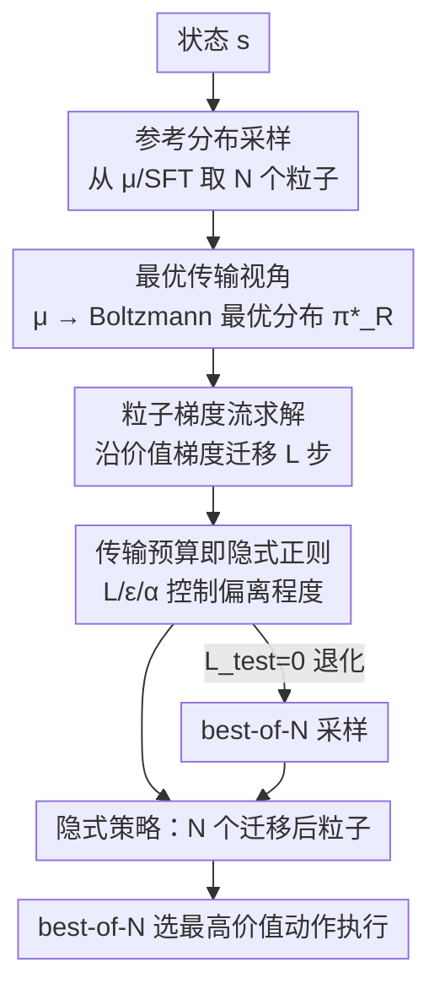

# Reinforcement Learning via Value Gradient Flow

**会议**: ICLR 2026  
**OpenReview**: [https://openreview.net/forum?id=JLL4VNVhM9](https://openreview.net/forum?id=JLL4VNVhM9)  
**代码**: https://ryanxhr.github.io/vgf  
**领域**: 强化学习 / 离线RL / RLHF  
**关键词**: 行为正则化, 最优传输, 梯度流, 隐式策略, 测试时缩放

## 一句话总结
本文提出 Value Gradient Flow（VGF），把"行为正则化 RL"重写成一个从参考分布到价值诱导最优分布的最优传输问题，用粒子梯度流让初始动作沿价值梯度一步步迁移，无需显式策略参数化也无需显式正则项，靠"传输预算"隐式控制偏离程度，在 D4RL、OGBench 和 RLHF 上都拿到 SOTA。

## 研究背景与动机

**领域现状**：无论是离线 RL 还是 LLM 的 RLHF，都不能让策略毫无约束地最大化价值——离线 RL 里数据集外动作会带来严重的价值高估，RLHF 里偏离 SFT 模型太远会"奖励作弊"。因此主流范式是**行为正则化 RL**：在最大化价值的同时，约束策略别离参考分布（离线数据分布 $\pi_D$ 或预训练基座模型 $\mu$）太远。形式化为带约束优化 $\max_\pi \mathbb{E}_{a\sim\pi}[R(s,a)]\ \text{s.t.}\ \mathbb{E}[M(\pi,\mu)]\le\epsilon$。

**现有痛点**：实现这个约束的两类主流做法都有硬伤。第一类是**显式惩罚 + 重参数化策略梯度**：把约束变成带系数 $\beta$ 的惩罚项一起优化。但它用单一系数同时正则化"价值学习"和"策略改进"这两个其实需要不同强度的环节，导致 $\beta$ 极难调；更要命的是要扩展到 diffusion / flow 这类表达力强的生成式策略时，求策略梯度需要对多步采样过程反向传播，既不稳定又昂贵，蒸馏成单步又损表达力。第二类是 **KL 约束下的拒绝采样 / 加权 BC**（极限即 best-of-N）：实现简单，但只能放大参考分布里已有的弱信号，无法学到新技能，过度保守，永远困在行为支撑集内。

**核心矛盾**：约束太松会价值高估、约束太紧又过度保守，而现有方法把这两件事捆在一个系数上；同时"要表达力强的多模态策略"和"要可扩展、可稳定训练"之间也存在冲突。

**切入角度**：作者的关键观察是——带熵正则的最大熵 RL，其最优策略恰好是价值函数上的 Boltzmann 分布 $\pi^*_R(a|s)\propto\exp(R(s,a)/\alpha)$。那么"从参考分布出发去逼近这个 Boltzmann 分布"本质上是一个**把概率质量搬运过去的最优传输问题**，搬多远、搬多频，就天然构成了对偏离程度的隐式约束。

**核心 idea**：不要显式策略、不要显式惩罚项，而是从参考分布采样出一批粒子，用价值梯度引导它们做有限步的"流动"逼近 Boltzmann 最优分布；这"传输预算"本身就是正则化，且训练和推理时可分别设置，从而支持自适应的测试时缩放。

## 方法详解

### 整体框架

VGF 要解决的是：在不显式参数化策略、不加显式惩罚的前提下，求解行为正则化 RL。它的核心转法是把问题看成一次**最优传输**——把质量从参考分布 $\mu$ 搬到价值诱导的 Boltzmann 分布 $\pi^*_R$。整条流程是：先从参考分布（离线 RL 里是 BC 学到的 $\hat\mu$，RLHF 里是 SFT 模型）采出 $N$ 个粒子作为初始动作；然后用价值梯度作为速度场，把每个粒子沿"高价值方向"迁移 $L$ 步（一种离散梯度流）；迁移得到的粒子集合就充当"隐式策略"，不需要任何策略网络；最后用 best-of-N 从这些粒子里挑价值最高的那个执行。价值函数 $Q$ 本身用 TD learning 训练，目标 Q 在所有粒子上取平均。关键在于，搬运的步数 $L$、步长 $\epsilon$、温度 $\alpha$ 共同构成"传输预算"，预算越小越贴近参考分布、越大越敢探索，且训练预算与推理预算可解耦。

### 关键设计

**1. 把行为正则化 RL 重写为最优传输：用"搬多远"代替显式惩罚**

针对"显式惩罚系数难调、把价值学习和策略改进捆在一起"的痛点，VGF 换了一个完全不同的视角。先给价值最大化目标加上策略熵项 $\mathbb{E}_{a\sim\pi}[R(s,a)]+\alpha H(\pi(\cdot|s))$，这个最大熵目标的解析最优策略是 Boltzmann 分布 $\pi^*_R(a|s)=\frac{1}{Z_s}\exp(R(s,a)/\alpha)$。于是"价值最大化"就等价于"把概率质量从 $\mu$ 传输到 $\pi^*_R$"。形式上这是 Wasserstein 度量下泛函 $F(q)=\mathrm{KL}(q\|\pi^*_R)$ 的梯度流。它的好处是：偏离参考分布的程度不再靠一个外加的惩罚系数硬掰，而是由"传输预算"（搬多远、搬几步）隐式且可控地决定——理论上作者证明了初始粒子与 $L$ 步后粒子之间的 MMD 距离有上界 $\mathrm{MMD}^2(\mu,\pi^L_N)\le\frac{2\epsilon L}{\sigma\sqrt{e}}\left(\frac{c}{\alpha}+\frac{1}{\sigma\sqrt{e}}\right)$，即偏离量被传输预算严格约束住。

**2. 粒子梯度流求解器：用价值梯度引导一批粒子，保留多模态**

连续时间的梯度流 $q_t$ 不可直接求解，作者用 JKO 最小移动格式把它离散化为 $q_{k+1}=\arg\min_q \mathrm{KL}(q\|\pi^*_R)+\frac{1}{2h}W_2^2(q,q_k)$，再用 $N$ 个粒子的经验测度近似 $q_k$，并把速度场限制在向量值 RKHS 单位球内，得到可落地的更新式：
$$a^{(l+1)}_i=a^{(l)}_i+\epsilon\cdot\phi(a^{(l)}_i),\quad \phi(x)=\frac{1}{N}\sum_{j}k(a_j,x)\nabla_{a_j}R(s,a_j)$$
（这是 $\alpha\to0$、去掉最大熵项后的形式）。直观上，第一项把粒子推向高价值区域，第二项（带核梯度的斥力，最大熵版才有）让粒子分散、保住多模态。和 BCQ 那种"在参考策略上学一个高斯残差"不同，梯度流天然会**保留并锐化参考分布里的多个高价值模态**，而不是塌缩到单一模态。为加速，作者额外训一个网络 $f(s,a)$ 去拟合 $\nabla_a Q(s,a)$，实验里粒子数固定 $N=5$。

**3. 隐式正则与"突破支撑集"：传输预算可调、敢走出参考分布**

这是 VGF 区别于拒绝采样类方法的关键。加权 BC / best-of-N 受 KL 约束，最终策略支撑集必然被锁在 $\mathrm{supp}_\epsilon(\pi)\subseteq\mathrm{supp}_\epsilon(\mu)$ 之内，过度保守。VGF 因为是用一阶价值梯度主动把粒子推向高奖励模态，作者证明了 $\mathrm{supp}_\epsilon(\pi^L_N)\not\subseteq\mathrm{supp}_\epsilon(\mu)$——即隐式策略**可以走到参考分布支撑集之外**，从而发现新行为。正因为正则化是"隐式"的（由传输预算控制而非外加项），训练和推理可以用不同预算：推理预算设为 0 时 VGF 退化成 best-of-N；推理预算大于训练预算时则带来测试时缩放收益。

**4. LLM / RLHF 下的连续代理空间梯度流**

token 是离散的，无法直接对其做梯度流。作者的做法是：在一个连续代理空间里跑 VGF，只在梯度流最后一步解码回离散 token。令 $u$ 是整条回复 $y$ 的可微表示（token-embedding 矩阵，或 flow/diffusion 语言模型的隐向量 $u=z$，$y=\mathrm{Dec}(z)$）。由于奖励模型对输入 embedding 可微，回复级梯度可经链式法则传回代理空间：$\nabla_{u_i}\log\pi^*_R(y^{(l)}_i|x)=\frac{1}{\alpha}J_i^\top\nabla_y R(x,y^{(l)}_i)$，其中 $J_i=\partial\mathrm{Dec}(u_i)/\partial u_i$。这样 VGF 用一阶梯度引导，避开了 PPO 那种高方差优化，同时又因为 SFT 策略本身已高度集中（概率质量都在少量 token / 模态上），梯度引导能有效地"推动"而非从随机起步，实现近似 best-of-N 的推理期可控对齐。

### 损失函数 / 训练策略
离线 RL 中：先用离线数据训一个 BC 策略 $\hat\mu$ 充当参考分布采样器；$Q$ 函数用 TD learning 训练，目标 Q 在 VGF 迁移后的 $N$ 个粒子上取平均；采用去掉最大熵项的 $\phi$（即 $\alpha\to0$）。额外训 $f(s,a)$ 拟合 $\nabla_a Q$ 以加速。评估时对每个状态跑 $L_{test}$ 步 VGF，再 best-of-N 选动作 rollout。关键超参是训练流步数 $L_{train}$（最重要，控制偏离程度，需按任务调）、步长 $\epsilon$、粒子数 $N=5$。

## 实验关键数据

### 主实验

D4RL 上 VGF 在大多数任务领先，尤其是有挑战性的 AntMaze 导航任务：

| 数据集 | TD3+BC | IQL | Diffusion-QL | FQL | VGF (本文) |
|--------|--------|-----|--------------|-----|-----------|
| hopper-m | 59.3 | 66.3 | 90.5 | 60.6 | **97.9** |
| walker2d-m-r | 81.8 | 76.1 | 95.5 | 38.8 | **97.8** |
| antmaze-u-d | 71.4 | 66.7 | 66.2 | 89 | **94.3** |
| antmaze-m-p | 10.6 | 72.2 | 76.6 | 78.0 | **89.4** |
| antmaze-l-d | 0.0 | 47.5 | 56.6 | 83.0 | **83.8** |

OGBench 上 VGF 在难任务上优势更明显（FQL 等成功率低于 50% 的场景）：

| 数据集 | IQL | ReBRAC | IDQL | FQL | VGF (本文) |
|--------|-----|--------|------|-----|-----------|
| humanoidmaze-medium | 33 | 22 | 1 | 58 | **72** |
| cube-double | 7 | 12 | 15 | 29 | **70** |
| puzzle-3x3 | 9 | 21 | 10 | 30 | **75** |
| puzzle-4x4 | 7 | 14 | 29 | 17 | **45** |

RLHF（TL;DR + Anthropic-HH，GPT-4 评判胜率）：

| 模型 | WR% (vs ref) | WR% (vs chosen) |
|------|--------------|-----------------|
| PPO | 57.3 | 45.5 |
| DPO | 61.2 | 51.5 |
| Best-of-N | 58.3 | 49.0 |
| VGF (本文) | **68.1** | **59.0** |

### 消融实验

| 配置 | 关键发现 | 说明 |
|------|---------|------|
| 改变 $L_{train}$ | 每个任务有不同最优值 | 训练流步数直接决定偏离参考分布的程度，需按任务调 |
| 改变 $L_{test}$ | 价值函数泛化好时分数随步数上升 | 自适应测试时缩放，无需重训 |
| $L_{test}=0$ | 退化为 best-of-N，仍优于参考策略 | 即便价值函数有外推误差也能靠 TD 学到的 $Q$ 做分布内泛化 |
| Online finetune | 比 FQL 起点更高、适应更快、终值更高 | 离线训 1M + 在线 1M 步 |

### 关键发现
- **$L_{train}$ 是最重要超参**：它等价于"允许策略偏离参考分布多远"，太小过度保守、太大可能受价值外推误差误导，需按任务调。
- **测试时缩放的双面性**：价值函数对 OOD 区域泛化好、且离线数据质量低时，加大 $L_{test}$ 能持续涨分；价值外推误差大时则把 $L_{test}$ 设 0 退回 best-of-N 更稳——而 VGF 因为用 TD learning（不是 in-sample），即便退化也能比参考策略强。
- **Toycase 直观验证**：在双峰奖励的 2D bandit 上，FlowQL 被学到的奖励误差误导、FlowBC best-of-N 困在次优支撑集内，唯有 VGF 的粒子成功探索到真实高奖励区域。

## 亮点与洞察
- **把"正则化"从加法项变成几何量**：用最优传输的"搬运预算"取代显式 KL/L2 惩罚系数，巧妙地把"偏离多远"变成可解耦、可在推理期单独调节的量，还能给出 MMD 上界——这是把一个工程调参问题转成了有理论保证的几何控制问题。
- **无显式策略却保住多模态**：粒子梯度流（本质是 SVGD 思路）天然带斥力项保持粒子分散，绕开了"要么塌缩单模态、要么蒸馏损表达力"的两难。
- **训练/推理预算解耦带来免费的测试时缩放**：同一个训好的价值函数，推理期只要调流步数就能在"保守 best-of-N"和"激进探索"之间滑动，无需重训，这个 trick 可迁移到任何 guidance-based 生成。
- **离线 RL 与 RLHF 用同一套范式**：把 LLM token 搬到连续代理空间做梯度流、再解码回 token，让同一个 VGF 框架同时统一了两个本来各搞各的社区。

## 局限与展望
- 作者承认：当参考分布严重偏向次优行为时 VGF 受限，未来可用分布重加权缓解。
- 性能依赖价值函数质量，价值外推误差大时只能退回 best-of-N；长程任务上需要更强表达力的价值函数（作者列为未来方向）。
- 自己观察：$L_{train}$ 需逐任务调，缺少自动选择机制；粒子数固定 $N=5$ 在更高维动作空间是否够覆盖多模态值得验证；RLHF 实验规模（Pythia-2.8B）偏小，更大模型下"代理空间梯度流 + 解码"的稳定性与成本尚待检验。

## 相关工作与启发
- **vs 重参数化策略梯度（FlowQL / Diffusion-QL）**：它们显式参数化生成式策略、要对多步采样反传，不稳定且难做自适应缩放；VGF 不参数化策略、用一阶价值梯度引导粒子，更稳也更灵活。
- **vs 拒绝采样 / best-of-N / 加权 BC**：它们被 KL 约束锁在参考分布支撑集内、过度保守；VGF 证明可突破支撑集，且把 best-of-N 作为 $L_{test}=0$ 的特例包含进来。
- **vs PA-RL / QAM（同样用 Q 梯度引导）**：PA-RL 仍显式参数化策略，限制了自适应测试时缩放；QAM 优化 KL 正则策略、仍留在行为支撑集内，而 VGF 靠隐式正则鼓励走出支撑集。
- **vs RL 中的最优传输工作（PPL 等）**：PPL 在状态与部分动作分布间做传输，VGF 直接在动作空间从参考分布向价值最优分布传输。

## 评分
- 新颖性: ⭐⭐⭐⭐⭐ 把行为正则化 RL 统一成最优传输 + 粒子梯度流，"传输预算即正则"的视角很新且有理论支撑
- 实验充分度: ⭐⭐⭐⭐ D4RL/OGBench/在线微调/RLHF 覆盖广，但 RLHF 模型规模偏小、缺更大模型验证
- 写作质量: ⭐⭐⭐⭐ 动机与理论推导清晰，toycase 直观；部分理论细节较密
- 价值: ⭐⭐⭐⭐⭐ 统一离线 RL 与 RLHF、可扩展到生成式策略、带免费测试时缩放，实用性强

<!-- RELATED:START -->

## 相关论文

- [\[ICLR 2026\] Guided Flow Policy: Learning from High-Value Actions in Offline Reinforcement Learning](guided_flow_policy_learning_from_high-value_actions_in_offline_reinforcement_lea.md)
- [\[ICLR 2026\] floq: Training Critics via Flow-Matching for Scaling Compute in Value-Based RL](floq_training_critics_via_flow-matching_for_scaling_compute_in_value-based_rl.md)
- [\[ICLR 2026\] Relative Value Learning](relative_value_learning.md)
- [\[ICLR 2026\] Flow Actor-Critic for Offline Reinforcement Learning (FAC)](flow_actor-critic_for_offline_reinforcement_learning.md)
- [\[ICLR 2026\] Convergence of an actor-critic gradient flow for entropy regularised MDPs in general spaces](convergence_of_an_actor-critic_gradient_flow_for_entropy_regularised_mdps_in_gen.md)

<!-- RELATED:END -->
