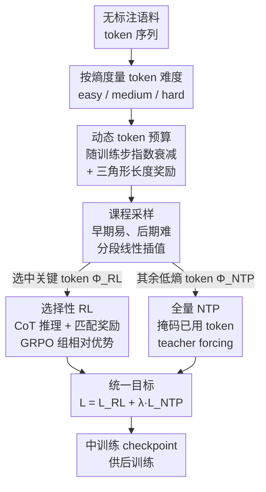

# Reinforcement Mid-Training

**会议**: ICLR 2026  
**OpenReview**: [https://openreview.net/forum?id=uJUhi3FQNa](https://openreview.net/forum?id=uJUhi3FQNa)  
**代码**: 待确认  
**领域**: LLM 强化学习 / 中训练（Mid-Training）  
**关键词**: 强化中训练, token 预算, 课程采样, GRPO, next-token prediction

## 一句话总结
本文把"预训练—后训练"两段式流程补上一个被忽略的中间阶段——强化中训练（Reinforcement Mid-Training），用无标注预训练语料、以 next-token 预测为可验证奖励来做 RL；并提出 RMT 框架，通过动态 token 预算、基于课程的难度采样、以及"选择性 RL + 全量 NTP"双目标，在语言建模上比 SOTA 的 RPT 提升最高 +64.91%，而推理长度只需 21%。

## 研究背景与动机

**领域现状**：大模型的训练通常被理解为两段式——预训练（在 web 规模无标注语料上用 next-token prediction 灌入世界知识与语言能力）+ 后训练（用高质量带标注/带奖励的数据对齐人类目标或下游任务，含 SFT 与 RLHF）。近来人们意识到两者之间还有一个"中训练"阶段：它仍然吃无标注的预训练语料，但用比泛化预训练更有针对性的目标，系统性增强如数学推理这类复杂能力，为后训练打底。把 RL 引入中训练的先行者是 Reinforcement Pre-Training（RPT）——它名字叫预训练，实质工作在中训练阶段（其 base model 已具备指令跟随和推理能力，早已越过纯预训练）。

**现有痛点**：作者指出把 RL 用到中训练上有三个尚未解决的具体问题。其一是**过度思考导致的低效**：思考过程不受约束，模型为预测一个 token 生成极长的推理链，训练和推理都被拖慢（如 RPT 平均要 872 token，Qwen3-14B 甚至 1577 token），而长不代表准。其二是**忽视了 token 熵分布的不均衡**：不同 token 的熵（不确定性/学习难度）差别很大，现有方法不加区分地直接采样困难 token，在模型能力还不够时一上来就喂高难度 token，学不稳。其三是**token 信息利用不足**：实际语料里绝大多数 token 是低熵的，而现有方法只在高熵 token 上训练，把占大头的低熵 token 全丢了——对每个 token 都贡献语言理解的无标注语料来说，这是巨大的信息浪费。

**核心矛盾**：RL 中训练要在"在海量无标注语料上跑 RL 的高昂算力代价"与"推理要简洁高效、且不能漏掉大多数 token 的信息"之间找到平衡。RPT 这唯一的尝试并没有真正解决把 RL 搬进中训练的核心难题——massive 无标注语料上 RL 的代价。

**本文目标**：先形式化定义 Reinforcement Mid-Training 问题，再造一个既高效（efficient）、又自适应（adaptive）、又统一（unified）的框架，把上面三个挑战分别打掉。

**切入角度与核心 idea**：把序列 token 切成两个不相交子集——少量"关键 token"$\Phi_{RL}$ 走带 CoT 推理的 RL（用预测是否命中真值作为可验证匹配奖励），其余大多数低熵 token $\Phi_{NTP}$ 走标准 next-token prediction，且 $|\Phi_{NTP}| \gg |\Phi_{RL}|$。一句话概括就是：**用"选择性 RL 管难 token、全量 NTP 管所有 token"的统一目标，配上动态预算压缩思考长度、课程采样按难度循序渐进，让 RL 真正能在中训练阶段跑起来。**

## 方法详解

### 整体框架
RMT 的输入是无标注预训练语料中的 token 序列，输出是一个经过强化中训练、为后训练打好底的 checkpoint。整条 pipeline 可以理解为"先量难度 → 再定预算 → 再按课程采样 → 最后双目标联合优化"四步：先用**熵**度量每个 token 的难度/不确定性；再给推理过程分配一个随训练步衰减的 **token 预算**来动态控制生成长度；在此基础上用**课程采样**让模型早期多学简单 token、能力变强后再啃困难 token；最后在采样出的 token 上做带"长度奖励 + 可验证匹配奖励"的 RL，同时把占大多数的低熵 token 通过 NTP 纳入同一个统一训练目标。

### 关键设计

**1. 动态 token 预算机制：用会衰减的预算把"越想越长"按住**

针对"过度思考导致低效"的痛点。核心是给推理过程设一个**随训练进度指数衰减**的 token 预算 $B_t = \max\left(B_{min},\ \lfloor B_0 \cdot \gamma^{t/T} \rfloor\right)$，其中 $B_0$ 是初始预算、$B_{min}\ge 1$ 是保底预算（防止退化到不会推理）、$\gamma \in (0,1)$ 控制衰减速率、$t/T$ 是训练进度。每步训练都把"请在 `<think></think>` 内恰好用 $B_t$ 个 token"这样的预算指令注入 prompt。光给指令不够，作者再配一个**三角形长度奖励** $r_{len}(\ell; B_t)$：实际推理长度 $\ell$ 在 $[0, B_t]$ 时奖励线性升到峰值 $r_{max}$（$\ell=B_t$ 取最大），在 $(B_t, 2B_t]$ 时线性降回 0，超过 $2B_t$ 直接给 0。这样既精确鼓励贴着预算走，又同时惩罚"想得不够"和"啰嗦超额"，对严重超预算直接零奖励来掐掉算力浪费。随着模型能力变强、预算自动收紧，思考越来越精炼——实测把响应长度压到 RPT 的 21%、Qwen3-14B 的 12%，且不掉点。

**2. 基于课程的自适应采样：按熵把 token 分难度，从易到难循序渐进**

针对"忽视 token 熵分布不均衡"的痛点。先按熵值把 token 分成 easy / medium / hard 三档，训练时按一个随步数演化的概率从这三档里采样。作者设两个课程转折点 $0 < t_1 < t_2 < T$，给出两组采样分布 $p_{t_1}=(p^{t_1}_{easy}, p^{t_1}_{medium}, p^{t_1}_{hard})$ 与 $p_{t_2}$（各自归一化），中间用**分段线性插值**平滑过渡：

$$p_t = \begin{cases} p_{t_1}, & t < t_1 \\ (1-\tau)p_{t_1} + \tau p_{t_2}, & t_1 \le t < t_2,\ \tau=\frac{t-t_1}{t_2-t_1} \\ p_{t_2}, & t \ge t_2 \end{cases}$$

采样分两步：先按当前课程概率 $d \sim \text{Categorical}(p_t)$ 抽一个难度档，再在该档可用候选里均匀选 token 组成训练集 $C$。整个过程被切成三阶段：早期（$t<t_1$）多喂 easy/medium 求稳定收敛；过渡期（$t_1\le t<t_2$）平滑增加 medium/hard 曝光；后期（$t\ge t_2$）稳定地多用高熵 hard token 把性能推上去。这避免了"能力还没起来就被一堆难 token 压垮"。

**3. 选择性 RL + 全量 NTP 的统一双目标：让少数难 token 学推理、所有 token 不被浪费**

针对"token 信息利用不足"的痛点，也是把 RL 真正搬进中训练的关键。两个目标分工明确：**选择性 RL** 只在采样集 $C$ 的少量 token 上做。对位置 pos 的 token $\tau$，策略 $\pi_\theta$ 以前缀 $\tau_{<pos}$ 为条件采样 $G$ 个响应 $o^i_{pos}=(c^i_{pos}, y^i_{pos})$（CoT 推理 + 最终预测），用**可验证匹配奖励** $r^i_{pos}=\mathbb{1}[y^i_{pos}=\tau_{pos}]$ 判断是否命中真值，再与长度奖励加权成复合奖励 $r^i=(1-w)\cdot r^i_{pos} + w\cdot r^i_{len}$。优化用 GRPO：从 $G$ 个样本算组相对、白化后的优势 $A_i=\frac{r_i-\bar r}{\sigma+\delta}$，目标为 $L_{RL}(\theta)=\mathbb{E}\big[\frac{1}{G}\sum_i A_i \log\pi_\theta(o^i_{pos}\mid\tau_{<pos}) - \beta\,\text{KL}(\pi_\theta\|\pi_{ref})\big]$。**全量 NTP** 则收编剩下占大头的低熵 token：先对已被 RL 用过的 token 打掩码 $m_{pos}=\mathbb{1}[\tau_{pos}\notin C]$ 避免重复训练，再用 teacher forcing 做标准 next-token 预测 $L_{NTP}(\theta)=-\sum_S m_{pos}\log p_\theta(\tau_{pos}\mid\tau_{<pos})$。最后两者合成统一目标 $L = L_{RL}(\theta) + \lambda\cdot L_{NTP}(\theta)$。这套设计形成互补：RL 通过高熵不确定 token 提升非平凡的推理决策，NTP 以宽覆盖处理语言理解，消融里去掉 NTP 掉点最猛，印证了"不能丢掉低熵 token"。

### 损失函数 / 训练策略
统一目标 $L = L_{RL} + \lambda L_{NTP}$，$\lambda=0.1$。关键超参：batch size 128、epoch 10、学习率 1e-6、初始预算 $B_0=800$、$B_{min}=1$、衰减因子 $\gamma=0.2$、课程转折点 $t_1/t_2$ 取总步数的 30%/70%、GRPO rollout 数 $G=8$、语言建模最大响应长度 2048（持续后训练用 4096）。全部实验在 16 张 H100（80GB）上跑。

## 实验关键数据

### 主实验
语言建模在 OmniMATH 上（4051 训练 / 200 评测），按 token 难度 easy/medium/hard 报告准确率。base 模型为 R1-Distill-Qwen-14B（RMT-R1）与 Qwen3-14B（RMT-Q3）；baseline 含 NTP（标准自回归）、NTR（先生成 CoT 再预测）与 SOTA 的 RPT。

| 方法 | Easy | Medium | Hard | Average |
|------|------|--------|------|---------|
| R1-Distill-14B (NTP) | 42.04 | 31.71 | 19.64 | 31.13 |
| Qwen3-14B (NTP) | 47.89 | 34.61 | 25.01 | 35.84 |
| R1-Distill-14B (NTR) | 4.76 | 2.43 | 2.09 | 3.09 |
| Qwen3-14B (NTR) | 8.47 | 5.08 | 4.51 | 6.02 |
| RPT | 48.67 | 35.84 | 23.03 | 35.85 |
| **RMT-R1** | 62.50 | 43.96 | 34.14 | 46.87 (+30.74%) |
| **RMT-Q3** | 76.92 | 55.79 | 44.64 | 59.12 (+64.91%) |

NTR 在所有难度上都很差，说明预训练阶段缺显式推理；RPT 体现了 RL 潜力但相比 base 没有实质超越；RMT 拿下 SOTA，且更强的 base（Qwen3）放大增益。**持续后训练**（用中训练 checkpoint 在 Skywork 数学数据上继续 GRPO 后训练）进一步验证可迁移性：

| 模型 | Before | After |
|------|--------|-------|
| R1-Distill-14B | 23.00 | 51.00 |
| Qwen3-14B | 12.84 | 54.17 |
| RPT | 23.17 | 48.50 |
| RMT-R1 | 24.08 | 54.67 |
| RMT-Q3 | 25.17 | 64.33 |

RMT-Q3 后训练后从 25.17 飙到 64.33，比最强 baseline 后训练高 +18.76%，说明中训练 checkpoint 能被有效后训练。

### 效率与消融
响应长度上，RMT-R1/Q3 平均只生成 188/186 token，是 RPT（872）的约 21%、Qwen3-14B（1577）的约 12%，且不掉点。消融（逐个去掉 DTB 动态预算、CAS 课程采样、NTP）：

| 配置 | Easy | Medium | Hard | Average | 说明 |
|------|------|--------|------|---------|------|
| RMT-R1 (Full) | 62.50 | 43.96 | 34.14 | 46.87 | 完整模型 |
| w/o DTB | 60.35 | 32.79 | 27.59 | 40.24 | 去动态预算掉 6.63 |
| w/o CAS | 59.32 | 42.66 | 27.68 | 43.22 | 去课程采样掉 3.65 |
| w/o NTP | 40.00 | 34.26 | 27.27 | 33.84 | 去 NTP 掉 13.03，最猛 |

### 关键发现
- **去掉 NTP 掉点最多**（RMT-R1 平均 46.87→33.84），直接证明"必须收编低熵 token、利用全部 token 信息"这一核心主张。
- **更强的 base 放大增益**：RMT-Q3 在每个难度上都稳压 RMT-R1，说明方法是即插即用、能随底座变强而增益更大。
- **效率与性能不矛盾**：case study 里 RMT-Q3 用 165 token 简洁推理就答对（'probability'），RPT 用 1376 token 反复横跳改口最终答错（'same'），直观展示了动态预算抑制过度思考的效果。

## 亮点与洞察
- **把"中训练"正式立为一个独立阶段并形式化**：明确它吃无标注预训练数据、不需要额外人工标注或可验证奖励，用 next-token 是否命中作为天然可验证奖励——这绕开了 RL 中训练最大的"哪来奖励信号"难题。
- **熵驱动的难度课程很优雅**：用 token 熵当难度代理，再用分段线性插值平滑切换采样分布，是个可迁移到其他"按样本难度排课程"任务的通用模板。
- **三角形长度奖励 + 衰减预算**这套"软约束 + 硬退火"的组合拳，给"如何在 RL 里同时要简洁和要正确"提供了一个干净的可复用设计。
- **选择性 RL + 全量 NTP 的掩码拼接**：用 $m_{pos}=\mathbb{1}[\tau_{pos}\notin C]$ 把两套目标在同一序列上无重叠地拼起来，既省 RL 算力又不浪费数据，思路可借鉴到任何"少量样本精调 + 大量样本兜底"的场景。

## 局限与展望
- 实验集中在数学语料（OmniMATH / Skywork）和 14B 量级模型，跨领域（代码、通用对话）与更大/更小规模的泛化性未充分验证。
- 课程采样的 easy/medium/hard 分档阈值、两个转折点 $t_1/t_2$ 以及一堆超参（$B_0,\gamma,w,\lambda$）较多，敏感性分析有限，迁移到新数据可能要重新调。
- 把 token 熵直接等同于"学习难度"是个强假设——高熵也可能来自噪声/歧义而非真正有价值的难点，这条假设论文未深究。
- 评测主要看 next-token 预测准确率与下游数学准确率，对"中训练是否真的提升了更广义推理能力"的证据仍偏间接。

## 相关工作与启发
- **vs RPT (Reinforcement Pre-Training)**：RPT 是把 RL 引入这一阶段的先行者，但只在高熵 token 上训、思考不受约束、推理动辄上千 token，没解决海量无标注语料上 RL 的算力代价；RMT 用动态预算压长度、课程采样稳学习、全量 NTP 收编低熵 token，效果和效率双赢（+64.91% 性能、21% 长度）。
- **vs 标准 RLHF / GRPO 等后训练 RL**：那些方法依赖带标注/带奖励的下游数据；RMT 在无标注预训练数据上用"预测命中"作可验证奖励，定位在后训练之前的中训练阶段，目标是为后训练打底而非直接对齐。
- **vs 课程学习类工作**：RMT 把课程的"难度"具体化为 token 熵、把调度具体化为分段线性插值的采样概率，落到 token 粒度而非样本/任务粒度。

## 评分
- 新颖性: ⭐⭐⭐⭐⭐ 正式提出并形式化"强化中训练"这一阶段，三个组件都对症且组合自洽。
- 实验充分度: ⭐⭐⭐⭐ 语言建模 + 持续后训练 + 效率 + 消融 + case study 都有，但局限在数学域和 14B 规模。
- 写作质量: ⭐⭐⭐⭐ 问题定义清晰、公式完整、图表到位，可读性好。
- 价值: ⭐⭐⭐⭐⭐ 为 LLM 训练流程补上一块缺失拼图，即插即用、可迁移，对后续中训练研究有方向意义。

<!-- RELATED:START -->

## 相关论文

- [\[ICLR 2026\] Learning to Reason as Action Abstractions with Scalable Mid-Training RL](learning_to_reason_as_action_abstractions_with_scalable_mid-training_rl.md)
- [\[ICLR 2026\] Representation-Based Exploration for Language Models: From Test-Time to Post-Training](representation-based_exploration_for_language_models_from_test-time_to_post-trai.md)
- [\[ICLR 2026\] Post-training Large Language Models for Diverse High-Quality Responses](post-training_large_language_models_for_diverse_high-quality_responses.md)
- [\[ICLR 2026\] R1-Reward: Training Multimodal Reward Model Through Stable Reinforcement Learning](r1-reward_training_multimodal_reward_model_through_stable_reinforcement_learning.md)
- [\[ICLR 2026\] Critique-RL: Training Language Models for Critiquing Through Two-Stage Reinforcement Learning](critique-rl_training_language_models_for_critiquing_through_two-stage_reinforcem.md)

<!-- RELATED:END -->
