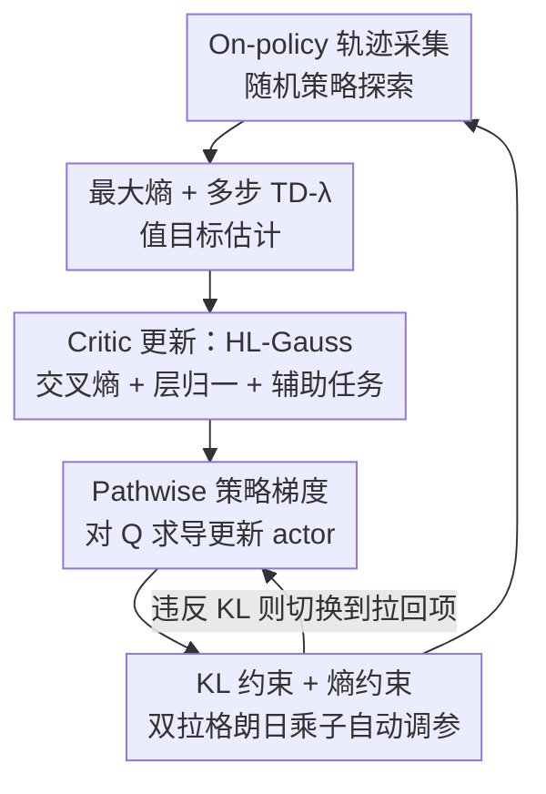

# Relative Entropy Pathwise Policy Optimization

**会议**: ICLR 2026  
**OpenReview**: [https://openreview.net/forum?id=4vmm8mlHkS](https://openreview.net/forum?id=4vmm8mlHkS)  
**代码**: https://github.com/reppo-rl  
**领域**: 强化学习  
**关键词**: on-policy RL、pathwise policy gradient、最大熵、KL 约束、值函数学习  

## 一句话总结
REPPO 把"靠 Q 函数导数更新策略"（pathwise 梯度）从一向依赖大 replay buffer 的 off-policy 场景搬进了纯 on-policy 训练——只用当前策略采的轨迹训出一个足够准的 Q 函数，再配上最大熵探索 + KL 约束的自动调参，在两个 GPU 并行 benchmark 上以更高样本效率、更低显存、更稳的训练超过了 PPO，并逼近 off-policy 的 FastTD3。

## 研究背景与动机

**领域现状**：on-policy 主流算法（TRPO、PPO）用的是 **score-function（得分函数）梯度估计**，即策略梯度定理 $\nabla_\theta J(\pi_\theta) = \mathbb{E}[Q^{\pi_\theta}(x,a)\nabla_\theta \log \pi_\theta(a|x)]$。它只需要采样就能估计，在机器人控制和 LLM 微调上都被验证有效。

**现有痛点**：score-based 估计器**方差极高**（Greensmith 等人早有结论），在高维连续动作空间尤其严重，直接导致训练不稳定。更糟的是，为了复用样本它还得做 importance sampling（重要性采样），而 IS 会进一步放大方差——PPO 的 clip 只能防止灾难性崩溃，并不能真正压低方差。

**核心矛盾**：另一条路是训一个参数化的状态-动作值函数 $\hat Q$，然后对动作求导得到 **pathwise（路径式）策略梯度** $\nabla_\theta J \approx \mathbb{E}[\nabla_a \hat Q(x,a)|_{a=\pi_\theta(x,\epsilon)}\nabla_\theta \pi_\theta(x,\epsilon)]$，它方差小、还能甩掉 importance sampling。但这条路的效果**被 $\hat Q$ 的精度卡死**，而学准 $\hat Q$ 历来要靠 off-policy 训练 + 大 replay buffer。replay buffer 既吃显存（采的样本塞不进内存时很麻烦），又给值函数拟合引入一堆老大难问题（分布漂移、过估计、可塑性丧失等）。

**本文目标**：能不能在**完全 on-policy、不用大 replay buffer** 的前提下，训出一个够准的 $\hat Q$，并真正拿它来做策略改进？

**切入角度**：作者先用一个 2D 高斯优化的玩具实验给出直觉——score-based 估计器路径抖得厉害、IS 让它更抖，而 pathwise 梯度只要有"强 surrogate（准的 $\hat Q$）"就异常平稳。所以问题被收敛成一句话：**只要能在 on-policy 下学出强 surrogate，pathwise 梯度就能赢**。

**核心 idea**：用 **on-policy 的多步 TD-λ 目标**学 $Q$（而非 off-policy 单步 + replay buffer），用**最大熵**保证持续探索，用 **KL（相对熵）约束 + 双拉格朗日乘子自动调参**控制每步更新幅度，三者拼成一个既稳又省显存的 on-policy pathwise 算法。

## 方法详解

### 整体框架
REPPO 是个 on-policy actor-critic 算法，每一轮按三个阶段推进：**采数据 → 估值目标 → 更新值函数和策略**。它要解决的核心难题是"on-policy 下怎么把 $\hat Q$ 学准、又怎么让策略更新不把这个只在旧策略覆盖区准的 $\hat Q$ 给玩坏"。REPPO 的答案是把三件事拧在一起：用最大熵 + 多步 TD-λ 把 Q 目标做稳、用 KL 约束把策略更新框住、用双乘子让熵和 KL 的强度随回报尺度自动校准。在值函数侧它还移植了三项来自 off-policy 的架构/损失改进（交叉熵回归、层归一化、辅助任务）来进一步稳住 critic。

### 关键设计

**1. on-policy 多步 TD-λ 的最大熵值函数学习：不靠 replay buffer 也能把 Q 学准**

off-policy 的 TD3/SAC 大多用**单步** Q learning，再靠大 replay buffer 稳住训练；on-policy 用不了旧策略的数据，但可以换成**低偏差的多步 TD-λ 目标**来稳。REPPO 因此把值学习建在多步 TD-λ 上，并把它和最大熵框架揉在一起——最大熵的目标 $J_{ME}(\pi_\theta) = \mathbb{E}_{\pi_\theta}[\sum_t \gamma^t(r(x_t,a_t) + \alpha \mathcal{H}[\pi_\theta(x_t)])]$ 通过在每步奖励里减去 $\alpha \log\pi$ 来鼓励策略保持随机、防止过早塌成确定性函数。具体的 n 步目标为

$$G^{(n)}(x_t,a_t) = \sum_{k=t}^{n}\gamma^{k-t}\big(r(x_k,a_k) - \alpha\log\pi(a_k|x_k)\big) + \gamma^{n+1}Q(x_n,a_n),$$

再按 λ 加权 $G^\lambda = \frac{1}{\sum_n \lambda^n}\sum_{n=0}^{N}\lambda^n G^{(n)}$。关键在于**目标是采完一批新数据后才在 on-policy 下算的，且在采下一批数据前不重算**——这条性质让 REPPO 直接砍掉了一堆 off-policy 的稳定化部件：不需要 clipped double-Q 的悲观偏置（悲观和探索的权衡很难调），也不需要 target network 拷贝（反正目标不逐步重算、本来就 on-policy）。本质上 REPPO 更接近 SARSA 而非 Q-learning。

**2. KL 约束 + 双拉格朗日乘子自动调参：把"探索"和"稳更新"这对孪生问题一并解决**

值函数只在旧策略覆盖的数据上准，所以**策略一步更新太大就会踩到 $\hat Q$ 不准的区域、把训练带崩**。REPPO 沿用 Relative Entropy Policy Search 的思路，用 KL 散度（相对熵）约束新旧策略的偏离，整个策略更新写成一个带约束的优化问题：在 $\mathbb{E}[D_{KL}(\pi_{\theta'}\|\pi_\theta)]\le \varepsilon_{KL}$ 和 $\mathbb{E}[\mathcal{H}[\pi_\theta]]\ge \varepsilon_H$ 两个约束下最大化 $\mathbb{E}_{a\sim\pi_\theta}[Q(x,a)]$。和以往用 mirror descent、line search、heuristic clipping 去硬解不同，REPPO 把它松弛成两个超参 $\alpha$（熵）和 $\beta$（KL），并让乘子在 log 空间用基于梯度的 root-finding 自动随约束违反程度调整：

$$\alpha \leftarrow \alpha - \eta_\alpha e^\alpha\,\mathbb{E}[\mathcal{H}[\pi_\theta] - \varepsilon_H], \qquad \beta \leftarrow \beta - \eta_\beta e^\beta\,\mathbb{E}[D_{KL}(\pi_{\theta'}\|\pi_\theta) - \varepsilon_{KL}].$$

为什么必须**联合**调 $\alpha$ 和 $\beta$？因为熵和 KL 是绑在一起的：行为策略的熵一旦塌掉，KL 约束就会反过来把任何更新都堵死；而且这两项是和回报尺度做平衡的，回报随训练变大、固定乘子就会让模型逐渐无视约束、加速塌缩。两者同步调才能保证策略稳、匀速地更新。实际的 actor loss 用一个二选一的 clip 来近似维持 KL 约束：当估计的 KL 还没越界时用 pathwise 项 $-Q(x_i,a) + e^\alpha\log\pi_\theta(a|x_i)$，越界后切换成纯把策略往行为策略拉回的 $e^\beta \cdot \frac{1}{k}\sum_j \log\frac{\pi_{\theta'}(a_j|x_i)}{\pi_\theta(a_j|x_i)}$。注意这里和 PPO/TRPO 关键的不同：策略梯度估计里**不强制用行为策略采的动作**，所以**整套不需要 importance sampling 校正**——这正是 REPPO 性能提升的一大来源。

**3. 稳定 critic 的三件架构/损失装备：交叉熵回归 + 层归一化 + 辅助任务**

RL 算法本身给了强 surrogate 的地基，但作者又从近年 off-policy 值学习的进展里搬了三样东西进一步稳住 critic。其一是把 critic 的 MSE 换成 **HL-Gauss 交叉熵损失**（源自分布式 C51 / histogram 回归）——交叉熵损失**尺度不变**，能给出更稳的梯度，消融显示它是关键加成。其二是**层归一化**，多项工作证明它对 critic 稳定很重要；不过 REPPO 在 on-policy 下值目标本就更稳，所以归一化没 off-policy 那么命门，但多数环境仍有收益。其三是**辅助任务**（预测下一状态等），在稀疏奖励环境里当 Q 信号学不出有意义表示时用它兜底；它在每批更新样本数被压低时尤其有用。三者中交叉熵和归一化影响大，辅助任务平时影响小、在样本变少时变重要。

### 损失函数 / 训练策略
critic 损失为 $L_Q^{REPPO}(\phi) = \frac{1}{B}\sum_i \mathrm{HL}\big(Q_\phi(x_i,a_i), G^\lambda(x_i,a_i)\big) + L_{aux}(f_\phi(x_i,a_i), x_i')$，即 HL-Gauss 交叉熵拟合 TD-λ 目标 + 辅助任务损失。actor 损失即上文那个按 KL 是否越界二选一切换的 clip 目标。两个乘子 $\alpha,\beta$ 用各自的约束残差在 log 空间做梯度上的 root-finding 同步更新。整套 30+ 任务用**同一组超参**，无 target network、无 double-Q、无 replay buffer。

## 实验关键数据

### 主实验
在 Mujoco Playground DMC（23 个 locomotion 任务）和 ManiSkill（8 个 manipulation 任务）两个 GPU 并行 benchmark 上评测，REPPO 20 seeds、95% bootstrap 置信区间。

| benchmark | 指标 | REPPO | PPO | 对比基线 |
|--------|------|------|----------|------|
| DMC locomotion | 归一化回报（IQM/median） | 显著最高 | 高维任务上不稳、有掉点 | ≈ FastTD3(10M buffer)，但 REPPO 全程 on-policy |
| DMC | wall-clock（~600–800s 收敛） | 约 +33% 归一化回报 | baseline | SAC(Brax,5M) 略高于 PPO 但不及 REPPO |
| ManiSkill（100M 步） | 成功率（IQM/median） | 强于 PPO | baseline | mean 置信区间宽，但 outlier-robust 指标领先 |
| 显存 | replay buffer | 无（on-policy） | 无 | FastTD3 默认 buffer 约 1000 万条 transition |

### 消融实验

| 配置 | 结论 | 说明 |
|------|---------|------|
| REPPO (pathwise) | 完整方法，最优 | 学到的 Q + pathwise 梯度 |
| REPPO (score-based, Q) | 明显下降 | 用 $\hat Q$ 但换回 score-function 估计器，仍优于 clip 目标 |
| REPPO (score-based, GAE) | 进一步下降 | 换成 PPO 的 GAE + IS + clip，甚至略差于 vanilla PPO |
| w/o 交叉熵损失 | 显著掉点 | HL-Gauss 是关键加成 |
| w/o 层归一化 | 多数环境掉点 | on-policy 下不如 off-policy 那么命门 |
| w/o 辅助任务 | 小幅掉点 | 样本量压低时影响变大 |

### 关键发现
- **去掉 importance sampling 是性能大头**：用 $\hat Q$ + pathwise（免 IS）远好于 clip 目标；把 PPO 的 GAE 目标塞进 REPPO 反而略差于 vanilla PPO，因为高方差让自动调参机制失灵。
- **架构三件套里交叉熵损失最关键**，层归一化次之，辅助任务平时小、样本稀缺时变重要。
- **可靠性（reliable success）**：定义为回报一旦超过阈值 $\tau=0.9$ 就再不跌破。训练末期 REPPO 约 4/5 的 run 达到可靠，PPO 少约 40 个百分点；PPO 还要 5–10M 交互才让多数环境变可靠。REPPO 即便用的是有偏的 Q，也能稳定地长期改进。
- pathwise 框架还能扩展到不可重参数化的策略类（如 diffusion policy），方法是配合学到的 $\hat Q$ 改用 score-based 估计器。

## 亮点与洞察
- **把 pathwise 梯度"去 replay buffer 化"**：长期以来"对 Q 求导更新策略"被默认绑定 off-policy + 大 buffer，REPPO 证明 on-policy 多步 TD-λ 就能把 Q 学到够用，这是观念上的解绑。
- **熵与 KL 的联合自动调参很巧**：作者点出熵塌缩会让 KL 约束反噬、回报变大会让固定乘子失效这两个隐患，用 log 空间双乘子 root-finding 一并化解，省掉了 mirror descent / line search 这类复杂解法。
- **on-policy 让 critic 设计大幅简化**：目标不重算 → 不需要 target network；不需悲观 → 砍掉 double-Q clip。这种"因为 on-policy 所以可以更简单"的反向推理很有启发。
- 用一个 2D 高斯玩具实验把 score vs pathwise 的方差差异可视化，先讲清直觉再上算法，论证链条干净，这种"先证直觉再设计"的套路可迁移。

## 局限与展望
- 每步更新的计算开销比 PPO 高（网络更大 + 梯度要穿过 critic-actor 链），靠样本效率才把 wall-clock 拉平；纯算力受限场景未必划算。
- 仍是有偏的 Q 估计，理论上没给收敛保证，稳定性更多靠经验验证。
- 作者承认完全不用 replay buffer 可能不是最优——Seo 等人显示适当用 buffer 也能稳学习，能否做成 on+off 混合的 Q 目标在省显存和提性能间取更好平衡，是开放问题。
- 大量 PPO 改进（学习到的目标函数等）和更强的 off-policy 架构尚未接入，留作后续。

## 相关工作与启发
- **vs PPO/TRPO**：它们用 score-based 梯度 + clip/trust-region + importance sampling，方差高；REPPO 用 pathwise 梯度 + 学到的 Q，免 IS，方差低、更稳，且同一组超参跨 30+ 任务鲁棒。
- **vs SAC/TD3（off-policy PPG）**：同样对 Q 求导，但它们靠大 replay buffer + 单步 Q + double-Q 悲观 + target network；REPPO 全 on-policy、多步 TD-λ、无 buffer/无 target/无 double-Q，显存小几个数量级。
- **vs FastTD3**：off-policy、默认 buffer 上千万条；REPPO 在 DMC 上性能相当却完全 on-policy、显存极小。
- **vs Relative Entropy Policy Search（REPS）**：继承了用 KL 相对熵约束策略更新的思想，但把复杂的约束求解松弛成两个可自动调参的乘子，工程上更简洁。

## 评分
- 新颖性: ⭐⭐⭐⭐⭐ 把 pathwise 梯度从 off-policy 解绑进纯 on-policy，是一条新的算法路线。
- 实验充分度: ⭐⭐⭐⭐⭐ 两大 benchmark 30+ 任务、20 seeds、可靠性/wall-clock/显存多轴评测 + 充分消融。
- 写作质量: ⭐⭐⭐⭐ 直觉实验铺垫清晰、公式完整；部分架构细节甩到附录。
- 价值: ⭐⭐⭐⭐⭐ 给了一个省显存、稳、样本高效的 on-policy 强基线，且开源多框架实现。

<!-- RELATED:START -->

## 相关论文

- [\[ICLR 2026\] Revisiting Group Relative Policy Optimization: Insights into On-Policy and Off-Policy Training](revisiting_group_relative_policy_optimization_insights_into_on-policy_and_off-po.md)
- [\[ICLR 2026\] Relative Value Learning](relative_value_learning.md)
- [\[ICLR 2026\] Single-stream Policy Optimization](single-stream_policy_optimization.md)
- [\[AAAI 2026\] Start Small, Think Big: Curriculum-based Relative Policy Optimization for Visual Grounding](../../AAAI2026/reinforcement_learning/start_small_think_big_curriculum-based_relative_policy_optimization_for_visual_g.md)
- [\[ICLR 2026\] Dichotomous Diffusion Policy Optimization](dichotomous_diffusion_policy_optimization.md)

<!-- RELATED:END -->
