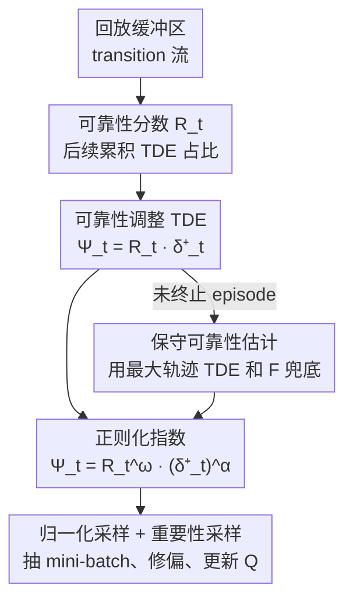

# Reliability-Adjusted Prioritized Experience Replay

**会议**: ICLR 2026  
**OpenReview**: [https://openreview.net/forum?id=hmQk2Iwdh0](https://openreview.net/forum?id=hmQk2Iwdh0)  
**代码**: 论文称将开源（补充材料含源码）  
**领域**: 强化学习 / 经验回放  
**关键词**: 经验回放, 优先采样, 时序差分误差, 目标可靠性, 离策略 RL

## 一句话总结
本文指出 PER 用绝对时序差分误差（TDE）做采样权重时，若目标 Q 值本身不准会"误导学习"，于是提出一个基于轨迹内后续 TDE 之和的"可靠性分数"$R_t$，把采样权重改成"可靠性 × 绝对 TDE"，理论上证明收敛误差严格优于 PER，在经典控制和 Atari-10 上一致超过 PER（Atari-10 峰值中位数高 22.97%）。

## 研究背景与动机
**领域现状**：离策略 RL（DQN 系列）普遍用经验回放从历史 transition 里反复学习以提升样本效率。最朴素的做法是从回放缓冲区里**均匀采样**，但不同 transition 的"学习价值"差别很大。Schaul 等人提出的 PER（Prioritized Experience Replay）按 transition 的**绝对时序差分误差** $\delta^+_t = |\delta_t|$ 成比例采样，认为 TDE 越大说明预测和目标偏差越大、学习潜力越高。PER 至今仍是被 SOTA 算法广泛采用的唯一优先采样策略。

**现有痛点**：PER 的核心假设——"绝对 TDE 大 = 学习价值高"——其实有偏。TDE 定义为 $\delta_t = Q_{\text{target}}(S_t) - Q(S_t, A_t)$，而 bootstrapped 目标 $Q_{\text{target}}(S_t) = R_{t+1} + \gamma(1-d_{t+1})\max_a Q(S_{t+1},a)$ 本身也是个**估计值**。如果目标 Q 值不准，那么 TDE 大很可能只是因为"目标算错了"，按它去采样反而会把不可靠的目标偏差放大，导致 Q 值估计退化、收敛变慢甚至最终策略变差。

**核心矛盾**：TDE 同时混杂了两种信息——transition 真实的"价值估计误差"（该学的）和"目标偏差"（不该被它带偏的）。PER 无法区分二者，于是会把"目标本身就错"的 transition 当成"高学习价值"反复采样。

**切入角度**：作者用下棋（井字棋、围棋）打比方：越靠近终局的状态，剩余步数越少、rollout 越短，价值估计越可靠；越靠开局，依赖的后续估计越长、越不可靠。这意味着轨迹内部存在**时序层级依赖**——要先把后面的 transition 学准，前面的目标才会变可靠。因此采样应该"从后往前"地优先解决 TDE。

**核心 idea**：用一个**可靠性分数** $R_t$ 给绝对 TDE 加权，得到"可靠性调整后的 TDE" $\Psi_t = R_t \cdot \delta^+_t$ 作为采样准则——既保留 PER"挑高 TDE"的样本效率，又压制不可靠目标带来的负面更新。该方法算法无关，可插进任意离策略 RL。

## 方法详解

### 整体框架
ReaPER 在 PER 的采样管线上只改一处：把采样权重从"绝对 TDE"换成"可靠性 × 绝对 TDE"。整体逻辑是——对缓冲区里每条 transition，先算它在所属轨迹中的可靠性 $R_t$（由该 transition 之后的累积绝对 TDE 占整条轨迹累积 TDE 的比例决定），再乘上自身的绝对 TDE 得到优先级 $\Psi_t$，归一化成采样概率后抽 mini-batch；抽中后用重要性采样权重修正非均匀采样引入的偏差，最后做 Q 学习更新。理论侧再补上"收敛层级"和"方差缩减"两条证明，说明为什么这样加权一定不差于 PER。

### 关键设计

**1. 可靠性分数：用"后续 TDE 占比"度量目标 Q 值有多可信**

PER 的根本问题是没区分"该学的误差"和"目标偏差"。作者从三个观察出发把这件事形式化：(i) 非终止 transition 的目标依赖 $Q(S_{t+1},\cdot)$，可能不准，会把更新带偏；(ii) 终止 transition 的目标 $Q_{\text{target}}(S_n)=R_n$ 直接由环境给出，**精确无偏**；(iii) 把靠后的 transition 学准后，会递归地改善靠前 transition 的目标可靠性。结论是 transition 应"从后往前"地解决。据此把目标 $Q_{\text{target}}(S_t)$ 的可靠性定义为与"后续绝对 TDE 之和"成反比：

$$R_t = 1 - \frac{\sum_{i=t+1}^{n} \delta^+_i}{\sum_{i=1}^{n} \delta^+_i}.$$

直觉很清楚：如果一条 transition 后面的 TDE 都已经很小（说明后续状态已经学准了），它的目标就可靠，$R_t$ 接近 1；如果后面还有一大堆未解决的大 TDE，$R_t$ 就被拉低。终局 transition 后面没有 transition，可靠性最高。把它乘进采样准则得到 $\Psi_t = R_t \cdot \delta^+_t$，高 $\Psi_t$ 同时意味着"更新幅度大"且"目标可信"。

**2. 收敛层级：理论证明 ReaPER ⪰ PER ⪰ 均匀采样**

光有直觉不够，作者要证明这样加权确实更优。把"真实价值误差平方"的期望变化分解成三项：TDE 方差项、真实平方误差项、以及**偏差-误差交互项** $2\eta\sum_t \mu_t \mathbb{E}[e_t \varepsilon_t]$，其中 $e_t = Q(S_t,A_t)-Q^\star(S_t,A_t)$ 是真实误差、$\varepsilon_t = Q_{\text{target}}(S_t)-Q^\star(S_t,A_t)$ 是目标偏差。PER 通过挑大 TDE 来加速消解"真实平方误差"，但它管不住偏差-误差交互项。本文在关键假设 3.4（"目标偏差被下游绝对 TDE 之和上界控制"，$|\varepsilon_t| \le \lambda\sum_{i=t+1}^n \delta^+_i$）下证明引理 3.5：$|\varepsilon_t| \le \lambda(1-R_t)\sum_{i=1}^n \delta^+_i$，即可靠性越高、目标偏差越小。由此得到收敛层级（命题 3.6）：

$$\mathbb{E}\big[\|Q^{\text{Uniform}}_T - Q^\star\|^2\big] \ge \mathbb{E}\big[\|Q^{\text{PER}}_T - Q^\star\|^2\big] \ge \mathbb{E}\big[\|Q^{\text{ReaPER}}_T - Q^\star\|^2\big].$$

也就是说在该假设下，ReaPER 的期望 Q 值误差严格不大于 PER。作者还给出 Remark 3.7 把它推广到次优策略（加一个策略诱导偏差项 $\zeta$）。

**3. 方差缩减：ReaPER 近似最优逆方差采样**

第二条理论支柱是从"更新方差"角度看。固定 episode、把当前 Q 值当常数，更新方差可写成 $\sum_t \mu_t \sigma^2_t$（$\sigma^2_t$ 是 bootstrapped 目标的方差）。命题 3.8 证明使方差最小的最优分布是 $\mu^\star_t \propto \delta^+_t / \sigma^2_t$。由于真实目标 $Q^\star$ 是常数，跨 run 的目标方差大部分来自目标偏差 $\varepsilon$，所以 $\sigma^2$ 与 $\varepsilon$ 直接相关；在假设 3.4 下自然有 $R \propto 1/\sigma^2$。因此 $\Psi_t = R_t \delta^+_t$ 恰好近似了"逆方差加权"的最优采样策略——这给了"乘可靠性"一个比直觉更硬的理由：它本质上在做方差缩减。

**4. 四个工程修正：把朴素算法变成可跑、不破坏 RL 稳定性的实现**

直接照定义实现 ReaPER 会有几个致命问题，作者给了四个补丁。**(I) 优先级更新**：每步重算所有 TDE 不现实，于是沿用 PER 的惰性更新——新 transition 入缓冲时给最大优先级，某条 transition 被用来更新 Q 时才更新它的 TDE；而**同一 episode 内任意 transition 被更新时都要更新该 episode 所有 transition 的可靠性**（因为 TDE 之和变了）。**(II) 正则化**：TDE 可能因别处更新而过期，仿照 PER 引入指数 $\alpha,\omega \in (0,1]$ 抑制极端值，$\Psi_t = R^\omega_t \cdot (\delta^+_t)^\alpha$。**(III) 未终止 episode 的可靠性**：episode 没结束时 TDE 总和未定义，用缓冲区内任意 episode 的最大 TDE 之和 $F$ 做保守兜底（并用位置编码向量 $\phi$ 标记每条 transition 属于哪条轨迹）；该公式刻意只看 episode 内方差、不按 episode 长度归一，因为作者发现按长度归一会偏向短轨迹、实测有害。**(IV) 加权重要性采样**：非均匀采样违反 i.i.d. 假设、引入偏差，用重要性采样权重 $w_t = \big(\frac{1}{N}\cdot\frac{1}{p_t}\big)^\beta$ 缩放损失（用 $\delta_t \cdot w_t$ 代替 $\delta_t$ 更新）来修正。

### 损失函数 / 训练策略
训练沿用标准 DDQN 的 Q 学习更新 $Q(S_t,A_t) \leftarrow Q(S_t,A_t) + \eta\cdot\delta_t$，唯一变化是用 $w_j\cdot\delta_j$（重要性采样修正后的 TDE）累积权重梯度。关键超参为正则化指数 $\alpha,\omega$、重要性采样指数 $\beta$ 和学习率 $\eta$；作者强调结果是在**几乎不调参**的情况下取得的，预期细调还能更好。

## 实验关键数据

实验用统一的 DDQN agent、相同网络结构与超参，固定随机种子、同种子配对比较，唯一变量就是经验回放算法（Uniform / PER / ReaPER）。

### 主实验

| 环境类型 | 环境 / 基准 | 指标 | ReaPER vs PER | ReaPER vs Uniform |
|----------|-------------|------|---------------|-------------------|
| 连续控制 | ACROBOT | 达阈步数减少 | −16.6% | −25.0% |
| 连续控制 | CARTPOLE | 达阈步数减少 | −32.6% | −41.4% |
| 连续控制 | LUNARLANDER | 达阈步数减少 | −21.1% | −37.1% |
| 高维 | ATARI-10 | 峰值得分中位数 | +22.97% | +229.78% |
| 高维（部分可观测） | ATARI-10 (POMDP) | 峰值得分中位数 | +34.98% | — |

在三个连续控制环境里，ReaPER 比 PER 少 16.6%–32.6% 的步数就能达到预设分数阈值（20 次 run）。在 Atari-10 上，ReaPER 在 10 个游戏中 8 个胜出、2 个打平，峰值中位数比 PER 高 22.97%；在部分可观测变体下差距扩大到 34.98%。

### 消融 / 分析

| 配置 | 关键观察 | 说明 |
|------|---------|------|
| Full ReaPER（$\Psi=R\cdot\delta^+$） | 三环境 + Atari 一致最优 | 完整方法 |
| PER（$\Psi=\delta^+$，即 $R\equiv 1$） | 比 ReaPER 慢/低 | 退化为不带可靠性 |
| Uniform | 最差 | 无优先级 |
| 可靠性按 episode 长度归一 | 实测有害 | 偏向短轨迹，故采用 within-episode 方差形式 |
| 部分可观测设定 | 优势从 22.97%→34.98% | 目标越不可靠，可靠性加权收益越大 |

### 关键发现
- **可靠性加权是收益来源**：ReaPER 与 PER 的唯一区别就是乘了 $R_t$，去掉它（$R\equiv 1$）就退回 PER，所有环境都掉，说明增益完全来自可靠性这一项。
- **越难/越不可观测，收益越大**：从低复杂度连续控制（16.6%–32.6%）到 Atari（22.97%）再到部分可观测 Atari（34.98%），目标 Q 值越不可靠，压制目标偏差的价值越突出——和"目标偏差大时 TDE 最不可信"的动机自洽。
- **几乎免调参**：上述结果在最少调参下取得，作者认为细调 $\alpha,\omega,\beta,\eta$ 还有空间。

## 亮点与洞察
- **把"目标可靠性"显式拉进采样准则**：以往优先采样只盯 TDE 幅度，本文第一次把"这个 TDE 可不可信"量化进权重，且用"后续累积 TDE 占比"这个**纯靠已有 TDE 就能算**的量来近似可靠性，不需要额外网络或不确定性估计，工程代价小。
- **理论-直觉双闭环**：井字棋"从终局往回学"的直觉，对应到引理 3.5（可靠性上界目标偏差）和命题 3.8（ReaPER 近似逆方差最优采样），让"乘可靠性"既有画面感又有硬证明，这是它比一堆 heuristic PER 变体更有说服力的地方。
- **算法无关、即插即用**：只改采样权重，可挂到任意离策略算法上，迁移成本极低；"用结构化的轨迹内信息（后续 TDE）来判断当前样本可信度"的思路也可迁移到其他需要 bootstrapping 的设定。

## 局限与展望
- **依赖终止状态**：可靠性分数需要 episode 终止才能算出完整 TDE 之和，对无限时域 / 没有清晰终止的任务（持续控制）不直接适用，未终止 episode 只能用保守兜底。
- **计算开销**：要维护每条 episode 的累积 TDE 之和，TDE 更新时带来开销，朴素实现是 $O(N)$，优化后可降到 $O(n-t)$，但仍比 PER 重。
- **假设的适用边界**：核心假设 3.4（目标偏差被下游 TDE 上界控制）在训练早期、价值估计尚未稳定时可能被违反，理论保证主要在价值趋稳后成立。
- **展望**：作者提出可探索自适应可靠性估计、扩展到 actor-critic 与无限时域、以及与表示学习结合。

## 相关工作与启发
- **vs PER（Schaul et al. 2015）**：PER 用 $\delta^+_t$ 做权重，本文用 $R_t\cdot\delta^+_t$，区别在于显式扣掉不可靠目标的影响；ReaPER 在 $R\equiv 1$ 时严格退化为 PER，因此是"超集"而非替换，理论上一致不差、实测更好。
- **vs Prioritized Sequence Experience Replay（Brittain et al. 2019）**：它把绝对 TDE 沿 episode **反向传播**后再做采样准则；本文同样利用了轨迹内时序信息，但落点不同——不是传播 TDE，而是用后续 TDE 之和构造一个 $[0,1]$ 的可靠性权重去乘，目的在"压偏差"而非"传信号"。
- **vs Uncertainty Prioritized Experience Replay（Carrasco-Davis et al. 2025）/ 基于学习的选择（Zha 2019, Oh 2021）**：这些方法引入额外的不确定性/学习式选择机制；ReaPER 的卖点是**不引入额外模型**、仅靠缓冲区里已有的 TDE 就近似出可靠性，更轻量、更易复现。

## 评分
- 新颖性: ⭐⭐⭐⭐ "可靠性 = 后续 TDE 占比"这一刻画简单却新，把目标偏差显式纳入采样属于干净的增量创新。
- 实验充分度: ⭐⭐⭐⭐ 覆盖经典控制 + Atari-10 + 部分可观测，配对种子严谨；但缺与更多 PER 变体的横向对比、调参较保守。
- 写作质量: ⭐⭐⭐⭐⭐ 直觉（井字棋）→ 定义 → 引理 → 命题层层递进，理论与工程修正都交代清楚。
- 价值: ⭐⭐⭐⭐ 算法无关、即插即用且有理论支撑，对仍在用 PER 的离策略系统是低成本可落地的改进。

<!-- RELATED:START -->

## 相关论文

- [\[ICLR 2026\] ExGRPO: Learning to Reason from Experience](exgrpo_learning_to_reason_from_experience.md)
- [\[ICML 2026\] Agent Learning via Early Experience](../../ICML2026/reinforcement_learning/agent_learning_via_early_experience.md)
- [\[ACL 2026\] Deliberative Searcher: Improving LLM Reliability via Reinforcement Learning with Constraints](../../ACL2026/reinforcement_learning/deliberative_searcher_improving_llm_reliability_via_reinforcement_learning_with_.md)
- [\[ICLR 2026\] The Rank and Gradient Lost in Non-stationarity: Sample Weight Decay for Mitigating Plasticity Loss in Reinforcement Learning](the_rank_and_gradient_lost_in_non-stationarity_sample_weight_decay_for_mitigatin.md)
- [\[ICLR 2026\] Solving General-Utility Markov Decision Processes in the Single-Trial Regime with Online Planning](solving_general-utility_markov_decision_processes_in_the_single-trial_regime_wit.md)

<!-- RELATED:END -->
