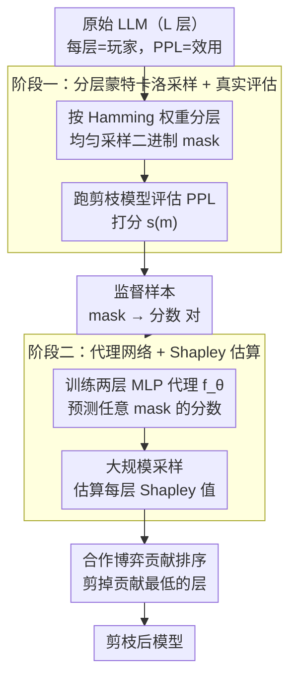

# Pruning as a Cooperative Game: Surrogate-Assisted Layer Contribution Estimation for Large Language Models

**会议**: ICLR 2026  
**arXiv**: [2602.07804](https://arxiv.org/abs/2602.07804)  
**代码**: [GitHub](https://github.com/920927/Pruning_As_A_Cooperative_Game)  
**领域**: 强化学习  
**关键词**: 层剪枝, 合作博弈, Shapley值, 代理网络, 蒙特卡洛采样, 深度剪枝

## 一句话总结
将LLM层剪枝建模为合作博弈（每层=玩家，模型性能=效用）→精确Shapley值计算不可行（$2^L$种组合）→提出两阶段近似：(1)分层蒙特卡洛采样生成mask+评估PPL作为监督信号→(2)训练轻量代理网络预测任意mask的性能→高效估算每层Shapley值→捕获层间依赖→显著优于静态启发式剪枝基线。

## 研究背景与动机

**领域现状**：LLM推理成本高→模型压缩是关键→层剪枝(depth pruning)直接移除整个Transformer层→比宽度剪枝实现更简单、推理加速更直接。

**现有痛点**：
   - (1) **静态启发式规则**：现有方法用权重幅值、激活范数、敏感度分析等为每层打分→假设层重要性固定且独立→实际上层重要性是上下文相关的
   - (2) **层间依赖被忽略**：剪掉一层会改变其他层的相对重要性→单层评估得到的排名在多层剪枝时剧烈波动（Fig.1）→中间层排名尤其不稳定
   - (3) **贪心策略非全局最优**：按单层重要性逐个剪枝无法找到最优组合→例如单独看最不重要的两层(Layer 27+10)→PPL=15.4535→但(Layer 10+11)组合→PPL=15.4279更优（Tab.1）
   - (4) **重新评估也不够**：每剪一层后重新计算重要性→仍可能错过全局最优的层组合→因为没有考虑层间交互

**切入角度**：从博弈论视角重新思考→合作博弈中Shapley值天然捕获玩家间的交互贡献→但直接计算对LLM不可行→需要可扩展的近似方法。

**核心问题**：如何在计算可承受的范围内，精确估计每层对模型性能的边际贡献，同时考虑层与层之间的依赖关系？

**解决思路**：用代理网络替代昂贵的全模型评估→训练数据来自分层采样的mask-性能对→代理网络泛化到unseen mask→大规模估算Shapley值。

**关键insight**：层的重要性不是一个固定数值→而是取决于哪些其他层被保留→只有博弈论框架能系统地建模这种"联盟依赖"的贡献。

## 方法详解

### 整体框架

方法把$L$层LLM的层剪枝看成一场合作博弈：每个Transformer层是一名玩家，整个模型在校准数据上的困惑度（perplexity, PPL）是联盟的效用，每层的重要性由它在所有可能层组合下的平均边际贡献——即Shapley值——来刻画。由于精确Shapley值要遍历$2^L$种联盟，方法用两个阶段绕开这道墙：第一阶段按 Hamming 权重分层采样一批二进制 mask、用真实剪枝模型评估其 PPL，得到一批"mask→分数"的监督样本；第二阶段在这些样本上训练一个极轻量的代理网络（surrogate network），用它零成本地预测任意 mask 的性能，进而大规模估算每层的 Shapley 值，最后按贡献从低到高剪掉贡献最低的层。

### 关键设计

**1. 合作博弈建模：把"逐层打分"换成"联盟贡献"**

现有层剪枝方法给每层算一个固定的重要性分数，默认层与层互相独立；但实际剪掉一层会改变其余层的相对重要性，单层排名在多层剪枝时剧烈波动。方法转而把层集合$\mathcal{L}=\{1,\dots,L\}$当作玩家，保留子集$S$的效用$u(S)$取该子集模型的 PPL，层$i$对$S$的边际贡献为$\Delta_i(S)=u(S\cup\{i\})-u(S)$。对所有可能联盟的边际贡献做加权平均就得到 Shapley 值，它天然把"层$i$的价值取决于还保留了哪些层"这种依赖编码进来——这正是启发式分数缺失的部分。代价是精确计算需要枚举$2^L$个子集，对几十层的 LLM 完全不可行，必须近似。

**2. 阶段一·分层蒙特卡洛采样 + 真实评估：为代理网络造监督信号**

方法用二进制 mask $\mathbf{m}\in\{0,1\}^L$表示一种剪枝方案（$\mathbf{m}_i=1$即保留层$i$），按 Hamming 权重$k(\mathbf{m})=\sum_i m_i$把 mask 分层，每个权重$k_j$下均匀采$N_{k_j}$个 mask。之所以分层而非整体均匀采样，是因为均匀采样会把绝大多数 mask 堆在$L/2$附近，极端剪枝率（保留很多或很少层）严重欠采样，而剪枝部署恰恰关心这些极端比例；分层采样保证每个剪枝率都有足够代表。对每个采样的 mask，运行对应的剪枝模型并打分$s(\mathbf{m})=\text{PPL}_{\text{orig}}/\text{PPL}(M(\mathbf{m}))$，分数越接近 1 说明剪枝后性能损失越小。这一步遍历所有采样 mask、收集出训练集$\{(\mathbf{m}_n, s(\mathbf{m}_n))\}$，是整套流程里唯一需要跑完整 LLM 的昂贵环节，因此只做一次。

**3. 阶段二·代理网络 + Shapley 估算：用便宜的预测替代昂贵的评估**

在上一步的样本上训练一个仅两层前馈网络的代理$f_\theta$，输入 mask、输出预测分数，目标是 MSE $\mathcal{L}(\theta)=\frac{1}{N}\sum_{n=1}^N\big(f_\theta(\mathbf{m}_n)-s(\mathbf{m}_n)\big)^2$。代理虽只见过几百个 mask，却能泛化到$2^L$中未见过的组合，原因是层间交互大体是低阶的、可被浅层 MLP 捕获。训练好后预测一次几乎零成本，于是 Shapley 值可以用大量采样来逼近：

$$\hat{\phi}_i=\frac{1}{Q}\sum_{q=1}^Q\big(f_\theta(\mathbf{m}^{(k_j,q)}\cup\{i\})-f_\theta(\mathbf{m}^{(k_j,q)})\big)$$

其中$Q$可以取得很大、采样越多估计越准。把昂贵的全模型评估（第一阶段一次性）与大规模 Shapley 估算（第二阶段用代理）解耦，是整个框架计算可承受的关键。最终按$\{\hat{\phi}_i\}$从低到高排序，移除贡献最低的层直到达到目标压缩比。

## 实验关键数据

### 语言建模（PPL对比）

| 方法 | LLaMA-2-7B 删3层 WikiText2 | 删6层 WikiText2 | 删9层 WikiText2 | 删12层 WikiText2 |
|------|:---:|:---:|:---:|:---:|
| SliceGPT | 108.10 | 212.89 | 291.85 | 393.89 |
| SLEB | 14.24 | 19.47 | 27.45 | 58.12 |
| Shortened-LLaMA | 16.65 | 36.37 | 81.96 | 304.52 |
| ShortGPT | 16.65 | 36.37 | 81.96 | 157.99 |
| **Ours** | **14.69** | **18.87** | **24.61** | **38.12** |

→ 删12层时优势最显著：Ours(38.12) vs SLEB(58.12) vs ShortGPT(157.99)→高压缩率下层间依赖建模的价值凸显

### Meta-LLaMA-3-8B（高压缩率对比）

| 方法 | 删3层 WikiText2 | 删6层 WikiText2 | 删9层 WikiText2 | 删12层 WikiText2 |
|------|:---:|:---:|:---:|:---:|
| SLEB | 20.40 | 33.64 | 63.83 | 126.94 |
| Shortened-LLaMA | 20.72 | 79.44 | 5928.34 | 15138.55 |
| ShortGPT | 23.85 | 84.56 | 2549.75 | 15138.55 |
| **Ours** | **18.58** | **25.39** | **45.26** | **304.52** |

→ LLaMA-3上基线在删9+层时崩溃（PPL>2000）→Ours仍保持45.26→差距达到数量级

### Zero-shot性能（LLaMA-2-7B，8任务平均）

| 参数量 | SliceGPT | SLEB | Shortened-LLaMA | ShortGPT | **Ours** |
|--------|:---:|:---:|:---:|:---:|:---:|
| 6.1B | 0.4430 | 0.5635 | 0.5816 | 0.5709 | **0.5782** |
| 5.5B | 0.3865 | 0.5138 | 0.5050 | 0.5050 | **0.5227** |
| 4.9B | 0.3645 | 0.4543 | 0.4506 | 0.4506 | **0.4689** |
| 4.3B | 0.3441 | 0.3812 | 0.3640 | 0.3911 | **0.3951** |

### 非Transformer架构（RWKV-7B / Mamba-2.8B）

| 模型 | 参数量 | ShortGPT PPL_Wiki | **Ours PPL_Wiki** |
|------|--------|:---:|:---:|
| RWKV-7B | 6.2B | 38.72 | **34.17** |
| RWKV-7B | 5.6B | 90.02 | **56.33** |
| Mamba-2.8B | 2.5B | 378.99 | **24.23** |
| Mamba-2.8B | 2.3B | 4074.49 | **31.11** |

→ Mamba上优势极其显著：ShortGPT在2.3B直接崩溃(PPL>4000)→Ours仅31.11

## 关键发现

1. **层重要性是上下文相关的**：单层剪枝的排名在多层剪枝时剧烈波动→中间层尤其不稳定→证明静态启发式根本不适合多层剪枝。

2. **贪心剪枝非全局最优**：即使每次剪枝后重新计算重要性→仍可能错过最优组合→Tab.1清楚展示了(Layer 10+11)优于逐步贪心的(Layer 27+10)。

3. **代理网络泛化能力强**：仅用有限的mask-性能对训练→却能准确预测未见过的mask组合的性能→说明层间交互模式可被低阶模型有效捕获。

4. **高压缩率下优势放大**：随着剪枝层数增加→基线方法性能快速退化→本方法保持稳定→体现了考虑层间依赖的核心价值。

5. **跨架构泛化**：在非Transformer的RWKV和Mamba上同样有效→说明"层间依赖"不是Transformer特有→合作博弈框架具有通用性。

6. **与量化兼容**：先量化后剪枝→效果优于先剪枝后量化→因为剪枝决策基于量化后的模型表示→更接近最终推理形态。

## 亮点与洞察

- **博弈论视角的新颖性**：将层剪枝从"逐个评分"升级到"联盟贡献分析"→Shapley值天然考虑了所有可能的层组合→理论基础比启发式方法严格得多。
- **代理网络的精妙设计**：用极简的两层MLP替代昂贵的LLM评估→训练集只需数百个mask→推理成本几乎为零→使大规模Shapley估算成为可能。
- **分层采样的必要性**：如果均匀采样→大部分mask集中在L/2附近→极端剪枝率覆盖不足→分层采样确保每个剪枝率都有充分代表→提高代理网络在各剪枝率下的预测精度。
- **实验的全面性**：涵盖多种模型(LLaMA-2/3, Vicuna, RWKV, Mamba)、多个基准(WikiText2/PTB/C4 + 8个zero-shot + ANLI)、多种压缩率、与量化的兼容性验证→说服力强。

## 局限性

- **第一阶段计算开销**：虽然代理网络推理极快→但Stage 1仍需对数百个mask运行完整LLM推理→校准成本不可忽略。
- **代理网络泛化假设**：假设层间交互可被浅层MLP捕获→对极深模型或特殊架构可能不成立→缺乏代理网络泛化能力的理论保证。
- **仅讨论层级剪枝**：未探索与更细粒度的头/通道剪枝结合→层+宽度混合剪枝可能进一步提升效果。
- **缺少大规模微调恢复**：主实验主要展示剪枝后直接评估→LoRA微调恢复仅在附录→实际部署中通常需要微调→主实验不够完整。

## 相关工作对比

### vs ShortGPT (Men et al., 2024)
ShortGPT用Block Influence(BI)静态度量层重要性→逐层评估→忽略层间交互。本文通过合作博弈建模层间依赖→在所有设定下显著超越ShortGPT→尤其高压缩率下ShortGPT直接崩溃而本方法仍保持合理PPL。

### vs SLEB (Song et al., 2024)
SLEB迭代剪枝→每步移除最不重要的block→有一定的层间考虑。但本质仍是贪心策略→每步做局部最优决策→无法保证全局最优。本方法通过Shapley值全局评估所有层的贡献→在大多数设定下优于SLEB。

### vs GTAP (Diaz-Ortiz Jr et al., 2023)
GTAP也用合作博弈论→但以神经元为粒度→用power indices评估重要性→计算复杂度限制了其扩展到大模型。本方法以层为粒度→用代理网络大幅降低计算成本→使博弈论方法首次可应用于LLM规模。

## 评分

- 新颖性: ⭐⭐⭐⭐ 博弈论+代理网络的层剪枝框架新颖→但Shapley值在ML中非首次使用→贡献在于可扩展性设计
- 实验充分度: ⭐⭐⭐⭐⭐ 多模型(6种)+多基准(12+)+多压缩率+非Transformer+量化兼容→非常全面
- 写作质量: ⭐⭐⭐⭐ 动机清晰→方法描述完整→但部分公式较密集→可读性中等偏上
- 价值: ⭐⭐⭐⭐ 实用价值高→代码开源→可直接替代现有层剪枝方法→尤其适合高压缩率场景

<!-- RELATED:START -->

## 相关论文

- [\[ICLR 2026\] Efficient Estimation of Kernel Surrogate Models for Task Attribution](efficient_estimation_of_kernel_surrogate_models_for_task_attribution.md)
- [\[ICML 2026\] Game of Thought: Robust Information Seeking with Large Language Models Using Game Theory](../../ICML2026/reinforcement_learning/game_of_thought_robust_information_seeking_with_large_language_models_using_game.md)
- [\[ICLR 2026\] On Predictability of Reinforcement Learning Dynamics for Large Language Models](on_predictability_of_reinforcement_learning_dynamics_for_large_language_models.md)
- [\[ICLR 2026\] AWM: Accurate Weight-Matrix Fingerprint for Large Language Models](awm_accurate_weight-matrix_fingerprint_for_large_language_models.md)
- [\[ICLR 2026\] VerifyBench: Benchmarking Reference-based Reward Systems for Large Language Models](verifybench_benchmarking_reference-based_reward_systems_for_large_language_model.md)

<!-- RELATED:END -->
