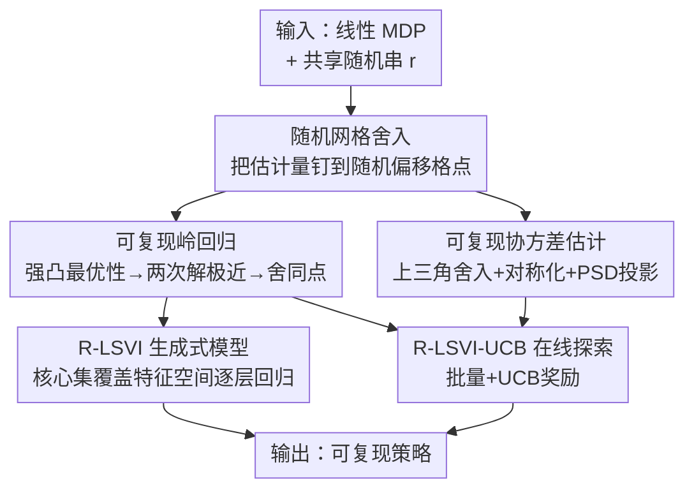

# Replicable Reinforcement Learning with Linear Function Approximation

**会议**: ICLR 2026  
**OpenReview**: [https://openreview.net/forum?id=Ccflf8sqjF](https://openreview.net/forum?id=Ccflf8sqjF)  
**代码**: 无  
**领域**: 强化学习 / 学习理论  
**关键词**: 可复现性、线性 MDP、函数逼近、样本复杂度、随机舍入

## 一句话总结
本文给出了第一个超越表格设定、面向**线性 MDP** 的**可证明可复现**强化学习算法：先构造可复现的岭回归与未中心化协方差估计两个基础工具，再把它们装进 LSVI / LSVI-UCB 框架，使得同一算法在两批独立采样的数据上运行能以高概率输出**逐位相同**的策略，并在 CartPole / Atari 上验证了量化思想能让神经策略更一致。

## 研究背景与动机
**领域现状**：强化学习以不稳定著称——同一个算法在同一个 MDP 上跑两遍，只是采到不同的轨迹，最后学出来的策略可能差异巨大。学习理论界近年用 Impagliazzo 等人提出的「可复现性（replicability）」来形式化刻画这种稳定性：要求一个随机算法在固定内部随机性、但独立重采数据的两次执行下，以高概率给出**完全相同**的输出。

**现有痛点**：已有的可复现 RL 工作（Eaton 2023、Karbasi 2023）只能处理**表格设定**——状态-动作空间小到可以逐个枚举、逐个采够样本做集中。可一旦进入实践中真正用到的**函数逼近**设定（状态空间巨大甚至连续），既无法枚举状态、也无法对每个状态-动作对单独采样，已有的可复现机制就完全失效。

**核心矛盾**：可复现性要求两次运行学到的参数向量在欧氏范数上**极度接近**（接近到能被舍入到同一格点）；而函数逼近场景里数据分布随智能体探索而漂移、状态访问分布非平稳，传统"靠接近真值参数"的可复现技巧用不上。更麻烦的是，线性 MDP 里探索需要把 Q 函数推到线性类之外，并不能简单假设 Q 在某个固定子空间里。

**本文目标**：把可复现保证从表格 RL 推广到**线性 MDP**，并且覆盖两种设定——有生成式模型的简单设定，以及更难的、需要在线探索的 episodic 设定。

**切入角度**：作者注意到岭回归（ridge regression）的目标是**强凸**的，因而有唯一全局最优；只要保证两次运行的经验解都足够接近这个唯一最优，再叠加一层随机舍入，就能把"接近"变成"逐位相同"。关键是不需要接近真值，只需要"能最小化给定目标"——这让方法在 agnostic（无线性假设）情形也成立。

**核心 idea**：用"强凸最优性 + 随机网格舍入"造出可复现的线性估计原语，再把它们当积木嵌进 LSVI/LSVI-UCB，逐层归纳地把可复现性沿动态规划传播下去。

## 方法详解

### 整体框架
全文是一条"工具 → 算法 → 设定"的两层结构。底层先打造两个**可复现的线性代数原语**：可复现岭回归（R-Ridge-Regression）和可复现未中心化协方差估计（R-UC-Cov-Estimation），二者都建立在一个统一的随机舍入子程序 R-Hypergrid-Rounding 之上。上层把这两个原语装进价值迭代框架，得到两个 RL 算法：生成式模型设定下的 **R-LSVI**（用核心集 core set 覆盖特征空间），以及在线探索设定下的 **R-LSVI-UCB**（再加一个用协方差估计算出来的 UCB 探索奖励）。

整条管线的逻辑是：先把"如何让一次线性估计可复现"解决（舍入到随机偏移的网格），再用强凸性证明两次估计足够近、从而舍入到同一点；然后在 RL 里通过**逐层 / 逐轮的强归纳**，保证只要每一步的估计可复现、整条策略就可复现。

### 关键设计

**1. 随机网格舍入：把"差不多相等"硬变成"完全相等"**

可复现性的根本难点是连续估计量几乎不可能两次完全相等。本文复用并把 Impagliazzo 等人的随机舍入从向量推广到**矩阵**：给定一个矩阵 $A$，先用共享随机性 $r$ 抽一个随机偏移 $\alpha_{\text{off}}\in[0,\alpha)$，在每个维度上构造一族随机平移的网格区间，再把每个元素映射到它所落区间的中点，得到 $\bar A$。这一步同时给两个保证（Lemma 2.1）：精度上每个元素改动不超过 $\alpha/2$，故 $\|A-\mathcal{A}(A)\|_F\le \sqrt{d_1 d_2}\,\tfrac{\alpha}{2}$；可复现性上若两次估计的 Frobenius 距离为 $\Delta=\|A^{(1)}-A^{(2)}\|_F$，则它们被舍到同一点的概率

$$\Pr[\mathcal{A}(A^{(1)})=\mathcal{A}(A^{(2)})]\ge 1-d_1 d_2\,\frac{\Delta}{\alpha}.$$

直觉是：随机平移的网格让"恰好被一条边界分开"的坏概率正比于两点距离 $\Delta$ 与格宽 $\alpha$ 之比，只要把两次估计逼得足够近（小 $\Delta$）或网格足够粗（大 $\alpha$），就能高概率落进同一格。它是后面所有可复现原语的公共底座。

**2. 可复现岭回归：用强凸最优性换参数级接近，避开 d 的恶化**

要在线性 MDP 里操作，第一步是让线性回归可复现。已有的可复现最小二乘（Esfandiari 2023a）只适用于**固定设计**——要求有一个能可复现得到、且充分张成输入空间的设计分布；这在状态访问分布随探索演化的 RL 里几乎不成立。本文转而基于岭回归：先算经典岭解 $\hat w=(\sum_i x_i x_i^\top+\lambda I)^{-1}\sum_j x_j y_j$，再对 $\hat w$ 做随机舍入（Algorithm 2）。

关键在于证明两次运行的岭解足够近。朴素做法是先用 Rademacher 复杂度给超额风险界，再用强凸把风险界转成参数界，但那样会得到 $\|\hat w-\tilde\theta\|\in O(\sqrt{\varepsilon'/\lambda})$ 的开根号关系，要逼到舍入所需的极小参数距离就得把风险容忍度取得极小，反代回去会让对维度 $d$ 的多项式依赖大幅恶化。本文改用更强的保证：只要经验梯度一致地接近总体梯度 $\sup_\theta|\nabla_\theta R(\theta)-\nabla_\theta\hat R(\theta)|\le\varepsilon'$，强凸就给出**不带根号**的 $\|\hat w-\tilde\theta\|\in O(\varepsilon'/\lambda)$。为证这个向量值梯度的一致收敛，作者借用 Foster 等人(2018)的高效梯度一致收敛 + 向量值对称化，并把 Bartlett 的 Rademacher 结论推广到**多分布**情形——妙处是这套分析对 $d$ 没有显式依赖。最终样本复杂度为 $N\in\Omega\!\big(\tfrac{(B+Y)^2 d^3}{\lambda^2\varepsilon^2(\rho-2\delta)^2}\log\tfrac1\delta\big)$ 即得 $\rho$-可复现。配合"核心集（core set）"假设（域内任意向量都能写成支撑集上向量的线性组合，且系数范数受控），还能在不做二阶矩假设的前提下给出预测误差界 $\max_x|x^\top(w-\theta^*)|\le\varepsilon$。

**3. 可复现未中心化协方差估计：在舍入下保住对称与半正定**

在线探索需要识别"哪些状态空间区域已被访问够了"，这要估计二阶矩矩阵 $\mathbb{E}[xx^\top]$。难点是协方差矩阵天然**对称且半正定（PSD）**，而对一个普通协方差逐元素随机舍入会同时破坏这两条性质。本文的 R-UC-Cov-Estimation（Algorithm 3）分三步修复：只对**上三角**部分 $\hat\Sigma_{jl}$ 做随机舍入，再把结果复制到下三角**显式对称化**，最后做 PSD 投影 $\Pi_{\text{PSD}}(\Sigma)$（特征分解后把负特征值截到 0）。由于真实未中心化协方差本就落在 PSD 锥内，这个投影不会增大估计误差；又因 $\|x\|\le1$ 协方差一致有界，结合舍入引理即得 $\|\Pi_{\text{PSD}}(\Sigma)-\mathbb{E}[xx^\top]\|_F\le\varepsilon$，所需样本 $N\in\Omega\!\big(\tfrac{d^8 t^2}{\varepsilon^2(\rho-\delta)^2}\log\tfrac{d^2}{\delta}\big)$。这个估计随后用来构造 LSVI-UCB 里的探索奖励项。

**4. 把原语装进 LSVI / LSVI-UCB：逐层 / 逐轮强归纳传播可复现性**

有了可复现的回归与协方差，作者把它们嵌进价值迭代。生成式模型设定下的 **R-LSVI**（Algorithm 4）从 $h=H$ 倒推到 $1$，每一层用核心集 $\mathcal{C}$ 采下一状态、构造数据集，再调 R-Ridge-Regression 得到该层权重 $\hat w_h$、进而 $\hat Q_h,\hat V_h$；因为每层估计都可复现、且从固定初始化出发，归纳可证整条策略可复现，样本复杂度 $N\in\Omega\!\big(\tfrac{d^6 k^3 H^{23}}{\varepsilon^8(\rho-2\delta)^2}\log\tfrac H\delta\big)$ 并保 $|V^*(s)-V^{\hat\pi}(s)|\le\varepsilon$。

更难的在线探索设定用 **R-LSVI-UCB**（Algorithm 5）：它不是每个 episode 更新策略，而是**分轮**——每轮用当前策略**批量**采 $M$ 条轨迹，再用 R-Ridge-Regression 拟合 $Q$、用 R-UC-Cov-Estimation 算 Gram 矩阵 $\bar\Lambda$，奖励项 $\hat Q=\min\{H,\langle\bar w,\phi\rangle+\beta[\phi^\top\bar\Lambda^{-1}\phi]^{1/2}\}$。两处不平凡：其一，批量化打破了原 LSVI-UCB 中"回归和奖励共用同一个 Gram 矩阵"的对称性，需要为这个"扰动 Gram"重新证一套 regret 论证（新的椭圆势 / Mahalanobis 范数在 PSD 扰动下的界）；其二，episodic 设定里后续轮次的数据分布依赖前面的策略，并非固定分布，作者用**沿轮次的强归纳**化解——在"两次运行到第 $t$ 轮为止策略完全相同"的事件下，第 $t+1$ 轮的数据就来自由共享随机性决定的同一分布、两次完全一致。最终 $MT\in\Omega\!\big(\tfrac{d^{56}H^{62}\log^5(1/\delta)}{\varepsilon^{44}\rho^2}\big)$ 条轨迹即得可复现 + $\varepsilon$ 次优。

> 注：R-LSVI-UCB 的样本复杂度指数（$d^{56}$、$H^{62}$、$\varepsilon^{-44}$）极高，是最坏情形理论界，作者亦坦言实践中所需样本远小于此。

## 实验关键数据

### 主实验
作者用一个带可复现舍入的拟合 Q 迭代（FQI）变体在离线 **CartPole**（d3rlpy 数据集，随机傅里叶特征编码 $\phi$，舍入格宽 $\alpha=0.2$，岭回归拟合 5 轮）上验证：通过对数据**子采样不同比例**制造"独立样本"，并扫不同正则 $\lambda$，统计均回报与"跨运行学到相同权重向量的最大比例"，每点对 100 次运行取平均。

| 设定 | 均回报 | 最常见相同策略占比 | 结论 |
|------|--------|--------------------|------|
| Not Replicable（无正则+无舍入基线） | 较低、波动大 | 低 | 不可复现 |
| Replicable（加正则+舍入） | 300–500（高） | 接近 100% | 仅用一部分数据即可复现 |

核心发现：**可复现性只需一部分可用数据即可达到，且与高回报正相关**——当算法拟合不好价值时复现也难发生；正则 $\lambda$ 在此影响不大（可能因少数权重过大主导），**数据量**才是复现的主要驱动。

### 消融 / 分析实验
在 **Atari**（MsPacman、Breakout）上用 PQN 训练神经 Q 函数，把"对权重舍入"替换为"对网络输出 Q 值量化到固定网格"，对比基线 / 基线+正则 / 量化 / 量化+正则，用专家留出集上的**逐对动作一致性**衡量复现性，15 次运行报均值与 $1.96\times$ 标准误。

| 配置 | 动作一致性 | 回报 | 说明 |
|------|-----------|------|------|
| Baseline | 低 | 高 | 一致性差 |
| Baseline + Reg. | 仍偏低 | 高 | 仅正则不足以提一致性 |
| Quantized | 高 | Breakout 上偏低 | 一致但可能一致在错动作上 |
| Quantized + Reg. | 高 | 与基线同量级 | 一致性提升且不掉性能 |

### 关键发现
- 量化（对应理论里的权重/Q 值舍入）是提升一致性的主因；单靠正则不够，这与 Atari 游戏**动作间隙小**有关——动作几乎等价时策略容易在不同种子下分叉。
- 量化可能让策略"一致地选了错动作"（Breakout 回报偏低）；但**量化+正则**能把回报拉回基线方差范围内，同时保住一致性收益——为理论提供了经验支撑。

## 亮点与洞察
- **"不靠近真值、只靠近最优"的可复现思路**：传统可复现分析依赖接近某个真值参数，本文只要求算法能最小化给定（强凸）目标，从而在 agnostic 情形也成立——这个解耦让岭回归成为可复现的天然载体，思路可迁移到其他强凸 ERM。
- **梯度一致收敛换掉风险一致收敛**：用"经验梯度逼近总体梯度 + 强凸"得到不带根号的参数界，避免了对 $d$ 的多项式恶化，是把 $\sqrt{\varepsilon'/\lambda}$ 改进成 $\varepsilon'/\lambda$ 的关键技巧。
- **理论到实践的桥**：把"权重舍入"翻译成"对神经网络输出量化"，绕开了直接舍入深层权重的不可控性，给出了一个在深度 RL 里立刻能用的、提升策略一致性的简单手段。

## 局限与展望
- 作者承认：可复现版本的样本复杂度远高于非可复现对应物（R-LSVI-UCB 的 $d^{56}/\varepsilon^{44}$ 等指数在最坏情形下不实用），是稳定性的"代价"。
- 线性 MDP 假设本身在实践中往往不够；近期用线性 MDP 跑通常见 benchmark 的工作依赖精心的特征学习，而这套特征学习过程**没有可复现保证**——低秩 MDP 的可复现特征学习仍是开放问题。
- 自己发现的局限：实验只在 CartPole 与两个 Atari 游戏上做，规模有限；理论指数与实验所需样本差距巨大，二者之间的真实可达率仍不清楚。

## 相关工作与启发
- **vs 表格可复现 RL（Eaton 2023 / Karbasi 2023）**：他们只能处理可枚举状态-动作空间的表格设定；本文首次把可复现保证推到线性函数逼近，覆盖生成式模型与在线探索两种设定。
- **vs 固定设计可复现最小二乘（Esfandiari 2023a）**：他们假设存在可复现获得、且充分张成输入空间的固定设计分布；本文基于岭回归 + 核心集，能在随机设计、空间未被完全张成、且无二阶矩假设时工作，更贴合 RL 的非平稳访问分布。
- **vs LSVI-UCB（Jin 2020）**：本文是其可复现版本，但因引入批量化打破了"回归与奖励共用同一 Gram 矩阵"的对称性，需要新的扰动 Gram regret 论证与策略间价值差界，并通过沿轮次强归纳保证适应性数据下的可复现。

## 评分
- 新颖性: ⭐⭐⭐⭐⭐ 首个超越表格、面向线性 MDP 的可证明可复现 RL，工具与算法均为首创
- 实验充分度: ⭐⭐⭐ 理论为主，实验仅 CartPole + 两个 Atari，规模有限但切中要点
- 写作质量: ⭐⭐⭐⭐ 工具→算法→设定层次清晰，证明思路交代到位
- 价值: ⭐⭐⭐⭐ 为 RL 稳定性/可复现研究打开函数逼近这扇门，量化思想可直接用于深度 RL

<!-- RELATED:START -->

## 相关论文

- [\[ICLR 2026\] Is Pure Exploitation Sufficient in Exogenous MDPs with Linear Function Approximation?](is_pure_exploitation_sufficient_in_exogenous_mdps_with_linear_function_approxima.md)
- [\[ICLR 2026\] Analysis of Approximate Linear Programming Solution to Markov Decision Problem with Log Barrier Function](analysis_of_approximate_linear_programming_solution_to_markov_decision_problem_w.md)
- [\[ICLR 2026\] Universal Value-Function Uncertainties](universal_value-function_uncertainties.md)
- [\[NeurIPS 2025\] A Unifying View of Linear Function Approximation in Off-Policy RL Through Matrix Splitting and Preconditioning](../../NeurIPS2025/reinforcement_learning/a_unifying_view_of_linear_function_approximation_in_offpolic.md)
- [\[ICLR 2026\] Accelerated Learning with Linear Temporal Logic using Differentiable Simulation](accelerated_learning_with_linear_temporal_logic_using_differentiable_simulation.md)

<!-- RELATED:END -->
