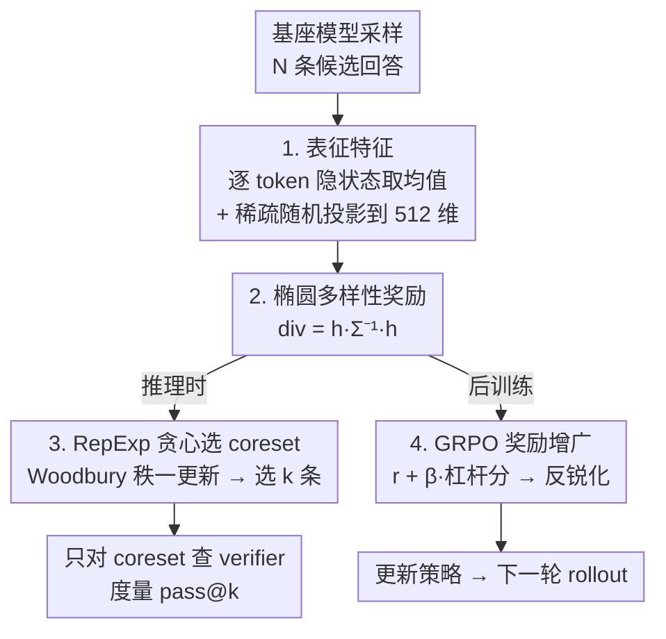

# Representation-Based Exploration for Language Models: From Test-Time to Post-Training

**会议**: ICLR 2026  
**OpenReview**: [https://openreview.net/forum?id=S4PCF1YxoR](https://openreview.net/forum?id=S4PCF1YxoR)  
**代码**: https://rep-exp.github.io  
**领域**: 强化学习 / LLM推理  
**关键词**: 探索, 椭圆奖励, 多样性, pass@k, GRPO

## 一句话总结
本文提出 RepExp：用预训练语言模型自身隐状态构造的"椭圆多样性奖励"来显式激励探索，先在一个干净的"推理时选择"测试床上验证，再把同一奖励搬进 GRPO 后训练，结果在推理时把 verifier 效率提升 50%+、在后训练上彻底消除了 RL 常见的"pass@k 在大 k 处塌缩"现象。

## 研究背景与动机

**领域现状**：带可验证奖励的 RL 后训练（GRPO/PPO）已经在数学、代码这类任务上显著提升了语言模型的推理能力，成了主流做法。

**现有痛点**：越来越多证据（Yue et al. 2025、Gandhi et al. 2025）表明，现有 RL 配方更像是在**锐化（sharpening）**——它只是把基座模型本来就以小概率能做出的行为概率抬高，而不是真正发现基座里没有的新行为。一个直接的症状是"多样性塌缩"：标准 GRPO 训练后，pass@1 涨了，但在较大的 k（如 pass@256）上反而比基座模型还差，说明模型把概率质量收敛到了少数几条路径上。

**核心矛盾**：要真正"发现新行为"就得显式探索，但语言的决策空间是组合爆炸的，传统深度 RL 的探索技巧（count-based、curiosity、RND、posterior sampling）要么不适配大空间，要么需要额外训练辅助网络、扩展到语言模型时复杂度太高。如何在巨大的语言空间里**可扩展地量化"新颖度/多样性"并据此行动**，是没解决的问题。

**本文目标**：① 预训练表征里的知识能不能用来引导"找新行为"的搜索？② 显式探索究竟能不能突破"只是锐化基座"的天花板？

**切入角度**：作者注意到，语言模型的隐状态本身就编码了海量先验知识——与其再学一个辅助网络去衡量新颖度，不如直接拿模型自己的表征当特征。同时作者提出一个方法论上的关键观察：探索的效果在 RL 里和优化、泛化纠缠在一起难以单独评估，于是先把探索剥离到一个**纯推理时**的简单设定里验证，再搬进后训练。

**核心 idea**：把线性 bandit/主动学习里成熟的**椭圆奖励（elliptical bonus）**搬过来，用语言模型隐状态当 d 维特征，用 $h^\top \Sigma^{-1} h$ 度量一条回答相对已选回答的新颖度，从而以最小代价、无需额外网络地实现可扩展探索。

## 方法详解

### 整体框架

RepExp 的核心是一个"探索奖励" $\mathrm{div}(x,y)$，它先后用在两个设定里。作者刻意采用**双管齐下**的方法论：先在"推理时选择"这个干净测试床上验证奖励好不好用，再把同一个奖励整合进 RL 后训练——其底层假设是"在推理时表现好的多样性奖励，在后训练里也会表现好"。

- **推理时选择（测试床）**：对一个 prompt $x$，先从基座模型采一大批候选 $y_1,\dots,y_N$，然后用一个**不查 verifier** 的算法从中挑出 $k$ 条最"多样且大概率含正确答案"的子集（coreset），最后只对这 $k$ 条查 verifier，度量 pass@k。因为不涉及优化和泛化，这个设定能把"多样性"这一变量单独拎出来评估。
- **RL 后训练**：把同一个椭圆奖励作为额外奖励项加进 GRPO，激励模型在 rollout 之间产生互相新颖的回答。

两个设定共享同一套表征与奖励，只是"用法"不同：推理时是**选择**（coreset），后训练时是**奖励增广**。整体管线如下：

### 关键设计

**1. 推理时选择：把探索从优化/泛化里剥离出来的干净测试床**

作者最先解决的不是"用什么奖励"，而是"怎么公平地评估一个奖励到底好不好"。在完整 RL 里，探索的收益被优化动态、泛化能力混在一起，很难归因。于是本文把问题简化为一个纯选择问题：固定一个模型 $\pi$，对 prompt $x$ 先采 $N$ 条候选，用算法 $\mathrm{Alg}$ 选出 $k$ 条子集 $S$，度量

$$\mathbb{E}_{y_1,\dots,y_N\sim\pi(\cdot|x)}\Big[\mathbb{E}_{S\sim\mathrm{Alg}}\big[\max_{i\in S} r^\star(x,y_i)\big]\Big].$$

关键在于**筛选算法不查 verifier**，所以只要它能把高质量回答保留在 coreset 里，就等价于提升了 verifier 效率（即查多少次 verifier 才能命中正确答案）。这个设定既是验证奖励的廉价沙盒，本身在"查 verifier 很贵"（如需专家标注）的场景里也有独立价值。它让作者能干净地比较不同多样性度量，再把胜出的那个搬进后训练。

**2. 表征驱动的椭圆多样性奖励：直接拿模型隐状态当新颖度特征**

针对"语言空间太大、传统探索奖励要么不适配要么要额外网络"的痛点，本文选了**椭圆奖励**——线性 bandit 和主动学习里的事实标准——并用模型自己的表征当特征，避免任何额外学习机制。给定已见特征 $h_1,\dots,h_{i-1}$，一个新特征 $h$ 的新颖度定义为

$$\mathrm{div}(h\mid h_{1:i-1}) = h^\top \Sigma_i^{-1} h,\qquad \Sigma_i = \lambda I_d + \sum_{j<i} h_j h_j^\top.$$

它的理论根基来自线性回归：若在 $h_{1:i-1}$ 上拟合线性模型，对 $h$ 的预测误差就被 $\mathrm{div}$ 上界——所以 $\mathrm{div}$ 越大，说明 $h$ 越"没被已选数据覆盖"，即越新颖。特征怎么取？对长度 $T$ 的回答 $y_i$，取**最后一层隐状态在所有 token 上的均值** $\bar h_\theta(x,y_i)=\frac1T\sum_t h_\theta(x,y_i^{1:t})$，再用稀疏随机投影降到 512 维。消融（Figure 4）显示"取均值"比"只取最后/倒数第二个 token"样本效率高 2 倍以上——因为均值更完整地概括了整条回答的语义。这套奖励有三个好处：捕获了模型先验、对历史敏感（协方差矩阵概括了已选的全部回答，与已选项冗余会被惩罚）、且简单可扩展（无辅助网络、靠秩一更新避免矩阵求逆）。

**3. RepExp：贪心选 coreset + 秩一更新的高效推理时算法**

有了奖励，推理时怎么用？RepExp（Algorithm 1）从候选池里**迭代地贪心挑**当前椭圆奖励最大的那条：

$$y_{t+1} = \arg\max_{y\in Y}\ \bar h_\theta(x,y)^\top \Lambda_t\, \bar h_\theta(x,y),$$

每选一条就更新逆协方差 $\Lambda_t=\Sigma_t^{-1}$。直接求逆代价是 $O(d^3)$，本文用 Woodbury / Sherman–Morrison 秩一更新把每步降到 $O(d^2)$：

$$\Lambda_t = \Lambda_{t-1} - \frac{\Lambda_{t-1}\bar h_t \bar h_t^\top \Lambda_{t-1}}{1+\bar h_t^\top \Lambda_{t-1}\bar h_t}.$$

从随机一条起步，循环 $k-1$ 次就得到 $k$ 条 coreset。直觉上它在表征空间里不断挑"离已选集合最远"的方向，从而覆盖尽可能多样的解题思路（如数学题里覆盖不同证明策略），最大化命中正确答案的概率。

**4. GRPO 奖励增广：把同一奖励搬进后训练以反锐化**

后训练里不做 coreset 选择（那样和 GRPO 套在一起不实用），而是**直接把椭圆奖励加进 GRPO 的奖励**。对当前策略 $\pi_\theta$ 采的一组 $k$ 条 rollout，令 $\Sigma=\lambda I+\sum_i \bar h_\theta(x,y_i)\bar h_\theta(x,y_i)^\top$，第 $i$ 条的奖励改为

$$r^\star(x,y_i) + \beta\cdot \bar h_\theta(x,y_i)^\top \Sigma^{-1}\bar h_\theta(x,y_i),$$

其中奖励项是**杠杆分（leverage score）**形式，取值被界在 $[0,1]$，便于控制尺度。两个工程细节很关键：协方差 $\Sigma$ **每个 batch 重新初始化**，所以奖励只衡量 $y_i$ 相对同 batch 其它 rollout 的新颖度（同一问题跨轮的历史不计入，因此后训练里它只是"组内感知"而非全局历史感知）；每个优化步**重新抽一次随机投影**，以便沿表征空间所有相关方向都能最大化奖励。这一项激励 batch 内回答互相新颖，从而对抗 GRPO 把概率质量挤向少数路径的锐化倾向。

### 一个完整示例

以推理时选择走一遍：对一道 MATH 难题，基座 Qwen-2.5-14B 先采 $N$ 条候选回答（"令 $x=\sqrt2$…"、"设 $a^2+b^2$…"、"注意到…"…）。RepExp 先随机选第 1 条，算出其均值隐状态特征并更新 $\Lambda_0$；第 2 步在所有候选里找椭圆奖励 $\bar h^\top\Lambda_1\bar h$ 最大的——也就是和第 1 条在表征上最"不像"的那条，比如换了完全不同证明策略的回答；如此迭代直到选满 $k$ 条 $\{y_2,y_5,y_7,\dots\}$。最后只对这 $k$ 条查 verifier。相比随机抽 $k$ 条（很可能抽到几条思路雷同、一起对或一起错的冗余回答），RepExp 选出的子集思路更分散，在更小的 $k$ 下就命中正确答案——这正是"verifier 效率提升 50%+"的来源。

## 实验关键数据

### 主实验

推理时（Figure 1/5/6）：在 5 个数据集（GSM8K/MATH/MBPP+/Game-of-24/AIME 2025）× 多个模型家族上，RepExp 的 samples-to-correct 多数落在 $y=x$ 线下方（即优于随机抽样）。

| 设定 | 模型 / 任务 | 指标 | 结果 |
|------|-------------|------|------|
| 推理时 | Qwen-2.5-14B / GSM8K·MATH·MBPP+·Game-of-24 | verifier 效率 | 提升 50%+ |
| 推理时（数据池） | Qwen-2.5-7B / MATH | 相对随机抽样 | 多数池子 3×–6× 效率提升（高温池除外）|
| 后训练 | Qwen-2.5-7B / AIME 2024 | test-time 样本效率 | RepExp 的 pass@80 ≈ GRPO 的 pass@256（3× 提升）|

后训练 pass@k（Figure 2，相对基座的样本效率）：

| 任务 | RepExp vs GRPO | RepExp vs Unlikeliness |
|------|----------------|------------------------|
| MATH | 4.1× | 2.1× |
| GSM8K | 13.4× | 3.0× |
| AIME 2024 | 3.2× | 大 k 处反超 |

### 消融实验

| 配置 | 关键发现 | 说明 |
|------|----------|------|
| 特征：均值 vs 末/次末 token | 均值样本效率 >2× | 均值更完整概括整条回答（Figure 4）|
| 模型强弱（RF2）| 强模型几乎都受益，弱模型（Qwen-0.5B）无益甚至受损 | RepExp 依赖模型表征质量 |
| 问题难度（RF3）| 越难收益越大；Game-of-24 最难题 Phi-4 提升 3× | 难题更需要多样化探索 |
| 基采样策略（RF4）| 除高温采样外都受益 | 高温产物不连贯，表征上"假新颖"但常不含正确答案 |

### 关键发现

- **反锐化是核心卖点**：标准 GRPO 在大 k 处把 pass@k 拉到比基座还低（多样性塌缩），RepExp 几乎完全消除了这一现象，对所有 k 都保持或改进基座 pass@k。
- **新颖度可度量验证**（RF7，Figure 8）：把三种模型的回答在基座下打 log-likelihood，GRPO 的回答更"高似然"（锐化），而 RepExp 的回答显著更"低似然/更新颖"，直接证明它没在单纯锐化。
- **强模型 + 难题受益最大**：RepExp 的收益与模型强度正相关、与问题难度正相关，说明它真正在帮模型"够到"原本难触达的解。
- token 级变体（Figure 7）作为概念验证：在 MATH 最难的 200 题上，预算超过 512–640 后 pass@k 反超 vanilla 生成，但每步多一次前向、尚未优化。

## 亮点与洞察

- **"先在干净沙盒验证、再搬进 RL"的方法论**最值得借鉴：把探索从优化/泛化里剥离到推理时选择问题，让"多样性奖励好不好"这个变量可以被单独、廉价地评估——这套两段式评估范式可迁移到任何想研究 RL 某个组件的工作。
- **直接拿模型隐状态当探索特征**，省掉了 RND/curiosity 那套辅助网络，把线性 bandit 的椭圆奖励几乎零成本地搬到语言模型上，简单到"最朴素的有理可循方案"却已显著有效。
- 用 **leverage score 形式的奖励**把 bonus 界在 $[0,1]$，解决了探索奖励尺度难调、容易压过真实奖励的老问题，这个 trick 可直接用到别的 RL bonus 设计里。
- "高温采样反而让 RepExp 失效"的观察很有意思：表征空间的新颖 ≠ 内容正确，提醒我们多样性度量必须建立在连贯生成之上。

## 局限与展望

- 表征质量决定上限：弱模型（如 Qwen-0.5B）几乎无收益甚至受损，方法对小模型不友好。
- 后训练里协方差每 batch 重置、不跨轮持久，因此只是"组内感知"探索，没利用整个训练历史的新颖度信息。
- token 级变体尚是 proof-of-concept，每步多一次前向、未做效率优化，且只在 MATH 单任务验证。
- 只覆盖**可验证奖励**域（数学/代码），作者也承认如何在无可验证奖励的开放域里激励探索、同时避免 reward hacking 仍是开放问题。
- 实验聚焦"最朴素的椭圆奖励"，更复杂的多样性度量、扩大 RL 计算、与 prolonged RL 等技术结合都留作未来工作。

## 相关工作与启发

- **vs Unlikeliness (He et al. 2025)**：Unlikeliness 按"当前策略下生成概率的倒数"缩放外在奖励来奖励"不太可能但正确"的回答；本文用表征空间的椭圆奖励显式衡量回答间多样性。后训练上 RepExp 的反锐化更明显，pass@k 大 k 处比 Unlikeliness 提升 2.1×–4.1×。
- **vs 标准 GRPO**：GRPO 无探索项，会出现多样性塌缩、大 k 处劣于基座；RepExp 在奖励里加一项即可保持/改进各档 k。
- **vs 传统深度 RL 探索（count-based / curiosity / RND / posterior sampling）**：那些要么不适配组合爆炸的语言空间、要么需额外网络；本文用模型自带表征 + 秩一更新，做到无辅助机制、可扩展。
- **vs DPP/熵奖励/难度自适应 rollout 等 LM 探索工作**：本文独特在 ① 具体的表征驱动目标，② 用推理时设定作为最小混淆因素的验证手段。

## 评分
- 新颖性: ⭐⭐⭐⭐ 把椭圆奖励 + 模型自身表征组合用于 LM 探索，并提出推理时验证范式，组合新颖、思路干净
- 实验充分度: ⭐⭐⭐⭐ 覆盖 5 任务 × 多模型 + 推理时/后训练双场景 + 多角度消融；后训练规模与任务数偏小
- 写作质量: ⭐⭐⭐⭐⭐ 动机清晰、把"锐化 vs 探索"讲透，图表（反锐化直方图、难度分桶）很有说服力
- 价值: ⭐⭐⭐⭐ 反锐化与 verifier 效率提升对实际 RL 后训练有直接价值，方法论可迁移

<!-- RELATED:START -->

## 相关论文

- [\[ICLR 2026\] Post-training Large Language Models for Diverse High-Quality Responses](post-training_large_language_models_for_diverse_high-quality_responses.md)
- [\[ICLR 2026\] Spectral Bellman Method: Unifying Representation and Exploration in RL](spectral_bellman_method_unifying_representation_and_exploration_in_rl.md)
- [\[ICLR 2026\] Prompt Curriculum Learning for Efficient LLM Post-Training](prompt_curriculum_learning_for_efficient_llm_post-training.md)
- [\[ICLR 2026\] Thinking on the Fly: Test-Time Reasoning Enhancement via Latent Thought Policy Optimization](thinking_on_the_fly_test-time_reasoning_enhancement_via_latent_thought_policy_op.md)
- [\[ICLR 2026\] Using Reinforcement Learning to Train Large Language Models to Explain Human Decisions](using_reinforcement_learning_to_train_large_language_models_to_explain_human_dec.md)

<!-- RELATED:END -->
