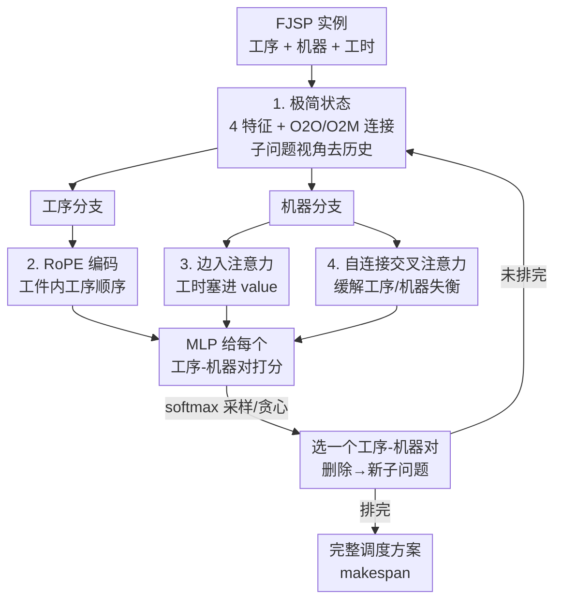

# RESCHED: Rethinking Flexible Job Shop Scheduling from a Transformer-based Architecture with Simplified States

**会议**: ICLR 2026  
**OpenReview**: [https://openreview.net/forum?id=s5pWbwf2tk](https://openreview.net/forum?id=s5pWbwf2tk)  
**代码**: https://github.com/XiangjieXiao/ReSched  
**领域**: 强化学习 / 组合优化 / 神经调度  
**关键词**: 柔性作业车间调度, 深度强化学习, Transformer, 极简状态, RoPE

## 一句话总结
RESCHED 把柔性作业车间调度（FJSP）的状态从「20+ 个手工特征 + 历史依赖」砍到只剩 4 个核心特征，再配一个针对调度量身改造的双分支 Transformer（用 RoPE 编码工序顺序、把工时边特征塞进 attention 的 value、用自连接缓解工序/机器数量失衡），仅用最朴素的 REINFORCE 训练，就在 FJSP 上超过了所有调度规则与 SOTA 的图神经网络方法，并能零改动地泛化到 JSSP 和 FFSP 两个变体。

## 研究背景与动机
**领域现状**：FJSP 是制造、边缘计算、物流里都会遇到的经典组合优化问题——把每个工件拆成有先后顺序的工序，每道工序可在一组兼容机器中任选其一处理，目标是最小化总完工时间（makespan）。近年主流做法是用深度强化学习（DRL）把调度建成一个逐步「构造解」的序列决策过程：用析取图（disjunctive graph）表示当前部分解，节点上挂一堆手工特征，再用图注意力网络（GAT/GNN）来学习一个派工策略。

**现有痛点**：这套范式越做越重。一是**状态过度工程化**——很多方法在每个节点上堆了 20 多个手工特征，作者甚至在 DANIEL 上验证「砍掉一半输入特征性能也不掉」，说明大量特征是冗余的；而且把「历史构造信息」塞进当前状态反而会拖累学习。二是**靠人工启发式剪枝动作空间**，虽然想提效率，却损害了策略的泛化能力、容易收敛到次优解，还得在每一步持续追踪一堆辅助变量，带来额外开销。三是**架构上重度依赖 GAT**，归纳偏置太死：要捕捉远距离依赖就得堆很多层，而线性注意力又表达不了复杂的非局部调度交互。

**核心矛盾**：根子在于——大家默认「状态信息不够充分，所以要靠复杂特征 + 强归纳偏置的图网络来补」。但如果状态本身就是 Markov 充分的，是不是就不需要那么重的架构偏置了？换句话说，状态充分性和架构复杂度之间存在一种此消彼长的关系，过去的工作把两边都堆满了。

**本文目标**：设计一个尽量「极简」的构造式策略——状态压到最小且仍 Markov 充分，架构用通用而非专用的 Transformer，并且能自然泛化到 FJSP 的各个变体。

**核心 idea**：从 MDP 公式本身出发反推「计算 makespan 到底需要哪些信息」，发现只需 4 个特征即可让状态充分；既然状态充分，就可以把 GNN 换成表达力更强的通用 Transformer，只针对调度任务做三处轻量改造，并用最朴素的 REINFORCE 来训练，把「状态/架构设计的功劳」和「RL 算法的功劳」彻底解耦。

## 方法详解

### 整体框架
RESCHED 是一个「构造式」神经调度器：把调度看成一连串子问题，每一步从所有可行的「工序-机器」对里选一对来排，直到所有工序都被安排完。整个流程分两段——先**精简状态**（从 MDP 推导出只需 4 个特征 + 两类图连接），再用一个**双分支 Transformer 提特征 + MLP 打分**的策略网络做决策，最后用 REINFORCE 优化。关键在于：因为每步只解一个「当前子问题」，调度过的工序及其连接会被直接从图里删掉，得到一个更小的新子问题，因此无需任何历史追踪。

### 关键设计

**1. 极简状态：从 MDP 反推，只留 4 个 Markov 充分的特征**

作者不去拍脑袋设计特征，而是回到完工时间的递推公式来反推「最少需要什么」。由 $FT_{ij} = \max\big(FT_{i(j-1)}, AT^m_t\big) + D^m_{ij}$ 可知，算一道工序 $O_{ij}$ 的完工时间只需三样东西：前驱工序的完工时间（即「工序可用时间」）、这道工序在某机器上的工时 $D^m_{ij}$、以及该机器的可用时间 $AT^m_t$。据此作者给出 Definition 4.1 与 Proposition 1：只要两条不同的构造轨迹到达同一个状态 $S_t$，剩余子问题的可行解集就完全相同——也就是说，最优决策只依赖当前状态而不依赖历史轨迹，调度因此是一个满足 Markov 性的有限状态 MDP。

落到实现上，状态被压成 4 个特征：①工序可用时间、②机器可用时间、③工时、④候选机器上的最小工时 $\min_{m\in M_{ij}} D^m_{ij}$（作为工序难度的一个紧凑下界代理）。「依赖关系」和「机器可选性」不算特征，而是用图结构里的 O2O（工序到工序）和 O2M（工序到机器）连接来表达。为了彻底去历史，作者做了两件事：一是**相对可用时间**——每步把所有可用时间减去当前全局最小可用时间，防止绝对时间无界增长、缓解泛化问题；二是**反向 + 跳跃 O2O 连边**——在子问题视角下每道工序只需要它后继的信息，于是把常用的双向 O2O 边改成只朝后看，并额外加「跳连」让每道工序直接连到它所有后继，无需多层消息传递就能拿到工件级的未来约束。这样状态既最小又充分，且不必再维护 free time、current time 之类的辅助变量来做启发式剪枝——唯一保留的硬约束就是工序间天然的先后次序。

**2. RoPE 编码：让 Transformer 不加参数就懂工件内的工序顺序**

把图换成 Transformer 后，一个新麻烦是：自注意力本身对顺序是无感的，而工件内工序的先后（O2O 依赖）是调度的硬信息，如果不显式注入，就得靠多层网络隐式推断，既低效又不可靠。作者在**工序分支**里引入旋转位置编码 RoPE，让 query $q_a$ 和 key $k_b$ 的相似度不仅取决于内容，还取决于它们的相对位置 $a-b$：$\langle \mathrm{RoPE}_q(x_a,a), \mathrm{RoPE}_k(x_b,b)\rangle = g(x_a, x_b, a-b)$。妙处在于 RoPE 不引入任何可学习参数，却能直接刻画工件内的相对距离。而且 RoPE **只用在工序分支**——因为依赖只在同一工件内部产生，不同工件或机器之间的工序可以任意置换、相对位置无意义。相比基于离散索引的位置特征，RoPE 泛化性更好、结构编码更强，这也正是作者敢把特征集砍到 4 个还能保留工件级时序信息的底气。

**3. 边入注意力：把工时直接嵌进 value，而不是只去改注意力分数**

工序和机器之间最关键的交互信息是「处理时长」，但工时天然定义在边上，既不属于工序节点也不属于机器节点。**机器分支**用交叉注意力让每道工序去关注它所有候选机器。和以往「把边特征间接地加到注意力分数上」的做法不同，作者把边信息**直接嵌进 value 向量**，让工时不仅影响注意力权重、也影响最终聚合出来的表示：

$$\mathrm{Attention}(M_m, O_{ij}) = \sigma\!\left(\frac{(q_m + q_{m,ij})^\top (k_{ij} + k_{m,ij})}{\sqrt{d}}\right)\cdot (v_{ij} + v_{m,ij})$$

其中 $q_{m,ij}, k_{m,ij}, v_{m,ij}$ 是从工时 $D^m_{ij}$ 投影出来的边专属向量。由于工序-机器对的数量是 $|O|\times|M|$ 量级，给每条边学独立投影会爆炸，作者让投影权重在所有注意力头之间、以及 query/key/value 之间共享，把参数量和显存压下来。这样边特征被「直接送进」聚合结果，而不是隔着一层注意力分数间接起作用。

**4. 自连接交叉注意力：缓解工序数远多于机器数的信息失衡**

调度里工序数往往是机器数的 10 倍甚至更多，这种结构性不对称会造成严重的信息失衡：每个机器节点要从一大堆工序里聚合信息，自身的关键信息很容易被淹没，注意力信号被稀释、训练不稳。作者引入「自连接」的交叉注意力——让每个机器节点在算注意力权重时**也关注自己**：$h'_m = \alpha_{mm} v_m + \sum_{(ij)\in N(M_m)} \alpha_{ij} v_{ij}$，其中 $\alpha_{mm}$ 是机器分给自身表示的注意力权重。残差连接是无条件、固定地把自身信息加回来，而自连接则让模型能给「机器自己的 embedding」分配一个软的、自适应的权重，从而在海量工序消息的冲击下保住机器级的关键信息。这三处架构改造（RoPE、边入注意力、自连接）就是论文标题里「针对调度的三处轻量但有效」的修改。

### 损失函数 / 训练策略
奖励借鉴 L2D，用「估计下界 makespan」的变化来定义：先把每道工序的下界完工时间按 $\overline{FT}_{ij} = \overline{FT}_{i(j-1)} + \min_{m} D^m_{ij}$ 迭代算出，得到整体下界 $\overline{FT}_{\max}$；每步奖励是动作前后下界 makespan 之差的负值 $r_t = -(\overline{FT}_{\max}(s_{t+1}) - \overline{FT}_{\max}(s_t))$。决策模块就是把每个可行工序-机器对的工序/机器/边 embedding 拼起来送进 MLP 打分，softmax 得到动作分布，**不加全局 embedding、也不做启发式动作剪枝**。优化算法刻意选了最朴素的 REINFORCE 而非 PPO 等 actor-critic——虽然方差更大，但这样能把「状态/架构设计的贡献」和「RL 算法的贡献」彻底隔离开，证明性能提升来自设计本身而非花哨的 RL 技巧（附录另给了 PPO 版本做补充评估）。

## 实验关键数据

### 主实验
训练在小规模实例上（如 JSSP 仅用 10×10、FFSP 仅用 20×12 单一尺寸），评测则放到大得多的规模和标准 benchmark（FJSP 用 Brandimarte/Hurink，JSSP 用 Taillard/DMU）。指标是 Gap（与下界/最优解的相对差距，越低越好），对比经典派工规则（FIFO/SPT/MOPNR/MWKR）、SOTA DRL（HGNN/DANIEL/DOAGNN）和非学习强基线（2SGA 遗传算法、OR-Tools CP-SAT）。RESCHED 在 16 个 in-distribution 设置里赢了 14 个。

| 数据集 | 规模 | DANIEL (Greedy) | RESCHED (Greedy) | DANIEL (Sampling) | RESCHED (Sampling) |
|--------|------|-----------------|------------------|-------------------|--------------------|
| SD1 | 15×10 | 12.42 | **6.51** | 6.79 | **3.09** |
| SD1 | 20×10 | 1.31 | **0.48** | -1.03 | **-1.55** |
| SD2 | 10×5 | 25.68 | **16.36** | 12.57 | **6.39** |
| SD2 | 15×10 | 57.16 | **18.14** | 38.70 | **9.81** |
| SD2 | 20×10 | 31.58 | **14.18** | 19.13 | **7.90** |

（表中为 Gap%↓）在更难的 SD2 上优势最明显，15×10 设置下贪心 Gap 从 DANIEL 的 57.16 直接降到 18.14；在简单的 SD1 上也能把 DANIEL 的 gap 砍掉一半。负 Gap（如 20×10 的 -1.55）表示采样解已优于参考下界。

### 泛化 / 变体实验

| 设置 | 说明 | 结果 |
|------|------|------|
| FJSP 大规模 OOD | 训练 10×5/20×10，测 30×10/40×10 | 30×10 贪心 Gap 3.49 vs DANIEL 4.43，持续领先 |
| JSSP | 仅用 10×10 单尺寸训练 | 对 L2D/RL-GNN 有竞争力 |
| FFSP | 仅用 20×12 单尺寸训练 | 对专门设计的 MatNet 有竞争力 |

### 关键发现
- **状态充分比架构复杂更重要**：把状态做到 Markov 充分后，用通用 Transformer + 三处轻量改造就够了，不需要重度图归纳偏置；这是全文最核心的实证。
- **历史信息有害**：在状态里塞历史构造数据反而拖累学习（Section 4.1.2），而子问题视角去历史 + 相对时间反而泛化更好。
- **特征冗余**：在 DANIEL 上砍掉一半输入特征、去掉全局 embedding 都不掉点，佐证了「极简状态」的可行性。
- **跨变体泛化**：单一小尺寸训练就能迁移到 JSSP/FFSP 和更大规模，说明极简设计带来的是结构性而非数据拟合性的泛化。

## 亮点与洞察
- **从公式反推状态**：不靠经验堆特征，而是从 makespan 的递推式严格推导「最少需要哪 4 个量」，并用 Proposition 1 证明其 Markov 充分性——这种「先证充分、再删冗余」的思路比经验剪特征更可靠，也可迁移到其他构造式组合优化问题。
- **边特征进 value 而非进分数**：一个很小但很对的改动——以往把边信息加到注意力 logit 上只影响「关注谁」，而塞进 value 能同时影响「关注谁」和「聚合出什么」，对工时这种本质属于边的物理量更合理。
- **自连接 vs 残差的区分**：作者点明残差是无条件加回自身、自连接是给自身一个可学习的软权重，这个区分很细致，专治「多对一聚合时主体被淹没」的通病，可迁移到任何节点数严重不平衡的异构图任务。
- **刻意用 REINFORCE**：为了证明功劳来自设计而非 RL 算法，故意选最弱的 REINFORCE——这种「自我设限以做干净对照」的做法值得借鉴。

## 局限与展望
- **奖励依赖下界估计**：用估计下界 makespan 构造奖励，下界的紧致程度会影响信号质量；在下界很松的实例上奖励可能不够 informative。
- **最小工时特征的敏感性**：作者承认 $\min_m D^m_{ij}$ 依赖候选机器集合，对实例变化较敏感，只是经验上有效，缺乏更强的理论保证。
- **REINFORCE 高方差**：朴素 REINFORCE 方差大，虽便于对照但可能不是性能上限；附录的 PPO 版本暗示换更强算法还有提升空间，但正文未充分展开。
- **目标单一**：全篇只优化 makespan，未涉及多目标（能耗、交期、机器负载均衡）等更贴近工业的场景。

## 相关工作与启发
- **vs HGNN/DANIEL/DOAGNN（图神经调度）**：它们都走「重特征 + 异构 GNN + 启发式剪枝」路线；RESCHED 反其道而行，砍特征、去剪枝、换 Transformer，证明状态充分时这些重型组件可以省掉，且泛化更好。
- **vs L2D（JSSP 的 GNN-DRL）**：RESCHED 沿用了 L2D 的下界 makespan 奖励，但把状态和架构都做了极简化，并能用同一框架统一覆盖 JSSP/FFSP/FJSP。
- **vs MatNet（FFSP 的混合分数注意力）**：MatNet 是为 FFSP 专门设计的，RESCHED 作为通用框架仅用单尺寸训练就能与之竞争，体现「通用 + 极简」的价值。
- **vs Lee & Kim (2024) 的相对时间特征**：后者是 JSSP 专用的去历史 + 相对时间设计；RESCHED 在子问题视角下去掉了**全部**历史信息，并把相对时间原则推广成 FJSP 及其变体的统一极简状态。

## 评分
- 新颖性: ⭐⭐⭐⭐⭐ 「从公式反推极简状态 + 证明 Markov 充分」是组合优化里少见的减法式创新，方向清新。
- 实验充分度: ⭐⭐⭐⭐⭐ 覆盖 in-dist / OOD / 三大变体 / 多类基线，并有特征冗余、奖励对比等扎实消融。
- 写作质量: ⭐⭐⭐⭐ 动机推导清晰、图文对应好，少数符号（如 RoPE、边投影共享细节）需结合附录才能完全看懂。
- 价值: ⭐⭐⭐⭐⭐ 给神经调度提供了「先把状态做对、再谈架构」的范式，对工业可部署性和后续研究都有直接启发。

<!-- RELATED:START -->

## 相关论文

- [\[NeurIPS 2025\] Learning Memory-Enhanced Improvement Heuristics for Flexible Job Shop Scheduling](../../NeurIPS2025/reinforcement_learning/learning_memory-enhanced_improvement_heuristics_for_flexible_job_shop_scheduling.md)
- [\[ICLR 2026\] The State of Reinforcement Finetuning for Transformer-based Agents](the_state_of_reinforcement_finetuning_for_transformer-based_agents.md)
- [\[ICLR 2026\] Peak-Return Greedy Slicing: Subtrajectory Selection for Transformer-based Offline RL](peak-return_greedy_slicing_subtrajectory_selection_for_transformer-based_offline.md)
- [\[ICLR 2026\] Vintix II: Decision Pre-Trained Transformer is a Scalable In-Context Reinforcement Learner](vintix_ii_decision_pre-trained_transformer_is_a_scalable_in-context_reinforcemen.md)
- [\[ICLR 2026\] Chunking the Critic: A Transformer-based Soft Actor-Critic with N-Step Returns](chunking_the_critic_a_transformer-based_soft_actor-critic_with_n-step_returns.md)

<!-- RELATED:END -->
