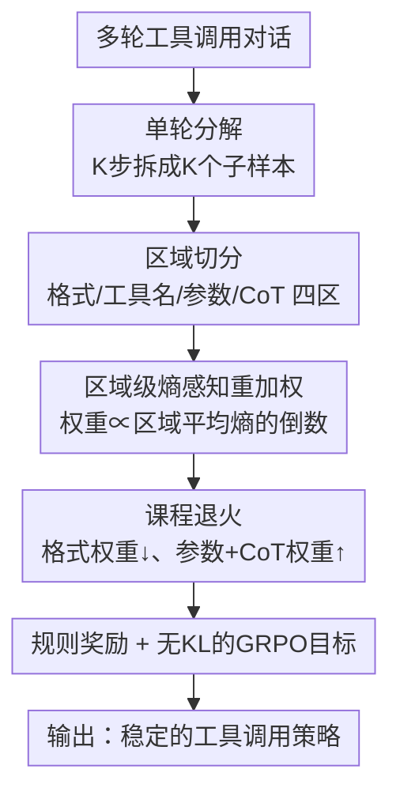

# ResT: Reshaping Token-Level Policy Gradients for Tool-Use Large Language Models

**会议**: ICLR 2026  
**OpenReview**: [https://openreview.net/forum?id=gNZlaKRWki](https://openreview.net/forum?id=gNZlaKRWki)  
**代码**: https://github.com/1229095296/ResT_Tool_use_LLM  
**领域**: 对齐RLHF / LLM Agent / 强化学习  
**关键词**: 工具调用, 策略梯度, token级重加权, 熵感知, 课程学习

## 一句话总结
ResT 针对工具调用 LLM 的 RL 训练，先从理论上证明"低熵的结构化 token（工具名、参数、格式标签）才是奖励的主要决定因素，且降低平均熵能减小策略梯度方差"，据此提出按区域平均熵对 token 级策略梯度做反比重加权，并用课程退火让权重从"格式正确"平滑过渡到"语义推理"，在 BFCL / API-Bank 上相比 GRPO 最高提升 8.76%，4B 模型多轮 base 任务超过 GPT-4o 1.50%。

## 研究背景与动机
**领域现状**：把 LLM 训成会调用外部工具的 agent，主流后训练手段是 SFT 和 RL，其中 RL（尤其无 critic 的 GRPO 系）泛化和鲁棒性更好。多数做法在多轮工具调用结束后只给一个 outcome reward（结果奖励）。

**现有痛点**：纯结果奖励在工具调用上有两个硬伤。第一，奖励本身噪声大——很多工具任务（如推荐）有多个合法输出，没有唯一参考答案，结果奖励会诱发高方差梯度、对中间推理几乎没有激励，即便加上 LLM-as-a-judge 也救不回来。第二，多轮交互系统开销大，吞吐低、horizon 不定，使得工具 RL 比 SFT 和单轮 RL 重得多。

**核心矛盾**：工具调用的成败往往只取决于少数几个关键 token（工具名、参数、输出格式），但标准的 RL 把奖励信号**均匀**摊到序列里所有 token 上。这种均匀处理稀释了这些稀疏却决定性的信号，对没有 token 级 critic 的 GRPO 尤其致命——推理 token 和闲聊 token 在训练早期贡献很小，却和关键 token 拿到同等的梯度权重。

**本文目标**：(1) 搞清楚到底哪些 token 在主导奖励、为什么强调它们能稳训练；(2) 设计一种能给每个 token 分配恰当梯度权重、又能随训练进程动态调整的轻量机制。

**切入角度**：作者从"策略熵 ↔ 训练稳定性"这个角度切入。直觉是：结构化控制 token（工具名/格式）天然是低熵的（模型很确定该输出什么），而开放式的 CoT token 是高熵的。如果能把这个熵差量化成方差贡献，就能反过来指导"该给谁多少梯度权重"。

**核心 idea**：用 token 区域的平均熵反比地重塑（reshape）策略梯度——低熵的结构 token 多给权重、高熵的推理 token 少给权重，再用课程学习随训练推进逐步把重心从结构正确移到语义推理。

## 方法详解

### 整体框架
ResT 要解决的是"工具调用 RL 里奖励信号被均匀稀释"的问题，整体思路是：先把多轮任务**拆成单轮**密集监督，再对单轮内的 token 按所属区域的平均熵做**梯度重加权**，最后用**课程退火**让权重分配随训练阶段演化，套进一个去掉 KL 项的 GRPO 目标里优化。

整条 pipeline 是：输入一个多轮工具调用对话 → 拆成 K 个单轮子样本（每个子样本看到完整历史、监督当前这一步动作）→ 把生成的响应切成「格式标签 / 工具名 / 参数 / CoT」四个区域 → 按各区域平均熵反比给 token 赋初始权重 → 课程退火动态调整四区权重 → 把归一化后的权重乘进 token 级策略梯度，用无 KL 的 GRPO 目标更新 → 得到更稳定的工具调用策略。其中"熵–方差"是整个重加权机制的理论支撑（见关键设计 1）。

### 关键设计

**1. 熵–方差理论：证明低熵结构 token 才是奖励的主要决定因素**

这是整个方法的地基，回答"凭什么该偏向结构化 token"。作者把策略梯度的方差逐层拆开：先由 Lemma 1 给出 mini-batch 估计的方差缩放律 $\mathrm{Var}(\widehat{\nabla J}^{(k)}) = \frac{1}{G}\mathrm{Var}(g_i^{(k)})$；再由 Lemma 2 把单轨迹梯度的二阶矩与 token 熵挂钩，核心不等式是每步 score 的范数被熵控制：$\mathbb{E}[\lVert s_t\rVert^2] = 1 - \sum_v p_{t,v}^2 \le 1 - e^{-H_t}$，其中 $H_t = -\sum_v p_{t,v}\log p_{t,v}$ 是 Shannon 熵。这说明熵越高、方差贡献越大。

顺着这个界，作者给重加权后的估计量 $g_i^{(rw)} = \big(\sum_t \tilde w_t \nabla_\theta \log\pi_\theta\big)\hat A_i$（约束 $\sum_t \tilde w_t = T$）求方差上界（Theorem 1）：$\mathrm{Var}(g_i^{(rw)}) \le \mathbb{E}[\hat A_i^2]\sum_t \beta_t(\tilde w_t)^2$，其中 $\beta_t = \mathbb{E}[\lVert J_t\rVert_F^2(1-e^{-H_t})]$ 把 Jacobian 范数和 token 熵打包成第 $t$ 步的方差贡献系数。最小化这个上界得到闭式最优权重（Theorem 2）：$\tilde w_t^\star = \frac{T}{\sum_u \beta_u^{-1}}\cdot\frac{1}{\beta_t}$——即对方差贡献大（高熵）的位置降权。这条链条把"偏向低熵 token"从直觉变成了有理论依据的方差缩减方案，而且保持估计无偏。

**2. 区域级熵感知重加权：把难算的最优权重换成可扩展的熵代理**

痛点是 Theorem 2 的 $\beta_t$ 依赖多个难以可靠估计的方差项，没法在大规模训练里逐 token 精确算。作者的做法是用 token 级熵作 $\beta_t$ 的代理，把闭式解近似成两条简单可扩展的规则：$\tilde w_t \propto \frac{1}{1-e^{-H_{avg}}}$ 或 $\tilde w_t \propto \frac{1}{H_{avg}}$。

关键是 $H_{avg}$ 不是逐 token 算，而是**按区域**算平均熵——把工具调用轨迹切成格式标签、工具名、关键参数、CoT 四个区域，每个区域算一个平均熵作为该区所有 token 的共享方差代理。这样开放式的 CoT（高熵）天然拿到低权重、结构化的工具名/格式（低熵）拿到高权重，正好把梯度集中到决定奖励的关键 token 上。最后还要做序列内归一化 $\bar w = \frac{1}{|T|}\sum_t \hat w_t$、$w_t = \frac{\hat w_t}{\bar w + \delta}$，把权重重分布到同一样本的各 token 上而不改变整体尺度。

**3. 课程退火：从结构正确平滑过渡到语义推理**

光有静态熵权重还不够——理想的工具 RL 应该先学会格式合规、再学参数精确、最后才打磨复杂推理，但这种课程很少有人显式做。ResT 用一个由训练进度 $\nu\in(0,1)$ 驱动的退火把这个进阶过程内化进权重里。

具体地，工具名始终保持高权重（它最关键且贯穿始终），格式权重随进度**衰减**、参数和 CoT 权重随进度**增长**：$\tilde w_{t,fmt}(\nu) = \max(w_{min}, \tilde w_{t,fmt} - \alpha_f\nu)$，$\tilde w_{t,para}(\nu) = \min(w_{max}, \tilde w_{t,para} + \alpha_p\nu)$，且 CoT 权重和参数权重同步增长 $\tilde w_{t,thk}(\nu) = \min(w_{max}, \tilde w_{t,thk} + \alpha_t\nu)$（让 CoT 和参数一起上来以鼓励逐步推理、提升参数准确率）。早期保证"语法对"、后期再投入"语义对"，这条轻量课程进一步稳定收敛，也是消融里掉点最狠的组件之一。

**4. 规则奖励 + 无 KL 的 GRPO 目标：给重加权提供密集且低方差的奖励**

工具调用任务需要密集、可解释的奖励，ResT 用规则奖励而非学出来的奖励模型。总奖励是格式分和工具调用正确分的加权和：格式分 $S_{format}$ 用 exact-match（所有必填字段按序齐全才给 1）；正确分 $S_{acc}$ 由三部分组成——工具名用 Jaccard 相似度 $r_{name} = \frac{|N_G\cap N_P|}{|N_G\cup N_P|}$、参数名同样用 Jaccard、参数值因精度要求高用 exact-match，再归一化。最终奖励还乘上训练进度因子 $(1-\bar\nu)$ 做动态缩放。

优化目标在 GRPO 基础上把重加权因子 $\omega_t$ 乘进每个 token：$L_{ResT}(\theta) = -\frac{1}{G}\sum_i\sum_t \frac{\omega_t}{T}\min\big(r_{i,t}\hat A_i, \mathrm{clip}(r_{i,t}, 1-\epsilon, 1+\epsilon)\hat A_i\big)$，其中 $r_{i,t}$ 是新旧策略概率比，优势 $\hat A_i$ 用 group 内标准化（带 $\delta$ 数值稳定项）。值得注意的是 ResT **去掉了 GRPO 里的 KL 惩罚项**，改由"熵感知重加权 + clip + 课程"三者共同调控探索/利用权衡，消融证明即便没有显式 KL 也能稳定训练。

### 损失函数 / 训练策略
训练用 verl 0.5.0 框架，混合语料 ToolACE（学"何时调用 vs 直接回答"）+ Hammer-masked（随机化工具/参数名，逼模型靠描述而非记名字泛化）+ XLAM（每轮可能要一个或多个工具的组合任务）。多轮对话按 SWiRL 方式拆成单步实例：K 步对话拆成 K 个子样本，每个以完整前文为输入、当前动作为监督目标，从而把"只在最终给奖励"变成"每步都有过程级监督"，大幅提高训练信号密度。

## 实验关键数据

### 主实验
在 BFCL 多轮和 API-Bank 上微调 Qwen3 系列（1.7B/4B/8B/14B），对比 Base、SFT、TSFT（工具 token 加权 SFT）、RSFT（推理 token 加权 SFT）、GRPO、SFT+GRPO、Dr.GRPO 等基线。

| 基准 / 模型 | 指标 | ResT | 最强基线 | 备注 |
|--------|------|------|----------|------|
| BFCL 多轮 (Qwen3-4B-2507) | Overall Acc | 50.38% | 48.62% (Dr.GRPO) | 多轮 base 任务 62.50% |
| BFCL 多轮 (Qwen3-14B) | Overall Acc | 44.25% | 38.88% (GRPO) | 较 GRPO +5.37% |
| BFCL 多轮 (Qwen3-8B) | Overall Acc | 40.13% | 38.12% (Dr.GRPO) | base 50.50% |
| API-Bank (Qwen3-8B) | Overall Acc | 70.69% | 68.15% (Dr.GRPO) | Level 3 达 60.31% |
| GPT-4o-2024-11-20 (参考) | BFCL Overall | 50.00% | — | 4B 的 ResT 多轮 base 超它 1.50% |

整体看，ResT 在两个基准上相比 GRPO 最高提升 8.76%（BFCL）/ 3.02%（API-Bank），且 Qwen3-4B-2507 在多轮 base 任务上超过 GPT-4o 1.50%、单轮任务领先 4.11%。

### 消融实验

| 配置 (Qwen3-8B, API-Bank) | Overall Acc | 说明 |
|------|---------|------|
| Full ResT | 70.69% | 完整模型 |
| w/o 动态奖励 | 64.15% | 去掉动态缩放奖励，掉 6.54% |
| w/o CoT 梯度 | 66.33% | CoT 不参与梯度，掉 4.36% |
| w/o 课程学习 | 65.83% | 各区域用常数权重，掉 4.86% |

### 关键发现
- 三个组件（动态奖励、CoT 梯度、课程学习）各自都必要，去掉任一都掉点；在 8B 上去掉动态奖励掉得最狠（−6.54%），说明随进度缩放奖励对稳定训练贡献最大。
- 课程退火相比静态权重最高提升 4.86%，验证了"先结构后语义"的进阶式权重分配确实有效。
- ResT 在 API-Bank Level 3（最难的多轮调用）上提升尤其明显（如 8B 从基线的 40 段位拉到 60.31%），说明熵感知重加权在长程、高精度场景收益更大。
- 去掉 KL 惩罚不影响稳定性——熵感知重加权 + clip + 课程三者共同替代了 KL 的正则作用。

## 亮点与洞察
- 把"该给哪些 token 多少梯度权重"这件偏经验的事，做成了一条可证明的方差缩减链条（Lemma 1→Lemma 2→Theorem 1→Theorem 2），并诚实地承认精确 $\beta_t$ 算不动、退而用区域平均熵作代理——理论指方向、工程给落地，结合得很干净。
- "区域级"而非"逐 token"算熵是关键工程取舍：四个语义区域天然对应工具调用的结构（格式/名/参数/推理），既省算力又恰好匹配"低熵结构 token 该多给权重"的直觉。
- 课程退火把"训练阶段"这个时间维度编码进权重，思路可迁移到任何"先学语法、再学语义"的结构化生成任务（如代码生成、SQL 生成）。
- 去掉 KL 还能稳，提示对 GRPO 系方法，token 级的精细信号调控可以部分替代序列级的 KL 约束。

## 局限与展望
- 方法强依赖"能把响应清晰切成格式/工具名/参数/CoT 四个区域"，这对结构化的工具调用成立，但迁移到边界模糊的自由文本任务时区域切分本身就成了难点。
- 熵代理是对最优权重 $\beta_t$ 的近似，论文未量化代理与真实最优之间的差距，极端分布下代理是否仍可靠存疑。
- 实验集中在 Qwen3 系列和两个工具基准，跨模型族（如非 Qwen 架构）、跨更开放的真实 API 环境的泛化性还需验证。
- 课程退火引入了 $\alpha_f, \alpha_p, \alpha_t, w_{min}, w_{max}$ 等一批超参，Table 4 也显示性能对课程调参敏感，调参成本不低。

## 相关工作与启发
- **vs ToolRL (Qian et al., 2025)**: 二者都把多轮工具调用分解成单轮、用规则匹配奖励做高效 RL；区别在 ToolRL 仍对所有 token 均匀处理，ResT 进一步在 token 级按区域熵重塑梯度，并加了课程退火，正面回应了"均匀处理稀释信号"这个 ToolRL 没解决的问题。
- **vs Dr.GRPO**: Dr.GRPO 从优势归一化角度去偏（去掉标准差归一化、近似 RLOO 风格），是序列级改动；ResT 是 token 级的梯度重加权，二者正交，且实验里 ResT 普遍优于 Dr.GRPO。
- **vs token 级 RLHF（TLCR / TLDR / token-level Q-RM）**: 这些方法显式构造 token 级奖励或 critic（常需 GPT-4 标注或额外训练判别器）；ResT 不学奖励模型，只用现成的熵信号重塑梯度，更轻量、可扩展。
- **vs 课程 RL（E2H Reasoner 等）**: 经典课程 RL 在任务/环境/prompt 层面把样本从易到难排序；ResT 把课程下沉到 token 区域权重层面，是一种更细粒度的"隐式课程"。

## 评分
- 新颖性: ⭐⭐⭐⭐⭐ 把熵–方差理论落到 token 区域级梯度重加权，并配课程退火，角度新且自洽
- 实验充分度: ⭐⭐⭐⭐ 覆盖 4 个模型规模、两个基准、完整组件消融，但局限在 Qwen3 系
- 写作质量: ⭐⭐⭐⭐ 理论推导清晰、动机层层递进，符号略密集
- 价值: ⭐⭐⭐⭐ 给工具调用 RL 提供了即插即用、无需额外奖励模型的稳定训练方案

<!-- RELATED:START -->

## 相关论文

- [\[ICLR 2026\] ReTool: Reinforcement Learning for Strategic Tool Use in LLMs](retool_reinforcement_learning_for_strategic_tool_use_in_llms.md)
- [\[ICLR 2026\] AutoTool: Automatic Scaling of Tool-Use Capabilities in RL via Decoupled Entropy Constraints](autotool_automatic_scaling_of_tool-use_capabilities_in_rl_via_decoupled_entropy_.md)
- [\[ICLR 2026\] SPG: Sandwiched Policy Gradient for Masked Diffusion Language Models](spg_sandwiched_policy_gradient_for_masked_diffusion_language_models.md)
- [\[ICLR 2026\] Does “Do Differentiable Simulators Give Better Policy Gradients?” Give Better Policy Gradients?](does_do_differentiable_simulators_give_better_policy_gradients_give_better_polic.md)
- [\[ICLR 2026\] On Predictability of Reinforcement Learning Dynamics for Large Language Models](on_predictability_of_reinforcement_learning_dynamics_for_large_language_models.md)

<!-- RELATED:END -->
