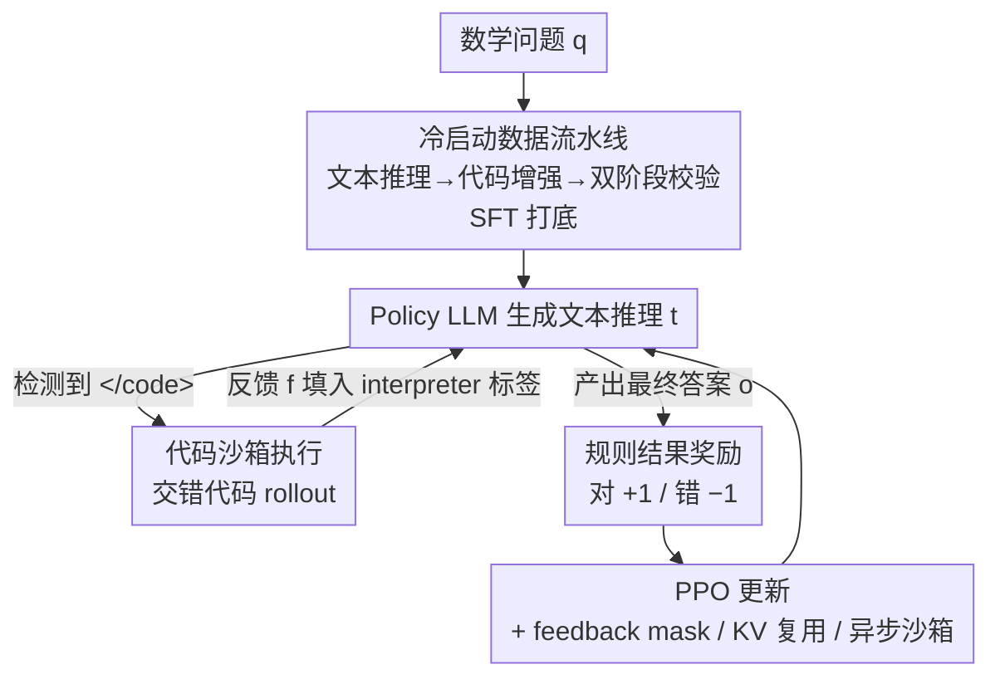

# ReTool: Reinforcement Learning for Strategic Tool Use in LLMs

**会议**: ICLR 2026  
**OpenReview**: [https://openreview.net/forum?id=tRk1nofSmz](https://openreview.net/forum?id=tRk1nofSmz)  
**代码**: 待确认  
**领域**: 强化学习 / LLM 推理 / 工具调用  
**关键词**: 工具集成推理, 代码解释器, PPO, 结果奖励, 数学推理

## 一句话总结
ReTool 用一套"冷启动 SFT + 工具增强 RL"的训练框架，让 LLM 在长链推理中自主学会"何时、如何调用代码解释器"，仅用结果对错作奖励，把 32B 模型在 AIME2024 上做到 67.0%，大幅超过纯文本 RL 基线（40.0%）且训练步数只用了它的三分之一。

## 研究背景与动机

**领域现状**：用强化学习（RL）训练的推理模型（OpenAI o1、DeepSeek R1）已经能在纯文本任务上自我纠错、展开很长的思维链（CoT），在数学、逻辑推理上表现强劲。主流范式就是"把更长、更深思熟虑的文本推理"作为提升推理能力的手段。

**现有痛点**：纯文本推理在需要"精确数值计算 / 符号操作"的场景上是有天花板的——几何推理、复杂方程求解、大数枚举验证这类任务，靠语言模型在 token 空间里"心算"，既容易算错，又会出现误差逐步累积（compounding error）。而代码解释器（Code Interpreter, CI）恰恰能提供一个**可执行、可验证**的形式化接口，把这些计算交给程序去精确完成。

**核心矛盾**：怎么把 CI 接进推理回路？已有工作要么靠提示（prompting），要么靠监督微调（SFT）去模仿一份精心标注的工具调用数据。问题是这些方法只能"复刻"训练分布里见过的调用模式，无法泛化到新问题，也学不会**自适应地判断"该不该调、该怎么调"**——结果就是模型要么滥用工具，要么退化成脆弱的启发式规则。

**本文目标**：让模型自己去探索"何时调用代码、写什么代码、出错了怎么补救"的策略，而不是被人工先验框死。

**切入角度**：RL 天然适合这件事——它允许模型在灵活的推理轨迹上探索，并用**结果反馈**（答案对不对）来塑造工具使用策略。只要奖励设计得当，模型就能自发发现"代码自纠错""提前调用工具"等高级行为。

**核心 idea**：先用一份代码增强的长推理数据做冷启动 SFT，给模型打底；再用一套支持"推理过程中实时交错执行代码"的 RL 流程，仅以最终答案对错作为奖励，让模型在与沙箱代码解释器的交互中自主优化工具调用策略。

## 方法详解

### 整体框架

ReTool 整体是**两阶段**：第一阶段是**冷启动 SFT**，用一条数据流水线把纯文本推理数据自动改写成"代码增强的长推理轨迹"，让模型先具备基本的"调用代码 + 分析执行结果"能力；第二阶段是**工具增强 RL**，模型作为 policy 在 rollout 时一边写文本推理、一边在检测到代码结束标记时把代码丢给沙箱执行、再把执行结果喂回来继续推理，最终只用一个"答案对就 +1、错就 −1"的规则奖励来跑 PPO，迭代打磨工具调用策略。

整个 RL 阶段的核心是 rollout 里的"文本 ⊕ 代码 ⊕ 解释器反馈"交错循环，下图给出这一回路：

### 关键设计

**1. 冷启动数据流水线：把"心算"步骤自动替换成可执行代码，给 RL 一个稳定起点**

直接上 RL 训练一个从没见过工具调用格式的模型，会因为初始策略太差而难以收敛。ReTool 先解决"起点"问题：从 Open-Thoughts 等开源数学推理数据出发，用"人工专家 + DeepSeek-R1 评估"的双重校验过滤掉无效样本，得到高质量纯文本推理集 $D_{init}$；再用一个结构化提示模板把每条轨迹里"适合用代码完成的手算步骤"自动替换成对应的代码片段及其解释器执行结果，得到代码增强集 $D_{CI}$。生成后还要过一道**两阶段校验**：第一阶段格式校验，保证语法一致、便于后续 RL 阶段可靠地检测"工具调用触发器"；第二阶段答案校验，剔除最终答案算错的样本。最后用 $D_{CI}$ 做 SFT，让模型学会"何时、如何调用代码解释器"。消融显示，这个冷启动模型在 AIME2024 上就有 40.9%，已经和纯文本 RL 基线（40.0%）相当、远高于原始基座（26.7%），说明这份数据确实把工具使用模式捕捉进了可执行轨迹里。

**2. 交错代码执行的 Rollout：让推理与实时执行结果真正"边推边算"**

传统 RL rollout 只生成纯文本（Figure 2a），ReTool 的 rollout 则是 policy LLM 与外部代码沙箱协作产出"文本 + 代码 + 实时解释器反馈"的混合内容（Figure 2b）。具体机制：用提示模板引导模型用 `<code></code>` 标签显式标出代码边界；rollout 时模型先生成文本推理 $t_1$，一旦检测到代码结束触发器 `</code>`，生成暂停，解析出代码 $c_1$ 送进沙箱执行，执行完把沙箱输出 $f_1$（成功结果或报错信息）填进 `<interpreter></interpreter>` 标签喂回模型，模型据此继续生成，直到给出最终答案 $o$ 或写出新一段代码，最终产出一条混合推理轨迹 $[t_1 \oplus c_1 \oplus f_1 \oplus \dots \oplus o]$。关键之处在于：**报错信息也照样喂回去**——正是这个动态反馈让模型能基于"代码没跑通"这一信号迭代探索、修正策略，催生出后面观察到的代码自纠错行为。

**3. 极简的结果奖励：只看答案对错，刻意不奖励"代码能否执行"**

奖励设计上 ReTool 走极简路线，用规则化的准确率奖励：要求模型把最终答案放进 `\boxed{}` 这类指定格式，便于可靠地规则校验，奖励为

$$R(a, \hat{a}) = \begin{cases} 1, & \text{is\_equivalent}(a, \hat{a}) \\ -1, & \text{otherwise} \end{cases}$$

其中 $a$ 是标准答案、$\hat{a}$ 是预测答案。作者特意**不**引入"代码可执行性"作为奖励项——因为一旦奖励代码能跑通，模型很容易学会"为了拿奖励而写无意义但能执行的代码"这类 reward hacking。只用最终结果反馈，反而逼着模型自主权衡"代码值不值得调、怎么调才能把题做对"，从而探索出更多样的问题求解行为。PPO 的目标函数就是标准的带 clip 的策略比值形式，只是 rollout $\pi_\theta(o_t \mid q, o_{<t}; CI)$ 里包含了与代码解释器交错执行的反馈。

**4. 三项工程稳定化：让"外部 token 注入 + 多轮执行"的训练不崩**

把沙箱反馈塞进推理轨迹会带来三个工程问题，ReTool 各给一招。其一是**解释器反馈掩码（Interpreter Feedback Mask）**：把 `<interpreter></interpreter>` 里的反馈输出从 loss 计算中 mask 掉——这些 token 是外部环境产生的、不是模型自己生成的，若算进 loss 会干扰梯度、破坏模型自身连贯推理序列的学习，掩掉才能保证训练稳定。其二是 **KV-Cache 复用**：每次检测到 `</code>` 触发器时，把代码执行前的全部 KV-cache 缓存下来，只对解释器反馈部分新增计算并追加 KV-cache，大幅降低每次 rollout 的显存开销。其三是**异步沙箱**：把沙箱 pod 设计成工作池里的 worker，各自按当前容量主动拉取任务，形成天然负载均衡，多线程并行环境交互，避免慢线程拖成瓶颈，维持训练吞吐。

### 损失函数 / 训练策略
RL 用 PPO（基于 VeRL 框架），KL 系数设为 0.0；冷启动数据训练 2 个 epoch。优化器 AdamW，初始学习率 1e-6，最大序列长度 16384 token，mini-batch 512。主干为 Qwen2.5-32B-Instruct，另用 DeepSeek-R1-Distill-Qwen-32B 做更强主干验证。全部实验在 NVIDIA H20 GPU 上完成。

## 实验关键数据

### 主实验
评测在 AIME2024/2025（重复 32 次）、GPQA-Diamond（8 次）、MATH500（4 次）、GSM8K（2 次）上取平均估计 pass@1，推理温度 1.0、top-p 0.7。

| 模型 | AIME2024 | AIME2025 | GSM8K | MATH500 | GPQA |
|------|----------|----------|-------|---------|------|
| Qwen2.5-Math-72B-Instruct-TIR | 40.0 | - | 95.8 | 88.1 | - |
| OpenAI o1-preview | 44.6 | 37.9 | - | 85.5 | 73.3 |
| QwQ-32B-Preview | 50.0 | 33.5 | - | 90.6 | 54.5 |
| s1-32B | 56.7 | - | - | 93.0 | 59.6 |
| **ReTool (Qwen2.5-32B-Instruct)** | **67.0** | **49.3** | 95.9 | 93.1 | 58.7 |
| **ReTool (DeepSeek-R1-Distill-Qwen-32B)** | **72.5** | **54.3** | 96.3 | 95.2 | 62.3 |

ReTool（Qwen2.5-32B）仅用 400 训练步就拿到 AIME2024 67.0%，而纯文本 RL 基线要 1080 步才到 40.0%——既赢了性能也赢了效率；AIME2025 上比 o1-preview 高 11.4%。换更强主干后进一步提升到 AIME2024 72.5%、AIME2025 54.3%。

### 消融实验
基座为 Qwen2.5-32B-Instruct，主要看去掉 RL / 去掉 CI 的影响（数值取自 Figure 3a）。

| 配置 | AIME2024 | AIME2025 | 说明 |
|------|----------|----------|------|
| ReTool (Full) | 67.0 | 49.3 | 冷启动 + 工具增强 RL |
| w/o RL | 40.9 | 34.5 | 只有冷启动 SFT（仍带 CI） |
| w/o CI | 40.0 | 36.7 | 纯文本 RL（文本冷启动以保公平） |
| w/o Training | 26.7 | 11.9 | 原始基座 |

去掉 RL 或去掉 CI 都会显著掉点：冷启动模型（40.9%）已与纯文本 RL（40.0%）相当，说明数据流水线把工具使用模式学进去了；而在此之上加 CI 集成的 RL 又把 AIME2024 从 ~40% 推到 67.0%，证明"工具 + RL"两者缺一不可。

### 关键发现
- **响应更短而更准**：RL 训练后平均响应长度比训练前缩短约 40%（从 ~10k 降到 ~6k token）——用简洁代码替换冗长手算过程，提升了推理 token 利用效率；曲线呈"先骤降后缓升"，后期回升来自更复杂多样的代码行为涌现。
- **工具使用能力随训练增强**：代码占比（含代码的响应比例）一路上升到近 98%；平均代码行数训练末期约为训练前的 5 倍，说明模型学会了更复杂的代码策略；代码调用时机也整体**提前**，体现策略性工具使用的发展。
- **代码自纠错是涌现行为**：尽管没有任何针对自纠错的训练数据，模型在收到"undefined function greedy()"这类报错后会反思"函数得定义在同一作用域，改一下"并生成可执行的修正版本；自纠错频率在训练早期达峰、随模型直接写对代码能力提升而下降，呈现典型的"先靠纠错、后靠一次写对"的"啊哈时刻"。
- **泛化到 Web 搜索**：把 ReTool 配上 Bing 搜索工具（按 MCP 工具定义），在 GAIA、BrowseComp-ZH 上同样优于同主干的 WebDancer、Search-o1，说明方法不局限于数学，对更广的工具使用场景具备适应性。

## 亮点与洞察
- **奖励"做减法"反而更好**：刻意只用结果奖励、不奖励代码可执行性，是为了避免 reward hacking。这点很值得借鉴——工具调用 RL 里"奖励中间过程"往往会被模型钻空子，纯结果奖励反而逼出真正有用的策略。
- **冷启动是 RL 收敛的关键脚手架**：数据流水线把"手算步骤→代码片段"自动改写并双重校验，使 SFT 后的起点就达到纯文本 RL 的终点水平，RL 才能在 400 步内冲到 67%。这套"自动构造工具增强冷启动数据"的思路可迁移到任意"LLM + 外部工具"的 RL 训练。
- **三项工程 trick 普适性强**：feedback mask（外部 token 不进 loss）、KV-cache 复用（代码执行前缓存、只算反馈增量）、异步沙箱（worker 池负载均衡），这三招对任何"多轮调用外部环境"的 RL 训练都直接可用。
- **效率与精度同时改善的反直觉结果**：通常以为调用工具会让轨迹更长，但 ReTool 训练后响应反而短 40%——把冗长心算外包给代码，等于压缩了推理 token，是"神经-符号混合系统"的一个有力佐证。

## 局限与展望
- **任务域偏窄**：主战场是数学奥赛（AIME）这类有明确数值答案、便于规则校验的任务；纯结果奖励依赖"答案可被规则判等"，对开放式、无唯一答案的任务如何设奖励仍是开放问题。
- **工具单一**：核心实验只用了代码解释器，Web 搜索是附加验证；多工具协同、工具选择空间更大时策略是否仍稳定收敛，文中未充分展开。
- **奖励信号稀疏**：只用最终对错的 ±1 奖励，对超长轨迹的 credit assignment 较粗；自己看，长链多次调用时哪一步代码真正起了作用，仅靠结果奖励较难精细归因。
- **改进思路**：可探索过程级但抗 hacking 的奖励（如基于执行轨迹一致性的隐式信号）、更大的工具库与工具路由，以及把冷启动数据流水线扩展到非数学领域。

## 相关工作与启发
- **vs 纯文本 RL（o1 / R1 范式）**: 它们靠延长文本 CoT 自我纠错，本文在推理回路里嵌入可执行代码解释器，区别在于把精确计算外包给程序而非让模型"心算"；优势是数值/符号任务更准、训练更快（400 vs 1080 步），代价是需要沙箱基础设施。
- **vs 提示 / SFT 式工具学习（如 TIR）**: 它们模仿固定的工具调用数据分布、难泛化，本文用结果奖励让模型自主探索"何时/如何调用"，区别在于策略由反馈塑造而非被标注框死；ReTool (Qwen2.5-32B) 在 AIME2024 上 67.0% 远超 Qwen2.5-Math-72B-Instruct-TIR 的 40.0%，且参数更小。

## 评分
- 新颖性: ⭐⭐⭐⭐ 把"交错代码执行 rollout + 纯结果奖励"系统化为可训练框架，并观察到自纠错涌现，思路清晰但 CI+RL 的大方向并非首创
- 实验充分度: ⭐⭐⭐⭐⭐ 主实验 + 消融 + Web 搜索泛化 + 6 项 CI 行为演化分析，覆盖很全
- 写作质量: ⭐⭐⭐⭐ 框架与分析叙述清楚，公式与机制交代到位
- 价值: ⭐⭐⭐⭐⭐ 用 32B 超过 o1-preview，且训练效率与工程 trick 都有很强的可复用性

<!-- RELATED:START -->

## 相关论文

- [\[ICLR 2026\] AutoTool: Automatic Scaling of Tool-Use Capabilities in RL via Decoupled Entropy Constraints](autotool_automatic_scaling_of_tool-use_capabilities_in_rl_via_decoupled_entropy_.md)
- [\[ICLR 2026\] ResT: Reshaping Token-Level Policy Gradients for Tool-Use Large Language Models](rest_reshaping_token-level_policy_gradients_for_tool-use_large_language_models.md)
- [\[ICLR 2026\] Towards Strategic Persuasion with Language Models](towards_strategic_persuasion_with_language_models.md)
- [\[ICLR 2026\] Use the Online Network If You Can: Towards Fast and Stable Reinforcement Learning](use_the_online_network_if_you_can_towards_fast_and_stable_reinforcement_learning.md)
- [\[ICLR 2026\] Getting Your LLMs Ready for Reinforcement Learning with Lightweight SFT](getting_your_llms_ready_for_reinforcement_learning_with_lightweight_sft.md)

<!-- RELATED:END -->
