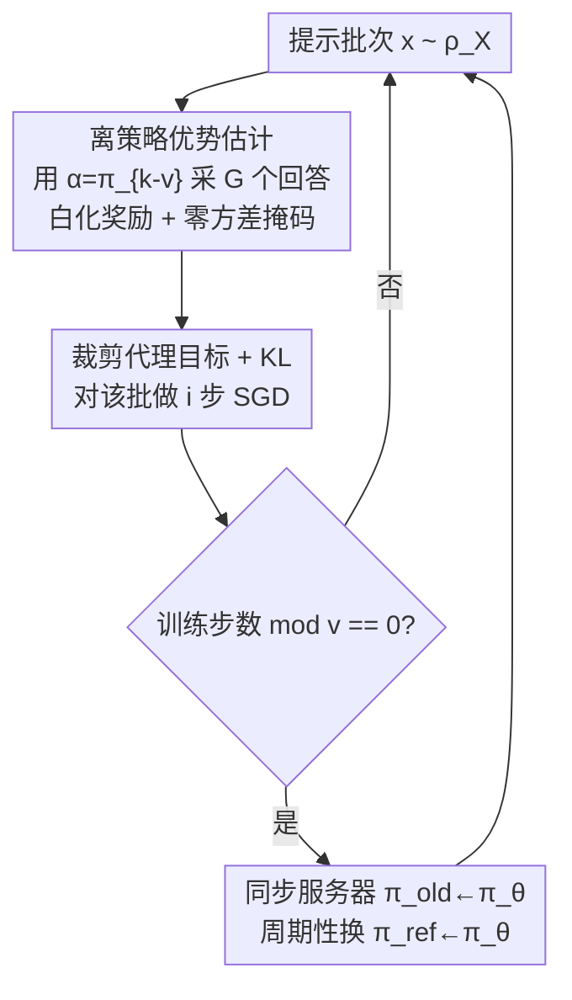

# Revisiting Group Relative Policy Optimization: Insights into On-Policy and Off-Policy Training

**会议**: ICLR2026  
**OpenReview**: [https://openreview.net/forum?id=XXfOf22o3K](https://openreview.net/forum?id=XXfOf22o3K)  
**代码**: 待确认（基于 TRL 的 GRPO 实现修改）  
**领域**: 强化学习 / 可验证奖励 RL / LLM 后训练  
**关键词**: GRPO, 离策略, 可验证奖励, 策略提升下界, 裁剪代理目标

## 一句话总结
本文把 DeepSeek 的 GRPO 从在策略推广到离策略：用一个旧策略 $\alpha=\pi_{k-v}$ 来白化奖励、估计优势，并证明在策略与离策略目标都给出期望奖励提升的下界，由此导出与离策略 PPO 一致的裁剪代理目标；实验表明离策略 GRPO（每 $v$ 步才更新一次推理服务器）在数学推理任务上与在策略持平甚至更优，同时把 7B 模型的训练吞吐提升约 1.35×。

## 研究背景与动机

**领域现状**：GRPO（Shao et al. 2024）是当下 LLM 后训练（尤其是可验证奖励 RLVR、用来训推理/代码模型，如 DeepSeek-R1）的主流算法。它相对 PPO 的关键简化是去掉 critic 网络：对每个 prompt $x$ 用当前策略 $\pi_k$ 采一组（group）共 $G$ 个回答，用这组奖励的均值和标准差把奖励标准化，直接当作优势函数，再配一个裁剪代理目标 + KL 正则做更新。TRL、VERL 等开源库都内置了它。

**现有痛点**：标准 GRPO 是在策略的——优势统计量必须用最新的 $\pi_k$ 来算，这意味着每一步训练后都要把更新过的权重重新同步到推理服务器（vLLM）上才能继续采样。对需要张量并行、多 GPU serving 的大模型来说，这种"每步都重新分发权重"会触发深拷贝和跨 GPU 通信，开销随模型规模线性增长，频繁更新（$v=1$）甚至能主导整个训练时间。

**核心矛盾**：在策略保证了优势估计的"新鲜"，但代价是高昂的通信/serving 成本；想省成本就得用旧策略的样本，可那样优势估计就变成了离策略，理论上还能不能保证奖励单调提升、就成了悬而未决的问题。此外已有分析（Mroueh 2025）发现，原版 GRPO 在 $\mu>1$（对同一批样本反复做 SGD）时其实已经隐式地在做离策略优势估计，并经验上带来了性能提升——说明"离策略"对 GRPO 可能不是坏事而是好事，但缺乏理论支撑。

**本文目标**：(1) 把 GRPO 显式地推广到离策略设定，用一个滞后策略 $\alpha=\pi_{k-v}$ 来估计优势；(2) 给出在策略与离策略两种情形下的策略提升下界，说清楚什么条件下"优化优势"能真正提升奖励；(3) 由约束优化导出可落地的裁剪代理目标。

**切入角度**：借鉴离策略 PPO 的丰富文献（GePPO、ToPPO、OPPO 等）。这些工作已经证明 PPO 可以在保持收敛保证的前提下复用样本，作者把同样的思路移植到 GRPO 上——但关键区别在于，GRPO 的优势是"白化奖励"这种解析形式，因此证明可以绕开 PPO 分析里必须的状态访问分布（state visitation distribution），不再依赖 MDP 假设。

**核心 idea**：用滞后策略 $\pi_{k-v}$ 估计 GRPO 优势 + 重要性采样，证明它和在策略一样保证奖励提升，从而把"每步同步权重"放宽成"每 $v$ 步同步一次"，省通信而不掉性能。

## 方法详解

### 整体框架

本文要解决的是"GRPO 能不能安全地离策略化"。整体思路是：把采样和优势估计交给一个滞后的旧策略 $\alpha=\pi_{k-v}$（它每 $v$ 步才和最新策略同步一次），用重要性采样把目标改写到 $\alpha$ 下；理论上证明只要 $\alpha$ 离当前策略 $\pi_k$ 不太远、且奖励方差不为零，最大化（带正则的）离策略优势就能提升期望奖励；工程上把这套理论落成一个由两个旋钮 $(v, i)$ 控制的迭代算法，在策略 GRPO 只是 $v=1, i=1$ 的特例。

训练循环（Algorithm 1）大致是：从 prompt 分布采一批 $x$ → 用服务器上的旧策略 $\pi_\text{old}=\alpha$ 对每个 $x$ 采 $G$ 个回答 → 跑可验证奖励 → 用 $\alpha$ 的组统计量算白化优势（可选地掩掉零方差样本）→ 用裁剪代理目标 + KL 正则做 $i$ 步 SGD 更新 → 每 $v$ 步才把最新权重同步回服务器、并周期性把参考策略 $\pi_\text{ref}$ 换成最新模型。$v$ 控制"多久同步一次服务器"（即离策略程度），$i$ 控制"每批样本复用几次"。

### 关键设计

**1. 离策略优势估计：用滞后策略 $\alpha=\pi_{k-v}$ 白化奖励**

针对"在策略要求每步同步权重、通信太贵"的痛点，本文把优势估计从当前策略 $\pi_k$ 解耦到一个滞后策略 $\alpha$。在策略 GRPO 的优势是用当前组样本估计的白化奖励：

$$\hat{A}_{\pi_k}(x, y_i) = \frac{r_i - \text{mean}(\{r_\ell\})}{\sqrt{\text{std}^2(\{r_\ell\}) + \varepsilon}}$$

本文把均值/标准差改用离策略分布 $\alpha$ 来算，得到离策略优势

$$A_\alpha(x,y) = \frac{r(x,y) - \mu_{\alpha,r}(x)}{\sigma_{\alpha,r,\varepsilon}(x)},\qquad \sigma_{\alpha,r,\varepsilon}(x)=\sqrt{\sigma_{\alpha,r}^2(x)+\varepsilon}$$

并通过重要性采样把目标写到 $\alpha$ 下：$L_\alpha(\pi)=\mathbb{E}_{y\sim\alpha}\frac{\pi(y|x)}{\alpha(y|x)}A_\alpha(x,y)$。当 $\alpha=\pi_k$ 时它退化回在策略 GRPO。实践中取 $\alpha=\pi_{k-v}$，每个 $v$ 周期内用同一个旧策略采"新鲜样本"（注意和原版 GRPO 的 $\mu>1$ 不同：原版是固定一批样本反复用，本文是固定一个旧策略但每批重采）。这一步是整篇文章的支点——它让推理服务器可以 $v$ 步才更新一次。

**2. 在策略/离策略统一的策略提升下界：证明优化优势能提升奖励**

光把优势离策略化还不够，得证明这样优化不会跑偏。本文给出核心定理（Theorem 1）：在奖励有界 $0\le r\le 1$ 的前提下，对任意策略 $\pi$，

$$J(\pi) - J(\pi_k) \ge L_\alpha(\pi) - 2\,\frac{1-\sigma_{\alpha,r,\varepsilon}(x)}{\sigma_{\alpha,r,\varepsilon}(x)}\,\mathrm{TV}(\pi,\alpha) - 2\,\mathrm{TV}(\pi_k,\alpha)$$

其中 $\mathrm{TV}$ 是总变差距离。这说明：只要 $\alpha$ 离 $\pi_k$ 足够近（$\mathrm{TV}(\pi_k,\alpha)\le\delta$）、且方差项不爆炸，最大化离策略优势就能保证期望奖励提升；令 $\alpha=\pi_k$ 即得在策略版本（Corollary 1）。和 PPO/TRPO 的下界对比，结构相似但有个关键差异：PPO 里加权 TV 的常数是绝对常数，而 GRPO 里这个权重 $\frac{1-\sigma_{\alpha,r,\varepsilon}}{\sigma_{\alpha,r,\varepsilon}}$ 是依赖策略和数据的。对可验证（二元 Bernoulli，成功概率 $p$）奖励，该量为

$$\frac{1-\sigma_{\alpha,r,\varepsilon}(x)}{\sigma_{\alpha,r,\varepsilon}(x)} = \frac{1-\sqrt{p(1-p)+\varepsilon}}{\sqrt{p(1-p)+\varepsilon}}$$

它在 $p\to 0$（全错）或 $p\to 1$（全对）时发散，会让下界里的负项主导、破坏提升保证。这正好从理论上解释了 DAPO 为何要"过滤掉全对/全错的 prompt"：本文据此提出零方差掩码——对 $\sigma_{\pi_k,r}(x)=0$ 的样本乘上指示函数掩掉：

$$\mathbb{E}_{x}\,\mathbb{1}_{\sigma_{\pi_k,r}(x)\ne 0}\big(L^c_{\pi_k}(\pi)-\beta\,\mathrm{KL}(\pi\|\pi_\text{ref})\big)$$

把发散项控制住。值得一提的是，本文的证明利用 GRPO 优势的解析形式，绕开了 PPO 分析必须的状态访问分布，因此不依赖 MDP 框架、更一般。

**3. 从约束优化导出裁剪代理目标：在策略 GRPO 只是特例**

下界里出现的 $\mathrm{TV}(\pi,\alpha)$ 不好直接优化。本文把"最大化下界"写成约束优化 $\max_\pi \mathbb{E}_x L_\alpha(\pi)\ \text{s.t.}\ \mathbb{E}_x\mathrm{TV}^2(\pi,\alpha)\le\Delta^2$，再用 Pinsker 不等式把 TV 约束换成 KL 约束，得到与原版约束 PPO 同形的问题（区别只在优势是 $\alpha$ 下的白化奖励、且用 $\alpha$ 做重要性采样）。实际落地为裁剪代理：定义 $f_\epsilon(r,r',a)=\min\big(ra,\ \text{clip}(r,\max(r'-\epsilon,0),r'+\epsilon)\,a\big)$，离策略 GRPO 的裁剪目标为

$$L^c_\alpha(\pi)=\mathbb{E}_{y\sim\alpha}\,f_\epsilon\!\left(\frac{\pi(y|x)}{\alpha(y|x)},\ \frac{\pi_k(y|x)}{\alpha(y|x)},\ A_\alpha(x,y)\right)$$

裁剪保证比值 $\pi/\alpha$ 不偏离 $\pi_k/\alpha$ 超过 $\epsilon$，等价于对 KL/TV 的松弛。当 $\alpha=\pi_k$（此时 $\pi_k/\alpha=1$）就精确退回原版在策略 GRPO 的裁剪目标 $\min\big(\frac{\pi}{\pi_k}A_{\pi_k},\ \text{clip}(\frac{\pi}{\pi_k},1-\epsilon,1+\epsilon)A_{\pi_k}\big)$。最终目标再加 KL 正则：$\mathbb{E}_x L^c_\alpha(\pi)-\beta\,\mathrm{KL}(\pi\|\pi_\text{ref})$。这套统一框架把在策略 GRPO、原版离策略 GRPO、本文离策略 GRPO 装进同一个目标里。

**4. $(v, i)$ 双旋钮算法：用一张配置表切换在策略/离策略**

理论落到 Algorithm 1，由两个超参数控制（见下表）：$i$ 是"每批固定样本上做几次 SGD"，$v$ 是"每隔几步把模型同步到 vLLM 服务器"（对应 $\alpha=\pi_{k-v+1}$）。三种组合对应三种算法：$(v{=}1,i{=}1)$ 是在策略 GRPO（每步同步、每批用一次）；$(v{=}1,i{>}1)$ 是 Shao et al. 原版离策略 GRPO（每步同步但同批样本反复用 $i$ 次，慢 $i$ 倍）；$(v{>}1,i{=}1)$ 是本文的离策略 GRPO（每批只用一次，但服务器每 $v$ 步才同步）。本文这一支的好处是直击通信瓶颈：尤其在张量并行 + colocate 的 serving 下，$v>1$ 让模型不必每步都重新分片广播，省下大量跨 GPU 拷贝，而理论又保证只要 $v$ 不太大就仍有奖励提升。

| 方法 | $i$（固定批 SGD 次数） | $v$（服务器同步周期） |
|------|------|------|
| 在策略 GRPO（Shao 2024） | $i=1$ | $v=1$ |
| 离策略 GRPO（Shao 2024，样本复用） | $i>1$ | $v=1$ |
| 离策略 GRPO（本文） | $i=1$ | $v>1$ |

## 实验关键数据

### 主实验

GSM8K 消融（Qwen2.5-0.5B-Instruct，奖励=答案正确性，报告测试集 Pass@1，每题 50 次采样）：

| 配置 | Pass@1 | 说明 |
|------|--------|------|
| 在策略 GRPO $(v{=}1,i{=}1)$ | 45% | 收敛但训练不稳定 |
| 在策略 + 零方差掩码 | 50% | 掩码后稳定且更高 |
| 离策略 GRPO（本文）$(v{=}10,i{=}1)$ | 50% | 稳定，与掩码版持平 |
| 离策略 GRPO（Shao）$(v{=}1,i{=}10)$ | 收敛更慢 | 比其它配置慢 10× |

DeepSeek-R1-Distill-Qwen-1.5B 在 DeepScaleR（约 40K 数学题，math-verify 奖励，单 epoch）微调，对比在策略 $(v{=}1,i{=}1)$ 与本文离策略 $(v{=}10,i{=}1)$：

| 任务 | 基线 | 在策略（Max / Mean） | 离策略（Max / Mean） |
|------|------|------|------|
| Aime24（Pass@1, 32 samples） | 29% | 0.3229 / 0.3022 | 0.3250 / 0.3049 |
| Math500（抽取匹配） | 83% | 0.870 / 0.8519 | 0.872 / 0.8474 |

两者把 Aime24 从 29% 提到约 32%、Math500 从 83% 提到约 87%，离策略与在策略基本持平。

### 速度/吞吐实验

Qwen2.5-7B 在 orz-math-57k 上、用 TRL 的 colocate GRPO（张量并行 TP=4，单节点 8 GPU，70% 显存训练 / 30% 推理）：

| 配置 | 吞吐（iter/s） | 最终奖励 |
|------|------|------|
| 在策略 $(v{=}1)$ | 0.02828 ± 0.017 | 50% |
| 离策略 $(v{=}10)$ | 0.03828 ± 0.016 | 50% |

离策略相对在策略获得约 **1.35× 加速**，奖励完全持平。Fig.2 显示离策略的 KL 偶有尖峰，但不影响奖励曲线紧贴在策略。

### 关键发现
- **零方差掩码是稳定器**：在策略 GRPO 不稳（45%），掩掉 $\sigma=0$ 的全对/全错样本后稳定并升到 50%——与下界中"数据依赖常数会发散"的理论预测一致，给 DAPO 的经验技巧补上了理论根据。
- **离策略不掉点，反而省时省通信**：$(v{=}10,i{=}1)$ 在 0.5B/1.5B/7B 三种规模上都与在策略持平，7B 上还快 1.35×，印证了"只要 $v$ 不太大就有提升保证"。
- **离策略 ≠ 样本复用**：本文的 $(v{>}1,i{=}1)$ 每批样本只用一次、靠滞后服务器省通信；而原版 $(v{=}1,i{>}1)$ 靠同批复用，反而慢 $i$ 倍且收敛更差。两者都叫"离策略"，但代价结构完全不同。
- **换 $\pi_\text{ref}$ 放大成功率**：每个 epoch 末把参考策略换成最新模型，会持续把成功率抬到当前 $\pi_\text{ref}$ 之上，和 Mroueh (2025) 的成功率放大理论吻合。

## 亮点与洞察
- **绕开状态访问分布的证明**：利用 GRPO 优势是"白化奖励"的解析形式，证明不依赖 PPO 分析里必须的状态访问分布，因而摆脱了 MDP 假设——这是把结论推广到 GRPO 的真正技术创新，而非简单照搬离策略 PPO。
- **把工程旋钮和理论对齐**：$(v, i)$ 两个看似纯工程的超参，被精确映射到"离策略程度"和"样本复用次数"，并各自有理论对应（$v$ 太大破坏 $\mathrm{TV}(\pi_k,\alpha)\le\delta$）。这种"旋钮即理论变量"的视角很可复用。
- **为已有技巧补理论**：零方差掩码（DAPO 经验提出）和成功率放大（Mroueh 经验观察）都在本文的下界框架里找到了出处，把零散经验缝进一个统一的策略提升分析。
- **可迁移点**：把"用滞后策略做重要性采样 + 裁剪"的套路用到其它 group-based RL 目标（如 DR-GRPO、RLOO 类）上，省 serving 通信的思路应该同样适用。

## 局限与展望
- **实验规模偏小**：最大只到 7B、单节点 8 GPU，且多为单 epoch；离策略在更大模型、更长训练、多节点下是否仍稳定省时未充分验证。1.5B 实验里离策略的 Mean 其实略低于在策略（Aime24 持平、Math500 0.8474 vs 0.8519），"持平"更多是 Max 口径。
- **$v$ 的选取靠经验**：理论只说"$v$ 不太大"，但多大算大、如何随模型/任务自适应选 $v$，没有给出可操作的准则，目前是固定 $v=10$。
- **零方差掩码的偏差**：用有限组大小 $G$ 估计方差再掩码会引入偏差（尤其 $G$ 小时），本文指出 DAPO 的动态组大小可缓解但未在本文实验里系统对比。
- **奖励有界假设**：下界依赖 $0\le r\le 1$，需要对一般奖励做 $\|r\|_\infty$ 缩放；连续/稠密奖励下 $\frac{1-\sigma}{\sigma}$ 项的行为未展开。

## 相关工作与启发
- **vs 在策略 GRPO（Shao et al. 2024 / DeepSeek-R1）**：原版每步同步权重、在策略估优势；本文证明可以离策略化（滞后 $v$ 步），并把原版本身的 $\mu>1$ 样本复用也纳入"离策略"框架统一解释。
- **vs 离策略 PPO（GePPO、ToPPO、OPPO）**：思路同源（样本复用 + 收敛保证），但它们的证明依赖 Kakade-Langford / Achiam 的状态访问分布结论、受限于 MDP；本文用 GRPO 优势的解析形式给出更一般、不依赖 MDP 的证明。
- **vs DAPO（Yu et al. 2025）**：DAPO 经验性地提出过滤全对/全错样本（零方差掩码），无理论支撑；本文用策略提升下界把它解释清楚——掩码正是为了控制发散的数据依赖常数。
- **vs DR-GRPO（Liu et al. 2025）**：DR-GRPO 只中心化奖励、不做方差归一化；本文保留白化（含方差归一化），并把方差项的发散行为作为掩码动机纳入分析。

## 评分
- 新颖性: ⭐⭐⭐⭐ 把 GRPO 系统地推广到离策略并给出不依赖 MDP 的提升下界，理论贡献扎实但思路承接自离策略 PPO。
- 实验充分度: ⭐⭐⭐ 覆盖 0.5B/1.5B/7B 三规模 + 加速测量，但规模偏小、多为单 epoch、缺更大模型验证。
- 写作质量: ⭐⭐⭐⭐ 理论推导清晰，$(v,i)$ 配置表把抽象算法讲得很直观。
- 价值: ⭐⭐⭐⭐ 给 RLVR 训练提供了"省 serving 通信而不掉点"的有理论保证的实用方案，对工程落地有直接价值。

<!-- RELATED:START -->

## 相关论文

- [\[ICLR 2026\] Group Verification-based Policy Optimization for Interactive Coding Agents](group_verification-based_policy_optimization_for_interactive_coding_agents.md)
- [\[ICLR 2026\] Relative Entropy Pathwise Policy Optimization](relative_entropy_pathwise_policy_optimization.md)
- [\[ICLR 2026\] BAPO: Stabilizing Off-Policy Reinforcement Learning for LLMs via Balanced Policy Optimization with Adaptive Clipping](bapo_stabilizing_off-policy_reinforcement_learning_for_llms_via_balanced_policy_.md)
- [\[ICLR 2026\] Single-stream Policy Optimization](single-stream_policy_optimization.md)
- [\[ICLR 2026\] Buffer Matters: Unleashing the Power of Off-Policy Reinforcement Learning in Large Language Model Reasoning](buffer_matters_unleashing_the_power_of_off-policy_reinforcement_learning_in_larg.md)

<!-- RELATED:END -->
