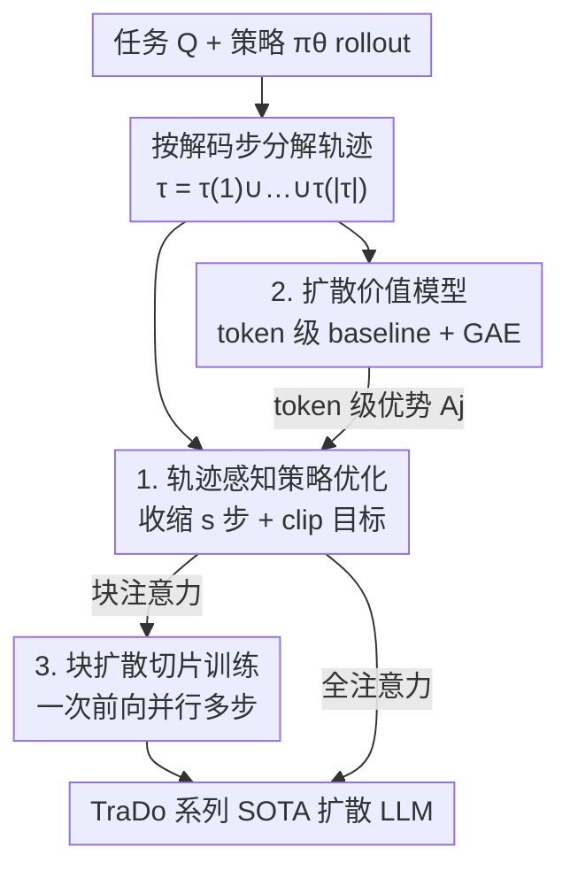

# Revolutionizing Reinforcement Learning Framework for Diffusion Large Language Models

**会议**: ICLR 2026  
**OpenReview**: [https://openreview.net/forum?id=KNAyc9DMe3](https://openreview.net/forum?id=KNAyc9DMe3)  
**代码**: https://github.com/Gen-Verse/dLLM-RL  
**领域**: 强化学习 / 扩散语言模型 / LLM 推理  
**关键词**: 扩散语言模型, 轨迹感知 RL, 价值模型, 块扩散, 数学/代码推理

## 一句话总结
本文提出 TraceRL——一个把扩散语言模型（DLM）推理时的**解码轨迹**纳入后训练目标的轨迹感知强化学习框架，同时配套一个降方差的扩散式价值模型，统一适配全注意力与块注意力 DLM，并据此训出在数学/代码推理上反超同尺寸甚至更大自回归模型的 TraDo 系列 SOTA 扩散语言模型。

## 研究背景与动机
**领域现状**：把扩散模型搬到语言上，目前最有前景的路线是掩码扩散语言模型（MDM）——训练时随机把一部分 token 换成 `[MASK]`，推理时从全掩码序列出发、按置信度迭代地把高置信位置解码出来，从而实现并行生成。它又分两类架构：全注意力 DLM（如 Dream、LLaDA）和块注意力 DLM（如 SDAR，按块从左到右生成、天然支持 KV-cache）。

**现有痛点**：现有的 DLM 后训练（含 RL）几乎都只盯着全注意力模型，做法是对整条采样序列**随机加掩码**后用 ELBO 类目标（$J_{\text{full}}$）去优化。问题在于：自然语言本身有顺序和逻辑依赖，而推理时真正用的解码策略（按置信度、配合 KV-cache）远不是纯随机的——于是「随机掩码训练目标」和「模型实际偏好的推理轨迹」之间出现了**系统性错配**，也没有一个能同时管全注意力和块注意力的统一 RL 框架。

**核心矛盾**：后训练目标优化的是「随机顺序还原」，而推理真正走的是「沿偏好轨迹、近似从左到右」的路径。优化的东西和实际用的东西不是一回事，自然学不到点子上。本文用一组对照实验先把这个错配钉死：在等算力下，用半自回归目标（按块从左到右）或直接用模型自己偏好的推理轨迹去微调，MATH500 准确率都明显高于随机掩码（如全注意力下 trace 微调 54.4% vs 随机掩码 45.1%）。

**本文目标**：把「推理轨迹」这个信息显式喂进后训练，做出一个对全/块两类 DLM 都适用、又训得稳的 RL 框架。

**切入角度**：收集模型偏好轨迹来微调虽然有效，但离线采轨迹算力代价太大；而**强化学习在 rollout 过程中本就自然产出这些轨迹**——只要让 RL 按轨迹（而不是按整条随机掩码序列）来奖惩，就既对齐了推理又省去额外采集成本。

**核心 idea**：用「轨迹感知的 RLVR」替代「随机掩码 RL」——把一次 rollout 拆成按解码步组织的轨迹 $\tau=\tau(1)\cup\cdots\cup\tau(|\tau|)$，在轨迹层面做带 clip 的策略优化，并引入扩散式价值模型给出 token 级优势，从而对齐推理、降方差、还能吸收过程奖励。

## 方法详解

### 整体框架
TraceRL 解决的是「DLM 的 RL 该按什么粒度奖惩」这个问题。它不再把一次生成当成一条「整体序列 + 随机掩码」来打分，而是保留生成时**真实的解码步结构**：对任务 $Q$ 用当前策略 $\pi_\theta$ rollout 出响应 $\tau_i$，按解码步切成轨迹 $\tau_i(t)$（第 $t$ 步解出的那批 token），再用可验证奖励 $r_i$ 在这条轨迹上做策略优化。整条管线由三块拼成：① 轨迹感知策略优化（带收缩参数 $s$ 控算力），② 扩散价值模型（给 token 级 baseline、降方差、吃过程奖励），③ 块扩散切片训练（让块注意力一次前向并行训多步）。其中价值模型是可选增强，全/块两类架构都能接。

### 关键设计

**1. 轨迹感知策略优化 + 收缩参数：让 RL 沿偏好轨迹而非随机掩码走**

这一项直接针对「训练目标和推理轨迹错配」的痛点。做法是把 rollout 出的响应按解码步组织成轨迹，并在轨迹粒度上做一个 GRPO 风格的 clip 策略目标：每一步 $\tau_i^s(t)$ 内的 token $o_k$ 用比值 $\pi_{\theta_p}/\pi_{\text{old}}$ 乘标准化优势 $A_i$，外面套 $C_\epsilon(r,A)=\min(rA,\text{clip}(r,1-\epsilon,1+\epsilon)A)$，再除以该步 token 数做归一并减去 KL 正则：

$$J_{\text{policy}}(\theta_p)=\mathbb{E}\Big[\sum_{i=1}^{G}\sum_{t=1}^{|\tau_i^s|}\sum_{o_k\in\tau_{i,t}^s}C_\epsilon\!\big(\tfrac{\pi_{\theta_p}(o_k\mid\tau_i^s(1{:}t{-}1))}{\pi_{\text{old}}(o_k\mid\tau_i^s(1{:}t{-}1))},A_i\big)/|\tau_i^s(t)|\Big]-\beta\,\mathrm{KL}.$$

关键巧思是**收缩参数 $s$**：全注意力模型按每个采样步拆轨迹会导致前向次数爆炸，于是把连续 $s$ 步聚合成一步 $\tau_i^s(k)=\cup_{j=s(k-1)+1}^{\min(sk,|\tau_i|)}\tau_i(j)$，轨迹长度从 $|\tau_i|$ 压到 $\lceil|\tau_i|/s\rceil$，训练复杂度直接降为原来的 $1/s$。这样既保留了「沿轨迹」的对齐优势，又把算力拉回可接受范围，让轨迹感知的 RLVR 真正可训。和旧的随机掩码 RL 相比，它优化的是模型实际会走的解码路径，所以同算力下收敛更快、终点更高。

**2. 扩散价值模型：用 token 级 baseline 降方差并吸收过程奖励**

只给整条序列一个序列级优势、平摊到所有 token，方差大、训练抖。本设计引入一个扩散式价值网络，给出**条件于前缀的 token 级价值**，充当降方差 baseline。具体地，冻结的价值网 $V_{\text{old}}$ 沿轨迹给出 token 价值 $V^{\text{old}}_j$，每步聚成步级价值 $V^{\star,\text{old}}_t=\sum_{j\in\tau(t)}V^{\text{old}}_j/|\tau(t)|$；步级奖励 $r^\star_t$、回报 $R^\star_t=r^\star_t+\gamma R^\star_{t+1}$、TD 残差 $\delta^\star_t=r^\star_t-V^{\star,\text{old}}_t+\gamma V^{\star,\text{old}}_{t+1}$ 与步级 GAE $A^\star_t=\delta^\star_t+\gamma\lambda A^\star_{t+1}$ 逐级递推，再映射回 token 级优势 $A_j$ 喂进上面的策略目标。价值网本身用一个 clipped 回归损失更新：

$$J_{\text{value}}(\theta_v)=\tfrac12\,\mathbb{E}_\tau\Big[\tfrac{1}{|\tau|}\sum_{j\in\tau}\max\big((V_{\theta_v}(\tau)_j-R_j)^2,(V^{\text{clip}}_j-R_j)^2\big)\Big],$$

其中 $V^{\text{clip}}_j=V^{\text{old}}_j+\text{clip}(V_{\theta_v}(\tau)_j-V^{\text{old}}_j,-\epsilon,\epsilon)$。这个价值模型还**天然容纳过程奖励**：把过程奖励模型（如对每 200 token 段打分的 Qwen3-4B）的中间奖励直接当作 token 级 $r_j$ 灌进回报递推，就能比「只用最终可验证奖励」给出更细粒度的监督。实测它把奖励方差从 $6.6\times10^{-4}$ 降到 $3.6\times10^{-4}$（约 −45.5%），训练曲线明显更稳。

**3. 块扩散切片训练：把块注意力的并行性榨干到 RL 上**

块扩散原本就用块注意力做高效 SFT，本设计把它扩到 RL。对块式推理产出的轨迹 $\tau=(b_1,\dots,b_{\lceil|\tau|/B\rceil})$，把原本要逐步累加的训练目标 $\sum_i f(\tau(i))$ **切片**重组成 $\{\sum_k f(\tau_{k,l})\mathbb{1}_{l\le|b_k|}\}_{l=1}^{B'}$，其中每个切片宽度 $B'=\max_k|b_k|\le\lceil B/s\rceil$。这样每个切片只需**一次带块注意力的前向**就能并行覆盖所有块的第 $l$ 步，策略网和价值网都能这么训，比全注意力逐步训练高效得多。它针对的痛点是：块结构信息若不利用，RL 训练同样会退化成低效的逐步前向；切片重组让块注意力的并行优势在 RL 阶段也兑现，是 TraDo 能在合理算力内训到 SOTA 的工程支点。

### 损失函数 / 训练策略
策略用 $J_{\text{policy}}$（clip + KL，$\epsilon=0.2$、$\beta=0.01$、策略学习率 $1\times10^{-6}$；接价值模型时 $5\times10^{-6}$），价值用 clipped 回归 $J_{\text{value}}$，默认 $\gamma=\lambda=1.0$。块扩散每步采 128 任务×32 响应、动态采样阈值 $T=0.9$、温度 1.0；全注意力每步 56 任务×8 响应、带 KV-cache。TraDo 训练课程为：先数学训到收敛 → 再代码训到收敛 → 最后回炉数学；TraDo-8B-Thinking 则在 TraDo-8B-Instruct 之上用 75K OpenThoughts-3 做半自回归长 CoT SFT 得到。

## 实验关键数据

### 主实验
基座为块注意力 SDAR 与全注意力 Dream/LLaDA；用 TraceRL 训出 TraDo 系列。下表为各模型在数学/代码推理上的准确率（%），TraDo 与对应 SDAR 基座对比，标注相对增益。

| 模型 | MATH500 | AIME2024 | GSM8K | LiveCodeBench-v2 | LiveBench |
|------|---------|----------|-------|------------------|-----------|
| Llama3.1-8B-Instruct (AR) | 51.9 | 6.7 | 84.5 | 20.0 | 19.7 |
| Qwen2.5-7B-Instruct (AR) | 74.0 | 8.2 | 89.9 | 26.9 | 31.1 |
| SDAR-4B-Chat | 70.2 | 5.0 | 90.2 | 15.6 | 14.0 |
| **TraDo-4B-Instruct** | **75.6** (+5.4) | 8.3 (+3.3) | 91.2 (+1.0) | 18.7 (+3.1) | 12.9 |
| SDAR-8B-Chat | 74.3 | 11.8 | 91.1 | 18.5 | 11.5 |
| **TraDo-8B-Instruct** | **78.5** (+4.2) | 13.3 (+1.5) | 92.3 (+1.2) | **25.9** (+7.4) | 22.7 (+11.2) |
| **TraDo-8B-Thinking** | **87.4** (+13.1) | 35.5 (+23.7) | 94.2 (+3.1) | 34.6 (+16.1) | 36.0 (+23.8) |

（以上为静态采样数。）TraDo-4B-Instruct 在 MATH500 上 +5.4%、反超更大的 Qwen2.5-7B-Instruct；TraDo-8B-Instruct 在 LiveCodeBench-v2 上 +7.4%、比 Llama3.1-8B-Instruct 高 5.9%。TraDo-8B-Thinking 是首个 8B 级长 CoT 扩散语言模型。

### 消融实验

| 配置 | 关键现象 | 说明 |
|------|---------|------|
| TraceRL（含价值模型） | 块扩散数学 RL 收敛最快、终点最高 | 完整方法 |
| TraceRL（无价值模型） | 仍优于所有基线，但训练抖动更大 | 去掉价值模型 |
| 块内随机掩码（≈半自回归） | 明显落后 TraceRL | 把随机掩码限制在块内 |
| 块内 coupled/互补掩码 | 比随机掩码稳，仍不及 TraceRL | 复刻 coupled RL |
| 价值模型 on SDAR-4B | 奖励方差 $6.6\to3.6\times10^{-4}$（−45.5%） | 降方差证据 |
| 价值模型 + 过程奖励 (SDAR-1.7B) | 优化比仅用结果奖励更快 | 过程奖励适配 |

### 关键发现
- **轨迹对齐是主因**：即便把对照压到「块内」很小的范围，沿偏好轨迹优化仍稳定优于随机掩码/半自回归，说明收益来自「优化模型真正会走的解码路径」而非单纯多了价值模型。
- **价值模型主要贡献稳定性**：去掉它准确率不一定崩，但训练曲线抖动明显增大、方差升约 35–46%；它的另一大价值是成为吃过程奖励的载体。
- **块扩散切片是效率支点**：切片训练让块注意力一次前向并行多步，是 8B 模型能在合理算力训到 SOTA 的关键。
- **附带红利**：TraceRL 优化后动态采样的加速比上升（4B 在 MATH500 上 +15.4%），因为模型对已优化域更自信、同阈值下每步能解出更多 token；还能把块大小从 $B{=}4$ 适配放大到 $B{=}8$ 而几乎不掉点（MATH500 60.2→67.7）。

## 亮点与洞察
- **把「推理轨迹」当一等公民**：DLM 的 RL 长期沿用自回归思路（整序列随机掩码打分），本文指出这与扩散解码的真实轨迹错配，并用一组等算力对照实验把错配量化钉死——这个 framing 本身就很 sharp。
- **收缩参数 $s$ 是四两拨千斤的工程旋钮**：用「聚合 $s$ 步」把训练复杂度直接 $\div s$，让原本前向次数爆炸的全注意力轨迹 RL 变得可训，且不破坏轨迹对齐性质。
- **价值模型把扩散 RL 与过程奖励打通**：token 级 GAE baseline 既降方差，又顺手成了灌入过程奖励的接口，思路可迁移到任何「分步生成 + 可中途打分」的场景。
- **块注意力的并行性被搬到 RL 阶段**：切片重组 $\sum_i f(\tau(i))\to$ 按列切片，是把 SFT 的块并行红利复用到 RL 的漂亮工程，对想做块扩散后训练的人很有参考价值。

## 局限与展望
- 价值模型带来稳定性但也多一套网络与超参（$\gamma,\lambda,\epsilon$）；论文显示对 $(\gamma,\lambda)$ 选择鲁棒，但价值网训练成本与策略网耦合，整体调度更复杂。
- 评测集中在数学/代码这类**有可验证奖励**的推理任务，对开放式生成、对齐偏好等无明确 verifier 的任务是否同样受益未充分验证。
- 收缩参数 $s$ 在压算力的同时也粗化了轨迹粒度，$s$ 取值与「对齐精度 vs 效率」的权衡缺乏系统扫描；过大 $s$ 是否会让轨迹感知退化为半自回归值得进一步研究。
- 长 CoT 能力来自额外 75K SFT 数据，TraceRL 本身能在多大程度上独立诱导长链推理仍待厘清。

## 相关工作与启发
- **vs 随机掩码 RL（MMaDA / d1 等）**：它们对每条 rollout 随机加掩码、按整序列用 $J_{\text{full}}$/PPO 优化；本文按真实解码步组织轨迹优化，对齐推理，等算力下更优，且统一覆盖块注意力。
- **vs Coupled RL（Gong et al. 2025）**：coupled 用互补掩码样本降方差、加倍有效数据；本文在块内复刻其互补目标作为基线，但 TraceRL 凭轨迹对齐在数学 RL 上仍优于它。
- **vs 半自回归微调**：半自回归（按块从左到右）已比随机掩码强，验证了对齐左到右推理的重要性；TraceRL 进一步用 RL 在 rollout 中自然产出偏好轨迹，省掉离线采集轨迹的高昂成本。

## 评分
- 新颖性: ⭐⭐⭐⭐⭐ 首个统一全/块注意力的轨迹感知 DLM RL 框架，并配套扩散价值模型，framing 与方法都很扎实。
- 实验充分度: ⭐⭐⭐⭐⭐ 多架构多任务主结果 + 多组消融 + 方差/加速比/块放大等分析，证据链完整。
- 写作质量: ⭐⭐⭐⭐ 动机推导清晰、错配实验有说服力；价值模型推导稍密，符号偏多。
- 价值: ⭐⭐⭐⭐⭐ 训出反超同/更大尺寸 AR 模型的 TraDo SOTA 系列与首个 8B 长 CoT 扩散模型，并开源，落地价值高。

<!-- RELATED:START -->

## 相关论文

- [\[ICLR 2026\] GraphOmni: A Comprehensive and Extensible Benchmark Framework for Large Language Models on Graph-theoretic Tasks](graphomni_a_comprehensive_and_extensible_benchmark_framework_for_large_language_.md)
- [\[ICLR 2026\] On Predictability of Reinforcement Learning Dynamics for Large Language Models](on_predictability_of_reinforcement_learning_dynamics_for_large_language_models.md)
- [\[ICLR 2026\] Using Reinforcement Learning to Train Large Language Models to Explain Human Decisions](using_reinforcement_learning_to_train_large_language_models_to_explain_human_dec.md)
- [\[NeurIPS 2025\] MMaDA: Multimodal Large Diffusion Language Models](../../NeurIPS2025/reinforcement_learning/mmada_multimodal_large_diffusion_language_models.md)
- [\[ICLR 2026\] TROLL: Trust Regions improve Reinforcement Learning for Large Language Models](troll_trust_regions_improve_reinforcement_learning_for_large_language_models.md)

<!-- RELATED:END -->
