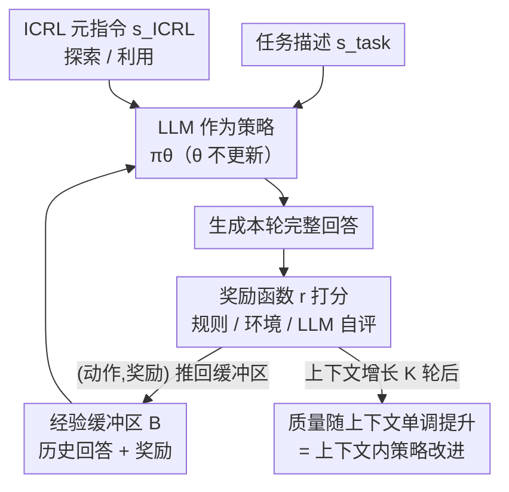

# Reward is Enough: LLMs are In-Context Reinforcement Learners

**会议**: ICLR 2026  
**OpenReview**: [https://openreview.net/forum?id=keCXNHOe4W](https://openreview.net/forum?id=keCXNHOe4W)  
**代码**: 无  
**领域**: 强化学习 / 测试时扩展 / LLM 推理  
**关键词**: 上下文强化学习, ICRL, 测试时自我改进, 标量奖励, 多轮 prompting

## 一句话总结
本文发现 LLM 在推理阶段就能涌现出强化学习行为（in-context RL，ICRL）：只需把过去的回答和对应的标量奖励拼进上下文、反复多轮 prompting，模型的回答质量就会随上下文增长而单调提升，在 Game of 24、创意写作、ScienceWorld、AIME/HMMT 上显著超过 Self-Refine 和 Reflexion，且即使奖励由模型自己打分也依然有效。

## 研究背景与动机

**领域现状**：要让 LLM 在新任务上当好 agent，它必须能在推理时自我改进，这就是「测试时扩展」（test-time scaling）。Sutton 指出能利用算力换性能的只有两条路——搜索（search）和学习（learning）。在 LLM 上，搜索这条路已经被充分挖掘：从 Best-of-N，到 Tree-of-Thoughts，再到 MCTS，都是在推理时靠外部搜索结构提升表现。

**现有痛点**：相比之下，「学习」这条路在推理时几乎被忽略。上下文监督学习（ICL）虽然也是一种推理时学习，但它需要专家示范作为 ground-truth 标签，而这种示范数据在推理时难以规模化获取，限制了它在测试时扩展中的适用性。强化学习是最强的「不依赖人类知识的自我改进」算法，但它的成功几乎都发生在模拟环境里、或者 LLM 的**训练阶段**（如 RLHF / R1），从未被验证能在 LLM 的**推理阶段**自发出现。

**核心矛盾**：现有的 ICRL 工作大多局限在 bandit 或小规模模拟环境，用从头训练的小模型，且常常需要人工干预，在自然语言这种开放动作空间上完全没打开局面。真实世界是「大世界」（big world）——环境远比 agent 复杂，agent 会不断遇到训练数据之外的情况，必须在推理时就地适应，而不是每遇到新情况就花大价钱重训。

**本文目标**：验证一个问题——强化学习能否在 LLM 的推理阶段（即前向传播）自发涌现？如果能，就能优雅地同时满足两个需求：LLM 提供通用的初始策略，RL 提供持续自我改进的能力。

**切入角度**：作者坚持一个「极简主义」（minimality）原则。为了证明性能提升真的来自 LLM 内在的 RL 能力、而不是各种外挂机制，他们刻意剔除了文本梯度、优先经验回放、采样启发式、额外工程模块——**唯一**给模型的监督信号就是那个标量奖励本身。这正好呼应了 Sutton 的「奖励假说」和 Silver 的「reward is enough」假说。

**核心 idea**：用一个极简的多轮 prompting 框架（ICRL prompting）——每轮把「过往所有回答 + 对应的标量奖励」拼成上下文，再加一句探索/利用的元指令，喂回给同一个 LLM——让模型在推理时把标量奖励信号最大化，表现得就像一个 RL 算法。

## 方法详解

### 整体框架

ICRL prompting 把「LLM 的多轮自我改进」直接对应到 RL 的 MDP 框架上：把 LLM 当作策略 $\pi_\theta$（参数 $\theta$ **全程不更新**），把 token 生成过程当作 agent-environment 交互（状态 = 已生成的 token，动作 = 下一个 token），把每轮回答叫一个 episode，并为回答提供一个标量奖励。和 ICL 把 $(x, y)$ 对放进上下文类似，ICRL 把「状态-动作-奖励」三元组连同简单的元指令放进上下文。

整个流程是一个外层循环（Algorithm 1）：维护一个经验缓冲区 $B$；第 $k$ 个 episode 开始时，把缓冲区里所有历史（过往回答 + 奖励）、任务描述 $s_{\text{task}}$、ICRL 元指令 $s_{\text{ICRL}}$ 拼成初始 prompt $S_0$；让 LLM 执行策略生成完整回答；用奖励函数 $r$ 给回答打分；把「动作序列 + 各步奖励」推回缓冲区 $B$；进入下一个 episode。关键观察是：随着上下文（缓冲区）增长，回答质量持续上升——由于 $\theta$ 固定，这种提升**只能**来自上下文的增长，因此本质上就是「上下文内的策略改进」（in-context policy improvement）。

### 关键设计

**1. LLM 即策略 + 标量奖励即唯一监督：把多轮 prompting 改写成 RL**

这针对的痛点是：以往推理时自我改进要么靠搜索（外部结构），要么靠文本式自我修正（Self-Refine / Reflexion 那种「给一段自然语言反馈再让模型改」），后者依赖模型对任务的参数化知识，容易累积幻觉反馈、迭代几轮后性能崩塌。本文的做法是把每轮回答看成一个 episode 的动作序列，回答后只给一个**数值标量**奖励 $R_{t+1} \doteq r(S_{t+1})$，并且**显式**在数字前写上「Reward:」这个词告诉模型这是奖励。下一轮的初始 prompt $S_0$ 由「缓冲区历史 + $s_{\text{task}}$ + $s_{\text{ICRL}}$」拼成，模型必须自己从历史的「回答↔奖励」模式里推断出更好的回答——这正是 RL「从奖励里学」而非「按指令改」的本质区别。和 Self-Refine/Reflexion 的对比，本质上就是**标量反馈 vs 文本反馈**之争，而标量反馈不会像文本反馈那样把幻觉一路放大。

**2. 奖励函数的极简与灵活：连「外部反馈」都可以不要**

奖励 $r$ 可以是稀疏的（只有终止状态 $R_T$ 非零，对应 outcome reward）或稠密的（非终止状态也能非零，对应 progress reward）；来源可以是规则、单独训练的模型、或者**同一个 LLM 的自评**。最反直觉的设计是后者：当 $r$ 就是 LLM 自己对答案的打分时，框架里其实**没有任何外部反馈**，但作者依然期望回答会越改越好。其底层假设是「评估比生成更容易」——模型也许写不出最优解，但能识别出哪个回答更好，于是把这种「会评不会写」的不对称转化成改进。作者同时诚实地提出一个假设：纯自评的性能天花板会低于有外部反馈时的天花板（实验里 Game of 24 和创意写作就是纯自评，数学/ScienceWorld 用真实奖励）。为了保证提升真的来自 LLM 的内在 RL 能力，框架刻意排除了文本梯度、经验回放、采样启发式等一切外挂——这种「极简」既是设计也是证明手段。

**3. 经验缓冲区 + 探索/利用元指令：让上下文承载「策略」并平衡探索利用**

经验缓冲区 $B$ 把过往 episode 的回答和奖励尽可能多地（在上下文窗口允许范围内）拼进当前 prompt，因为本文的核心假设是「预训练 LLM 已经天生具备 ICRL 能力」，只要把经验摆进上下文，模型就能在前向传播里「就地强化学习」。在此之上，作者用自然语言元指令 $s_{\text{ICRL}}$ 显式注入 RL 里经典的探索-利用权衡，分三类指令：探索指令（要求给出与所有历史回答都不同的新回答）、利用指令（要求基于历史中奖励最高的回答生成最佳回答）、以及「探索或利用」指令。由此衍生两种策略：**ICRL Preset**——按 episode 奇偶交替使用探索/利用指令；**ICRL Autonomous**——每轮都给「探索或利用」指令，让 LLM 自己决定该探索还是利用。消融显示，正是这种探索能力让 ICRL 区别于 Best-of-N：它能**生成**比探索阶段见过的任何回答都更好的新回答，而不只是从历史里挑一个最好的。

### 一个例子：Game of 24

给定四个数字，要求每个数字恰好用一次、只用加减乘除得到 24。用 GPT-4.1 既当策略 $\pi_\theta$ 也当奖励 $r$（同一模型、不同 prompt）。任务描述里用 CoT 让模型分 4 个思考步给出完整解，并附 5 个 in-context 示范保证格式。真实奖励 $r^*$ 用 SymPy 符号计算验证表达式是否等于 24；但算法**拿不到** $r^*$，只能用 GPT-4.1 对每个思考步在「用剩余数字够到 24 的可能性」上打 0–3 分（0=不可能，3=确定）作为可访问的 $r$。每个 episode 只有 4 个奖励（对应 4 步），就只把这 4 个奖励、各自打上「Reward:」标签、紧跟在对应动作后拼进 $S_0$。随着 trial 增多，ICRL Preset 的成功率曲线呈现明显的「探索-利用交替」式振荡并稳步抬升，50 轮后达到 90%，而 Best-of-N（即便用真实 $r^*$ 挑最优）只有 49%、Self-Refine 47%、Reflexion 44%。

## 实验关键数据

### 主实验

四个任务上 ICRL 全面超越自我修正类基线（Self-Refine / Reflexion）和搜索类基线（Best-of-N）：

| 任务 | 指标 | ICRL (Ours) | Best-of-N | Self-Refine | Reflexion |
|------|------|------|----------|-------------|-----------|
| Game of 24 | 成功率（50 trial） | **90%** (Preset) | 49% | 47% | 44% |
| 创意写作 | LC 胜率（vs 对应基线） | — | 93.81% | 86.32% | 59.48% |
| ScienceWorld | 平均 return | 比基线高约 **20%** | — | — | — |

注：创意写作用 Length-Controlled Alpaca-Eval 2.0 算 ICRL 对各基线的成对胜率；Game of 24 里 Best-of-N 还额外用了真实奖励 $r^*$ 挑最优，仍大幅落后。

跨模型 / Olympiad 数学（Table 4，32k 上下文，CW=创意写作）：

| 模型 | 方法 | HMMT | AIME | CW |
|------|------|------|------|-----|
| Qwen3-32B | Base | 9.14 | 22.54 | 34.14 |
| Qwen3-32B | ICRL | **33.33** | **46.66** | **50.00** |
| Llama-4 Maverick | Base | 8.50 | 17.58 | — |
| Llama-4 Maverick | ICRL | **20.00** | **35.00** | **50.00** |

ICRL 在所有模型/任务上一致超越 Self-Refine 和 Reflexion，相比 base 模型常有 10–20 分的提升。

### 消融实验

| 配置 | 效果 | 说明 |
|------|------|------|
| Full (ICRL Preset/Autonomous) | 最佳曲线 | 完整框架，对 prompt 设置很鲁棒 |
| Zero Rewards（奖励全置 0） | 明显下降 | 去掉奖励信号，验证「奖励缺失则退化」 |
| Short Context（只留近 3 个 episode） | 明显下降 | 上下文变短性能掉，验证「上下文增长是关键」 |
| Exploration Only（只探索、无奖励） | 显著差于完整 | 证明提升不是「探索后挑最优」的 Best-of-N |
| Exploitation Only（只利用、有奖励） | 接近最佳 | 带奖励的利用也很强，说明奖励信号是核心 |
| No ICRL Instruction（去掉元指令） | 下降 | 元指令有帮助 |

### 关键发现
- **「奖励缺失就退化、上下文越长越好」是 RL 的「鸭子测试」**：作者把「奖励最大化、探索-利用权衡、上下文增长带来提升、短上下文掉点、无奖励掉点」这五个现象全部观测到——这些都是 RL 算法该有的行为，因此推断推理过程里确实涌现了 RL。
- **探索能力是 ICRL 区别于搜索的关键**：「只探索无奖励」的 running-max 曲线显著低于 ICRL，说明 ICRL 不是靠「多采样再挑最好」，而是能**生成**比探索阶段见过的更优的新回答。
- **真·测试时学习而非测试时搜索**：在「为模型训练截止后发表的 arXiv 论文写摘要」（ground-truth 不在训练数据里）这一设置下，Best-of-N 和 Reflexion 很快停滞，而 ICRL 仍能持续改进——证明它是从外部奖励里学，而非在参数化知识里搜。
- **上下文长度即算力效率**：Qwen3-32B 在 8k/16k/32k 上下文下，ICRL 的创意写作 LC 胜率稳定在 50%、AIME 从 40% 升到 46.66%，单位算力性能均优于 Self-Refine/Reflexion。

## 亮点与洞察
- **把「多轮 prompting」严格对齐到 MDP**：状态=已生成 token、动作=下一个 token、episode=一轮回答，这套映射让「LLM 推理时自我改进」第一次能用 RL 语言精确描述，且 $\theta$ 全程不动，提升只能归因于上下文——逻辑闭环很干净。
- **极简主义既是设计也是论证**：刻意剔除文本梯度/经验回放/采样启发式，把唯一监督收缩到标量奖励，从而把「LLM 内在 RL 能力」从外挂机制里隔离出来——这种「做减法以做证明」的思路很值得借鉴。
- **自评奖励也有效，指向纯内生的测试时扩展**：当奖励由同一 LLM 打分时框架内毫无外部信息，却仍能改进，把「评估易于生成」的不对称转化成新的 test-time scaling 范式——可迁移到任何「能自评但难一次写对」的开放任务（如代码、写作、规划）。

## 局限与展望
- 作者自己承认：纯自评（无外部反馈）时性能天花板低于有外部反馈时——自评 ICRL 的上限受限于模型的评估能力。
- 框架强依赖长上下文能力：缓冲区要把尽量多的历史拼进上下文，受上下文窗口和算力预算约束；Self-Refine 在创意写作里就因上下文过度增长先 plateau 后下滑。
- 「涌现 RL」是基于行为现象的「鸭子测试」式归因，并未从机理（前向传播究竟实现了什么 RL 算法）层面给出证明，留待后续机制可解释性工作。
- 实验主要在文本任务和几个 benchmark 上，是否能扩展到更长程、更稀疏奖励的真实「大世界」任务仍待验证。

## 相关工作与启发
- **vs Self-Refine / Reflexion**: 它们用自然语言自我修正，反馈即「下一轮的新指令」，本质是语言引导的搜索，依赖参数化知识、易累积幻觉导致崩塌；ICRL 只用标量奖励、不给新指令，模型必须从历史模式里推断更优回答，更像真正的 RL，且能从失败经验里学。
- **vs Best-of-N / Tree-of-Thoughts / MCTS**: 这些是推理时搜索，依赖外部启发式或记忆管理等工程组件；ICRL 靠模型内在学习能力，消融证明它不是「采样后挑最优」，而能生成更优新解。
- **vs 传统 ICRL（bandit/小模型）**: 以往 ICRL 多在 bandit 或模拟环境、用从头训练的小模型、常需人工干预；本文首次在自然语言为动作空间的开放任务（科学实验、创意写作、奥数）上用预训练 LLM 验证了 ICRL 的涌现。
- **vs prompt optimization（数值打分引导）**: 那类方法靠 top-k 选择和错误过滤精炼 prompt，更接近过滤式行为克隆（监督学习）；ICRL 能从失败经验里学，更接近强化学习。

## 评分
- 新颖性: ⭐⭐⭐⭐⭐ 首次系统论证「RL 能在 LLM 推理阶段涌现」，并用极简框架把现象隔离出来，视角新且干净。
- 实验充分度: ⭐⭐⭐⭐ 覆盖 4 类任务 + 多个开源/闭源模型 + 6 项消融 + 上下文长度/测试时学习 vs 搜索分析，较全面；机理层面证据偏行为现象。
- 写作质量: ⭐⭐⭐⭐⭐ 动机推导（big world、reward is enough）和「鸭子测试」论证逻辑清晰、可读性强。
- 价值: ⭐⭐⭐⭐⭐ 提出一个新的 test-time scaling 范式，连自评奖励都有效，对 LLM agent 持续自我改进有直接启发。

<!-- RELATED:START -->

## 相关论文

- [\[ICLR 2026\] Principled Fast and Meta Knowledge Learners for Continual Reinforcement Learning](principled_fast_and_meta_knowledge_learners_for_continual_reinforcement_learning.md)
- [\[ICLR 2026\] Enough is as good as a feast: A Comprehensive Analysis of How Reinforcement Learning Mitigates Task Conflicts in LLMs](enough_is_as_good_as_a_feast_a_comprehensive_analysis_of_how_reinforcement_learn.md)
- [\[ICLR 2026\] LongRLVR: Long-Context Reinforcement Learning Requires Verifiable Context Rewards](longrlvr_long-context_reinforcement_learning_requires_verifiable_context_rewards.md)
- [\[ICLR 2026\] Vintix II: Decision Pre-Trained Transformer is a Scalable In-Context Reinforcement Learner](vintix_ii_decision_pre-trained_transformer_is_a_scalable_in-context_reinforcemen.md)
- [\[ICLR 2026\] Scalable In-Context Q-Learning](scalable_in-context_q-learning.md)

<!-- RELATED:END -->
