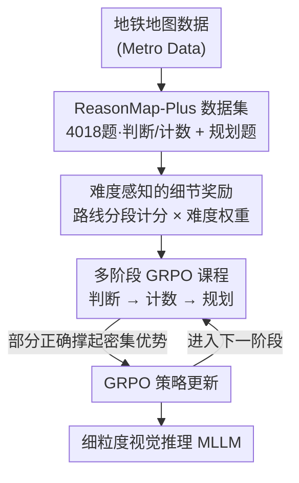

# RewardMap: Tackling Sparse Rewards in Fine-grained Visual Reasoning via Multi-Stage Reinforcement Learning

**会议**: ICLR 2026  
**arXiv**: [2510.02240](https://arxiv.org/abs/2510.02240)  
**代码**: [项目页面](https://fscdc.github.io/RewardMap)  
**领域**: 强化学习  
**关键词**: 多模态大模型, 视觉推理, 稀疏奖励, 多阶段RL, 地铁路线规划

## 一句话总结

提出RewardMap框架，通过难度感知的细节奖励设计和从简单感知到复杂推理的多阶段RL课程学习策略，克服细粒度视觉推理中的稀疏奖励问题。

## 研究背景与动机

细粒度视觉推理（如地铁路线规划）是多模态大模型（MLLM）的核心挑战。ReasonMap基准揭示了即使先进的MLLM在结构化、信息密集的视觉场景中也难以进行空间推理。

将标准RL方法（如GRPO）直接应用于此类复杂任务面临**稀疏奖励瓶颈**：
- 成功信号仅在长推理链末端给出（最终答案对/错）
- 任务难度进一步放大稀疏性——大多数采样得到的奖励 $r_i \approx 0$
- 在GRPO中，当所有采样都失败时，组内优势 $\hat{A}_i$ 趋近零，梯度信号微弱，收敛困难

传统SFT虽提供密集监督，但无法赋予模型长链决策的推理能力。核心矛盾是任务复杂度与监督信号密度的错配。

本文的切入点：（1）构建ReasonMap-Plus数据集作为密集奖励冷启动源；（2）设计从易到难的多阶段RL训练，从感知逐步过渡到推理。

## 方法详解

### 整体框架

RewardMap要解决的是细粒度视觉推理（以地铁路线规划为代表）里的稀疏奖励：答案对错只在长推理链末端给出一个 0/1 信号，难题上几乎全是 0，RL 学不动。它的思路是从两头同时下手——一头改奖励，让模型即使没答对也能从部分正确里拿到分；另一头改训练顺序，先让模型在简单密集奖励的感知题上热身，再过渡到复杂的规划题。具体由两个组件支撑：难度感知的细节奖励，把单一的对错信号拆成可分段计分的密集信号；多阶段 GRPO 课程，把训练数据按"判断 → 计数 → 规划"从易到难排成课表。配套还构建了 ReasonMap-Plus 数据集，专门提供冷启动用的简单题。

### 关键设计

**1. ReasonMap-Plus 数据集：给 RL 冷启动准备一批奖励密集的简单题**

复杂的路线规划题奖励太稀疏，没法直接拿来冷启动。作者沿用 ReasonMap 的 Metro Data，构建了 4018 个 VQA 问题，覆盖 30 个城市、13 个国家、5 种扩展题型，按难度归成三大类：全局计数、局部计数、判断题。这些题答案唯一、可由地铁数据自动生成标签，所以正确率天然较高、奖励密集。它的作用不是评测难度，而是当作课程最前段的"热身材料"——让模型先把读图、数站点这类基础视觉理解打扎实，再去碰需要长链推理的规划题。

**2. 难度感知的细节奖励：把单一对错信号拆成可分段计分的密集奖励**

规划题的稀疏性本质是"只看最终答案对不对"，而一条地铁路线其实由多个可独立验证的部分组成。细节奖励正是利用了这个结构性：对起点/终点、路线名、换乘站、路段数分别给予奖惩，即便最终答案错了，模型只要某几段答对也能拿到部分分数。整体奖励写成

$$R = W_{\text{difficulty}}(R_{\text{format}} + R_{\text{correctness}} + \alpha \times R_{\text{detail}})$$

其中 $R_{\text{format}}$、$R_{\text{correctness}}$ 是原有的格式与正确性奖励，$R_{\text{detail}}$ 是新增的部分分数项，$\alpha$ 控制其权重。前面再乘一个难度权重 $W_{\text{difficulty}} = W_{\text{map}} + W_{\text{question}}$，由地图本身难度和换乘次数共同决定——越难的题答对一次贡献越大的学习信号，避免模型只在简单题上刷分。这样一来，原本在 GRPO 里因为全组采样都失败、组内优势 $\hat{A}_i \approx 0$ 而消失的梯度，被部分正确的样本重新撑了起来。

**3. 多阶段 GRPO 课程：先感知后推理，避免一上来就崩**

如果直接把困难规划题丢给 RL，稀疏奖励会让训练崩溃。作者按全局课程原则把训练切成多个阶段，顺序是判断题 → 计数题 → 规划题，对应能力上从视觉理解逐步过渡到视觉推理。低层级任务奖励密集，能撑起有效的冷启动；随着阶段推进逐步桥接感知和推理，让模型在能拿到信号的前提下慢慢接手难题。同时每个阶段内部仍随机打乱样本，这点局部随机性是为了防止模型过拟合到某条固定的课程轨迹上，保留泛化能力。

### 损失函数 / 训练策略

训练沿用 GRPO 的标准策略梯度目标，以组相对优势驱动更新，算法本身没改；真正的差异全在奖励和数据调度上——奖励换成上面的三层结构加难度加权，数据按多阶段课程喂入。冷启动阶段直接用 RL 而不是先做 SFT，是为了让奖励信号和任务目标从第一步就对齐，避开 SFT 监督与 RL 奖励错配带来的过拟合和认知僵化。

## 实验关键数据

### 主实验（Qwen2.5-VL-7B-Instruct）

| 方法 | ReasonMap加权准确率(S/L) | ReasonMap-Plus加权准确率 |
|------|-------------------------|------------------------|
| 基础模型 | 13.28%/7.12% | 44.21% |
| +RL (GRPO) | 26.22%/26.04% | 44.64% |
| +RL (REINFORCE++) | 27.17%/27.60% | - |
| +RewardMap（完整） | **最优** | **最优** |

### 消融实验

| 配置 | 关键指标 | 说明 |
|------|---------|------|
| 仅格式+正确性奖励 | 基线性能 | 稀疏奖励下学习困难 |
| +细节奖励 | 显著提升 | 部分分数缓解稀疏性 |
| +难度权重 | 进一步提升 | 难题贡献更多学习信号 |
| +多阶段课程 | 最佳性能 | 冷启动策略有效 |

### 关键发现
- RewardMap训练的模型在6个外部基准上平均提升3.47%，说明能力泛化性好
- 使用RL冷启动优于SFT冷启动，避免了SFT导致的过拟合和认知僵化
- 参考模型对比中，GPT-5在ReasonMap上达到59.98%/62.50%，显示出该任务的极高难度
- Seed1.5-VL和GPT-4o在ReasonMap-Plus上分别达到73.58%和64.42%

## 亮点与洞察

- **问题定义有价值**：地铁路线规划是MLLM视觉推理的天然测试场，任务本身兼具实用性和科学价值
- **RL替代SFT做冷启动**是一个有洞察力的设计选择，避免了奖励与损失函数的错配
- **细节奖励设计巧妙**：利用规划任务的结构性（起点、终点、换乘站等可独立验证）分解奖励

## 局限与展望

- 细节奖励的设计依赖于任务特定的结构信息，泛化到其他视觉推理任务需要重新设计
- 难度权重的超参数（$\gamma_e, \gamma_m, \gamma_h, \beta_0, \beta_1$）需要预设
- 当前仅在Qwen2.5-VL模型族上验证，对其他架构的泛化性未知

## 相关工作与启发

- ReasonMap（Feng et al., 2025b）是本文的基准和数据基础
- GRPO（Shao et al., 2024）提供了RL优化框架
- 课程RL（Parashar et al., 2025）的从易到难策略启发了多阶段设计
- 启示：对于复杂推理任务，奖励工程（reward engineering）可能比算法创新更为关键

## 评分
- 新颖性: ⭐⭐⭐⭐ 多阶段RL冷启动替代SFT的思路有新意，但各组件较标准
- 实验充分度: ⭐⭐⭐⭐ 多基准验证包括外部泛化，有消融研究
- 写作质量: ⭐⭐⭐⭐ 问题动机清晰，框架图示清晰
- 价值: ⭐⭐⭐⭐ 为MLLM视觉推理的RL训练提供了实用方案

<!-- RELATED:START -->

## 相关论文

- [\[ICLR 2026\] DiVE-k: Differential Visual Reasoning for Fine-grained Image Recognition](dive-k_differential_visual_reasoning_for_fine-grained_image_recognition.md)
- [\[ICLR 2026\] SRFT: A Single-Stage Method with Supervised and Reinforcement Fine-Tuning for Reasoning](srft_a_single-stage_method_with_supervised_and_reinforcement_fine-tuning_for_rea.md)
- [\[ICLR 2026\] Q-Learning with Fine-Grained Gap-Dependent Regret](q-learning_with_fine-grained_gap-dependent_regret.md)
- [\[ICLR 2026\] R1-Code-Interpreter: LLMs Reason with Code via Supervised and Multi-stage Reinforcement Learning](r1-code-interpreter_llms_reason_with_code_via_supervised_and_multi-stage_reinfor.md)
- [\[ICLR 2026\] Preference-based Policy Optimization from Sparse-reward Offline Dataset](preference-based_policy_optimization_from_sparse-reward_offline_dataset.md)

<!-- RELATED:END -->
