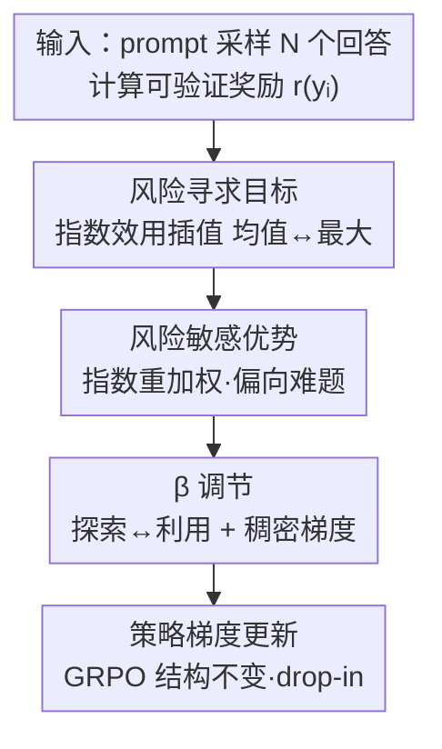

# Risk-Sensitive Reinforcement Learning for Alleviating Exploration Dilemmas in Large Language Models

**会议**: ICLR 2026  
**OpenReview**: [https://openreview.net/forum?id=7kC8ORye4l](https://openreview.net/forum?id=7kC8ORye4l)  
**领域**: 强化学习 / LLM 推理  
**关键词**: 风险敏感强化学习, RLVR, 探索困境, pass@k, GRPO

## 一句话总结
针对可验证奖励强化学习（RLVR）只会把预训练 LLM 已有的少数解强化、导致解多样性（pass@k）停滞甚至倒退的「探索困境」，本文用指数效用构造一个在「平均奖励」和「最大奖励」之间平滑插值的风险寻求目标，推导出只需改动优势函数的 RS-GRPO 算法，在 6 个数学推理基准、5-6 个 LLM 上同时提升 pass@k 与保持/提升 pass@1。

## 研究背景与动机

**领域现状**：RLVR（用可验证奖励做 RL）已经成为提升 LLM 复杂推理能力的主流范式，DeepSeek-R1、o1 这类模型都靠它把 pass@1 准确率推得很高。标准做法是 GRPO 这类策略梯度算法，优化目标是回答奖励的**期望（均值）**。

**现有痛点**：作者观察到一个普遍的失败模式——RLVR 提升 pass@1 的方式，往往只是把策略分布往少数几条同质化的解上「削尖」，概率质量越来越集中。结果是解的多样性崩塌，pass@k（k 个采样里至少有一个对）这个更能反映探索能力的指标停滞、甚至比基座模型还差。换句话说，RL 是在「蒸馏」模型已有的能力，而不是「发现」新的推理策略。

**核心矛盾**：作者把根因归到 LLM 优化地形与标准 RL 动力学的根本错配。传统 RL（如下棋）从随机初始化的策略出发，所以鼓励广泛探索；而 LLM 一开始就是一个**高度尖锐、已经聚集在某些解附近**的策略分布。如果这些初始峰值不在最优奖励区域，标准 RL 优化器很难挣脱预训练偏置的「引力」，倾向于收敛到附近一个虽好但次优的模式。

**本文目标**：设计一个能让策略挣脱初始偏置诱导的局部最优、真正去探索解空间未被覆盖区域的 RL 框架，同时不能牺牲 pass@1。

**切入角度**：既然问题出在「只优化均值奖励」，那就换一个目标——不只看最可能的那条解，而是看重所有高奖励结果，朝「最大奖励」方向倾斜。风险敏感 RL 恰好提供了在「均值」和「最大值」之间可控插值的天然框架。

**核心 idea**：用指数效用函数把风险中性（优化均值）的目标换成风险寻求（偏向最大值）的目标，由此推出一个**只改优势函数、其余结构不变**的 RS-GRPO——它会动态加大对「难题」的学习权重，逼策略去探索。

## 方法详解

### 整体框架

RS-GRPO 的核心主张可以浓缩成一句话：**只动 GRPO 里优势（advantage）的算法，其余一切照旧**。标准 GRPO 对一个 prompt 采样 N 个回答、用奖励减去组内均值作为优势；RS-GRPO 把这一步换成一个由「风险寻求目标」推导出来的**风险敏感优势**，它会指数级地放大高奖励样本、压低低奖励样本，从而把优化重心从「中等难度」prompt 移向「低准确率的难题」，驱动更深的探索。整条数据流是：采样 N 个回答 → 算可验证奖励 → 用指数效用构造风险寻求目标 → 求导得到风险敏感优势（按难度重加权）→ 用超参 β 调节探索/利用 → 套进原 GRPO 的策略梯度更新。

### 关键设计

**1. 风险寻求目标：用指数效用在「均值」和「最大」之间平滑插值**

痛点很直接：标准目标 $J(\pi_\theta)=\mathbb{E}_{x,y}[r(x,y)]$ 只优化奖励的**期望**，于是策略只要把概率压到当前最可能的那条解上就能涨均值，根本没有动力去够那些低概率但高奖励的解。本文换上风险敏感目标：

$$J_{RS}(\pi_\theta)=\mathbb{E}_{x\sim D}\left[\frac{1}{\beta}\log \mathbb{E}_{y\sim\pi_\theta(\cdot|x)}\left[e^{\beta r(y)}\right]\right]$$

这里超参 $\beta\in\mathbb{R}$ 是「风险敏感度」的总开关：$\beta\to 0$ 时由泰勒展开退回标准期望奖励 $\mathbb{E}[r(y)]$（风险中性）；$\beta\to+\infty$ 时逼近 $\max_y r(y)$（风险寻求，鼓励探索）；$\beta\to-\infty$ 时逼近 $\min_y r(y)$（风险规避，求稳）。本文取 $\beta>0$ 的风险寻求侧——$\beta$ 越大，目标越看重高奖励结果，从「均值」一路平滑滑向「最大值」。这一步的关键不是引入新网络或新损失项，而是换了一个**会主动看重「能不能至少做对一次」而非「平均做得多好」**的目标，正好对上 pass@k 的语义。

**2. 风险敏感优势：一个可直接替换 GRPO 优势的 drop-in 公式**

有了目标还要能落到策略梯度里。作者证明（Theorem 1）上述目标的策略梯度仍然是 $\nabla_\theta J_{RS}=\mathbb{E}[A_\beta^{\pi_\theta}(y)\nabla_\theta\log\pi_\theta(y|x)]$ 这个标准形式，只是优势换成了风险敏感优势：

$$A_\beta^{\pi_\theta}(y)=\frac{1}{\beta}\left(\frac{e^{\beta r(y)}}{\mathbb{E}_{y'\sim\pi_\theta}[e^{\beta r(y')}]}-1\right)$$

实际实现里用同一 prompt 的 N 个采样把分母的期望换成经验均值：$\hat{A}_\beta^{\pi_\theta}(y_i)=\frac{1}{\beta}\big(\frac{e^{\beta r(y_i)}}{\frac{1}{N}\sum_j e^{\beta r(y_j)}}-1\big)$。这个公式的妙处在于：它**只改优势的计算，策略梯度的结构原封不动**，所以可以当作 GRPO（以及 DAPO、DrGRPO 这些变体）里优势计算的即插即用替换，只需改几行代码。从机制上看，它把奖励通过 $e^{\beta r}$ 做了指数变换：连续奖励下，优势随 $\beta$ 增大从「线性于奖励」锐化成「阶梯状」，放大高奖励样本、抑制低奖励样本；二元奖励（RLVR 常见）下，它会**加大对低准确率难题上正确回答的奖励、减少对高准确率简单题上错误回答的惩罚**，使每个 prompt 的总优势量级从「峰值在 50% 准确率」移到「低准确率难题」——这正是「把学习重心搬到难题、逼出探索」的来源。

**3. β 的双刃性：既要够大以探索，又不能大到拖慢收敛**

风险敏感度 $\beta$ 不是越大越好，本文用一个简单多臂老虎机给出了理论刻画。Lemma 2 指出标准策略梯度的一个致命缺陷：当存在一个「次优但高于均值」的动作时，更新有可能**降低最优动作的概率**，把策略往错误方向带；Lemma 3 则证明只要 $\beta$ 足够大，风险敏感更新一定**提升**最优动作的概率——这两条合起来解释了为什么在 100 臂老虎机实验里 $\beta\ge 4$ 能逃出局部最优、收敛到全局最优 1.0，而 $\beta<4$ 和标准 RL（$\beta=0$）都被困在次优 0.6。但 Lemma 4 又给出反向约束：$\beta$ 超过某个阈值后，虽然对最优动作的提升仍为正，但提升幅度随 $\beta$ 增大而**变小**，即收敛变慢。结论很实用——$\beta$ 要大到能探索，但不能大到拖慢收敛；实验中 $\beta=2$ 被认为是兼顾 pass@k 与 pass@1 的最佳折中。

### 损失函数 / 训练策略

训练框架基于 VeRL，并吸收了 DAPO 的动态采样（过滤掉一个 rollout 里全对或全错的样本）和 clip-higher 技巧。所有对比实验共享同一套超参，唯一变量就是把优势换成风险敏感优势。基座覆盖 Qwen2.5-Math-1.5B/7B、Qwen2.5-7B、Qwen3-4B-Base、Llama3.1-8B-Instruct，训练集用 math12k / deepmath103k / dapo17k 三套。

## 实验关键数据

### 主实验

在 6 个数学推理基准（MATH500、AIME24/25、HMMT-Feb24/25、CMIMC25）上，对多数题目采样 N=1024、MATH500 用 N=32 估计 pass@k。下表节选 Table 2 中两个代表性配置的平均结果（pass@1 / pass@32，下标为相对 GRPO 的提升）：

| 模型（训练集） | 指标 | Base | GRPO | RS-GRPO |
|--------|------|------|------|---------|
| Qwen2.5-Math-1.5B (deepmath103k) | Pass@1 平均 | 6.7 | 21.4 | 21.3 (-0.1) |
| Qwen2.5-Math-1.5B (deepmath103k) | Pass@32 平均 | 30.5 | 37.5 | **42.0 (+4.5)** |
| Qwen2.5-Math-7B (deepmath103k) | Pass@1 平均 | 4.9 | 26.6 | **28.6 (+2.0)** |
| Qwen2.5-Math-7B (deepmath103k) | Pass@32 平均 | 28.7 | 45.3 | **48.3 (+3.0)** |
| Qwen2.5-Math-7B (dapo17k) | Pass@1 平均 | 4.9 | 24.5 | **26.4 (+1.9)** |
| Qwen2.5-Math-7B (dapo17k) | Pass@32 平均 | 28.7 | 40.0 | **44.5 (+4.5)** |

整体趋势：RS-GRPO 在 pass@32 上平均稳定超过 GRPO 约 4%，同时 pass@1 至少持平、在 Qwen2.5-7B-Math / Qwen2.5-7B / Qwen3-4B 上平均还高出约 2%。对比 Walder & Karkhanis (2025)、Mahdavi et al. (2025)、Chen et al. (2025) 等 pass@k 优化方法：它们多数在 pass@1 上落后于 GRPO，而 RS-GRPO 在匹配它们 pass@32 的同时把 pass@1 拉了上去。

### 消融实验

对风险敏感度 $\beta\in\{0,2,4,8\}$ 在 Qwen2.5-Math-1.5B/7B 上做训练动态分析（$\beta=0$ 即标准 GRPO）：

| 配置 | 训练集累计求解率 | 训练奖励增速 | 测试 pass@32 | 测试 pass@1 |
|------|------|---------|---------|---------|
| $\beta=0$（GRPO） | 最低 | 最快 | 基线 | 基线 |
| $\beta=2$ | 升高 | 略慢 | +约 5% | +1~2%（最佳折中） |
| $\beta=4,8$ | 进一步升高 | 更慢 | 仍有增益 | 维持 |

### 关键发现

- **难题驱动探索是核心机制**：随 $\beta$ 增大，训练集累计求解率（至少做对一次的题目占比）上升、但训练奖励增长变慢——说明优势信号被搬到了难题上，与第 3 节理论一致；作者认为更慢的奖励增长反而像一种防过拟合的正则。
- **$\beta$ 的最优值适中**：$\beta=2$ 能在 pass@32 拿到约 5% 增益的同时把 pass@1 提 1~2%，过大的 $\beta$ 虽仍能探索但会拖慢收敛（呼应 Lemma 4）。
- **并非所有模型都能超越 base 的高 k 段**：Qwen2.5-7B、Llama3.1-8B-Instruct 在 k 很大时 RS-GRPO 仍超不过基座，作者推测是最优策略离初始分布太远、RS-GRPO 收敛到了局部最优——但相对 GRPO 仍是明显改进。
- **稠密梯度是相对 pass@k 方法的优势来源**：多数 pass@k 方法在 prompt 准确率超过阈值后优化权重归零，妨碍 pass@1；风险敏感优势对高准确率 prompt 仍保留非零梯度，因而能更好地平衡 pass@k 与 pass@1。

## 亮点与洞察
- **把「探索」问题重新表述为「风险偏好」问题**：不引入内在奖励网络、不加熵正则项，只换一个指数效用目标就把探索做出来了，机制干净、理论可证，这是最让人「啊哈」的地方。
- **drop-in 的工程友好性**：只改优势计算、几行代码，就能套进任意 GRPO 系算法，迁移成本极低——任何在用 GRPO/DAPO 的团队都能直接试。
- **pass@k 语义和目标函数的对齐**：pass@k 本质是「k 次里取最大」，而风险寻求目标恰好朝最大奖励插值，这种「目标即指标」的对齐思路可迁移到其他 best-of-N / 推理时目标的优化上。
- **β 的「适中最好」结论有理论支撑**：Lemma 2/3/4 三条把「为什么要风险寻求、为什么不能无限大」讲透，给调参提供了明确方向而非纯炼丹。

## 局限与展望
- **远离初始分布的最优解仍够不到**：当全局最优离初始策略太远时（如 Qwen2.5-7B、Llama3.1-8B），RS-GRPO 会收敛到局部最优、高 k 段超不过基座，说明风险寻求只是缓解而非根治探索困境。
- **只在数学推理上验证**：实验全部是可验证奖励的数学任务，代码、Agent、开放式生成等奖励更稀疏或更主观的场景是否同样有效未知。
- **β 仍需逐模型调**：虽然给了 $\beta=2$ 的经验最佳，但阈值 $\bar\beta$ 依赖具体策略和奖励地形，缺乏自适应选 $\beta$ 的机制。
- **指数项的数值稳定性**：$e^{\beta r}$ 在 $\beta$ 较大或奖励尺度变化时可能有数值放大问题，论文未深入讨论实现上的稳定化处理。

## 相关工作与启发
- **vs 标准 GRPO/DAPO**：它们优化均值奖励（风险中性），只会削尖已有解；RS-GRPO 把优势换成风险寻求版本，主动加权难题、扩张探索边界，pass@k 显著更好且 pass@1 不掉。
- **vs 熵正则 / 内在奖励探索方法**：这些方法靠最大化策略熵或引入新奖励网络鼓励探索，效果有限或增加训练复杂度；本文不加辅助网络、不加熵项，直接在优化目标层面做文章。
- **vs 其它 pass@k 优化方法（Tang/Walder/Mahdavi/Chen 等）**：它们常受限于二元奖励，且 prompt 准确率过阈值后梯度消失、伤 pass@1；RS-GRPO 天然支持连续奖励、且保留稠密梯度，pass@1 与 pass@k 的折中更优（见 Table 1 对比）。
- **vs 经典风险敏感 RL**：早期风险敏感 RL 多用于金融、机器人等安全攸关场景做风险规避；本文把同一套指数效用工具反过来用作**风险寻求**，目的不是求稳而是逃离尖锐初始分布、促进探索，是一个有新意的迁移。

## 评分
- 新颖性: ⭐⭐⭐⭐⭐ 用风险敏感 RL 的视角重新框定 LLM 探索困境，目标—指标对齐且有完整理论
- 实验充分度: ⭐⭐⭐⭐ 6 基准 × 5-6 模型 × 3 数据集 + 老虎机验证，但局限于数学推理
- 写作质量: ⭐⭐⭐⭐ 动机—理论—实验链条清晰，公式与直觉解释到位
- 价值: ⭐⭐⭐⭐⭐ 几行代码即插即用、同时改善 pass@1/pass@k，对 RLVR 实践极有吸引力

<!-- RELATED:START -->

## 相关论文

- [\[ICLR 2026\] CDE: Curiosity-Driven Exploration for Efficient Reinforcement Learning in Large Language Models](cde_curiosity-driven_exploration_for_efficient_reinforcement_learning_in_large_l.md)
- [\[ICLR 2026\] Representation-Based Exploration for Language Models: From Test-Time to Post-Training](representation-based_exploration_for_language_models_from_test-time_to_post-trai.md)
- [\[ICLR 2026\] Using Reinforcement Learning to Train Large Language Models to Explain Human Decisions](using_reinforcement_learning_to_train_large_language_models_to_explain_human_dec.md)
- [\[ICLR 2026\] On Predictability of Reinforcement Learning Dynamics for Large Language Models](on_predictability_of_reinforcement_learning_dynamics_for_large_language_models.md)
- [\[ICLR 2026\] Toward Efficient Exploration by Large Language Model Agents](toward_efficient_exploration_by_large_language_model_agents.md)

<!-- RELATED:END -->
