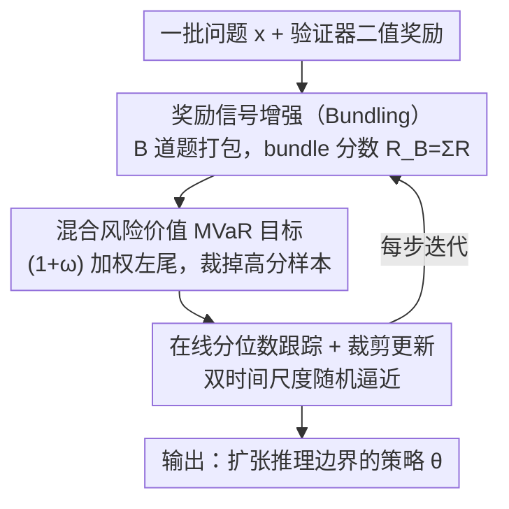

# RiskPO: Risk-based Policy Optimization with Verifiable Reward for LLM Post-Training

**会议**: ICLR 2026  
**OpenReview**: [https://openreview.net/forum?id=KjHB7rebQO](https://openreview.net/forum?id=KjHB7rebQO)  
**代码**: https://github.com/RTkenny/RiskPO  
**领域**: 强化学习 / LLM 后训练 / RLVR  
**关键词**: RLVR, 风险度量, 熵坍缩, 策略优化, 推理能力

## 一句话总结
针对 GRPO 这类「优化平均奖励」的 RLVR 方法在训练早期熵坍缩、推理边界停滞的问题，本文提出 RiskPO，用混合风险价值（MVaR）目标替换均值目标，把梯度信号聚焦到奖励分布的左尾（难题），并配合把多道题打包（bundling）来把二值反馈变成连续分布；在数学/多模态/代码推理上 Pass@1 与 Pass@k 全面超过 GRPO 及其变体。

## 研究背景与动机

**领域现状**：带可验证奖励的强化学习（RLVR）已成为提升 LLM 推理能力的主流后训练范式。它不像 RLHF 依赖人类偏好，而是用规则验证器给出「对/错」的二值奖励，目标是最大化期望奖励 $J(\theta)=\mathbb{E}_{x,y}[R(y)]$。GRPO 通过用「组内标准化奖励」替代价值模型，去掉了标准 RL 里冗余的结构，成了这一领域事实上的基线。

**现有痛点**：以 GRPO 为代表的方法在训练早期会出现**熵坍缩**——策略熵迅速下降、过早收敛，性能很快进入平台期。熵是探索能力的关键指标，一旦坍缩，模型变得过度自信、停止探索，观察到的提升往往只是「更高效地采样已会的答案」（Pass@1 涨、但推理边界没扩张），而非真正学到新的推理能力。

**核心矛盾**：根源在于 GRPO 用**均值**作为优化目标。均值目标天然偏向高概率、常见的生成路径，而忽略罕见但富含信息的推理轨迹。更糟的是，当模型对某道题的所有采样回答全错时，GRPO 的标准化优势会坍缩为零——模型在它最薄弱的区域反而拿不到任何学习信号，梯度更新全堆在已经会做的简单题上，收益边际递减。

**本文目标**：把优化目标从「分布的均值」转向「分布的结构」，特别是代表难题的**左尾**，让训练信号更细粒度、更鲁棒地驱动模型攻克它不会的题。

**切入角度**：作者从风险敏感强化学习借来分布视角——奖励分布的左尾就是模型尚未掌握的难题。CVaR / RVaR 这类风险规避目标会放大低奖励样本的梯度信号，自然鼓励模型降低过度自信、多样化搜索、探索新的推理策略。

**核心 idea**：用**风险度量**代替均值作为 RLVR 的训练目标——具体是一个能同时加权多段分布区间的「混合风险价值（MVaR）」目标，并通过把多道题打包成 bundle 把稀疏二值反馈变成连续分布，从而缓解熵坍缩、真正扩张推理边界。

## 方法详解

### 整体框架

RiskPO 的输入是一批训练问题，输出是后训练后的策略参数。它在标准 RLVR 采样循环（每题采 $G$ 个回答、验证器打二值分）的基础上做两件事：**先把反馈信号变稠**，**再用风险敏感目标去优化**。

第一步「奖励信号增强」：单道题的奖励只有 0/1 两个值，分布信息太粗。RiskPO 把 $B$ 道题打成一个 bundle，用 bundle 内各题得分之和 $R_B=\sum_{i=1}^{B}R(y_i)$ 作为新的奖励单元——稀疏的二值反馈被聚合成一个取值更连续的 bundle 分数分布，从而能区分不同难度层级，也避免了「全错→优势为零」的零梯度问题。

第二步「风险敏感策略优化」：在 bundle 分数分布上定义 MVaR 目标，用在线方式跟踪分布的 $\alpha$、$\beta$ 分位数 $F_\theta^{-1}(\alpha), F_\theta^{-1}(\beta)$，把梯度权重压到左尾（难题）、对已学好的高分样本裁掉梯度信号；再用带 clip 的信赖域式更新（序列级重要性采样）稳定多步更新。整体是一个**双时间尺度随机逼近**算法：一个时间尺度更新分位数跟踪器，另一个更新策略参数。

### 关键设计

**1. 混合风险价值（MVaR）目标：把优化重心从均值搬到分布左尾**

这是替换 GRPO 均值目标的核心。先回顾区间风险价值 RVaR：它度量奖励落在 $[\alpha,\beta]$ 分位区间内的条件期望 $J_{\text{RVaR}_{\alpha:\beta}}(\theta)=\mathbb{E}[R(y)\mid R(y)\in[F_\theta^{-1}(\alpha),F_\theta^{-1}(\beta)]]$，相当于在分布上开了一个「窗口」做控制；当 $\alpha=0$ 时它退化为 $\beta$ 水平的下尾 CVaR。MVaR 进一步把多段窗口加权组合起来：

$$J_{\text{MVaR}^\omega_{\alpha:\beta}}(\theta)=\Big[(1+\omega)\!\int_{F_\theta^{-1}(0)}^{F_\theta^{-1}(\alpha)}+\int_{F_\theta^{-1}(\alpha)}^{F_\theta^{-1}(\beta)}\Big]\,r\,dF_\theta(r),$$

其中 $\omega\ge 0$ 控制对尾部样本的强调程度，$[0,\alpha]$ 这段最难的左尾被额外加权 $(1+\omega)$，而高于 $\beta$ 分位的高分样本被排除在当前训练之外。直觉上它做的就是「把梯度从已经会做的题挪到不会做的题」。作者用 Theorem 1 给出了 RVaR 的策略梯度形式 $\nabla_\theta J_{\text{RVaR}_{\alpha:\beta}}=\frac{1}{\beta-\alpha}\mathbb{E}[g(R(y),F_\theta^{-1}(\alpha),F_\theta^{-1}(\beta))\nabla_\theta\ln\pi_\theta(y|x)]$，其中 $g(z,a,b)=(z-a)^+-(z-b)^++a-b$，使得这个分布目标可以像普通策略梯度一样做梯度上升。与 GRPO 相比，它不再对常见路径过度强调，而是给薄弱区域更强的学习信号。

**2. Bundling 奖励信号增强：把二值反馈聚合成可区分难度的连续分布**

单题奖励是二值的，落到风险度量里信息量极低——尤其全错时优势直接归零。作者把 $B$ 道题组成一个 bundle $X=\{x_i\}_{i=1}^{B}$，以 bundle 内得分之和 $R_B=\sum_i R(y_i)$ 作为优化单元，于是奖励从 $\{0,1\}$ 变成 $\{0,1,\dots,B\}$ 的更细分布，既能区分「难度层级」，又避免了难题零梯度。实现上每题采 $G$ 个回答 $\{y_i^j\}_{j=1}^G$，对每道题独立从对称群采一个排列 $\xi_i\sim\text{Unif}(S_G)$，把 $G\times B$ 个回答**无放回**地拼成 $G$ 个互不重叠的 bundle（第 $j$ 个 bundle 用 $\{y_i^{\xi_{i,j}}\}_{i=1}^B$）。这样每个回答只用一次，又能凑出 $G$ 个 bundle 来估计 MVaR 优势 $A_j$。bundle 大小 $B$ 是关键超参：太大则一个优势值被太多样本共享、稀释梯度，太小则分位数跟踪不稳，实验里 $B=5$ 最优。

**3. 在线分位数跟踪 + 裁剪信赖域更新：让风险目标可稳定训练**

MVaR 优势依赖于实时的分位数 $F_\theta^{-1}(\alpha),F_\theta^{-1}(\beta)$，而它们随策略变化而漂移。RiskPO 用在线方式跟踪：$q^s_{k+1}=q^s_k+\gamma_k\big(s-\frac{1}{G}\sum_j \mathbb{1}\{R_{B_j}<q^s_k\}\big),\ s\in\{\alpha,\beta\}$，把分位数估计和参数更新放在两个不同的学习率（时间尺度）上，构成双时间尺度随机逼近。为支持每次评估后做多步更新，作者采用带 clip 的信赖域式目标，并用**序列级**重要性采样比 $s_i^j(\theta)=\big(\pi_\theta(y_i^{\xi_{i,j}}|x_i)/\pi_{\theta'}(y_i^{\xi_{i,j}}|x_i)\big)^{1/|y_i^{\xi_{i,j}}|}$（因为 RLVR 奖励只在序列级可得），最终用于反传的目标为

$$J^{\text{clip}}_{\text{MVaR}}(\theta)=\mathbb{E}\Big[\tfrac{1}{G}\sum_{j=1}^{G}\tfrac{1}{B}\sum_{i=1}^{B}\min\big(s_i^j(\theta)A^{(j)},\ \text{clip}(s_i^j(\theta),1-\epsilon,1+\epsilon)A^{(j)}\big)\Big].$$

同一 bundle 内所有 token 共享同一个 MVaR 优势 $A^{(j)}$，保证优化单元和奖励单元（bundle 分数）对齐。

### 损失函数 / 训练策略

最终损失即上式 $J^{\text{clip}}_{\text{MVaR}}$。理论上作者用 Proposition 1 把熵的逐步变化与「优势 $A$ 和对数概率 $\log\pi$ 的协方差」联系起来：正相关导致熵下降。由于均值目标会过度优化已学好（高优势、高对数概率）的题，协方差为正、熵快速坍缩；Theorem 2 证明在 Assumption 1（基模型在分布两尾对数概率单调，且经 DeepSeek-R1-Distill-Qwen-1.5B 实测验证）下，MVaR 优势与对数概率的协方差**小于**均值方法，从而诱导更高熵的更新、缓解熵坍缩。反之 risk-seeking（强调上尾）会加剧协方差、加速坍缩。

## 实验关键数据

### 主实验

在六个难级数学推理 benchmark 上的 Pass@1（基模型 DeepSeek-R1-Distill-Qwen-1.5B）：

| 方法 | AIME25 | AIME24 | AMC | MATH500 | Minerva | Oly. | Avg. |
|------|--------|--------|-----|---------|---------|------|------|
| GRPO-1.5B | 20.0 | 20.0 | 56.6 | 79.2 | 27.1 | 39.6 | 40.41 |
| DAPO-1.5B | 30.0 | 26.6 | 58.6 | 78.2 | 29.2 | 40.6 | 43.87 |
| GMPO-1.5B | 23.3 | 23.3 | 54.2 | 76.2 | 29.2 | 39.2 | 40.90 |
| **RiskPO-1.5B** | **33.3** | **33.3** | **60.8** | **81.8** | **29.5** | **41.2** | **46.65** |

RiskPO 平均 46.65，比最强基线 DAPO 高 +2.78，比 vanilla GRPO 高 +6.24；在最难的 AIME 上比 DAPO 高近 +6.7 分（33.3 vs 26.6）。在更易的数学/多模态/代码任务上同样领先（MATH 56.2、LiveCodeBench 26.8、Geometry3K 54.5），平均均超过 GRPO 和 DAPO。

更关键的是 Pass@k：随 $k$ 增大，RiskPO 与 GRPO 的差距持续拉大（Figure 4），说明它不是把「16 次中 1 次成功」变成稳定单发成功（采样效率），而是真正解出了 GRPO 即使采 16 次也持续解不出的题——验证了「扩张推理边界」的论断。

### 消融实验

| 配置 | 关键指标（easy math Avg.） | 说明 |
|------|------|------|
| Full (risk-averse, $B=5$, $\alpha,\beta=0.2,0.8$) | 68.25 | 完整模型 |
| risk-seeking（强调上尾） | — | 熵急剧下降，50 步后停滞（MATH 52%→54%），不及 risk-averse（52%→56%） |
| $(\alpha,\beta)=(0.1,0.8)$ | 66.90 | 减小 $\alpha$ 削弱左尾强调，掉点 |
| $(\alpha,\beta)=(0.2,0.9)$ | 66.95 | 增大 $\beta$ 加重上尾，掉点 |
| Bundle $B=1$（不打包） | 65.80 | 退化最严重，掉 2.45% |
| Bundle $B=10$ | 66.65 | 过大稀释梯度，掉 1.6% |

### 关键发现
- **风险规避 vs 风险寻求**：risk-seeking 早期（<50 步）Pass@1 略高，但很快因无法优化难题而停滞；risk-averse 持续提升（MATH 52%→56%，约 1.5 倍提升），并把熵稳定在约 0.2，而 GRPO 熵早早坍缩。
- **bundle 大小存在甜点**：$B=5$ 最优，体现「优势共享 vs 分位数跟踪稳定性」的权衡——太大则单一优势被太多样本共享、稀释梯度，太小则分位数估计不稳。
- **分位数区间 $(0.2,0.8)$ 最稳**：偏离该配置一致掉点，再次印证「维持风险规避（重视左尾）」的重要性。
- **熵动力学验证理论**：Figure 5 显示 GRPO 与 RiskPO 的均值奖励曲线几乎重合（说明均值不是好目标），但下尾 RVaR、MVaR 曲线 RiskPO 明显占优，且全程维持更高熵。

## 亮点与洞察
- **把「风险度量」首次引入 RLVR 训练目标**：跳出「优化期望奖励」的惯性，从分布视角识别出「左尾=难题」，用 MVaR 把梯度精准导向模型最薄弱处，这个视角迁移性很强——任何二值/稀疏奖励的 RL 任务都可借鉴。
- **Bundling 是个轻巧又关键的工程 trick**：仅靠「把多题打包求和」就把二值反馈变成连续分布，顺手解决了 GRPO 最尴尬的「全错零梯度」问题，几乎零额外成本。
- **理论与现象闭环**：用「优势-对数概率协方差」一把钥匙同时解释了为何均值/风险寻求会熵坍缩、为何风险规避能缓解，并有实测对数概率曲线支撑假设，不是空谈。
- **Pass@k 作为「推理边界」证据**：用 Pass@k 随 $k$ 增大差距拉大来区分「采样效率提升」与「真获得新能力」，这个评测思路值得复用。

## 局限与展望
- 主实验集中在 1.5B 规模（DeepSeek-R1-Distill-Qwen-1.5B / Qwen2.5-Math-1.5B），更大模型上风险目标的收益是否同样显著、熵坍缩是否同样严重，文中未充分验证。
- MVaR 引入了 $\alpha,\beta,\omega,B$ 等多个超参，消融显示对 $(\alpha,\beta)$ 和 $B$ 都较敏感、需细调，实际部署的调参成本不低。
- 理论分析建立在 tabular softmax + 确定性序列奖励的简化设定与 Assumption 1（两尾对数概率单调）之上，与真实大模型训练存在 gap，结论是「直觉验证」而非严格保证。
- bundle 内同一优势被所有 token 共享，可能在 bundle 内难易混杂时对个别题分配不当的信用，文中未深入分析这种 credit assignment 的细粒度影响。

## 相关工作与启发
- **vs GRPO**：GRPO 用组内标准化均值优势优化期望奖励；RiskPO 换成 MVaR 风险目标 + bundle 分数，核心区别在于把优化重心从「常见路径的均值」转到「难题的左尾」，从而缓解熵坍缩、扩张推理边界，而非仅提升采样效率。
- **vs DAPO**：DAPO 靠四个工程 trick（如 clip-higher、动态采样等）改良 GRPO，仍是均值目标；RiskPO 从目标函数层面改造，主实验平均高出 +2.78，在最难的 AIME 上优势最明显。
- **vs 风险敏感 RL（CVaRPG / QPO / 分布式 RL）**：经典风险敏感 RL 在 MDP / 控制设定下优化 CVaR、分位数或失真风险度量；RiskPO 把这套思想首次落到 LLM 后训练的 RLVR 场景，并针对二值奖励设计了 bundling 来让风险度量可用。

## 评分
- 新颖性: ⭐⭐⭐⭐⭐ 首次把风险度量（MVaR）引入 RLVR 目标，分布视角清晰且有理论支撑
- 实验充分度: ⭐⭐⭐⭐ 覆盖数学/多模态/代码十余 benchmark + 完整消融，但模型规模偏单一
- 写作质量: ⭐⭐⭐⭐⭐ 动机—方法—理论—实验闭环，图表把熵坍缩与推理边界讲得很直观
- 价值: ⭐⭐⭐⭐⭐ 给 RLVR 提供了一个原则化、可迁移的新优化范式，直击熵坍缩痛点

<!-- RELATED:START -->

## 相关论文

- [\[ICLR 2026\] Prompt Curriculum Learning for Efficient LLM Post-Training](prompt_curriculum_learning_for_efficient_llm_post-training.md)
- [\[ICLR 2026\] Towards High Data Efficiency in Reinforcement Learning with Verifiable Reward](towards_high_data_efficiency_in_reinforcement_learning_with_verifiable_reward.md)
- [\[ICLR 2026\] From Verifiable Dot to Reward Chain: Harnessing Verifiable Reference-based Rewards for RL of Open-ended Generation](from_verifiable_dot_to_reward_chain_harnessing_verifiable_reference-based_reward.md)
- [\[ICLR 2026\] Preference-based Policy Optimization from Sparse-reward Offline Dataset](preference-based_policy_optimization_from_sparse-reward_offline_dataset.md)
- [\[ICLR 2026\] The Choice of Divergence: A Neglected Key to Mitigating Diversity Collapse in Reinforcement Learning with Verifiable Reward](the_choice_of_divergence_a_neglected_key_to_mitigating_diversity_collapse_in_rei.md)

<!-- RELATED:END -->
