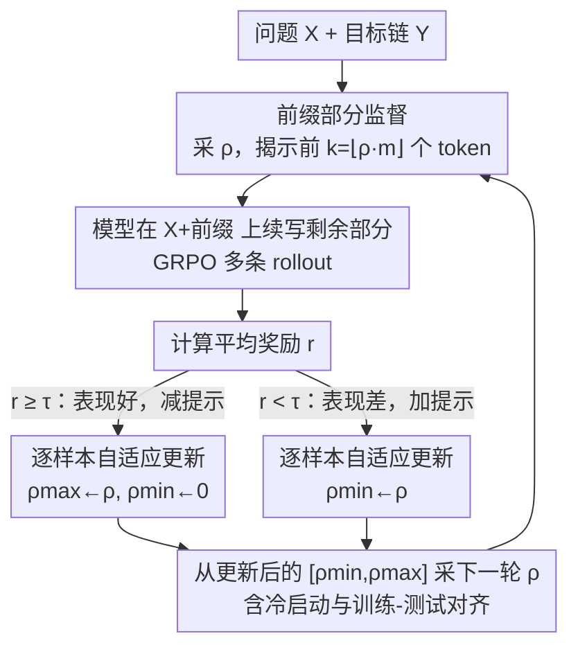

# RL for Reasoning by Adaptively Revealing Rationales

**会议**: ICLR 2026  
**OpenReview**: [https://openreview.net/forum?id=wdbgTG5kib](https://openreview.net/forum?id=wdbgTG5kib)  
**领域**: LLM推理 / 强化学习  
**关键词**: 课程学习, 部分监督, GRPO, 推理链, 自适应回溯

## 一句话总结
本文提出 **AdaBack（自适应回溯）**：在 RL 训练中按样本动态揭示目标推理链的一段前缀作为提示，并用奖励反馈对"揭示比例"做随机二分搜索，让模型从"补最后一步"逐步过渡到"从零生成全链"，从而在 SFT 和标准 RL 都学不会的稀疏奖励任务上学到全新的推理能力。

## 研究背景与动机
**领域现状**：让大模型学会长链推理（chain-of-thought）主要有两条路。一是 **SFT**，直接用专家给出的完整推理轨迹做监督学习；二是 **RL**（STaR / PPO / GRPO 等），只用一个可验证的奖励（如最终答案对不对）让模型自己探索出推理路径。

**现有痛点**：两条路在长链推理上都会失效。SFT 需要海量高质量推理轨迹，对数学这类专业领域代价极高；RL 则被**探索难题**卡死——推理链越长，合法输出序列空间随长度指数爆炸，而奖励稀疏且常常是二值的，随机采到一条正确解的概率随序列长度指数衰减。结果是标准 RL 基本只会强化预训练模型本来就有较高概率的路径（Havrilla、Yue 等的实证都支持这一点），很难真正学到新能力。

**核心矛盾**：稠密示范（SFT）和零示范（RL）之间存在一段被忽视的中间地带——**部分监督**。一个需要 $n$ 个连续步骤都做对才成功的任务，若每步正确率为常数 $p$，整条链一次做对的概率只有 $p^n$，正反馈平均每 $p^{-n}$ 次才出现一次；但若先把前面步骤都"喂"给模型、只让它补最后一步，正反馈概率立刻回到 $\Theta(p)$。

**本文目标**：能否用"自适应的部分监督"把一个成功率 $p^n$ 的搜索，拆成 $n$ 个成功率各为 $\Theta(p)$ 的简单子搜索，从而让模型学到原本指数级不可能采到的解？

**切入角度**：作者从一个朴素观察出发——揭示目标解的前缀越多，剩下要生成的部分越短、越容易拿到奖励；那么只要随着模型变强**逐步减少揭示的前缀**，就能始终维持稠密的正反馈，把长链拆成可学的小步。难点在于：不同样本难度不一，统一的揭示比例既浪费又不公平，必须**逐样本、由模型当前表现自动驱动**。

**核心 idea**：用"按样本自适应揭示目标前缀比例"取代固定的人工课程表，奖励高就少给提示、奖励低就多给提示，本质是对揭示比例做一次以奖励为成功信号的随机二分搜索。

## 方法详解

### 整体框架
AdaBack 嫁接在 GRPO 这类"每个样本采多条 rollout、用平均奖励估计难度"的 RL 框架之上。给定问题 $X^{(i)}$ 和它的目标推理链 $Y^{(i)}=(Y_1,\dots,Y_{m_i})$，每个训练步先为该样本采一个揭示比例 $\rho^{(i)}_t$，揭示前 $k=\lfloor \rho^{(i)}_t\cdot m_i\rfloor$ 个 token 作为提示，模型在"问题 + 已揭示前缀"的条件下续写剩余部分 $\hat Y^{(i)}_{k+1:}\sim P_\theta(\cdot\mid X^{(i)}, Y^{(i)}_{1:k})$。多条 rollout 的平均奖励 $r^{(i)}_t$ 与阈值 $\tau$ 比较，据此**收缩该样本的揭示比例区间** $[\rho^{(i)}_{\min},\rho^{(i)}_{\max}]$，下一轮再从更新后的区间里采新的 $\rho$。整个过程对每个样本独立维护一条"从全监督走向全生成"的轨迹，无需任何全局课程阶段或人工调度。

### 关键设计

**1. 前缀部分监督：把长链拆成可拿到奖励的短续写**

针对的痛点是标准 RL 在长链上"采不到正确解、拿不到奖励"。AdaBack 不让模型从零生成整条链，而是从数据集里直接揭示目标解的前 $k$ 个 token（$k=\lfloor\rho\cdot m\rfloor$），让模型**条件于一段已知正确的前缀**去续写后半段。这样剩余要生成的长度可控，正反馈概率从整链的 $\approx 2^{-L}$（合成 parity 任务里）拉回到 $\Theta(p)$。关键在于"揭示的是真实正确前缀"——它既是脚手架又是探索的锚点：模型只需在一个已知可达的局部解附近探索最后几步，而不是在指数大的全空间里盲找。随着 $\rho$ 从 1 逐步降到 0，模型被引导着从"补最后一步"过渡到"完成更长片段"直到"从零生成全链"，整条推理链被等价地拆成一串成功率各约 $\Theta(p)$ 的子搜索。

**2. 逐样本自适应更新规则：以奖励为信号对揭示比例做随机二分搜索**

针对的痛点是不同样本难度差异巨大，统一或人工设计的课程表既低效又需反复调参。AdaBack 为每个样本 $i$ 维护一个揭示比例区间 $[\rho^{(i)}_{\min},\rho^{(i)}_{\max}]$（初始 $[0,1]$），每轮从中均匀采 $\rho^{(i)}_t\sim U(\rho^{(i)}_{\min},\rho^{(i)}_{\max})$。拿到平均奖励 $r^{(i)}_t$ 后按固定阈值 $\tau$ 更新区间：

$$\text{若 } r^{(i)}_t<\tau:\ \rho^{(i)}_{\min}\leftarrow\rho^{(i)}_t;\qquad \text{若 } r^{(i)}_t\ge\tau:\ \rho^{(i)}_{\max}\leftarrow\rho^{(i)}_t,\ \rho^{(i)}_{\min}\leftarrow 0$$

直觉很直接：表现好（$r\ge\tau$）就把上界压低、少给提示，把任务变难；表现差（$r<\tau$）就抬高下界、多给提示，保证还能拿到有用奖励。这本质是对"在维持足够奖励的前提下尽量少揭示"这一目标做的**随机二分搜索**，$\tau$ 是唯一需要设的超参（论文称训练对它不敏感）。相比 R3 那种"在所有空白处切片、对所有片段统一施加 RL"的非自适应做法，逐样本调度让每个训练点都"准备好了才前进"，既不浪费容易样本的算力，也不会让困难样本一直采不到奖励。

**3. 冷启动与训练-测试对齐：让无历史样本和最终部署都不掉链子**

针对两个工程性裂缝。其一是**冷启动**：刚进入训练、还没有奖励历史的样本无从估计难度，AdaBack 用全局移动平均 $\bar\rho_{\min}$、$\bar\rho_{\max}$（用指数移动平均持续更新）来初始化它们的 $\rho^{(i)}$，相当于借"同批样本的平均难度"给新样本一个合理起点。其二是**训练-测试分布失配**：训练时模型总能看到一段真实前缀，但测试时要从零生成，若不处理就会出现"训练靠提示、测试裸奔"的落差。为此 AdaBack 以一个小概率把揭示比例直接置零，强制部分样本在训练中也体验"无提示从零生成"，把训练行为往测试行为上拉近。这两点虽不改变核心更新规则，却是让自适应课程在真实数据上稳定收敛的必要补丁。

## 实验关键数据

### 合成任务：Chain-of-Parities 的分离结果
作者构造了一个**链式奇偶（chain-of-parities）**合成任务：给定二进制输入 $X\in\{0,1\}^L$，要生成 $Y_1,Z_1,\dots,Y_L,Z_L$，其中 $Y_i$ 任意、$Z_i=Z_{i-1}\oplus Y_i\oplus X_i$。每个 $Z_i$ 都依赖前一步，早错则全错，随机生成一条合法输出的概率仅 $2^{-L}$，是稀疏奖励的理想缩影。在 $L=16$、$n=1024$、Llama 3.2 1B 上：

| 方法 | 是否学会该任务 | 说明 |
|------|----------------|------|
| SFT | ✗ | 小样本下连"弱学习"degree-3 parity 都达不到（SQ 样本复杂度 $\Omega(L^{k-1})$） |
| 标准 RL | ✗ | 奖励稀疏，奖励长期停在 0.1（只保住格式） |
| SFT + RL | ✗ | SFT 没提供弱学习，RL 仍随机探索，奖励指数稀疏 |
| R3 | 部分 | 1.6 万+ 迭代后测试奖励仅约 0.8，非自适应切片效率低 |
| **AdaBack** | ✓ | <700 迭代即学会，揭示比例随训练自然下降 |

这给出一个清晰的**分离结果**：存在一类任务 SFT、RL 及其朴素组合都学不会，而 AdaBack 能可靠学会。

### 主实验：三个数学推理基准 + 两个泛化变体
在 DeepScaleR、MATH、GSM8k 以及作者新造的 **Base-7 GSM8k**（数字改用 7 进制、制造预训练没见过的符号偏移）和 **Tensor-2 GSM8k**（拼接两道题、加长推理链）上，用 Llama-3 1B/3B base 模型、GRPO 训练，对比四种配置的最终测试准确率：

| 方法 | DeepScaleR 1B/3B | MATH 1B/3B | GSM8k 1B/3B | Base-7 1B/3B | Tensor-2 1B/3B |
|------|------|------|------|------|------|
| Base+RL | 6.8 / 6.6 | 6.4 / 15.0 | 7.9 / 63.7 | 4.8 / 4.9 | 0.0 / 0.0 |
| SFT+RL | 7.1 / 9.1 | 7.4 / 17.7 | 36.7 / 72.7 | 14.4 / 45.4 | 6.9 / 42.7 |
| **AdaBack** | 9.0 / 10.6 | 9.1 / 19.1 | 39.2 / 73.3 | 18.4 / 43.9 | 8.5 / **49.2** |
| **SFT+AdaBack** | **9.5** / **12.5** | **9.5** / **19.9** | **43.2** / 70.7 | **24.5** / **49.9** | **11.3** / 42.2 |

AdaBack 在多数设置上稳定优于 GRPO 和 SFT+GRPO，越是"出预训练分布"的任务（如 Base-7、Tensor-2）优势越明显。一个有意思的现象：**直接在 base 模型上跑 AdaBack 常能追平甚至超过先 SFT 再 RL** 的标准管线（Tensor-2 1B 上 AdaBack-base 9.0% 反超 SFT+AdaBack 11.3%? 这里 base 8.5 vs SFT 11.3，但 base AdaBack 8.5 高于 SFT+RL 6.9），暗示 SFT 初始化有时会过早收窄搜索空间、反而限制探索。

### 关键发现
- **AdaBack 确实扩展了解空间，而非只重加权**：用 pass@k 评估，AdaBack 在 base 和 SFT 模型上都显著高于标准 RL，尤其在大 $k$ 处差距更大；这反驳了 Yue 等"RL 只是重加权已有分布、不增加推理能力"的论断——AdaBack 在 base 覆盖率很低时仍能抬高 pass@k，说明它发现了新的解模式。
- **什么时候 AdaBack 不起作用**：当数据集对模型太简单（如 Llama 3.2 3B-Instruct 在 MATH 上、Qwen2.5-1.5B 在 GSM8k 上）、RL 几百步内就达到接近满分训练奖励时，AdaBack 没有额外收益。它的价值集中在"稀疏奖励或符号失配制造了真实学习壁垒"的场景。
- **vs R3 的难度趋势**：在难度递增的 GSM8k < MATH < DeepScaleR 上，越难 AdaBack 越占优（DeepScaleR 上 1B/3B 都赢、MATH 上 1B 赢）；但在 GSM8k 上略逊 R3——因为 GSM8k 的步骤能用换行干净切分，按"真实推理步"切（R3）比按随机点切（AdaBack）更准，而 MATH/DeepScaleR 的长 LaTeX 块让 R3 的启发式切分变脆，AdaBack 用奖励驱动免去了切分超参的优势就显现了。

## 亮点与洞察
- **把"课程设计"从人工启发式变成奖励驱动的二分搜索**：传统课程学习要手工定阶段、调每阶段训多久、何时升级；AdaBack 只留一个阈值 $\tau$，让每个样本自己沿揭示比例做随机二分搜索，工程上极简且对 $\tau$ 不敏感——这个"用现成的 GRPO 平均奖励当难度估计器"的复用很巧妙。
- **部分监督是一个被忽视的连续谱**：论文最"啊哈"的点是把 SFT（揭示比例 1）和 RL（揭示比例 0）统一进同一根坐标轴，揭示比例 $\rho$ 连续地在两者间滑动，让"中间地带"成为一个可优化的量。
- **逐样本自适应可迁移**：这种"按样本表现动态调监督强度"的思路不限于前缀揭示，凡是能为样本估出一个成功信号的结构化生成任务（代码、定理证明、规划），都能套用同一根二分搜索骨架。

## 局限与展望
- **作者承认的局限**：对 instruct-tuned 模型、或预训练已充分覆盖任务类型的低不确定性场景，AdaBack 与标准 RL 一样几乎没有增益——它只在探索本身是瓶颈时才有用。
- **依赖真实目标链**：AdaBack 揭示的是数据集里的 ground-truth 前缀，因此仍需要带正确推理轨迹的数据；对完全没有参考解、只有最终答案验证器的任务如何揭示前缀，论文未给出方案。
- **随机切点 vs 语义切点**：在能干净分步的任务（GSM8k）上，按随机 token 位置切前缀不如按真实推理步切（R3）；一个自然的改进是把奖励驱动的自适应揭示与"语义边界感知的切分"结合，兼得两者之长。
- **指标自洽提醒**：正文关于"base 反超 SFT"的个别表述需对照 Table 1 谨慎解读，不同任务/规模下趋势并不完全一致，⚠️ 具体数值以原文表格为准。

## 相关工作与启发
- **vs 标准 RL（GRPO / PPO / STaR）**：它们从零生成、靠稀疏奖励探索，长链上几乎只强化已有路径；AdaBack 用真实前缀做脚手架，把指数级搜索拆成线性多个简单子搜索，能学到原本采不到的新解。
- **vs R3（Xi et al., 2024）**：R3 也做"从更靠前位置逐步补全推理链"的课程，但它在所有空白处统一切片、对所有片段非自适应地施加 RL；AdaBack 的区别是**逐样本、由模型每轮表现驱动**，免去全局课程表和切分超参，在脏格式的难数据集上更稳。
- **vs 传统课程学习 / SFT→RL 管线**：传统课程要人工分阶段调度；AdaBack 把这件事内生成一个奖励阈值下的搜索过程，且实验显示在 base 模型上直接跑常能匹配甚至超过"先 SFT 再 RL"，提示部分监督本身可能是比 SFT 初始化更好的先验。

## 评分
- 新颖性: ⭐⭐⭐⭐⭐ 把 SFT 与 RL 统一进"揭示比例"连续谱，并给出逐样本自适应的二分搜索课程，视角新颖
- 实验充分度: ⭐⭐⭐⭐ 合成分离结果 + 三基准 + 两泛化变体 + pass@k + R3 对比都覆盖，但多为 1B/3B 小模型
- 写作质量: ⭐⭐⭐⭐ 动机的 $p^n\to n\cdot\Theta(p)$ 论证清晰，合成任务设计有说服力
- 价值: ⭐⭐⭐⭐ 为稀疏奖励长链推理提供了简单可落地的中间方案，并诚实标出失效边界

<!-- RELATED:START -->

## 相关论文

- [\[ICLR 2026\] REA-RL: Reflection-Aware Online Reinforcement Learning for Efficient Reasoning](rea-rl_reflection-aware_online_reinforcement_learning_for_efficient_reasoning.md)
- [\[ICLR 2026\] RL Squeezes, SFT Expands: A Comparative Study of Reasoning LLMs](rl_squeezes_sft_expands_a_comparative_study_of_reasoning_llms.md)
- [\[ICLR 2026\] Scheduling Your LLM Reinforcement Learning with Reasoning Trees](scheduling_your_llm_reinforcement_learning_with_reasoning_trees.md)
- [\[ACL 2026\] Glance-or-Gaze: Incentivizing LMMs to Adaptively Focus Search via Reinforcement Learning](../../ACL2026/reinforcement_learning/glance-or-gaze_incentivizing_lmms_to_adaptively_focus_search_via_reinforcement_l.md)
- [\[ICLR 2026\] Webscale-RL: Automated Data Pipeline for Scaling RL Data to Pretraining Levels](webscale-rl_automated_data_pipeline_for_scaling_rl_data_to_pretraining_levels.md)

<!-- RELATED:END -->
