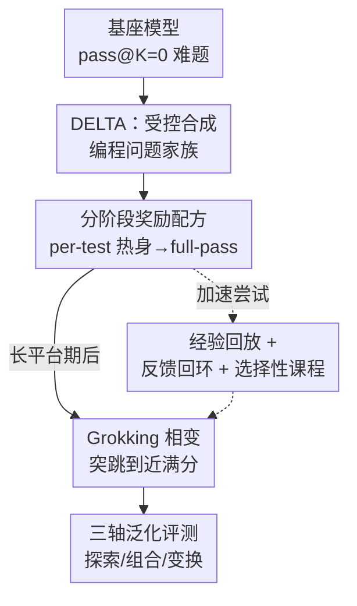

# RL Grokking Recipe: How Does RL Unlock and Transfer New Algorithms in LLMs?

**会议**: ICLR 2026  
**OpenReview**: [https://openreview.net/forum?id=CJJ8VxOWbG](https://openreview.net/forum?id=CJJ8VxOWbG)  
**代码**: https://github.com/sunblaze-ucb/rl-grok-recipe  
**领域**: 强化学习 / LLM 推理 / 代码生成  
**关键词**: RLVR, grokking, 学习能力, 泛化, 受控合成基准

## 一句话总结
作者造了一个受控合成编程基准 DELTA，证明在基座模型怎么采样都 pass@K=0 的难题家族上，用"先稠密 per-test 奖励热身、再切二元 full-pass 奖励"的分阶段 RL 配方，能让模型经历一段近零奖励的平台期后突然 grokking 跃升到接近满分，从而获得基座本来不会的全新算法策略，并系统刻画了这种策略沿探索/组合/变换三轴的泛化边界。

## 研究背景与动机
**领域现状**：RLVR（带可验证奖励的强化学习，如 GRPO/PPO）已经成为提升 LLM 推理能力的主流手段。但学界对它的本质有激烈争论：一派认为 RL 只是"磨锋"——把预训练里已经埋好的启发式策略调出来、提高小 $k$ 下的 pass@1，而基座在大 $k$ 时的 pass@K 上限并没被突破；另一派则认为 RL 能"解锁"基座本来执行不出来的新策略。

**现有痛点**：这场争论一直没法干净地裁决，因为现有的数学/代码开放基准（Numina-Math、DeepMath、OpenCodeReasoning 等）把不同主题和难度混在一起，"能力磨锋"和"真正习得"被搅在一起分不开；而且很多任务能靠调用工具（执行 Python 算矩阵秩）或背模板抄近路，根本测不出推理。

**核心矛盾**：要判定 RL 到底能不能越过基座边界，需要的是**训练-测试划分被严格控制、且确实超出预训练分布**的题目——既要 OOD 到逼模型发明新策略，又要内部干净到能把收益归因到某个具体技能。这样的数据集此前没有。

**本文目标**：把争论拆成两个可操作的判据——**学习能力（learnability）**：RL 能不能在基座 pass@K=0（如 $K{=}128$ 都全失败）的题目家族上学会解题？**可迁移性（transferability）**：一旦学会，这套技能能不能系统地迁移到 OOD 测试集，而不是记住了模板？

**切入角度**：作者发现"用编程题"是个绝佳载体——代码天然能靠单元测试给出**细粒度、可廉价大规模生成**的反馈（按通过的测试比例打分），这正好补上稀疏二元奖励学不动的缺口；同时用模板生成器可以精确控分布、控难度。

**核心 idea**：构造受控合成编程基准 DELTA（含全新 OOD 的 Manufactoria 谜题语法），并用"稠密 per-test 奖励热身 → 二元 full-pass 奖励收敛"的分阶段配方，把 pass@K=0 的难题逼出 grokking 相变，从而给"RL 能习得新算法"提供干净证据。

## 方法详解

### 整体框架
整篇工作可以看成一条"造受控题 → 用分阶段奖励逼 grokking → 沿三轴测泛化"的流水线。出发点是一个让基座彻底失败（pass@K=0）的难题家族；DELTA 提供这种受控合成题，分阶段 RL 配方负责把模型从全零奖励区里捞出来并触发 grokking，最后再用泛化研究刻画学到的策略能迁移到多远。

### 关键设计

**1. DELTA：用模板生成器隔离推理技能的受控编程基准**

要干净地裁决"磨锋还是习得"，关键是题目本身能控分布、防抄近路、且真正 OOD。DELTA 由五大类合成编程家族构成，核心是一个手工设计的 OOD 题域 **Manufactoria**——它源自 2010 年的 Flash 小游戏（用 puller/painter 两种节点搭自动工厂给彩色纸带分类，逻辑类似有限状态自动机/tag 系统），作者把它重新形式化成一套**全新的程序语法**。它之所以是真 OOD：原游戏的解只以图片形式存在于老网站、LLM 预训练绝无可能见过；题目是作者新合成而非复用旧关卡；且只有两种功能受限的节点，解法所需的推理模式和常规编程/图灵机任务有本质区别。相比前作 OMEGA（40 个数学家族），DELTA 的三点改进直击痛点：(a) Manufactoria 提供前所未见的 OOD 题域；(b) 目标是**合成程序本身**而非算个数值，堵死了"调工具抄近路"；(c) 编程天然支持按测试比例的稠密分级奖励。Manufactoria 还按四个 LLM 的平均表现切成 BASIC→EASY→MEDIUM→HARD 难度阶梯（共 14 个家族），中等档只有 GPT-5 能拿到非平凡成功率、HARD 档全员崩到接近零，从而既能给小模型测学习能力、又能给 SOTA 当 OOD 标尺。此外还配了 BouncingSim（2D 物理碰撞模拟，专门测泛化）和竞赛代码/SQL/LEAN 三个真实域家族。

**2. 稠密→稀疏的分阶段奖励配方：把 pass@K=0 逼出 grokking**

这是全文的核心 recipe，针对的痛点很尖锐：GRPO 靠不同 rollout 之间的奖励差产生梯度，如果一题所有 rollout 全失败（pass@K=0），就没有任何正信号、梯度为零，朴素 GRPO 直接停滞。作者的解法分两阶段。**热身阶段**改用连续的 per-test pass rate（通过测试的比例，取值 $[0,1]$）当奖励——它给出"部分得分"，能把模型从全零区里推出来开始累积正梯度；但它本身不够当代理损失，约 100 步后就饱和、full-pass 率仍 $<0.01\%$，所以不能一直用。于是从热身 checkpoint **切回**二元 full-pass 奖励（全部测试通过才 $+1$）。此后模型先进入约 450 步的**探索期**（full-pass 仍 $<1\%$），然后突然 grokking——找到解题的关键策略，随即进入收敛期，RL 不断强化这条成功推理路径，最终在 Manufactoria-HAS 上把 pass@k 相对基座提升近 100 个百分点（从 0% 到 100% full pass）。这条"先用中间信号引导探索、再用严格正确性锁定解"的思路，作者认为可外推到数学、形式逻辑等同样能造出细粒度信号的推理域。

**3. 加速 grokking 的尝试与选择性课程学习**

既然探索期那么长，自然想缩短它。作者试了三条路并诚实报告了利弊。**经验回放**：把每轮采样里成功的推理轨迹记下来，同一题重现时把最近最多三条成功轨迹拼进 rollout——确实能让 grokking 更早发生，但因为复用的是 off-policy 轨迹，整体收敛反而比基线 GRPO 慢。**反馈回环（feedback-in-the-loop）**：把 EOS token 换成失败测试样例之类的反馈、让模型接着生成——单次注入能提前 grokking 时刻，但 off-policy 的反馈 token 降低了训练稳定性，常见失败是模型即便看到反馈仍固执地坚持原来的错解。**选择性课程学习**：能否用跨家族课程替代热身？作者设了三阶段课程（先 START/APPEND/EXACT 基础家族，再分叉到 Stage 2-REGEX 或 Stage 2-COMPR，最后转到目标 HAS）。关键发现是：尽管 REGEX 与 COMPR 难度相近，REGEX 课程能成功迁移、近乎掌握 HAS，COMPR 课程却卡在低分——因为 REGEX 和 HAS 都围绕"检测/匹配子模式"，结构上对齐，而 COMPR 偏数值解释与分支判断、结构不对齐。结论是有效课程不仅要控难度、还要和目标家族**结构对齐**，而这样的桥接家族未必总能找到；相比之下稠密奖励热身不依赖额外的家族设计，更普适。但热身也非万能：在更难的 Manufactoria-PREPEND 上，即便用 per-test 奖励，full-pass 率全程卡死在零、逃不出全零区——它能否解锁取决于模型容量和目标家族难度。

### 损失函数 / 训练策略
默认基座为 Qwen3-4B-Instruct，算法 GRPO；每步 48 个 prompt × 16 rollouts，学习率 $5\times10^{-7}$。代码任务默认奖励为 full pass（二元，是否通过全部测试），分阶段配方在热身期改用 per-test pass rate（通过测试的比例）。学习能力研究在 Manufactoria-HAS（742 训练 / 100 测试）上进行；泛化研究在 BouncingSim 六个单技能家族的 Basic 混合集（每家族 1k、共 6k）上直接优化二元 full-pass 奖励训练约 300 步。

## 实验关键数据

### 主实验（学习能力：能否解 pass@K=0）
在 Manufactoria-HAS 上，基座 Qwen3-4B-Instruct 在 pass@128 下 full pass 率为 0%，三种奖励策略对比：

| 训练策略 | full-pass 结果 | 现象 |
|----------|---------------|------|
| (a) 直接 full-pass 二元奖励 | ≈0%（停滞） | 无正信号、GRPO 无梯度 |
| (b) 仅 per-test 连续奖励 | 仍 $<0.01\%$ | ~100 步即饱和，给不出完整解 |
| (c) per-test 热身 → full-pass | **100%** | 长平台期后突然 grokking 收敛 |

### 泛化实验（BouncingSim，三轴）
Basic 混合集训练约 step 200 出现 grokking 跃升至 ~0.7 full pass，随后沿三轴评测：

| 泛化轴 | 测试设定 | RL 前 | RL 后 |
|--------|----------|-------|-------|
| 探索（参数外推） | Basic(ID)→Easy/Medium/Hard | 接近零 | Basic 70–85%、Easy 50–75%、Medium 15–50%、Hard 个位数 |
| 组合（技能拼合） | ROT_BOX+MOV_BOX 等未见组合 | 接近零 | 60–70% |
| 变换（全新动力学） | 特殊周期/退化轨迹 | 接近零 | 仍接近零 |

### 关键发现
- **分阶段奖励是解锁 pass@K=0 的唯一有效配方**：直接二元奖励或仅用 per-test 都失败，只有"热身→切换"能逼出 grokking，证明 RL 可习得基座执行不出来的新策略。
- **组合泛化意外地强**：代码任务靠"结构拼合"（合并模拟模块）而非"策略发明"组合，60–70% 远好于 OMEGA 报告的弱组合迁移；但变换泛化（需发现新不变量）几乎全军覆没，与数学里变换泛化的顽固难度一致。
- **加速技巧都有 off-policy 代价**：经验回放和反馈回环都能提前 grokking，但分别带来收敛变慢和训练不稳；课程学习有效与否取决于桥接家族与目标的**结构对齐**而非仅难度。
- **磨锋与习得共存**：在更易的设定或弱配方下 RL 主要磨锋，难题+对的配方下才出现习得相变——结局由奖励设计、数据配比、任务难度共同决定。

## 亮点与洞察
- **把哲学争论变成可证伪的实验**：用 learnability 和 transferability 两个判据 + 受控合成题，把"RL 是磨锋还是习得"从口水仗变成能干净裁决的实验，这个 framing 本身很有价值。
- **首次在 RL 微调 LLM 上展示 grokking 相变**：以往 grokking 多见于监督的玩具数据集，这里把"长平台期 + 突然泛化"搬到了 RL 推理训练，且和稠密奖励热身机制挂上了钩。
- **per-test 热身这个 trick 可迁移**：凡是能造出细粒度可验证信号的域（数学的 rubric/逐步检查、定理证明器、模拟器/约束求解器），都能套"先稠密引导探索、再严格锁定正确性"的思路去跨越学习能力鸿沟。
- **"该盯硬子集"的呼吁**：大混合池里少量真正难（pass@K=0）的题会被简单题平均掉，而它们恰恰有独特的 grokking 动力学；作者主张未来评测显式隔离并跟踪这个硬前沿。

## 局限与展望
- **热身配方并非万能**：在更难的 Manufactoria-PREPEND 上即便用 per-test 奖励也逃不出全零区，能否解锁取决于模型容量与任务难度，作者已坦承这一点。
- **变换泛化仍是开放难题**：对需要发明全新解题范式/不变量的题（如保证周期性的特殊初态），RL 后几乎仍为零，说明"schema 创造"远超当前能力。
- **加速手段尚不成熟**：经验回放、反馈回环都因 off-policy 注入带来收敛变慢或不稳定，离即插即用还有距离。
- **结论的外推性待验证**：主结果集中在 Qwen3-4B 与合成编程域，向数学/科学等真实域的迁移只是 discussion 层面的展望，尚无系统实验背书（附录有补充模型/规模实验）。

## 相关工作与启发
- **vs 怀疑派（Yue et al. 2025 / Wu et al. 2025）**：他们用 coverage/perplexity 分析或理论论证 RLVR 不能超出基座表征上限；本文用 pass@K=0 上 grokking 到 100% 的干净反例直接反驳——区别在于本文有受控 OOD 题能排除数据混杂，证明"超出基座"在合适配方下确实发生。
- **vs 乐观派（ProRL, Liu et al. 2025b）**：他们在异质大语料上展示 RL 能扩边界，但难以隔离"为什么/怎么"扩；本文用合成家族把成因归因到具体的奖励配方与任务结构，给出机制层面的解释。
- **vs OMEGA（Sun et al. 2025）**：OMEGA 提供 40 个数学家族测三轴泛化，本文把范式搬到编程、加上真 OOD 的 Manufactoria 与稠密奖励；并发现编程的组合泛化（结构拼合）显著强于数学（策略发明）。
- **vs 传统 grokking 研究（Power et al. 2022 等）**：以往 grokking 是监督玩具数据集上"先记忆后泛化"，本文首次把它放到 RL 微调 LLM 的难推理任务上，并与稠密奖励热身的训练动力学联系起来。

## 评分
- 新颖性: ⭐⭐⭐⭐⭐ 首个在 RL 微调 LLM 上展示 grokking、并用受控 OOD 题干净裁决"磨锋 vs 习得"的工作。
- 实验充分度: ⭐⭐⭐⭐ 学习能力与三轴泛化都有系统对照，但主结果集中在单一模型规模与合成域，跨域外推仅停留在讨论。
- 写作质量: ⭐⭐⭐⭐⭐ framing 清晰、对加速技巧的失败与局限诚实报告，叙事完整。
- 价值: ⭐⭐⭐⭐⭐ 同时给出可复用的训练配方、可证伪的判据和"该盯硬子集"的评测主张，对 RL 推理研究有方法论意义。

<!-- RELATED:START -->

## 相关论文

- [\[ICLR 2026\] From f(x) and g(x) to f(g(x)): LLMs Learn New Skills in RL by Composing Old Ones](from_fx_and_gx_to_fgx_llms_learn_new_skills_in_rl_by_composing_old_ones.md)
- [\[ICML 2026\] How Does Reasoning Flow? Tracing Attention-Induced Information Flow for Targeted RL in LLMs](../../ICML2026/reinforcement_learning/how_does_reasoning_flow_tracing_attention-induced_information_flow_for_targeted_.md)
- [\[ICLR 2026\] Prosperity before Collapse: How Far Can Off-Policy RL Reach with Stale Data on LLMs?](prosperity_before_collapse_how_far_can_off-policy_rl_reach_with_stale_data_on_ll.md)
- [\[ICLR 2026\] RL Squeezes, SFT Expands: A Comparative Study of Reasoning LLMs](rl_squeezes_sft_expands_a_comparative_study_of_reasoning_llms.md)
- [\[ICLR 2026\] Mirage or Method? How Model–Task Alignment Induces Divergent RL Conclusions](mirage_or_method_how_modeltask_alignment_induces_divergent_rl_conclusions.md)

<!-- RELATED:END -->
