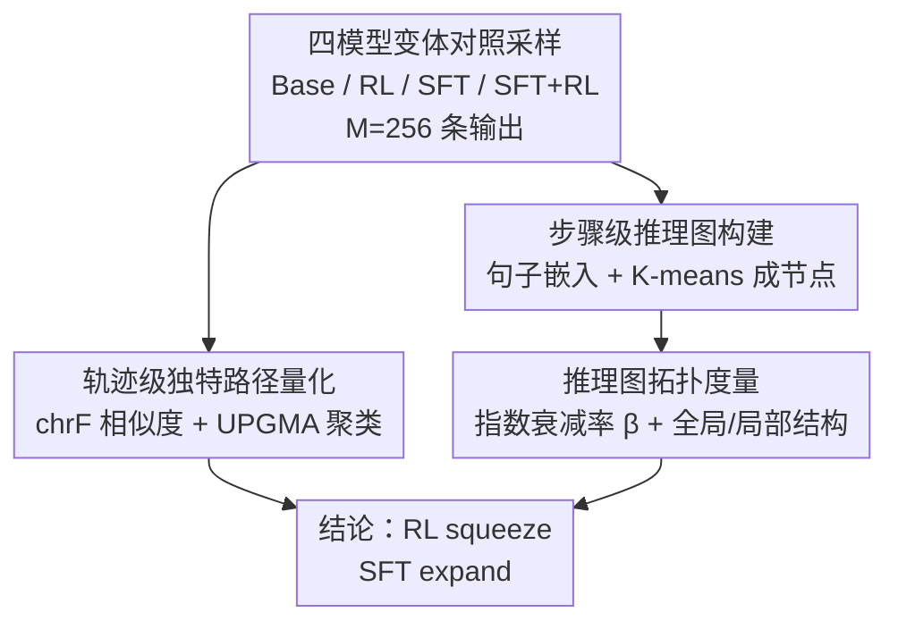

# RL Squeezes, SFT Expands: A Comparative Study of Reasoning LLMs

**会议**: ICLR 2026  
**OpenReview**: [https://openreview.net/forum?id=N2lMNqJsBw](https://openreview.net/forum?id=N2lMNqJsBw)  
**代码**: https://github.com/kohseim/rl_squeezes_sft_expands (有)  
**领域**: 强化学习 / LLM推理  
**关键词**: RLVR, SFT蒸馏, 推理路径, 推理图, 两阶段训练

## 一句话总结
这篇论文超越"只看准确率"的视角，提出一套从**轨迹级**和**步骤级（推理图）**两种粒度量化推理过程的分析框架，系统对比 RL 与 SFT 对推理 LLM 的不同塑形作用，得出核心结论——RL 在"压缩"（squeeze）、SFT 在"扩张"（expand）推理空间，从而解释了为何"先 SFT 后 RL"的两阶段训练范式有效。

## 研究背景与动机

**领域现状**：自 OpenAI-o1 与 DeepSeek-R1 之后，提升推理能力的后训练（post-training）主要靠两条路线——SFT（在强教师模型生成的推理轨迹上做模仿学习，最大化对数似然）和 RL（以可验证奖励 RLVR 最大化期望回报，常用 GRPO 等策略梯度方法）。当前 SOTA（如 ProRL、AceReason）几乎都是"DeepSeek-R1 蒸馏 checkpoint（即 SFT）→ 再 RL"的两阶段配方。

**现有痛点**：尽管两阶段训练在实践中反复奏效，但 RL 与 SFT 各自"到底改变了推理过程的什么"仍是黑箱。已有研究（Yue et al. 2025）发现一个看似矛盾的现象：随着采样次数 $k$ 增大，Base 模型的 Pass@$k$ 最终会反超经 RLVR 训练的 RL 模型——这暗示 RL 并没有教会模型新能力，只是"激发"了 Base 已有的能力。但这类结论全部停留在**答案准确率**层面，没人去看底层推理过程发生了什么。

**核心矛盾**：各种 SFT+RL 配方都是在不理解 RL（强化）与 SFT（模仿）各自分工的情况下"试错"调出来的。如果只比准确率，就无法解释"为什么是 SFT 先、RL 后这个顺序"，也无法指导数据构造与更高效的训练。

**本文目标**：回答"RL 和 SFT 在准确率之外，究竟如何塑造推理过程？"——并把它拆成两个可量化的子问题：(1) 整条推理输出（轨迹）的多样性如何变化；(2) 推理过程内部各步骤（节点）的功能分布如何变化。

**切入角度**：作者把推理过程显式建模成可度量的对象——轨迹级用聚类数刻画"独特推理路径"的数量，步骤级把推理输出切成句子、嵌入、聚类，构建一张"推理图"（reasoning graph），用复杂网络的拓扑指标去刻画推理的结构与功能分布。

**核心 idea**：用"推理路径数量 + 推理图拓扑"两把尺子去测量 RL/SFT 的塑形效果，发现 **RL 压缩（squeeze）、SFT 扩张（expand）** 这一对互补机制贯穿轨迹级和步骤级，从而为两阶段训练给出了机理解释。

## 方法详解

### 整体框架

本文不是提出新模型，而是提出一套**对比分析框架**。被分析对象是同一族、同一规模下的四个模型变体——Base（预训练后）、RL（Base 上做 RLVR）、SFT（Base 上做蒸馏）、SFT+RL（SFT 后再 RL），覆盖 1.5B/7B/14B 三种规模，在数学（AIME24/25、AMC23）与代码（HumanEval）域上评测。对每个问题采样 $M=256$ 条输出后，框架沿两个粒度并行展开：**轨迹级**把整条思考输出当作一条路径，统计"独特正确/错误路径"的数量；**步骤级**把每条输出切成句子、嵌入、跨四模型共享聚类成节点，构造有向推理图，再用衰减率与拓扑指标刻画其结构。两条分析最终汇聚成同一结论：RL squeeze、SFT expand。

### 关键设计

**1. 四模型变体对照：把"RL 做了什么、SFT 做了什么"拆成可比的四个点**

为了把 RL 与 SFT 的作用分离开，作者固定模型族、规模与评测集，构造四个变体：Base 指预训练后的模型，RL 指 Base 直接做 RLVR（如 Qwen2.5-Math-Oat-Zero、SimpleRL-Zoo），SFT 指 Base 做蒸馏（DeepSeek-R1-Distill 系列），SFT+RL 指 SFT 之后再 RL（Nemotron-Research-Reasoning、AceReason-Nemotron）。这样"Base→RL"这条边单独反映 RL 的效果，"Base→SFT"反映 SFT 的效果，"SFT→SFT+RL"反映在已蒸馏模型上再加 RL 的效果。作者坦承一个局限：不同变体的训练数据并不严格对齐，因此关注的是 RL 与 SFT 之间**原理性的算法差异**，而非控制变量下的严格因果——但通过跨三种规模、跨数学/代码域复现，结论的稳健性得到支撑。

**2. 轨迹级独特路径量化：用聚类数区分"正确路径"与"错误路径"的多样性**

针对"Base 的 Pass@$k$ 为何会反超 RL"这个谜题，作者直接去数"独特推理轨迹"的个数。对每个问题采样的 $M$ 条输出，按可验证奖励切成正确集与错误集；轨迹间相似度用字符级 n-gram 指标 chrF 衡量（相比词级 BLEU，chrF 对形态变化如 "add" vs "adding" 更鲁棒），对称化为 $s_{i,j}=\big(\text{chrF}_\beta(\pi_i,\pi_j)+\text{chrF}_\beta(\pi_j,\pi_i)\big)/2$，距离 $d_{i,j}=1-s_{i,j}$。由于 chrF 不是欧氏空间的嵌入度量，聚类用 UPGMA（非加权算术平均的层次聚类）而非 Ward 法，按相似度阈值 60 剪枝树状图，得到正确/错误两类的聚类数。聚类数越多意味着模型掌握的"独特解法/独特错法"越多。这一设计把抽象的"多样性"落成了可数的簇数，从而能直接观察 RL 与 SFT 谁在增、谁在减。

**3. 步骤级推理图构建：把一条思考链拆成句子节点、跨四模型共享聚类成一张有向图**

为了看进推理过程**内部**，作者把每条输出 $\pi^l_m$ 切成句子序列 $(r^l_{m,1},\dots,r^l_{m,T})$，用 BGE-large-en-v1.5 句向量（$d=1024$）把每个句子嵌入。关键设计在于：把**四个模型变体的所有句子嵌入放进同一个共享空间一起做 K-means 聚类**（$K=2000$），每个簇就是一个节点 $v_k$。这样四个模型的推理图都活在同一套节点定义上，才能直接横向比较图的性质——若各用各自的内部表示，图会落在不同表示空间里无法可比。每条输出于是变成图上一条路径：连续相同的簇分配合并以避免自环，相邻不同簇之间连一条有向边 $(v_i\to v_j)$，边权为质心欧氏距离 $d(v_i,v_j)=\lVert c_i-c_j\rVert_2$ 并记录转移频率。最终模型 $l$ 的弱连通推理图为 $G^l=\bigcup_{m} G^l_m$。

**4. 推理图拓扑度量：用指数衰减率 β 与全局/局部指标量化"功能集中 vs 分散"**

有了推理图，作者用复杂网络指标去量化结构。核心量是**节点访问频率、度、介数中心性**三条排序曲线——它们近似服从指数律 $X(R)\propto e^{-\lambda R}$（$R$ 为节点排名），在 log-linear 图上近似线性。作者用线性回归 $\log_{10}X(R)=\alpha-\beta R+\epsilon_R$ 估计衰减率 $\beta=\lambda/\log 10$。$\beta$ 越大，说明少数高排名节点占据了绝大部分访问/连接/中介功能，即"功能集中到少数步骤"；$\beta$ 越小则功能被摊薄到很多步骤。除衰减率外，作者还用八个全局拓扑指标（边密度、归一化聚类系数、同配性 assortativity、模块度 modularity、Freeman 中心化、归一化平均路径长度、全局效率、代数连通度）刻画整体结构，并用 graphlet（4 节点连通子图 G3–G8 的占比）刻画局部结构。正是这套度量让"squeeze/expand"从直觉变成数字：RL 把 $\beta$ 抬高约 2.5 倍、SFT 把 $\beta$ 压到约三分之一。

### 一个完整示例

以 1.5B 模型在 AIME24 上为例感受这套框架怎么落地：对某道题采样 256 条输出，轨迹级聚类后，Base 的（正确簇数, 错误簇数）约为 (22.2, 82.2)；做 RL 后压到约 (22.5, 22.6)——错误簇数从 82 暴跌到 23，正确簇数几乎不增甚至略减；做 SFT 后则变成 (3.3, 46.1) 到更高正确簇（不同问题不一），正确解法数上升但错误轨迹仍被保留。步骤级上，把这 256 条输出切句、嵌入、并入全局 2000 节点聚类得到推理图后估计 $\beta$：Base→RL 时频率/度/中心性的 $\beta$ 显著变陡（功能塞进少数 hub 节点），Base→SFT 时 $\beta$ 变缓（功能摊到许多节点）。两条粒度的观察相互印证，最终拼出"RL squeeze、SFT expand"这张全景图（论文 Figure 1）。

## 实验关键数据

### 主实验：轨迹级独特路径数变化

在 1.5B 模型、AIME24/25 与 AMC23 上，统计训练前后正确/错误独特轨迹簇数（数对为(正确簇, 错误簇)的代表值）：

| 模型变体（1.5B, AIME24） | 正确簇数 | 错误簇数 | 现象 |
|--------|------|------|------|
| Base | 22.2 | 82.2 | 多样但错法极多 |
| RL（Base→RL） | 22.5 | 22.6 | 错误轨迹被大幅压缩 |
| SFT（Base→SFT） | 升高 | 46.1 | 正确解法增加、错误仍保留 |
| SFT+RL | — | 进一步降低 | SFT 扩正确、RL 压错误，互补 |

结论：RL 不论从 Base 还是 SFT 出发都显著减少错误轨迹（解释了 RL 提升 Pass@1 靠概率质量再分配），但同时也减少正确轨迹（解释了大 $k$ 时 Base 的 Pass@$k$ 反超 RL）；SFT 增加正确轨迹（教会 Base 不具备的新解法），却保留可观的错误轨迹（因此单靠 SFT 不保证 Pass@1）。代码域 HumanEval（7B）上结论一致。

### 步骤级：推理图衰减率与拓扑

| 度量 | Base→RL | Base→SFT | 解读 |
|------|---------|----------|------|
| 指数衰减率 $\beta$（频率/度/中心性） | 升高（约 ×2.5） | 降低（约 ÷3） | RL 把功能集中到少数节点，SFT 摊匀到多节点 |
| 模块度 modularity | 降低 | 降低 | 两者都打散 Base 的社区结构 |
| 全局效率 / 代数连通度 | RL：高效率但靠少数 hub | SFT：高鲁棒高可达 | 与 Pass@1/Pass@$k$ 正相关 |
| Freeman 中心化 | 升高 | 偏低 | RL 形成 hub 主导图 |
| 4 节点 graphlet（G7/G8 环结构） | 增多（无环 G3/G4 减少） | 同样增多 | 两者都引入局部环（回溯/验证） |

### 关键发现
- **RL 与 SFT 是一对互补机制**：RL 压缩（尤其压错误轨迹、把图功能塞进少数 hub），SFT 扩张（增正确解法、把功能摊到多步骤），这正好解释"先 SFT 造对、再 RL 删错"的两阶段配方为何最大化 Pass@1。
- **局部结构无法单独解释性能**：RL、SFT、SFT+RL 三者的 4 节点 graphlet 占比相近（都把无环变成有环），但它们性能差距巨大——说明**全局拓扑**（hub 集中 vs 全局连通）才是关键。
- **图指标与准确率相关**：全局效率、代数连通度与 Pass@1/Pass@$k$ 正相关，模块度负相关，提示这些结构量反映了模型探索解空间、一次答对的能力。
- **稳健性**：结论跨 1.5B/7B/14B 三种规模、数学与代码两域、甚至 Llama 系列与 s1k-1.1 单响应 SFT 设置均成立。

## 亮点与洞察
- **把"推理过程"做成可量化对象**：用轨迹聚类数 + 推理图拓扑两把尺子，把过去只能看准确率的黑箱拆成可测量的结构指标——这套"推理图"方法论本身可迁移到分析任何后训练手段对推理的影响。
- **共享嵌入空间联合聚类**是让四模型可比的关键 trick：不在各自内部表示里建图，而是把所有模型的句子塞进同一句向量空间一起聚类，使不同模型的推理图共享节点定义，才谈得上横向比较。
- **一句机理回答了 Pass@k 之谜**：RL 同时压错误轨迹和正确轨迹，正好解释了"为什么大 $k$ 下 Base 反超 RL"——不是 RL 没用，而是 RL 牺牲多样性换 Pass@1。
- **可落地的训练启示**：若 RL 只把功能集中到少数 hub/中心步骤，那么"只对功能性步骤施加 RL"或"把图度量（hub/中心性）作为 RL 的过程奖励"可能带来更高效的训练与数据构造。

## 局限与展望
- **未控制训练数据差异**：作者明确承认四变体的训练数据并不严格对齐，关注的是 RL 与 SFT 的原理性算法差异，分布漂移下的推理路径变化尚待研究。
- **推理图构造引入超参与近似**：节点由 K-means（$K=2000$）聚类定义、相似度阈值/编码器/距离度量都需消融（论文在附录做了 $K=1000/3000$、L2 vs cosine、BGE vs GTE 的鲁棒性检查），但句子切分与聚类粒度仍会影响图结构。
- **高边密度需稀疏化处理**：因句子聚类导致图边密度偏高，需对每个节点保留 top-10/20 最近边再估 $\beta$，结论虽一致，但说明原始图存在度量偏置。
- **域局限**：实验集中在可验证、竞赛级的数学与代码域，能否推广到开放式/自由生成任务待验证。

## 相关工作与启发
- **vs Yue et al. (2025) 的 Pass@k 分析**：他们仅用 Pass@$k$ 在结果层面指出 Base 大 $k$ 反超 RL，本文深入到推理路径层面，给出"RL 同时压正确与错误轨迹"的机制解释，把现象上升为机理。
- **vs Chu et al. (2025)「SFT memorizes, RL generalizes」**：他们从迁移/泛化视角对比，本文从推理图的"功能聚合（RL）vs 功能分散（SFT）"角度提供了可能的结构性解释，二者互补。
- **vs Wang et al. (2025) 的 token 级熵分析**：他们发现 RL 抬高高熵"分叉" token 的熵，本文在步骤级观察到 RL 放大高频/高度/高中心性步骤与其它步骤的差异，两者在不同粒度上呼应同一"集中化"趋势。
- **vs 既有 SFT 数据构造启发式**（数 "wait" token、prime 认知行为、评估步骤清晰度）：本文提出可把推理图度量（hub/中心节点、低模块度高可达）作为数据筛选或过程奖励的新依据。

## 评分
- 新颖性: ⭐⭐⭐⭐⭐ 首次用"推理图拓扑 + 轨迹聚类"双粒度量化 RL/SFT 的塑形差异，视角新颖
- 实验充分度: ⭐⭐⭐⭐ 跨三规模、双域、多模型族复现，附录消融充分；但未控制训练数据差异
- 写作质量: ⭐⭐⭐⭐ "squeeze/expand"主线清晰，图表丰富；部分推理图度量定义偏密集
- 价值: ⭐⭐⭐⭐⭐ 为两阶段训练给出机理解释，并指出"功能性步骤 RL""图度量做过程奖励"等可落地方向

<!-- RELATED:START -->

## 相关论文

- [\[ICLR 2026\] Getting Your LLMs Ready for Reinforcement Learning with Lightweight SFT](getting_your_llms_ready_for_reinforcement_learning_with_lightweight_sft.md)
- [\[ICLR 2026\] RL Grokking Recipe: How Does RL Unlock and Transfer New Algorithms in LLMs?](rl_grokking_recipe_how_does_rl_unlock_and_transfer_new_algorithms_in_llms.md)
- [\[ICLR 2026\] QuestA: Expanding Reasoning Capacity in LLMs via Question Augmentation](questa_expanding_reasoning_capacity_in_llms_via_question_augmentation.md)
- [\[ACL 2026\] Bridging SFT and RL: Dynamic Policy Optimization for Robust Reasoning](../../ACL2026/reinforcement_learning/bridging_sft_and_rl_dynamic_policy_optimization_for_robust_reasoning.md)
- [\[ICLR 2026\] From f(x) and g(x) to f(g(x)): LLMs Learn New Skills in RL by Composing Old Ones](from_fx_and_gx_to_fgx_llms_learn_new_skills_in_rl_by_composing_old_ones.md)

<!-- RELATED:END -->
