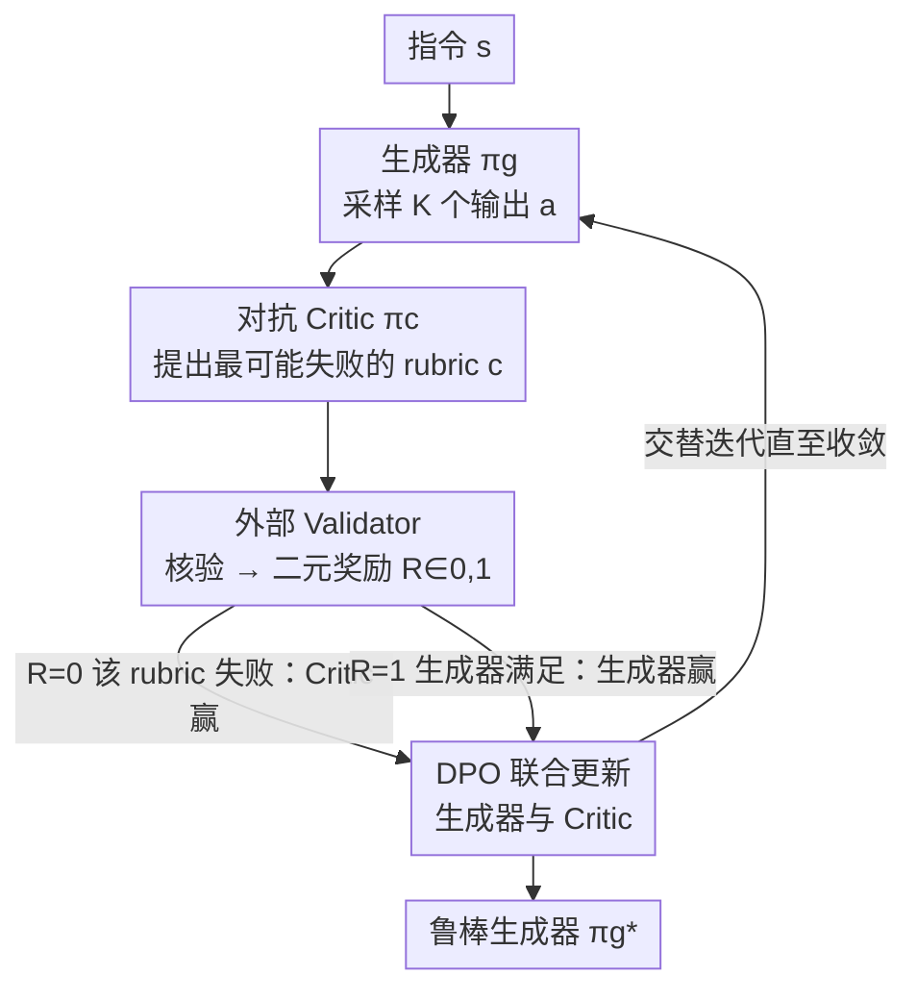

# RLAC: Reinforcement Learning with Adversarial Critic for Free-Form Generation Tasks

**会议**: ICLR 2026  
**OpenReview**: [https://openreview.net/forum?id=dBmjnRR1bC](https://openreview.net/forum?id=dBmjnRR1bC)  
**项目页**: [https://mianwu01.github.io/RLAC-website/](https://mianwu01.github.io/RLAC-website/)  
**代码**: 见项目页  
**领域**: 对齐RLHF / LLM后训练 / 强化学习  
**关键词**: 自由形式生成、对抗 Critic、动态 rubric 验证、DPO、奖励作弊

## 一句话总结
RLAC 把"输出要满足海量隐式 rubric"的自由形式生成后训练，重写成生成器和一个可学习 Critic 之间的极小极大博弈——Critic 每次只挑一条最可能失败的 rubric 交给外部验证器核验，从而免去逐条枚举所有 rubric，在传记事实性和代码生成上既超过穷举验证又超过奖励模型，验证调用最多省 5.7×。

## 研究背景与动机
**领域现状**：LLM 后训练已从 SFT 走到 RL，但带可验证奖励的 RL（PPO/GRPO）几乎只在"有清晰对错"的任务上好用，比如数学答案匹配参考解。

**现有痛点**：自由形式生成（写传记、生成复杂代码、写证明）没有干净的奖励函数——一个输出要同时满足很多条任务专属的评判准则（论文称之为 rubric），比如"牛顿出生年份说对了""代码处理了空输入"。两条主流路线各有硬伤：① **穷举验证**（如 FactScore 把每个原子事实都查一遍）忠实但贵到离谱，验证成本随输出长度爆炸，复杂代码更是有无穷多边界情况根本枚举不完；② **奖励模型 / LLM-as-judge** 把"合并所有 rubric"外包给一个学好的标量打分器，高效但极易被 reward hacking——因为最佳的 rubric 组合方式高度依赖于具体 prompt 和当前被优化的模型，固定奖励模型一旦被策略漂移出训练分布就会失准。

**核心矛盾**：rubric 数量巨大甚至无界，"枚举并验证全部"在计算上不可行；而"把全部 rubric 压成一个静态标量奖励"又会引入偏差、招致奖励作弊。验证的**完整性**与**可扩展性**之间存在根本张力。

**本文目标**：在不枚举每条 rubric、也不依赖固定标量奖励模型的前提下，给自由形式生成任务提供可扩展、可验证、且贴合当前策略的奖励信号。

**切入角度**：作者注意到"输出满足所有 rubric"等价于"在最坏的那条 rubric 上也满足"——即对 rubric 集合取 $\min$。既然只关心最坏情形，就不必遍历所有 rubric，只要有个机制能动态指出"当前最可能翻车的那条"即可。

**核心 idea**：引入一个可学习的对抗 Critic，让它在每一步只提出生成器最可能违反的一条 rubric，由外部验证器核验，把后训练变成生成器 vs Critic 的极小极大博弈，两者交替用 DPO 联合更新。

## 方法详解

### 整体框架
RLAC 要解决的是"如何在不枚举海量 rubric 的情况下给自由形式生成打奖励"。它把训练组织成一个**两人对抗博弈**：给定指令 $s$，生成器 $\pi_g$ 采样若干输出，对抗 Critic $\pi_c$ 针对每个输出提出**一条最可能失败的 rubric**（自然语言描述，如某个事实声明、某个测试用例），外部验证器对这条 rubric 给出二元判定 $R(s,a,c)\in\{0,1\}$，这个判定同时作为生成器和 Critic 的奖励信号，两者用 DPO 交替更新。理论上，作者证明这个 min-max 博弈的最优生成器与"原始的满足全部 rubric"目标一致，但回避了枚举 $C(s)$ 的代价。

整条 pipeline 是一个在线 RL 回路：评估阶段采样生成 + Critic 提 rubric + 验证器打分，改进阶段用 DPO 分别更新生成器（必做）和 Critic（可选但关键）。三个组件——生成器、Critic、验证器——都是任务无关的骨架，只在不同领域换具体实现（传记任务用 FactScore 当验证器，代码任务用单元测试执行当验证器）。

### 关键设计

**1. min-max 重构：把"满足所有 rubric"变成"扛得住最坏 rubric"的博弈**

原始目标（式 1）要求生成器输出满足指令 $s$ 关联的**全部** rubric $c\in C(s)$，即最大化 $\prod_{c} R(s,a,c)$。由于 $R$ 是 0/1 指示函数，"全部满足"可以等价改写成"在最坏那条上也满足"——即对集合取最小：$\mathbf{1}\{\forall c, R=1\}=\min_{c\in C(s)} \mathbf{1}\{R(s,a,c)=1\}$。代入后目标变为 $\max_\pi \mathbb{E}[\min_{c\in C(s)} R(s,a,c)]$。但直接在 $C(s)$ 上求 $\min$ 仍然要搜遍整个 rubric 集合，集合无界时依旧不可行。作者的关键一步是引入一个随机策略 Critic $\pi_c(c\mid s,a)$ 来**生成**那条最坏 rubric，把内层 $\min$ 替换成对 Critic 的优化，得到极小极大形式：

$$\pi_g = \arg\max_{\pi}\ \min_{\pi_c}\ \mathbb{E}_{s}\,\mathbb{E}_{a\sim\pi}\,\mathbb{E}_{c\sim\pi_c}\big[R(s,a,c)\big].$$

借助对抗鲁棒优化的结论（Madry et al., 2018），该式的解 $\pi_g$ 与原始式 1 一致，却彻底绕开了"枚举全部 rubric"。这正是 RLAC 能扩展到无界验证空间（如代码的无穷测试用例）的理论根基：不需要遍历，只需要一个能逼近"最坏 rubric"的对手。

**2. 对抗 Critic：用一个可学习模型动态挑出"最可能翻车"的那条 rubric**

Critic $\pi_c$ 是一个被微调的预训练 LLM，输入指令 $s$ 和生成输出 $a$，自回归地输出一条自然语言 rubric $c$（如"关于某人出生地的声明有误""这段代码没处理空列表"），交给验证器核验。它的奖励与生成器**严格对立**：当它指出的 rubric 确实被生成器违反（验证器返回 $R=0$）时 Critic 得 1、生成器得 0；反之生成器满足了，则生成器得 1、Critic 得 0。这种零和反馈逼着 Critic 持续寻找生成器当前的真实弱点。

它和"静态 Critic / 固定奖励模型"的本质区别在于**持续适应**：固定 Critic 的检测模式会被生成器很快学会规避——消融里静态 Critic 的检测率在三轮内从 42.3% 暴跌到 33.9%，生成器只是学会"绕开它的固定套路"而非真的变好；而对抗 Critic 随生成器行为演化不断调整，检测率稳定在 39% 以上，持续施加学习压力。同时因为 rubric 是针对**当前 on-policy 输出**临场挑选的，奖励信号天然贴合 prompt、贴合策略，从源头上抑制了固定奖励模型那种被漂移分布放大的奖励作弊。

**3. 外部 Validator + DPO 联合更新：把对抗博弈落成可训练的在线 RL 回路**

光有博弈公式还不能训练，RLAC 用"外部验证器提供真值 + DPO 提供更新"把它实例化。验证器是一个外部工具/流程（规则检查器、FactScore、单元测试执行器等），它既不看参考答案也不看中间推理，只回答"这条 rubric 满不满足"。每个训练步：采样指令 $s$，生成器产 $K$ 个候选输出，Critic 对每个输出提 rubric，验证器给出二元奖励；$R=1$ 的输出当正例 $a^+$、$R=0$ 当负例 $a^-$，生成器按 DPO 目标更新：

$$L(\pi_g;\pi_g^{\text{ref}})=-\mathbb{E}\Big[\log\sigma\big(\beta\log\tfrac{\pi_g(a^+|s)}{\pi_g^{\text{ref}}(a^+|s)}-\beta\log\tfrac{\pi_g(a^-|s)}{\pi_g^{\text{ref}}(a^-|s)}\big)\Big].$$

对称地，对每个 $(s,a)$ 采样 $N$ 条 rubric，被验证器拒绝的（无效或已被满足）当负例 $c^-$、有效且未被满足的当正例 $c^+$，Critic 用同形式 DPO 更新（式 6）。选 DPO 是图它简单稳定——能直接从二元偏好信号做策略优化，不必调奖励缩放或 KL 惩罚；但作者强调框架对优化算法不挑食，PPO/GRPO 也能替换。这样"评估"（Critic 找弱点、验证器给真值）和"改进"（双方各自 DPO）被统一进一个在线循环，生成器和 Critic 协同进化。

### 损失函数 / 训练策略
生成器与 Critic 共用 DPO 目标（式 5 / 式 6），各自相对自己的参考策略 $\pi^{\text{ref}}$ 更新，每轮更新后把参考策略同步为当前策略。传记任务：生成器每个 prompt 出 10 个输出、Critic 每个输出提 4 条 rubric；代码任务：每个 prompt 出 $k=8$ 个输出、Critic 每个输出提 $n=2$ 条 rubric，并只从 22K 难题子集里随机采 2000 题训练。Critic 的更新在算法里标为"可选"，但消融表明它是性能的关键来源。

## 实验关键数据

### 主实验

**传记事实生成（可枚举但昂贵）** — Qwen3 系列，FactScore 为主指标，同时统计验证器调用数：

| 设置 | 方法 | FactScore↑ | 验证调用↓ |
|------|------|-----------|-----------|
| Qwen3-8B / 8 句 | Baseline | 0.653 | - |
| Qwen3-8B / 8 句 | FactTune-FS（穷举） | 0.867 | 438,949 |
| Qwen3-8B / 8 句 | ArmoRM（奖励模型） | 0.723 | - |
| Qwen3-8B / 8 句 | **RLAC** | **0.889** | **76,800** |
| Qwen3-8B / 4 句 | FactTune-FS | 0.786 | 168,735 |
| Qwen3-8B / 4 句 | **RLAC** | **0.796** | **38,400** |

RLAC 事实性最高，验证调用却最省：8 句设置下比 FactTune-FS 少 5.7×（77k vs 439k），4 句设置少 4.4×（39k vs 169k）——**任务越复杂、省得越多**。

**代码生成（不可枚举）** — 五个基准平均 Pass@1：

| 基模型 | 方法 | 平均分↑ | 训练数据量 |
|--------|------|--------|-----------|
| Qwen2.5-Coder-7B-Base | AceCoder-Rule（穷举规则） | 52.3 | 22K |
| Qwen2.5-Coder-7B-Base | AceCoder-RM（奖励模型） | 49.1 | 22K |
| Qwen2.5-Coder-7B-Base | **RLAC** | **53.2** | 2K（9%） |
| Qwen2.5-Coder-7B-Instruct | AceCoder-Rule | 55.9 | 22K |
| Qwen2.5-Coder-7B-Instruct | **RLAC** | **56.6** | 2K（9%） |

只用 9% 数据就拿下最高平均分；AceCoder-Rule 训练执行约 786 万个测试用例，RLAC 仅需 19.2 万，验证成本降 97.5%。注意奖励模型 AceCoder-RM 在 HumanEval 上把分数从 91.5 拉低到 89.0，是典型的奖励作弊。

### 消融实验

| 配置 | FS | # 正确事实 | # 错误事实 | 说明 |
|------|-----|-----------|-----------|------|
| Base | 0.619 | 19.62 | 12.08 | 未训练 |
| Noisy Validator | 0.607 | 19.84 | 12.83 | 验证器换成随机标签 → 跌破基线 |
| Static Critic | 0.825 | 17.77 | 3.77 | 冻结 Critic，靠"少说事实"虚高精度 |
| Adversarial Critic | 0.817 | **21.58** | 4.84 | 真正增加正确事实、减少错误 |

### 关键发现
- **可靠验证器是底线**：把验证器换成随机标签后训练崩溃、FactScore 跌破基线，说明真值信号不可或缺。
- **静态 Critic 的高分是假象**：它的 FactScore 看似 0.825，但靠的是"少生成事实"（正确事实从 21.58 缩到 17.77），是压缩精度而非真提升；对抗 Critic 则同时增正确、减错误。
- **对抗带来持续学习压力**：静态 Critic 检测率三轮内从 42.3% 跌到 33.9%（被生成器学会规避），对抗 Critic 维持在 39% 以上；代码任务上对抗 Critic 带来 +1.8% 而静态仅 +0.6%。
- **KL 揭示是探索还是作弊**：RLAC 的 KL 随 FactScore 单调上升（0.653→0.889）说明是有效探索；ArmoRM 的 KL 升高却没事实性提升，是奖励作弊。
- **训练呈两阶段**：早期 Critic 还没学会挑明显错误，提的"错误"often 琐碎甚至本身错，FactScore 短暂从 0.653 微跌到 0.641；几轮后 Critic 学会抓真错，生成器学习加速并最终反超穷举法。

## 亮点与洞察
- **min→min-max 的等价改写是点睛之笔**：把"满足所有 rubric"严格等价成"扛住最坏 rubric"，再用一个可学习对手生成最坏 rubric，一步把"无界枚举"问题转成"对抗博弈"，理论上还保证最优解不变——这是把对抗鲁棒优化思想搬到 LLM 后训练的漂亮迁移。
- **用"动态对手"对治奖励作弊**：奖励作弊的根因是固定奖励模型跟不上策略漂移；RLAC 让奖励来源（Critic）和被优化者（生成器）一起进化、且永远 on-policy，从机制上堵住了作弊空间。这个"让裁判也学习"的思路可迁移到任何静态奖励模型易被 hack 的 RLHF 场景。
- **验证预算花在刀刃上**：穷举法反复验证已经正确的事实，RLAC 只验证"最高风险"的那一条，因此验证调用随任务复杂度的增长被压平——这对验证昂贵的领域（事实核查、形式化证明）价值极大。

## 局限与展望
- **强依赖可靠的外部验证器**：消融显示验证器一旦带噪（随机标签）训练直接崩，现实里很多自由形式任务（开放写作、主观质量）根本没有可靠的二元验证器，RLAC 难以直接套用。
- **Critic 的"最坏 rubric"只取一条**：每步只挑一条 rubric，若生成器同时违反多条相互独立的 rubric，单点反馈可能收敛慢；论文用多采样（K 输出 × N rubric）缓解但没根治。
- **代码任务的验证器本身有噪**：训练数据 AceCode 的测试用例不完整，RLAC 也会受影响，作者承认这点，只是靠 Critic 的持续适应部分抵消。
- **两阶段冷启动**：早期 Critic 弱导致 FactScore 短暂下滑，对训练轮次预算紧张的场景不友好；如何给 Critic 一个更好的初始化值得探索。

## 相关工作与启发
- **vs FactTune-FS（穷举验证）**：两者都用外部验证器且都能提升事实性，但 FactTune-FS 把每条原子事实都查一遍，RLAC 只查 Critic 挑出的高风险那条——同等 FactScore 下 RLAC 验证调用省 4–6×，且任务越长优势越大。
- **vs ArmoRM / AceCoder-RM（奖励模型）**：奖励模型用固定标量打分器替代验证，高效但 KL 升高却不涨事实性（作弊）；RLAC 用动态对抗 Critic + 真验证器，KL 与质量同步上升，且只需 9% 数据就超过它们。
- **vs 标准 RLHF/PPO**：RLAC 不训练单一代理奖励、不靠 KL 惩罚约束探索，而是把奖励的"组合方式"交给一个临场学习的对手，天然 prompt-specific、on-policy，避免了代理奖励覆盖不足的问题。

## 评分
- 新颖性: ⭐⭐⭐⭐⭐ 把对抗鲁棒优化的 min-max 思想严格迁移到 LLM 自由形式生成后训练，理论与实践都自洽。
- 实验充分度: ⭐⭐⭐⭐ 覆盖可枚举（传记）与不可枚举（代码）两类验证场景、多基模型、训练动态/KL/消融齐全；但缺无可靠验证器的开放任务验证。
- 写作质量: ⭐⭐⭐⭐⭐ 从式 1 一路推导到 min-max，动机、理论、算法、实验衔接清晰。
- 价值: ⭐⭐⭐⭐⭐ 给"验证昂贵 / 不可枚举"的自由形式生成提供了可扩展、抗作弊的 RL 后训练范式，迁移面广。

<!-- RELATED:START -->

## 相关论文

- [\[ACL 2026\] UniCreative: Unifying Long-form Logic and Short-form Sparkle via Reference-Free Reinforcement Learning](../../ACL2026/reinforcement_learning/unicreative_unifying_long-form_logic_and_short-form_sparkle_via_reference-free_r.md)
- [\[ICLR 2026\] Safe Continuous-time Multi-Agent Reinforcement Learning via Epigraph Form](safe_continuous-time_multi-agent_reinforcement_learning_via_epigraph_form.md)
- [\[ICLR 2026\] Flow Actor-Critic for Offline Reinforcement Learning (FAC)](flow_actor-critic_for_offline_reinforcement_learning.md)
- [\[ICLR 2026\] Minimax Optimal Adversarial Reinforcement Learning](minimax_optimal_adversarial_reinforcement_learning.md)
- [\[ICLR 2026\] Learning to Generate Unit Test via Adversarial Reinforcement Learning](learning_to_generate_unit_test_via_adversarial_reinforcement_learning.md)

<!-- RELATED:END -->
